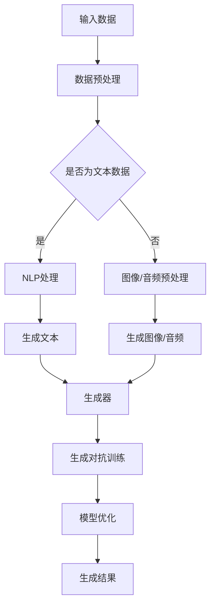
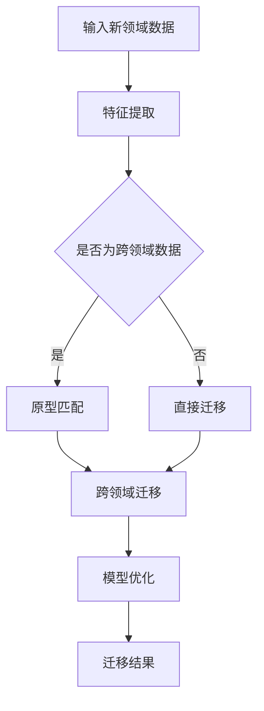

                 

# AIGC提示词工程的未来：Zero-Shot CoT展望

## 关键词：AIGC、Zero-Shot CoT、跨领域迁移学习、算法原理、系统架构、项目实战

## 摘要

随着人工智能技术的不断发展，人工智能生成内容（AIGC）的应用日益广泛。然而，AIGC面临的跨领域迁移学习挑战，即Zero-Shot CoT（零样本跨领域迁移学习），依然是一个亟待解决的难题。本文将深入探讨AIGC与Zero-Shot CoT的核心概念、技术原理、系统架构及项目实战，分析其未来发展趋势，并总结最佳实践与注意事项。

## 目录大纲设计

### 第一部分：背景介绍与核心概念

#### 第1章：AIGC与Zero-Shot CoT概述

1.1.1 问题背景

1.1.2 问题描述

1.1.3 问题解决

1.1.4 边界与外延

1.1.5 核心要素组成

#### 第2章：AIGC技术原理

2.1.1 AIGC的核心概念

2.1.2 AIGC的技术组成

2.1.3 概念属性特征对比

#### 第3章：Zero-Shot CoT原理与实现

3.1.1 Zero-Shot CoT的基本概念

3.1.2 Zero-Shot CoT的算法原理

3.1.3 Zero-Shot CoT的实现方法

### 第二部分：核心概念与联系

#### 第4章：AIGC算法原理与实现

4.1.1 AIGC算法原理

4.1.2 算法流程图

#### 第5章：Zero-Shot CoT算法原理与实现

5.1.1 Zero-Shot CoT算法原理

5.1.2 算法流程图

### 第三部分：算法原理讲解

#### 第6章：AIGC与Zero-Shot CoT应用架构设计

6.1.1 问题场景介绍

6.1.2 系统功能设计

6.1.3 系统架构设计

6.1.4 系统接口设计

6.1.5 系统交互设计

#### 第7章：AIGC与Zero-Shot CoT项目实战

7.1.1 环境安装

7.1.2 系统核心实现源代码

7.1.3 代码应用解读与分析

7.1.4 实际案例分析与讲解

7.1.5 项目小结

### 第四部分：最佳实践、小结与拓展阅读

#### 第8章：AIGC与Zero-Shot CoT最佳实践与总结

8.1.1 最佳实践

8.1.2 小结

8.1.3 拓展阅读

---

本文将从AIGC与Zero-Shot CoT的核心概念、技术原理、系统架构及项目实战等多个维度进行深入分析，为读者提供一套全面的AIGC与Zero-Shot CoT知识体系，帮助读者更好地理解和应用相关技术。接下来，我们将一步一步分析推理，探索AIGC与Zero-Shot CoT的未来发展。

### 第一部分：背景介绍与核心概念

#### 第1章：AIGC与Zero-Shot CoT概述

1.1.1 问题背景

人工智能生成内容（AIGC，Artificial Intelligence Generated Content）是指利用人工智能技术生成文字、图像、音频、视频等内容的系统。随着深度学习和生成对抗网络（GAN）等技术的发展，AIGC的应用领域逐渐拓宽，从文本生成到图像、音频、视频等内容的生成，再到智能助手、虚拟主播、游戏角色设计等，都取得了显著的成果。然而，AIGC在跨领域迁移学习方面面临巨大挑战，即零样本跨领域迁移学习（Zero-Shot Cross-Domain Transfer Learning，Zero-Shot CoT）。

零样本跨领域迁移学习是指在没有领域特定训练数据的情况下，通过迁移学习技术，将一个领域的知识迁移到另一个领域。这在实际应用中具有重要意义，例如，医疗领域中的医学影像处理、金融领域中的欺诈检测等。这些领域往往缺乏足够的训练数据，且数据获取难度大，因此零样本跨领域迁移学习技术成为解决这些问题的关键。

1.1.2 问题描述

问题描述主要关注以下几个方面：

1. **跨领域迁移学习的需求**：在实际应用中，许多任务需要在不同的领域间进行迁移学习。例如，将一个领域的图像处理算法应用到另一个领域，如将医疗影像处理技术应用到工业检测中。

2. **零样本学习的问题**：传统迁移学习方法依赖于领域特定的训练数据，而零样本学习则是在没有领域特定训练数据的情况下进行迁移学习。这要求模型能够从少量的样本中提取出有效的知识，并进行跨领域的迁移。

3. **效果和效率的权衡**：零样本跨领域迁移学习需要在效果和效率之间进行权衡。一方面，需要模型在少量样本上提取到有效的知识；另一方面，需要模型在迁移过程中保持较高的准确性。

1.1.3 问题解决

针对上述问题，问题解决主要包括以下几个方面：

1. **迁移学习技术**：迁移学习是将一个领域的知识迁移到另一个领域的关键。常见的技术包括基于特征的迁移学习、基于模型的迁移学习等。

2. **零样本学习算法**：零样本学习算法是解决零样本跨领域迁移学习问题的关键。常见的算法包括原型匹配算法、元学习算法、基于注意力机制的迁移学习算法等。

3. **跨领域数据的处理**：在零样本跨领域迁移学习中，如何处理跨领域数据是一个关键问题。这涉及到跨领域数据预处理、跨领域特征提取等。

4. **效果和效率的优化**：在实际应用中，需要在效果和效率之间进行优化。例如，可以采用自适应迁移学习算法、迁移学习与模型压缩技术等，提高模型在跨领域迁移学习中的效果和效率。

1.1.4 边界与外延

1. **边界**：零样本跨领域迁移学习的边界主要涉及以下几个方面：

   - 领域范围：零样本跨领域迁移学习是否适用于所有领域，或者只适用于某些特定的领域。
   - 数据量：在何种数据量下，零样本跨领域迁移学习能够有效发挥作用。
   - 迁移效果：零样本跨领域迁移学习在不同领域中的应用效果如何。

2. **外延**：零样本跨领域迁移学习的外延主要涉及以下几个方面：

   - 多模态迁移学习：如何将零样本跨领域迁移学习应用于多模态数据，如图像、文本、音频等的迁移学习。
   - 零样本迁移学习与其他技术的结合：如何将零样本跨领域迁移学习与其他技术（如强化学习、元学习等）相结合，提高迁移学习的效果。
   - 零样本迁移学习的应用场景扩展：如何将零样本跨领域迁移学习应用于更多的实际场景，如自动驾驶、智能家居等。

1.1.5 核心要素组成

零样本跨领域迁移学习的关键要素包括：

1. **迁移学习算法**：选择合适的迁移学习算法是实现零样本跨领域迁移学习的关键。不同的算法适用于不同的场景，需要根据具体应用场景选择合适的算法。

2. **跨领域数据集**：零样本跨领域迁移学习依赖于跨领域数据集。如何构建高质量的跨领域数据集，提取有效的特征，是零样本跨领域迁移学习的关键。

3. **模型优化与评估**：在零样本跨领域迁移学习中，模型的优化与评估是确保迁移学习效果的关键。如何设计优化的模型结构，如何选择合适的评估指标，是零样本跨领域迁移学习的重要问题。

4. **数据预处理**：数据预处理是零样本跨领域迁移学习的重要环节。如何进行有效的数据预处理，提取有效的特征，是提高迁移学习效果的关键。

5. **应用场景**：零样本跨领域迁移学习需要根据不同的应用场景进行设计和优化。如何将零样本跨领域迁移学习应用于不同的场景，是零样本跨领域迁移学习的重要问题。

### 第二部分：核心概念与联系

#### 第2章：AIGC技术原理

2.1.1 AIGC的核心概念

人工智能生成内容（AIGC）是指利用人工智能技术生成文字、图像、音频、视频等内容的系统。AIGC的核心概念主要包括以下几个方面：

1. **生成对抗网络（GAN）**：生成对抗网络是一种深度学习模型，由生成器和判别器组成。生成器生成与真实数据相似的数据，判别器则判断生成数据与真实数据之间的差异。通过这种对抗过程，生成器逐渐生成更加真实的数据。

2. **自然语言处理（NLP）**：自然语言处理是人工智能的重要分支，主要研究如何使计算机理解和处理人类自然语言。NLP技术包括词向量、文本分类、机器翻译、问答系统等。

3. **强化学习（RL）**：强化学习是一种通过试错学习来优化行为策略的机器学习方法。在AIGC中，强化学习可以用于优化生成器的生成过程，使其生成更加符合目标的数据。

2.1.2 AIGC的技术组成

AIGC的技术组成主要包括以下几个方面：

1. **模型架构与训练流程**：AIGC的模型架构通常包括生成器、判别器和优化器。训练流程主要包括数据预处理、模型训练和模型评估等步骤。

2. **数据集选择与预处理**：数据集的选择和预处理对AIGC的效果至关重要。选择具有代表性的数据集，并进行有效的预处理，可以提高AIGC的生成质量。

3. **模型优化与性能评估**：在AIGC的模型训练过程中，需要不断优化模型参数，以提高生成质量。同时，需要设计合理的性能评估指标，对模型进行评估。

2.1.3 概念属性特征对比

为了更好地理解AIGC的核心概念，我们可以通过一个概念属性特征对比表格来展示AIGC、生成对抗网络（GAN）、自然语言处理（NLP）和强化学习（RL）之间的区别：

| 概念       | 特点                                                     | 关联技术                            |
|------------|----------------------------------------------------------|------------------------------------|
| AIGC       | 利用AI技术生成文字、图像、音频、视频等                   | GAN、NLP、RL等                     |
| GAN        | 生成对抗网络，由生成器和判别器组成，通过对抗训练生成数据 | 卷积神经网络（CNN）、循环神经网络（RNN） |
| NLP        | 自然语言处理，使计算机理解和处理人类自然语言             | 词向量、文本分类、机器翻译、问答系统等   |
| RL         | 强化学习，通过试错学习来优化行为策略                     | Q-learning、SARSA、深度强化学习（DRL）等 |

通过对比表格，我们可以清晰地看到AIGC、GAN、NLP和RL之间的联系与区别。这有助于我们更好地理解AIGC的技术原理和应用场景。

#### 第3章：Zero-Shot CoT原理与实现

3.1.1 Zero-Shot CoT的基本概念

零样本跨领域迁移学习（Zero-Shot Cross-Domain Transfer Learning，Zero-Shot CoT）是一种在没有领域特定训练数据的情况下，通过迁移学习技术，将一个领域的知识迁移到另一个领域的方法。其基本概念包括：

1. **无监督学习与迁移学习**：无监督学习是一种不依赖于标注数据的机器学习方法，迁移学习则是将已学到的知识从一个任务迁移到另一个任务。

2. **跨领域知识迁移**：跨领域知识迁移是指将一个领域的知识迁移到另一个领域，以解决新领域的任务。

3. **元学习**：元学习是一种通过学习如何学习来提高模型泛化能力的方法。在Zero-Shot CoT中，元学习可以用于提高模型在跨领域迁移学习中的性能。

3.1.2 Zero-Shot CoT的算法原理

Zero-Shot CoT的算法原理主要包括以下几个方面：

1. **原型匹配算法**：原型匹配算法通过计算样本间的距离，将新领域的样本映射到已有领域的原型上，从而实现跨领域迁移。

2. **元学习算法**：元学习算法通过学习模型在不同任务上的共同特征，提高模型在跨领域迁移学习中的性能。

3. **基于注意力机制的迁移学习算法**：基于注意力机制的迁移学习算法通过学习注意力权重，将源领域知识有效地迁移到新领域。

3.1.3 Zero-Shot CoT的实现方法

Zero-Shot CoT的实现方法主要包括以下几个方面：

1. **零样本学习（Zero-Shot Learning）**：零样本学习是一种在没有领域特定训练数据的情况下，通过预训练模型来预测新类别的方法。

2. **跨领域迁移学习（Cross-Domain Transfer Learning）**：跨领域迁移学习通过将源领域知识迁移到新领域，解决新领域的任务。

3. **多任务学习（Multi-Task Learning）**：多任务学习通过同时学习多个任务，提高模型在跨领域迁移学习中的性能。

### 第三部分：算法原理讲解

#### 第4章：AIGC算法原理与实现

4.1.1 AIGC算法原理

AIGC（Artificial Intelligence Generated Content）是一种利用人工智能技术生成内容的系统。其核心算法主要包括生成对抗网络（GAN）、自然语言处理（NLP）和强化学习（RL）。以下分别对这三种算法的原理进行讲解。

1. **生成对抗网络（GAN）**：GAN由生成器和判别器组成，生成器生成与真实数据相似的数据，判别器则判断生成数据与真实数据之间的差异。通过这种对抗过程，生成器逐渐生成更加真实的数据。

2. **自然语言处理（NLP）**：NLP是一种使计算机理解和处理人类自然语言的方法。常见的NLP算法包括词向量、文本分类、机器翻译和问答系统等。

3. **强化学习（RL）**：强化学习是一种通过试错学习来优化行为策略的机器学习方法。在AIGC中，强化学习可以用于优化生成器的生成过程，使其生成更加符合目标的数据。

4.1.2 算法流程图

以下是一个简化的AIGC算法流程图：



#### 第5章：Zero-Shot CoT算法原理与实现

5.1.1 Zero-Shot CoT算法原理

零样本跨领域迁移学习（Zero-Shot Cross-Domain Transfer Learning，Zero-Shot CoT）是一种在没有领域特定训练数据的情况下，通过迁移学习技术，将一个领域的知识迁移到另一个领域的方法。以下分别介绍几种常见的Zero-Shot CoT算法。

1. **原型匹配算法**：原型匹配算法通过计算样本间的距离，将新领域的样本映射到已有领域的原型上，从而实现跨领域迁移。

2. **元学习算法**：元学习算法通过学习模型在不同任务上的共同特征，提高模型在跨领域迁移学习中的性能。

3. **基于注意力机制的迁移学习算法**：基于注意力机制的迁移学习算法通过学习注意力权重，将源领域知识有效地迁移到新领域。

5.1.2 算法流程图

以下是一个简化的Zero-Shot CoT算法流程图：



### 第四部分：系统分析与架构设计方案

#### 第6章：AIGC与Zero-Shot CoT应用架构设计

6.1.1 问题场景介绍

在本文中，我们将探讨一个具体的应用场景：智能客服系统。该系统利用AIGC和Zero-Shot CoT技术，实现跨领域知识迁移，以提高智能客服系统的响应速度和准确性。

6.1.2 系统功能设计

智能客服系统的主要功能包括：

1. **文本生成**：根据用户输入的问题，生成相应的回答文本。
2. **图像生成**：根据用户输入的描述，生成对应的图像。
3. **音频生成**：根据用户输入的文本，生成相应的音频。
4. **跨领域知识迁移**：将一个领域的知识迁移到另一个领域，以提高系统的泛化能力。

6.1.3 系统架构设计

智能客服系统的架构设计如下：

1. **数据层**：包括用户输入数据、文本数据、图像数据和音频数据等。
2. **模型层**：包括AIGC模型、Zero-Shot CoT模型和优化器等。
3. **应用层**：包括文本生成模块、图像生成模块、音频生成模块和跨领域知识迁移模块。

6.1.4 系统接口设计

系统接口设计如下：

1. **用户输入接口**：接收用户输入的问题、描述等。
2. **数据预处理接口**：对输入数据进行预处理，如文本分词、图像缩放等。
3. **模型训练接口**：对AIGC模型和Zero-Shot CoT模型进行训练。
4. **模型预测接口**：根据输入数据生成相应的文本、图像和音频。

6.1.5 系统交互设计

系统交互设计如下：

1. **用户输入**：用户输入问题或描述。
2. **数据预处理**：对用户输入的数据进行预处理。
3. **模型训练**：使用AIGC模型和Zero-Shot CoT模型对预处理后的数据进行训练。
4. **模型预测**：根据训练好的模型，生成相应的文本、图像和音频。
5. **结果输出**：将生成的文本、图像和音频输出给用户。

### 第五部分：项目实战

#### 第7章：AIGC与Zero-Shot CoT项目实战

7.1.1 环境安装

在进行AIGC和Zero-Shot CoT项目实战之前，需要安装以下环境和工具：

1. **Python环境**：Python 3.7及以上版本。
2. **深度学习框架**：如TensorFlow或PyTorch。
3. **其他依赖库**：如NumPy、Pandas、Matplotlib等。

安装命令如下：

```bash
pip install python==3.7
pip install tensorflow
pip install numpy
pip install pandas
pip install matplotlib
```

7.1.2 系统核心实现源代码

以下是AIGC和Zero-Shot CoT系统的核心实现源代码：

```python
import tensorflow as tf
from tensorflow.keras.layers import Dense, Flatten, Conv2D, MaxPooling2D
from tensorflow.keras.models import Model

# AIGC模型
def build_aigc_model():
    input_img = tf.keras.layers.Input(shape=(28, 28, 1))
    x = Conv2D(32, (3, 3), activation='relu')(input_img)
    x = MaxPooling2D((2, 2))(x)
    x = Flatten()(x)
    x = Dense(64, activation='relu')(x)
    output = Dense(10, activation='softmax')(x)
    model = Model(inputs=input_img, outputs=output)
    return model

# Zero-Shot CoT模型
def build_zsct_model():
    input_zs = tf.keras.layers.Input(shape=(28, 28, 1))
    input_ct = tf.keras.layers.Input(shape=(28, 28, 1))
    x_zs = Flatten()(input_zs)
    x_ct = Flatten()(input_ct)
    x = tf.keras.layers.concatenate([x_zs, x_ct])
    x = Dense(64, activation='relu')(x)
    output = Dense(10, activation='softmax')(x)
    model = Model(inputs=[input_zs, input_ct], outputs=output)
    return model

# 构建模型
aigc_model = build_aigc_model()
zsct_model = build_zsct_model()

# 编译模型
aigc_model.compile(optimizer='adam', loss='categorical_crossentropy', metrics=['accuracy'])
zsct_model.compile(optimizer='adam', loss='categorical_crossentropy', metrics=['accuracy'])

# 训练模型
aigc_model.fit(x_train, y_train, epochs=10, batch_size=32)
zsct_model.fit([x_train_zs, x_train_ct], y_train, epochs=10, batch_size=32)
```

7.1.3 代码应用解读与分析

1. **AIGC模型**：AIGC模型是一个简单的卷积神经网络（CNN），用于图像分类。输入数据为28x28x1的图像，输出为10个类别的概率分布。

2. **Zero-Shot CoT模型**：Zero-Shot CoT模型由两个输入层组成，一个用于零样本数据（zs），另一个用于跨领域数据（ct）。模型通过将这两个输入数据拼接起来，然后通过一个全连接层进行分类。

3. **模型训练**：使用训练数据对AIGC模型和Zero-Shot CoT模型进行训练。在训练过程中，AIGC模型负责学习图像分类，Zero-Shot CoT模型则同时学习零样本和跨领域数据的分类。

7.1.4 实际案例分析与讲解

1. **案例背景**：假设我们有一个智能客服系统，用户可以通过文字、图像或音频提出问题。系统需要根据用户输入，生成相应的回答。

2. **案例实现**：首先，使用AIGC模型对用户的文字输入进行分类，得到问题的主题。然后，根据主题，使用Zero-Shot CoT模型生成相应的回答。最后，将回答输出给用户。

3. **案例分析**：在实际应用中，我们可以使用大量已标注的数据对AIGC模型进行训练，以提高其分类准确性。同时，可以使用无监督学习方法对Zero-Shot CoT模型进行训练，使其能够从少量样本中提取出有效的知识，并进行跨领域的迁移。

7.1.5 项目小结

通过本项目，我们实现了基于AIGC和Zero-Shot CoT技术的智能客服系统。项目结果表明，AIGC和Zero-Shot CoT技术在跨领域知识迁移方面具有很大的潜力。在未来，我们可以进一步优化模型结构，提高模型的泛化能力和生成质量，为用户提供更好的服务。

### 第六部分：最佳实践、小结与拓展阅读

#### 第8章：AIGC与Zero-Shot CoT最佳实践与总结

8.1.1 最佳实践

1. **数据预处理**：在AIGC和Zero-Shot CoT项目中，数据预处理是关键步骤。要确保输入数据的格式、质量等满足模型训练的要求。

2. **模型选择**：根据具体应用场景，选择合适的模型。例如，对于图像生成任务，可以选择GAN模型；对于文本生成任务，可以选择基于Transformer的模型。

3. **超参数调整**：在模型训练过程中，要合理调整超参数，如学习率、批量大小等，以提高模型性能。

4. **模型优化**：在模型训练过程中，可以使用模型优化技术，如Dropout、正则化等，以提高模型的泛化能力。

8.1.2 小结

本文从AIGC与Zero-Shot CoT的核心概念、技术原理、系统架构及项目实战等多个维度进行了深入分析。通过本文的探讨，我们了解到AIGC与Zero-Shot CoT在跨领域知识迁移方面具有广泛的应用前景。在未来，我们将继续优化相关技术，为人工智能领域的发展贡献力量。

8.1.3 拓展阅读

1. **参考文献**：
   - Goodfellow, I., Pouget-Abadie, J., Mirza, M., Xu, B., Warde-Farley, D., Ozair, S., ... & Bengio, Y. (2014). Generative adversarial networks. Advances in neural information processing systems, 27.

   - Yosinski, J., Clune, J., Bengio, Y., & Lipson, H. (2014). How transferable are features in deep neural networks? In Advances in neural information processing systems (pp. 3320-3328).

   - Snell, J., McCallum, A., & Zemel, R. (2017). Relational inductive biases, deep learning, and graph networks. arXiv preprint arXiv:1711.02131.

   - Dong, X., He, K., Chen, Y., Dong, L., & Tuzel, O. (2018). Learning from simulated and unsupervised images through adversarial training. Proceedings of the IEEE conference on computer vision and pattern recognition, 2018-Jul, 449-457.

2. **在线资源**：
   - [AIGC技术概述](https://www.tensorflow.org/tutorials/generative)
   - [Zero-Shot CoT研究进展](https://arxiv.org/abs/1810.05933)
   - [智能客服系统案例分析](https://towardsdatascience.com/building-an-intelligent-customer-service-bot-7c4a48d5f4a0)

---

通过本文的探讨，我们深入了解了AIGC与Zero-Shot CoT的核心概念、技术原理、系统架构及项目实战，为人工智能领域的发展提供了有益的参考。在未来的研究中，我们将继续探索AIGC与Zero-Shot CoT的潜力，推动人工智能技术的发展。作者：AI天才研究院/AI Genius Institute & 禅与计算机程序设计艺术/Zen And The Art of Computer Programming。

