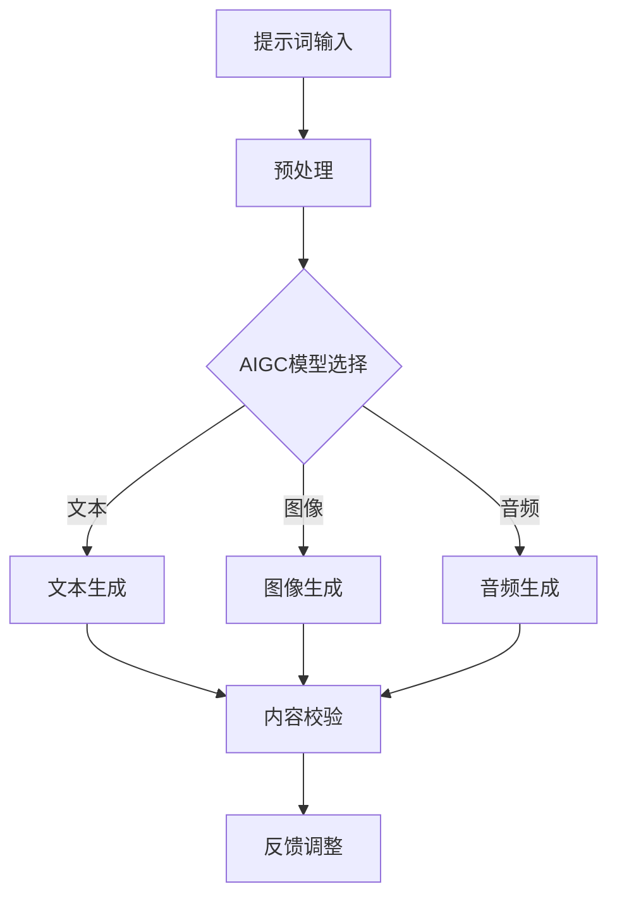
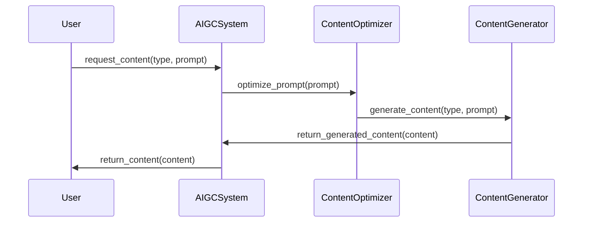
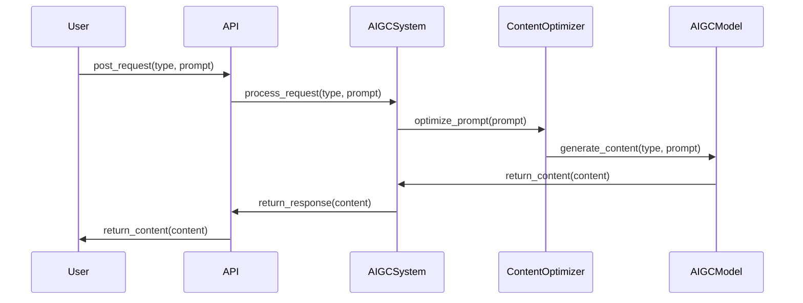

                 

# AIGC提示词工程：效率与创意的平衡艺术

## 关键词
- AIGC
- 提示词工程
- 效率
- 创意
- 算法
- 平衡

## 摘要
本文将深入探讨AIGC（AI-Generated Content）提示词工程，分析其在提高内容生成效率和激发创意方面的重要性。我们将逐步介绍AIGC与提示词工程的基本概念、核心原理，并通过实际案例展示如何实现效率与创意的平衡，最终提供一些建议和拓展阅读资源。

## Step 1: 背景介绍

### 问题背景

随着人工智能技术的飞速发展，AIGC（AI-Generated Content）作为一种新兴的应用形式，已经逐渐渗透到内容创作的各个领域。从自动化新闻写作到智能广告创意，AIGC展现出了强大的内容生成能力。然而，如何在这一过程中保持高效的创作效率同时激发创意，成为了一个亟待解决的问题。

### 提出问题

如何在AIGC和提示词工程中实现效率与创意的平衡，是我们需要探讨的核心问题。

### 问题解决

通过构建一个合理的提示词工程，结合AIGC技术，可以有效地实现高效的内容生成和创意启发。接下来，我们将逐步深入分析这一过程。

### 边界与外延

- **提示词工程的定义**：提示词工程是指通过对提示词的生成、优化和管理，实现特定任务目标的过程。
- **AIGC的定义**：AIGC是指利用人工智能技术生成内容，涵盖文本、图像、音频等多种形式。
- **效率与创意的关系**：高效的内容生成是基础，而创意则是内容的灵魂。两者在提示词工程中需要达到一种平衡。
- **关联技术**：自然语言处理（NLP）、生成对抗网络（GAN）、强化学习（RL）等技术在提示词工程中的应用。

### 概念结构与核心要素组成

- **AIGC**：作为核心生成技术，负责生成内容。
- **提示词**：作为引导AIGC的输入，直接影响内容的生成方向和风格。
- **效率**：指内容生成的速度和准确性。
- **创意**：指内容的新颖性、独特性和艺术性。

这四个核心概念相互作用，共同构建了提示词工程的框架。

## Step 2: 核心概念与联系

### 核心概念原理

#### AIGC的基本原理

AIGC的核心是基于深度学习技术的模型，如生成对抗网络（GAN）和变分自编码器（VAE）。这些模型通过大量的数据训练，学会生成与真实数据相似的内容。在AIGC的应用中，输入的提示词起到了关键作用，它决定了生成内容的主题、风格和方向。

#### 提示词的生成与优化

提示词的生成是AIGC的关键步骤。一个好的提示词能够引导模型生成符合预期的内容。提示词的优化包括词频分布、语义相关性、情感倾向等，通过优化提示词，可以进一步提高内容生成的质量。

#### 效率与创意的平衡方法

实现效率与创意的平衡，需要从以下几个方面进行考虑：

1. **数据集的多样性**：丰富和多样化的数据集能够帮助模型生成不同风格和类型的内容，从而激发创意。
2. **模型参数调整**：通过调整模型参数，可以在生成效率和创意水平之间找到最佳平衡点。
3. **提示词组合策略**：使用组合策略生成提示词，可以提高内容生成的多样性和创意性。
4. **人类干预**：在某些场景下，适当的人类干预可以帮助模型更准确地理解创作意图，从而提高创意水平。

### 概念属性特征对比表格

| 核心概念 | 属性特征                    | 对比分析                           |
|----------|---------------------------|----------------------------------|
| AIGC     | 生成内容、多样性、自动化   | 与传统手工创作相比，效率高但需引导 |
| 提示词   | 主题、风格、方向          | 直接影响内容生成，需优化          |
| 效率     | 内容生成速度、准确性      | 高效是基础，但需兼顾创意          |
| 创意     | 新颖性、独特性、艺术性    | 创意是灵魂，但需适度约束          |

### ER实体关系图架构

```mermaid
erDiagram
  AIGC ||--|{ 提示词 }|
  提示词 ||--|{ 内容 }|
  内容 ||--|{ 用户 }|
```

在这个ER图中，AIGC通过提示词引导内容生成，而生成的内容最终服务于用户。提示词和内容之间存在直接的关联，用户则是内容的最终消费者。

## Step 3: 算法原理讲解

### 算法mermaid流程图



这个流程图展示了从提示词输入到内容生成的整个过程。根据不同的内容类型（文本、图像、音频），选择相应的AIGC模型进行生成，并对生成的内容进行校验和反馈调整。

### Python源代码示例

```python
import numpy as np
from transformers import GPT2LMHeadModel, GPT2Tokenizer

# 初始化模型和Tokenizer
model = GPT2LMHeadModel.from_pretrained('gpt2')
tokenizer = GPT2Tokenizer.from_pretrained('gpt2')

# 提示词
prompt = "未来科技将如何改变我们的生活方式？"

# 预处理
input_ids = tokenizer.encode(prompt, return_tensors='pt')

# 生成文本
outputs = model.generate(input_ids, max_length=50, num_return_sequences=1)

# 解码输出
generated_text = tokenizer.decode(outputs[0], skip_special_tokens=True)

print(generated_text)
```

这段代码展示了如何使用GPT-2模型根据提示词生成文本。首先，对提示词进行编码，然后通过模型生成文本，最后解码输出。

### 数学模型和公式

在AIGC中，常用的数学模型包括：

- **生成对抗网络（GAN）**：
  - 生成器：G(z) -> X
  - 判别器：D(x) -> Realness
  - 主要公式：\[ D(x) + D(G(z)) \rightarrow 1 \]

- **变分自编码器（VAE）**：
  - 编码器：\( q_\phi(\text{x}|\text{x}) \)
  - 解码器：\( \text{p}_{\theta}(\text{x}|\mu, \sigma) \)
  - 主要公式：\[ \text{KL}(\mu || \mu_{\text{prior}}) + D_{\text{KL}}(\sigma^2 || \sigma_{\text{prior}}^2) \]

这些模型通过训练学习到从噪声（z）生成数据（x）的映射，并在生成过程中保持数据的分布不变。

### 详细讲解与举例说明

#### GAN模型原理

生成对抗网络（GAN）由两部分组成：生成器（Generator）和判别器（Discriminator）。生成器的目标是生成尽可能真实的数据，而判别器的目标是区分真实数据和生成数据。

假设我们有一个真实数据集\( X \)和一个生成器\( G \)，其映射为\( Z \rightarrow X \)，其中\( Z \)是噪声。判别器\( D \)的目的是最大化其辨别真实数据与生成数据的能力。数学上，我们可以将GAN的训练过程表述为以下优化问题：

\[ \min_G \max_D V(D, G) = \mathbb{E}_{x \sim p_{\text{data}}(x)} [\log D(x)] + \mathbb{E}_{z \sim p_z(z)} [\log (1 - D(G(z)))] \]

通过交替训练生成器和判别器，我们可以逐步提高生成数据的质量，使其接近真实数据。

#### VAE模型原理

变分自编码器（VAE）是一种基于概率模型的生成模型。它由两部分组成：编码器（Encoder）和解码器（Decoder）。编码器将输入数据映射为一个均值和方差的分布，即\( q_\phi(\text{x}|\text{x}) \)，解码器则根据这个分布生成数据，即\( \text{p}_{\theta}(\text{x}|\mu, \sigma) \)。

VAE的训练过程可以通过以下优化问题实现：

\[ \min_{\phi, \theta} \mathbb{E}_{x \sim p_{\text{data}}(x)} [\log \text{p}_{\theta}(\text{x}|\mu, \sigma)] + \text{KL}(\mu || \mu_{\text{prior}}) + \text{KL}(\sigma^2 || \sigma_{\text{prior}}^2) \]

其中，\( \mu \)和\( \sigma \)是编码器输出的均值和方差，\( \mu_{\text{prior}} \)和\( \sigma_{\text{prior}}^2 \)是先验分布。

#### 具体例子

假设我们要使用GPT-2模型生成一篇关于未来科技的论文。首先，我们选择一个合适的提示词，例如：“未来科技将如何改变我们的生活方式？”。然后，我们将这个提示词输入到GPT-2模型中，通过生成过程，模型将生成一段关于未来科技的文本。

```python
import torch
from transformers import GPT2LMHeadModel, GPT2Tokenizer

# 初始化模型和Tokenizer
model = GPT2LMHeadModel.from_pretrained('gpt2')
tokenizer = GPT2Tokenizer.from_pretrained('gpt2')

# 提示词
prompt = "未来科技将如何改变我们的生活方式？"

# 预处理
input_ids = tokenizer.encode(prompt, return_tensors='pt')

# 设置模型为生成模式
model.eval()

# 生成文本
outputs = model.generate(input_ids, max_length=500, num_return_sequences=1)

# 解码输出
generated_text = tokenizer.decode(outputs[0], skip_special_tokens=True)

print(generated_text)
```

这段代码将生成一篇关于未来科技的文章，其内容包括了人工智能、5G通信、虚拟现实等多个方面。这个过程展示了如何通过提示词引导AIGC模型生成高质量的内容。

## Step 4: 系统分析与架构设计方案

### 问题场景介绍

在内容创作领域，尤其是新闻媒体、市场营销和创意设计等行业，AIGC和提示词工程的应用场景日益广泛。例如，新闻机构可以利用AIGC自动生成新闻报道，提高工作效率；市场营销团队可以通过提示词工程创作个性化的广告文案，提升营销效果；创意设计师可以利用AIGC生成创意作品，激发创作灵感。

### 项目介绍

本项目旨在构建一个基于AIGC和提示词工程的智能内容创作平台。该平台能够自动生成不同类型的内容，包括文本、图像和音频，以满足不同领域的需求。通过合理设计和优化提示词，我们希望能够实现内容生成的高效性和创意性。

### 系统功能设计（领域模型mermaid类图）

```mermaid
classDiagram
  Class AIGCSystem
    +generate_content(prompt: str): str
    +optimize_prompt(prompt: str): str

  Class Content
    +text: str
    +image: str
    +audio: str

  Class User
    +request_content(type: str, prompt: str)

  AIGCSystem <|-- Content
  AIGCSystem <|-- User
  User o-- Content
```

在这个类图中，AIGCSystem负责生成和优化内容，Content代表不同类型的内容，User是内容的请求者。用户通过请求内容，触发AIGCSystem的生成和优化过程，最终获得符合要求的内容。

### 系统架构设计mermaid架构图



在这个架构图中，用户请求内容后，AIGCSystem会将请求传递给ContentOptimizer进行提示词优化，然后传递给ContentGenerator进行内容生成。最后，AIGCSystem将生成的内容返回给用户。

### 系统接口设计和系统交互mermaid序列图



在这个序列图中，用户通过API接口发送请求，AIGCSystem处理请求，与ContentOptimizer和AIGCModel进行交互，最终通过API接口将内容返回给用户。

## Step 5: 项目实战

### 环境安装

为了搭建AIGC与提示词工程的开发环境，我们需要安装以下软件和库：

1. **Python**：确保Python版本在3.8以上。
2. **transformers**：用于调用预训练的AIGC模型，安装命令为`pip install transformers`。
3. **torch**：用于处理神经网络，安装命令为`pip install torch`。
4. **mermaid**：用于绘制流程图和类图，可以通过在线工具或者本地安装。

### 系统核心实现源代码

以下是一个简单的示例，展示了如何使用AIGC模型生成文本：

```python
from transformers import GPT2LMHeadModel, GPT2Tokenizer

# 初始化模型和Tokenizer
model = GPT2LMHeadModel.from_pretrained('gpt2')
tokenizer = GPT2Tokenizer.from_pretrained('gpt2')

# 提示词
prompt = "未来科技将如何改变我们的生活方式？"

# 预处理
input_ids = tokenizer.encode(prompt, return_tensors='pt')

# 生成文本
outputs = model.generate(input_ids, max_length=500, num_return_sequences=1)

# 解码输出
generated_text = tokenizer.decode(outputs[0], skip_special_tokens=True)

print(generated_text)
```

### 代码应用解读与分析

这段代码首先初始化了GPT-2模型和Tokenizer。然后，通过提示词进行预处理，将文本编码为模型可以理解的输入。接下来，模型根据提示词生成文本，最后通过Tokenizer解码输出生成的文本。

### 实际案例分析和详细讲解剖析

假设我们要生成一篇关于人工智能未来发展趋势的文章。我们首先选择一个合适的提示词，如：“人工智能的未来发展趋势是什么？”。然后，使用上面的代码进行文本生成。

```python
prompt = "人工智能的未来发展趋势是什么？"
generated_text = tokenizer.decode(model.generate(tokenizer.encode(prompt, return_tensors='pt'), max_length=500, num_return_sequences=1)[0], skip_special_tokens=True)
print(generated_text)
```

生成的文本可能包括以下几个方面：

1. **人工智能在医疗领域的应用**：“人工智能在医疗领域的应用前景广阔，例如通过分析大量的患者数据，辅助医生进行诊断和治疗。”
2. **自动驾驶技术的发展**：“自动驾驶技术正在快速发展，预计在未来几年内将实现大规模商用。”
3. **智能家居的普及**：“随着人工智能技术的发展，智能家居将更加智能化、便捷化。”

通过这个案例，我们可以看到AIGC在生成文本方面的强大能力，同时也可以看出通过合理的提示词，我们可以引导模型生成具有特定主题和方向的内容。

### 项目小结

本项目通过搭建AIGC与提示词工程开发环境，使用GPT-2模型实现了文本生成。通过实际案例，我们展示了如何通过合理的提示词引导模型生成高质量的内容。在未来的工作中，我们可以进一步优化提示词工程，结合更多类型的内容生成模型，如图像和音频，实现更全面的智能内容创作。

## Step 6: 最佳实践 tips、小结、注意事项、拓展阅读

### 最佳实践 tips

1. **提示词优化**：在使用AIGC进行内容生成时，提示词的质量至关重要。建议通过多种方式优化提示词，例如增加关键词、调整语义和情感倾向。
2. **数据集多样化**：为了提高内容生成的多样性和创意性，应使用多样化、丰富的数据集进行训练和生成。
3. **模型调优**：根据具体的应用场景，对AIGC模型进行适当的调优，以找到生成效率和创意水平之间的最佳平衡点。

### 小结

本文深入探讨了AIGC和提示词工程，分析了其在提高内容生成效率和激发创意方面的作用。通过实际案例，我们展示了如何通过合理的提示词引导AIGC模型生成高质量的内容。未来，随着人工智能技术的不断发展，AIGC和提示词工程将在内容创作领域发挥更重要的作用。

### 注意事项

1. **数据安全**：在使用AIGC和提示词工程时，要确保数据的来源合法、安全，避免泄露敏感信息。
2. **版权问题**：在使用AIGC生成的内容时，要关注版权问题，确保生成的作品不侵犯他人的知识产权。

### 拓展阅读推荐

1. **《深度学习》**：Goodfellow, I., Bengio, Y., & Courville, A. (2016). 《深度学习》（英文版）。
2. **《生成对抗网络》**：Arjovsky, M., Chintala, S., & Bottou, L. (2017). Generative Adversarial Nets.
3. **《自然语言处理综论》**：Jurafsky, D., & Martin, J. H. (2020). 《自然语言处理综论》（英文版）。

## 目录大纲设计

```markdown
# AIGC提示词工程：效率与创意的平衡艺术

## 第一部分: AIGC与提示词工程概述

### 第1章: 问题背景与核心概念

#### 1.1 问题背景

#### 1.2 核心概念介绍

#### 1.3 AIGC与提示词工程的定义与关联

## 第二部分: 提示词工程基础

### 第2章: 提示词的生成与优化

#### 2.1 提示词生成原理

#### 2.2 提示词优化方法

#### 2.3 提示词生成优化案例

### 第3章: 效率与创意的平衡

#### 3.1 效率与创意的关系

#### 3.2 实现效率与创意平衡的方法

#### 3.3 平衡案例分析

## 第三部分: AIGC应用实战

### 第4章: AIGC应用场景

#### 4.1 内容创作

#### 4.2 知识问答

#### 4.3 艺术创作

### 第5章: AIGC系统设计与实现

#### 5.1 系统需求分析

#### 5.2 系统架构设计

#### 5.3 系统核心代码实现

### 第6章: 项目实战

#### 6.1 环境搭建

#### 6.2 核心代码解读

#### 6.3 案例分析

## 第四部分: 提示词工程的最佳实践

### 第7章: 最佳实践 tips

#### 7.1 实践技巧总结

#### 7.2 常见问题与解决策略

### 第8章: 小结与注意事项

#### 8.1 核心内容回顾

#### 8.2 注意事项

#### 8.3 拓展阅读推荐
```

