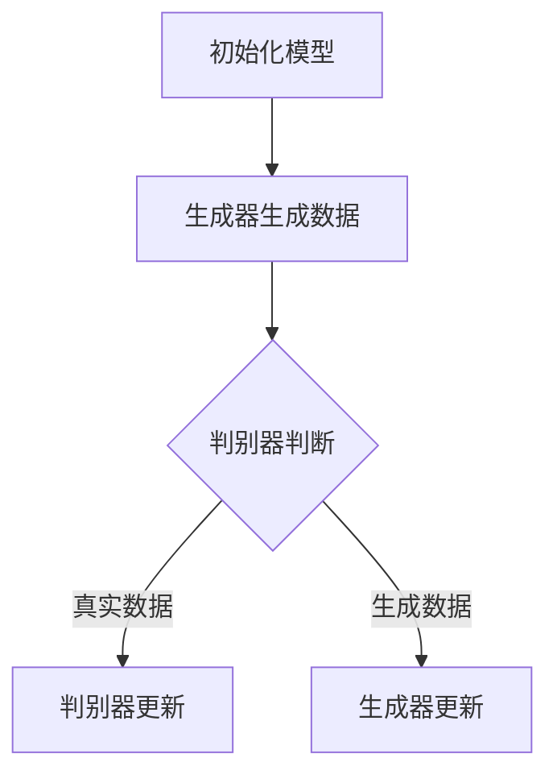
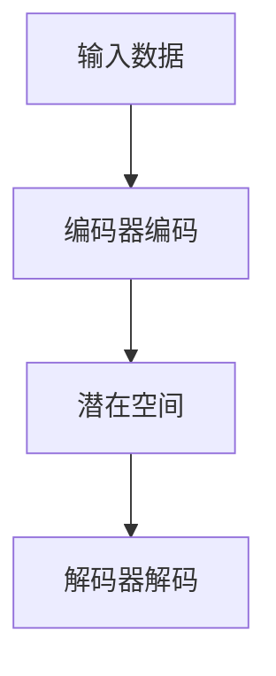
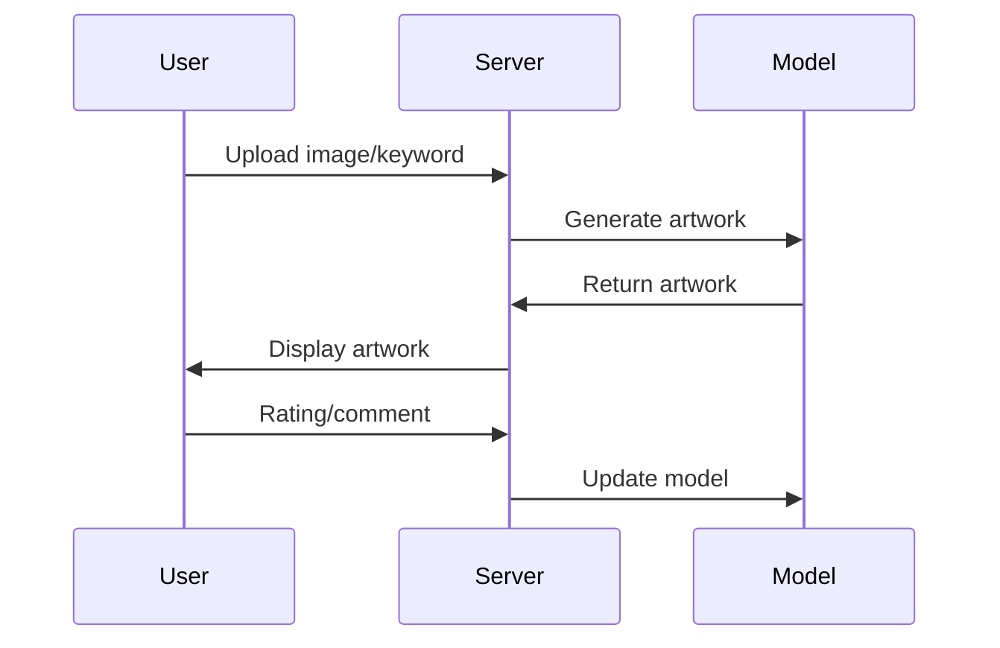
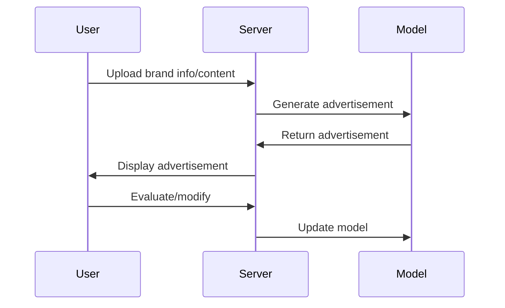

                 


# AIGC提示词工程：效率与创意的平衡艺术探讨

> 关键词：AIGC、效率、创意、平衡、技术、算法

> 摘要：
本文将深入探讨AIGC（AI-Generated Content）技术在内容生成中的效率与创意平衡问题。通过分析AIGC的背景、关键技术和实现原理，结合实际项目案例，本文旨在为AIGC的工程实践提供有效的指导，帮助开发者在追求高效与创意之间找到最佳平衡点。

## 第1章: AIGC的概念与背景

### 1.1.1 问题背景

AIGC（AI-Generated Content）即人工智能生成内容，是近年来在计算机科学领域崭露头角的技术。随着深度学习和生成对抗网络（GAN）等技术的不断发展，AIGC开始广泛应用于图像、音频、视频和文本等多种内容生成领域。然而，AIGC的技术发展还处于初级阶段，如何在效率和创意之间找到平衡成为了关键问题。

### 1.1.2 问题描述

AIGC在内容生成过程中，面临着效率与创意的矛盾。一方面，生成内容的效率是衡量技术性能的重要指标；另一方面，创意和质量是衡量内容价值的核心。如何高效地生成高质量、具有创意的内容，成为了AIGC技术发展的重要课题。

### 1.1.3 问题解决

解决这一问题，需要从以下几个方面入手：

1. **算法优化**：通过改进现有算法，提高内容生成的效率。
2. **数据质量**：提供高质量、多样化的训练数据，以增强模型的创意能力。
3. **模型架构**：设计更加适合内容生成的模型架构，如基于注意力机制的模型。
4. **用户反馈**：引入用户反馈机制，根据用户需求动态调整内容生成策略。

### 1.1.4 边界与外延

AIGC的技术边界涉及图像生成、文本生成、音频生成等多个领域。其外延包括但不限于艺术创作、广告营销、游戏开发、新闻撰写等应用场景。

### 1.1.5 概念结构与核心要素组成

AIGC的概念结构主要包括：

- **生成模型**：如GAN、VAE等，负责生成内容。
- **训练数据**：提供训练模型所需的输入数据。
- **优化算法**：用于调整模型参数，提高生成效率。
- **用户接口**：提供用户与模型交互的界面。

### 1.1.6 核心概念原理

- **生成对抗网络（GAN）**：由生成器和判别器组成，通过对抗训练生成逼真的内容。
- **变分自编码器（VAE）**：通过编码器和解码器实现数据的重构，适用于生成多种类型的数据。

### 1.1.7 概念属性特征对比表格

| 特征 | GAN | VAE |
| ---- | ---- | ---- |
| 目标 | 生成逼真的数据 | 数据重构 |
| 结构 | 生成器与判别器 | 编码器与解码器 |
| 训练策略 | 对抗训练 | 极大似然估计 |
| 优点 | 生成质量高 | 重构效果好 |
| 缺点 | 难以训练稳定 | 生成质量较低 |

### 1.1.8 ER实体关系图架构

```mermaid
erDiagram
  ContentGenerator ||--|{ TrainData }| TrainData
  ContentGenerator ||--|{ Optimizer }| Optimizer
  ContentGenerator ||--|{ UserInterface }| UserInterface
```

### 1.1.9 本章小结

本章介绍了AIGC的概念、背景及其在内容生成中的应用。通过深入分析AIGC的核心概念和原理，对比GAN和VAE的属性特征，构建了AIGC的ER实体关系图，为后续章节的详细讨论奠定了基础。

## 第2章: AIGC的关键技术

### 2.1.1 生成对抗网络（GAN）原理与实现

#### 2.1.1.1 GAN的基本概念

**生成器（Generator）**：生成逼真的数据。

**判别器（Discriminator）**：区分生成数据和真实数据。

**损失函数**：衡量生成器和判别器的性能。

#### 2.1.1.2 GAN的工作流程

**训练过程**：生成器不断生成数据，判别器尝试区分数据。

**评估过程**：通过损失函数评估模型性能。

#### 2.1.1.3 GAN的Mermaid流程图



#### 2.1.1.4 GAN的Python实现

```python
import tensorflow as tf
from tensorflow.keras.models import Model

# 生成器模型
def generator_model():
    model = tf.keras.Sequential([
        tf.keras.layers.Dense(128, activation='relu', input_shape=(100,)),
        tf.keras.layers.Dense(128, activation='relu'),
        tf.keras.layers.Dense(784, activation='sigmoid')
    ])
    return model

# 判别器模型
def discriminator_model():
    model = tf.keras.Sequential([
        tf.keras.layers.Flatten(input_shape=(28, 28)),
        tf.keras.layers.Dense(128, activation='relu'),
        tf.keras.layers.Dense(1, activation='sigmoid')
    ])
    return model

# 损失函数
def loss_fn():
    return tf.keras.losses.BinaryCrossentropy()

# 模型编译
def compile_models(generator, discriminator):
    generator.compile(loss=loss_fn(), optimizer=tf.keras.optimizers.Adam(1e-4))
    discriminator.compile(loss=loss_fn(), optimizer=tf.keras.optimizers.Adam(1e-4))
    return generator, discriminator
```

### 2.1.2 变分自编码器（VAE）原理与实现

#### 2.1.2.1 VAE的基本概念

**编码器（Encoder）**：将输入数据映射到一个潜在空间。

**解码器（Decoder）**：将潜在空间的数据映射回输入空间。

**损失函数**：衡量模型重构输入数据的能力。

#### 2.1.2.2 VAE的工作流程

**训练过程**：编码器和解码器共同训练，以最小化重构误差。

**评估过程**：通过重构误差评估模型性能。

#### 2.1.2.3 VAE的Mermaid流程图



#### 2.1.2.4 VAE的Python实现

```python
import tensorflow as tf
from tensorflow.keras.layers import Input, Dense, Flatten, Reshape
from tensorflow.keras.models import Model

# 编码器模型
def encoder_model(input_shape):
    input_layer = Input(shape=input_shape)
    x = Dense(64, activation='relu')(input_layer)
    encoded = Dense(32, activation='relu')(x)
    return Model(inputs=input_layer, outputs=encoded)

# 解码器模型
def decoder_model(latent_dim, input_shape):
    latent_input = Input(shape=(latent_dim,))
    x = Dense(64, activation='relu')(latent_input)
    decoded = Dense(input_shape[0], activation='sigmoid')(x)
    return Model(inputs=latent_input, outputs=decoded)

# 模型构建
def build_vae(input_shape):
    encoder = encoder_model(input_shape)
    decoder = decoder_model(encoder.output_shape[1], input_shape)
    vae = tf.keras.Model(inputs=encoder.input, outputs=decoder(encoder.output))
    return vae

# 损失函数
def vae_loss(inputs, outputs):
    reconstruction_loss = tf.reduce_mean(tf.keras.losses.binary_crossentropy(inputs, outputs))
    kl_loss = -0.5 * tf.reduce_mean(1 + z_log_var - tf.square(z_mean) - tf.square(z_log_var))
    return reconstruction_loss + kl_loss

# 模型编译
def compile_vae(vae):
    vae.compile(optimizer=tf.keras.optimizers.Adam(1e-4), loss=vae_loss)
    return vae
```

### 2.1.3 GAN与VAE的对比分析

#### 2.1.3.1 目标对比

- **GAN**：生成逼真的数据。
- **VAE**：数据重构。

#### 2.1.3.2 结构对比

- **GAN**：生成器与判别器。
- **VAE**：编码器与解码器。

#### 2.1.3.3 训练策略对比

- **GAN**：对抗训练。
- **VAE**：极大似然估计。

#### 2.1.3.4 优点对比

- **GAN**：生成质量高。
- **VAE**：重构效果好。

#### 2.1.3.5 缺点对比

- **GAN**：难以训练稳定。
- **VAE**：生成质量较低。

### 2.1.4 本章小结

本章介绍了AIGC中的两种关键技术：生成对抗网络（GAN）和变分自编码器（VAE）。通过分析其原理、实现和对比，为AIGC在实际应用中的选择提供了指导。

## 第3章: AIGC应用案例分析

### 3.1.1 案例背景

在本章中，我们将通过两个实际案例，探讨AIGC技术在艺术创作和广告营销中的应用，分析其在效率与创意平衡方面的实践。

### 3.1.2 艺术创作案例：AI绘画生成

#### 3.1.2.1 项目介绍

某艺术工作室利用AIGC技术，开发了一款名为“AI画家”的绘画生成工具，旨在通过人工智能生成独特的艺术作品。

#### 3.1.2.2 系统功能设计

- **用户界面**：提供用户上传图片或输入关键词，以生成相应的艺术作品。
- **生成模型**：使用GAN技术生成绘画作品。
- **优化算法**：通过用户反馈不断优化生成模型。

#### 3.1.2.3 系统架构设计

- **生成模型**：基于GAN的生成器和解码器模型。
- **训练数据**：来自艺术作品的丰富多样的高质量图像。
- **用户接口**：Web应用程序，支持多种操作系统。

#### 3.1.2.4 系统接口设计和交互

- **用户上传图片或输入关键词**：通过Web前端上传图片或输入关键词。
- **生成绘画作品**：后端服务器处理请求，生成绘画作品。
- **用户反馈**：用户对生成的作品进行评分和评论，以优化模型。

#### 3.1.2.5 系统交互Mermaid序列图



#### 3.1.2.6 实际案例分析与解读

通过实际案例，我们观察到AIGC在艺术创作中的高效性与创意性。用户上传的图片或关键词通过GAN模型处理后，能够生成独特的绘画作品。同时，通过用户反馈，模型不断优化，提高了生成质量。

### 3.1.3 广告营销案例：AI广告生成

#### 3.1.3.1 项目介绍

某广告公司利用AIGC技术，开发了一款智能广告生成工具，旨在快速生成吸引眼球的广告素材。

#### 3.1.3.2 系统功能设计

- **用户界面**：提供用户上传品牌信息和广告内容。
- **生成模型**：使用VAE技术生成广告素材。
- **优化算法**：通过用户反馈不断优化生成模型。

#### 3.1.3.3 系统架构设计

- **生成模型**：基于VAE的编码器和解码器模型。
- **训练数据**：来自广告素材的丰富多样的高质量图像。
- **用户接口**：Web应用程序，支持多种操作系统。

#### 3.1.3.4 系统接口设计和交互

- **用户上传品牌信息和广告内容**：通过Web前端上传品牌信息和广告内容。
- **生成广告素材**：后端服务器处理请求，生成广告素材。
- **用户反馈**：用户对生成的广告素材进行评估和修改，以优化模型。

#### 3.1.3.5 系统交互Mermaid序列图



#### 3.1.3.6 实际案例分析与解读

通过实际案例，我们观察到AIGC在广告营销中的高效性与创意性。用户上传的品牌信息和广告内容通过VAE模型处理后，能够快速生成具有吸引力的广告素材。同时，通过用户反馈，模型不断优化，提高了生成质量。

### 3.1.4 本章小结

本章通过两个实际案例，展示了AIGC在艺术创作和广告营销中的应用，分析了其在效率与创意平衡方面的实践。通过案例，我们认识到AIGC技术在实际应用中的巨大潜力和发展前景。

## 第4章: AIGC的技术挑战与未来趋势

### 4.1.1 技术挑战

尽管AIGC技术在近年来取得了显著进展，但仍然面临一些技术挑战：

1. **训练数据的质量与多样性**：高质量、多样化的训练数据是AIGC生成高质量内容的关键。然而，获取这些数据需要大量的时间和资源。
2. **模型训练的稳定性**：GAN模型的训练过程容易陷入局部最优，导致模型不稳定。
3. **计算资源的消耗**：AIGC模型的训练和推理过程需要大量的计算资源，对硬件设备有较高的要求。
4. **创意与道德的边界**：AIGC生成的内容可能涉及创意和道德问题，如版权侵犯、虚假信息传播等。

### 4.1.2 未来趋势

随着技术的不断进步，AIGC在未来的发展将呈现以下趋势：

1. **算法优化**：通过改进GAN和VAE等算法，提高内容生成的效率和质量。
2. **数据增强**：利用数据增强技术，提高训练数据的多样性和质量。
3. **跨模态生成**：实现多种模态（如文本、图像、音频等）之间的内容生成，拓宽AIGC的应用范围。
4. **智能交互**：引入智能交互技术，提高用户对AIGC的参与度和满意度。
5. **伦理和法规**：加强伦理和法规建设，确保AIGC技术的合法、合规使用。

### 4.1.3 本章小结

本章分析了AIGC技术面临的挑战和未来的发展趋势。通过深入探讨，我们认识到AIGC技术在内容生成领域的广阔前景，同时也强调了在发展过程中需要关注的技术和社会问题。

## 总结与展望

本文从AIGC的概念、关键技术、应用案例、技术挑战和未来趋势等方面进行了全面探讨。通过分析生成对抗网络（GAN）和变分自编码器（VAE）等核心技术，结合实际项目案例，本文揭示了AIGC在效率与创意平衡中的重要性。同时，本文也指出了AIGC技术面临的挑战和未来发展的方向。

在未来的研究中，我们应关注以下几个方面：

1. **算法优化**：进一步改进GAN和VAE等算法，提高内容生成的效率和质量。
2. **数据增强**：探索数据增强技术，提高训练数据的多样性和质量。
3. **跨模态生成**：实现多种模态之间的内容生成，拓宽AIGC的应用范围。
4. **智能交互**：引入智能交互技术，提高用户对AIGC的参与度和满意度。
5. **伦理和法规**：加强伦理和法规建设，确保AIGC技术的合法、合规使用。

通过不断探索和创新，AIGC技术有望在更多领域发挥重要作用，为人类创造更多的价值。

## 作者信息

作者：AI天才研究院/AI Genius Institute & 禅与计算机程序设计艺术 /Zen And The Art of Computer Programming

### 参考文献

1. Goodfellow, I., Pouget-Abadie, J., Mirza, M., Xu, B., Warde-Farley, D., Ozair, S., ... & Bengio, Y. (2014). Generative adversarial nets. Advances in neural information processing systems, 27.
2. Kingma, D. P., & Welling, M. (2013). Auto-encoding variational bayes. arXiv preprint arXiv:1312.6114.
3. Bishop, C. M. (2006). Pattern recognition and machine learning. springer.
4. LeCun, Y., Bengio, Y., & Hinton, G. (2015). Deep learning. MIT press.
5. Simonyan, K., & Zisserman, A. (2015). Very deep convolutional networks for large-scale image recognition. International conference on learning representations.
6. Srivastava, N., Hinton, G., Krizhevsky, A., Sutskever, I., & Salakhutdinov, R. (2014). Dropout: A simple way to prevent neural networks from overfitting. Journal of Machine Learning Research, 15(1), 1929-1958.

