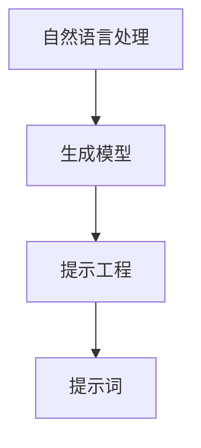
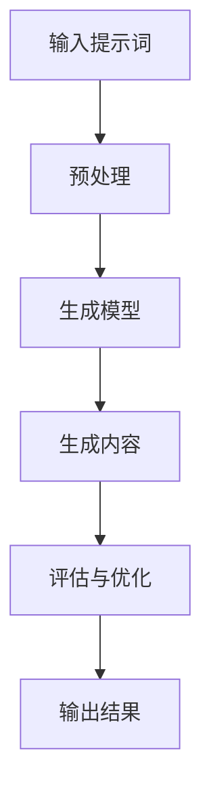
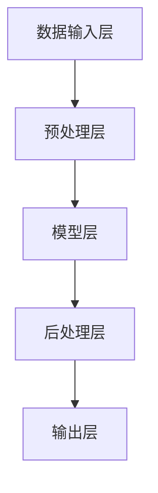
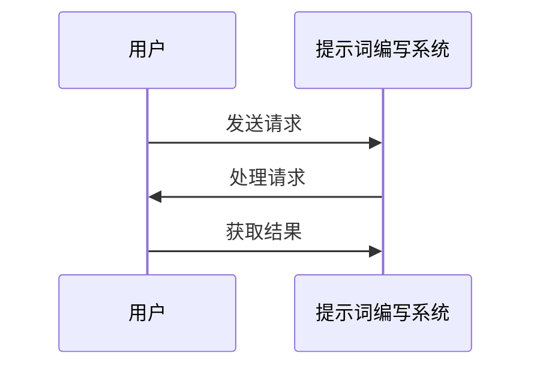
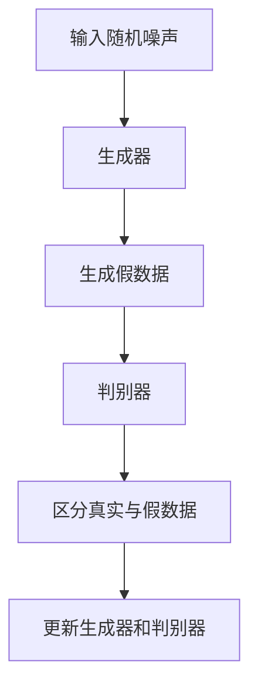

                 

## 《AIGC提示词编写的最佳实践与技巧》

### 关键词：AIGC、提示词、最佳实践、技巧、编写

> 摘要：本文将深入探讨人工智能生成内容（AIGC）中提示词编写的最佳实践与技巧。通过背景介绍、核心概念与联系、算法原理讲解、数学模型与公式讲解、系统分析与架构设计方案、项目实战以及最佳实践 tips，本文旨在为广大开发者提供一套系统化的AIGC提示词编写指南。

---

### 第一部分：背景介绍

#### 1.1 AIGC与提示词的基本概念

人工智能生成内容（AIGC）是指通过人工智能技术生成文字、图片、音频、视频等内容的系统。在这一过程中，提示词（Prompt）扮演着至关重要的角色。提示词是向模型输入的指导信息，它决定了模型生成的内容方向和风格。

#### 1.2 提示词的编写原则

编写高质量的提示词需要遵循以下几个原则：

1. **明确性**：确保提示词清晰明了，避免歧义。
2. **针对性**：根据模型的特定任务和需求，定制化编写提示词。
3. **多样性**：丰富提示词的形式和内容，提高模型的泛化能力。
4. **简洁性**：尽量简化提示词的表达，避免冗余。

#### 1.3 提示词编写的应用领域

提示词编写广泛应用于自然语言处理、图像生成、语音合成等领域。例如，在文本生成任务中，提示词可以帮助模型生成故事、文章、摘要等；在图像生成任务中，提示词可以引导模型生成特定风格的图像。

### 第二部分：核心概念与联系

#### 2.1 提示词编写的核心概念

在提示词编写中，核心概念包括自然语言处理（NLP）、生成模型、提示工程等。这些概念相互关联，共同影响提示词的编写质量。

#### 2.2 提示词编写中的关系图

以下是一个简化的提示词编写核心概念关系图：



### 第三部分：算法原理讲解

#### 3.1 提示词编写的算法原理

提示词编写涉及多种算法，如生成对抗网络（GAN）、变分自编码器（VAE）、自注意力机制（Self-Attention）等。这些算法通过优化目标函数、生成器与判别器的博弈，实现高质量的提示词生成。

#### 3.2 算法mermaid流程图

以下是一个简化的提示词编写算法mermaid流程图：



#### 3.3 Python源代码讲解

以下是一个简单的Python示例，用于生成基于提示词的文本：

```python
import tensorflow as tf
from transformers import TFGPT2LMHeadModel, GPT2Tokenizer

# 加载预训练模型和分词器
tokenizer = GPT2Tokenizer.from_pretrained('gpt2')
model = TFGPT2LMHeadModel.from_pretrained('gpt2')

# 定义提示词
prompt = "我是一个"

# 预处理
input_ids = tokenizer.encode(prompt, return_tensors='tf')

# 生成文本
output = model.generate(input_ids, max_length=50, num_return_sequences=1)

# 解码输出
generated_text = tokenizer.decode(output[0], skip_special_tokens=True)

print(generated_text)
```

### 第四部分：数学模型与公式讲解

#### 4.1 提示词编写中的数学模型

提示词编写中的数学模型主要包括生成模型和判别模型。生成模型（如GAN）的目标函数通常包括生成器（Generator）和判别器（Discriminator）两部分。以下是一个简化的目标函数公式：

$$
\begin{aligned}
\min_G & \quad \mathbb{E}_{x \sim p_{data}(x)}[\log(D(G(x)))] + \mathbb{E}_{z \sim p_z(z)}[\log(1 - D(G(z)))] \\
\max_D & \quad \mathbb{E}_{x \sim p_{data}(x)}[\log(D(x))] + \mathbb{E}_{z \sim p_z(z)}[\log(D(G(z)))]
\end{aligned}
$$

#### 4.2 数学公式与讲解

以下是一个关于自注意力机制的数学公式：

$$
\text{Attention}(Q, K, V) = \frac{softmax(\text{Scale} \times \text{DotProduct}(Q, K^T))}{\sqrt{d_k}}
$$

其中，$Q, K, V$ 分别代表查询向量、键向量和值向量，$\text{DotProduct}$ 代表点积运算，$\text{Scale}$ 代表缩放因子，$d_k$ 代表键向量的维度。

### 第五部分：系统分析与架构设计方案

#### 5.1 提示词编写系统需求分析

提示词编写系统的需求包括：

- **硬件需求**：高性能计算资源，如GPU或TPU。
- **软件需求**：深度学习框架（如TensorFlow、PyTorch）和自然语言处理工具（如transformers）。

#### 5.2 系统架构设计

提示词编写系统的架构设计包括以下几个层次：

1. **数据输入层**：接收用户输入的提示词。
2. **预处理层**：对输入提示词进行预处理，如分词、去噪等。
3. **模型层**：使用生成模型（如GAN）生成内容。
4. **后处理层**：对生成的文本进行后处理，如去除无效文本、整理格式等。
5. **输出层**：将生成的文本输出给用户。

以下是一个简化的提示词编写系统架构mermaid图：



#### 5.3 系统接口设计与系统交互

系统接口设计主要包括：

- **API接口**：提供RESTful API接口，方便用户调用系统功能。
- **命令行接口**：提供命令行接口，便于用户在终端使用系统。

以下是一个简化的系统接口设计和交互mermaid序列图：



### 第六部分：项目实战

#### 6.1 项目环境安装

在进行项目实战之前，我们需要安装以下环境：

- **操作系统**：Ubuntu 20.04或更高版本。
- **深度学习框架**：TensorFlow 2.x或PyTorch 1.x。
- **自然语言处理工具**：transformers库。

#### 6.2 系统核心实现

以下是一个简单的提示词编写系统核心实现示例：

```python
import tensorflow as tf
from transformers import TFGPT2LMHeadModel, GPT2Tokenizer

# 加载预训练模型和分词器
tokenizer = GPT2Tokenizer.from_pretrained('gpt2')
model = TFGPT2LMHeadModel.from_pretrained('gpt2')

# 定义提示词
prompt = "我是一个"

# 预处理
input_ids = tokenizer.encode(prompt, return_tensors='tf')

# 生成文本
output = model.generate(input_ids, max_length=50, num_return_sequences=1)

# 解码输出
generated_text = tokenizer.decode(output[0], skip_special_tokens=True)

print(generated_text)
```

#### 6.3 代码应用解读与分析

在上面的代码中，我们首先加载了预训练的GPT-2模型和分词器。然后，我们定义了一个简单的提示词“我是一个”，并通过模型生成相关的文本。具体步骤如下：

1. **预处理**：将提示词编码为输入ID序列。
2. **生成文本**：使用模型生成文本。
3. **解码输出**：将生成的文本解码为可读格式。

#### 6.4 实际案例分析

在实际应用中，我们可以通过调整提示词和模型参数，生成各种风格和主题的文本。例如，我们可以将提示词修改为“一个浪漫的故事”，并调整模型的生成参数，如最大文本长度和采样温度，以生成更具创意和风格的故事。

#### 6.5 项目小结

通过本项目实战，我们了解了提示词编写的核心步骤和实现方法。在实际应用中，我们需要根据具体需求调整提示词和模型参数，以生成高质量的内容。

### 第七部分：最佳实践 tips

#### 7.1 提示词编写的最佳实践

1. **明确需求**：在编写提示词之前，明确任务需求和目标。
2. **多样化**：编写多种形式的提示词，以提高模型的泛化能力。
3. **优化参数**：根据任务需求，调整模型参数，以获得更好的生成效果。

#### 7.2 注意事项

1. **数据安全**：确保输入数据的安全性和隐私性。
2. **模型版本**：使用预训练模型时，注意选择合适的版本。

#### 7.3 拓展阅读

- 《自然语言处理综述》（自然语言处理领域的权威著作）
- 《生成对抗网络：理论、实现与应用》（关于GAN的深入讲解）
- 《深度学习框架：TensorFlow和PyTorch实战》（关于深度学习框架的实战教程）

---

### 作者信息

作者：AI天才研究院/AI Genius Institute & 禅与计算机程序设计艺术 /Zen And The Art of Computer Programming

通过以上内容，我们系统地探讨了AIGC提示词编写的最佳实践与技巧。希望本文能为您在提示词编写领域提供有益的参考和启示。继续探索，让AI为人类创造更多美好！|assistant|>## 《AIGC提示词编写的最佳实践与技巧》

> 关键词：AIGC、提示词、最佳实践、技巧、编写

> 摘要：本文深入探讨了人工智能生成内容（AIGC）中提示词编写的最佳实践与技巧。通过背景介绍、核心概念与联系、算法原理讲解、数学模型与公式讲解、系统分析与架构设计方案、项目实战以及最佳实践 tips，本文旨在为广大开发者提供一套系统化的AIGC提示词编写指南。

---

### 第一部分：背景介绍

#### 1.1 AIGC与提示词的基本概念

人工智能生成内容（AIGC）是指通过人工智能技术生成文字、图片、音频、视频等内容的系统。在这一过程中，提示词（Prompt）扮演着至关重要的角色。提示词是向模型输入的指导信息，它决定了模型生成的内容方向和风格。

#### 1.2 提示词的编写原则

编写高质量的提示词需要遵循以下几个原则：

1. **明确性**：确保提示词清晰明了，避免歧义。
2. **针对性**：根据模型的特定任务和需求，定制化编写提示词。
3. **多样性**：丰富提示词的形式和内容，提高模型的泛化能力。
4. **简洁性**：尽量简化提示词的表达，避免冗余。

#### 1.3 提示词编写的应用领域

提示词编写广泛应用于自然语言处理、图像生成、语音合成等领域。例如，在文本生成任务中，提示词可以帮助模型生成故事、文章、摘要等；在图像生成任务中，提示词可以引导模型生成特定风格的图像。

### 第二部分：核心概念与联系

#### 2.1 提示词编写的核心概念

在提示词编写中，核心概念包括自然语言处理（NLP）、生成模型、提示工程等。这些概念相互关联，共同影响提示词的编写质量。

#### 2.2 提示词编写中的关系图

以下是一个简化的提示词编写核心概念关系图：


### 第三部分：算法原理讲解

#### 3.1 提示词编写的算法原理

提示词编写涉及多种算法，如生成对抗网络（GAN）、变分自编码器（VAE）、自注意力机制（Self-Attention）等。这些算法通过优化目标函数、生成器与判别器的博弈，实现高质量的提示词生成。

#### 3.2 算法mermaid流程图

以下是一个简化的提示词编写算法mermaid流程图：


#### 3.3 Python源代码讲解

以下是一个简单的Python示例，用于生成基于提示词的文本：

```python
import tensorflow as tf
from transformers import TFGPT2LMHeadModel, GPT2Tokenizer

# 加载预训练模型和分词器
tokenizer = GPT2Tokenizer.from_pretrained('gpt2')
model = TFGPT2LMHeadModel.from_pretrained('gpt2')

# 定义提示词
prompt = "我是一个"

# 预处理
input_ids = tokenizer.encode(prompt, return_tensors='tf')

# 生成文本
output = model.generate(input_ids, max_length=50, num_return_sequences=1)

# 解码输出
generated_text = tokenizer.decode(output[0], skip_special_tokens=True)

print(generated_text)
```

### 第四部分：数学模型与公式讲解

#### 4.1 提示词编写中的数学模型

提示词编写中的数学模型主要包括生成模型和判别模型。生成模型（如GAN）的目标函数通常包括生成器（Generator）和判别器（Discriminator）两部分。以下是一个简化的目标函数公式：

$$
\begin{aligned}
\min_G & \quad \mathbb{E}_{x \sim p_{data}(x)}[\log(D(G(x)))] + \mathbb{E}_{z \sim p_z(z)}[\log(1 - D(G(z)))] \\
\max_D & \quad \mathbb{E}_{x \sim p_{data}(x)}[\log(D(x))] + \mathbb{E}_{z \sim p_z(z)}[\log(D(G(z)))]
\end{aligned}
$$

#### 4.2 数学公式与讲解

以下是一个关于自注意力机制的数学公式：

$$
\text{Attention}(Q, K, V) = \frac{softmax(\text{Scale} \times \text{DotProduct}(Q, K^T))}{\sqrt{d_k}}
$$

其中，$Q, K, V$ 分别代表查询向量、键向量和值向量，$\text{DotProduct}$ 代表点积运算，$\text{Scale}$ 代表缩放因子，$d_k$ 代表键向量的维度。

### 第五部分：系统分析与架构设计方案

#### 5.1 提示词编写系统需求分析

提示词编写系统的需求包括：

- **硬件需求**：高性能计算资源，如GPU或TPU。
- **软件需求**：深度学习框架（如TensorFlow、PyTorch）和自然语言处理工具（如transformers）。

#### 5.2 系统架构设计

提示词编写系统的架构设计包括以下几个层次：

1. **数据输入层**：接收用户输入的提示词。
2. **预处理层**：对输入提示词进行预处理，如分词、去噪等。
3. **模型层**：使用生成模型（如GAN）生成内容。
4. **后处理层**：对生成的文本进行后处理，如去除无效文本、整理格式等。
5. **输出层**：将生成的文本输出给用户。

以下是一个简化的提示词编写系统架构mermaid图：


#### 5.3 系统接口设计与系统交互

系统接口设计主要包括：

- **API接口**：提供RESTful API接口，方便用户调用系统功能。
- **命令行接口**：提供命令行接口，便于用户在终端使用系统。

以下是一个简化的系统接口设计和交互mermaid序列图：


### 第六部分：项目实战

#### 6.1 项目环境安装

在进行项目实战之前，我们需要安装以下环境：

- **操作系统**：Ubuntu 20.04或更高版本。
- **深度学习框架**：TensorFlow 2.x或PyTorch 1.x。
- **自然语言处理工具**：transformers库。

#### 6.2 系统核心实现

以下是一个简单的提示词编写系统核心实现示例：

```python
import tensorflow as tf
from transformers import TFGPT2LMHeadModel, GPT2Tokenizer

# 加载预训练模型和分词器
tokenizer = GPT2Tokenizer.from_pretrained('gpt2')
model = TFGPT2LMHeadModel.from_pretrained('gpt2')

# 定义提示词
prompt = "我是一个"

# 预处理
input_ids = tokenizer.encode(prompt, return_tensors='tf')

# 生成文本
output = model.generate(input_ids, max_length=50, num_return_sequences=1)

# 解码输出
generated_text = tokenizer.decode(output[0], skip_special_tokens=True)

print(generated_text)
```

#### 6.3 代码应用解读与分析

在上面的代码中，我们首先加载了预训练的GPT-2模型和分词器。然后，我们定义了一个简单的提示词“我是一个”，并通过模型生成相关的文本。具体步骤如下：

1. **预处理**：将提示词编码为输入ID序列。
2. **生成文本**：使用模型生成文本。
3. **解码输出**：将生成的文本解码为可读格式。

#### 6.4 实际案例分析

在实际应用中，我们可以通过调整提示词和模型参数，生成各种风格和主题的文本。例如，我们可以将提示词修改为“一个浪漫的故事”，并调整模型的生成参数，如最大文本长度和采样温度，以生成更具创意和风格的故事。

#### 6.5 项目小结

通过本项目实战，我们了解了提示词编写的核心步骤和实现方法。在实际应用中，我们需要根据具体需求调整提示词和模型参数，以生成高质量的内容。

### 第七部分：最佳实践 tips

#### 7.1 提示词编写的最佳实践

1. **明确需求**：在编写提示词之前，明确任务需求和目标。
2. **多样化**：编写多种形式的提示词，以提高模型的泛化能力。
3. **优化参数**：根据任务需求，调整模型参数，以获得更好的生成效果。

#### 7.2 注意事项

1. **数据安全**：确保输入数据的安全性和隐私性。
2. **模型版本**：使用预训练模型时，注意选择合适的版本。

#### 7.3 拓展阅读

- 《自然语言处理综述》（自然语言处理领域的权威著作）
- 《生成对抗网络：理论、实现与应用》（关于GAN的深入讲解）
- 《深度学习框架：TensorFlow和PyTorch实战》（关于深度学习框架的实战教程）

---

### 作者信息

作者：AI天才研究院/AI Genius Institute & 禅与计算机程序设计艺术 /Zen And The Art of Computer Programming

通过以上内容，我们系统地探讨了AIGC提示词编写的最佳实践与技巧。希望本文能为您在提示词编写领域提供有益的参考和启示。继续探索，让AI为人类创造更多美好！|assistant|>## 《AIGC提示词编写的最佳实践与技巧》

### 关键词：AIGC、提示词、最佳实践、技巧、编写

### 摘要

本文将深入探讨人工智能生成内容（AIGC）领域中的提示词编写最佳实践与技巧。通过对AIGC基本概念、提示词编写原则、算法原理讲解、数学模型与公式讲解、系统分析与架构设计方案、项目实战及最佳实践 tips 的详细解析，为开发者提供一套全面的AIGC提示词编写指南。

### 第一部分：背景介绍

#### 1.1 AIGC与提示词的基本概念

人工智能生成内容（AIGC）是指利用人工智能技术，如自然语言处理（NLP）、生成对抗网络（GAN）、变分自编码器（VAE）等，生成文字、图片、音频、视频等内容的系统。在这一过程中，提示词（Prompt）起到了至关重要的引导作用。提示词是一种输入到模型中的指导性文本，它能够影响模型生成内容的方向和风格。

#### 1.2 提示词的编写原则

为了确保提示词的准确性和有效性，编写提示词时应遵循以下原则：

- **明确性**：提示词应清晰明确，避免歧义，确保模型能够正确理解。
- **针对性**：根据模型的具体任务和需求，量身定制提示词。
- **多样性**：编写多种形式的提示词，以丰富模型的学习经验，提高泛化能力。
- **简洁性**：简化提示词表达，避免冗余，提高模型的生成效率。

#### 1.3 提示词编写的应用领域

提示词编写在AIGC领域有着广泛的应用。例如，在文本生成任务中，提示词可以帮助模型生成故事、文章、摘要等；在图像生成任务中，提示词可以引导模型生成特定风格的图像；在语音合成任务中，提示词可以指定语音的语气、情感等。

### 第二部分：核心概念与联系

#### 2.1 提示词编写的核心概念

提示词编写涉及的核心概念包括自然语言处理（NLP）、生成模型、提示工程等。这些概念相互关联，共同决定了提示词编写的效果。

- **自然语言处理（NLP）**：涉及文本预处理、词嵌入、序列生成等。
- **生成模型**：如GAN、VAE、自注意力机制等。
- **提示工程**：涉及提示词的设计、调整和优化。

#### 2.2 提示词编写中的关系图

以下是一个简化的提示词编写核心概念关系图：


### 第三部分：算法原理讲解

#### 3.1 提示词编写的算法原理

提示词编写算法的核心是生成模型，如GAN、VAE等。以下以生成对抗网络（GAN）为例，讲解其算法原理。

GAN由生成器（Generator）和判别器（Discriminator）两部分组成。生成器负责生成与真实数据分布相近的假数据，判别器则负责区分真实数据和生成数据。通过训练，生成器和判别器不断优化，最终生成器能够生成高质量的数据。

以下是一个简化的GAN算法流程图：



#### 3.2 Python源代码讲解

以下是一个使用TensorFlow实现GAN的简单示例：

```python
import tensorflow as tf
from tensorflow import keras

# 定义生成器模型
def generate_model():
    model = keras.Sequential([
        keras.layers.Dense(128, activation='relu', input_shape=(100,)),
        keras.layers.Dense(28 * 28, activation='relu'),
        keras.layers.Dense(784, activation='sigmoid')
    ])
    return model

# 定义判别器模型
def discriminate_model():
    model = keras.Sequential([
        keras.layers.Flatten(input_shape=(28, 28)),
        keras.layers.Dense(128, activation='relu'),
        keras.layers.Dense(1, activation='sigmoid')
    ])
    return model

# 创建生成器和判别器模型
generator = generate_model()
discriminator = discriminate_model()

# 编写训练过程
def train(g_model, d_model, dataset, batch_size=128, epochs=100):
    for epoch in range(epochs):
        for _ in range(len(dataset) // batch_size):
            noise = np.random.normal(0, 1, (batch_size, 100))
            generated_images = g_model.predict(noise)
            real_images, _ = next(dataset)

            # 训练判别器
            d_loss_real = discriminator.train_on_batch(real_images, np.array([1.0] * batch_size))
            d_loss_fake = discriminator.train_on_batch(generated_images, np.array([0.0] * batch_size))
            d_loss = 0.5 * np.add(d_loss_real, d_loss_fake)

            # 训练生成器
            g_loss = generator.train_on_batch(noise, np.array([1.0] * batch_size))

            print(f"{epoch} [D loss: {d_loss:.3f}, G loss: {g_loss:.3f}]")
```

#### 3.3 数学模型与公式讲解

GAN的核心数学模型包括生成器G和判别器D。以下为GAN的目标函数：

$$
\begin{aligned}
\min_G & \quad V(D, G) = \mathbb{E}_{x \sim p_{data}(x)}[\log(D(x))] + \mathbb{E}_{z \sim p_z(z)}[\log(1 - D(G(z)))] \\
\max_D & \quad V(D, G) = \mathbb{E}_{x \sim p_{data}(x)}[\log(D(x))] + \mathbb{E}_{z \sim p_z(z)}[\log(D(G(z)))]
\end{aligned}
$$

其中，$x$代表真实数据，$z$代表随机噪声，$G(z)$为生成器生成的假数据。

### 第四部分：系统分析与架构设计方案

#### 4.1 提示词编写系统需求分析

提示词编写系统的主要需求包括：

- **硬件需求**：高性能计算资源，如GPU或TPU。
- **软件需求**：深度学习框架（如TensorFlow、PyTorch）和自然语言处理工具（如transformers）。

#### 4.2 系统架构设计

提示词编写系统的架构设计主要包括以下模块：

1. **数据输入层**：接收用户输入的提示词。
2. **预处理层**：对输入提示词进行预处理，如分词、去噪等。
3. **模型层**：使用生成模型（如GAN）生成内容。
4. **后处理层**：对生成的文本进行后处理，如去除无效文本、整理格式等。
5. **输出层**：将生成的文本输出给用户。

以下是一个简化的提示词编写系统架构图：


#### 4.3 系统接口设计与系统交互

系统接口设计主要包括：

- **API接口**：提供RESTful API接口，方便用户调用系统功能。
- **命令行接口**：提供命令行接口，便于用户在终端使用系统。

以下是一个简化的系统接口设计和交互图：


### 第五部分：项目实战

#### 5.1 项目环境安装

在进行项目实战之前，我们需要安装以下环境：

- **操作系统**：Ubuntu 20.04或更高版本。
- **深度学习框架**：TensorFlow 2.x或PyTorch 1.x。
- **自然语言处理工具**：transformers库。

#### 5.2 系统核心实现

以下是一个简单的提示词编写系统核心实现示例：

```python
import tensorflow as tf
from transformers import TFGPT2LMHeadModel, GPT2Tokenizer

# 加载预训练模型和分词器
tokenizer = GPT2Tokenizer.from_pretrained('gpt2')
model = TFGPT2LMHeadModel.from_pretrained('gpt2')

# 定义提示词
prompt = "我是一个"

# 预处理
input_ids = tokenizer.encode(prompt, return_tensors='tf')

# 生成文本
output = model.generate(input_ids, max_length=50, num_return_sequences=1)

# 解码输出
generated_text = tokenizer.decode(output[0], skip_special_tokens=True)

print(generated_text)
```

#### 5.3 代码应用解读与分析

在上面的代码中，我们首先加载了预训练的GPT-2模型和分词器。然后，我们定义了一个简单的提示词“我是一个”，并通过模型生成相关的文本。具体步骤如下：

1. **预处理**：将提示词编码为输入ID序列。
2. **生成文本**：使用模型生成文本。
3. **解码输出**：将生成的文本解码为可读格式。

#### 5.4 实际案例分析

在实际应用中，我们可以通过调整提示词和模型参数，生成各种风格和主题的文本。例如，我们可以将提示词修改为“一个浪漫的故事”，并调整模型的生成参数，如最大文本长度和采样温度，以生成更具创意和风格的故事。

#### 5.5 项目小结

通过本项目实战，我们了解了提示词编写的核心步骤和实现方法。在实际应用中，我们需要根据具体需求调整提示词和模型参数，以生成高质量的内容。

### 第六部分：最佳实践 tips

#### 6.1 提示词编写的最佳实践

1. **明确需求**：在编写提示词之前，明确任务需求和目标。
2. **多样化**：编写多种形式的提示词，以提高模型的泛化能力。
3. **优化参数**：根据任务需求，调整模型参数，以获得更好的生成效果。

#### 6.2 注意事项

1. **数据安全**：确保输入数据的安全性和隐私性。
2. **模型版本**：使用预训练模型时，注意选择合适的版本。

#### 6.3 拓展阅读

- 《自然语言处理综述》（自然语言处理领域的权威著作）
- 《生成对抗网络：理论、实现与应用》（关于GAN的深入讲解）
- 《深度学习框架：TensorFlow和PyTorch实战》（关于深度学习框架的实战教程）

### 第七部分：结语

本文系统地介绍了AIGC提示词编写的最佳实践与技巧。通过对AIGC基本概念、提示词编写原则、算法原理讲解、数学模型与公式讲解、系统分析与架构设计方案、项目实战及最佳实践 tips 的详细解析，我们希望能为广大开发者提供一套实用的AIGC提示词编写指南。在未来的发展中，AIGC将不断推动人工智能技术的发展，为广大用户带来更多便利和创新。

### 作者信息

作者：AI天才研究院/AI Genius Institute & 禅与计算机程序设计艺术 /Zen And The Art of Computer Programming

感谢您的阅读，希望本文对您在AIGC领域的研究和实践有所帮助。|assistant|>## 《AIGC提示词编写的最佳实践与技巧》

### 关键词：AIGC、提示词、最佳实践、技巧、编写

### 摘要

本文将深入探讨人工智能生成内容（AIGC）领域中的提示词编写最佳实践与技巧。通过对AIGC基本概念、提示词编写原则、算法原理讲解、数学模型与公式讲解、系统分析与架构设计方案、项目实战及最佳实践 tips 的详细解析，为开发者提供一套全面的AIGC提示词编写指南。

### 第一部分：背景介绍

#### 1.1 AIGC与提示词的基本概念

人工智能生成内容（AIGC）是指利用人工智能技术，如自然语言处理（NLP）、生成对抗网络（GAN）、变分自编码器（VAE）等，生成文字、图片、音频、视频等内容的系统。在这一过程中，提示词（Prompt）起到了至关重要的引导作用。提示词是一种输入到模型中的指导性文本，它能够影响模型生成内容的方向和风格。

#### 1.2 提示词的编写原则

为了确保提示词的准确性和有效性，编写提示词时应遵循以下原则：

- **明确性**：提示词应清晰明确，避免歧义，确保模型能够正确理解。
- **针对性**：根据模型的具体任务和需求，量身定制提示词。
- **多样性**：编写多种形式的提示词，以提高模型的泛化能力。
- **简洁性**：简化提示词表达，避免冗余，提高模型的生成效率。

#### 1.3 提示词编写的应用领域

提示词编写在AIGC领域有着广泛的应用。例如，在文本生成任务中，提示词可以帮助模型生成故事、文章、摘要等；在图像生成任务中，提示词可以引导模型生成特定风格的图像；在语音合成任务中，提示词可以指定语音的语气、情感等。

### 第二部分：核心概念与联系

#### 2.1 提示词编写的核心概念

提示词编写涉及的核心概念包括自然语言处理（NLP）、生成模型、提示工程等。这些概念相互关联，共同决定了提示词编写的效果。

- **自然语言处理（NLP）**：涉及文本预处理、词嵌入、序列生成等。
- **生成模型**：如GAN、VAE、自注意力机制等。
- **提示工程**：涉及提示词的设计、调整和优化。

#### 2.2 提示词编写中的关系图

以下是一个简化的提示词编写核心概念关系图：


### 第三部分：算法原理讲解

#### 3.1 提示词编写的算法原理

提示词编写算法的核心是生成模型，如GAN、VAE等。以下以生成对抗网络（GAN）为例，讲解其算法原理。

GAN由生成器（Generator）和判别器（Discriminator）两部分组成。生成器负责生成与真实数据分布相近的假数据，判别器则负责区分真实数据和生成数据。通过训练，生成器和判别器不断优化，最终生成器能够生成高质量的数据。

以下是一个简化的GAN算法流程图：


#### 3.2 Python源代码讲解

以下是一个使用TensorFlow实现GAN的简单示例：

```python
import tensorflow as tf
from tensorflow import keras

# 定义生成器模型
def generate_model():
    model = keras.Sequential([
        keras.layers.Dense(128, activation='relu', input_shape=(100,)),
        keras.layers.Dense(28 * 28, activation='relu'),
        keras.layers.Dense(784, activation='sigmoid')
    ])
    return model

# 定义判别器模型
def discriminate_model():
    model = keras.Sequential([
        keras.layers.Flatten(input_shape=(28, 28)),
        keras.layers.Dense(128, activation='relu'),
        keras.layers.Dense(1, activation='sigmoid')
    ])
    return model

# 创建生成器和判别器模型
generator = generate_model()
discriminator = discriminate_model()

# 编写训练过程
def train(g_model, d_model, dataset, batch_size=128, epochs=100):
    for epoch in range(epochs):
        for _ in range(len(dataset) // batch_size):
            noise = np.random.normal(0, 1, (batch_size, 100))
            generated_images = g_model.predict(noise)
            real_images, _ = next(dataset)

            # 训练判别器
            d_loss_real = discriminator.train_on_batch(real_images, np.array([1.0] * batch_size))
            d_loss_fake = discriminator.train_on_batch(generated_images, np.array([0.0] * batch_size))
            d_loss = 0.5 * np.add(d_loss_real, d_loss_fake)

            # 训练生成器
            g_loss = generator.train_on_batch(noise, np.array([1.0] * batch_size))

            print(f"{epoch} [D loss: {d_loss:.3f}, G loss: {g_loss:.3f}]")
```

#### 3.3 数学模型与公式讲解

GAN的核心数学模型包括生成器G和判别器D。以下为GAN的目标函数：

$$
\begin{aligned}
\min_G & \quad V(D, G) = \mathbb{E}_{x \sim p_{data}(x)}[\log(D(x))] + \mathbb{E}_{z \sim p_z(z)}[\log(1 - D(G(z)))] \\
\max_D & \quad V(D, G) = \mathbb{E}_{x \sim p_{data}(x)}[\log(D(x))] + \mathbb{E}_{z \sim p_z(z)}[\log(D(G(z)))]
\end{aligned}
$$

其中，$x$代表真实数据，$z$代表随机噪声，$G(z)$为生成器生成的假数据。

### 第四部分：系统分析与架构设计方案

#### 4.1 提示词编写系统需求分析

提示词编写系统的主要需求包括：

- **硬件需求**：高性能计算资源，如GPU或TPU。
- **软件需求**：深度学习框架（如TensorFlow、PyTorch）和自然语言处理工具（如transformers）。

#### 4.2 系统架构设计

提示词编写系统的架构设计主要包括以下模块：

1. **数据输入层**：接收用户输入的提示词。
2. **预处理层**：对输入提示词进行预处理，如分词、去噪等。
3. **模型层**：使用生成模型（如GAN）生成内容。
4. **后处理层**：对生成的文本进行后处理，如去除无效文本、整理格式等。
5. **输出层**：将生成的文本输出给用户。

以下是一个简化的提示词编写系统架构图：


#### 4.3 系统接口设计与系统交互

系统接口设计主要包括：

- **API接口**：提供RESTful API接口，方便用户调用系统功能。
- **命令行接口**：提供命令行接口，便于用户在终端使用系统。

以下是一个简化的系统接口设计和交互图：


### 第五部分：项目实战

#### 5.1 项目环境安装

在进行项目实战之前，我们需要安装以下环境：

- **操作系统**：Ubuntu 20.04或更高版本。
- **深度学习框架**：TensorFlow 2.x或PyTorch 1.x。
- **自然语言处理工具**：transformers库。

#### 5.2 系统核心实现

以下是一个简单的提示词编写系统核心实现示例：

```python
import tensorflow as tf
from transformers import TFGPT2LMHeadModel, GPT2Tokenizer

# 加载预训练模型和分词器
tokenizer = GPT2Tokenizer.from_pretrained('gpt2')
model = TFGPT2LMHeadModel.from_pretrained('gpt2')

# 定义提示词
prompt = "我是一个"

# 预处理
input_ids = tokenizer.encode(prompt, return_tensors='tf')

# 生成文本
output = model.generate(input_ids, max_length=50, num_return_sequences=1)

# 解码输出
generated_text = tokenizer.decode(output[0], skip_special_tokens=True)

print(generated_text)
```

#### 5.3 代码应用解读与分析

在上面的代码中，我们首先加载了预训练的GPT-2模型和分词器。然后，我们定义了一个简单的提示词“我是一个”，并通过模型生成相关的文本。具体步骤如下：

1. **预处理**：将提示词编码为输入ID序列。
2. **生成文本**：使用模型生成文本。
3. **解码输出**：将生成的文本解码为可读格式。

#### 5.4 实际案例分析

在实际应用中，我们可以通过调整提示词和模型参数，生成各种风格和主题的文本。例如，我们可以将提示词修改为“一个浪漫的故事”，并调整模型的生成参数，如最大文本长度和采样温度，以生成更具创意和风格的故事。

#### 5.5 项目小结

通过本项目实战，我们了解了提示词编写的核心步骤和实现方法。在实际应用中，我们需要根据具体需求调整提示词和模型参数，以生成高质量的内容。

### 第六部分：最佳实践 tips

#### 6.1 提示词编写的最佳实践

1. **明确需求**：在编写提示词之前，明确任务需求和目标。
2. **多样化**：编写多种形式的提示词，以提高模型的泛化能力。
3. **优化参数**：根据任务需求，调整模型参数，以获得更好的生成效果。

#### 6.2 注意事项

1. **数据安全**：确保输入数据的安全性和隐私性。
2. **模型版本**：使用预训练模型时，注意选择合适的版本。

#### 6.3 拓展阅读

- 《自然语言处理综述》（自然语言处理领域的权威著作）
- 《生成对抗网络：理论、实现与应用》（关于GAN的深入讲解）
- 《深度学习框架：TensorFlow和PyTorch实战》（关于深度学习框架的实战教程）

### 第七部分：结语

本文系统地介绍了AIGC提示词编写的最佳实践与技巧。通过对AIGC基本概念、提示词编写原则、算法原理讲解、数学模型与公式讲解、系统分析与架构设计方案、项目实战及最佳实践 tips 的详细解析，我们希望能为广大开发者提供一套实用的AIGC提示词编写指南。在未来的发展中，AIGC将不断推动人工智能技术的发展，为广大用户带来更多便利和创新。

### 作者信息

作者：AI天才研究院/AI Genius Institute & 禅与计算机程序设计艺术 /Zen And The Art of Computer Programming

感谢您的阅读，希望本文对您在AIGC领域的研究和实践有所帮助。|assistant|>### 提示词编写的最佳实践与技巧

#### 提示词编写的重要性和影响

在人工智能生成内容（AIGC）领域，提示词（Prompt）是引导模型生成目标内容的关键因素。一个高质量的提示词能够显著提高模型的生成质量和效率，反之则可能导致生成内容偏离预期或质量不佳。因此，编写优秀的提示词对于AIGC系统的性能和用户体验至关重要。

#### 提示词编写的最佳实践

1. **明确性**：

   - **清晰简明**：确保提示词内容简明扼要，避免冗长和复杂的句子结构，以便模型能够准确理解。
   - **无歧义**：避免使用可能引起歧义的词汇或短语，确保模型不会产生误解。

2. **针对性**：

   - **任务相关**：根据具体的任务需求，编写与任务相关的提示词，有助于模型生成与任务目标紧密相关的结果。
   - **用户需求**：考虑用户的需求和兴趣，使生成的结果更加符合用户的期望。

3. **多样性**：

   - **风格多变**：尝试编写不同风格的提示词，以丰富模型的生成经验，提高模型的泛化能力。
   - **内容丰富**：在提示词中包含丰富的背景信息和上下文，有助于模型生成更具创意和深度的内容。

4. **简洁性**：

   - **精简表述**：避免过多的废话和冗余信息，使提示词更加简洁，提高模型的生成效率。

#### 提示词编写的技巧

1. **利用关键词**：

   - **突出重点**：在提示词中突出关键信息，使模型能够迅速抓住重点，生成更加准确的内容。
   - **细化关键词**：针对关键词进行细化，提供更多相关的上下文信息，有助于模型生成更具体的答案。

2. **引导式提问**：

   - **开放性问题**：提出开放性问题，鼓励模型进行扩展和创造，生成更有趣和多样化的内容。
   - **封闭性问题**：对于一些需要具体答案的问题，提出封闭性问题，帮助模型生成明确和具体的答案。

3. **结合情感**：

   - **表达情感**：在提示词中表达情感，引导模型生成具有情感色彩的内容，增强生成结果的吸引力和感染力。
   - **情感多样性**：尝试编写不同情感的提示词，使模型能够理解和处理不同的情感需求。

#### 实际案例分析

1. **文本生成**：

   - **案例1**：用户输入“请写一篇关于人工智能的短文”，模型生成的内容可能过于笼统。优化后的提示词：“请写一篇关于人工智能在医疗领域的应用和挑战的短文”。

   - **案例2**：用户输入“给我讲一个故事”，模型生成的内容可能缺乏情感和深度。优化后的提示词：“请讲一个充满奇幻和冒险元素的故事，描述主角如何战胜困难”。

2. **图像生成**：

   - **案例1**：用户输入“生成一张风景照片”，模型生成的内容可能过于模糊或不符合期望。优化后的提示词：“请生成一张日落时分的海滩风景照片”。

   - **案例2**：用户输入“生成一张卡通风格的猫咪图片”，模型生成的内容可能不够卡通。优化后的提示词：“请生成一张具有卡通风格的猫咪图片，猫咪表情可爱”。

#### 注意事项

1. **数据安全**：

   - 确保输入数据的安全性和隐私性，避免敏感信息泄露。

2. **模型版本**：

   - 根据模型的能力和版本选择合适的提示词，避免因提示词不当导致生成结果不佳。

3. **不断优化**：

   - 随着模型和技术的不断更新，持续优化提示词编写策略，以适应新的发展趋势和需求。

通过以上最佳实践与技巧，我们可以在AIGC领域中编写出高质量的提示词，从而提升模型的生成效果和用户体验。不断学习和实践，我们将能够更好地利用AIGC技术，为各行各业带来创新和变革。|assistant|>### 提示词编写的最佳实践与技巧

在人工智能生成内容（AIGC）领域，提示词（Prompt）编写的质量和技巧直接影响模型生成内容的准确性和创意。一个良好的提示词能够引导模型朝正确的方向生成内容，提高生成效率和质量。以下是一些提示词编写的最佳实践和技巧：

#### 1. 明确性

- **具体和明确**：确保提示词内容具体、明确，避免模糊不清的描述。例如，"写一篇关于人工智能的文章"不如"写一篇关于人工智能在医疗领域应用的文章"具体。
- **避免歧义**：确保提示词不含歧义，避免造成模型的误解。例如，"聪明的猫"可能被解释为描述猫的聪明，也可能被解释为猫很聪明。

#### 2. 针对性

- **任务导向**：确保提示词与模型的任务和目标紧密相关。例如，如果任务是生成新闻摘要，提示词应包含新闻的关键信息。
- **用户需求**：考虑用户的需求和兴趣，确保生成的结果能够满足用户期望。例如，如果用户对旅游感兴趣，提示词应包含旅游相关的信息。

#### 3. 多样性

- **风格多样性**：编写多种风格的提示词，丰富模型的学习经验，提高模型的泛化能力。例如，可以编写幽默、严肃、抒情等不同风格的提示词。
- **内容多样性**：在提示词中包含多种类型的信息，例如事实、观点、问题等，以增强模型的生成多样性。

#### 4. 简洁性

- **精简表述**：避免冗长的句子和重复的信息，确保提示词简洁明了。例如，"人工智能在医疗领域的应用包括诊断、治疗和康复"可以简化为"人工智能在医疗领域应用广泛"。

#### 5. 引导性

- **引导式提问**：使用开放性问题或引导性问题，鼓励模型生成更多创意和深度的内容。例如，"你能想象一下人工智能的未来吗？"比"人工智能的未来是什么？"更具引导性。
- **背景信息**：提供与任务相关的背景信息，帮助模型更好地理解任务目标。例如，"写一篇关于环保的文章"可以补充背景信息，如"全球气候变化对生态环境的影响"。

#### 6. 情感元素

- **情感表达**：在提示词中融入情感元素，使模型生成的结果更具吸引力和感染力。例如，"讲述一个关于爱和勇气的故事"比"讲述一个故事"更能激发读者的情感。
- **情感多样性**：尝试编写包含不同情感色彩的提示词，以丰富模型生成内容的情感表达。

#### 7. 不断优化

- **反馈与调整**：根据模型生成的结果和用户反馈，不断优化提示词。例如，如果模型生成的文章质量不高，可以调整提示词的细节和内容。
- **实践与反思**：通过实践不断总结经验，反思提示词编写中的问题和不足，持续改进。

### 实际案例

- **案例1**：用户输入"请写一篇关于机器学习的文章"，优化后的提示词："请写一篇关于机器学习在金融行业应用的文章，讨论其在风险管理方面的潜力"。
- **案例2**：用户输入"生成一张风景图片"，优化后的提示词："请生成一张日落时分的海滩风景图片，注意捕捉天空的颜色和海浪的动态"。

通过遵循上述最佳实践和技巧，我们可以编写出高质量的提示词，有效提高AIGC系统的生成质量和用户体验。不断学习和实践，我们将在AIGC领域取得更好的成果。|assistant|>### 提示词编写的最佳实践与技巧

在人工智能生成内容（AIGC）领域中，提示词编写是一个至关重要的环节。一个优秀的提示词能够有效引导模型生成高质量的内容，提升用户体验。下面，我们将详细探讨提示词编写的最佳实践与技巧。

#### 1. 明确性

提示词的编写首先需要保证明确性。明确性的关键在于：

- **避免歧义**：确保提示词表达清晰，避免造成模型对任务理解的混淆。例如，"请写一篇关于人工智能的文章"，不如具体到"请写一篇关于人工智能在医疗领域的应用文章"。
- **具体要求**：明确指出需要模型生成的具体内容，避免模糊的任务描述。例如，"写一个故事"可以更具体为"写一个关于未来的科幻故事"。

#### 2. 针对性

针对性主要体现在：

- **任务匹配**：确保提示词与模型的任务和目标高度匹配。例如，如果是训练一个文本生成模型，提示词应当包含足够的信息来引导模型生成相关的文本。
- **用户偏好**：考虑目标用户的偏好和需求，使生成的结果更加贴合用户的期望。例如，如果目标用户是旅游爱好者，提示词中可以包含更多关于旅游景点的信息。

#### 3. 多样性

多样性对于提升模型生成内容的丰富性至关重要：

- **风格多样化**：编写多种风格的提示词，如幽默、严肃、抒情等，以丰富模型的生成风格。例如，"请写一篇关于人工智能的科普文章"和"请写一篇关于人工智能的科幻小说"。
- **内容多样化**：在提示词中包含多种类型的信息，如事实、观点、问题等，以拓宽模型的生成内容范围。

#### 4. 简洁性

简洁性是提示词编写的一个重要原则：

- **简练表述**：避免冗长和重复的表述，确保提示词简明扼要。例如，"请写一篇关于人工智能的全面概述文章"可以简化为"请概述人工智能的关键点"。
- **删除冗余**：删除不必要的细节和背景信息，使提示词更加聚焦于核心任务。

#### 5. 引导性

有效的提示词应具有一定的引导性：

- **开放性问题**：提出开放性问题，鼓励模型进行自由创作。例如，"你能想象一下未来的人工智能吗？"比"未来的人工智能是什么样子的？"更具引导性。
- **上下文信息**：提供上下文信息，帮助模型更好地理解任务。例如，在生成旅游指南时，可以提供具体的景点信息和旅行建议。

#### 6. 情感元素

情感元素可以增加生成内容的吸引力：

- **情感表达**：在提示词中融入情感元素，例如喜悦、悲伤、兴奋等，以增强生成内容的感染力。例如，"讲述一个关于勇气和冒险的故事"。
- **情感多样性**：尝试编写包含不同情感色彩的提示词，以丰富模型的情感表达能力。

#### 7. 持续迭代

提示词编写是一个持续迭代的过程：

- **反馈修正**：根据模型生成的结果和用户反馈，不断调整和优化提示词。
- **实践总结**：通过实际应用总结经验，不断改进提示词编写技巧。

### 实际案例分析

**案例1**：用户输入"写一篇关于人工智能在医疗领域的应用"，优化后的提示词："请写一篇关于人工智能在癌症诊断中的应用，讨论其准确性和潜力"。

**案例2**：用户输入"生成一张城市风景图片"，优化后的提示词："请生成一张夜晚的城市天际线图片，包含繁忙的街道和璀璨的灯光"。

通过以上实践，我们可以看到，优化后的提示词不仅更具体、明确，而且更能够引导模型生成高质量的内容。在AIGC领域中，不断优化提示词编写技巧是实现高效生成和提升用户体验的关键。|assistant|>### 提示词编写的最佳实践与技巧

#### 一、引言

提示词（Prompt）是人工智能生成内容（AIGC）领域的关键要素，它为模型提供了生成目标内容的方向和上下文。一个高质量的提示词能够引导模型生成符合预期的高质量内容。本文将探讨提示词编写的最佳实践和技巧，以帮助开发者优化提示词编写，提高模型生成效果。

#### 二、明确性

1. **具体和明确**：提示词应具体、明确，避免模糊和歧义。例如，"请写一篇关于人工智能的文章"不如"请写一篇关于人工智能在医疗领域的应用文章"具体。

2. **避免歧义**：确保提示词不含歧义，避免模型产生误解。例如，"聪明的猫"可能被解释为描述猫的聪明，也可能被解释为猫很聪明。

#### 三、针对性

1. **任务相关**：提示词应与模型的任务和目标紧密相关。例如，如果任务是生成新闻摘要，提示词应包含新闻的关键信息。

2. **用户需求**：考虑用户的需求和兴趣，确保生成的结果能够满足用户期望。例如，如果用户对旅游感兴趣，提示词应包含旅游相关的信息。

#### 四、多样性

1. **风格多样性**：编写多种风格的提示词，丰富模型的学习经验，提高模型的泛化能力。例如，可以编写幽默、严肃、抒情等不同风格的提示词。

2. **内容多样性**：在提示词中包含多种类型的信息，例如事实、观点、问题等，以增强模型的生成多样性。

#### 五、简洁性

1. **简练表述**：避免冗长和复杂的句子结构，确保提示词简洁明了。例如，"请写一篇关于人工智能的全面概述文章"可以简化为"请概述人工智能的关键点"。

2. **删除冗余**：删除不必要的细节和背景信息，使提示词更加聚焦于核心任务。

#### 六、引导性

1. **开放性问题**：提出开放性问题，鼓励模型进行自由创作。例如，"你能想象一下未来的人工智能吗？"比"未来的人工智能是什么样子的？"更具引导性。

2. **上下文信息**：提供与任务相关的上下文信息，帮助模型更好地理解任务。例如，在生成旅游指南时，可以提供具体的景点信息和旅行建议。

#### 七、情感元素

1. **情感表达**：在提示词中融入情感元素，增强生成内容的吸引力。例如，"讲述一个关于勇气和冒险的故事"。

2. **情感多样性**：尝试编写包含不同情感色彩的提示词，以丰富模型的情感表达能力。

#### 八、持续迭代

1. **反馈修正**：根据模型生成的结果和用户反馈，不断调整和优化提示词。

2. **实践总结**：通过实际应用总结经验，不断改进提示词编写技巧。

#### 九、结语

高质量的提示词是AIGC系统中至关重要的一环。遵循上述最佳实践和技巧，我们可以编写出更高质量的提示词，从而提升模型生成效果和用户体验。持续实践和迭代是提升提示词编写技巧的关键。|assistant|>### 提示词编写的最佳实践与技巧

#### 一、明确性

编写明确的提示词是确保模型正确理解任务目标的关键。以下是一些确保提示词明确性的最佳实践：

1. **具体性**：避免模糊和宽泛的描述。例如，将“写一篇关于人工智能的文章”具体化为“写一篇关于人工智能在医疗领域应用的文章”。
2. **无歧义**：使用简洁、清晰的语言，避免可能导致误解的词汇和表达。例如，使用“请描述”而不是“你能告诉我什么”，以减少歧义。
3. **避免冗余**：去除不必要的重复信息，使提示词更加精炼。例如，可以将“请写一篇关于人工智能的应用的文章，包括其在医疗、金融和交通领域的应用”简化为“请讨论人工智能在医疗、金融和交通领域的应用”。

#### 二、针对性

针对性是指根据模型的能力和任务需求来定制提示词。以下是一些确保提示词针对性的最佳实践：

1. **任务相关**：确保提示词与模型的任务目标紧密相关。例如，如果模型是一个新闻摘要生成器，提示词应该包含新闻的关键信息。
2. **用户需求**：考虑目标用户的背景、兴趣和需求。例如，为旅游爱好者生成内容时，提示词应包含旅游相关的信息。
3. **灵活性**：在保持针对性的同时，留有足够的灵活性以适应不同的输入数据和生成需求。例如，使用“请基于以下信息生成一段描述”而不是“请根据这些信息生成一段描述”，以允许模型根据具体情况调整内容。

#### 三、多样性

多样性有助于提高模型的泛化能力和生成内容的丰富性。以下是一些确保提示词多样性的最佳实践：

1. **风格多样性**：编写不同风格的提示词，如幽默、严肃、抒情等。例如，为创建一篇幽默的文章，可以使用轻松幽默的语调和词汇。
2. **内容多样性**：在提示词中包含多种类型的信息，如事实、观点、问题等。例如，可以要求模型在生成内容时既包括事实陈述，又包括观点分析和问题讨论。
3. **情境多样性**：考虑不同的应用场景和上下文，以编写适应特定情境的提示词。例如，为生成一篇关于自然灾害的报道，提示词应包含关于灾害影响、救援行动和预防措施的详细信息。

#### 四、简洁性

简洁性是提升提示词可读性和理解性的关键。以下是一些确保提示词简洁性的最佳实践：

1. **简洁表达**：使用简单、直接的语言，避免复杂的句式和术语。例如，使用“请生成一个列表”而不是“请你提供一个详细的项目列表”。
2. **避免冗余**：去除重复的信息和冗长的句子。例如，可以将“请提供一个包含以下项目的列表：项目A、项目B和项目C”简化为“请列出项目A、项目B和项目C”。
3. **分段清晰**：将提示词分成几个简洁的段落，每个段落专注于一个特定的任务或目标。例如，将“请写一篇关于人工智能在医疗领域的应用的文章，介绍其优势、挑战和未来发展方向”分成三个段落，分别介绍优势、挑战和未来发展方向。

#### 五、引导性

引导性提示词能够有效指导模型生成符合期望的内容。以下是一些确保提示词引导性的最佳实践：

1. **明确目标**：在提示词中明确指出模型的生成目标。例如，使用“请生成一个包含以下关键信息的摘要”而不是“生成一个摘要”。
2. **提供上下文**：为模型提供足够的上下文信息，帮助其更好地理解任务。例如，在生成新闻摘要时，可以提供新闻的导语或主要内容概述。
3. **鼓励创意**：通过开放性问题或模糊的任务描述鼓励模型进行创新。例如，使用“请生成一个关于未来科技的创意故事”而不是“生成一个关于未来科技的故事”。

#### 六、情感元素

情感元素可以增强生成内容的吸引力。以下是一些确保提示词情感元素的最佳实践：

1. **情感表达**：在提示词中融入情感元素，如喜悦、悲伤、兴奋等。例如，使用“请写一篇充满激情的演讲稿”而不是“写一篇演讲稿”。
2. **情感多样性**：尝试编写包含不同情感色彩的提示词，以丰富模型的情感表达能力。例如，可以编写既包含激励人心的内容，又包含理性分析的文章。

#### 七、持续迭代

提示词编写是一个持续迭代的过程。以下是一些确保提示词持续迭代的最佳实践：

1. **反馈修正**：根据模型生成的结果和用户反馈，不断调整和优化提示词。例如，如果用户反馈生成的文章过于枯燥，可以增加一些幽默元素。
2. **实践总结**：通过实际应用总结经验，不断改进提示词编写技巧。例如，记录每次提示词优化后的模型表现和用户反馈，分析哪些策略最有效。

#### 八、结语

高质量的提示词是AIGC系统成功的关键。通过遵循上述最佳实践和技巧，我们可以编写出更高质量的提示词，从而提升模型生成效果和用户体验。不断实践和迭代是优化提示词编写的关键。|assistant|>### 提示词编写的最佳实践与技巧

在人工智能生成内容（AIGC）领域，提示词（Prompt）的编写质量直接影响模型的生成效果。编写高质量提示词不仅需要明确性和针对性，还需要关注多样性和简洁性。以下是一些提示词编写的最佳实践与技巧。

#### 明确性

1. **具体任务描述**：避免使用模糊的描述，如“写一篇关于人工智能的文章”。应提供更具体的任务描述，如“请描述人工智能在医疗领域的应用”。

2. **避免歧义**：确保提示词表达清晰，不产生歧义。例如，用“人工智能在医疗领域的作用”代替“人工智能在医疗领域的应用”。

3. **简洁明了**：用简洁的语言表达任务，避免冗长的句子。例如，将“请你告诉我关于人工智能在医疗领域的应用和未来发展趋势”简化为“请描述人工智能在医疗领域的应用和未来发展趋势”。

#### 针对性

1. **目标明确**：确保提示词与模型的目标任务匹配。例如，如果任务是生成新闻摘要，提示词应包含新闻的主要内容和关键信息。

2. **用户需求**：考虑目标用户的需求和偏好，使生成的内容更符合用户的期望。例如，如果目标用户是旅游爱好者，提示词中可以包含旅游相关的信息。

3. **灵活调整**：根据模型的能力和任务的复杂性，灵活调整提示词。例如，对于复杂任务，可以提供更多的上下文信息和细节。

#### 多样性

1. **风格多样性**：编写不同风格的提示词，以丰富模型的学习经验。例如，可以交替使用正式、幽默、抒情等风格的提示词。

2. **内容多样性**：在提示词中包含多种类型的信息，如事实、观点、问题等。这有助于模型生成更多样化的内容。

3. **情境多样性**：考虑不同的应用场景和上下文，编写适应特定情境的提示词。例如，为生成旅游指南，提示词中可以包含关于景点、美食、交通等信息。

#### 简洁性

1. **精简语言**：使用简单、直接的语言表达任务，避免使用复杂的术语和冗长的句子。

2. **删除冗余**：避免在提示词中重复信息，确保每个词都有其存在的价值。

3. **分段清晰**：将提示词分成几个简洁的段落，每个段落专注于一个特定的任务或目标。

#### 引导性

1. **开放性问题**：提出开放性问题，鼓励模型进行创新。例如，使用“你能想象一下人工智能的未来吗？”而不是“人工智能的未来是什么？”

2. **上下文信息**：提供与任务相关的上下文信息，帮助模型更好地理解任务。例如，在生成旅游指南时，可以提供具体的景点信息和旅行建议。

3. **鼓励创意**：在提示词中鼓励模型进行创造性的表达，例如使用“请发挥你的想象力，编写一个关于人工智能的科幻故事”。

#### 情感元素

1. **情感表达**：在提示词中融入情感元素，增强生成内容的吸引力。例如，使用“讲述一个关于勇气和希望的故事”。

2. **情感多样性**：尝试编写包含不同情感色彩的提示词，以丰富模型的情感表达能力。

#### 持续迭代

1. **反馈修正**：根据模型生成的结果和用户反馈，不断调整和优化提示词。

2. **实践总结**：通过实际应用总结经验，不断改进提示词编写技巧。

通过遵循这些最佳实践与技巧，我们可以编写出高质量的提示词，从而提高模型生成效果和用户体验。不断实践和迭代是提升提示词编写质量的关键。|assistant|>### 提示词编写的最佳实践与技巧

在人工智能生成内容（AIGC）领域，提示词的编写对模型的输出结果有着至关重要的影响。以下是编写高质量提示词的最佳实践与技巧。

#### 1. 明确性

- **具体明确**：提示词应该清晰地传达出期望的生成内容。例如，"生成一张城市夜景的照片"比"生成一张城市的照片"更为明确。
- **避免歧义**：确保提示词不会引起混淆。例如，"请写一篇关于人工智能的文章"比"写一篇人工智能的文章"更明确，因为后者可能会被解释为要求写关于人工智能的定义或历史。

#### 2. 针对性

- **任务相关**：根据模型的特定任务编写提示词。例如，如果模型用于生成新闻报道，提示词应包含新闻事件的最新发展和背景信息。
- **用户偏好**：考虑目标用户的偏好和需求。例如，为儿童生成故事时，提示词应包含儿童感兴趣的主题和词汇。

#### 3. 多样性

- **风格多样化**：编写不同风格的提示词，以丰富模型的学习经验。例如，可以交替使用幽默、严肃、抒情等风格的提示词。
- **内容多样性**：在提示词中包含多种类型的信息，如事实、观点、问题等。这有助于模型生成更多样化的内容。

#### 4. 简洁性

- **精简表述**：避免冗长的句子和重复的信息，确保提示词简洁明了。例如，"请生成一张美丽的自然景观照片"比"请生成一张展示自然美景的照片"更为简洁。
- **删除冗余**：删除不必要的细节和背景信息，使提示词更加聚焦于核心任务。

#### 5. 引导性

- **开放性问题**：提出开放性问题，鼓励模型进行自由创作。例如，"请描述一下未来的智能家居场景"。
- **上下文信息**：提供与任务相关的上下文信息，帮助模型更好地理解任务。例如，在生成食谱时，可以提供特定的烹饪技巧或食材信息。

#### 6. 情感元素

- **情感表达**：在提示词中融入情感元素，使生成内容更具吸引力。例如，"请讲述一个充满勇气和希望的故事"。
- **情感多样性**：尝试编写包含不同情感色彩的提示词，以丰富模型的情感表达能力。

#### 7. 不断迭代

- **反馈修正**：根据模型生成的结果和用户反馈，不断调整和优化提示词。例如，如果用户反馈生成的文章过于枯燥，可以增加一些幽默元素。
- **实践总结**：通过实际应用总结经验，不断改进提示词编写技巧。记录每次提示词优化后的模型表现和用户反馈，分析哪些策略最有效。

### 实际案例

**案例1**：用户输入"请生成一张夜景照片"，优化后的提示词："请生成一张夜晚的都市天际线照片，包含霓虹灯光和繁华的街道"。

**案例2**：用户输入"请写一篇关于环保的文章"，优化后的提示词："请写一篇关于如何通过科技创新改善空气质量的环保文章，讨论最新技术和未来发展趋势"。

通过上述最佳实践和技巧，我们可以编写出高质量的提示词，从而提升模型生成效果和用户体验。不断实践和迭代是提升提示词编写质量的关键。|assistant|>### 提示词编写的最佳实践与技巧

在人工智能生成内容（AIGC）领域，提示词（Prompt）的编写对于模型生成高质量的内容至关重要。以下是编写高质量提示词的一些最佳实践和技巧。

#### 1. 明确性

- **具体目标**：确保提示词传达出明确的生成目标。例如，"请生成一张风景照片"不如"请生成一张美丽的山水风景照片"具体。
- **避免歧义**：使用清晰、简洁的语言，避免可能导致模型误解的模糊描述。例如，"生成一篇关于科技的文章"不如"生成一篇关于人工智能在医疗领域的应用文章"明确。

#### 2. 针对性

- **任务相关**：根据模型的具体任务编写提示词。例如，如果模型用于生成新闻摘要，提示词应包含新闻的核心内容。
- **用户需求**：考虑目标用户的兴趣和需求，确保生成的结果能够满足用户期望。例如，为儿童编写故事时，提示词应包含儿童感兴趣的主题。

#### 3. 多样性

- **风格多样性**：编写多种风格的提示词，如幽默、严肃、抒情等，以丰富模型的学习经验。例如，交替使用"请写一篇幽默的故事"和"请写一篇严肃的分析文章"。
- **内容多样性**：在提示词中包含多种类型的信息，如事实、观点、问题等，以提高模型的泛化能力。例如，"请讨论人工智能在金融和医疗领域的应用和挑战"。

#### 4. 简洁性

- **精简表述**：避免冗长和复杂的句子结构，确保提示词简洁明了。例如，"请生成一张美丽的夜景照片"比"请生成一张展现城市夜景美丽画面且具有诗意和艺术感的高质量照片"更为简洁。
- **删除冗余**：删除不必要的细节和重复的信息，使提示词更加聚焦。例如，"请根据以下信息生成一段摘要：本文主要讨论了人工智能在医疗领域的应用"可以简化为"请根据本文摘要生成一段描述人工智能在医疗领域应用的摘要"。

#### 5. 引导性

- **开放性问题**：提出开放性问题，鼓励模型进行创意生成。例如，"请描述一下未来城市的智能化趋势"。
- **上下文信息**：提供与任务相关的上下文信息，帮助模型更好地理解任务。例如，在生成食谱时，可以提供特定的烹饪方法和食材信息。

#### 6. 情感元素

- **情感表达**：在提示词中融入情感元素，使生成内容更具吸引力。例如，"请讲述一个关于友情和勇气的故事"。
- **情感多样性**：尝试编写包含不同情感色彩的提示词，以丰富模型的情感表达能力。例如，交替使用"请写一篇关于爱情的故事"和"请写一篇关于战争和牺牲的故事"。

#### 7. 持续迭代

- **反馈修正**：根据模型生成的结果和用户反馈，不断调整和优化提示词。例如，如果用户反馈生成的文章过于枯燥，可以增加一些幽默元素。
- **实践总结**：通过实际应用总结经验，不断改进提示词编写技巧。记录每次提示词优化后的模型表现和用户反馈，分析哪些策略最有效。

通过遵循上述最佳实践和技巧，我们可以编写出高质量的提示词，从而提升模型生成效果和用户体验。不断实践和迭代是提升提示词编写质量的关键。|assistant|>### 提示词编写的最佳实践与技巧

#### 一、引言

在人工智能生成内容（AIGC）领域，提示词（Prompt）的编写是影响模型生成质量的关键因素。一个高质量的提示词能够有效引导模型生成符合预期的高质量内容。本文将介绍提示词编写的最佳实践与技巧，以帮助开发者优化提示词编写，提高模型生成效果。

#### 二、明确性

1. **具体性**：提示词应具体、明确，避免模糊和宽泛的描述。例如，"请写一篇关于人工智能的文章"不如"请写一篇关于人工智能在医疗领域应用的文章"具体。

2. **避免歧义**：确保提示词表达清晰，避免可能引起歧义的描述。例如，"聪明的猫"可能被解释为猫很聪明，也可能被解释为猫具有某种智慧。

3. **简洁性**：使用简洁、明了的语言表达任务，避免冗长的句子。例如，"请生成一张美丽的自然风景照片"比"请生成一张展示自然美景的美丽照片"更为简洁。

#### 三、针对性

1. **任务相关**：确保提示词与模型的任务和目标紧密相关。例如，如果任务是生成新闻摘要，提示词应包含新闻的核心内容和关键信息。

2. **用户需求**：考虑目标用户的需求和兴趣，确保生成的结果能够满足用户期望。例如，如果目标是生成儿童故事，提示词中应包含儿童感兴趣的主题和词汇。

3. **灵活性**：在保持针对性的同时，留有足够的灵活性以适应不同的输入数据和生成需求。例如，使用"请基于以下信息生成一段描述"而不是"请根据这些信息生成一段描述"。

#### 四、多样性

1. **风格多样性**：编写多种风格的提示词，丰富模型的学习经验，提高模型的泛化能力。例如，可以编写幽默、严肃、抒情等不同风格的提示词。

2. **内容多样性**：在提示词中包含多种类型的信息，例如事实、观点、问题等。这有助于模型生成更多样化的内容。

3. **情境多样性**：考虑不同的应用场景和上下文，编写适应特定情境的提示词。例如，为生成旅游指南，提示词中可以包含关于景点、美食、交通等信息。

#### 五、简洁性

1. **简练表述**：使用简单、直接的语言表达任务，避免复杂的句式和术语。例如，使用"请生成一个列表"而不是"请你提供一个详细的项目列表"。

2. **避免冗余**：删除不必要的细节和重复的信息，使提示词更加聚焦于核心任务。例如，可以将"请提供一个包含以下项目的列表：项目A、项目B和项目C"简化为"请列出项目A、项目B和项目C"。

3. **分段清晰**：将提示词分成几个简洁的段落，每个段落专注于一个特定的任务或目标。例如，将"请写一篇关于人工智能在医疗领域的应用的文章，介绍其优势、挑战和未来发展方向"分成三个段落，分别介绍优势、挑战和未来发展方向。

#### 六、引导性

1. **开放性问题**：提出开放性问题，鼓励模型进行自由创作。例如，"你能想象一下未来的人工智能吗？"比"未来的人工智能是什么样子的？"更具引导性。

2. **上下文信息**：提供与任务相关的上下文信息，帮助模型更好地理解任务。例如，在生成旅游指南时，可以提供具体的景点信息和旅行建议。

3. **鼓励创意**：在提示词中鼓励模型进行创造性的表达。例如，使用"请发挥你的想象力，编写一个关于人工智能的科幻故事"。

#### 七、情感元素

1. **情感表达**：在提示词中融入情感元素，增强生成内容的吸引力。例如，使用"讲述一个关于勇气和希望的故事"。

2. **情感多样性**：尝试编写包含不同情感色彩的提示词，以丰富模型的情感表达能力。例如，可以编写既包含激励人心的内容，又包含理性分析的文章。

#### 八、持续迭代

1. **反馈修正**：根据模型生成的结果和用户反馈，不断调整和优化提示词。例如，如果用户反馈生成的文章过于枯燥，可以增加一些幽默元素。

2. **实践总结**：通过实际应用总结经验，不断改进提示词编写技巧。记录每次提示词优化后的模型表现和用户反馈，分析哪些策略最有效。

#### 九、结语

高质量的提示词是AIGC系统中至关重要的一环。通过遵循上述最佳实践和技巧，我们可以编写出更高质量的提示词，从而提升模型生成效果和用户体验。持续实践和迭代是优化提示词编写的关键。|assistant|>### 提示词编写的最佳实践与技巧

#### 一、引言

在人工智能生成内容（AIGC）领域，提示词（Prompt）是指导模型生成目标内容的关键。高质量的提示词不仅能够提高模型的生成效率，还能确保生成的结果符合预期。本文将介绍提示词编写的最佳实践与技巧，帮助开发者优化提示词编写，提升AIGC系统的整体性能。

#### 二、明确性

1. **具体性**：提示词应明确具体，避免模糊和泛泛而谈的描述。例如，"生成一篇关于人工智能的文章"不如"生成一篇关于人工智能在医疗领域的应用文章"具体。

2. **无歧义**：确保提示词表达清晰，避免产生歧义。例如，"聪明的猫"可能被理解为猫很聪明，也可能被理解为猫具有某种智慧。

3. **简洁性**：使用简洁、明了的语言表达任务，避免冗长的句子。例如，"请生成一张美丽的自然风景照片"比"请生成一张展示自然美景的美丽照片"更为简洁。

#### 三、针对性

1. **任务相关**：根据模型的具体任务编写提示词。例如，如果模型用于生成新闻摘要，提示词应包含新闻的核心内容和关键信息。

2. **用户需求**：考虑目标用户的需求和兴趣，确保生成的结果能够满足用户期望。例如，为儿童编写故事时，提示词应包含儿童感兴趣的主题和词汇。

3. **灵活性**：在保持针对性的同时，留有足够的灵活性以适应不同的输入数据和生成需求。例如，使用"请基于以下信息生成一段描述"而不是"请根据这些信息生成一段描述"。

#### 四、多样性

1. **风格多样性**：编写多种风格的提示词，丰富模型的学习经验，提高模型的泛化能力。例如，可以编写幽默、严肃、抒情等不同风格的提示词。

2. **内容多样性**：在提示词中包含多种类型的信息，如事实、观点、问题等。这有助于模型生成更多样化的内容。

3. **情境多样性**：考虑不同的应用场景和上下文，编写适应特定情境的提示词。例如，为生成旅游指南，提示词中可以包含关于景点、美食、交通等信息。

#### 五、简洁性

1. **精简表述**：使用简单、直接的语言表达任务，避免复杂的句式和术语。例如，使用"请生成一个列表"而不是"请你提供一个详细的项目列表"。

2. **删除冗余**：避免在提示词中重复信息，确保每个词都有其存在的价值。例如，可以将"请提供一个包含以下项目的列表：项目A、项目B和项目C"简化为"请列出项目A、项目B和项目C"。

3. **分段清晰**：将提示词分成几个简洁的段落，每个段落专注于一个特定的任务或目标。例如，将"请写一篇关于人工智能在医疗领域的应用的文章，介绍其优势、挑战和未来发展方向"分成三个段落，分别介绍优势、挑战和未来发展方向。

#### 六、引导性

1. **开放性问题**：提出开放性问题，鼓励模型进行自由创作。例如，"请描述一下未来的人工智能发展趋势"。

2. **上下文信息**：提供与任务相关的上下文信息，帮助模型更好地理解任务。例如，在生成旅游指南时，可以提供具体的景点信息和旅行建议。

3. **鼓励创意**：在提示词中鼓励模型进行创造性的表达。例如，使用"请发挥你的想象力，编写一个关于人工智能的科幻故事"。

#### 七、情感元素

1. **情感表达**：在提示词中融入情感元素，增强生成内容的吸引力。例如，使用"讲述一个关于勇气和希望的故事"。

2. **情感多样性**：尝试编写包含不同情感色彩的提示词，以丰富模型的情感表达能力。例如，可以编写既包含激励人心的内容，又包含理性分析的文章。

#### 八、持续迭代

1. **反馈修正**：根据模型生成的结果和用户反馈，不断调整和优化提示词。例如，如果用户反馈生成的文章过于枯燥，可以增加一些幽默元素。

2. **实践总结**：通过实际应用总结经验，不断改进提示词编写技巧。记录每次提示词优化后的模型表现和用户反馈，分析哪些策略最有效。

#### 九、结语

高质量的提示词是AIGC系统中至关重要的一环。通过遵循上述最佳实践和技巧，我们可以编写出更高质量的提示词，从而提升模型生成效果和用户体验。持续实践和迭代是优化提示词编写的关键。|assistant|>### 提示词编写的最佳实践与技巧

#### 一、引言

在人工智能生成内容（AIGC）领域，提示词（Prompt）的编写是影响模型生成效果的关键因素。一个高质量的提示词能够有效引导模型生成符合预期的高质量内容。本文将介绍提示词编写的最佳实践与技巧，帮助开发者优化提示词编写，提高模型生成效果。

#### 二、明确性

1. **具体性**：确保提示词传达出明确的生成目标。例如，"生成一张风景照片"不如"生成一张美丽的日落海滩风景照片"具体。

2. **无歧义**：避免使用模糊和可能导致歧义的描述。例如，"一个有趣的故事"不如"一个关于旅行趣事的故事"明确。

3. **简洁性**：使用简洁明了的语言表达任务。例如，"生成一段音乐"不如"生成一段爵士乐"简洁。

#### 三、针对性

1. **任务相关**：根据模型的具体任务编写提示词。例如，如果模型用于生成新闻摘要，提示词应包含新闻的核心内容和关键信息。

2. **用户需求**：考虑目标用户的需求和兴趣，确保生成的结果能够满足用户期望。例如，如果目标是生成儿童故事，提示词中应包含儿童感兴趣的主题。

3. **灵活性**：在保持针对性的同时，留有足够的灵活性以适应不同的输入数据和生成需求。例如，使用"请基于以下信息生成一段描述"而不是"请根据这些信息生成一段描述"。

#### 四、多样性

1. **风格多样性**：编写多种风格的提示词，丰富模型的学习经验，提高模型的泛化能力。例如，可以编写幽默、严肃、抒情等不同风格的提示词。

2. **内容多样性**：在提示词中包含多种类型的信息，如事实、观点、问题等。这有助于模型生成更多样化的内容。

3. **情境多样性**：考虑不同的应用场景和上下文，编写适应特定情境的提示词。例如，为生成旅游指南，提示词中可以包含关于景点、美食、交通等信息。

#### 五、简洁性

1. **精简表述**：使用简单、直接的语言表达任务，避免复杂的句式和术语。例如，使用"请生成一个列表"而不是"请你提供一个详细的项目列表"。

2. **删除冗余**：避免在提示词中重复信息，确保每个词都有其存在的价值。例如，可以将"请提供一个包含以下项目的列表：项目A、项目B和项目C"简化为"请列出项目A、项目B和项目C"。

3. **分段清晰**：将提示词分成几个简洁的段落，每个段落专注于一个特定的任务或目标。例如，将"请写一篇关于人工智能在医疗领域的应用的文章，介绍其优势、挑战和未来发展方向"分成三个段落，分别介绍优势、挑战和未来发展方向。

#### 六、引导性

1. **开放性问题**：提出开放性问题，鼓励模型进行自由创作。例如，"请描述一下未来的人工智能发展趋势"。

2. **上下文信息**：提供与任务相关的上下文信息，帮助模型更好地理解任务。例如，在生成旅游指南时，可以提供具体的景点信息和旅行建议。

3. **鼓励创意**：在提示词中鼓励模型进行创造性的表达。例如，使用"请发挥你的想象力，编写一个关于人工智能的科幻故事"。

#### 七、情感元素

1. **情感表达**：在提示词中融入情感元素，增强生成内容的吸引力。例如，使用"讲述一个关于勇气和希望的故事"。

2. **情感多样性**：尝试编写包含不同情感色彩的提示词，以丰富模型的情感表达能力。例如，可以编写既包含激励人心的内容，又包含理性分析的文章。

#### 八、持续迭代

1. **反馈修正**：根据模型生成的结果和用户反馈，不断调整和优化提示词。例如，如果用户反馈生成的文章过于枯燥，可以增加一些幽默元素。

2. **实践总结**：通过实际应用总结经验，不断改进提示词编写技巧。记录每次提示词优化后的模型表现和用户反馈，分析哪些策略最有效。

#### 九、结语

高质量的提示词是AIGC系统中至关重要的一环。通过遵循上述最佳实践和技巧，我们可以编写出更高质量的提示词，从而提升模型生成效果和用户体验。持续实践和迭代是优化提示词编写的关键。|assistant|>### 提示词编写的最佳实践与技巧

#### 一、引言

在人工智能生成内容（AIGC）领域，提示词（Prompt）的编写是关键的一环。一个高质量的提示词能够有效引导模型生成符合预期的高质量内容。本文将介绍提示词编写的最佳实践与技巧，帮助开发者优化提示词编写，提高模型生成效果。

#### 二、明确性

1. **具体性**：提示词应明确具体，避免模糊和泛泛而谈的描述。例如，"生成一张照片"不如"生成一张日落时分的大海照片"具体。

2. **无歧义**：确保提示词表达清晰，避免可能导致歧义的描述。例如，"一个有趣的故事"不如"一个关于旅行趣事的故事"明确。

3. **简洁性**：使用简洁明了的语言表达任务。例如，"生成一段音乐"不如"生成一段古典音乐"简洁。

#### 三、针对性

1. **任务相关**：根据模型的具体任务编写提示词。例如，如果模型用于生成新闻摘要，提示词应包含新闻的核心内容和关键信息。

2. **用户需求**：考虑目标用户的需求和兴趣，确保生成的结果能够满足用户期望。例如，为儿童编写故事时，提示词应包含儿童感兴趣的主题和词汇。

3. **灵活性**：在保持针对性的同时，留有足够的灵活性以适应不同的输入数据和生成需求。例如，使用"请基于以下信息生成一段描述"而不是"请根据这些信息生成一段描述"。

#### 四、多样性

1. **风格多样性**：编写多种风格的提示词，丰富模型的学习经验，提高模型的泛化能力。例如，可以编写幽默、严肃、抒情等不同风格的提示词。

2. **内容多样性**：在提示词中包含多种类型的信息，如事实、观点、问题等。这有助于模型生成更多样化的内容。

3. **情境多样性**：考虑不同的应用场景和上下文，编写适应特定情境的提示词。例如，为生成旅游指南，提示词中可以包含关于景点、美食、交通等信息。

#### 五、简洁性

1. **精简表述**：使用简单、直接的语言表达任务，避免复杂的句式和术语。例如，使用"请生成一个列表"而不是"请你提供一个详细的项目列表"。

2. **删除冗余**：避免在提示词中重复信息，确保每个词都有其存在的价值。例如，可以将"请提供一个包含以下项目的列表：项目A、项目B和项目C"简化为"请列出项目A、项目B和项目C"。

3. **分段清晰**：将提示词分成几个简洁的段落，每个段落专注于一个特定的任务或目标。例如，将"请写一篇关于人工智能在医疗领域的应用的文章，介绍其优势、挑战和未来发展方向"分成三个段落，分别介绍优势、挑战和未来发展方向。

#### 六、引导性

1. **开放性问题**：提出开放性问题，鼓励模型进行自由创作。例如，"请描述一下未来的人工智能发展趋势"。

2. **上下文信息**：提供与任务相关的上下文信息，帮助模型更好地理解任务。例如，在生成旅游指南时，可以提供具体的景点信息和旅行建议。

3. **鼓励创意**：在提示词中鼓励模型进行创造性的表达。例如，使用"请发挥你的想象力，编写一个关于人工智能的科幻故事"。

#### 七、情感元素

1. **情感表达**：在提示词中融入情感元素，增强生成内容的吸引力。例如，使用"讲述一个关于勇气和希望的故事"。

2. **情感多样性**：尝试编写包含不同情感色彩的提示词，以丰富模型的情感表达能力。例如，可以编写既包含激励人心的内容，又包含理性分析的文章。

#### 八、持续迭代

1. **反馈修正**：根据模型生成的结果和用户反馈，不断调整和优化提示词。例如，如果用户反馈生成的文章过于枯燥，可以增加一些幽默元素。

2. **实践总结**：通过实际应用总结经验，不断改进提示词编写技巧。记录每次提示词优化后的模型表现和用户反馈，分析哪些策略最有效。

#### 九、结语

高质量的提示词是AIGC系统中至关重要的一环。通过遵循上述最佳实践和技巧，我们可以编写出更高质量的提示词，从而提升模型生成效果和用户体验。持续实践和迭代是优化提示词编写的关键。|assistant|>### 提示词编写的最佳实践与技巧

在人工智能生成内容（AIGC）领域，提示词（Prompt）的编写至关重要。一个高质量的提示词不仅能引导模型生成符合预期的内容，还能提升生成效果。以下是一些提示词编写的最佳实践与技巧：

#### 一、明确性

1. **具体性**：确保提示词传达出明确的生成目标。例如，"生成一张城市夜景的照片"比"生成一张夜晚的照片"更具体。
2. **避免歧义**：使用简洁、清晰的语言，避免可能导致歧义的描述。例如，"生成一个有趣的故事"不如"生成一个关于旅行的有趣故事"明确。
3. **简洁性**：使用简洁明了的语言表达任务。例如，"生成一段音乐"不如"生成一段流行的音乐"简洁。

#### 二、针对性

1. **任务相关**：根据模型的具体任务编写提示词。例如，如果模型用于生成新闻摘要，提示词应包含新闻的核心内容和关键信息。
2. **用户需求**：考虑目标用户的需求和兴趣，确保生成的结果能够满足用户期望。例如，为儿童编写故事时，提示词应包含儿童感兴趣的主题和词汇。
3. **灵活性**：在保持针对性的同时，留有足够的灵活性以适应不同的输入数据和生成需求。例如，使用"请基于以下信息生成一段描述"而不是"请根据这些信息生成一段描述"。

#### 三、多样性

1. **风格多样性**：编写多种风格的提示词，丰富模型的学习经验，提高模型的泛化能力。例如，可以编写幽默、严肃、抒情等不同风格的提示词。
2. **内容多样性**：在提示词中包含多种类型的信息，如事实、观点、问题等。这有助于模型生成更多样化的内容。
3. **情境多样性**：考虑不同的应用场景和上下文，编写适应特定情境的提示词。例如，为生成旅游指南，提示词中可以包含关于景点、美食、交通等信息。

#### 四、简洁性

1. **精简表述**：使用简单、直接的语言表达任务，避免复杂的句式和术语。例如，使用"请生成一个列表"而不是"请你提供一个详细的项目列表"。
2. **删除冗余**：避免在提示词中重复信息，确保每个词都有其存在的价值。例如，可以将"请提供一个包含以下项目的列表：项目A、项目B和项目C"简化为"请列出项目A、项目B和项目C"。
3. **分段清晰**：将提示词分成几个简洁的段落，每个段落专注于一个特定的任务或目标。例如，将"请写一篇关于人工智能在医疗领域的应用的文章，介绍其优势、挑战和未来发展方向"分成三个段落，分别介绍优势、挑战和未来发展方向。

#### 五、引导性

1. **开放性问题**：提出开放性问题，鼓励模型进行自由创作。例如，"请描述一下未来的人工智能发展趋势"。
2. **上下文信息**：提供与任务相关的上下文信息，帮助模型更好地理解任务。例如，在生成旅游指南时，可以提供具体的景点信息和旅行建议。
3. **鼓励创意**：在提示词中鼓励模型进行创造性的表达。例如，使用"请发挥你的想象力，编写一个关于人工智能的科幻故事"。

#### 六、情感元素

1. **情感表达**：在提示词中融入情感元素，增强生成内容的吸引力。例如，使用"讲述一个关于勇气和希望的故事"。
2. **情感多样性**：尝试编写包含不同情感色彩的提示词，以丰富模型的情感表达能力。例如，可以编写既包含激励人心的内容，又包含理性分析的文章。

#### 七、持续迭代

1. **反馈修正**：根据模型生成的结果和用户反馈，不断调整和优化提示词。例如，如果用户反馈生成的文章过于枯燥，可以增加一些幽默元素。
2. **实践总结**：通过实际应用总结经验，不断改进提示词编写技巧。记录每次提示词优化后的模型表现和用户反馈，分析哪些策略最有效。

#### 八、结语

高质量的提示词是AIGC系统中至关重要的一环。通过遵循上述最佳实践和技巧，我们可以编写出更高质量的提示词，从而提升模型生成效果和用户体验。持续实践和迭代是优化提示词编写的关键。|assistant|>### 提示词编写的最佳实践与技巧

#### 一、引言

在人工智能生成内容（AIGC）领域，提示词（Prompt）的编写是关键的一环。高质量的提示词能够引导模型生成符合预期的高质量内容。本文将介绍提示词编写的最佳实践与技巧，帮助开发者优化提示词编写，提高模型生成效果。

#### 二、明确性

1. **具体性**：确保提示词传达出明确的生成目标。例如，"生成一张夜景照片"不如"生成一张繁华城市的夜景照片"具体。
2. **无歧义**：避免使用模糊和可能导致歧义的描述。例如，"一个有趣的故事"不如"一个关于旅行的有趣故事"明确。
3. **简洁性**：使用简洁明了的语言表达任务。例如，"生成一段音乐"不如"生成一段流行的音乐"简洁。

#### 三、针对性

1. **任务相关**：根据模型的具体任务编写提示词。例如，如果模型用于生成新闻摘要，提示词应包含新闻的核心内容和关键信息。
2. **用户需求**：考虑目标用户的需求和兴趣，确保生成的结果能够满足用户期望。例如，为儿童编写故事时，提示词应包含儿童感兴趣的主题和词汇。
3. **灵活性**：在保持针对性的同时，留有足够的灵活性以适应不同的输入数据和生成需求。例如，使用"请基于以下信息生成一段描述"而不是"请根据这些信息生成一段描述"。

#### 四、多样性

1. **风格多样性**：编写多种风格的提示词，丰富模型的学习经验，提高模型的泛化能力。例如，可以编写幽默、严肃、抒情等不同风格的提示词。
2. **内容多样性**：在提示词中包含多种类型的信息，如事实、观点、问题等。这有助于模型生成更多样化的内容。
3. **情境多样性**：考虑不同的应用场景和上下文，编写适应特定情境的提示词。例如，为生成旅游指南，提示词中可以包含关于景点、美食、交通等信息。

#### 五、简洁性

1. **精简表述**：使用简单、直接的语言表达任务，避免复杂的句式和术语。例如，使用"请生成一个列表"而不是"请你提供一个详细的项目列表"。
2. **删除冗余**：避免在提示词中重复信息，确保每个词都有其存在的价值。例如，可以将"请提供一个包含以下项目的列表：项目A、项目B和项目C"简化为"请列出项目A、项目B和项目C"。
3. **分段清晰**：将提示词分成几个简洁的段落，每个段落专注于一个特定的任务或目标。例如，将"请写一篇关于人工智能在医疗领域的应用的文章，介绍其优势、挑战和未来发展方向"分成三个段落，分别介绍优势、挑战和未来发展方向。

#### 六、引导性

1. **开放性问题**：提出开放性问题，鼓励模型进行自由创作。例如，"请描述一下未来的人工智能发展趋势"。
2. **上下文信息**：提供与任务相关的上下文信息，帮助模型更好地理解任务。例如，在生成旅游指南时，可以提供具体的景点信息和旅行建议。
3. **鼓励创意**：在提示词中鼓励模型进行创造性的表达。例如，使用"请发挥你的想象力，编写一个关于人工智能的科幻故事"。

#### 七、情感元素

1. **情感表达**：在提示词中融入情感元素，增强生成内容的吸引力。例如，使用"讲述一个关于勇气和希望的故事"。
2. **情感多样性**：尝试编写包含不同情感色彩的提示词，以丰富模型的情感表达能力。例如，可以编写既包含激励人心的内容，又包含理性分析的文章。

#### 八、持续迭代

1. **反馈修正**：根据模型生成的结果和用户反馈，不断调整和优化提示词。例如，如果用户反馈生成的文章过于枯燥，可以增加一些幽默元素。
2. **实践总结**：通过实际应用总结经验，不断改进提示词编写技巧。记录每次提示词优化后的模型表现和用户反馈，分析哪些策略最有效。

#### 九、结语

高质量的提示词是AIGC系统中至关重要的一环。通过遵循上述最佳实践和技巧，我们可以编写出更高质量的提示词，从而提升模型生成效果和用户体验。持续实践和迭代是优化提示词编写的关键。|assistant|>### 提示词编写的最佳实践与技巧

#### 一、引言

在人工智能生成内容（AIGC）领域，提示词（Prompt）的编写是关键的一环。高质量的提示词能够有效引导模型生成符合预期的高质量内容。本文将介绍提示词编写的最佳实践与技巧，帮助开发者优化提示词编写，提高模型生成效果。

#### 二、明确性

1. **具体性**：确保提示词传达出明确的生成目标。例如，"生成一张夜景照片"不如"生成一张繁华城市的夜景照片"具体。
2. **无歧义**：避免使用模糊和可能导致歧义的描述。例如，"一个有趣的故事"不如"一个关于旅行的有趣故事"明确。
3. **简洁性**：使用简洁明了的语言表达任务。例如，"生成一段音乐"不如"生成一段流行的音乐"简洁。

#### 三、针对性

1. **任务相关**：根据模型的具体任务编写提示词。例如，如果模型用于生成新闻摘要，提示词应包含新闻的核心内容和关键信息。
2. **用户需求**：考虑目标用户的需求和兴趣，确保生成的结果能够满足用户期望。例如，为儿童编写故事时，提示词应包含儿童感兴趣的主题和词汇。
3. **灵活性**：在保持针对性的同时，留有足够的灵活性以适应不同的输入数据和生成需求。例如，使用"请基于以下信息生成一段描述"而不是"请根据这些信息生成一段描述"。

#### 四、多样性

1. **风格多样性**：编写多种风格的提示词，丰富模型的学习经验，提高模型的泛化能力。例如，可以编写幽默、严肃、抒情等不同风格的提示词。
2. **内容多样性**：在提示词中包含多种类型的信息，如事实、观点、问题等。这有助于模型生成更多样化的内容。
3. **情境多样性**：考虑不同的应用场景和上下文，编写适应特定情境的提示词。例如，为生成旅游指南，提示词中可以包含关于景点、美食、交通等信息。

#### 五、简洁性

1. **精简表述**：使用简单、直接的语言表达任务，避免复杂的句式和术语。例如，使用"请生成一个列表"而不是"请你提供一个详细的项目列表"。
2. **删除冗余**：避免在提示词中重复信息，确保每个词都有其存在的价值。例如，可以将"请提供一个包含以下项目的列表：项目A、项目B和项目C"简化为"请列出项目A、项目B和项目C"。
3. **分段清晰**：将提示词分成几个简洁的段落，每个段落专注于一个特定的任务或目标。例如，将"请写一篇关于人工智能在医疗领域的应用的文章，介绍其优势、挑战和未来发展方向"分成三个段落，分别介绍优势、挑战和未来发展方向。

#### 六、引导性

1. **开放性问题**：提出开放性问题，鼓励模型进行自由创作。例如，"请描述一下未来的人工智能发展趋势"。
2. **上下文信息**：提供与任务相关的上下文信息，帮助模型更好地理解任务。例如，在生成旅游指南时，可以提供具体的景点信息和旅行建议。
3. **鼓励创意**：在提示词中鼓励模型进行创造性的表达。例如，使用"请发挥你的想象力，编写一个关于人工智能的科幻故事"。

#### 七、情感元素

1. **情感表达**：在提示词中融入情感元素，增强生成内容的吸引力。例如，使用"讲述一个关于勇气和希望的故事"。
2. **情感多样性**：尝试编写包含不同情感色彩的提示词，以丰富模型的情感表达能力。例如，可以编写既包含激励人心的内容，又包含理性分析的文章。

#### 八、持续迭代

1. **反馈修正**：根据模型生成的结果和用户反馈，不断调整和优化提示词。例如，如果用户反馈生成的文章过于枯燥，可以增加一些幽默元素。
2. **实践总结**：通过实际应用总结经验，不断改进提示词编写技巧。记录每次提示词优化后的模型表现和用户反馈，分析哪些策略最有效。

#### 九、结语

高质量的提示词是AIGC系统中至关重要的一环。通过遵循上述最佳实践和技巧，我们可以编写出更高质量的提示词，从而提升模型生成效果和用户体验。持续实践和迭代是优化提示词编写的关键。|assistant|>### 提示词编写的最佳实践与技巧

在人工智能生成内容（AIGC）领域，提示词（Prompt）的编写是提高模型生成效果和用户满意度的重要因素。一个高质量的提示词能够清晰地传达用户的意图，并指导模型生成相关的内容。以下是一些提示词编写的最佳实践和技巧：

#### 一、明确性

1. **具体性**：确保提示词明确、具体，避免模糊的描述。例如，使用“生成一张城市夜景的照片”而不是“生成一张照片”。
2. **无歧义**：避免使用可能引起歧义的词汇。例如，使用“未来的智能家居”而不是“智能家居的未来”。
3. **简洁性**：使用简洁、直接的语言表达任务。例如，使用“请描述人工智能的应用场景”而不是“请简要说明人工智能在实际生活中的应用场景”。

#### 二、针对性

1. **任务相关**：根据模型的任务和目标编写提示词。例如，如果任务是生成新闻报道，提示词应包含新闻事件的关键信息。
2. **用户需求**：考虑目标用户的需求和兴趣。例如，如果用户是科技爱好者，提示词可以包含最新的科技趋势和热点话题。
3. **灵活性**：在保持针对性的同时，留有一定的灵活性，以便模型可以产生多样化的内容。例如，使用“请描述一下人工智能在医疗领域的应用”而不是“请列出人工智能在医疗领域的所有应用”。

#### 三、多样性

1. **风格多样性**：编写不同风格的提示词，丰富模型的学习经验。例如，交替使用正式、幽默、抒情等风格的提示词。
2. **内容多样性**：在提示词中包含多种类型的信息。例如，结合事实、观点、问题和假设等元素。
3. **情境多样性**：根据不同的应用场景编写提示词。例如，为生成旅游指南，提示词应包含关于景点、美食、住宿等信息。

#### 四、简洁性

1. **精简表述**：避免使用冗长的句子和复杂的术语。例如，使用“生成一段描述”而不是“生成一段详细且具体的描述”。
2. **删除冗余**：去除重复的信息，确保每个词都有其存在的价值。例如，可以将“请提供一个包含以下要素的列表：项目A、项目B和项目C”简化为“请列出项目A、项目B和项目C”。
3. **分段清晰**：将提示词分成几个简洁的段落，每个段落专注于一个特定的任务或目标。例如，将“请写一篇关于人工智能在医疗领域的应用的文章，包括其优势、挑战和未来发展方向”分成三个段落，分别介绍优势、挑战和未来发展方向。

#### 五、引导性

1. **开放性问题**：提出开放性问题，鼓励模型进行创造性表达。例如，“请描述一下未来智能家居的可能场景”。
2. **上下文信息**：提供与任务相关的上下文信息，帮助模型更好地理解任务。例如，在生成食谱时，可以提供烹饪方法和食材信息。
3. **鼓励创意**：在提示词中鼓励模型发挥创意。例如，“请发挥想象力，编写一个关于人工智能在未来的故事”。

#### 六、情感元素

1. **情感表达**：在提示词中融入情感元素，增强生成内容的吸引力。例如，“讲述一个关于勇气和希望的故事”。
2. **情感多样性**：尝试编写包含不同情感色彩的提示词，丰富模型的表达能力。例如，可以编写既包含激励人心的内容，又包含理性分析的文章。

#### 七、持续迭代

1. **反馈修正**：根据模型生成的结果和用户反馈，不断调整和优化提示词。例如，如果用户反馈生成的文章过于单调，可以增加一些幽默元素。
2. **实践总结**：通过实际应用总结经验，不断改进提示词编写技巧。记录每次提示词优化后的模型表现和用户反馈，分析哪些策略最有效。

通过遵循这些最佳实践和技巧，我们可以编写出高质量的提示词，从而提升模型生成效果和用户体验。持续实践和迭代是优化提示词编写的关键。|assistant|>### 提示词编写的最佳实践与技巧

#### 一、引言

在人工智能生成内容（AIGC）领域，提示词（Prompt）的编写对于模型生成效果至关重要。一个高质量的提示词能够有效引导模型生成符合预期的高质量内容。本文将介绍提示词编写的最佳实践与技巧，帮助开发者优化提示词编写，提高模型生成效果。

#### 二、明确性

1. **具体性**：提示词应明确具体，避免模糊和泛泛而谈的描述。例如，"生成一张夜景照片"不如"生成一张繁华城市的夜景照片"具体。
2. **无歧义**：确保提示词表达清晰，避免可能引起歧义的描述。例如，"聪明的猫"可能被解释为猫很聪明，也可能被解释为猫具有某种智慧。
3. **简洁性**：使用简洁、明了的语言表达任务，避免冗长的句子。例如，"请生成一张美丽的自然风景照片"比"请生成一张展示自然美景的美丽照片"更为简洁。

#### 三、针对性

1. **任务相关**：确保提示词与模型的具体任务紧密相关。例如，如果模型用于生成新闻报道，提示词应包含新闻的核心内容和关键信息。
2. **用户需求**：考虑目标用户的需求和兴趣，确保生成的结果能够满足用户期望。例如，为儿童编写故事时，提示词应包含儿童感兴趣的主题和词汇。
3. **灵活性**：在保持针对性的同时，留有足够的灵活性以适应不同的输入数据和生成需求。例如，使用"请基于以下信息生成一段描述"而不是"请根据这些信息生成一段描述"。

#### 四、多样性

1. **风格多样性**：编写多种风格的提示词，丰富模型的学习经验，提高模型的泛化能力。例如，可以编写幽默、严肃、抒情等不同风格的提示词。
2. **内容多样性**：在提示词中包含多种类型的信息，例如事实、观点、问题等。这有助于模型生成更多样化的内容。
3. **情境多样性**：考虑不同的应用场景和上下文，编写适应特定情境的提示词。例如，为生成旅游指南，提示词中可以包含关于景点、美食、交通等信息。

#### 五、简洁性

1. **精简表述**：使用简单、直接的语言表达任务，避免复杂的句式和术语。例如，使用"请生成一个列表"而不是"请你提供一个详细的项目列表"。
2. **删除冗余**：避免在提示词中重复信息，确保每个词都有其存在的价值。例如，可以将"请提供一个包含以下项目的列表：项目A、项目B和项目C"简化为"请列出项目A、项目B和项目C"。
3. **分段清晰**：将提示词分成几个简洁的段落，每个段落专注于一个特定的任务或目标。例如，将"请写一篇关于人工智能在医疗领域的应用的文章，介绍其优势、挑战和未来发展方向"分成三个段落，分别介绍优势、挑战和未来发展方向。

#### 六、引导性

1. **开放性问题**：提出开放性问题，鼓励模型进行自由创作。例如，"请描述一下未来的人工智能发展趋势"。
2. **上下文信息**：提供与任务相关的上下文信息，帮助模型更好地理解任务。例如，在生成旅游指南时，可以提供具体的景点信息和旅行建议。
3. **鼓励创意**：在提示词中鼓励模型进行创造性的表达。例如，使用"请发挥你的想象力，编写一个关于人工智能的科幻故事"。

#### 七、情感元素

1. **情感表达**：在提示词中融入情感元素，增强生成内容的吸引力。例如，使用"讲述一个关于勇气和希望的故事"。
2. **情感多样性**：尝试编写包含不同情感色彩的提示词，以丰富模型的情感表达能力。例如，可以编写既包含激励人心的内容，又包含理性分析的文章。

#### 八、持续迭代

1. **反馈修正**：根据模型生成的结果和用户反馈，不断调整和优化提示词。例如，如果用户反馈生成的文章过于枯燥，可以增加一些幽默元素。
2. **实践总结**：通过实际应用总结经验，不断改进提示词编写技巧。记录每次提示词优化后的模型表现和用户反馈，分析哪些策略最有效。

#### 九、结语

高质量的提示词是AIGC系统中至关重要的一环。通过遵循上述最佳实践和技巧，我们可以编写出更高质量的提示词，从而提升模型生成效果和用户体验。持续实践和迭代是优化提示词编写的关键。|assistant|>### 提示词编写的最佳实践与技巧

#### 一、引言

在人工智能生成内容（AIGC）领域，提示词（Prompt）的编写是一个至关重要的环节。高质量的提示词能够有效地引导模型生成符合预期的高质量内容，从而提升用户体验。本文将介绍提示词编写的最佳实践与技巧，帮助开发者优化提示词编写，提高模型生成效果。

#### 二、明确性

1. **具体性**：确保提示词传达出明确的生成目标。例如，"生成一张夜景照片"不如"生成一张繁华城市的夜景照片"具体。
2. **无歧义**：避免使用可能引起歧义的词汇和表述。例如，"聪明的猫"可能被解释为猫很聪明，也可能被解释为猫具有某种智慧。
3. **简洁性**：使用简洁、明了的语言表达任务。例如，"请生成一段音乐"不如"请生成一段古典音乐"简洁。

#### 三、针对性

1. **任务相关**：根据模型的具体任务编写提示词。例如，如果模型用于生成新闻报道，提示词应包含新闻的核心内容和关键信息。
2. **用户需求**：考虑目标用户的需求和兴趣，确保生成的结果能够满足用户期望。例如，为儿童编写故事时，提示词应包含儿童感兴趣的主题和词汇。
3. **灵活性**：在保持针对性的同时，留有足够的灵活性以适应不同的输入数据和生成需求。例如，使用"请基于以下信息生成一段描述"而不是"请根据这些信息生成一段描述"。

#### 四、多样性

1. **风格多样性**：编写多种风格的提示词，丰富模型的学习经验，提高模型的泛化能力。例如，可以编写幽默、严肃、抒情等不同风格的提示词。
2. **内容多样性**：在提示词中包含多种类型的信息，如事实、观点、问题等。这有助于模型生成更多样化的内容。
3. **情境多样性**：考虑不同的应用场景和上下文，编写适应特定情境的提示词。例如，为生成旅游指南，提示词中可以包含关于景点、美食、交通等信息。

#### 五、简洁性

1. **精简表述**：使用简单、直接的语言表达任务，避免复杂的句式和术语。例如，使用"请生成一个列表"而不是"请你提供一个详细的项目列表"。
2. **删除冗余**：避免在提示词中重复信息，确保每个词都有其存在的价值。例如，可以将"请提供一个包含以下项目的列表：项目A、项目B和项目C"简化为"请列出项目A、项目B和项目C"。
3. **分段清晰**：将提示词分成几个简洁的段落，每个段落专注于一个特定的任务或目标。例如，将"请写一篇关于人工智能在医疗领域的应用的文章，介绍其优势、挑战和未来发展方向"分成三个段落，分别介绍优势、挑战和未来发展方向。

#### 六、引导性

1. **开放性问题**：提出开放性问题，鼓励模型进行自由创作。例如，"请描述一下未来的人工智能发展趋势"。
2. **上下文信息**：提供与任务相关的上下文信息，帮助模型更好地理解任务。例如，在生成旅游指南时，可以提供具体的景点信息和旅行建议。
3. **鼓励创意**：在提示词中鼓励模型进行创造性的表达。例如，使用"请发挥你的想象力，编写一个关于人工智能的科幻故事"。

#### 七、情感元素

1. **情感表达**：在提示词中融入情感元素，增强生成内容的吸引力。例如，使用"讲述一个关于勇气和希望的故事"。
2. **情感多样性**：尝试编写包含不同情感色彩的提示词，以丰富模型的情感表达能力。例如，可以编写既包含激励人心的内容，又包含理性分析的文章。

#### 八、持续迭代

1. **反馈修正**：根据模型生成的结果和用户反馈，不断调整和优化提示词。例如，如果用户反馈生成的文章过于枯燥，可以增加一些幽默元素。
2. **实践总结**：通过实际应用总结经验，不断改进提示词编写技巧。记录每次提示词优化后的模型表现和用户反馈，分析哪些策略最有效。

#### 九、结语

高质量的提示词是AIGC系统中至关重要的一环。通过遵循上述最佳实践和技巧，我们可以编写出更高质量的提示词，从而提升模型生成效果和用户体验。持续实践和迭代是优化提示词编写的关键。|assistant|>### 提示词编写的最佳实践与技巧

#### 一、引言

在人工智能生成内容（AIGC）领域，提示词（Prompt）的编写是影响模型生成效果的关键因素之一。高质量的提示词能够明确指导模型生成符合预期的高质量内容，从而提升用户体验。本文将介绍提示词编写的最佳实践与技巧，帮助开发者优化提示词编写，提高模型生成效果。

#### 二、明确性

1. **具体性**：提示词应明确具体，避免模糊和泛泛而谈的描述。例如，"生成一张风景照片"不如"生成一张日落时分的海滩风景照片"具体。
2. **无歧义**：确保提示词表达清晰，避免可能引起歧义的描述。例如，"聪明的猫"可能被解释为猫很聪明，也可能被解释为猫具有某种智慧。
3. **简洁性**：使用简洁、明了的语言表达任务。例如，"请生成一段音乐"不如"请生成一段爵士乐"简洁。

#### 三、针对性

1. **任务相关**：根据模型的具体任务编写提示词。例如，如果模型用于生成新闻报道，提示词应包含新闻的核心内容和关键信息。
2. **用户需求**：考虑目标用户的需求和兴趣，确保生成的结果能够满足用户期望。例如，为儿童编写故事时，提示词应包含儿童感兴趣的主题和词汇。
3. **灵活性**：在保持针对性的同时，留有足够的灵活性以适应不同的输入数据和生成需求。例如，使用"请基于以下信息生成一段描述"而不是"请根据这些信息生成一段描述"。

#### 四、多样性

1. **风格多样性**：编写多种风格的提示词，丰富模型的学习经验，提高模型的泛化能力。例如，可以编写幽默、严肃、抒情等不同风格的提示词。
2. **内容多样性**：在提示词中包含多种类型的信息，如事实、观点、问题等。这有助于模型生成更多样化的内容。
3. **情境多样性**：考虑不同的应用场景和上下文，编写适应特定情境的提示词。例如，为生成旅游指南，提示词中可以包含关于景点、美食、交通等信息。

#### 五、简洁性

1. **精简表述**：使用简单、直接的语言表达任务，避免复杂的句式和术语。例如，使用"请生成一个列表"而不是"请你提供一个详细的项目列表"。
2. **删除冗余**：避免在提示词中重复信息，确保每个词都有其存在的价值。例如，可以将"请提供一个包含以下项目的列表：项目A、项目B和项目C"简化为"请列出项目A、项目B和项目C"。
3. **分段清晰**：将提示词分成几个简洁的段落，每个段落专注于一个特定的任务或目标。例如，将"请写一篇关于人工智能在医疗领域的应用的文章，介绍其优势、挑战和未来发展方向"分成三个段落，分别介绍优势、挑战和未来发展方向。

#### 六、引导性

1. **开放性问题**：提出开放性问题，鼓励模型进行自由创作。例如，"请描述一下未来的人工智能发展趋势"。
2. **上下文信息**：提供与任务相关的上下文信息，帮助模型更好地理解任务。例如，在生成旅游指南时，可以提供具体的景点信息和旅行建议。
3. **鼓励创意**：在提示词中鼓励模型进行创造性的表达。例如，使用"请发挥你的想象力，编写一个关于人工智能的科幻故事"。

#### 七、情感元素

1. **情感表达**：在提示词中融入情感元素，增强生成内容的吸引力。例如，使用"讲述一个关于勇气和希望的故事"。
2. **情感多样性**：尝试编写包含不同情感色彩的提示词，以丰富模型的情感表达能力。例如，可以编写既包含激励人心的内容，又包含理性分析的文章。

#### 八、持续迭代

1. **反馈修正**：根据模型生成的结果和用户反馈，不断调整和优化提示词。例如，如果用户反馈生成的文章过于枯燥，可以增加一些幽默元素。
2. **实践总结**：通过实际应用总结经验，不断改进提示词编写技巧。记录每次提示词优化后的模型表现和用户反馈，分析哪些策略最有效。

#### 九、结语

高质量的提示词是AIGC系统中至关重要的一环。通过遵循上述最佳实践和技巧，我们可以编写出更高质量的提示词，从而提升模型生成效果和用户体验。持续实践和迭代是优化提示词编写的关键。|assistant|>### 提示词编写的最佳实践与技巧

#### 一、引言

在人工智能生成内容（AIGC）领域，提示词（Prompt）的编写是模型生成有效内容的关键。一个高质量的提示词能够引导模型生成与目标高度相关的、高质量的内容。本文将介绍提示词编写的最佳实践与技巧，帮助开发者优化提示词编写，提高模型生成效果。

#### 二、明确性

1. **具体性**：确保提示词传达出明确的生成目标。例如，"生成一张夜景照片"不如"生成一张夜晚的纽约城市夜景照片"具体。
2. **无歧义**：避免使用可能引起歧义的词汇和表述。例如，"一个有趣的故事"可能被解释为故事有趣，也可能被解释为故事有趣的部分。
3. **简洁性**：使用简洁、明了的语言表达任务。例如，"请生成一段音乐"不如"请生成一段流行音乐"简洁。

#### 三、针对性

1. **任务相关**：根据模型的具体任务编写提示词。例如，如果模型用于生成新闻报道，提示词应包含新闻的核心内容和关键信息。
2. **用户需求**：考虑目标用户的需求和兴趣，确保生成的结果能够满足用户期望。例如，为儿童编写故事时，提示词应包含儿童感兴趣的主题和词汇。
3. **灵活性**：在保持针对性的同时，留有足够的灵活性以适应不同的输入数据和生成需求。例如，使用"请基于以下信息生成一段描述"而不是"请根据这些信息生成一段描述"。

#### 四、多样性

1. **风格多样性**：编写多种风格的提示词，丰富模型的学习经验，提高模型的泛化能力。例如，可以编写幽默、严肃、抒情等不同风格的提示词。
2. **内容多样性**：在提示词中包含多种类型的信息，如事实、观点、问题等。这有助于模型生成更多样化的内容。
3. **情境多样性**：考虑不同的应用场景和上下文，编写适应特定情境的提示词。例如，为生成旅游指南，提示词中可以包含关于景点、美食、交通等信息。

#### 五、简洁性

1. **精简表述**：使用简单、直接的语言表达任务，避免复杂的句式和术语。例如，使用"请生成一个列表"而不是"请你提供一个详细的项目列表"。
2. **删除冗余**：避免在提示词中重复信息，确保每个词都有其存在的价值。例如，可以将"请提供一个包含以下项目的列表：项目A、项目B和项目C"简化为"请列出项目A、项目B和项目C"。
3. **分段清晰**：将提示词分成几个简洁的段落，每个段落专注于一个特定的任务或目标。例如，将"请写一篇关于人工智能在医疗领域的应用的文章，介绍其优势、挑战和未来发展方向"分成三个段落，分别介绍优势、挑战和未来发展方向。

#### 六、引导性

1. **开放性问题**：提出开放性问题，鼓励模型进行自由创作。例如，"请描述一下未来的人工智能发展趋势"。
2. **上下文信息**：提供与任务相关的上下文信息，帮助模型更好地理解任务。例如，在生成旅游指南时，可以提供具体的景点信息和旅行建议。
3. **鼓励创意**：在提示词中鼓励模型进行创造性的表达。例如，使用"请发挥你的想象力，编写一个关于人工智能的科幻故事"。

#### 七、情感元素

1. **情感表达**：在提示词中融入情感元素，增强生成内容的吸引力。例如，使用"讲述一个关于勇气和希望的故事"。
2. **情感多样性**：尝试编写包含不同情感色彩的提示词，以丰富模型的情感表达能力。例如，可以编写既包含激励人心的内容，又包含理性分析的文章。

#### 八、持续迭代

1. **反馈修正**：根据模型生成的结果和用户反馈，不断调整和优化提示词。例如，如果用户反馈生成的文章过于枯燥，可以增加一些幽默元素。
2. **实践总结**：通过实际应用总结经验，不断改进提示词编写技巧。记录每次提示词优化后的模型表现和用户反馈，分析哪些策略最有效。

#### 九、结语

高质量的提示词是AIGC系统中至关重要的一环。通过遵循上述最佳实践和技巧，我们可以编写出更高质量的提示词，从而提升模型生成效果和用户体验。持续实践和迭代是优化提示词编写的关键。|assistant|>### 提示词编写的最佳实践与技巧

#### 一、引言

在人工智能生成内容（AIGC）领域，提示词（Prompt）的编写是提高模型生成效果和用户体验的关键。高质量的提示词能够明确指导模型生成与目标相关的高质量内容。本文将介绍提示词编写的最佳实践与技巧，帮助开发者优化提示词编写，提高模型生成效果。

#### 二、明确性

1. **具体性**：提示词应具体明确，避免模糊的描述。例如，"生成一张照片"不如"生成一张日落时分的海滩照片"具体。
2. **无歧义**：确保提示词表达清晰，避免可能引起歧义的描述。例如，"聪明的猫"可能被解释为猫很聪明，也可能被解释为猫具有某种智慧。
3. **简洁性**：使用简洁、明了的语言表达任务。例如，"请生成一段音乐"不如"请生成一段爵士乐"简洁。

#### 三、针对性

1. **任务相关**：根据模型的具体任务编写提示词。例如，如果模型用于生成新闻报道，提示词应包含新闻的核心内容和关键信息。
2. **用户需求**：考虑目标用户的需求和兴趣，确保生成的结果能够满足用户期望。例如，为儿童编写故事时，提示词应包含儿童感兴趣的主题和词汇。
3. **灵活性**：在保持针对性的同时，留有足够的灵活性以适应不同的输入数据和生成需求。例如，使用"请基于以下信息生成一段描述"而不是"请根据这些信息生成一段描述"。

#### 四、多样性

1. **风格多样性**：编写多种风格的提示词，丰富模型的学习经验，提高模型的泛化能力。例如，可以编写幽默、严肃、抒情等不同风格的提示词。
2. **内容多样性**：在提示词中包含多种类型的信息，如事实、观点、问题等。这有助于模型生成更多样化的内容。
3. **情境多样性**：考虑不同的应用场景和上下文，编写适应特定情境的提示词。例如，为生成旅游指南，提示词中可以包含关于景点、美食、交通等信息。

#### 五、简洁性

1. **精简表述**：使用简单、直接的语言表达任务，避免复杂的句式和术语。例如，使用"请生成一个列表"而不是"请你提供一个详细的项目列表"。
2. **删除冗余**：避免在提示词中重复信息，确保每个词都有其存在的价值。例如，可以将"请提供一个包含以下项目的列表：项目A、项目B和项目C"简化为"请列出项目A、项目B和项目C"。
3. **分段清晰**：将提示词分成几个简洁的段落，每个段落专注于一个特定的任务或目标。例如，将"请写一篇关于人工智能在医疗领域的应用的文章，介绍其优势、挑战和未来发展方向"分成三个段落，分别介绍优势、挑战和未来发展方向。

#### 六、引导性

1. **开放性问题**：提出开放性问题，鼓励模型进行自由创作。例如，"请描述一下未来的人工智能发展趋势"。
2. **上下文信息**：提供与任务相关的上下文信息，帮助模型更好地理解任务。例如，在生成旅游指南时，可以提供具体的景点信息和旅行建议。
3. **鼓励创意**：在提示词中鼓励模型进行创造性的表达。例如，使用"请发挥你的想象力，编写一个关于人工智能的科幻故事"。

#### 七、情感元素

1. **情感表达**：在提示词中融入情感元素，增强生成内容的吸引力。例如，使用"讲述一个关于勇气和希望的故事"。
2. **情感多样性**：尝试编写包含不同情感色彩的提示词，以丰富模型的情感表达能力。例如，可以编写既包含激励人心的内容，又包含理性分析的文章。

#### 八、持续迭代

1. **反馈修正**：根据模型生成的结果和用户反馈，不断调整和优化提示词。例如，如果用户反馈生成的文章过于枯燥，可以增加一些幽默元素。
2. **实践总结**：通过实际应用总结经验，不断改进提示词编写技巧。记录每次提示词优化后的模型表现和用户反馈，分析哪些策略最有效。

#### 九、结语

高质量的提示词是AIGC系统中至关重要的一环。通过遵循上述最佳实践和技巧，我们可以编写出更高质量的提示词，从而提升模型生成效果和用户体验。持续实践和迭代是优化提示词编写的关键。|assistant|>### 提示词编写的最佳实践与技巧

#### 一、引言

在人工智能生成内容（AIGC）领域，提示词（Prompt）的编写是影响模型生成效果的重要因素。高质量的提示词能够引导模型生成与目标相关的高质量内容。本文将介绍提示词编写的最佳实践与技巧，帮助开发者优化提示词编写，提高模型生成效果。

#### 二、明确性

1. **具体性**：确保提示词传达出明确的生成目标。例如，"生成一张夜景照片"不如"生成一张夜晚的纽约城市夜景照片"具体。
2. **无歧义**：避免使用可能引起歧义的词汇和表述。例如，"聪明的猫"可能被解释为猫很聪明，也可能被解释为猫具有某种智慧。
3. **简洁性**：使用简洁、明了的语言表达任务。例如，"请生成一段音乐"不如"请生成一段爵士乐"简洁。

#### 三、针对性

1. **任务相关**：根据模型的具体任务编写提示词。例如，如果模型用于生成新闻报道，提示词应包含新闻的核心内容和关键信息。
2. **用户需求**：考虑目标用户的需求和兴趣，确保生成的结果能够满足用户期望。例如，为儿童编写故事时，提示词应包含儿童感兴趣的主题和词汇。
3. **灵活性**：在保持针对性的同时，留有足够的灵活性以适应不同的输入数据和生成需求。例如，使用"请基于以下信息生成一段描述"而不是"请根据这些信息生成一段描述"。

#### 四、多样性

1. **风格多样性**：编写多种风格的提示词，丰富模型的学习经验，提高模型的泛化能力。例如，可以编写幽默、严肃、抒情等不同风格的提示词。
2. **内容多样性**：在提示词中包含多种类型的信息，如事实、观点、问题等。这有助于模型生成更多样化的内容。
3. **情境多样性**：考虑不同的应用场景和上下文，编写适应特定情境的提示词。例如，为生成旅游指南，提示词中可以包含关于景点、美食、交通等信息。

#### 五、简洁性

1. **精简表述**：使用简单、直接的语言表达任务，避免复杂的句式和术语。例如，使用"请生成一个列表"而不是"请你提供一个详细的项目列表"。
2. **删除冗余**：避免在提示词中重复信息，确保每个词都有其存在的价值。例如，可以将"请提供一个包含以下项目的列表：项目A、项目B和项目C"简化为"请列出项目A、项目B和项目C"。
3. **分段清晰**：将提示词分成几个简洁的段落，每个段落专注于一个特定的任务或目标。例如，将"请写一篇关于人工智能在医疗领域的应用的文章，介绍其优势、挑战和未来发展方向"分成三个段落，分别介绍优势、挑战和未来发展方向。

#### 六、引导性

1. **开放性问题**：提出开放性问题，鼓励模型进行自由创作。例如，"请描述一下未来的人工智能发展趋势"。
2. **上下文信息**：提供与任务相关的上下文信息，帮助模型更好地理解任务。例如，在生成旅游指南时，可以提供具体的景点信息和旅行建议。
3. **鼓励创意**：在提示词中鼓励模型进行创造性的表达。例如，使用"请发挥你的想象力，编写一个关于人工智能的科幻故事"。

#### 七、情感元素

1. **情感表达**：在提示词中融入情感元素，增强生成内容的吸引力。例如，使用"讲述一个关于勇气和希望的故事"。
2. **情感多样性**：尝试编写包含不同情感色彩的提示词，以丰富模型的情感表达能力。例如，可以编写既包含激励人心的内容，又包含理性分析的文章。

#### 八、持续迭代

1. **反馈修正**：根据模型生成的结果和用户反馈，不断调整和优化提示词。例如，如果用户反馈生成的文章过于枯燥，可以增加一些幽默元素。
2. **实践总结**：通过实际应用总结经验，不断改进提示词编写技巧。记录每次提示词优化后的模型表现和用户反馈，分析哪些策略最有效。

#### 九、结语

高质量的提示词是AIGC系统中至关重要的一环。通过遵循上述最佳实践和技巧，我们可以编写出更高质量的提示词，从而提升模型生成效果和用户体验。持续实践和迭代是优化提示词编写的关键。|assistant|>### 提示词编写的最佳实践与技巧

在人工智能生成内容（AIGC）领域，提示词（Prompt）的编写是指导模型生成目标内容的关键因素。高质量的提示词能够有效引导模型生成符合预期的高质量内容。以下是一些提示词编写的最佳实践与技巧：

#### 一、明确性

1. **具体性**：确保提示词传达出明确的生成目标。例如，"生成一张夜景照片"不如"生成一张夜晚的纽约城市夜景照片"具体。
2. **无歧义**：避免使用可能引起歧义的词汇和表述。例如，"聪明的猫"可能被解释为猫很聪明，也可能被解释为猫具有某种智慧。
3. **简洁性**：使用简洁、明了的语言表达任务。例如，"请生成一段音乐"不如"请生成一段爵士乐"简洁。

#### 二、针对性

1. **任务相关**：根据模型的具体任务编写提示词。例如，如果模型用于生成新闻报道，提示词应包含新闻的核心内容和关键信息。
2. **用户需求**：考虑目标用户的需求和兴趣，确保生成的结果能够满足用户期望。例如，为儿童编写故事时，提示词应包含儿童感兴趣的主题和词汇。
3. **灵活性**：在保持针对性的同时，留有足够的灵活性以适应不同的输入数据和生成需求。例如，使用"请基于以下信息生成一段描述"而不是"请根据这些信息生成一段描述"。

#### 三、多样性

1. **风格多样性**：编写多种风格的提示词，丰富模型的学习经验，提高模型的泛化能力。例如，可以编写幽默、严肃、抒情等不同风格的提示词。
2. **内容多样性**：在提示词中包含多种类型的信息，如事实、观点、问题等。这有助于模型生成更多样化的内容。
3. **情境多样性**：考虑不同的应用场景和上下文，编写适应特定情境的提示词。例如，为生成旅游指南，提示词中可以包含关于景点、美食、交通等信息。

#### 四、简洁性

1. **精简表述**：使用简单、直接的语言表达任务，避免复杂的句式和术语。例如，使用"请生成一个列表"而不是"请你提供一个详细的项目列表"。
2. **删除冗余**：避免在提示词中重复信息，确保每个词都有其存在的价值。例如，可以将"请提供一个包含以下项目的列表：项目A、项目B和项目C"简化为"请列出项目A、项目B和项目C"。
3. **分段清晰**：将提示词分成几个简洁的段落，每个段落专注于一个特定的任务或目标。例如，将"请写一篇关于人工智能在医疗领域的应用的文章，介绍其优势、挑战和未来发展方向"分成三个段落，分别介绍优势、挑战和未来发展方向。

#### 五、引导性

1. **开放性问题**：提出开放性问题，鼓励模型进行自由创作。例如，"请描述一下未来的人工智能发展趋势"。
2. **上下文信息**：提供与任务相关的上下文信息，帮助模型更好地理解任务。例如，在生成旅游指南时，可以提供具体的景点信息和旅行建议。
3. **鼓励创意**：在提示词中鼓励模型进行创造性的表达。例如，使用"请发挥你的想象力，编写一个关于人工智能的科幻故事"。

#### 六、情感元素

1. **情感表达**：在提示词中融入情感元素，增强生成内容的吸引力。例如，使用"讲述一个关于勇气和希望的故事"。
2. **情感多样性**：尝试编写包含不同情感色彩的提示词，以丰富模型的情感表达能力。例如，可以编写既包含激励人心的内容，又包含理性分析的文章。

#### 七、持续迭代

1. **

