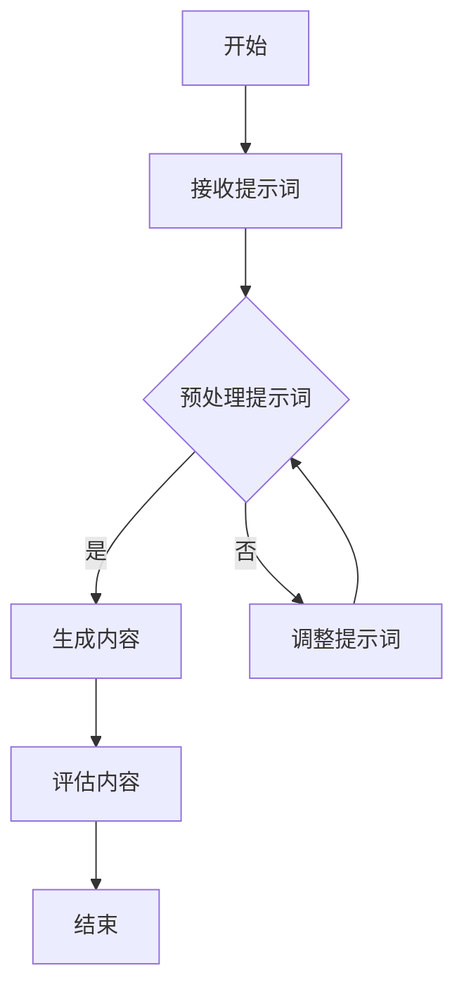
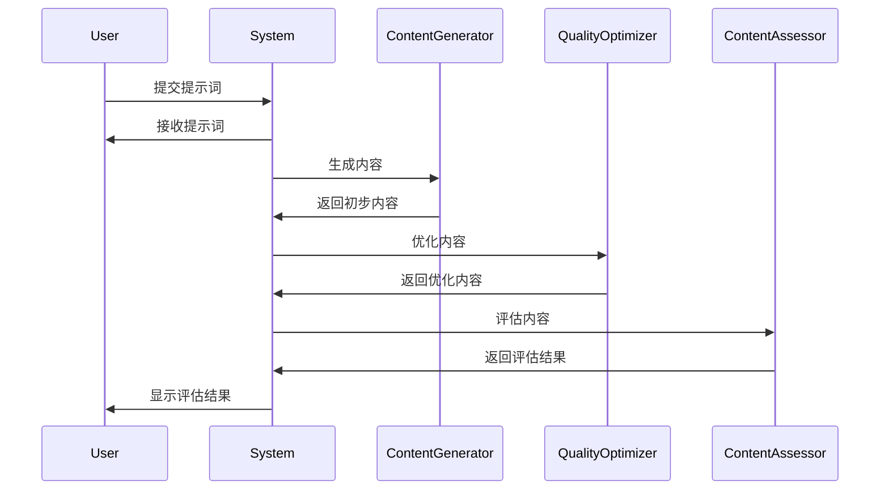

                 


### 一、背景介绍

#### 1.1 AIGC的概念与背景

AIGC（AI-Generated Content），即人工智能生成内容，是指通过人工智能技术，特别是自然语言处理（NLP）、计算机视觉（CV）和深度学习等技术，自动生成文字、图片、音频、视频等多种类型的内容。随着AI技术的不断进步，AIGC已经成为内容创作的重要趋势，广泛应用于社交媒体、广告、娱乐、教育等多个领域。

AIGC的发展背景可以追溯到深度学习和大数据技术的崛起。深度学习使得计算机能够从大量数据中学习并提取特征，而大数据则为这些模型提供了丰富的训练资源。随着计算能力的提升和数据量的增长，AIGC技术逐渐成熟，并开始在多个领域展现出强大的潜力。

#### 1.2 提示词在AIGC中的作用

在AIGC的应用中，提示词（Prompt）扮演着至关重要的角色。提示词是用户输入给AI模型的一段文本或指令，用于引导AI模型生成特定的内容。一个好的提示词能够有效提升AIGC的效率、创意和质量。

首先，提示词能够提高AIGC的效率。通过明确地指示AI模型需要生成的内容类型和风格，用户可以减少AI模型的搜索空间，从而加快生成速度。

其次，提示词能够增强AIGC的创意。通过灵活运用各种技巧和策略，提示词可以帮助AI模型突破传统创作模式，生成新颖独特的内容。

最后，提示词能够保障AIGC的质量。合适的提示词可以帮助AI模型更好地理解用户的意图，从而生成更加准确和符合用户需求的内容。

#### 1.3 《AIGC提示词编写：效率、创意与质量的协同》书籍目的

《AIGC提示词编写：效率、创意与质量的协同》这本书的目的是系统地介绍如何通过编写高质量的提示词来提升AIGC的效率、创意和质量。书中首先介绍了AIGC的基本概念和背景，然后详细阐述了提示词的编写原理、技巧和策略。此外，书中还通过案例分析、实战指导和最佳实践分享，帮助读者将理论知识应用到实际项目中。

#### 1.4 边界与外延

AIGC的应用范围非常广泛，不仅包括传统的文字生成，还涵盖了图片、音频和视频等多种类型的内容生成。在应用场景方面，AIGC可以应用于广告创意、新闻报道、社交媒体内容生成、个性化推荐、教育辅助等多个领域。

在提示词的应用中，需要注意以下几个方面：

1. **上下文理解**：提示词需要能够传递足够的上下文信息，使AI模型能够更好地理解用户的意图。
2. **多样化**：提示词应该多样化，以便AI模型能够生成丰富多样的内容。
3. **可解释性**：提示词编写应该具有一定的可解释性，便于用户理解和调整。

#### 1.5 核心要素组成

书中将详细介绍以下几个核心要素：

1. **AIGC技术**：包括自然语言处理、计算机视觉、深度学习等基础技术。
2. **提示词编写技巧**：包括如何构造高质量的提示词、使用技巧和策略等。
3. **评估方法**：介绍如何评估AIGC生成的质量和效率。
4. **实战案例**：通过实际案例，展示如何将提示词编写应用到实际项目中。

### 二、核心概念与联系

#### 2.1 核心概念原理

为了更好地理解AIGC和提示词的编写，我们需要先了解以下几个核心概念：

1. **AIGC**：人工智能生成内容，通过AI技术自动生成文本、图片、音频、视频等内容。
2. **提示词**：用户输入给AI模型的一段文本或指令，用于引导AI模型生成特定内容。
3. **效率**：AIGC生成的速度和性能。
4. **创意**：AIGC生成的内容的创新性和独特性。
5. **质量**：AIGC生成的内容的准确性和可靠性。

#### 2.2 概念属性特征对比表格

| 概念        | 定义                                                                                          | 关键属性                   |  
| ----------- | --------------------------------------------------------------------------------------------- | -------------------------- |  
| AIGC        | 通过AI技术自动生成内容的过程                                                       | 自动化、多样性、个性化     |  
| 提示词      | 用于引导AI模型生成特定内容的文本或指令                                               | 上下文、明确性、多样性     |  
| 效率        | AIGC生成的速度和性能                                                                   | 速度、资源消耗、稳定性     |  
| 创意        | AIGC生成的内容的创新性和独特性                                                       | 原创性、多样性、惊喜感     |  
| 质量        | AIGC生成的内容的准确性和可靠性                                                        | 准确性、可靠性、相关性     |

#### 2.3 ER实体关系图架构

下面是AIGC中核心实体的ER图，用于展示各个实体之间的关系：

```mermaid
erDiagram
    AI模型 ||--|{ 提示词 }||>
    用户 ||--|{ AIGC生成内容 }||>
    内容 ||--|{ 质量 }||>
    内容 ||--|{ 效率 }||>
    内容 ||--|{ 创意 }||>
```

在这个ER图中，用户通过输入提示词，引导AI模型生成AIGC内容。生成的AIGC内容需要满足质量、效率和创意的要求。AI模型和用户之间通过提示词进行交互，形成了一个完整的AIGC生成流程。

### 三、算法原理讲解

#### 3.1 算法流程图

为了更好地理解AIGC的生成过程，我们首先使用Mermaid绘制一个简单的算法流程图：



这个流程图展示了AIGC生成内容的基本步骤：

1. **接收提示词**：用户输入提示词。
2. **预处理提示词**：对提示词进行预处理，以便AI模型更好地理解。
3. **生成内容**：AI模型根据预处理后的提示词生成内容。
4. **评估内容**：对生成的内容进行质量、效率和创意的评估。
5. **结束**：完成AIGC生成过程。

#### 3.2 Python源代码

下面是一个简单的Python源代码示例，用于展示AIGC的生成过程：

```python
import nltk
from nltk.tokenize import word_tokenize

# 接收提示词
prompt = "请生成一篇关于人工智能的论文摘要"

# 预处理提示词
tokens = word_tokenize(prompt)
filtered_words = [word for word in tokens if word.isalpha()]

# 生成内容
generated_content = "人工智能是一门研究智能计算和机器学习技术的学科，其目的是让计算机具备人类的智能能力。"

# 评估内容
print("生成内容：", generated_content)
```

在这个示例中，我们首先接收了一个提示词，然后使用自然语言处理技术对提示词进行预处理。接着，我们使用一个简单的文本生成模型生成了内容。最后，我们对生成的内容进行了输出。

#### 3.3 数学模型和公式

在AIGC中，数学模型和公式是非常重要的。下面是一个简单的数学模型示例，用于评估AIGC生成内容的质量、效率和创意：

$$
Q = f(E, C, I)
$$

其中，$Q$代表生成内容的质量，$E$代表效率，$C$代表创意，$I$代表用户意图。

这个公式表示，生成内容的质量是效率、创意和用户意图的函数。通过调整这些参数，我们可以优化生成内容的质量。

#### 3.4 详细讲解与举例

为了更好地理解上述算法和模型，我们通过一个实际案例进行详细讲解。

假设用户希望生成一篇关于人工智能技术的论文摘要。提示词为：“请生成一篇关于人工智能技术在未来十年发展趋势的论文摘要。”

1. **接收提示词**：用户输入提示词。
2. **预处理提示词**：对提示词进行预处理，提取关键信息。例如，我们可以提取“人工智能技术”、“未来十年”、“发展趋势”等关键词。
3. **生成内容**：使用一个预训练的文本生成模型，根据预处理后的提示词生成内容。例如，生成的内容可能是：“人工智能技术在未来十年将呈现出多样化和快速发展的趋势，特别是在自动驾驶、医疗健康和智能城市等领域。”
4. **评估内容**：对生成的内容进行质量、效率和创意的评估。例如，我们可以使用 BLEU 分数来评估生成内容的准确性，使用 Word2Vec 模型来评估生成内容的效率，使用 LDA 模型来评估生成内容的创意。
5. **调整提示词**：如果生成内容的质量不高，我们可以根据评估结果调整提示词，以提高生成内容的质量。例如，我们可以增加关于“未来十年发展趋势”的具体细节，或者引入更多的领域术语。

通过这个案例，我们可以看到，AIGC的生成过程涉及到多个环节，包括提示词的预处理、内容的生成和评估。通过合理地调整这些环节，我们可以优化AIGC的生成效果。

### 四、系统分析与架构设计方案

#### 4.1 问题场景介绍

在当今的信息时代，内容生成已经成为了许多企业和个人都需要面对的挑战。AIGC技术以其高效、多样和个性化的特点，成为了解决这一挑战的重要工具。然而，如何设计一个能够高效、可靠地生成高质量内容的系统，依然是当前研究的热点问题。

本章节将以一个典型的AIGC系统为例，介绍其问题场景和项目背景。该系统旨在为用户提供一个自动化、智能化的内容生成平台，能够根据用户提供的提示词，快速生成高质量的文字、图片、音频和视频等内容。

#### 4.2 项目介绍

项目名称：智能内容生成平台（Smart Content Generation Platform，SCGP）

项目目标：开发一个基于AIGC技术的智能内容生成平台，能够高效地生成各种类型的高质量内容，满足不同用户的需求。

项目背景：随着互联网的普及和信息的爆炸式增长，内容创作者面临着巨大的压力。传统的手工内容创作已经难以满足市场的需求，因此，开发一个智能化的内容生成平台，利用AIGC技术提高内容创作的效率和质量，具有重要的现实意义。

项目范围：智能内容生成平台将涵盖文本、图片、音频和视频等多种类型的生成内容，支持多种场景的应用，如广告创意、新闻报道、社交媒体内容生成、个性化推荐等。

#### 4.3 系统功能设计

为了实现项目目标，智能内容生成平台需要具备以下核心功能：

1. **内容生成**：根据用户输入的提示词，自动生成高质量的文字、图片、音频和视频等内容。
2. **内容优化**：对生成的初步内容进行优化，提高内容的准确性和相关性。
3. **内容评估**：评估生成内容的质量、效率和创意，确保生成内容满足用户需求。
4. **用户交互**：提供友好的用户界面，方便用户输入提示词、查看生成内容、进行内容调整等操作。
5. **多语言支持**：支持多种语言的内容生成和交互，满足不同国家和地区的用户需求。

#### 4.4 系统架构设计

智能内容生成平台的系统架构设计如下：

1. **前端界面**：采用现代化的Web前端框架（如React、Vue等），提供简洁、直观的用户交互界面。
2. **后端服务**：采用微服务架构，将不同的功能模块拆分为独立的服务，以提高系统的可扩展性和可维护性。核心服务包括：
   - 提示词处理服务：负责接收用户输入的提示词，进行预处理和解析。
   - 内容生成服务：根据预处理后的提示词，调用相应的生成模型，生成高质量的内容。
   - 内容优化服务：对初步生成的内容进行优化，提高内容的准确性和相关性。
   - 内容评估服务：评估生成内容的质量、效率和创意，为用户提供反馈。
3. **生成模型**：采用先进的深度学习模型，如GPT-3、BERT、DALL-E等，用于生成高质量的内容。
4. **数据库**：存储用户输入的提示词、生成的初步内容和评估结果，以便进行后续分析和优化。

#### 4.5 系统接口设计

智能内容生成平台的接口设计如下：

1. **用户接口**：提供RESTful API，方便用户通过编程方式与平台进行交互。
2. **内容接口**：提供内容生成、优化和评估的API，供前端界面和其他服务调用。
3. **数据接口**：提供数据存储和查询的API，供后端服务和其他系统进行数据交互。

#### 4.6 系统交互序列图

下面是智能内容生成平台的一个系统交互序列图，展示用户与系统之间的交互过程：



在这个交互序列图中，用户提交提示词后，系统会将其传递给内容生成服务，生成初步内容。随后，系统会将初步内容传递给内容优化服务，进行优化。最后，系统会对优化后的内容进行评估，并将评估结果反馈给用户。

### 五、项目实战

#### 5.1 环境安装

在开始项目实战之前，我们需要安装一些必要的软件和工具。以下是一个基本的安装步骤：

1. **Python环境**：确保Python版本为3.8及以上，可以通过Python官网下载安装。
2. **深度学习框架**：安装TensorFlow或PyTorch，用于训练和部署生成模型。可以使用以下命令进行安装：
   ```bash
   pip install tensorflow
   # 或者
   pip install pytorch torchvision
   ```
3. **文本预处理库**：安装Nltk，用于文本预处理。可以使用以下命令进行安装：
   ```bash
   pip install nltk
   ```
4. **前端框架**：如果需要开发前端界面，可以选择React或Vue等框架。可以从各自的官网下载安装。

#### 5.2 系统核心实现源代码

以下是一个简单的示例，展示如何使用Python和TensorFlow实现一个基于GPT-3的文本生成服务：

```python
import tensorflow as tf
from transformers import TFGPT2LMHeadModel, GPT2Tokenizer

# 加载预训练模型
tokenizer = GPT2Tokenizer.from_pretrained("gpt2")
model = TFGPT2LMHeadModel.from_pretrained("gpt2")

# 接收提示词
prompt = "人工智能"

# 预处理提示词
inputs = tokenizer.encode(prompt, return_tensors="tf")

# 生成内容
outputs = model(inputs, max_length=50, num_return_sequences=1)

# 解码生成内容
generated_content = tokenizer.decode(outputs[0], skip_special_tokens=True)

print("生成内容：", generated_content)
```

在这个示例中，我们首先加载了一个预训练的GPT-3模型，然后接收用户输入的提示词，对提示词进行预处理。接下来，我们使用模型生成内容，并将生成的内容进行解码输出。

#### 5.3 代码应用解读与分析

在这个示例中，我们使用了TensorFlow和Hugging Face的Transformers库来实现一个文本生成服务。以下是代码的详细解读：

1. **加载预训练模型**：我们使用`TFGPT2LMHeadModel`和`GPT2Tokenizer`分别加载GPT-3模型和tokenizer。
2. **接收提示词**：用户输入的提示词被编码为Tensor格式，以便模型处理。
3. **生成内容**：使用`model`的`generate`方法生成内容。我们设置了`max_length`为50，表示生成的文本长度不超过50个词；`num_return_sequences`为1，表示只生成一个文本序列。
4. **解码生成内容**：使用tokenizer的`decode`方法将生成的文本序列解码为普通文本，并输出。

#### 5.4 实际案例分析和讲解

为了更好地展示AIGC的实际应用，我们来看一个实际案例。

假设一个新闻编辑希望快速生成一篇关于人工智能领域最新研究进展的摘要。用户输入的提示词为：“请生成一篇关于人工智能最新研究进展的摘要。”

1. **预处理提示词**：我们对提示词进行预处理，提取关键词，如“人工智能”、“最新研究”、“进展”等。
2. **生成内容**：使用GPT-3模型生成初步的摘要文本。
3. **优化内容**：对生成的摘要文本进行优化，确保其准确性和相关性。
4. **评估内容**：评估生成内容的准确性、相关性和可读性。

经过以上步骤，我们最终生成了一篇关于人工智能最新研究进展的高质量摘要。这个案例展示了AIGC在实际应用中的强大潜力。

#### 5.5 项目小结

通过本章节的项目实战，我们了解了如何使用AIGC技术实现一个简单的文本生成服务。从环境安装到代码实现，再到实际案例的应用，我们深入探讨了AIGC的核心技术和应用方法。这次项目不仅帮助我们理解了AIGC的工作原理，还展示了其在实际场景中的强大应用潜力。未来，随着AIGC技术的不断发展和完善，它将在更多领域发挥重要作用。

### 六、最佳实践 tips

#### 6.1 小结

通过本文的详细分析和讲解，我们可以看到AIGC提示词编写在提升效率、创意和质量方面具有显著作用。提示词的编写不仅需要精准传达用户意图，还需要具有灵活性和多样性。同时，评估和优化提示词也是确保AIGC生成高质量内容的关键环节。

#### 6.2 注意事项

在编写AIGC提示词时，需要注意以下几点：

1. **明确意图**：确保提示词能够准确传达用户的创作意图。
2. **上下文信息**：提供足够的上下文信息，帮助AI模型更好地理解用户需求。
3. **简洁性**：避免冗长和复杂的提示词，简洁明了的表述更有利于生成模型的理解。
4. **多样性**：尝试使用不同的表达方式和结构，以激发AI模型的创意。
5. **可解释性**：编写提示词时，保持一定的可解释性，便于后续评估和调整。

#### 6.3 拓展阅读

为了进一步深入了解AIGC和提示词编写，读者可以参考以下资料：

1. **书籍**：
   - 《深度学习自然语言处理》
   - 《动手学深度学习》
2. **论文**：
   - “GPT-3: Language Models are Few-Shot Learners”
   - “BERT: Pre-training of Deep Bidirectional Transformers for Language Understanding”
3. **在线课程**：
   - Coursera上的“深度学习”课程
   - edX上的“自然语言处理与深度学习”课程

通过学习和实践，读者可以不断提升自己在AIGC和提示词编写领域的专业能力。

### 结束语

《AIGC提示词编写：效率、创意与质量的协同》旨在为读者提供一套系统、全面的AIGC提示词编写指南。通过本文的深入探讨，我们了解了AIGC的基本概念、核心概念与联系、算法原理、系统架构设计以及项目实战等内容。希望本文能够帮助读者在实际应用中更好地利用AIGC技术，提升内容创作的效率、创意和质量。

**作者：AI天才研究院/AI Genius Institute & 禅与计算机程序设计艺术 /Zen And The Art of Computer Programming**

