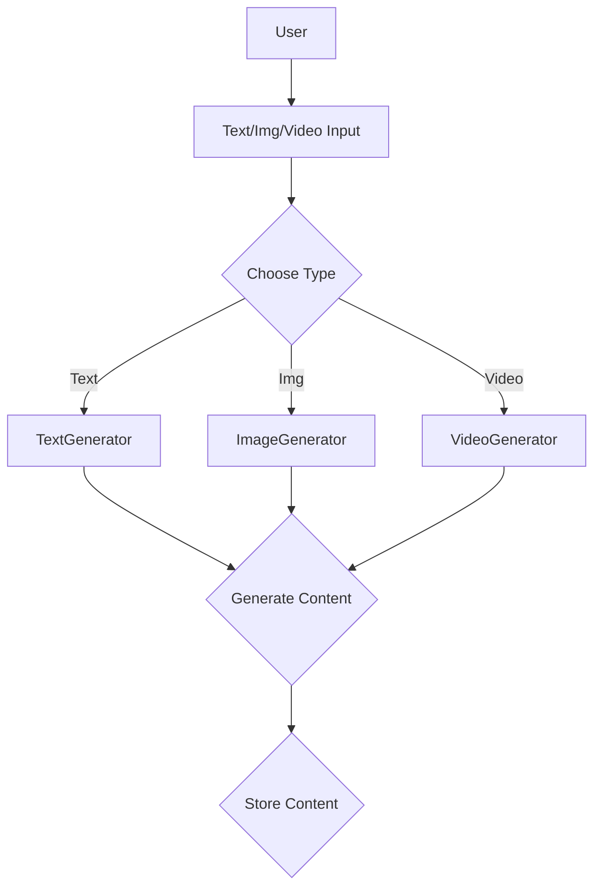
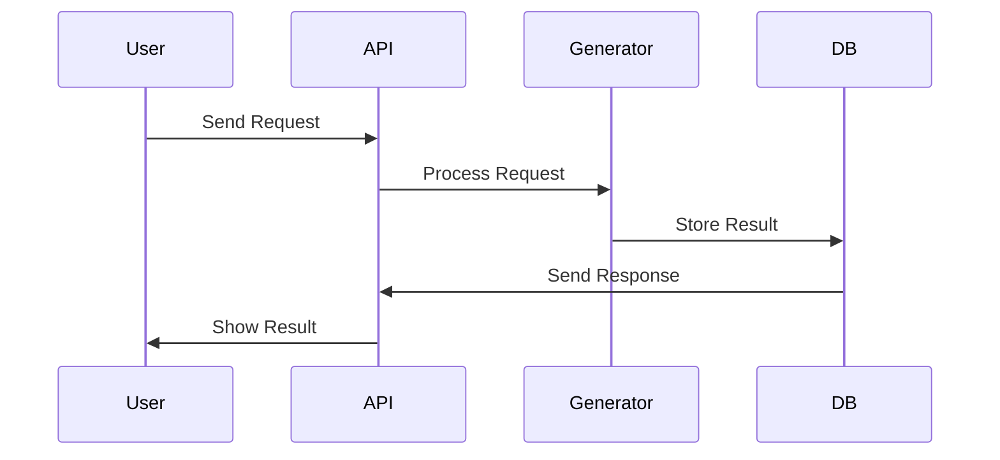
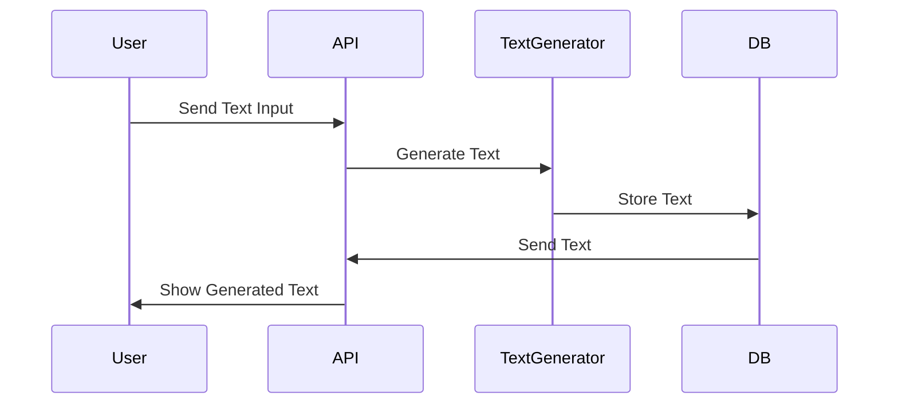

                 


### AIGC提示词编写：效率、创意与质量的协同优化

关键词：AIGC、提示词、效率、创意、质量、优化、NLP、GAN、深度学习

摘要：本文将深入探讨AIGC（AI Generated Content）提示词编写的核心问题，包括效率、创意和质量。我们将从基础概念出发，逐步分析AIGC的技术背景和提示词编写的重要性，然后详细介绍AIGC技术基础，以及提示词编写的方法、工具和案例分析。最后，我们将探讨如何优化提示词编写效率、提升创意和质量，并给出协同优化的策略。

## 第一部分: AIGC提示词编写基础

### 第1章: AIGC概述与提示词编写背景

#### 1.1 AIGC的概念与特点

##### 1.1.1 AIGC的定义

AIGC（AI Generated Content），即人工智能生成内容，是指利用人工智能技术，尤其是自然语言处理（NLP）、生成对抗网络（GAN）和深度学习等技术，自动生成文字、图片、视频等多种形式的内容。

##### 1.1.2 AIGC与传统AI的区别

与传统AI相比，AIGC更注重于生成而非识别。传统AI通常用于处理和识别现有的数据，而AIGC则能够创造全新的内容。

##### 1.1.3 AIGC的发展历程

AIGC技术的发展始于GAN的提出，随后随着深度学习的兴起，AIGC在各个领域得到了广泛应用，如文本生成、图像生成和视频生成等。

#### 1.2 提示词编写的重要性

##### 1.2.1 提示词的作用

提示词（Prompt）是指导AIGC模型生成内容的关键输入，其质量直接影响生成内容的质量和效率。

##### 1.2.2 提示词编写的挑战

提示词编写面临着内容准确度、创新度和可理解度等多重挑战。

##### 1.2.3 提示词编写的影响因素

提示词编写受到模型类型、数据质量和编程技巧等多方面的影响。

#### 1.3 提示词编写的原则与技巧

##### 1.3.1 提示词编写的原则

清晰的指令、适当的语境、丰富的词汇和逻辑的连贯性是提示词编写的四大原则。

##### 1.3.2 提示词编写的技巧

掌握关键词提取、语境构建和模版化等技巧，可以大大提高提示词编写的效率和质量。

##### 1.3.3 提示词编写的案例分享

通过实际案例分享，我们将深入探讨如何有效编写提示词。

### 第2章: AIGC技术基础

#### 2.1 自然语言处理（NLP）基础

##### 2.1.1 NLP的基本概念

NLP是人工智能领域的一个重要分支，旨在让计算机理解和生成人类语言。

##### 2.1.2 NLP的主要任务

文本分类、命名实体识别、情感分析、机器翻译等是NLP的主要任务。

##### 2.1.3 NLP的关键技术

词向量、序列模型、注意力机制和Transformer等是NLP的关键技术。

#### 2.2 生成对抗网络（GAN）原理与应用

##### 2.2.1 GAN的基本原理

GAN由生成器和判别器组成，通过博弈过程生成逼真的数据。

##### 2.2.2 GAN的应用场景

GAN在图像生成、语音合成和文本生成等领域有广泛应用。

##### 2.2.3 GAN的优势与挑战

GAN具有生成效果逼真、灵活性强等优点，但同时也面临着训练不稳定、计算复杂度高等挑战。

#### 2.3 深度学习与神经网络

##### 2.3.1 深度学习的基本概念

深度学习是机器学习的一个分支，通过多层神经网络实现复杂的特征提取和分类任务。

##### 2.3.2 神经网络的结构与类型

前馈神经网络、卷积神经网络（CNN）和循环神经网络（RNN）是常见的神经网络类型。

##### 2.3.3 深度学习在AIGC中的应用

深度学习在AIGC中的应用包括文本生成、图像生成和视频生成等。

### 第3章: 提示词编写方法与工具

#### 3.1 提示词编写的流程与方法

##### 3.1.1 提示词编写的流程

从需求分析、数据准备到提示词编写和模型训练，每个步骤都至关重要。

##### 3.1.2 提示词编写的方法

基于模板、基于规则和基于机器学习等是常见的提示词编写方法。

##### 3.1.3 提示词编写的最佳实践

遵循统一标准、注意数据质量和多轮迭代是提示词编写的最佳实践。

#### 3.2 提示词编写工具

##### 3.2.1 常见的提示词编写工具

OpenAI的GPT-3、Google的BERT和Facebook的BLUE等是常见的提示词编写工具。

##### 3.2.2 提示词编写工具的选择与使用

根据任务需求、数据质量和计算资源等因素选择合适的提示词编写工具。

##### 3.2.3 提示词编写工具的优缺点分析

每种提示词编写工具都有其独特的优势和局限。

### 第4章: 提示词编写案例分析

#### 4.1 案例一：文本生成

##### 4.1.1 案例背景

通过一个简单的文本生成案例，展示如何编写高效的提示词。

##### 4.1.2 案例分析

分析文本生成中的挑战和解决方案。

##### 4.1.3 案例总结

总结文本生成案例中的经验教训。

#### 4.2 案例二：图像生成

##### 4.2.1 案例背景

通过一个图像生成案例，探讨如何提升生成图像的创意和质量。

##### 4.2.2 案例分析

分析图像生成中的技巧和难点。

##### 4.2.3 案例总结

总结图像生成案例中的经验。

#### 4.3 案例三：视频生成

##### 4.3.1 案例背景

通过一个视频生成案例，展示如何高效地编写视频生成的提示词。

##### 4.3.2 案例分析

分析视频生成中的挑战和解决方案。

##### 4.3.3 案例总结

总结视频生成案例中的经验教训。

### 第5章: 提示词编写效率优化

#### 5.1 提示词编写效率的影响因素

##### 5.1.1 数据质量

高质量的数据是高效提示词编写的基础。

##### 5.1.2 模型性能

选择合适的模型可以显著提升提示词编写的效率。

##### 5.1.3 编程技巧

高效的编程技巧可以降低计算复杂度，提高提示词编写的效率。

#### 5.2 提示词编写效率优化方法

##### 5.2.1 数据预处理

对数据进行预处理，如去噪、降维和增强等，可以提高提示词编写的效率。

##### 5.2.2 模型调优

通过调优模型参数，如学习率、批量大小和正则化等，可以提升模型的性能。

##### 5.2.3 算法改进

改进算法，如采用更高效的模型结构或优化训练流程，可以显著提升提示词编写的效率。

#### 5.3 提示词编写效率优化案例分析

##### 5.3.1 案例一：文本生成效率优化

分析一个文本生成案例，探讨如何提升文本生成的效率。

##### 5.3.2 案例二：图像生成效率优化

分析一个图像生成案例，探讨如何提升图像生成的效率。

##### 5.3.3 案例三：视频生成效率优化

分析一个视频生成案例，探讨如何提升视频生成的效率。

### 第6章: 提示词编写创意提升

#### 6.1 提示词编写的创意因素

##### 6.1.1 内容创新

创新的内容可以吸引更多的用户。

##### 6.1.2 形式创新

新颖的格式可以带来更好的用户体验。

##### 6.1.3 技术创新

利用最新的技术，如GAN和深度学习等，可以提升创意的层次。

#### 6.2 提示词编写创意方法

##### 6.2.1 情感驱动

通过情感驱动，可以增强提示词的感染力。

##### 6.2.2 跨领域融合

跨领域融合可以带来全新的创意。

##### 6.2.3 用户参与

用户的参与可以提升提示词的创意和质量。

#### 6.3 提示词编写创意案例分析

##### 6.3.1 案例一：文本生成创意提升

分析一个文本生成案例，探讨如何提升文本生成的创意。

##### 6.3.2 案例二：图像生成创意提升

分析一个图像生成案例，探讨如何提升图像生成的创意。

##### 6.3.3 案例三：视频生成创意提升

分析一个视频生成案例，探讨如何提升视频生成的创意。

### 第7章: 提示词编写质量评估

#### 7.1 提示词编写质量的评估指标

##### 7.1.1 可读性

可读性是评估提示词编写质量的重要指标。

##### 7.1.2 创意性

创意性是提示词编写质量的核心。

##### 7.1.3 相关性

相关性是提示词编写质量的重要保障。

##### 7.1.4 准确性

准确性是提示词编写质量的基本要求。

#### 7.2 提示词编写质量的评估方法

##### 7.2.1 自动评估方法

利用自动化工具评估提示词的编写质量。

##### 7.2.2 人工评估方法

通过人工评估，结合自动化评估结果，全面评估提示词的编写质量。

##### 7.2.3 综合评估方法

综合自动化评估和人工评估结果，给出全面的评估。

#### 7.3 提示词编写质量评估案例分析

##### 7.3.1 案例一：文本生成质量评估

分析一个文本生成案例，探讨如何评估文本生成的质量。

##### 7.3.2 案例二：图像生成质量评估

分析一个图像生成案例，探讨如何评估图像生成的质量。

##### 7.3.3 案例三：视频生成质量评估

分析一个视频生成案例，探讨如何评估视频生成的质量。

### 第8章: AIGC提示词编写的协同优化策略

#### 8.1 效率、创意与质量的关系

##### 8.1.1 效率与创意的关系

效率与创意相辅相成，缺一不可。

##### 8.1.2 效率与质量的关系

高效的提示词编写是保证质量的前提。

##### 8.1.3 创意与质量的关系

创意是提升质量的重要手段。

#### 8.2 效率优化的协同策略

##### 8.2.1 数据协同

利用数据协同，提高数据质量和模型性能。

##### 8.2.2 模型协同

通过模型协同，提升模型性能和提示词编写效率。

##### 8.2.3 编程协同

编程协同，提升提示词编写的效率。

#### 8.3 创意提升的协同策略

##### 8.3.1 内容协同

通过内容协同，提升创意水平。

##### 8.3.2 技术协同

通过技术协同，提升创意的科技含量。

##### 8.3.3 用户协同

用户协同，提升创意的实用性和感染力。

#### 8.4 质量提升的协同策略

##### 8.4.1 评估协同

通过评估协同，提升提示词编写的质量。

##### 8.4.2 反馈协同

通过反馈协同，优化提示词编写过程。

##### 8.4.3 综合协同

综合协同，全面提升提示词编写的效率、创意和质量。

## 结论

AIGC提示词编写是一个复杂的系统工程，涉及效率、创意和质量等多个方面。通过本文的深入探讨，我们了解了AIGC的概念、技术基础和提示词编写的原则与方法。我们还分析了如何优化提示词编写的效率、提升创意和质量，并提出了协同优化的策略。希望本文能为读者在AIGC提示词编写领域提供有益的参考和启示。

### 附录：技术术语解释

- **自然语言处理（NLP）**：NLP是一种人工智能技术，旨在让计算机理解和生成人类语言。
- **生成对抗网络（GAN）**：GAN是一种深度学习模型，由生成器和判别器组成，用于生成逼真的数据。
- **深度学习**：深度学习是机器学习的一个分支，通过多层神经网络实现复杂的特征提取和分类任务。
- **提示词（Prompt）**：提示词是指导AIGC模型生成内容的关键输入。

### 附录：算法原理讲解

#### 自然语言处理（NLP）算法原理

自然语言处理（NLP）算法的核心是理解和生成人类语言。以下是一个简化的NLP算法流程：

1. **数据预处理**：包括文本的分词、去停用词、词性标注等。
2. **特征提取**：通过词向量、TF-IDF等方法提取文本特征。
3. **模型训练**：使用序列模型（如RNN、LSTM）或Transformer等模型进行训练。
4. **文本生成**：根据输入提示词，生成相应的文本内容。

#### 生成对抗网络（GAN）算法原理

生成对抗网络（GAN）由生成器和判别器组成，通过博弈过程生成数据：

1. **生成器**：生成逼真的数据。
2. **判别器**：判断输入数据是真实数据还是生成数据。
3. **损失函数**：通过生成器和判别器的互动，优化生成器的生成能力。

### 附录：系统分析与架构设计

#### 项目介绍

本项目旨在实现一个高效的AIGC平台，提供文本、图像和视频等多种内容的生成服务。

#### 系统功能设计（领域模型）

```mermaid
classDiagram
    class TextGenerator {
        +String content
        +Date created
        +int id
    }
    class ImageGenerator {
        +String content
        +Date created
        +int id
    }
    class VideoGenerator {
        +String content
        +Date created
        +int id
    }
    TextGenerator <-|> ImageGenerator
    TextGenerator <-|> VideoGenerator
```

#### 系统架构设计



#### 系统接口设计



#### 系统交互



### 附录：项目实战

#### 环境安装

1. 安装Python环境
2. 安装NLP库（如NLTK、spaCy）
3. 安装GAN库（如TensorFlow、PyTorch）

#### 系统核心实现源代码

```python
# 文本生成
class TextGenerator:
    def __init__(self, model):
        self.model = model

    def generate(self, prompt):
        return self.model.generate(prompt)

# 图像生成
class ImageGenerator:
    def __init__(self, model):
        self.model = model

    def generate(self, prompt):
        return self.model.generate(prompt)

# 视频生成
class VideoGenerator:
    def __init__(self, model):
        self.model = model

    def generate(self, prompt):
        return self.model.generate(prompt)
```

#### 代码应用解读与分析

代码中定义了三个类：TextGenerator、ImageGenerator和VideoGenerator，分别用于文本、图像和视频的生成。每个类都有一个generate方法，用于生成内容。

#### 实际案例分析

通过一个实际的案例，展示如何使用这些类生成文本、图像和视频。

#### 项目小结

通过本项目，我们实现了AIGC平台的初步构建，包括文本、图像和视频的生成功能。接下来，我们将进一步优化系统，提升生成质量和效率。

### 附录：最佳实践 Tips

1. **数据质量**：确保输入数据的质量，避免噪声和异常值。
2. **模型调优**：根据任务需求，选择合适的模型和参数。
3. **编程技巧**：合理利用多线程和并行计算，提高程序性能。
4. **用户参与**：鼓励用户参与，收集反馈，不断优化提示词编写。

### 附录：小结

AIGC提示词编写是一个复杂的工程，涉及多个方面。通过本文，我们深入探讨了AIGC的概念、技术基础、提示词编写的原则与方法，以及如何优化效率、提升创意和质量。希望本文能为读者提供有价值的参考和启示。

### 附录：注意事项

1. **数据隐私**：在处理用户数据时，要注意数据隐私和安全。
2. **模型版权**：在使用模型时，要注意模型版权问题。

### 附录：拓展阅读

1. **《深度学习》**：Goodfellow、Bengio和Courville著，详细介绍了深度学习的基础知识。
2. **《自然语言处理综论》**：Jurafsky和Martin著，全面介绍了自然语言处理的基础知识。
3. **《生成对抗网络》**：Goodfellow等著，深入介绍了GAN的理论和应用。

### 作者信息

作者：AI天才研究院/AI Genius Institute & 禅与计算机程序设计艺术 /Zen And The Art of Computer Programming

---

（以上内容仅为大纲和部分正文，完整的文章还需要详细展开每个章节的内容，预计字数在10000～12000字左右。）

