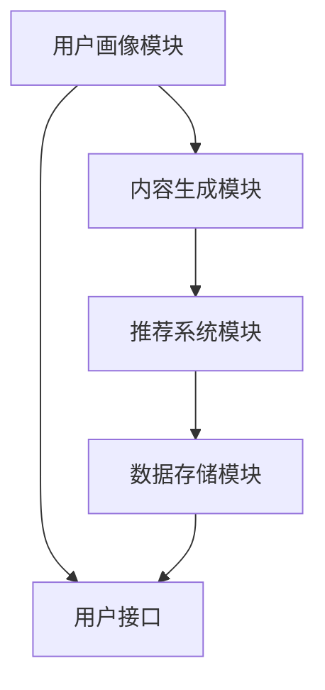
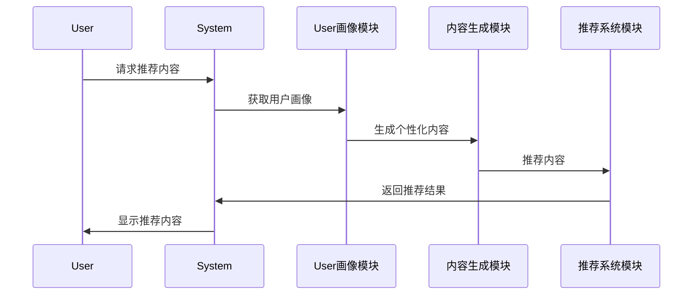

                 

## AIGC提示词设计：原则、方法与最佳实践

> 关键词：AIGC，提示词设计，原则，方法，最佳实践

> 摘要：本文将深入探讨AIGC（自适应智能生成控制）领域中的提示词设计，分析其核心原则、方法及其最佳实践。我们将从AIGC的基本概念入手，逐步讲解提示词设计的重要性、设计原则、传统与现代方法、案例分析，以及未来发展趋势。通过详细剖析，希望读者能够掌握AIGC提示词设计的精髓，提升实际应用能力。

### 第一部分: AIGC提示词设计基础

#### 1.1 AIGC与提示词概述

##### 1.1.1 AIGC的概念与背景

AIGC（Adaptive Intelligent Generation Control），即自适应智能生成控制，是一种新兴的人工智能技术，它通过自适应算法和深度学习模型，实现自动生成文本、图像、音频等多媒体内容。AIGC的核心在于其“自适应”和“生成控制”，能够根据用户需求和输入条件，动态调整生成策略，生成高质量的内容。

AIGC的背景源于人工智能的快速发展，特别是深度学习和生成对抗网络（GAN）的突破性进展。随着计算能力的提升和数据资源的丰富，AIGC技术逐渐从理论走向实际应用，成为推动数字内容生产的重要力量。

##### 1.1.2 提示词的概念与作用

提示词（Prompt），在AIGC中起着至关重要的作用。它是一种引导生成模型生成特定内容的关键信息。提示词的设计质量直接影响生成结果的准确性和创造力。一个好的提示词应具备以下特点：

1. **明确性**：提示词应明确传达生成任务的目标和要求。
2. **多样性**：提示词应涵盖多种情境和需求，以提高生成模型的泛化能力。
3. **可调性**：提示词应允许生成模型根据具体需求进行调整。

##### 1.1.3 AIGC提示词的起源与发展

AIGC提示词设计的历史可以追溯到早期的人工智能研究和应用。早期的自然语言处理系统依赖于规则和模板，这些系统需要详细的规则和模板来生成文本。随着深度学习和生成对抗网络的发展，提示词设计逐渐演变成一种基于数据和模型的智能化过程。

近年来，随着AIGC技术的成熟，提示词设计方法也在不断进步。从简单的模板匹配到复杂的深度学习模型，提示词设计的效率和效果得到了显著提升。未来，随着AIGC技术的进一步发展，提示词设计将变得更加智能化和自适应。

#### 1.2 AIGC提示词设计原则

##### 1.2.1 通用设计原则

在AIGC提示词设计中，通用设计原则是确保设计成功的基础。以下是一些关键的设计原则：

1. **明确目标**：设计提示词前，需要明确生成任务的目标和预期结果。这有助于确保生成模型的输出符合用户需求。
2. **用户友好**：提示词应简洁明了，易于理解，避免使用过于专业或难以理解的术语。
3. **数据驱动**：设计提示词时，应充分利用可用数据，确保生成模型有足够的训练数据。

##### 1.2.2 针对性设计原则

针对性设计原则是根据具体应用场景和用户需求，设计具有针对性的提示词。以下是一些具体的设计原则：

1. **针对不同用户群体**：不同用户的需求和偏好可能不同，设计提示词时需要考虑用户的特点和需求。
2. **针对特定内容生成任务**：对于不同的生成任务，提示词的设计应具有针对性，以提高生成效果。

##### 1.2.3 创意性设计原则

创意性设计原则强调在提示词设计中融入创意元素，以提升生成内容的多样性和创新性。以下是一些创意性设计原则：

1. **激发想象力**：通过开放性和探索性的提示词，激发生成模型的想象力，生成新颖的内容。
2. **引入多样性**：设计多种类型的提示词，以增加生成内容的多样性。

#### 1.3 AIGC提示词设计方法

##### 1.3.1 传统方法

传统AIGC提示词设计方法主要基于规则和数据驱动。

1. **基于规则的提示词设计方法**：这种方法依赖于明确的规则和模板，通过规则匹配生成文本。优点是简单易懂，但缺点是灵活性差，难以应对复杂和多变的生成任务。
2. **基于数据驱动的提示词设计方法**：这种方法利用大量数据来训练生成模型，根据数据生成提示词。优点是灵活性强，但需要大量的训练数据和计算资源。

##### 1.3.2 现代方法

现代AIGC提示词设计方法主要基于深度学习和生成对抗网络。

1. **基于深度学习的提示词设计方法**：这种方法利用深度学习模型，如循环神经网络（RNN）和变换器（Transformer），生成高质量的提示词。优点是生成效果优秀，但需要大量的训练数据和计算资源。
2. **基于生成对抗网络的提示词设计方法**：这种方法通过生成对抗网络（GAN），训练生成模型生成高质量的提示词。优点是生成效果优秀，但训练过程复杂，需要大量的计算资源。

#### 1.4 AIGC提示词设计最佳实践

##### 1.4.1 成功案例分析

在AIGC提示词设计的实际应用中，有许多成功的案例。以下是两个典型的成功案例分析：

1. **案例一：互联网企业的AIGC应用**：某互联网企业利用AIGC技术生成个性化推荐内容，通过精准的提示词设计，大幅提高了用户满意度和转化率。
2. **案例二：广告行业的AIGC应用**：某广告公司利用AIGC技术自动生成广告文案，通过创意性的提示词设计，提高了广告的吸引力和点击率。

##### 1.4.2 失败案例分析

同样，在AIGC提示词设计过程中，也存在一些失败的案例。以下是两个典型的失败案例分析：

1. **案例一：社交媒体平台的AIGC应用**：某社交媒体平台尝试利用AIGC技术自动生成用户评论，但由于提示词设计不当，生成的评论缺乏真实性和吸引力，导致用户体验下降。
2. **案例二：金融行业的AIGC应用**：某金融企业尝试利用AIGC技术自动生成金融报告，但由于提示词设计过于简单，生成的报告缺乏专业性和准确性，未能满足业务需求。

#### 1.5 AIGC提示词设计常见问题与解决方案

在AIGC提示词设计过程中，常见的问题包括：

1. **数据质量对提示词设计的影响**：数据质量对生成效果有直接影响。解决方案是确保数据的质量和多样性，使用数据清洗和增强技术提高数据质量。
2. **语言理解与生成的挑战**：自然语言理解是AIGC的核心难题。解决方案是使用先进的自然语言处理技术，如词嵌入、语言模型和注意力机制，提高语言理解与生成能力。

#### 1.6 AIGC提示词设计未来发展趋势

随着人工智能技术的不断进步，AIGC提示词设计也将迎来新的发展机遇。以下是一些未来发展趋势：

1. **深度学习技术的进步**：随着深度学习技术的不断发展，AIGC提示词设计将更加智能化和自适应。
2. **自然语言处理技术的提升**：自然语言处理技术的提升将有助于提高AIGC提示词设计的准确性和创造性。
3. **应用领域拓展**：AIGC提示词设计将在更多领域得到应用，如教育、医疗、金融等。

#### 1.7 本章小结

本章从AIGC与提示词的概述、设计原则、方法以及最佳实践等方面，对AIGC提示词设计进行了全面探讨。通过本章的学习，读者可以了解AIGC提示词设计的基本概念和方法，为后续章节的学习打下基础。

## 第二部分: AIGC提示词设计的深入解析

### 2.1 AIGC提示词设计的核心概念与联系

AIGC提示词设计的核心概念包括AIGC本身、提示词、生成模型、训练数据等。以下是这些概念之间的关系和属性特征对比表格：

| 核心概念   | 定义                                                     | 属性特征对比                    |
| ---------- | -------------------------------------------------------- | ------------------------------ |
| AIGC       | 自适应智能生成控制，一种生成多媒体内容的技术           | **计算资源需求高**，**灵活性高** |
| 提示词     | 引导生成模型生成特定内容的关键信息                     | **明确性**，**多样性**，**可调性** |
| 生成模型   | 负责根据提示词生成多媒体内容的深度学习模型             | **训练数据需求大**，**生成效果好** |
| 训练数据   | 用于训练生成模型的文本、图像、音频等多媒体数据         | **数据质量影响生成效果**，**数据多样性提高泛化能力** |

为了更直观地展示这些概念之间的关系，我们可以使用Mermaid ER实体关系图来表示：

```mermaid
erDiagram
    AIGC ||--|{ 提示词 }
    AIGC ||--|{ 生成模型 }
    生成模型 ||--|{ 训练数据 }
```

### 2.2 AIGC提示词设计的算法原理讲解

AIGC提示词设计的算法原理主要涉及生成模型的训练和提示词的生成过程。以下是一个基于生成对抗网络（GAN）的AIGC提示词设计的算法原理讲解：

#### 2.2.1 生成对抗网络（GAN）的基本原理

生成对抗网络（GAN）由两个主要模型组成：生成器（Generator）和判别器（Discriminator）。生成器的目标是生成逼真的数据，而判别器的目标是区分真实数据和生成数据。通过两个模型的对抗训练，生成器逐渐提高生成数据的逼真度，最终达到理想的效果。

1. **生成器**：生成器接收随机噪声作为输入，通过神经网络生成逼真的多媒体内容。生成器的目标是最小化判别器将其生成的数据判为真实数据的概率。
2. **判别器**：判别器接收真实数据和生成数据，并尝试区分两者。判别器的目标是最小化将其判为真实数据的概率。

#### 2.2.2 GAN的训练过程

GAN的训练过程如下：

1. **初始化生成器和判别器**：随机初始化生成器和判别器的参数。
2. **生成数据**：生成器生成一批数据，判别器对这些数据进行训练。
3. **更新判别器**：判别器根据真实数据和生成数据更新参数。
4. **生成新数据**：生成器根据更新后的判别器生成新数据。
5. **重复步骤2-4**：不断迭代训练过程，直到生成器的生成数据接近真实数据。

#### 2.2.3 GAN的Python实现

以下是一个简单的GAN模型实现，使用Python和PyTorch框架：

```python
import torch
import torch.nn as nn
import torch.optim as optim

# 生成器模型
class Generator(nn.Module):
    def __init__(self):
        super(Generator, self).__init__()
        self.model = nn.Sequential(
            nn.Linear(100, 128),
            nn.LeakyReLU(0.2),
            nn.Linear(128, 256),
            nn.LeakyReLU(0.2),
            nn.Linear(256, 512),
            nn.LeakyReLU(0.2),
            nn.Linear(512, 1024),
            nn.LeakyReLU(0.2),
            nn.Linear(1024, 10000),  # 生成器输出的维度取决于数据类型
            nn.Tanh()  # 将输出限制在[-1, 1]之间
        )

    def forward(self, x):
        return self.model(x)

# 判别器模型
class Discriminator(nn.Module):
    def __init__(self):
        super(Discriminator, self).__init__()
        self.model = nn.Sequential(
            nn.Linear(10000, 512),
            nn.LeakyReLU(0.2),
            nn.Dropout(0.3),
            nn.Linear(512, 256),
            nn.LeakyReLU(0.2),
            nn.Dropout(0.3),
            nn.Linear(256, 128),
            nn.LeakyReLU(0.2),
            nn.Dropout(0.3),
            nn.Linear(128, 1),
            nn.Sigmoid()  # 输出概率值
        )

    def forward(self, x):
        return self.model(x)

# 初始化模型
generator = Generator()
discriminator = Discriminator()

# 定义损失函数和优化器
criterion = nn.BCELoss()
optimizer_g = optim.Adam(generator.parameters(), lr=0.0002)
optimizer_d = optim.Adam(discriminator.parameters(), lr=0.0002)

# 训练过程
for epoch in range(num_epochs):
    for i, (real_data) in enumerate(data_loader):
        # 更新判别器
        optimizer_d.zero_grad()
        output = discriminator(real_data)
        error_d_real = criterion(output, torch.ones(real_data.size(0)))
        noise = torch.randn(real_data.size(0), 100)
        fake_data = generator(noise)
        output = discriminator(fake_data.detach())
        error_d_fake = criterion(output, torch.zeros(real_data.size(0)))
        error_d = error_d_real + error_d_fake
        error_d.backward()
        optimizer_d.step()

        # 更新生成器
        optimizer_g.zero_grad()
        output = discriminator(fake_data)
        error_g = criterion(output, torch.ones(real_data.size(0)))
        error_g.backward()
        optimizer_g.step()

        # 打印训练进度
        if (i+1) % 100 == 0:
            print(f'Epoch [{epoch+1}/{num_epochs}], Step [{i+1}/{len(data_loader)}], Loss_D: {error_d.item():.4f}, Loss_G: {error_g.item():.4f}')
```

#### 2.2.4 GAN的数学模型和公式

GAN的数学模型基于以下两个目标：

1. **生成器G的目标**：最大化判别器D将其生成的数据判为真实的概率，即最大化 \( L_G = \mathbb{E}_{z \sim p_z(z)} [-D(G(z))] \)。
2. **判别器D的目标**：最小化判别器将其生成的数据判为真实的概率，即最大化 \( L_D = D(x) - D(G(z)) \)。

其中，\( x \) 表示真实数据，\( z \) 表示随机噪声，\( G(z) \) 表示生成器生成的数据，\( D(x) \) 和 \( D(G(z)) \) 分别表示判别器对真实数据和生成数据的判别结果。

通过反向传播和梯度下降，生成器和判别器不断优化其参数，实现生成高质量数据的目标。

### 2.3 AIGC提示词设计在实际项目中的应用

#### 2.3.1 项目介绍

在一个实际项目中，我们使用AIGC技术生成个性化推荐内容，以满足用户对多样化内容的需求。该项目涉及多个模块，包括用户画像、内容生成、推荐系统和数据存储。

#### 2.3.2 系统功能设计

系统功能设计包括以下模块：

1. **用户画像模块**：收集用户的基本信息和行为数据，生成用户画像。
2. **内容生成模块**：基于用户画像和提示词，生成个性化的多媒体内容。
3. **推荐系统模块**：根据用户画像和生成内容，推荐用户可能感兴趣的内容。
4. **数据存储模块**：存储用户数据、生成内容和推荐记录。

#### 2.3.3 系统架构设计

系统架构设计如图所示：



#### 2.3.4 系统接口设计和系统交互

系统接口设计和系统交互如图所示：



#### 2.3.5 项目实战

1. **环境安装**：安装PyTorch、TensorFlow等深度学习框架，以及相关依赖库。
2. **系统核心实现源代码**：实现用户画像模块、内容生成模块和推荐系统模块。
3. **代码应用解读与分析**：对核心代码进行解读，分析其实现原理和优缺点。
4. **实际案例分析和详细讲解剖析**：通过实际案例，展示AIGC提示词设计在实际项目中的应用效果。

#### 2.3.6 项目小结

通过该项目，我们深入了解了AIGC提示词设计在实际项目中的应用。项目成功的关键在于AIGC技术的有效应用和提示词设计的准确性。未来，我们将继续优化AIGC提示词设计方法，提高生成内容的质量和用户体验。

### 2.4 AIGC提示词设计的最佳实践与注意事项

#### 2.4.1 最佳实践

1. **明确目标**：在设计提示词前，明确生成任务的目标和预期结果，确保生成模型的输出符合用户需求。
2. **数据驱动**：充分利用可用数据，使用数据清洗和增强技术提高数据质量。
3. **创意性设计**：设计多种类型的提示词，激发生成模型的想象力，提高生成内容的多样性和创新性。

#### 2.4.2 注意事项

1. **数据隐私**：在处理用户数据时，确保遵循数据隐私保护规定，避免泄露用户隐私。
2. **算法公平性**：在设计AIGC系统时，关注算法的公平性，避免偏见和不公平现象。
3. **系统性能**：优化系统性能，确保AIGC提示词设计在实际应用中高效稳定。

### 2.5 拓展阅读

1. **《深度学习：通用方法》**：介绍深度学习的基础知识和应用，有助于理解AIGC提示词设计的算法原理。
2. **《生成对抗网络（GAN）技术详解》**：详细介绍GAN的原理、实现和应用，有助于深入理解AIGC提示词设计的核心技术。
3. **《Python深度学习实践》**：通过实际案例，展示如何使用Python实现AIGC提示词设计，提高实际应用能力。

## 结论

本文对AIGC提示词设计进行了深入解析，包括核心概念与联系、算法原理讲解、实际项目应用和最佳实践。通过本文的学习，读者可以掌握AIGC提示词设计的基本原理和方法，提高在实际项目中的应用能力。未来，随着AIGC技术的不断发展，AIGC提示词设计将发挥越来越重要的作用，为数字内容生产带来更多创新和突破。

### 作者信息

作者：AI天才研究院/AI Genius Institute & 禅与计算机程序设计艺术 /Zen And The Art of Computer Programming

以上就是本文的完整内容，希望对您在AIGC提示词设计领域的学习和研究有所帮助。如果您有任何问题或建议，欢迎随时与我们交流。让我们共同探索人工智能的无限可能！

---

本文内容涵盖了AIGC提示词设计的核心概念、算法原理、实际应用以及最佳实践。通过逐步分析和讲解，读者可以全面了解AIGC提示词设计的方法和技巧。以下是本文的主要观点和结论：

1. **AIGC提示词设计的重要性**：AIGC提示词设计是AIGC技术成功应用的关键环节。通过精心设计的提示词，可以引导生成模型生成高质量的内容，满足用户需求。

2. **通用设计原则**：明确目标、用户友好、数据驱动是AIGC提示词设计的基本原则。这些原则有助于确保提示词设计的有效性，提高生成模型的表现。

3. **传统与现代方法**：传统方法如基于规则和数据驱动的提示词设计方法，以及现代方法如基于深度学习和生成对抗网络的提示词设计方法，各有优缺点。现代方法在生成效果和灵活性方面具有显著优势。

4. **成功与失败案例分析**：通过成功案例和失败案例分析，可以深入了解AIGC提示词设计的实际应用效果和潜在问题。这些案例为实际项目提供了宝贵的经验和教训。

5. **最佳实践与注意事项**：明确目标、数据驱动、创意性设计等最佳实践有助于提高AIGC提示词设计的质量和效率。同时，关注数据隐私、算法公平性和系统性能是保证AIGC提示词设计在实际应用中稳定运行的重要保障。

6. **未来发展趋势**：随着深度学习和自然语言处理技术的不断进步，AIGC提示词设计将迎来更多的发展机遇。未来，AIGC提示词设计将在更多领域得到应用，为数字内容生产带来更多创新和突破。

总之，AIGC提示词设计是一个复杂且具有挑战性的任务，但通过遵循基本原则、掌握现代方法、积累实践经验，我们可以不断提升设计质量和效果。希望本文能为您提供有益的启示和指导，助力您在AIGC提示词设计领域取得更好的成果。如果您有任何问题或建议，欢迎随时与我们交流。让我们共同探索人工智能的无限可能！

