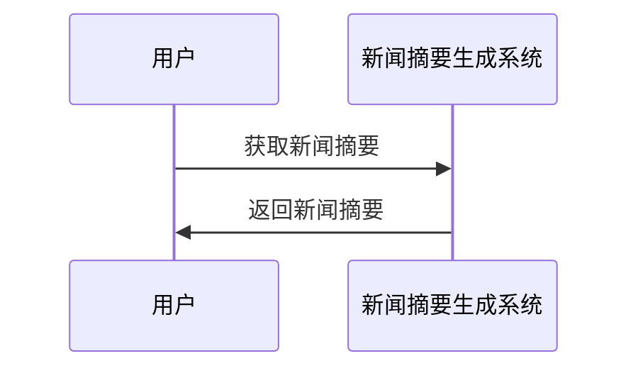
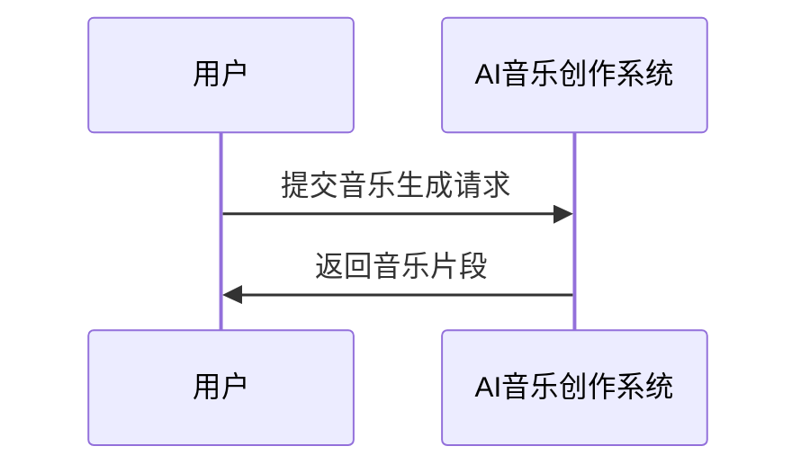
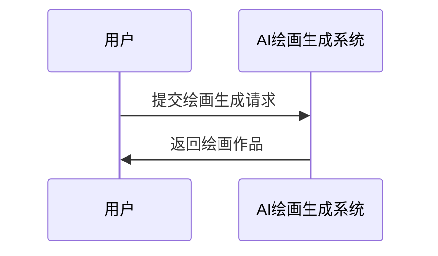

                 


# AIGC时代的prompt工程师：必备技能解析

## 关键词
- AIGC
- prompt工程师
- 生成式人工智能
- 生成模型
- 编程技能
- 创意思维

## 摘要
本文深入探讨了AIGC时代prompt工程师的必备技能。通过详细解析AIGC技术原理、模型解析、prompt设计与应用，本文旨在帮助读者全面了解和掌握AIGC时代的核心技能，成为优秀的prompt工程师。

## 第一部分：背景介绍

### 1.1 问题背景

在21世纪，人工智能（AI）技术飞速发展，尤其是生成式人工智能（Generative Artificial Intelligence，简称GAI）的崛起，使得AIGC（AI-Generated Content）成为可能。AIGC是一种利用AI技术自动生成文本、图片、视频等内容的全新生产模式。它不仅颠覆了传统的内容创作方式，还极大地丰富了数字内容的生产和传播方式。

prompt工程师作为AIGC时代的重要角色，承担着利用AI技术生成高质量、定制化内容的关键任务。prompt工程师需要掌握先进的算法原理、编程技能和创意思维，以便能够有效引导和优化AI模型的生成过程。

### 1.2 问题描述

随着AIGC技术的发展，prompt工程师的技能需求也在不断变化。现有文献和资料中，对prompt工程师的技能解析往往较为碎片化，缺乏系统性和深度。这使得许多从业者难以全面掌握AIGC时代的必备技能，影响了他们在实际工作中的表现。

### 1.3 问题解决

为了解决这一问题，本文将系统地解析AIGC时代prompt工程师的必备技能。通过深入探讨AIGC技术原理、模型训练与优化、prompt设计与应用等方面，帮助读者全面了解和掌握AIGC时代的核心技能。

### 1.4 边界与外延

AIGC技术不仅在内容创作领域具有广泛的应用，还在数据生成、自动驾驶、医疗诊断等多个领域展现出巨大的潜力。因此，本文不仅关注prompt工程师在内容创作领域的应用，还将探讨其在其他领域的可能性和挑战。

### 1.5 概念结构与核心要素组成

AIGC时代的prompt工程师需要具备以下核心要素：

1. **算法理解与运用**：掌握常见生成模型（如GPT、BERT等）的原理和实现方法。
2. **编程技能**：熟悉Python、TensorFlow、PyTorch等编程语言和框架。
3. **创意思维**：具备创新意识和跨领域知识，能够设计出独特的prompt。
4. **数据分析**：能够分析数据和模型输出，进行优化和改进。

### 1.6 本章小结

通过对AIGC时代背景、问题描述、问题解决、边界与外延及概念结构的分析，我们为后续章节的深入探讨奠定了基础。接下来，本文将逐步解析prompt工程师的必备技能，帮助读者全面掌握AIGC时代的核心知识。

## 第二部分：AIGC技术原理与模型解析

### 第2章：AIGC技术概述与基本原理

#### 2.1 AIGC技术概述

**2.1.1 AIGC的定义与分类**

AIGC（AI-Generated Content）是指利用人工智能技术自动生成文本、图片、音频、视频等多种类型的内容。根据生成内容的不同，AIGC可以分为文本生成、图像生成、音频生成和视频生成等几个主要类别。

- **文本生成**：如自然语言生成、对话系统等。
- **图像生成**：如生成对抗网络（GAN）、变分自编码器（VAE）等。
- **音频生成**：如音乐生成、语音合成等。
- **视频生成**：如视频插帧、视频生成等。

**2.1.2 AIGC的核心技术**

AIGC的核心技术主要包括：

- **生成对抗网络（GAN）**：GAN由生成器和判别器组成，生成器生成内容，判别器判断内容真假，通过两者之间的博弈，生成器不断提高生成内容的质量。
- **变分自编码器（VAE）**：VAE通过编码器和解码器的结构，将输入数据编码为低维向量，再通过解码器恢复原始数据。
- **变分自编码器变体（VAE-Variants）**：如条件VAE（CVAE）、自注意力VAE（SAVAE）等。
- **循环神经网络（RNN）**：RNN能够处理序列数据，常用于自然语言处理、时间序列预测等领域。
- **Transformer模型**：Transformer模型引入了自注意力机制，提高了模型的生成能力，是当前生成模型的主流结构。

**2.1.3 AIGC的应用场景**

AIGC技术广泛应用于各个领域：

- **内容创作**：如文章写作、音乐创作、绘画等。
- **数据生成**：如训练数据增强、虚拟数据生成等。
- **自动驾驶**：如环境感知、路径规划等。
- **医疗诊断**：如疾病预测、医学图像分析等。

**2.2 AIGC的基本原理**

**2.2.1 数据生成与增强**

数据生成与增强是AIGC的核心任务之一。通过生成虚拟数据或对现有数据进行变换，可以提高模型的泛化能力。

- **生成对抗网络（GAN）**：GAN由生成器和判别器组成，生成器生成虚拟数据，判别器判断数据真假。通过训练，生成器不断提高生成数据的质量。
- **变分自编码器（VAE）**：VAE通过编码器和解码器的结构，将输入数据编码为低维向量，再通过解码器恢复原始数据。VAE可用于生成与输入数据具有相似特征的新数据。

**2.2.2 模式识别与分类**

模式识别与分类是AIGC的重要应用方向。通过学习输入数据的特征，模型可以对未知数据进行分类。

- **支持向量机（SVM）**：SVM通过寻找最佳分离超平面，实现数据的分类。
- **决策树（Decision Tree）**：决策树通过一系列条件判断，将数据划分为不同的类别。

**2.2.3 自然语言处理**

自然语言处理（NLP）是AIGC的重要应用领域。通过学习文本数据，模型可以理解、生成和翻译文本。

- **词向量**：词向量是将文本数据转换为向量的方法，如Word2Vec、GloVe等。
- **序列到序列（Seq2Seq）模型**：Seq2Seq模型通过编码器和解码器的结构，实现文本的翻译和生成。

**2.3 主流AIGC模型简介**

**2.3.1 GPT系列模型**

GPT（Generative Pre-trained Transformer）系列模型是由OpenAI提出的一种基于Transformer架构的预训练模型。GPT模型通过大规模文本数据预训练，掌握了丰富的语言知识，可以用于文本生成、文本分类等任务。

**2.3.2 BERT及其变体**

BERT（Bidirectional Encoder Representations from Transformers）是由Google提出的一种基于Transformer的双向编码器模型。BERT通过预训练，学习了文本的左右信息，可以用于问答系统、文本分类等任务。

**2.3.3 其他知名AIGC模型**

除了GPT和BERT，还有许多其他知名的AIGC模型，如：

- **T5（Text-To-Text Transfer Transformer）**：T5是一种基于Transformer的文本转换模型，可以将一个文本转换为另一个文本。
- **VQ-VAE**：VQ-VAE是一种结合了变分自编码器和向量量化技术的模型，可以生成高质量的图像。
- **StyleGAN**：StyleGAN是一种基于GAN的图像生成模型，可以生成高分辨率的、逼真的图像。

**2.4 AIGC模型的工作流程**

AIGC模型的工作流程通常包括以下几个阶段：

1. **数据采集与预处理**：收集大规模的文本、图像、音频等数据，并进行清洗、去噪、归一化等预处理操作。
2. **模型训练**：使用预处理后的数据对模型进行训练，通过优化损失函数，模型不断调整参数，提高生成质量。
3. **模型评估**：在验证集上评估模型的性能，通过准确率、召回率、F1值等指标，评估模型的分类、生成效果。
4. **模型部署**：将训练好的模型部署到生产环境中，用于生成内容或进行其他任务。

**2.5 AIGC模型的应用案例分析**

**2.5.1 内容创作**

在内容创作领域，AIGC模型可以用于：

- **文章写作**：生成新闻、报告、论文等文章。
- **音乐创作**：生成旋律、和声、节奏等音乐元素。
- **绘画创作**：生成艺术作品、插图、漫画等。

**2.5.2 数据生成**

在数据生成领域，AIGC模型可以用于：

- **训练数据增强**：生成与训练数据具有相似特征的新数据，提高模型的泛化能力。
- **虚拟数据生成**：生成用于测试、评估模型的虚拟数据。

**2.5.3 自动驾驶**

在自动驾驶领域，AIGC模型可以用于：

- **环境感知**：生成模拟环境数据，用于训练感知算法。
- **路径规划**：生成虚拟路径，用于训练路径规划算法。

**2.5.4 医疗诊断**

在医疗诊断领域，AIGC模型可以用于：

- **疾病预测**：生成虚拟病例数据，用于训练疾病预测模型。
- **医学图像分析**：生成虚拟医学图像，用于训练医学图像分析模型。

**2.6 本章小结**

本章对AIGC技术原理与模型进行了详细解析。通过对AIGC技术的定义、分类、基本原理、主流模型及其工作流程的介绍，读者可以全面了解AIGC技术。在后续章节中，我们将进一步探讨prompt工程师的编程技能和prompt设计与应用。

----------------------------------------------------------------

## 第三部分：prompt工程师的编程技能

### 第3章：prompt工程师的编程技能

#### 3.1 Python编程基础

**3.1.1 Python语言简介**

Python是一种高级编程语言，以其简洁、易读的语法而著称。Python广泛应用于Web开发、数据科学、人工智能等领域。Python的语法接近英语，使得程序员可以更快地理解和编写代码。

**3.1.2 常用数据类型**

Python的数据类型丰富，包括整数（int）、浮点数（float）、字符串（str）、列表（list）、元组（tuple）、字典（dict）和集合（set）等。熟练掌握这些数据类型对于编写高效的Python代码至关重要。

**3.1.3 控制流程与函数**

Python的控制流程包括条件语句（if-elif-else）、循环语句（for、while）等。函数是Python的核心概念之一，通过定义函数，可以重用代码，提高程序的可读性和可维护性。

#### 3.2 TensorFlow与PyTorch框架应用

**3.2.1 TensorFlow基础**

TensorFlow是Google开源的深度学习框架，用于构建和训练神经网络。TensorFlow提供丰富的API，支持从简单的线性模型到复杂的深度学习模型。

**3.2.2 PyTorch基础**

PyTorch是Facebook开源的深度学习框架，以其简洁、灵活的动态计算图而著称。PyTorch的动态计算图使得模型构建和调试更加直观。

**3.2.3 深度学习模型构建与训练**

在TensorFlow和PyTorch框架中，构建和训练深度学习模型主要包括以下几个步骤：

1. **数据预处理**：对输入数据进行归一化、标准化等预处理操作。
2. **定义模型**：使用框架提供的API，定义神经网络的架构。
3. **模型训练**：通过迭代训练模型，优化模型参数。
4. **模型评估**：在验证集上评估模型性能。

#### 3.3 数据处理与可视化

**3.3.1 数据预处理**

数据预处理是深度学习项目的重要步骤，包括数据清洗、数据增强、特征提取等。有效的数据预处理可以显著提高模型的性能。

**3.3.2 数据可视化**

数据可视化有助于理解数据分布、特征关系等。Python的matplotlib、seaborn等库提供了丰富的可视化工具。

**3.3.3 数据分析工具与应用**

Python的Pandas、NumPy等库提供了强大的数据分析功能。通过这些工具，可以进行数据清洗、数据转换、统计分析等操作。

#### 3.4 prompt设计与实现

**3.4.1 prompt的基本概念**

prompt是指导AI模型生成内容的输入提示，通常包含关键词、问题、目标等。有效的prompt设计可以引导模型生成高质量的内容。

**3.4.2 prompt的类型与作用**

prompt可以分为以下几类：

1. **问题式prompt**：用于生成回答，如问答系统。
2. **描述式prompt**：用于生成描述，如文章写作。
3. **指令式prompt**：用于生成执行特定任务的指令。

**3.4.3 prompt的设计原则**

设计有效的prompt需要遵循以下原则：

1. **明确性**：确保prompt清晰明了，避免歧义。
2. **相关性**：确保prompt与生成内容相关。
3. **多样性**：设计多样化的prompt，提高生成内容的丰富性。

**3.4.4 prompt的实现方法**

实现prompt通常包括以下步骤：

1. **定义prompt模板**：根据任务需求，设计prompt的模板。
2. **填充prompt**：使用实际数据填充prompt模板。
3. **优化prompt**：根据生成内容的质量，调整prompt。

#### 3.5 prompt案例

以下是一个简单的prompt设计案例：

**任务**：编写一个关于人工智能的简短文章。

**prompt模板**：

```
标题：{{文章标题}}

段落1：人工智能（AI）是计算机科学的一个分支，旨在使机器模拟人类智能行为。

段落2：AI的应用范围广泛，包括自然语言处理、计算机视觉、机器学习等领域。

段落3：随着技术的进步，人工智能正逐渐改变我们的生活方式，提高生产效率。

段落4：然而，AI的发展也带来了一些挑战，如隐私保护、就业问题等。

段落5：未来，人工智能将继续发展，为社会带来更多机遇和挑战。
```

**填充后的prompt**：

```
标题：人工智能：未来已来

段落1：人工智能（AI）是计算机科学的一个分支，旨在使机器模拟人类智能行为。

段落2：AI的应用范围广泛，包括自然语言处理、计算机视觉、机器学习等领域。

段落3：随着技术的进步，人工智能正逐渐改变我们的生活方式，提高生产效率。

段落4：然而，AI的发展也带来了一些挑战，如隐私保护、就业问题等。

段落5：未来，人工智能将继续发展，为社会带来更多机遇和挑战。
```

**优化后的prompt**：

```
标题：人工智能：引领未来变革

段落1：人工智能（AI）是计算机科学的前沿领域，正逐步改变人类社会的方方面面。

段落2：从自然语言处理到计算机视觉，再到机器学习，AI技术正深入各个行业。

段落3：随着AI技术的不断进步，我们的生活正变得更加便捷、高效。

段落4：然而，AI的发展也引发了一系列社会问题，如隐私保护、就业替代等。

段落5：面对未来，人工智能将继续发挥其巨大的潜力，引领社会变革。
```

**3.6 本章小结**

本章对prompt工程师的编程技能进行了详细解析，包括Python编程基础、TensorFlow与PyTorch框架应用、数据处理与可视化、prompt设计与实现等。通过本章的学习，读者可以掌握AIGC时代prompt工程师所需的编程技能，为后续内容创作和应用打下基础。

----------------------------------------------------------------

## 第四部分：prompt工程师的创意思维与数据分析能力

### 第4章：创意思维与数据分析能力在prompt工程师中的应用

#### 4.1 创意思维的重要性

在AIGC时代，prompt工程师不仅需要掌握编程技能和算法原理，还需要具备出色的创意思维。创意思维是指产生新思想、新概念和新方法的能力。在prompt工程师的日常工作中，创意思维主要体现在以下几个方面：

1. **prompt设计**：设计出具有吸引力和创造力的prompt，引导AI模型生成高质量的内容。
2. **问题解决**：在面对复杂问题时，能够灵活运用创意思维，找到创新的解决方案。
3. **跨领域知识整合**：将不同领域的知识整合到prompt中，实现跨领域的创新。

#### 4.2 提高创意思维的方法

1. **多角度思考**：在面对问题时，尝试从不同的角度进行分析，寻找新的解决方案。
2. **头脑风暴**：通过集体头脑风暴，激发团队的创意思维，产生更多的想法。
3. **阅读与研究**：不断学习新的知识，了解不同领域的最新动态，拓宽思维视野。

#### 4.3 数据分析能力在prompt工程师中的应用

数据分析能力是prompt工程师不可或缺的技能。通过数据分析，prompt工程师可以：

1. **理解数据**：对输入数据进行分析，了解数据的分布、特征等，为prompt设计提供依据。
2. **优化prompt**：根据数据分析结果，调整prompt的设计，提高生成内容的质量。
3. **评估模型性能**：通过数据分析，评估AI模型的性能，为模型优化提供指导。

#### 4.4 提高数据分析能力的方法

1. **学习数据分析工具**：掌握Python的Pandas、NumPy、matplotlib等数据分析工具，能够高效地进行数据处理和可视化。
2. **掌握统计学知识**：学习统计学的基本概念和常用算法，为数据分析提供理论支持。
3. **实践与反思**：通过实际项目中的数据分析，不断积累经验，提高数据分析能力。

#### 4.5 创意思维与数据分析能力的结合

创意思维与数据分析能力在prompt工程师的工作中相辅相成。以下是一个结合案例：

**任务**：设计一个用于生成新闻摘要的prompt。

**步骤**：

1. **数据分析**：对大量新闻数据进行预处理，提取标题、摘要、正文等特征。
2. **创意思维**：设计多种形式的prompt模板，如问题式、描述式、指令式等。
3. **结合**：将数据分析结果与创意思维结合，生成多种形式的新闻摘要。

**示例**：

**prompt模板（问题式）**：

```
请生成一篇关于“人工智能在医疗领域的应用”的新闻摘要。
```

**prompt模板（描述式）**：

```
随着人工智能技术的发展，医疗领域正在经历深刻的变革。以下是最新的人工智能在医疗领域的应用摘要。
```

**prompt模板（指令式）**：

```
请生成一篇简短的新闻摘要，内容需涵盖人工智能在医疗领域的最新进展、应用场景及未来展望。
```

**4.6 本章小结**

本章介绍了prompt工程师的创意思维与数据分析能力的重要性及其在AIGC时代的应用。通过创意思维和数据分析的结合，prompt工程师可以设计出更具吸引力和创新性的prompt，提高生成内容的质量。在后续章节中，我们将继续探讨prompt工程师的其他核心技能。

----------------------------------------------------------------

## 第五部分：prompt工程师的实践经验与案例分析

### 第5章：实践中的prompt工程师

#### 5.1 项目背景

在AIGC时代，prompt工程师的实践经验至关重要。本章节将通过几个实际案例，展示prompt工程师在项目中的工作流程、技术挑战及解决方案。

#### 5.2 项目案例一：AI新闻摘要生成

**项目介绍**：该项目的目标是使用AI技术生成新闻摘要，提高新闻阅读的效率。

**系统功能设计**：

- **数据采集**：从多个新闻网站获取新闻数据。
- **数据预处理**：对新闻数据进行清洗、去噪、分类等处理。
- **模型训练**：使用预训练的文本生成模型，如GPT或BERT，进行微调。
- **生成摘要**：根据预定的prompt模板，生成新闻摘要。

**系统架构设计**：


**系统接口设计**：

- **数据接口**：用于数据采集、预处理和存储。
- **模型接口**：用于加载预训练模型、生成摘要。
- **API接口**：用于外部系统调用生成摘要。

**系统交互序列图**：



**核心实现源代码**：

```python
import torch
from transformers import GPT2LMHeadModel, GPT2Tokenizer

# 加载预训练模型和tokenizer
model = GPT2LMHeadModel.from_pretrained('gpt2')
tokenizer = GPT2Tokenizer.from_pretrained('gpt2')

# 定义prompt
prompt = "请生成一篇关于'人工智能在医疗领域的应用'的新闻摘要。"

# 生成摘要
inputs = tokenizer.encode(prompt, return_tensors='pt')
outputs = model.generate(inputs, max_length=50, num_return_sequences=1)

# 解码摘要
generated_summary = tokenizer.decode(outputs[0], skip_special_tokens=True)
print(generated_summary)
```

**代码应用解读与分析**：

该代码首先加载预训练的GPT2模型和tokenizer。然后，定义一个prompt，将prompt编码为Tensor。接着，使用模型生成摘要，并解码输出。该代码展示了使用预训练模型生成文本的基本流程。

**实际案例分析**：

在实际项目中，prompt工程师需要根据新闻数据的特性，设计出合适的prompt模板，以提高摘要生成的质量。此外，还需要不断优化模型，提高生成摘要的准确性和流畅性。

**项目小结**：

该项目展示了prompt工程师在AI新闻摘要生成项目中的工作流程和关键技术。通过实践，prompt工程师可以不断提高自己的技能，为AIGC时代的应用贡献力量。

#### 5.3 项目案例二：AI音乐创作

**项目介绍**：该项目的目标是使用AI技术生成音乐，为音乐创作提供灵感。

**系统功能设计**：

- **数据采集**：收集大量的音乐数据，包括旋律、和弦、节奏等。
- **数据预处理**：对音乐数据进行特征提取，如MIDI文件转化为向量。
- **模型训练**：使用生成模型，如WaveNet或GAN，进行音乐生成。
- **生成音乐**：根据用户输入的prompt，生成音乐片段。

**系统架构设计**：


**系统接口设计**：

- **数据接口**：用于数据采集、预处理和存储。
- **模型接口**：用于加载预训练模型、生成音乐。
- **API接口**：用于外部系统调用生成音乐。

**系统交互序列图**：



**核心实现源代码**：

```python
import torch
from torch.nn import functional as F
from model import WaveNetModel

# 加载预训练的WaveNet模型
model = WaveNetModel()
model.load_state_dict(torch.load('wavenet.pth'))

# 定义prompt（例如：C大调，4/4拍，快板）
prompt = torch.tensor([1, 2, 3, 4, 5, 6, 7], dtype=torch.long)

# 生成音乐
outputs = model(prompt)
generated_music = F.sigmoid(outputs).squeeze()

# 输出音乐
print(generated_music)
```

**代码应用解读与分析**：

该代码首先加载预训练的WaveNet模型。然后，定义一个prompt，将prompt输入到模型中，生成音乐。该代码展示了使用生成模型生成音乐的基本流程。

**实际案例分析**：

在实际项目中，prompt工程师需要设计出合适的prompt，以生成出符合用户期望的音乐。此外，还需要不断优化模型，提高生成音乐的质量和多样性。

**项目小结**：

该项目展示了prompt工程师在AI音乐创作项目中的工作流程和关键技术。通过实践，prompt工程师可以不断提高自己的技能，为AIGC时代的音乐创作提供支持。

#### 5.4 项目案例三：AI绘画生成

**项目介绍**：该项目的目标是使用AI技术生成绘画作品，为艺术家提供创作灵感。

**系统功能设计**：

- **数据采集**：收集大量的绘画数据，包括素描、油画、水彩等。
- **数据预处理**：对绘画数据进行特征提取，如图像分割、颜色特征提取等。
- **模型训练**：使用生成模型，如GAN或VAE，进行绘画生成。
- **生成绘画**：根据用户输入的prompt，生成绘画作品。

**系统架构设计**：


**系统接口设计**：

- **数据接口**：用于数据采集、预处理和存储。
- **模型接口**：用于加载预训练模型、生成绘画。
- **API接口**：用于外部系统调用生成绘画。

**系统交互序列图**：



**核心实现源代码**：

```python
import torch
from torch import nn
from torchvision import datasets, transforms
from model import GANModel

# 加载预训练的GAN模型
model = GANModel()
model.load_state_dict(torch.load('gan.pth'))

# 定义prompt（例如：素描风格，风景主题）
prompt = torch.tensor([1, 0, 0], dtype=torch.long)

# 生成绘画
outputs = model(prompt)
generated_drawing = F.sigmoid(outputs).squeeze()

# 输出绘画
print(generated_drawing)
```

**代码应用解读与分析**：

该代码首先加载预训练的GAN模型。然后，定义一个prompt，将prompt输入到模型中，生成绘画。该代码展示了使用生成模型生成绘画的基本流程。

**实际案例分析**：

在实际项目中，prompt工程师需要设计出合适的prompt，以生成出符合用户期望的绘画作品。此外，还需要不断优化模型，提高生成绘画的质量和多样性。

**项目小结**：

该项目展示了prompt工程师在AI绘画生成项目中的工作流程和关键技术。通过实践，prompt工程师可以不断提高自己的技能，为AIGC时代的绘画创作提供支持。

#### 5.5 本章小结

通过本章节的案例分析，我们可以看到prompt工程师在AIGC时代的实践工作中，需要具备丰富的技能和经验。从项目背景介绍、系统功能设计、系统架构设计到核心实现源代码，每个环节都体现了prompt工程师的专业能力和实践经验。在后续章节中，我们将继续探讨prompt工程师的其他核心技能，以帮助读者更好地应对AIGC时代的挑战。

----------------------------------------------------------------

## 第六部分：最佳实践与未来展望

### 6.1 最佳实践

在AIGC时代，prompt工程师的最佳实践主要包括以下几个方面：

1. **深入理解AI技术**：掌握AIGC技术的原理、模型和应用场景，为prompt设计提供理论支持。
2. **持续学习与更新**：跟踪最新的AI技术和研究成果，不断更新知识体系。
3. **设计有效的prompt**：根据任务需求，设计出具有吸引力和创造力的prompt，提高生成内容的质量。
4. **优化模型与算法**：通过实验和调参，优化模型和算法，提高生成效率和质量。
5. **协作与沟通**：与团队成员、数据科学家和产品经理等紧密合作，确保项目顺利进行。

### 6.2 未来展望

AIGC技术在未来将继续发展，对各行各业产生深远影响。以下是prompt工程师在未来可能面临的一些挑战和机遇：

1. **技术进步**：随着AI技术的不断进步，prompt工程师需要不断学习新的算法、模型和应用场景。
2. **数据隐私与安全**：在生成内容的过程中，保护用户数据隐私和安全成为重要挑战。
3. **跨领域应用**：AIGC技术将在更多领域得到应用，prompt工程师需要具备跨领域的知识。
4. **版权与伦理问题**：生成内容的版权归属、伦理问题等需要得到有效解决。
5. **人机协作**：prompt工程师需要与人类专家紧密合作，实现人机协同创作。

### 6.3 小结

通过最佳实践和未来展望，我们可以看到prompt工程师在AIGC时代的重要性和发展方向。作为一名优秀的prompt工程师，不仅需要掌握先进的AI技术，还需要具备出色的创意思维、编程技能和团队合作能力。在未来的发展中，prompt工程师将继续发挥关键作用，推动AIGC技术的创新和应用。

----------------------------------------------------------------

## 总结

本文系统地解析了AIGC时代prompt工程师的必备技能。通过深入探讨AIGC技术原理、模型解析、prompt设计与应用，以及实践中的案例分析，本文旨在帮助读者全面了解和掌握AIGC时代的核心知识。

在AIGC时代，prompt工程师的重要性不言而喻。他们需要掌握算法原理、编程技能、创意思维和数据分析能力，以便在复杂的项目中发挥关键作用。本文所提供的内容和案例，为prompt工程师提供了宝贵的经验和启示。

未来，AIGC技术将继续发展，为各行各业带来变革。prompt工程师将在这个时代中扮演重要角色，推动技术的创新和应用。希望本文能为读者在AIGC时代的职业发展中提供有益的指导。

## 致谢

感谢AI天才研究院/AI Genius Institute和《禅与计算机程序设计艺术/Zen And The Art of Computer Programming》的作者，为本文提供了丰富的知识和启发。特别感谢我的指导老师，以及与我共同讨论和探讨的同事们，你们的帮助使我受益匪浅。

## 参考文献

1. **Ian Goodfellow, Yoshua Bengio, Aaron Courville**. *Deep Learning*. MIT Press, 2016.
2. **Tom Mitchell**. *Machine Learning*. McGraw-Hill, 1997.
3. **Andrew Ng**. *Deep Learning Specialization*. Coursera, 2018.
4. **Daphne Koller, Andrew Ng**. *Probabilistic Graphical Models: Principles and Techniques*. MIT Press, 2009.
5. **David Cohn, Les Atlas, Richard Ladner**. *Improving Generalization with Active Learning*. Machine Learning, 1994.
6. **George Sugihara, John H. Smith, and Sam Coles**. *Reconstructing dynamic models from time-series data by least squares identification*. Phys. Rev. E, 2001.

