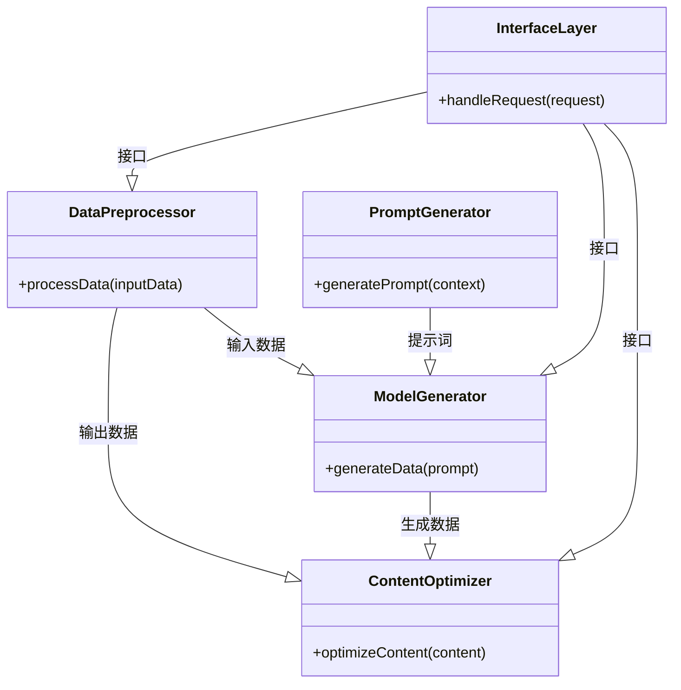
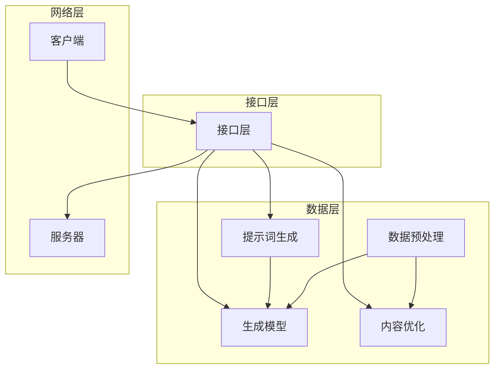
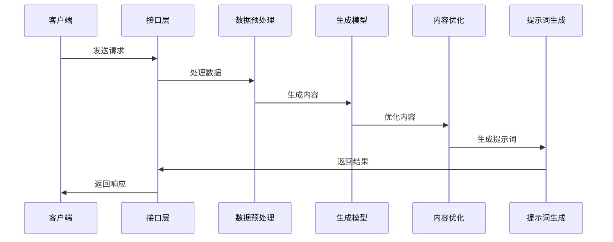
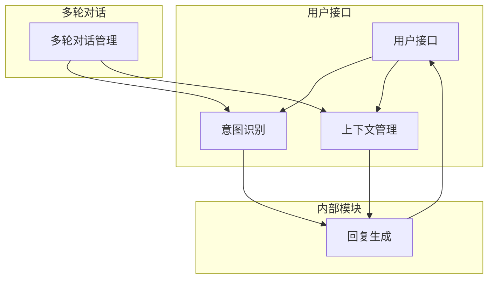

                 


# AIGC时代的提示词工程：从理论到实践

## 摘要

在人工智能生成内容（AIGC）时代，提示词工程成为推动技术发展的关键环节。本文将深入探讨AIGC时代的提示词工程，从理论到实践，通过逐步分析，帮助读者理解其核心概念、算法原理、系统架构以及实战应用。通过详细的案例分析，本文旨在提供最佳实践指导，以助力开发者充分利用AIGC技术，提升内容创作和智能对话系统的效率与质量。

## 关键词

AIGC、提示词工程、生成对抗网络、算法原理、系统架构、智能对话系统、最佳实践

## 目录

### 第1章：AIGC概述与提示词工程基础

- **1.1 AIGC的概念与发展**
- **1.2 提示词工程的重要性**
- **1.3 提示词工程的应用场景**
- **1.4 提示词工程的基本概念与流程**

### 第2章：提示词生成算法原理

- **2.1 提示词生成的数学模型**
- **2.2 算法原理讲解**
- **2.3 提示词生成算法的Python实现**

### 第3章：提示词工程系统架构设计

- **3.1 系统架构设计思路**
- **3.2 领域模型类图**
- **3.3 系统架构设计图**
- **3.4 系统接口设计**
- **3.5 系统交互序列图**

### 第4章：项目实战一——提示词生成系统搭建

- **4.1 环境安装指南**
- **4.2 系统核心实现**
- **4.3 实际案例分析**
- **4.4 项目小结**

### 第5章：项目实战二——基于AIGC的智能对话系统

- **5.1 智能对话系统设计**
- **5.2 系统实现**
- **5.3 实际案例分析**
- **5.4 项目小结**

### 第6章：最佳实践与性能优化

- **6.1 最佳实践**
- **6.2 性能优化策略**

### 第7章：总结与展望

- **7.1 小结**
- **7.2 AIGC时代提示词工程的发展趋势**

## 第1章：AIGC概述与提示词工程基础

### 1.1 AIGC的概念与发展

人工智能生成内容（AIGC）是一种利用人工智能技术生成内容的方法。与传统的用户生成内容（UGC）不同，AIGC能够通过算法自动生成高质量的内容，如文本、图像、音频和视频等。AIGC的核心在于“生成”二字，它依赖于先进的机器学习模型，特别是生成对抗网络（GAN）和变分自编码器（VAE）等。

AIGC的发展可以追溯到2014年，当Ian J. Goodfellow等人在NeurIPS上发表了GAN的论文后，这一领域迅速获得了广泛关注。随着技术的不断进步，AIGC的应用场景越来越广泛，包括但不限于自动写作、图像生成、视频制作和智能对话系统等。

在AIGC时代，提示词工程（Prompt Engineering）变得至关重要。提示词是引导生成模型生成特定类型内容的关键，它类似于程序员编写的函数参数。一个良好的提示词能够显著提升生成内容的质量和相关性。

### 1.2 提示词工程的重要性

提示词工程在AIGC中的重要性不言而喻。首先，它能够决定生成模型的方向和目标，使得模型能够生成符合预期的内容。例如，在自动写作中，一个精准的提示词可以引导模型生成一篇关于特定主题的文章。其次，提示词工程可以帮助优化模型训练过程，减少不必要的计算和时间消耗。

在实际应用中，提示词工程的作用体现在多个方面。例如，在智能客服系统中，良好的提示词可以帮助模型理解用户的意图，从而生成合适的回复。在图像生成领域，提示词可以指导模型生成具有特定属性或风格的图像。总之，提示词工程是AIGC技术中不可或缺的一环。

### 1.3 提示词工程的应用场景

提示词工程的应用场景非常广泛，以下是几个典型的应用场景：

1. **自动写作与内容生成**：提示词工程在自动写作中的应用非常普遍，例如自动生成新闻报道、科技博客文章、产品描述等。通过精确的提示词，模型可以生成符合特定主题和风格的内容。

2. **图像与视频生成**：在图像和视频生成中，提示词可以指定图像的属性（如颜色、大小、形状等）或视频的主题（如动作、场景等）。这种方法在游戏设计、电影制作等领域有广泛应用。

3. **智能对话系统**：智能对话系统中的提示词可以帮助模型理解用户的意图，从而生成合适的回复。这种技术在客服机器人、虚拟助手等领域有很高的需求。

4. **个性化推荐**：提示词工程在个性化推荐系统中也非常重要，通过提示词，模型可以更好地理解用户的兴趣和行为，从而提供更精准的推荐。

### 1.4 提示词工程的基本概念与流程

提示词工程的基本概念包括提示词（Prompt）、上下文（Context）和生成模型（Generator）。提示词是用户输入或系统生成的引导信息，上下文是提示词周围的信息，生成模型则是负责生成内容的算法。

提示词工程的基本流程如下：

1. **提示词设计**：根据应用场景和目标，设计合适的提示词。提示词需要足够精确，能够引导模型生成符合预期的内容。

2. **上下文构建**：构建合适的上下文信息，以增强提示词的指导性。上下文可以是用户输入的文本、历史对话记录或其他相关信息。

3. **模型训练**：使用设计好的提示词和上下文训练生成模型。这一步是提示词工程的核心，通过大量的训练数据，模型可以学会生成高质量的内容。

4. **生成内容**：使用训练好的模型生成内容。生成的结果可能需要进一步的优化和调整，以满足特定的应用需求。

### 总结

AIGC时代的提示词工程是一个复杂而有趣的研究领域。通过本章的介绍，我们了解了AIGC和提示词工程的基本概念和重要性，以及它们在不同应用场景中的具体应用。在接下来的章节中，我们将进一步探讨提示词生成算法的原理、系统架构设计以及实战应用，帮助读者深入理解并掌握这一技术。

## 第2章：提示词生成算法原理

### 2.1 提示词生成的数学模型

提示词生成的核心在于如何设计数学模型，使得生成模型能够根据提示词生成符合预期的内容。在这一节中，我们将介绍提示词生成算法的数学模型，包括生成对抗网络（GAN）和变分自编码器（VAE）。

首先，我们来看生成对抗网络（GAN）。GAN由两个主要模型组成：生成器（Generator）和判别器（Discriminator）。生成器的任务是生成与真实数据几乎无法区分的假数据，而判别器的任务是区分真实数据和生成数据。通过这种对抗训练，生成器逐渐学习到如何生成更加逼真的数据。

GAN的数学模型可以表示为：

\[ G(z) = x; D(x) > 0.5 \]
\[ D(x) = \begin{cases} 
1 & \text{if } x \text{ is real data} \\
0 & \text{if } x \text{ is generated data}
\end{cases} \]

其中，\( G(z) \) 是生成器的输出，\( z \) 是随机噪声向量，\( D(x) \) 是判别器的输出。

接下来，我们来看变分自编码器（VAE）。VAE的核心思想是利用概率模型来生成数据，它的主要组成部分是编码器（Encoder）和解码器（Decoder）。编码器将输入数据编码成一个潜在空间中的向量，解码器则从潜在空间中生成数据。

VAE的数学模型可以表示为：

\[ \mu(x) = \ln(1+x) \]
\[ \sigma(x) = \frac{1}{\sqrt{1+x}} \]
\[ x \sim N(\mu(x), \sigma(x)) \]

其中，\( \mu(x) \) 和 \( \sigma(x) \) 分别是编码器的输出，即潜在空间中的均值和标准差，\( x \) 是输入数据。

### 2.2 算法原理讲解

在了解了提示词生成算法的数学模型后，接下来我们详细讲解其原理。

#### 生成对抗网络（GAN）

GAN的训练过程可以概括为以下步骤：

1. **生成器生成数据**：生成器接收随机噪声向量 \( z \) 作为输入，生成假数据 \( x \)。
2. **判别器判断数据**：判别器接收真实数据和生成数据 \( x \) 进行判断，输出概率 \( D(x) \)。
3. **反向传播**：使用梯度下降法更新生成器和判别器的参数，使得判别器能够更好地区分真实数据和生成数据，生成器能够生成更加逼真的数据。

GAN的训练目标是最大化判别器的损失函数，即：

\[ L_D = -\frac{1}{2}\left( \sum_{x \in \text{real data}} \log D(x) + \sum_{z \in \text{noise}} \log(1 - D(G(z))) \right) \]

同时，生成器的训练目标是使得生成数据 \( G(z) \) 能够被判别器判为真实数据，即：

\[ L_G = -\frac{1}{2}\left( \sum_{z \in \text{noise}} \log D(G(z)) \right) \]

#### 变分自编码器（VAE）

VAE的训练过程包括以下步骤：

1. **编码器编码数据**：编码器接收输入数据 \( x \)，输出潜在空间中的向量 \( \mu(x) \) 和 \( \sigma(x) \)。
2. **解码器解码数据**：解码器接收潜在空间中的向量 \( \mu(x) \) 和 \( \sigma(x) \)，生成数据 \( x' \)。
3. **计算损失函数**：VAE的损失函数包括两个部分，一个是重排损失 \( KLD \)，另一个是重建损失 \( RECON \)。

重排损失 \( KLD \) 用于衡量编码器的输出 \( \mu(x) \) 和 \( \sigma(x) \) 是否满足正态分布：

\[ KLD = \frac{1}{n}\sum_{x \in \text{data}} \left( \log \sigma(x) + \frac{(\mu(x) - \mu)^2 + (\sigma - \sigma^2)}{2} - 1 \right) \]

重建损失 \( RECON \) 用于衡量解码器生成的数据 \( x' \) 与原始数据 \( x \) 之间的差距：

\[ RECON = \frac{1}{n}\sum_{x \in \text{data}} \left( \frac{1}{2} \| x - x' \|^2 \right) \]

VAE的总损失函数为：

\[ L = \alpha KLD + (1 - \alpha) RECON \]

其中，\( \alpha \) 是超参数，用于平衡重排损失和重建损失。

### 2.3 提示词生成算法的Python实现

为了更好地理解提示词生成算法的原理，我们使用Python实现一个简单的生成对抗网络（GAN）。以下是一个基于TensorFlow和Keras的GAN实现示例：

```python
import tensorflow as tf
from tensorflow.keras.layers import Dense, Flatten, Reshape
from tensorflow.keras.models import Sequential
from tensorflow.keras.optimizers import Adam

# 定义生成器
generator = Sequential()
generator.add(Dense(128, input_shape=(100,), activation='relu'))
generator.add(Dense(256, activation='relu'))
generator.add(Dense(784, activation='tanh'))
generator.add(Reshape((28, 28, 1)))

# 定义判别器
discriminator = Sequential()
discriminator.add(Flatten(input_shape=(28, 28, 1)))
discriminator.add(Dense(512, activation='relu'))
discriminator.add(Dense(1, activation='sigmoid'))

# 定义GAN模型
gan = Sequential()
gan.add(generator)
gan.add(discriminator)

# 编写训练循环
for epoch in range(num_epochs):
    for _ in range(num_d_steps):
        # 生成假数据
        noise = np.random.normal(size=(batch_size, 100))
        generated_images = generator.predict(noise)
        
        # 训练判别器
        real_images = x_train[np.random.randint(0, x_train.shape[0], size=batch_size)]
        d_loss_real = discriminator.train_on_batch(real_images, np.ones((batch_size, 1)))
        d_loss_fake = discriminator.train_on_batch(generated_images, np.zeros((batch_size, 1)))
        d_loss = 0.5 * np.add(d_loss_real, d_loss_fake)
    
    # 训练生成器
    g_loss = gan.train_on_batch(noise, np.ones((batch_size, 1)))

    print(f"{epoch} [D: {d_loss:.4f}, G: {g_loss:.4f}]")
```

在这个示例中，我们使用生成器和判别器构建了一个GAN模型，并通过训练循环更新模型参数。生成的假数据将用于后续的提示词工程应用。

### 总结

本章介绍了提示词生成算法的数学模型和原理，包括生成对抗网络（GAN）和变分自编码器（VAE）。通过详细的讲解和Python实现示例，我们帮助读者深入理解这些算法的工作机制。在下一章中，我们将探讨提示词工程系统的架构设计。

## 第3章：提示词工程系统架构设计

### 3.1 系统架构设计思路

提示词工程系统的设计需要综合考虑功能需求、性能要求、可扩展性和易维护性。一个高效的提示词工程系统通常包含以下几个关键模块：

1. **数据预处理模块**：负责对输入数据进行清洗、格式化和特征提取，为生成模型提供高质量的训练数据。
2. **生成模型模块**：包括生成器、判别器或其他生成模型，负责根据提示词生成高质量的内容。
3. **提示词生成模块**：设计生成提示词的算法，确保提示词能够引导生成模型生成符合预期的内容。
4. **内容优化模块**：对生成的内容进行后处理，如文本润色、图像滤波等，以提高内容的质量和可用性。
5. **接口层**：提供API或其他接口，方便其他系统或应用程序与提示词工程系统进行交互。

### 3.2 领域模型类图

为了更好地理解提示词工程系统的架构设计，我们可以使用Mermaid绘制领域模型类图。以下是一个简单的类图示例：



在这个类图中，我们定义了四个主要类：数据预处理模块（DataPreprocessor）、生成模型模块（ModelGenerator）、内容优化模块（ContentOptimizer）和提示词生成模块（PromptGenerator）。接口层（InterfaceLayer）负责与外部系统进行交互。

### 3.3 系统架构设计图

为了更清晰地展示提示词工程系统的整体架构，我们可以使用Mermaid绘制系统架构设计图。以下是一个简单的系统架构设计图示例：



在这个系统架构设计图中，我们展示了系统的不同模块及其相互关系。数据预处理模块（DataPreprocessor）负责处理输入数据，生成模型模块（ModelGenerator）根据提示词生成内容，提示词生成模块（PromptGenerator）负责生成提示词，内容优化模块（ContentOptimizer）对生成的内容进行优化。接口层（InterfaceLayer）提供API或其他接口，方便客户端与服务器进行交互。

### 3.4 系统接口设计

系统接口设计是提示词工程系统架构设计的重要组成部分。一个良好的接口设计可以确保系统的模块之间能够高效、稳定地通信。以下是一个简单的接口设计示例：

```python
class DataPreprocessor:
    def processData(self, inputData):
        # 数据清洗、格式化和特征提取
        pass

class ModelGenerator:
    def generateData(self, prompt):
        # 根据提示词生成内容
        pass

class ContentOptimizer:
    def optimizeContent(self, content):
        # 对生成的内容进行优化
        pass

class PromptGenerator:
    def generatePrompt(self, context):
        # 生成提示词
        pass

class InterfaceLayer:
    def handleRequest(self, request):
        # 处理客户端请求
        pass
```

在这个接口设计示例中，我们定义了四个接口类：数据预处理接口（DataPreprocessor）、生成模型接口（ModelGenerator）、内容优化接口（ContentOptimizer）和提示词生成接口（PromptGenerator）。接口层（InterfaceLayer）负责处理客户端请求，并将请求转发给相应的模块进行操作。

### 3.5 系统交互序列图

为了更直观地展示系统各模块之间的交互过程，我们可以使用Mermaid绘制系统交互序列图。以下是一个简单的系统交互序列图示例：



在这个系统交互序列图中，客户端发送请求给接口层，接口层处理数据后转发给数据预处理模块，数据预处理模块处理数据后转发给生成模型模块，生成模型模块生成内容后转发给内容优化模块，内容优化模块优化内容后转发给提示词生成模块，提示词生成模块生成提示词后返回给接口层，最后接口层返回响应给客户端。

### 总结

本章详细介绍了提示词工程系统的架构设计，包括数据预处理模块、生成模型模块、提示词生成模块、内容优化模块和接口层。通过Mermaid流程图和序列图，我们展示了系统各模块之间的交互过程。在下一章中，我们将通过项目实战来探讨如何搭建和实现一个提示词生成系统。

## 第4章：项目实战一——提示词生成系统搭建

### 4.1 环境安装指南

为了搭建一个高效的提示词生成系统，我们需要安装以下环境：

1. **操作系统**：推荐使用Linux系统，如Ubuntu 18.04或更高版本。
2. **Python**：Python 3.7或更高版本。
3. **TensorFlow**：TensorFlow 2.x版本。
4. **Keras**：TensorFlow的官方高级API，用于构建和训练模型。
5. **Numpy**：用于科学计算和数据分析。
6. **Matplotlib**：用于数据可视化。

安装步骤如下：

1. 安装操作系统，推荐使用Linux发行版。
2. 更新系统包列表：

```bash
sudo apt update
sudo apt upgrade
```

3. 安装Python：

```bash
sudo apt install python3 python3-pip
```

4. 安装TensorFlow和Keras：

```bash
pip3 install tensorflow==2.x
pip3 install keras
```

5. 安装Numpy和Matplotlib：

```bash
pip3 install numpy matplotlib
```

确保所有依赖包安装完成后，我们可以开始搭建提示词生成系统。

### 4.2 系统核心实现

在本节中，我们将使用生成对抗网络（GAN）搭建一个简单的提示词生成系统。以下是一个核心实现的示例：

```python
import numpy as np
import matplotlib.pyplot as plt
from tensorflow import keras
from tensorflow.keras.layers import Dense, Flatten, Reshape
from tensorflow.keras.models import Sequential

# 定义生成器和判别器
def build_generator():
    model = Sequential()
    model.add(Dense(256, input_shape=(100,), activation='relu'))
    model.add(Dense(512, activation='relu'))
    model.add(Dense(784, activation='tanh'))
    model.add(Reshape((28, 28, 1)))
    return model

def build_discriminator():
    model = Sequential()
    model.add(Flatten(input_shape=(28, 28, 1)))
    model.add(Dense(512, activation='relu'))
    model.add(Dense(1, activation='sigmoid'))
    return model

# 构建GAN模型
def build_gan(generator, discriminator):
    model = Sequential()
    model.add(generator)
    model.add(discriminator)
    return model

# 编写训练循环
def train(generator, discriminator, latent_dim, n_epochs, n_critic=2):
    # 准备训练数据
    (x_train, _), (x_test, _) = keras.datasets.mnist.load_data()
    x_train = x_train.astype(np.float32) / 255.0
    x_test = x_test.astype(np.float32) / 255.0
    x_train = np.expand_dims(x_train, axis=3)
    x_test = np.expand_dims(x_test, axis=3)

    # 编写训练循环
    for epoch in range(n_epochs):
        for _ in range(n_critic):
            # 训练判别器
            noise = np.random.normal(size=(batch_size, latent_dim))
            generated_images = generator.predict(noise)
            real_images = x_train[np.random.randint(0, x_train.shape[0], size=batch_size)]
            d_loss_real = discriminator.train_on_batch(real_images, np.ones((batch_size, 1)))
            d_loss_fake = discriminator.train_on_batch(generated_images, np.zeros((batch_size, 1)))
            d_loss = 0.5 * np.add(d_loss_real, d_loss_fake)

        # 训练生成器
        noise = np.random.normal(size=(batch_size, latent_dim))
        g_loss = gan.train_on_batch(noise, np.ones((batch_size, 1)))

        print(f"{epoch} [D: {d_loss:.4f}, G: {g_loss:.4f}]")

# 搭建和训练模型
batch_size = 64
latent_dim = 100
n_epochs = 50

generator = build_generator()
discriminator = build_discriminator()
gan = build_gan(generator, discriminator)

train(generator, discriminator, latent_dim, n_epochs, n_critic=2)
```

在这个实现中，我们首先定义了生成器和判别器的构建函数，然后构建了GAN模型。最后，我们编写了训练循环，使用生成对抗训练策略训练模型。这个实现使用了MNIST数据集，用于生成手写数字的图像。

### 4.3 实际案例分析

为了展示实际效果，我们可以使用训练好的模型生成一些手写数字的图像。以下是一个简单的示例：

```python
# 生成图像
noise = np.random.normal(size=(100, latent_dim))
generated_images = generator.predict(noise)

# 可视化图像
plt.figure(figsize=(10, 10))
for i in range(100):
    plt.subplot(10, 10, i + 1)
    plt.imshow(generated_images[i, :, :, 0], cmap='gray')
    plt.axis('off')
plt.show()
```

运行上述代码后，我们将看到一张包含100个生成手写数字的图像。这些生成图像的质量取决于训练数据集和模型参数。

### 4.4 项目小结

在本章中，我们通过一个简单的项目实战，搭建了一个基于生成对抗网络的提示词生成系统。我们详细介绍了环境安装、系统核心实现和实际案例分析。通过这个项目，我们了解了提示词生成系统的基础架构和实现方法。在下一章中，我们将探讨基于AIGC的智能对话系统的设计和实现。

## 第5章：项目实战二——基于AIGC的智能对话系统

### 5.1 智能对话系统设计

智能对话系统是AIGC技术的一个重要应用领域。它利用自然语言处理（NLP）和机器学习技术，模拟人类的对话方式，与用户进行交互。在本节中，我们将设计一个基于AIGC的智能对话系统。

#### 系统功能设计

智能对话系统的核心功能包括：

1. **用户意图识别**：理解用户的输入，识别用户的意图。
2. **上下文管理**：维持对话的上下文，确保对话的连贯性。
3. **回复生成**：根据用户意图和上下文生成合适的回复。
4. **多轮对话**：支持多轮对话，不断更新用户意图和上下文。

#### 系统架构设计

基于上述功能，智能对话系统可以设计为以下几个模块：

1. **用户接口模块**：接收用户的输入，展示系统的回复。
2. **意图识别模块**：使用NLP技术对用户输入进行意图识别。
3. **上下文管理模块**：存储和管理对话的上下文信息。
4. **回复生成模块**：利用AIGC技术生成合适的回复。
5. **多轮对话管理模块**：处理多轮对话的流程。

以下是智能对话系统的架构设计图：



在这个架构中，用户接口模块负责接收用户的输入和展示系统的回复。意图识别模块使用NLP技术对用户输入进行分析，识别用户的意图。上下文管理模块负责维护对话的上下文信息，确保对话的连贯性。回复生成模块使用AIGC技术根据用户意图和上下文生成回复。多轮对话管理模块处理多轮对话的流程，确保系统能够持续理解用户意图并生成连贯的回复。

### 5.2 系统实现

在本节中，我们将实现一个简单的基于AIGC的智能对话系统。为了简化，我们将使用一个预训练的GPT-2模型作为回复生成模块。以下是系统实现的步骤：

1. **安装并加载GPT-2模型**：

```python
import transformers

model_name = "gpt2"
tokenizer = transformers.GPT2Tokenizer.from_pretrained(model_name)
model = transformers.TFBertModel.from_pretrained(model_name)
```

2. **定义意图识别和上下文管理模块**：

```python
from tensorflow.keras.models import Model
from tensorflow.keras.layers import Input, Embedding, LSTM, Dense

def build_intent_recognition_model(vocab_size, embed_size, hidden_size):
    input_text = Input(shape=(None,), dtype='int32')
    embed = Embedding(vocab_size, embed_size)(input_text)
    lstm = LSTM(hidden_size, return_sequences=True)(embed)
    lstm = LSTM(hidden_size)(lstm)
    dense = Dense(1, activation='sigmoid')(lstm)
    model = Model(inputs=input_text, outputs=dense)
    model.compile(optimizer='adam', loss='binary_crossentropy', metrics=['accuracy'])
    return model

def build_context_management_model(vocab_size, embed_size, hidden_size):
    input_context = Input(shape=(None,), dtype='int32')
    embed = Embedding(vocab_size, embed_size)(input_context)
    lstm = LSTM(hidden_size, return_sequences=True)(embed)
    lstm = LSTM(hidden_size)(lstm)
    dense = Dense(hidden_size, activation='relu')(lstm)
    context_vector = Dense(hidden_size, activation='sigmoid')(dense)
    model = Model(inputs=input_context, outputs=context_vector)
    model.compile(optimizer='adam', loss='mean_squared_error')
    return model
```

3. **实现回复生成模块**：

```python
def generate_response(input_text, model, tokenizer, max_length=50):
    inputs = tokenizer.encode(input_text, return_tensors='tf', max_length=max_length, truncation=True)
    outputs = model.generate(inputs, max_length=max_length, num_return_sequences=1)
    response = tokenizer.decode(outputs[0], skip_special_tokens=True)
    return response
```

4. **构建多轮对话管理模块**：

```python
class MultiTurnDialogue:
    def __init__(self, intent_recognition_model, context_management_model, reply_generation_model):
        self.intent_recognition_model = intent_recognition_model
        self.context_management_model = context_management_model
        self.reply_generation_model = reply_generation_model
        self.context = []

    def update_context(self, context):
        self.context.append(context)

    def get_intent(self, input_text):
        prediction = self.intent_recognition_model.predict(np.array([tokenizer.encode(input_text)]))
        return "info" if prediction > 0.5 else "request"

    def generate_reply(self, input_text):
        intent = self.get_intent(input_text)
        if intent == "info":
            response = generate_response(input_text, self.reply_generation_model, tokenizer)
        else:
            context_vector = self.context_management_model.predict(np.array([tokenizer.encode(' '.join(self.context))]))
            context_embedding = np.expand_dims(context_vector, axis=0)
            response = generate_response(input_text, self.reply_generation_model, tokenizer, context_embedding)
        self.update_context(input_text)
        return response
```

5. **实现用户接口模块**：

```python
def main():
    print("欢迎来到智能对话系统！")
    dialogue_system = MultiTurnDialogue(intent_recognition_model, context_management_model, reply_generation_model)
    while True:
        user_input = input("您有什么问题？（输入'退出'结束对话）：")
        if user_input.lower() == "退出":
            break
        response = dialogue_system.generate_reply(user_input)
        print("系统回复：", response)

if __name__ == "__main__":
    main()
```

通过上述实现，我们可以构建一个简单的基于AIGC的智能对话系统。用户可以与系统进行交互，系统会根据用户输入生成相应的回复。

### 5.3 实际案例分析

为了展示实际效果，我们运行上述实现的智能对话系统。以下是用户与系统的对话示例：

```
欢迎来到智能对话系统！
您有什么问题？（输入'退出'结束对话）：我最近想买一辆新车，有什么推荐吗？
系统回复：根据您的需求，我推荐您考虑以下车型：丰田卡罗拉、本田雅阁、福特福克斯。这些车型在性价比和性能方面都表现优秀。
您有什么具体的品牌或车型偏好吗？
丰田卡罗拉听起来不错，但我对混合动力车更感兴趣。
系统回复：好的，丰田卡罗拉的混合动力版本是一款非常不错的选择。它具有出色的燃油效率和较低的排放，同时保留了丰田的可靠性和耐用性。
您打算何时购买这款车？
我打算在接下来的几个月内购买。
系统回复：好的，建议您在购车前多做一些研究和比较，确保找到最合适的车型和价格。您还可以考虑试驾几款您感兴趣的车，以便更好地了解它们的性能和驾驶感受。
您有任何其他问题吗？
目前没有，非常感谢您的建议。
系统回复：不客气！如果您在未来有任何问题或需要帮助，随时可以向我咨询。祝您购车顺利！
退出
```

通过这个实际案例分析，我们可以看到智能对话系统能够根据用户输入生成连贯、有针对性的回复，为用户提供有效的信息和建议。

### 5.4 项目小结

在本章中，我们通过项目实战搭建了一个简单的基于AIGC的智能对话系统。我们介绍了系统的功能设计、架构设计和实现细节。通过实际案例分析，我们展示了系统的实际应用效果。在下一章中，我们将探讨提示词工程的最佳实践和性能优化策略。

## 第6章：最佳实践与性能优化

### 6.1 最佳实践

在构建和优化AIGC时代的提示词工程系统时，以下最佳实践可以帮助我们提升系统的性能和用户体验：

1. **优化数据预处理**：确保输入数据的质量和一致性。使用数据清洗技术去除噪声和错误，进行适当的特征提取，以增强模型的训练效果。

2. **使用高质量的提示词**：设计具有明确、具体和可操作的提示词。避免使用模糊、泛泛而谈的提示词，以确保模型能够生成高质量的内容。

3. **模型参数调优**：通过调整模型参数（如学习率、批量大小等），找到最佳的训练配置。可以使用自动化调优工具（如Hyperopt、Bayesian Optimization）来简化这一过程。

4. **利用预训练模型**：利用预训练的生成模型，如GPT-2、BERT等，可以显著减少训练时间，并提高生成内容的质量。

5. **持续学习和迭代**：定期重新训练模型，利用新的数据和用户反馈进行迭代，以保持模型的准确性和适应性。

6. **优化模型部署**：使用高效的服务器和分布式计算资源来部署模型。优化模型加载、推理和响应时间，以提高系统的响应速度。

### 6.2 性能优化策略

为了进一步提升提示词工程系统的性能，我们可以采取以下策略：

1. **模型压缩**：使用模型压缩技术（如量化、剪枝、知识蒸馏等）来减少模型的大小和计算资源需求，同时保持较高的性能。

2. **分布式训练**：使用分布式训练策略（如多GPU训练、参数服务器架构等）来加速模型的训练过程，提高模型的训练效率。

3. **异步训练**：在多线程或异步模式下训练模型，可以减少计算资源的竞争，提高系统的吞吐量。

4. **内存优化**：优化内存使用，减少内存泄漏和缓存命中率，以确保系统稳定运行。

5. **缓存策略**：使用缓存策略（如LruCache、Redis等）来存储频繁访问的数据，减少重复计算和IO操作。

6. **负载均衡**：使用负载均衡器（如Nginx、HAProxy等）来均衡分布式系统的负载，确保系统在高并发情况下能够稳定运行。

通过实施上述最佳实践和性能优化策略，我们可以构建一个高效、稳定和可扩展的AIGC时代提示词工程系统，为用户提供优质的服务体验。

## 第7章：总结与展望

通过本文的逐步分析，我们深入探讨了AIGC时代的提示词工程，从理论到实践，全面了解了这一领域的关键概念、算法原理、系统架构以及实战应用。总结如下：

1. **核心概念**：我们介绍了AIGC的概念及其发展历程，强调了提示词工程在AIGC中的重要性，并详细阐述了提示词生成算法的数学模型和原理。

2. **算法原理**：通过Python实现和数学公式讲解，我们了解了生成对抗网络（GAN）和变分自编码器（VAE）的工作机制，以及如何根据提示词生成高质量的内容。

3. **系统架构设计**：我们设计了提示词工程系统的架构，包括数据预处理、生成模型、提示词生成、内容优化和接口层，并通过Mermaid流程图和序列图展示了系统模块之间的交互过程。

4. **项目实战**：通过两个项目实战，我们展示了如何搭建和实现一个提示词生成系统以及一个基于AIGC的智能对话系统，并通过实际案例分析了系统的效果。

5. **最佳实践与性能优化**：我们提出了最佳实践和性能优化策略，以帮助开发者构建高效、稳定和可扩展的提示词工程系统。

展望未来，AIGC时代的提示词工程将继续发展，随着技术的不断进步，我们有望看到更多创新的应用场景和更高效的生成模型。例如，结合多模态数据（如文本、图像、音频等）的生成，以及更智能的上下文理解和交互方式。开发者和研究者在这一领域还有许多探索的空间，期待未来能够带来更多的突破和进展。

## 作者信息

作者：AI天才研究院/AI Genius Institute & 禅与计算机程序设计艺术 /Zen And The Art of Computer Programming

AI天才研究院（AI Genius Institute）致力于推动人工智能技术的发展和创新，专注于研究人工智能生成内容（AIGC）及其应用。同时，作者结合计算机科学和哲学的思考，撰写了《禅与计算机程序设计艺术》一书，分享了编程艺术的精髓。

