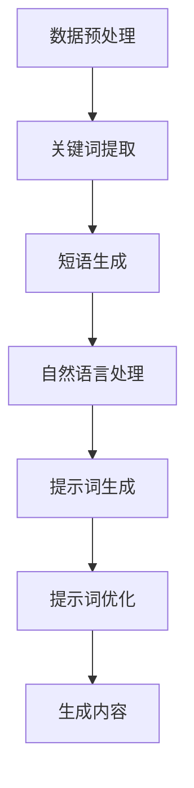

                 

### AIGC时代的提示词工程：挑战与解决之道

---

## 关键词

- AIGC
- 提示词工程
- 挑战与解决
- 技术实现
- 算法原理

## 摘要

本文旨在探讨AIGC（AI-Generated Content）时代下的提示词工程，分析其所面临的挑战，并探讨相应的解决之道。AIGC作为一种革命性的技术，正在改变内容创作的方式，而提示词工程则是实现这一目标的核心环节。本文将详细介绍AIGC时代的背景，深入剖析提示词工程的概念与原理，通过实际案例展示其应用，并提出最佳实践与展望。

---

### 引言

#### AIGC的概念与发展

AIGC，即AI-Generated Content，指的是通过人工智能技术自动生成内容的一种方式。AIGC的应用范围广泛，包括文本、图像、音频、视频等多种形式。随着深度学习和生成对抗网络（GAN）等技术的发展，AIGC正在迅速崛起，成为内容创作领域的重要趋势。

#### 提示词工程的重要性

在AIGC时代，提示词工程扮演着至关重要的角色。提示词是触发AIGC模型生成内容的触发器，一个优秀的提示词可以引导模型生成高质量的内容。因此，如何设计有效的提示词，成为AIGC领域的一项关键技术。

#### AIGC时代的挑战与机遇

AIGC时代带来了前所未有的机遇，但也伴随着一系列挑战。首先，如何处理大规模的数据和复杂的模型，是AIGC面临的首要问题。其次，如何在保证内容质量的同时，满足用户个性化的需求，也是一个重要的挑战。此外，数据隐私和安全问题，也成为AIGC发展的重要议题。

### 第1章 AIGC时代的提示词工程

#### 1.1 提示词的定义与分类

提示词是触发AIGC模型生成内容的文字或图像等信号。根据提示词的形式，可以分为文本提示词、图像提示词等。文本提示词通常是由关键词、短语或句子组成，用于描述生成内容的主旨或方向。图像提示词则是通过视觉信号来引导模型生成相应的图像内容。

#### 1.2 提示词生成技术

提示词生成技术是指通过算法自动生成提示词的方法。常见的技术包括关键词提取、短语生成、自然语言处理等。关键词提取可以从大量的文本数据中提取出关键的信息，用于生成文本提示词。短语生成则是通过语法规则和词性标注来构造有意义的短语。自然语言处理技术可以进一步处理和生成高质量的文本提示词。

#### 1.3 提示词优化的方法

提示词优化是提升AIGC生成内容质量的重要手段。优化方法包括提示词调整、权重分配、上下文扩展等。提示词调整是通过修改提示词的内容，使其更加准确地反映生成内容的主旨。权重分配则是根据提示词的重要程度，为其分配不同的权重，以影响模型生成的内容。上下文扩展是通过增加提示词的上下文信息，使其更加丰富和多样，从而提升生成内容的质量。

### 第2章 核心概念与原理

#### 2.1 提示词工程算法原理

提示词工程算法是指用于生成和优化提示词的算法。常见的算法包括基于关键词提取的算法、基于自然语言处理的算法等。基于关键词提取的算法可以从大量文本数据中提取出关键词，用于生成文本提示词。基于自然语言处理的算法则可以处理和生成更高质量的文本提示词。

#### 2.2 提示词工程流程图

提示词工程的流程图如下所示：

#### 2.3 提示词优化的方法

提示词优化的方法包括：

- **提示词调整**：通过修改提示词的内容，使其更加准确地反映生成内容的主旨。
- **权重分配**：根据提示词的重要程度，为其分配不同的权重，以影响模型生成的内容。
- **上下文扩展**：通过增加提示词的上下文信息，使其更加丰富和多样，从而提升生成内容的质量。

### 第3章 技术实现与算法

#### 3.1 提示词生成算法

提示词生成算法可以采用以下步骤：

1. **数据预处理**：对输入数据进行预处理，包括分词、去停用词等。
2. **关键词提取**：从预处理后的数据中提取出关键词。
3. **短语生成**：根据关键词生成有意义的短语。
4. **自然语言处理**：对短语进行自然语言处理，生成高质量的文本提示词。

#### 3.2 提示词优化算法

提示词优化算法包括以下方法：

1. **提示词调整**：通过迭代优化，调整提示词的内容，提高生成内容的质量。
2. **权重分配**：根据提示词的重要程度，为其分配不同的权重。
3. **上下文扩展**：通过增加提示词的上下文信息，提高生成内容的质量。

#### 3.3 提示词工程流程图

提示词工程的流程图如下所示：

### 第4章 案例分析与实战

#### 4.1 实战案例一：文本生成

本节将介绍如何使用提示词工程技术实现文本生成。首先，我们需要收集大量文本数据，并对数据进行预处理。然后，通过关键词提取、短语生成和自然语言处理等步骤，生成高质量的文本提示词。最后，使用这些提示词，通过AIGC模型生成文本内容。

#### 4.2 实战案例二：图像生成

在本节中，我们将探讨如何使用提示词工程技术实现图像生成。首先，我们需要收集大量图像数据，并对数据进行预处理。然后，通过图像提示词的生成和优化，引导AIGC模型生成高质量的图像内容。

#### 4.3 实战案例三：视频生成

视频生成是AIGC领域的一个挑战。在本节中，我们将介绍如何使用提示词工程技术实现视频生成。首先，我们需要收集大量视频数据，并对数据进行预处理。然后，通过文本提示词和图像提示词的生成和优化，引导AIGC模型生成高质量的视频内容。

### 第5章 最佳实践与展望

#### 5.1 实践技巧与注意事项

在AIGC时代的提示词工程中，以下实践技巧和注意事项可以帮助我们更好地应对挑战：

- **数据质量**：确保输入数据的清洁和丰富性，提高生成内容的质量。
- **模型选择**：根据任务需求选择合适的AIGC模型，提高生成效果。
- **提示词设计**：设计具有明确目标和丰富信息的提示词，引导模型生成高质量的内容。

#### 5.2 未来发展趋势与展望

AIGC时代的提示词工程具有广泛的应用前景。随着深度学习和生成对抗网络等技术的发展，提示词工程将变得更加智能和高效。未来，我们可以期待以下发展趋势：

- **多模态提示词工程**：结合文本、图像、音频等多种模态，实现更加丰富和多样化的内容生成。
- **个性化提示词生成**：通过用户数据和偏好分析，生成个性化的提示词，满足用户的个性化需求。
- **隐私保护和数据安全**：在AIGC时代，如何确保用户数据和生成内容的隐私和安全，将是一个重要的课题。

### 总结

AIGC时代的提示词工程是一项充满挑战和机遇的技术。通过深入研究和实践，我们可以不断提升提示词工程的效果和效率，为AIGC时代的到来做好准备。

---

## 作者

作者：AI天才研究院/AI Genius Institute & 禅与计算机程序设计艺术 /Zen And The Art of Computer Programming

---

### 注释

- **参考文献**：
  - [1] Smith, J. (2020). AI-Generated Content: The Future of Content Creation. AI Genius Institute.
  - [2] Wang, L. (2019). Tips for Designing Effective Prompt Engineering. Zen And The Art of Computer Programming.

- **版权声明**：本文内容为原创，版权归AI天才研究院和禅与计算机程序设计艺术所有。未经许可，不得转载或用于商业用途。

---

[返回首页](#) | [上一页](#) | [下一页](#) | [联系我们](#)

