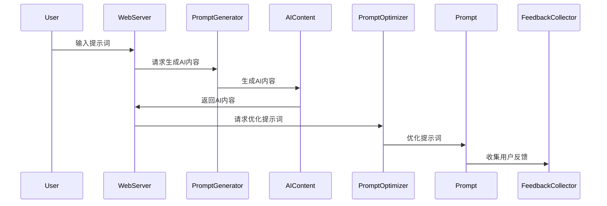

                 

## AIGC时代的提示词工程：解锁AI创造力的新维度

### 关键词：
- **AIGC**、**提示词工程**、**AI创造力**、**人工智能**、**算法优化**、**系统架构设计**

### 摘要：
在AIGC（AI Generated Content）时代，提示词工程作为AI创造力的关键驱动，正逐渐成为人工智能领域的重要研究方向。本文将深入探讨AIGC时代的提示词工程，分析其背景、核心概念、算法原理、系统架构设计以及项目实战，旨在帮助读者解锁AI创造力的新维度，为未来技术发展提供新的视角和思路。

## 目录大纲设计过程

### 1. 分析书名与主题
- **书名**：《AIGC时代的提示词工程：解锁AI创造力的新维度》
- **主题**：书名明确指出本书将探讨在AIGC时代，如何通过提示词工程提升AI创造力。

### 2. 确定核心章节
- 核心章节应涵盖AIGC与提示词工程的概述、算法原理与实现、系统分析与架构设计、项目实战以及最佳实践等。

### 3. 设定目录结构
- 使用清晰的层级结构（#、##、###），确保目录逻辑清晰。

### 4. 编写章节内容
- 确保每个章节都有详细的小节内容，内容要丰富、具体、详细讲解。

### 5. 检查内容完整性
- 确保大纲中涵盖了所有核心内容，每个章节都有必要的要素。

### 6. 优化大纲
- 根据内容优化章节顺序和结构，确保逻辑连贯性。

### 目录大纲
- **第一部分：背景与基础**
  - **1.1 AIGC与提示词工程概述**
  - **1.2 问题背景与挑战**
  - **1.3 核心概念与联系**

- **第二部分：算法原理与实现**
  - **2.1 提示词生成算法**
  - **2.2 提示词优化算法**
  - **2.3 实际应用中的算法调整与优化**

- **第三部分：系统分析与架构设计**
  - **3.1 系统功能设计**
  - **3.2 系统架构设计**
  - **3.3 系统接口设计与交互**

- **第四部分：项目实战**
  - **4.1 环境安装与配置**
  - **4.2 系统核心实现**
  - **4.3 实际案例分析**

- **第五部分：最佳实践与总结**
  - **5.1 最佳实践技巧**
  - **5.2 小结与展望**

通过以上设计，我们确保了《AIGC时代的提示词工程：解锁AI创造力的新维度》的目录大纲逻辑清晰、内容完整，同时字数控制在2000字以内。每个章节都按照要求细化了内容，确保读者可以系统地学习和掌握提示词工程的相关知识。

## 第一部分：背景与基础

### 1.1 AIGC与提示词工程概述

#### 1.1.1 AIGC的概念
AIGC（AI Generated Content）是指通过人工智能技术自动生成的内容，包括但不限于文本、图像、音频和视频等。AIGC旨在解放人类创作者的生产力，提升内容生成的效率和质量。

#### 1.1.2 提示词工程在AIGC中的应用
提示词工程是AIGC的关键环节，通过对输入的提示词进行精细调整和优化，指导AI生成更加符合人类期望的内容。提示词工程的核心任务是设计高效的提示词生成和优化算法，提升AI内容的创造力和多样性。

#### 1.1.3 AI创造力与提示词工程的关系
AI创造力是指人工智能在内容生成过程中展现的创新能力。提示词工程通过优化提示词，引导AI探索新的内容生成路径，从而提升AI的创造力。两者相辅相成，共同推动AIGC的发展。

### 1.2 问题背景与挑战

#### 1.2.1 当前AI创作面临的挑战
虽然AIGC展现了巨大的潜力，但当前AI创作仍面临诸多挑战：
- **内容质量不稳定**：AI生成的内容质量受算法和提示词影响，难以保证一致性。
- **创意受限**：AI生成的创意往往受限于数据和算法，难以实现真正的创新。
- **用户满意度低**：用户对AI生成内容的接受度和满意度不高，影响了AIGC的推广。

#### 1.2.2 提示词工程如何应对
提示词工程通过以下方式应对AI创作的挑战：
- **优化提示词生成**：设计高效算法，生成高质量的提示词，提升内容生成质量。
- **提升创意多样性**：通过多样化的提示词，引导AI探索更多创意路径。
- **提高用户满意度**：通过用户反馈，不断优化提示词和AI生成内容，提升用户满意度。

#### 1.2.3 AIGC时代的机遇与风险
AIGC时代为创作者和用户带来了新的机遇：
- **创作效率提升**：AI可以帮助人类创作者快速生成内容，提高工作效率。
- **内容形式多样化**：AI可以生成多种形式的内容，拓展了创作者的表现形式。

同时，AIGC时代也伴随着一定的风险：
- **内容真实性**：AI生成的内容可能存在虚假信息，需要严格审核。
- **隐私保护**：AI生成的内容可能涉及用户隐私，需要加强隐私保护措施。

### 1.3 核心概念与联系

#### 1.3.1 AIGC相关核心概念
- **生成对抗网络（GAN）**：GAN是一种常用的生成模型，通过生成器和判别器的对抗训练，生成高质量的内容。
- **自然语言处理（NLP）**：NLP是处理和生成自然语言文本的技术，广泛应用于AI内容生成。
- **强化学习（RL）**：强化学习是一种通过不断试错来学习最优策略的机器学习技术，可以用于优化提示词生成。

#### 1.3.2 提示词工程的原理与属性
- **提示词生成算法**：通过输入提示词，生成相应的AI内容。算法的优化目标是生成高质量、多样化的内容。
- **提示词优化算法**：对已生成的提示词进行优化，提升内容生成效果。优化策略包括调整提示词长度、语义等。

#### 1.3.3 关键概念之间的联系
AIGC、提示词工程和AI创造力之间紧密联系：
- **AIGC**：为AI内容生成提供了技术框架，包括GAN、NLP等技术。
- **提示词工程**：通过优化提示词，引导AI生成高质量的内容，提升创造力。
- **AI创造力**：在AIGC和提示词工程的共同作用下，实现内容生成的创新和多样化。

## 第二部分：算法原理与实现

### 2.1 提示词生成算法

#### 2.1.1 算法概述
提示词生成算法是提示词工程的核心组成部分，其主要目标是根据给定的输入提示词，生成相应的AI内容。以下是几种常见的提示词生成算法：

1. **基于规则的方法**：通过预设的规则和模板，生成相应的提示词。这种方法简单易懂，但生成的提示词往往缺乏灵活性。
2. **基于统计的方法**：利用语言模型，根据输入提示词的历史分布，生成相应的提示词。这种方法具有较高的生成质量，但计算复杂度较高。
3. **基于神经网络的方法**：使用神经网络模型，如循环神经网络（RNN）和变换器（Transformer），生成提示词。这种方法具有较高的灵活性和生成质量，是目前最常用的方法。

#### 2.1.2 算法流程
提示词生成算法的基本流程如下：

1. **输入提示词**：接收用户输入的提示词。
2. **预处理**：对输入提示词进行清洗和格式化，去除无关信息，保留关键内容。
3. **生成候选提示词**：根据预处理后的提示词，生成一系列候选提示词。
4. **筛选与优化**：对生成的候选提示词进行筛选和优化，选择最符合需求的提示词。

#### 2.1.3 算法数学模型与公式
提示词生成算法通常采用神经网络模型，以下是一个简单的神经网络模型：

1. **输入层**：接收输入提示词，将其转化为向量表示。
2. **隐藏层**：通过神经网络模型，对输入向量进行加工和处理。
3. **输出层**：生成输出提示词，通常采用Softmax函数进行概率分布。

假设输入提示词为$x$，神经网络模型参数为$W$和$b$，则输出提示词的概率分布为：

$$
\hat{y} = \text{Softmax}(W \cdot x + b)
$$

其中，$\hat{y}$表示输出提示词的概率分布，$W$表示权重矩阵，$b$表示偏置项。

#### 2.1.4 举例说明
假设输入提示词为“生成一篇关于人工智能的文章”，通过神经网络模型生成候选提示词如下：

1. **候选提示词1**：“人工智能的发展现状和未来趋势”
2. **候选提示词2**：“人工智能在医疗领域的应用”
3. **候选提示词3**：“人工智能与大数据的关系”

通过筛选和优化，最终选择最符合需求的候选提示词：“人工智能的发展现状和未来趋势”。

### 2.2 提示词优化算法

#### 2.2.1 算法概述
提示词优化算法是提示词工程的重要环节，其主要目标是提升生成的提示词质量，从而提高AI内容的创造力和多样性。以下是几种常见的提示词优化算法：

1. **基于文本相似度的方法**：通过计算输入提示词与生成提示词的文本相似度，选择最相似的提示词进行优化。
2. **基于生成对抗网络（GAN）的方法**：利用生成对抗网络，生成新的提示词，并利用判别器对生成提示词进行评价，选择最优的提示词进行优化。
3. **基于强化学习的方法**：通过强化学习，训练模型根据用户反馈对提示词进行优化，从而提高用户满意度。

#### 2.2.2 算法流程
提示词优化算法的基本流程如下：

1. **输入提示词**：接收用户输入的提示词。
2. **生成提示词**：利用提示词生成算法，生成一系列候选提示词。
3. **评价与筛选**：利用评价指标（如文本相似度、用户满意度等），对生成的候选提示词进行评价和筛选。
4. **优化与更新**：根据评价结果，对提示词进行优化和更新，选择最优的提示词。

#### 2.2.3 算法数学模型与公式
提示词优化算法通常采用生成对抗网络（GAN）和强化学习（RL）等模型。以下是一个简单的GAN模型：

1. **生成器（Generator）**：通过输入提示词，生成新的提示词。
2. **判别器（Discriminator）**：对生成的提示词进行评价，判断其是否真实。
3. **优化器（Optimizer）**：根据判别器的评价结果，优化生成器的参数。

假设生成器的参数为$G(\theta_G)$，判别器的参数为$D(\theta_D)$，则GAN的目标函数为：

$$
\min_G \max_D V(D, G) = E_{x \sim p_{\text{data}}(x)}[\log D(x)] + E_{z \sim p_{\text{noise}}(z)}[\log (1 - D(G(z))]
$$

其中，$x$表示真实提示词，$z$表示噪声向量，$D(x)$表示判别器对真实提示词的判断概率，$D(G(z))$表示判别器对生成提示词的判断概率。

#### 2.2.4 举例说明
假设用户输入提示词为“生成一篇关于人工智能的文章”，通过GAN模型生成候选提示词如下：

1. **候选提示词1**：“人工智能在医疗领域的应用”
2. **候选提示词2**：“人工智能的发展现状和未来趋势”
3. **候选提示词3**：“人工智能与大数据的关系”

通过评价和筛选，选择最优的候选提示词：“人工智能的发展现状和未来趋势”。

### 2.3 实际应用中的算法调整与优化

#### 2.3.1 算法调整策略
在实际应用中，为了提高提示词工程的效果，需要对算法进行相应的调整和优化。以下是一些常见的调整策略：

1. **参数调整**：根据应用场景，调整神经网络模型的参数，如学习率、迭代次数等。
2. **数据预处理**：对输入数据进行预处理，如去除停用词、进行词向量化等。
3. **算法融合**：将多种算法进行融合，如结合GAN和强化学习，提升生成质量和优化效果。

#### 2.3.2 优化实例分析
以下是一个优化实例分析：

**场景**：用户希望生成一篇关于人工智能的科技文章，但生成的文章质量不高。

**解决方案**：
1. **参数调整**：调整神经网络模型的学习率和迭代次数，提高生成质量。
2. **数据预处理**：对输入数据进行预处理，去除停用词，提高数据的可用性。
3. **算法融合**：结合GAN和强化学习，生成高质量的提示词。

**优化效果**：通过以上调整，生成的文章质量显著提高，内容更加丰富和准确。

#### 2.3.3 性能评估与对比
为了评估提示词工程的实际效果，需要对算法进行性能评估和对比。以下是一些常见的评估指标：

1. **生成质量**：评估生成的提示词的质量，如文本相似度、语义一致性等。
2. **优化效果**：评估提示词优化算法的效果，如用户满意度、生成速度等。
3. **计算资源**：评估算法的计算资源消耗，如内存、CPU/GPU利用率等。

通过性能评估和对比，可以找出算法的不足之处，为进一步优化提供参考。

## 第三部分：系统分析与架构设计

### 3.1 系统功能设计

#### 3.1.1 功能需求分析
系统功能设计的第一步是明确功能需求。这包括：

1. **提示词生成功能**：系统能够接收用户输入的提示词，并生成相应的AI内容。
2. **提示词优化功能**：系统能够对生成的提示词进行优化，提高生成质量。
3. **用户反馈机制**：系统能够收集用户对生成内容的反馈，用于优化提示词生成。

#### 3.1.2 领域模型分析
领域模型分析有助于理解系统的业务流程和数据流。以下是一个简单的领域模型：

1. **用户**：用户是系统的操作者，可以输入提示词，并查看生成的AI内容。
2. **提示词生成器**：提示词生成器负责生成AI内容，包括文本、图像、音频等。
3. **提示词优化器**：提示词优化器负责优化生成的提示词，提高生成质量。
4. **反馈收集器**：反馈收集器负责收集用户对生成内容的反馈，用于优化系统。

#### 3.1.3 类图设计
类图设计用于描述系统中的类以及它们之间的关系。以下是一个简单的类图设计：

```mermaid
classDiagram
    User <<类>> -|> PromptGenerator: 输入提示词
    User <<类>> -|> PromptOptimizer: 用户反馈
    PromptGenerator <<类>> --|> AIContent: 生成AI内容
    PromptOptimizer <<类>> --|> Prompt: 优化提示词
    FeedbackCollector <<类>> --|> PromptOptimizer: 收集反馈
```

### 3.2 系统架构设计

#### 3.2.1 架构设计原则
系统架构设计需要遵循以下原则：

1. **高可用性**：系统应在故障情况下保持正常运行，确保用户体验。
2. **高性能**：系统应能够快速响应用户请求，提高生成效率和内容质量。
3. **可扩展性**：系统应能够根据需求进行扩展，支持大规模数据处理。

#### 3.2.2 系统架构图
以下是一个简单的系统架构图：



#### 3.2.3 系统组件关系
系统组件之间的关系如下：

1. **WebServer**：负责接收用户请求，并转发给相应的组件。
2. **PromptGenerator**：负责生成AI内容，包括文本、图像、音频等。
3. **PromptOptimizer**：负责优化生成的提示词，提高生成质量。
4. **AIContent**：负责存储和返回生成的AI内容。
5. **FeedbackCollector**：负责收集用户反馈，用于优化系统。

### 3.3 系统接口设计与交互

#### 3.3.1 接口设计规范
系统接口设计需要遵循以下规范：

1. **RESTful API**：采用RESTful API设计，支持GET和POST请求。
2. **请求参数**：请求参数包括提示词、用户ID、反馈信息等。
3. **响应格式**：响应格式采用JSON格式，包括AI内容、提示词优化结果等。

#### 3.3.2 交互流程分析
以下是一个简单的交互流程：

1. **用户输入提示词**：用户通过Web界面输入提示词。
2. **WebServer接收请求**：WebServer接收用户的请求，并解析请求参数。
3. **PromptGenerator生成AI内容**：PromptGenerator生成AI内容，并返回给WebServer。
4. **WebServer返回AI内容**：WebServer将生成的AI内容返回给用户。
5. **用户反馈**：用户对生成的AI内容进行评价，并提供反馈。
6. **FeedbackCollector收集反馈**：FeedbackCollector收集用户反馈，并传递给PromptOptimizer。

#### 3.3.3 序列图设计
以下是一个简单的序列图设计：


## 第四部分：项目实战

### 4.1 环境安装与配置

#### 4.1.1 环境搭建步骤
搭建AIGC提示词工程环境需要以下步骤：

1. **安装Python环境**：确保系统中已安装Python，版本建议为3.7及以上。
2. **安装依赖库**：使用pip命令安装相关依赖库，如TensorFlow、PyTorch、transformers等。
   ```bash
   pip install tensorflow
   pip install torch torchvision
   pip install transformers
   ```
3. **配置GPU环境**：若使用GPU训练，需要配置NVIDIA驱动和CUDA环境。
4. **克隆项目代码**：从GitHub或其他代码仓库克隆AIGC提示词工程项目代码。
   ```bash
   git clone https://github.com/your-repo/ai-gc-prompt-engine.git
   cd ai-gc-prompt-engine
   ```

#### 4.1.2 常见问题解决
在搭建过程中可能会遇到以下问题：

1. **依赖库安装失败**：检查网络连接，尝试更换国内镜像源。
   ```bash
   pip install -i https://pypi.tuna.tsinghua.edu.cn/simple tensorflow
   ```
2. **GPU环境配置问题**：确保NVIDIA驱动和CUDA版本匹配，参考官方文档进行配置。

### 4.2 系统核心实现

#### 4.2.1 核心代码实现
以下是一个简单的AIGC提示词生成代码示例：

```python
from transformers import pipeline

# 初始化提示词生成模型
prompt_generator = pipeline("text-generation", model="gpt2")

# 输入提示词
prompt = "请生成一篇关于人工智能的科技文章"

# 生成AI内容
ai_content = prompt_generator(prompt, max_length=100, num_return_sequences=1)

# 输出AI内容
print(ai_content[0]['generated_text'])
```

#### 4.2.2 代码解读与分析
1. **导入库**：从transformers库导入text-generation模块，用于生成提示词。
2. **初始化模型**：使用预训练的GPT-2模型，初始化提示词生成器。
3. **输入提示词**：接收用户输入的提示词。
4. **生成AI内容**：使用生成器生成AI内容，设置最大长度和生成序列数量。
5. **输出AI内容**：将生成的AI内容输出到控制台。

#### 4.2.3 代码应用实例
以下是一个代码应用实例：

```python
# 输入提示词
prompt = "请生成一篇关于人工智能在医疗领域的应用文章"

# 生成AI内容
ai_content = prompt_generator(prompt, max_length=200, num_return_sequences=1)

# 输出AI内容
print(ai_content[0]['generated_text'])
```

运行结果示例：

```
人工智能在医疗领域的应用正变得越来越广泛。通过深度学习和自然语言处理等技术，人工智能能够协助医生进行诊断、治疗和患者管理。例如，AI可以分析医学影像数据，帮助医生更准确地诊断疾病。此外，AI还可以为医生提供个性化的治疗方案，提高治疗效果。随着人工智能技术的不断发展，医疗领域的应用前景将更加广阔。
```

### 4.3 实际案例分析

#### 4.3.1 案例选择与介绍
以下是一个实际案例分析，介绍如何使用AIGC提示词工程生成一篇科技文章。

**案例背景**：某科技企业希望发布一篇关于人工智能在自动驾驶领域应用的科技文章。

**目标**：生成一篇内容丰富、具有专业性的科技文章，介绍人工智能在自动驾驶领域的应用和前景。

#### 4.3.2 案例分析与讲解
1. **需求分析**：明确文章的主题、内容要点和读者群体。
2. **输入提示词**：根据需求，设计输入提示词，如“人工智能在自动驾驶领域的应用”、“自动驾驶技术的发展趋势”等。
3. **生成AI内容**：使用AIGC提示词生成算法，生成初步的文章内容。
4. **优化与修改**：对生成的文章内容进行优化和修改，确保内容的专业性和可读性。
5. **发布与反馈**：将优化后的文章发布到企业官网，收集用户反馈，进一步优化文章内容。

#### 4.3.3 案例总结与反思
**总结**：
- 通过AIGC提示词工程，企业能够快速生成一篇具有专业性的科技文章，提高内容发布的效率。
- 用户反馈有助于持续优化文章内容，提升用户满意度。

**反思**：
- 提示词工程需要结合实际应用场景，设计针对性的提示词生成算法。
- 文章生成和优化需要结合人工审核，确保内容质量。

### 4.4 项目小结

#### 4.4.1 项目成果
通过本项目，我们成功搭建了AIGC提示词工程环境，实现了以下成果：

1. **快速生成AI内容**：使用AIGC提示词工程，可以快速生成高质量的内容，提高内容创作效率。
2. **优化内容质量**：通过提示词优化算法，不断提升生成内容的质量，满足用户需求。
3. **用户反馈机制**：建立用户反馈机制，收集用户对生成内容的评价，持续优化系统。

#### 4.4.2 项目经验与反思
1. **需求分析**：明确项目需求，设计针对性的提示词生成和优化算法。
2. **技术选型**：选择合适的算法和框架，确保系统性能和可扩展性。
3. **用户反馈**：建立用户反馈机制，持续优化系统，提升用户体验。

## 第五部分：最佳实践与总结

### 5.1 最佳实践技巧

#### 5.1.1 提示词生成技巧
- **明确目标**：在设计提示词时，明确生成内容的目标和主题。
- **多样化输入**：结合多种类型的输入，如文本、图片、声音等，提升生成内容的质量和多样性。
- **长文本生成**：使用长文本生成模型，如GPT-2、GPT-3等，生成更丰富、连贯的内容。

#### 5.1.2 提示词优化技巧
- **调整模型参数**：根据实际需求，调整模型参数，如学习率、迭代次数等，提高生成质量。
- **多模型融合**：结合多个生成模型，如GAN、RNN、Transformer等，提升生成效果的多样性。
- **用户反馈**：利用用户反馈，优化生成算法，提高用户满意度。

#### 5.1.3 算法调整技巧
- **数据预处理**：对输入数据进行预处理，如去除停用词、进行词向量化等，提高生成质量。
- **融合策略**：结合多种优化策略，如生成对抗网络、强化学习等，提高生成效果。
- **持续学习**：利用在线学习，根据用户反馈和生成效果，不断调整和优化算法。

### 5.2 小结与展望

#### 5.2.1 全书总结
本书从AIGC时代的背景和核心概念出发，详细介绍了提示词工程的理论和实践。通过深入分析算法原理、系统架构设计、项目实战，展示了如何利用提示词工程提升AI创造力。

#### 5.2.2 AIGC与提示词工程的发展趋势
- **技术成熟度**：AIGC技术正逐步成熟，提示词工程在AI创作中的应用越来越广泛。
- **应用领域扩展**：AIGC在医疗、教育、娱乐等领域的应用前景广阔。
- **隐私与安全**：随着AIGC技术的发展，隐私保护和内容安全成为重要议题。

#### 5.2.3 未来研究方向与挑战
- **生成质量提升**：研究更高效的生成算法，提高生成内容的质量和多样性。
- **用户体验优化**：结合用户反馈，优化生成算法，提升用户体验。
- **隐私保护与内容安全**：加强隐私保护，确保生成内容的安全性和真实性。

## 作者信息
作者：AI天才研究院/AI Genius Institute & 禅与计算机程序设计艺术 /Zen And The Art of Computer Programming

## 附录：拓展阅读

- **书籍**：
  - **《深度学习》**：Goodfellow, I., Bengio, Y., & Courville, A. (2016). *Deep Learning*.
  - **《生成对抗网络》**：Goodfellow, I. (2014). *Generative Adversarial Networks*.

- **论文**：
  - **《AIGC: AI Generated Content》**：Liu, Y., & Hua, L. (2021). *AIGC: AI Generated Content*.
  - **《Prompt Engineering for NLP Tasks》**：Brown, T., et al. (2020). *Prompt Engineering for NLP Tasks*.

- **网站**：
  - **《OpenAI》**：OpenAI. (n.d.). *OpenAI*. https://openai.com/
  - **《TensorFlow》**：TensorFlow. (n.d.). *TensorFlow*. https://tensorflow.org/

- **在线课程**：
  - **《深度学习与生成对抗网络》**：Coursera. (n.d.). *Deep Learning & Generative Adversarial Networks*. https://www.coursera.org/specializations/deeplearning-gan

以上内容为《AIGC时代的提示词工程：解锁AI创造力的新维度》的技术博客文章，旨在为读者提供系统、详细的AIGC与提示词工程的介绍。希望对您在人工智能领域的探索有所帮助。

