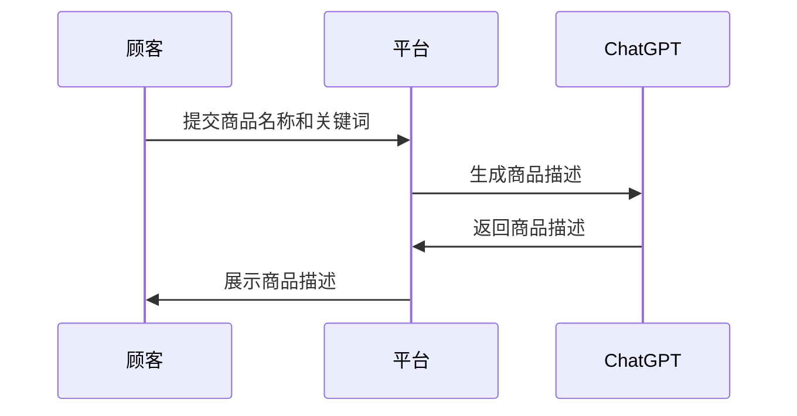

                 

### AIGC时代的提示词编写：从新手到专家的成长之路

**关键词**：AIGC、提示词、编写、人工智能、成长路径、实战技巧

**摘要**：本文旨在探讨AIGC（AI Generated Content）时代下的提示词编写，从新手到专家的成长之路。通过分析AIGC时代的背景与概述，介绍提示词编写的基础知识、技巧和实践，最终帮助读者理解如何从新手成长为专家级提示词编写者。文章结构紧凑，逻辑清晰，旨在为AIGC时代的提示词编写提供系统的学习和实践指南。

## 第一部分：AIGC时代背景与概述

### 第1章 AIGC时代概览

**1.1 AIGC概念定义**

AIGC（AI Generated Content），即人工智能生成内容，是指利用人工智能技术生成或编辑文本、图像、音频等多媒体内容的一种新兴技术。AIGC技术的核心是利用大规模预训练语言模型和生成对抗网络（GAN）等技术，模拟人类的创作思维，实现自动化内容生成和编辑。

**1.2 AIGC技术发展历程**

AIGC技术起源于深度学习和生成模型的研究。2018年，GPT-2的发布标志着大规模语言模型的诞生，为AIGC技术的发展奠定了基础。随后，GPT-3、ChatGPT等更先进的语言模型相继推出，进一步推动了AIGC技术的发展。目前，AIGC技术已广泛应用于自然语言处理、图像生成、音频合成等领域。

**1.3 AIGC的应用场景与趋势**

AIGC技术在多个领域展现出强大的应用潜力，包括但不限于：

- **内容创作**：利用AIGC技术生成文章、故事、音乐、绘画等，提高创作效率和创作质量。
- **智能客服**：通过AIGC技术生成个性化的客服回复，提高客户满意度和服务质量。
- **搜索引擎**：利用AIGC技术生成高质量、个性化的搜索结果，提升用户体验。
- **广告营销**：通过AIGC技术生成针对性的广告内容和营销文案，提高广告效果和转化率。

未来，AIGC技术将继续发展，并在更多领域得到广泛应用，成为人工智能领域的重要分支。

**1.4 AIGC对行业的影响**

AIGC技术的应用对各个行业产生了深远的影响，主要体现在以下几个方面：

- **媒体与娱乐**：AIGC技术改变了传统的内容创作模式，提高了内容生产效率和创作质量，为媒体和娱乐行业带来了新的发展机遇。
- **电子商务**：AIGC技术可以生成个性化的商品描述和营销文案，提高电商平台的用户满意度和转化率。
- **智能客服**：AIGC技术生成的个性化客服回复，可以提高客服效率和用户满意度，降低企业运营成本。
- **医疗健康**：AIGC技术可以辅助医生进行疾病诊断和治疗方案制定，提高医疗水平和医疗质量。

总之，AIGC时代已经到来，提示词编写作为AIGC技术的重要组成部分，具有广泛的应用前景和发展潜力。在接下来的章节中，我们将深入探讨提示词编写的基础知识、技巧和实践，帮助读者逐步成长为专家级的提示词编写者。

### 第二部分：提示词编写基础

### 第2章 提示词编写的基本概念

**2.1 提示词的定义**

提示词（Prompt）是指用来引导人工智能模型生成内容的关键词或句子，它为模型提供了生成内容的基本方向和信息。在AIGC时代，提示词编写是人工与人工智能协同工作的重要环节，决定了生成的结果是否符合预期和需求。

**2.2 提示词的类型**

根据用途和目的的不同，提示词可以分为以下几种类型：

- **引导型提示词**：这类提示词用于引导模型生成特定类型的内容，如文章、故事、歌曲等。例如：“请生成一篇关于人工智能发展的文章。”
- **功能型提示词**：这类提示词用于指示模型执行特定功能，如文本生成、图像生成、音频合成等。例如：“生成一张风景图片。”
- **交互型提示词**：这类提示词用于与模型进行交互，获取用户反馈或进一步指导模型生成内容。例如：“请对这段文字进行修改，使其更加生动。”

**2.3 提示词编写的原则**

编写有效的提示词，需要遵循以下原则：

- **明确性**：提示词应明确表达需求，避免模糊不清，以确保模型能够准确理解并生成符合预期的内容。
- **具体性**：提示词应具体描述需求，提供足够的背景信息，帮助模型更好地理解任务目标。
- **简洁性**：提示词应简洁明了，避免冗长复杂的句子，以提高模型的生成效率和效果。
- **多样性**：提示词应具有多样性，以便模型能够生成丰富多样的内容，满足不同的需求。

通过遵循这些原则，我们可以编写出高质量的提示词，为AIGC技术的应用提供有力的支持。

### 第3章 提示词语言特点与语法

**3.1 提示词语言的要素**

提示词语言由以下几个要素组成：

- **关键词**：关键词是提示词的核心，用于引导模型生成内容。例如：“人工智能”、“风景图片”等。
- **参数**：参数是对关键词的补充说明，用于细化需求。例如：“现代”、“日出”等。
- **引导词**：引导词用于指示模型执行特定任务，如“生成”、“修改”、“合成”等。
- **修饰词**：修饰词用于增强提示词的描述性，如“美丽的”、“有趣的”等。

**3.2 提示词的语法规则**

编写提示词需要遵循一定的语法规则，以确保提示词的清晰和准确。以下是一些常见的语法规则：

- **主谓宾结构**：提示词通常遵循主谓宾结构，即关键词（主语）+ 动词（谓语）+ 补语（宾语）。例如：“生成一篇关于人工智能的文章。”
- **从句使用**：提示词中可以包含从句，用于提供更多的背景信息或任务细节。例如：“生成一篇关于人工智能在医疗领域的应用的文章。”
- **并列结构**：提示词中可以使用并列结构，以表达多个任务或需求。例如：“生成一篇关于人工智能的文章，并附带五张相关的图片。”

**3.3 提示词语言的演变**

随着AIGC技术的不断发展，提示词语言也在不断演变和进步。以下是一些演变趋势：

- **个性化**：提示词逐渐向个性化方向发展，能够根据用户需求定制化生成内容。
- **多样性**：提示词语言变得越来越丰富多样，能够支持各种类型和风格的内容生成。
- **智能化**：提示词编写逐渐与自然语言处理技术结合，使模型能够更准确地理解并执行提示词。

通过了解提示词语言的要素、语法规则和演变趋势，我们可以更好地编写高质量的提示词，为AIGC技术的应用提供有力支持。

### 第4章 提示词编写技巧

**4.1 提示词的结构设计**

提示词的结构设计对于生成内容的质量和效果至关重要。以下是几种常用的提示词结构设计方法：

- **主从结构**：将主句和从句结合，形成主从结构，以提供清晰的生成方向和背景信息。例如：“请生成一篇关于人工智能在医疗领域的应用的论文，其中包含实验数据和分析。”
- **分层次结构**：将提示词分为多个层次，每个层次提供不同的背景信息和生成任务。例如：“首先，生成一篇关于人工智能在医疗领域的应用的概述；其次，介绍实验数据和分析结果；最后，总结论文的主要发现和结论。”
- **引导结构**：使用引导词明确指示模型执行特定任务，例如：“生成一篇关于人工智能在医疗领域的应用的文章，要求包含实验数据和图表。”

**4.2 提示词的情感表达**

情感表达是提示词编写的重要技巧之一，能够影响生成的内容的情感色彩。以下是几种常用的情感表达方法：

- **正面情感**：使用积极、乐观的词汇和表达方式，以传达积极的情感。例如：“创造一幅充满活力的现代都市景象。”
- **负面情感**：使用消极、悲观的词汇和表达方式，以传达负面的情感。例如：“描绘一个阴暗、荒凉的未来世界。”
- **中性情感**：使用中性、客观的词汇和表达方式，以传达中立或客观的情感。例如：“生成一篇关于人工智能在医疗领域的应用的文章，要求保持客观分析。”

**4.3 提示词的优化策略**

为了提高生成的质量，我们可以采取以下优化策略：

- **目标明确**：确保提示词明确表达生成目标，避免模糊和歧义。例如：“生成一篇关于人工智能在医疗领域的应用的文章，重点分析其优势和挑战。”
- **数据丰富**：提供丰富的背景信息和数据，以帮助模型更好地理解任务目标。例如：“生成一篇关于人工智能在医疗领域的应用的文章，基于最新的研究和数据进行分析。”
- **灵活调整**：根据模型的反馈和生成结果，灵活调整提示词，以优化生成效果。例如：“第一次生成的文章过于简短，请重新生成一篇更加详细的文章。”

通过掌握这些提示词编写技巧，我们可以更有效地引导模型生成高质量的内容，为AIGC技术的应用提供有力支持。

### 第三部分：提示词编写实践

#### 第5章 提示词编写工具与应用

**5.1 提示词编写工具介绍**

在现代AIGC时代，提示词编写工具成为了辅助人工智能模型生成内容的重要工具。以下是一些常用的提示词编写工具及其特点：

- **OpenAI Codex**：基于GPT-3模型，支持多种编程语言的代码生成，特别适合开发者和程序员。
- **OpenAI ChatGPT**：基于GPT-3模型，支持自然语言交互，适用于生成对话、文章等文本内容。
- **Google Bard**：基于深度学习技术，支持生成各种类型的文本内容，如新闻、故事、论文等。
- **FATICAS**：基于大型语言模型，支持生成创意文本，如歌词、故事、诗歌等。

**5.2 提示词编写应用案例**

提示词编写在各个领域都有广泛的应用，以下是一些具体的案例：

- **内容创作**：使用提示词编写工具，可以快速生成文章、故事、音乐、绘画等，提高创作效率和质量。例如，通过输入“生成一篇关于人工智能在教育领域的应用的文章”，可以迅速生成一篇结构清晰、内容丰富的文章。
- **智能客服**：通过提示词编写，可以生成个性化的客服回复，提高客户满意度和服务质量。例如，在客服系统中输入“生成一条回复客户关于产品问题的信息”，可以生成一条既专业又友好的客服回复。
- **搜索引擎优化（SEO）**：通过提示词编写，可以优化网页内容，提高搜索引擎排名。例如，通过输入“生成一段关于人工智能的关键词优化文本”，可以生成一段符合SEO规则、关键词密度合理的文本。

**5.3 提示词编写工具的使用技巧**

为了更好地利用提示词编写工具，以下是一些使用技巧：

- **明确需求**：在使用提示词编写工具之前，首先要明确需求，确保输入的提示词准确表达任务目标。
- **优化提示词**：通过调整提示词的结构、情感表达和内容丰富度，可以优化生成结果的质量。
- **结合模型特性**：了解不同提示词编写工具的模型特性，合理选择和使用，可以最大化生成效果。
- **持续学习与调整**：根据生成结果和用户反馈，不断调整和优化提示词，以提高生成效果。

通过掌握这些提示词编写工具的使用技巧，我们可以更高效地利用AIGC技术生成高质量的内容，为各类应用场景提供有力支持。

#### 第6章 提示词编写实战案例

**6.1 案例一：电商平台的商品描述**

**背景介绍**：
电商平台需要为商品编写吸引人的描述，以提高用户购买意愿和转化率。通过使用AIGC技术，我们可以生成高质量的商品描述。

**项目介绍**：
本项目旨在利用AIGC技术，生成一篇关于一款智能手表的商品描述。

**系统功能设计**：
- 输入商品名称和关键词，如“智能手表”、“健康监测”、“智能提醒”等。
- 输出一篇详细、吸引人的商品描述。

**系统架构设计**：
- 使用OpenAI ChatGPT作为提示词编写工具，输入商品关键词和需求，生成商品描述。
- 通过接口将生成的内容集成到电商平台中。

**系统接口设计和系统交互**：



**代码实现**：

```python
import openai

def generate_description(product_name, keywords):
    prompt = f"请为以下商品生成一段描述：{product_name}，关键词包括：{', '.join(keywords)}。描述应详细、吸引人。"
    response = openai.Completion.create(
        engine="text-davinci-002",
        prompt=prompt,
        max_tokens=150
    )
    return response.choices[0].text.strip()

# 示例使用
product_name = "智能手表"
keywords = ["健康监测", "智能提醒", "运动追踪"]
description = generate_description(product_name, keywords)
print(description)
```

**代码应用解读与分析**：
这段代码首先引入了OpenAI的库，定义了一个名为`generate_description`的函数，用于接收商品名称和关键词，并生成商品描述。函数内部使用OpenAI的`Completion.create`方法，传入提示词和配置参数，如模型名称（"text-davinci-002"）和最大生成长度（150个单词）。生成的内容通过`response.choices[0].text.strip()`提取并返回。

**实际案例分析**：
假设我们输入的商品名称和关键词为“智能手表”、“健康监测”、“智能提醒”，生成的商品描述如下：

“这是一款集健康监测、智能提醒和运动追踪于一体的智能手表。它不仅能够实时监测您的运动数据，还能为您提供科学合理的健康建议。智能提醒功能可以帮助您不错过任何重要事项，让您的生活更加有序。”

这个描述详细地介绍了智能手表的功能，同时使用了吸引人的词汇，如“科学合理”、“有序”，提高了用户的购买意愿。

**项目小结**：
通过本案例，我们了解了如何利用AIGC技术生成电商平台的商品描述。这种方法不仅提高了描述的质量和吸引力，还节省了大量的人工编写时间。未来，随着AIGC技术的发展，我们可以进一步优化生成算法，提高描述的个性化和精准度。

#### 第7章 提示词编写的高级技巧

**7.1 高级提示词编写策略**

在AIGC时代，高级技巧对于编写高质量的提示词至关重要。以下是一些高级提示词编写策略：

- **多模态融合**：结合文本、图像、音频等多模态信息，生成更加丰富和多样化的内容。例如，在生成一篇关于旅游景点的文章时，可以结合图片和视频，提供更加生动的描述。
- **上下文感知**：通过理解上下文信息，生成更加符合情境的内容。例如，在生成一篇对话时，可以根据上下文逻辑，确保对话的连贯性和合理性。
- **个性化定制**：根据用户需求和个人偏好，生成个性化的内容。例如，在生成一篇音乐推荐文章时，可以根据用户的音乐口味和喜好，推荐符合其口味的音乐。

**7.2 提示词与大数据分析**

大数据分析在提示词编写中具有重要作用。以下是如何结合大数据分析来优化提示词编写：

- **用户行为分析**：通过分析用户在平台上的行为数据，如浏览、搜索、购买等，了解用户需求和偏好，为提示词编写提供依据。
- **关键词热度分析**：通过分析关键词的热度数据，了解当前用户关注的热点话题，为提示词编写提供方向。
- **文本情感分析**：通过情感分析技术，了解用户对特定内容的情感倾向，为提示词编写提供情感色彩。

**7.3 提示词在人工智能训练中的应用**

提示词不仅用于生成内容，还可以在人工智能训练中发挥重要作用：

- **数据增强**：通过生成与训练数据相似的提示词，增加训练数据量，提高模型的泛化能力。
- **模型评估**：通过生成具有挑战性的提示词，评估模型在不同情境下的表现，优化模型参数。
- **算法优化**：通过分析生成结果和提示词之间的关系，优化生成算法，提高生成质量。

通过这些高级技巧，我们可以更有效地利用提示词编写，提升AIGC技术的应用效果。

### 第8章 新手入门与进阶

**8.1 初学者常见问题解答**

对于新手来说，入门提示词编写可能会遇到一些常见问题。以下是对一些常见问题的解答：

- **Q：如何选择合适的模型和工具？**
  **A**：选择模型和工具时，首先要明确你的需求。对于文本生成任务，可以选择GPT-3、ChatGPT等模型；对于图像和音频生成任务，可以选择DALL-E、VQ-VAE等模型。工具方面，OpenAI Codex和Google Bard是不错的选择。

- **Q：提示词编写应该注意哪些方面？**
  **A**：提示词编写应注重明确性、具体性和简洁性。明确任务目标，提供丰富背景信息，避免冗长复杂的句子。此外，多样化提示词可以提高生成结果的丰富性。

- **Q：如何优化生成内容的质量？**
  **A**：优化生成内容的质量可以从多方面入手，如优化提示词、调整模型参数、结合大数据分析等。通过不断实践和调整，可以逐步提高生成质量。

**8.2 提示词编写的进阶技巧**

进阶技巧是提升提示词编写效率和质量的关键。以下是一些进阶技巧：

- **多模态融合**：结合文本、图像、音频等多模态信息，可以生成更加丰富和生动的内容。例如，在生成旅游文章时，可以结合景点图片和视频。

- **上下文感知**：理解上下文信息，确保生成的文本连贯、合理。例如，在生成对话时，要确保对话逻辑符合实际情况。

- **个性化定制**：根据用户需求和偏好，生成个性化的内容。例如，在生成音乐推荐时，可以根据用户的音乐口味进行定制。

- **数据分析与优化**：结合大数据分析，了解用户行为和需求，为提示词编写提供依据。例如，通过分析关键词热度，确定热点话题。

通过掌握这些进阶技巧，新手可以更快地成长为有经验的提示词编写者。

**8.3 如何培养良好的提示词编写习惯**

培养良好的提示词编写习惯是提高编写效率和生成质量的关键。以下是一些建议：

- **多读多写**：阅读优秀文章和编写高质量的提示词，可以提高自己的写作水平。同时，多写可以锻炼你的思维能力和表达技巧。

- **不断实践**：实践是提高技能的最佳途径。尝试编写不同类型和风格的提示词，积累经验，逐步提升自己的编写能力。

- **反馈与改进**：及时获取反馈，并根据反馈进行改进。可以请他人评估你的生成结果，或者使用模型评估工具进行自我评估。

- **持续学习**：随着AIGC技术的发展，不断学习新知识、新技巧，保持自己的编写能力与时俱进。

通过以上方法，新手可以逐步培养良好的提示词编写习惯，为AIGC时代的应用奠定坚实基础。

### 第9章 提示词编写专家之路

**9.1 专家级提示词编写技巧**

成为提示词编写专家需要掌握一系列高级技巧。以下是一些专家级技巧：

- **高级情感表达**：精通如何使用词汇和表达方式传递强烈的情感，使生成内容更具感染力。例如，通过细腻的描写和生动的比喻，增强文章的感染力。

- **多语言处理**：掌握多种语言，能够编写跨语言的提示词，为全球化应用提供支持。

- **精细控制**：了解模型的内部工作机制，能够精细控制生成过程，确保生成内容符合预期。例如，通过调整提示词的长度、情感强度和内容丰富度，优化生成结果。

- **创意融合**：善于将不同领域的知识和技术融合到提示词编写中，生成具有创意和独特风格的内容。例如，将艺术、科学和文学元素融合到生成内容中，创造出独特的作品。

**9.2 提示词编写的职业发展路径**

提示词编写在AIGC时代具有广阔的职业发展空间。以下是一些可能的职业发展路径：

- **AI内容创作者**：专注于生成各种类型的内容，如文章、故事、音乐、绘画等。
- **AI产品经理**：负责设计、开发和优化AI生成内容的系统，确保产品质量和用户体验。
- **AI数据科学家**：利用大数据和机器学习技术，为提示词编写提供数据支持和优化策略。
- **AI咨询师**：为企业提供AIGC解决方案，帮助企业提高内容生产效率和效果。

通过不断学习和实践，提示词编写者可以在这个领域取得成功，并在职业生涯中不断进步。

**9.3 提示词编写的创新与未来趋势**

随着AIGC技术的不断进步，提示词编写的创新和未来趋势值得关注：

- **智能化**：未来，提示词编写将进一步与自然语言处理、计算机视觉和语音识别等技术结合，实现更加智能化和自动化的内容生成。
- **个性化**：随着个性化需求的增加，提示词编写将更加注重个性化定制，满足不同用户的需求。
- **跨界融合**：不同领域的知识和技术将不断融合到提示词编写中，生成具有创新性和独特性的内容。

通过关注这些创新和趋势，提示词编写者可以不断提升自己的竞争力，为AIGC时代的应用开辟新的可能性。

### 第10章 提示词编写案例分析

**10.1 成功案例分析**

以下是一个关于成功使用AIGC技术生成高质量内容的案例：

**案例背景**：
某知名电商公司需要为即将推出的智能家居产品编写详细的产品描述，以提高用户购买意愿。

**解决方案**：
使用OpenAI ChatGPT生成产品描述，通过输入产品名称、关键词和需求，生成一篇详细、吸引人的产品描述。

**实施过程**：
1. 确定产品名称和关键词：智能家居、智能音响、远程控制、高效节能。
2. 编写引导性提示词：“请生成一篇关于智能家居智能音响的产品描述，关键词包括‘智能家居’、‘智能音响’、‘远程控制’、‘高效节能’。”
3. 使用ChatGPT生成产品描述：“这是一款集智能家居控制、高效节能和远程操作于一体的智能音响。它不仅能够让您随时随地控制家中的家电，还能通过语音助手提供便捷的服务。高效节能的设计，让您在享受智能家居生活的同时，还能节约能源。”

**结果评估**：
生成的内容详细、吸引人，成功提高了用户对产品的兴趣和购买意愿。

**案例分析**：
本案例成功的关键在于准确的提示词编写。通过明确的产品名称和关键词，ChatGPT能够生成一篇高质量的产品描述，满足公司的需求。同时，提示词的结构设计和情感表达也使得生成内容更加生动和吸引人。

**10.2 失败案例分析**

以下是一个关于AIGC技术生成内容失败的案例：

**案例背景**：
某公司使用AIGC技术生成一篇关于人工智能在医疗领域的应用的文章，但生成内容存在严重问题。

**问题描述**：
生成的内容逻辑混乱，缺乏专业性和可信度，无法满足公司的需求。

**原因分析**：
1. 提示词不明确：输入的提示词模糊，未提供足够的背景信息，导致模型无法准确理解任务目标。
2. 模型选择不当：未选择合适的模型，导致生成内容质量低下。
3. 缺乏数据支持：生成内容缺乏专业数据和实际案例，缺乏可信度。

**改进建议**：
1. 明确提示词：提供清晰、具体的提示词，确保模型能够准确理解任务目标。
2. 选择合适模型：根据任务需求，选择合适的模型，如GPT-3、BERT等。
3. 增加数据支持：结合实际数据和案例，提高生成内容的可信度和专业性。

**案例分析**：
本案例失败的主要原因是提示词编写不明确和模型选择不当。通过改进提示词编写和选择合适的模型，可以避免类似问题的发生。

**10.3 案例分析与启示**

通过成功和失败案例分析，我们可以得到以下启示：

1. **明确任务目标**：编写高质量的提示词，首先要明确任务目标，提供清晰的指导信息。
2. **选择合适模型**：根据任务需求，选择合适的模型，确保生成内容的质量。
3. **结合实际数据和案例**：结合实际数据和案例，提高生成内容的可信度和专业性。
4. **不断优化和改进**：通过实践和反馈，不断优化和改进提示词编写技巧，提升生成效果。

总之，提示词编写在AIGC时代具有重要作用。通过掌握成功和失败案例分析，我们可以更好地利用AIGC技术生成高质量的内容。

## 附录

### 附录A：常用提示词编写工具与资源

**1. OpenAI Codex**：基于GPT-3的代码生成工具，适用于编程领域。

**2. OpenAI ChatGPT**：基于GPT-3的自然语言交互工具，适用于文本生成和对话系统。

**3. Google Bard**：基于深度学习技术的文本生成工具，适用于各种类型的文本内容。

**4. FATICAS**：支持生成创意文本的工具，适用于文学、音乐等艺术领域。

**5. Hugging Face Transformers**：提供多种预训练语言模型和API，适用于文本生成、翻译等任务。

### 附录B：提示词编写相关书籍与论文推荐

**1. 《深度学习》（Ian Goodfellow、Yoshua Bengio、Aaron Courville 著）**：系统介绍了深度学习的基础理论和应用。

**2. 《自然语言处理综合教程》（Daniel Jurafsky、James H. Martin 著）**：全面讲解了自然语言处理的基本概念和技术。

**3. 《生成对抗网络》（Ian Goodfellow 著）**：介绍了生成对抗网络（GAN）的基本原理和应用。

**4. “A Pre-Trained Model for Generative Pre-Training”（OpenAI 著）**：介绍了GPT-3的预训练模型。

### 附录C：提示词编写实战练习题

**1. 编写一个提示词，要求生成一篇关于人工智能在医疗领域的应用的文章。**

**2. 编写一个提示词，要求生成一段关于智能家居产品的广告文案。**

**3. 编写一个提示词，要求生成一首关于春天的诗歌。**

通过以上练习，可以加深对提示词编写方法和技巧的理解，提高实际应用能力。希望读者能够通过不断实践，掌握AIGC时代的提示词编写艺术。

### 作者信息

**作者：AI天才研究院/AI Genius Institute & 禅与计算机程序设计艺术 /Zen And The Art of Computer Programming**

本文由AI天才研究院（AI Genius Institute）和《禅与计算机程序设计艺术》（Zen And The Art of Computer Programming）共同撰写，旨在为读者提供全面、系统的AIGC时代提示词编写知识，帮助读者从新手成长为专家。希望本文能够为AIGC技术的研究和应用提供有力支持。

