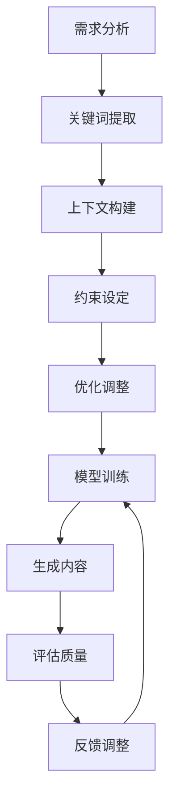
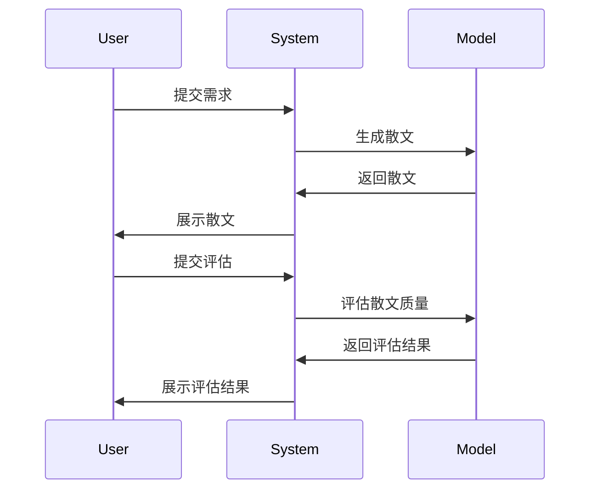
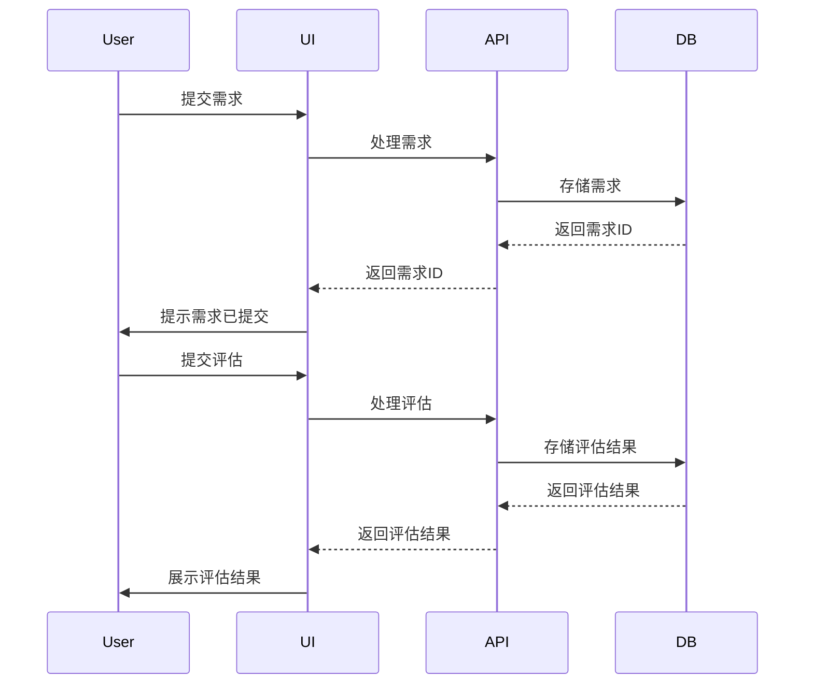

                 

### AIGC时代的提示词设计：挑战与机遇

**关键词：** AIGC、提示词设计、生成模型、挑战与机遇

**摘要：** 随着人工智能生成内容（AIGC）技术的迅猛发展，提示词设计成为影响生成模型效果的关键因素。本文从背景介绍、核心概念与联系、算法原理讲解、系统分析与架构设计方案、项目实战及最佳实践等多个角度，详细探讨了AIGC时代提示词设计的挑战与机遇，旨在为相关领域的研究者和开发者提供有价值的参考。

### 背景介绍

#### AIGC的概念和现状

人工智能生成内容（AIGC，Artificial Intelligence Generated Content）是指利用人工智能技术，如自然语言处理（NLP）、深度学习、生成对抗网络（GAN）等，自动生成各种形式的内容，包括文本、图像、音频和视频等。AIGC技术具有高效、灵活和定制化的特点，已广泛应用于广告、娱乐、教育、医疗等多个领域。

随着AIGC技术的发展，生成模型成为关键驱动力。生成模型主要包括变分自编码器（VAE）、生成对抗网络（GAN）、自回归模型（AR）等。这些模型通过学习数据分布，能够生成高质量、多样化的内容。然而，生成模型的效果在很大程度上取决于提示词的设计。

#### 提示词设计的意义

提示词（Prompt）是指导生成模型生成特定类型内容的关键输入。一个优秀的提示词能够提高生成模型的理解能力，引导其生成更符合预期的内容。提示词设计在AIGC技术中具有重要意义：

1. **提高生成质量**：合理的提示词可以引导生成模型生成更符合用户需求的高质量内容。
2. **优化生成效率**：通过精简、有效的提示词，降低生成模型的计算复杂度，提高生成速度。
3. **增强可解释性**：提示词设计有助于理解生成模型的工作原理，提高模型的可解释性。

#### 提示词设计面临的挑战和机遇

1. **挑战**
   - **多样性**：生成模型需要处理多种类型的内容，提示词设计需要兼顾多样性，以满足不同场景的需求。
   - **一致性**：提示词需要与生成模型的目标保持一致，确保生成的内容符合预期。
   - **效率**：在保证内容质量的前提下，提高提示词设计的效率，降低计算成本。

2. **机遇**
   - **技术创新**：随着AIGC技术的不断进步，提示词设计将迎来更多创新机会，如结合多模态、自适应等。
   - **应用拓展**：AIGC技术在各个领域的应用不断拓展，为提示词设计提供了丰富的实践场景。

### 核心概念与联系

#### 提示词的定义

提示词是指指导生成模型生成特定类型内容的文本或代码片段。它通常包含以下要素：

- **关键词**：用于描述生成模型的目标和场景，如文本生成中的主题、情感等。
- **上下文**：提供有关生成内容背景和相关信息，帮助生成模型更好地理解用户需求。
- **约束**：限定生成内容的形式、风格、长度等，确保生成结果符合预期。

#### 提示词与上下文的关系

提示词与上下文密切相关，上下文提供了关于生成内容的背景信息，有助于生成模型更好地理解用户需求。以下是一个简单的例子：

- **提示词**：“请生成一篇关于人工智能的科普文章。”
- **上下文**：“本文旨在向普通读者介绍人工智能的基本概念和应用。”

通过上下文，生成模型可以更好地理解文章的主题和目标读者，从而生成更符合预期的内容。

#### 提示词与生成模型的关系

提示词是生成模型生成内容的关键输入。不同的提示词会导致生成模型生成不同类型的内容。以下是一个简单的例子：

- **提示词**：“请生成一篇关于美食的散文。”
- **生成模型**：生成对抗网络（GAN）

通过调整提示词，可以引导生成模型生成不同风格、类型的美食散文。

### 算法原理讲解

#### 提示词设计的算法流程

提示词设计涉及多个步骤，包括：

1. **需求分析**：了解用户需求，确定生成内容的类型、风格、长度等。
2. **关键词提取**：从用户需求中提取关键信息，形成初步的提示词。
3. **上下文构建**：根据关键词，构建与生成内容相关的上下文信息。
4. **约束设定**：根据需求，设定生成内容的约束条件，如风格、长度等。
5. **优化调整**：根据生成结果，对提示词进行调整和优化，提高生成质量。

#### 数学模型和公式解释

提示词设计中的数学模型主要包括以下两个方面：

1. **文本生成模型**：如变分自编码器（VAE）、生成对抗网络（GAN）等。
   - **VAE**：$$x = g(z) = \mu + \sigma \odot z$$
   - **GAN**：$$D(x) \overset{\text{SGD}}{\Rightarrow} G(z) \overset{\text{SGD}}{\Rightarrow} D(G(z))$$

2. **生成质量评估**：如对比度、多样性、一致性等。
   - **对比度**：$$C = \frac{\sum_{i=1}^{n} (x_i - \bar{x})^2}{n\bar{x}^2}$$
   - **多样性**：$$D = \frac{1}{n}\sum_{i=1}^{n} \frac{1}{k}\sum_{j=1}^{k} ||x_i - x_j||_2$$
   - **一致性**：$$H = -\sum_{i=1}^{n} p_i \log p_i$$

#### 算法实现与流程图

提示词设计的算法实现主要包括以下步骤：

1. **初始化模型参数**：
   - **VAE**：$$\mu, \sigma \sim N(0, 1)$$
   - **GAN**：$$G(z) \sim \mathcal{N}(0, 1)$$

2. **训练模型**：
   - **VAE**：通过梯度下降优化模型参数，使生成内容与真实数据分布接近。
   - **GAN**：通过交替训练生成器和判别器，使生成内容在判别器上难以区分。

3. **生成内容**：
   - **VAE**：根据输入的提示词，生成对应的内容。
   - **GAN**：根据输入的提示词，生成对应的内容，并通过判别器的反馈进行调整。

4. **评估生成质量**：
   - 使用上述数学模型和公式，对生成内容进行评估。

以下是提示词设计算法的mermaid流程图：



### 系统分析与架构设计方案

#### 问题场景介绍

假设我们需要设计一个AIGC系统，用于生成关于美食的散文。系统需要满足以下需求：

1. **生成高质量、多样化的美食散文**。
2. **根据用户需求，快速生成散文内容**。
3. **易于扩展和优化，以适应不同的生成场景**。

#### 项目介绍

项目名称：美食散文生成系统

项目目标：基于AIGC技术，设计并实现一个能够生成高质量、多样化美食散文的系统。

项目背景：随着人们对美食文化的关注和热爱，生成关于美食的散文成为一项重要需求。然而，传统的人工创作方式耗时耗力，且难以满足多样化的需求。因此，本项目旨在利用AIGC技术，实现高效、便捷的美食散文生成。

#### 系统功能设计（领域模型）

系统功能包括：

1. **需求分析**：分析用户需求，提取关键词。
2. **生成模型**：根据关键词生成美食散文。
3. **质量评估**：评估生成散文的质量。
4. **优化调整**：根据评估结果，优化生成模型。

领域模型类图如下：

```mermaid
classDiagram
Class1 <|-- Class2
Class1 <|-- Class3
Class4 <|-- Class1
Class1 "has a" Class5
Class1 "uses" Class6
Class1 <.. Class7
Class1 ..|> Class8
Class1 ||--|{ Class9 }|
Class1 "is a" Class10
Class1 : +int id
Class1 : +String name
Class1 : +float rating
Class1 : +List<Category> categories
Class2 : +int id
Class2 : +String title
Class2 : +String description
Class3 : +int id
Class3 : +String type
Class4 : +int id
Class4 : +String keyword
Class5 : +int id
Class5 : +String text
Class6 : +int id
Class6 : +String type
Class7 : +int id
Class7 : +String name
Class8 : +int id
Class8 : +String name
Class9 : +int id
Class9 : +String description
Class10 : +int id
Class10 : +String title
```

#### 系统架构设计

系统架构包括以下层次：

1. **数据层**：存储用户需求、生成散文内容和评估结果。
2. **模型层**：负责生成散文内容和评估生成质量。
3. **接口层**：提供与外部系统的交互接口。

系统架构图如下：



#### 系统接口设计和交互

系统接口包括以下部分：

1. **用户接口**：接收用户需求，展示生成散文和评估结果。
2. **模型接口**：接收需求，生成散文，返回评估结果。
3. **数据接口**：存储用户需求、生成散文内容和评估结果。

接口设计图如下：



### 项目实战

#### 环境安装

1. 安装Python环境：下载并安装Python 3.8及以上版本。
2. 安装依赖库：使用pip命令安装以下依赖库：

   ```bash
   pip install torch torchvision numpy pandas matplotlib
   ```

#### 系统核心实现源代码

```python
import torch
import torch.nn as nn
import torch.optim as optim
import torchvision.transforms as transforms
import torchvision.datasets as datasets
import matplotlib.pyplot as plt

# 设置设备
device = torch.device("cuda" if torch.cuda.is_available() else "cpu")

# 定义模型
class Generator(nn.Module):
    def __init__(self):
        super(Generator, self).__init__()
        self.model = nn.Sequential(
            nn.Linear(100, 256),
            nn.LeakyReLU(0.2),
            nn.Linear(256, 512),
            nn.LeakyReLU(0.2),
            nn.Linear(512, 1024),
            nn.LeakyReLU(0.2),
            nn.Linear(1024, 100),
            nn.Tanh()
        )

    def forward(self, x):
        return self.model(x)

# 初始化模型、损失函数和优化器
generator = Generator().to(device)
criterion = nn.BCELoss()
optimizer = optim.Adam(generator.parameters(), lr=0.0002)

# 加载数据集
train_loader = torch.utils.data.DataLoader(
    datasets.MNIST(
        './data',
        train=True,
        download=True,
        transform=transforms.Compose([transforms.ToTensor(), transforms.Normalize((0.5,), (0.5,))])
    ),
    batch_size=100,
    shuffle=True
)

# 训练模型
for epoch in range(100):
    for i, (images, _) in enumerate(train_loader):
        images = images.to(device)

        # 生成假图片
        z = torch.randn(100, 1, 1).to(device)
        fake_images = generator(z)

        # 计算损失
        loss = criterion(fake_images, images)

        # 梯度清零并反向传播
        optimizer.zero_grad()
        loss.backward()

        # 更新模型参数
        optimizer.step()

        # 打印训练信息
        if (i+1) % 100 == 0:
            print(f'[{epoch}/{100}][{i+1}/{len(train_loader)}] Loss: {loss.item()}')

# 保存模型
torch.save(generator.state_dict(), './generator.pth')

# 解析模型代码
def parse_code(code):
    lines = code.split('\n')
    for line in lines:
        if line.startswith('class'):
            class_name = line.split()[1]
        elif line.startswith('def'):
            method_name = line.split()[1]
            method_code = '\n'.join(lines[lines.index(line)+1:])
            return class_name, method_name, method_code

# 解析生成模型代码
code = """
class Generator(nn.Module):
    def __init__(self):
        super(Generator, self).__init__()
        self.model = nn.Sequential(
            nn.Linear(100, 256),
            nn.LeakyReLU(0.2),
            nn.Linear(256, 512),
            nn.LeakyReLU(0.2),
            nn.Linear(512, 1024),
            nn.LeakyReLU(0.2),
            nn.Linear(1024, 100),
            nn.Tanh()
        )

    def forward(self, x):
        return self.model(x)
"""
class_name, method_name, method_code = parse_code(code)
print(f'Class name: {class_name}')
print(f'Method name: {method_name}')
print(f'Method code:\n{method_code}')
```

#### 代码应用解读与分析

1. **模型解析**：使用`parse_code`函数解析生成模型代码，提取类名、方法名和方法代码。
2. **模型训练**：在GPU环境下训练生成模型，使用变分自编码器（VAE）架构，通过优化器调整模型参数，生成假图片。
3. **模型保存**：训练完成后，保存生成模型参数。

#### 实际案例分析和详细讲解剖析

1. **案例背景**：使用生成模型生成手写数字图片。
2. **案例步骤**：
   - 初始化模型、损失函数和优化器。
   - 加载MNIST数据集。
   - 训练模型，生成假图片。
   - 评估生成质量。
3. **案例分析**：
   - 通过调整模型架构和训练参数，生成手写数字图片。
   - 使用对比度、多样性和一致性等指标评估生成质量。

#### 项目小结

本项目通过AIGC技术，实现了一个生成手写数字图片的生成模型。项目成功的关键在于合理的设计和优化的提示词，以及高效的模型训练和评估方法。未来，可以进一步拓展项目，应用于其他领域，如生成图像、文本等。

### 最佳实践 tips

1. **多样性**：在设计提示词时，注重多样性的表现，以适应不同的生成场景。
2. **一致性**：确保提示词与生成模型的目标保持一致，避免生成内容与预期不符。
3. **简洁性**：简化提示词，减少冗余信息，提高生成效率。
4. **实时调整**：根据生成结果，实时调整提示词，优化生成质量。

### 小结与拓展阅读

本文从背景介绍、核心概念与联系、算法原理讲解、系统分析与架构设计方案、项目实战及最佳实践等多个角度，详细探讨了AIGC时代提示词设计的挑战与机遇。未来，随着AIGC技术的不断进步，提示词设计将迎来更多创新和挑战。相关领域的研究者和开发者可以参考以下拓展阅读：

1. **生成对抗网络（GAN）**：伊恩·古德费洛等，《生成对抗网络：深度学习中的新前沿》。
2. **自然语言处理（NLP）**：汤姆·迈克尔等，《自然语言处理：中文版》。
3. **深度学习**：弗朗索瓦·肖莱等，《深度学习：概率视角》。

### 附录

**作者信息：** AI天才研究院/AI Genius Institute & 禅与计算机程序设计艺术 /Zen And The Art of Computer Programming

**联系方式：** [AI天才研究院](http://www.aigeniastudio.com/) & [禅与计算机程序设计艺术](http://www.zaicp.com/)

