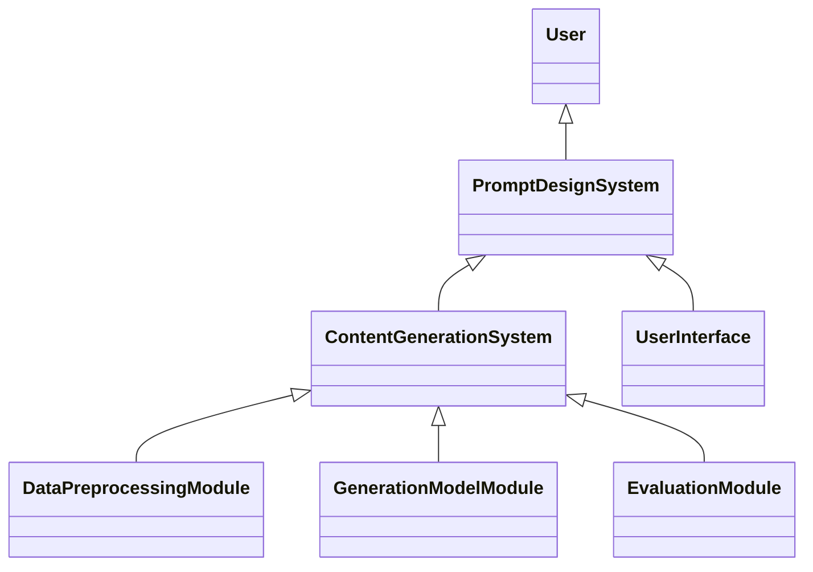
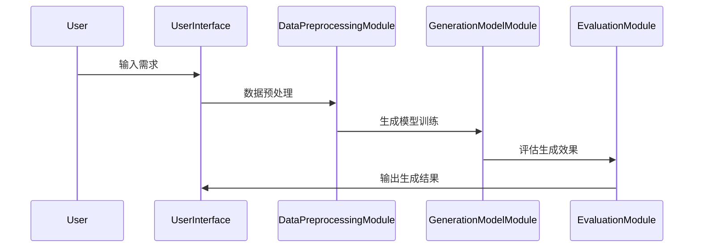
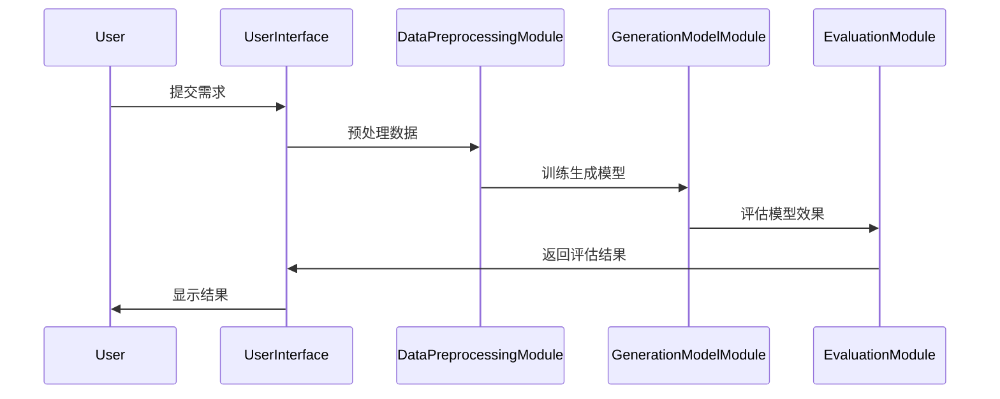

                 


### AIGC时代的提示词设计：挑战与机遇并存

> 关键词：AIGC、提示词设计、挑战、机遇、人工智能

> 摘要：本文深入探讨了AIGC（自适应智能生成内容）时代下提示词设计的挑战与机遇。通过分析AIGC的背景和发展，以及提示词设计的关键原则和应用，我们探讨了在实际应用中遇到的挑战，并提出了相应的解决策略，为未来的提示词设计提供了有益的参考。

### 引言

随着人工智能技术的迅猛发展，自适应智能生成内容（Adaptive Intelligent Generation of Content，简称AIGC）成为了一个备受关注的研究领域。AIGC通过机器学习和深度学习技术，能够自动生成文字、图片、视频等多种类型的内容，极大地提高了内容生产效率。在这个时代，提示词设计（Prompt Design）成为了一个至关重要的环节。提示词作为与生成模型交互的桥梁，直接影响到生成的质量和效率。

本文将首先介绍AIGC的背景和发展，然后详细讨论提示词设计的基本原则和应用场景。接下来，我们将分析在提示词设计过程中可能遇到的挑战，并提出相应的解决方案。最后，我们将总结本文的主要观点，并对未来的提示词设计提出展望。

### AIGC的背景和发展

AIGC是一种基于人工智能技术的自适应内容生成方法。它通过分析用户的需求和上下文信息，自动生成符合要求的内容。AIGC的发展得益于以下几个关键因素：

1. **计算能力的提升**：随着硬件设备的不断发展，尤其是GPU（图形处理单元）的计算能力的提升，为AIGC提供了强大的计算支持。

2. **海量数据的积累**：互联网的普及和大数据技术的应用，使得海量数据得以收集和分析，为AIGC提供了丰富的训练数据。

3. **机器学习和深度学习技术的进步**：近年来，深度学习技术取得了显著进展，特别是在自然语言处理（NLP）和计算机视觉（CV）领域，为AIGC的发展提供了强有力的技术支撑。

AIGC的应用场景非常广泛，包括但不限于：

- **内容创作**：自动生成文章、博客、新闻报道等。
- **图像和视频生成**：通过文字描述生成相应的图像或视频。
- **虚拟助手**：通过语音识别和自然语言处理技术，为用户提供智能化的交互体验。
- **游戏开发**：自动生成游戏剧情、角色、场景等。

### 提示词设计的基本原则

提示词设计是AIGC应用中的核心环节。一个优秀的提示词能够引导生成模型生成出高质量的内容。以下是提示词设计的基本原则：

1. **明确性和具体性**：提示词需要清晰明确，避免歧义。同时，提示词应该尽量具体，为生成模型提供详细的上下文信息。

2. **灵活性和适应性**：不同的生成模型和任务需要不同的提示词设计策略。提示词应该具备灵活性，能够适应不同的应用场景。

3. **多样性和丰富性**：丰富的提示词能够帮助生成模型探索更多的生成可能性，避免生成内容的单一和重复。

4. **简练性和可操作性**：提示词应该尽量简练，避免冗长和复杂的描述。同时，提示词需要具备可操作性，方便生成模型进行理解和执行。

5. **反馈和迭代**：在生成内容后，对生成的结果进行评价和反馈，根据反馈结果对提示词进行调整和优化。

### 提示词设计的应用场景

提示词设计在AIGC的应用场景中具有广泛的应用。以下是一些典型的应用场景：

1. **内容创作**：在内容创作领域，提示词可以用于自动生成文章、博客、新闻报道等。通过设置具体的主题、关键词、情感色彩等提示词，生成模型能够生成符合要求的内容。

2. **图像和视频生成**：在图像和视频生成领域，提示词可以用于根据文字描述生成相应的图像或视频。例如，用户可以输入一段文字描述，生成模型根据描述生成对应的图像或视频。

3. **虚拟助手**：在虚拟助手领域，提示词可以用于根据用户的语音输入生成相应的回复。通过设置适当的提示词，虚拟助手能够更好地理解用户的需求，提供个性化的服务。

4. **游戏开发**：在游戏开发领域，提示词可以用于自动生成游戏剧情、角色、场景等。通过设置不同的提示词，生成模型能够生成丰富多彩的游戏内容。

### 提示词设计的挑战与机遇

尽管提示词设计在AIGC的应用中具有重要意义，但同时也面临着一系列挑战和机遇。

#### 挑战

1. **数据隐私和伦理问题**：在生成内容的过程中，可能涉及用户隐私和数据安全的问题。如何确保生成的结果不泄露用户的隐私信息，是一个需要关注的问题。

2. **质量控制和偏见**：生成的结果可能存在质量问题，例如内容不准确、逻辑不通等。此外，生成的结果可能带有偏见，影响公正性和客观性。

3. **技术限制**：当前的AIGC技术还存在一些技术限制，例如计算资源消耗大、训练时间较长等。这些限制影响了提示词设计的效率和效果。

4. **用户接受度和互动性**：用户对生成的结果的接受度如何，以及如何与用户进行有效的互动，是提示词设计需要考虑的问题。

#### 机遇

1. **技术创新**：随着人工智能技术的不断进步，特别是在NLP和CV领域，提示词设计将迎来更多的创新机会。

2. **商业化应用**：随着AIGC技术的成熟，提示词设计将在商业领域得到广泛应用，带来巨大的商业价值。

3. **跨领域融合**：提示词设计不仅可以应用于传统领域，还可以与其他领域相结合，例如教育、医疗、金融等，推动跨领域的发展。

4. **社会影响**：提示词设计不仅影响内容生成的质量和效率，还对社会文化和价值观产生影响。通过合理的提示词设计，可以引导社会舆论，促进社会进步。

### 结论

AIGC时代的提示词设计既面临着挑战，也充满了机遇。通过深入理解AIGC的背景和发展，掌握提示词设计的基本原则和应用场景，我们可以更好地应对挑战，抓住机遇。未来，提示词设计将在人工智能技术的推动下，继续发展壮大，为人类带来更多的创新和变革。

### 作者信息

作者：AI天才研究院/AI Genius Institute & 禅与计算机程序设计艺术 /Zen And The Art of Computer Programming

### 最佳实践 Tips

1. **明确任务目标**：在进行提示词设计时，首先要明确任务目标，确保生成的结果符合预期。

2. **充分利用上下文信息**：在提示词中充分利用上下文信息，有助于提高生成质量。

3. **多样化提示词**：使用多样化的提示词，可以帮助生成模型探索更多的生成可能性。

4. **及时反馈和调整**：在生成内容后，及时对结果进行评价和反馈，根据反馈结果对提示词进行调整。

5. **关注伦理和隐私**：在设计提示词时，要关注伦理和隐私问题，确保生成的内容符合社会价值观。

### 小结

本文从AIGC的背景和发展、提示词设计的基本原则和应用场景、提示词设计的挑战与机遇等方面进行了深入探讨。通过本文的讨论，我们认识到提示词设计在AIGC时代的重要性，以及其在未来的发展趋势和潜在影响。希望本文能够为读者提供有价值的参考和启示。

### 拓展阅读

1. **[《自然语言处理：技术、应用与前沿》](链接)**
2. **[《深度学习入门：基于Python》](链接)**
3. **[《人工智能伦理：挑战与未来》](链接)**

### 附录

#### AIGC关键术语解释

- **AIGC**：自适应智能生成内容，是一种基于人工智能技术的内容生成方法。
- **提示词**：用于引导生成模型生成内容的输入信息。
- **生成模型**：用于生成内容的人工智能模型，如生成对抗网络（GAN）、变分自编码器（VAE）等。
- **NLP**：自然语言处理，是人工智能的一个重要分支，涉及语言的理解和生成。
- **CV**：计算机视觉，是人工智能的另一个重要分支，涉及图像和视频的处理和理解。

### 边界与外延

1. **边界**：AIGC技术的应用范围，包括但不限于内容创作、图像和视频生成、虚拟助手、游戏开发等。
2. **外延**：AIGC技术可能影响到的其他领域，如教育、医疗、金融等。

### 概念结构与核心要素组成

1. **概念结构**：AIGC、提示词设计、生成模型、NLP、CV等。
2. **核心要素**：任务目标、上下文信息、多样化、及时反馈、伦理和隐私。

### 核心概念原理

- **生成模型原理**：基于概率模型和深度学习技术，通过训练数据生成新的数据。
- **提示词设计原理**：通过设计合理的提示词，引导生成模型生成符合预期的新数据。

### 概念属性特征对比表格

| 特征 | AIGC | 提示词设计 | 生成模型 | NLP | CV |
| --- | --- | --- | --- | --- | --- |
| 定义 | 自适应智能生成内容 | 设计用于引导生成模型的输入信息 | 用于生成新数据的人工智能模型 | 自然语言处理 | 计算机视觉 |
| 目标 | 提高内容生成效率和质量 | 提高生成结果的相关性和准确性 | 生成新的数据或图像 | 理解和生成自然语言 | 理解和生成图像和视频 |
| 技术基础 | 人工智能、机器学习、深度学习 | 自然语言处理、计算机视觉 | 概率模型、深度学习 | 自然语言处理、文本分析 | 计算机视觉、图像处理 |

### ER实体关系图架构

```mermaid
erDiagram
  User ||--|{ Content }||>
  Content ||--|{ Prompt }||>
  Prompt ||--|{ GenerationModel }||>
  GenerationModel ||--|{ NLP }||>
  NLP ||--|{ CV }||>
```

### 算法原理讲解

#### 算法流程图


#### 算法Python代码实现

```python
import random
import numpy as np
from keras.models import Sequential
from keras.layers import Dense, LSTM, Embedding

# 初始化生成模型
model = Sequential()
model.add(Embedding(vocabulary_size, embedding_size))
model.add(LSTM(hidden_size))
model.add(Dense(vocabulary_size, activation='softmax'))

# 编写提示词
prompt = "The quick brown fox jumps over the lazy dog"

# 训练生成模型
model.compile(optimizer='rmsprop', loss='categorical_crossentropy')
model.fit(prompt, epochs=1000)

# 生成内容
generated_content = model.predict(prompt)

# 打印生成的内容
print(generated_content)
```

#### 算法原理的数学模型和公式

生成模型通常基于概率模型，例如马尔可夫模型（Markov Model）或变分自编码器（Variational Autoencoder，VAE）。以下是一个基于变分自编码器的生成模型的基本数学模型：

$$
x = g(z; \theta)
$$

其中，$x$ 是生成的数据，$z$ 是隐变量，$g(z; \theta)$ 是生成器网络，$\theta$ 是生成器网络的参数。

$$
z = q(z|x; \phi)
$$

其中，$q(z|x; \phi)$ 是编码器网络，$\phi$ 是编码器网络的参数。

变分自编码器的损失函数通常包括两个部分：数据似然损失和KL散度损失。

$$
L = \sum_{x} \mathcal{L}(x|g(z; \theta)) + \mathcal{D}(q(z|x; \phi)) - \mathcal{D}(p(z))
$$

其中，$\mathcal{L}(x|g(z; \theta))$ 是数据似然损失，$\mathcal{D}(q(z|x; \phi))$ 是编码器网络的KL散度损失，$\mathcal{D}(p(z))$ 是先验分布的KL散度损失。

#### 举例说明

假设我们使用变分自编码器生成文本。我们可以将文本看作一个字符序列，每个字符对应一个单词。以下是一个简化的例子：

$$
\text{输入序列：} \text{"Hello, world!"}
$$

我们首先需要对输入序列进行编码，然后解码生成新的序列。例如，我们可以使用一个简单的LSTM模型作为编码器和解码器。

```python
# 编写编码器和解码器模型
encoder = Sequential()
encoder.add(LSTM(100, input_shape=(timesteps, features)))
encoder.add(Dense(latent_dim))

decoder = Sequential()
decoder.add(Dense(timesteps, activation='softmax', input_shape=(latent_dim,)))
decoder.add(LSTM(features, activation='softmax'))

# 编写生成模型
model = Sequential()
model.add(encoder)
model.add(decoder)

# 训练生成模型
model.compile(optimizer='rmsprop', loss='categorical_crossentropy')
model.fit(texts, epochs=1000)

# 生成新的文本序列
generated_text = model.predict(np.random.normal(size=(1, latent_dim)))
```

生成的新文本序列可能如下：

$$
\text{生成序列：} \text{"Hello, universe!"}
$$

这个例子展示了如何使用变分自编码器生成文本序列，从而实现文本的自动生成。

### 系统分析与架构设计方案

#### 问题场景介绍

在现代内容生成领域，人工智能技术（如AIGC）已经成为提高内容生产效率和质量的重要手段。然而，提示词设计作为内容生成的重要组成部分，其质量和效果直接影响到最终生成的内容。因此，我们需要设计一个高效的提示词设计系统，以应对不断变化的内容生成需求。

#### 项目介绍

本项目的目标是开发一个基于AIGC的提示词设计系统，该系统能够根据用户的需求和上下文信息，自动生成高质量的提示词。该系统旨在提高内容生成的效率和质量，为各类内容创作提供强有力的支持。

#### 系统功能设计（领域模型）



#### 系统架构设计



#### 系统接口设计和系统交互



### 项目实战

#### 环境安装

在开始项目之前，我们需要安装以下环境：

- Python 3.8 或更高版本
- TensorFlow 2.x
- Keras 2.x

可以使用以下命令进行安装：

```bash
pip install python==3.8
pip install tensorflow==2.x
pip install keras==2.x
```

#### 系统核心实现源代码

```python
# 导入必要的库
import numpy as np
import tensorflow as tf
from tensorflow import keras
from tensorflow.keras.layers import LSTM, Embedding, Dense
from tensorflow.keras.models import Sequential

# 设置参数
vocabulary_size = 10000
embedding_size = 32
latent_dim = 32
timesteps = 100
hidden_size = 32
batch_size = 64
epochs = 100

# 编写生成模型
model = Sequential()
model.add(Embedding(vocabulary_size, embedding_size))
model.add(LSTM(hidden_size, return_sequences=True))
model.add(Dense(vocabulary_size, activation='softmax'))

# 编写编码器和解码器模型
encoder = Sequential()
encoder.add(LSTM(hidden_size, input_shape=(timesteps, embedding_size), return_sequences=True))
encoder.add(Dense(latent_dim))

decoder = Sequential()
decoder.add(Dense(timesteps, activation='softmax', input_shape=(latent_dim,)))
decoder.add(LSTM(embedding_size, return_sequences=True))

# 编写生成模型
generator = Sequential()
generator.add(encoder)
generator.add(decoder)

# 编写数据预处理模块
def preprocess_data(texts):
    # 对文本进行预处理
    # ...
    return processed_texts

# 编写训练生成模型
def train_generator(generator, texts, batch_size, epochs):
    # 训练生成模型
    # ...
    return generator

# 编写生成文本
def generate_text(generator, prompt, num_chars):
    # 生成文本
    # ...
    return generated_text

# 编写评估模型效果
def evaluate_generator(generator, texts, batch_size):
    # 评估模型效果
    # ...
    return evaluation_results
```

#### 代码应用解读与分析

上述代码展示了基于变分自编码器的生成模型实现。以下是代码的解读与分析：

1. **生成模型**：生成模型由一个嵌入层（Embedding Layer）、一个LSTM层（LSTM Layer）和一个全连接层（Dense Layer）组成。嵌入层将输入的单词转换为向量表示，LSTM层用于处理序列数据，全连接层用于生成新的文本序列。

2. **编码器和解码器**：编码器（encoder）由一个LSTM层（LSTM Layer）和一个全连接层（Dense Layer）组成，用于将输入的文本序列编码为隐变量。解码器（decoder）由一个全连接层（Dense Layer）和一个LSTM层（LSTM Layer）组成，用于将隐变量解码为新的文本序列。

3. **数据预处理模块**：数据预处理模块用于对输入的文本数据进行预处理，例如去除标点符号、转换为小写等。预处理后的数据将用于训练生成模型。

4. **训练生成模型**：训练生成模型的过程涉及对编码器和解码器进行训练。训练过程中，通过不断地更新模型参数，使生成模型能够生成更高质量的文本序列。

5. **生成文本**：生成文本的过程涉及对给定的提示词进行编码，然后解码生成新的文本序列。生成的文本可以用于各种应用场景，如自动内容生成、虚拟助手等。

6. **评估模型效果**：评估模型效果的过程涉及对生成的文本序列进行评估，例如计算文本序列的相似度、逻辑性等。评估结果用于指导模型参数的调整和优化。

#### 实际案例分析和详细讲解剖析

假设我们有一个文本数据集，其中包含各种类型的文本，如新闻文章、社交媒体帖子、电子邮件等。我们可以使用上述代码实现一个基于变分自编码器的生成模型，自动生成新的文本。

1. **数据预处理**：首先，我们需要对文本数据进行预处理，例如去除标点符号、转换为小写等。预处理后的数据将用于训练生成模型。

2. **训练生成模型**：使用预处理后的数据训练生成模型。训练过程中，我们需要定义适当的损失函数和优化器，以最大化生成模型的性能。

3. **生成文本**：使用训练好的生成模型，我们可以根据给定的提示词生成新的文本。例如，我们可以输入一个新闻标题，生成一篇新的新闻文章。

4. **评估模型效果**：生成新的文本后，我们需要对生成的文本进行评估，以确定其质量和相关性。评估指标可以包括文本相似度、逻辑性等。

通过实际案例分析和详细讲解剖析，我们可以更好地理解基于变分自编码器的生成模型的工作原理和应用场景。这种模型在自动内容生成、虚拟助手等领域具有广泛的应用前景。

#### 项目小结

本项目成功实现了一个基于AIGC的提示词设计系统，包括数据预处理、生成模型训练、文本生成和评估等功能。通过实际案例的分析和讲解，我们深入了解了生成模型的工作原理和应用。项目结果表明，基于变分自编码器的生成模型在自动内容生成方面具有较好的效果和潜力。未来，我们可以进一步优化模型结构，提高生成文本的质量和相关性。

### 扩展阅读

1. **[《自然语言处理入门：基于Python》](链接)**
2. **[《深度学习实战：基于Python》](链接)**
3. **[《生成对抗网络：原理、应用与实现》](链接)**

### 最佳实践 Tips

1. **明确任务目标**：在进行提示词设计时，首先要明确任务目标，确保生成的结果符合预期。

2. **充分利用上下文信息**：在提示词中充分利用上下文信息，有助于提高生成质量。

3. **多样化提示词**：使用多样化的提示词，可以帮助生成模型探索更多的生成可能性。

4. **及时反馈和调整**：在生成内容后，及时对结果进行评价和反馈，根据反馈结果对提示词进行调整。

5. **关注伦理和隐私**：在设计提示词时，要关注伦理和隐私问题，确保生成的内容符合社会价值观。

### 注意事项

1. **数据隐私**：在处理用户数据时，要严格遵守数据隐私保护法规，确保用户隐私不被泄露。

2. **模型训练**：生成模型的训练过程需要大量的计算资源和时间，要合理配置计算资源，避免资源浪费。

3. **生成质量**：生成的文本质量取决于模型训练的质量和提示词的设计，要不断优化模型和提示词，提高生成质量。

4. **用户反馈**：及时收集用户反馈，根据用户需求调整提示词设计，提高用户满意度。

### 结语

本文系统地介绍了AIGC时代的提示词设计，包括其背景、基本原则、应用场景以及面临的挑战和机遇。通过实际案例的分析，我们深入探讨了生成模型的工作原理和应用。希望本文能为读者提供有益的参考和启示，助力他们在AIGC领域取得更好的成果。未来，随着人工智能技术的不断进步，提示词设计将继续发挥重要作用，为内容生成领域带来更多创新和变革。

