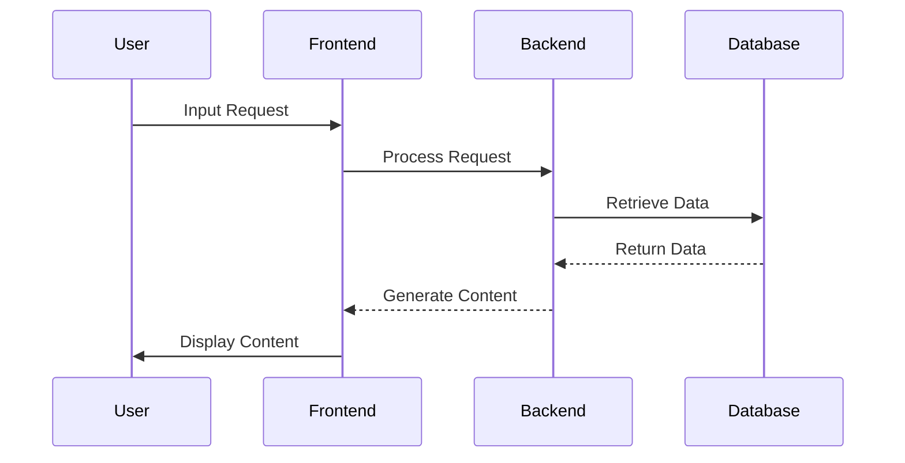
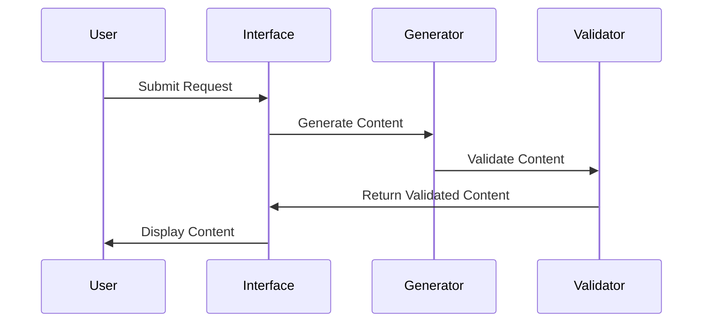

                 

# AIGC时代的提示词设计：理论与实践

## 关键词

- AIGC
- 提示词设计
- 生成对抗网络
- 语言模型
- 系统架构

## 摘要

随着人工智能生成内容（AIGC）的迅猛发展，如何高效地进行提示词设计成为了一个关键的研究课题。本文从AIGC时代的背景出发，详细解析了AIGC的核心概念和提示词设计的基本原则。接着，深入探讨了提示词设计的基础理论、属性特征及设计工具与方法。随后，通过具体案例分析了电商商品描述生成、智能客服对话生成和教育论文生成等场景中的提示词设计策略。文章还介绍了提示词生成的算法原理，包括常用生成模型、算法流程和数学模型，并通过Python代码示例进行了详细讲解。最后，从系统架构设计和实际项目实战的角度，阐述了提示词设计的系统实现和最佳实践，为读者提供了全面而深入的AIGC提示词设计指导。

### 《AIGC时代的提示词设计：理论与实践》目录大纲

#### 第一部分：背景介绍与核心概念

## 第1章 AIGC时代的概述

### 1.1 问题背景

#### 1.1.1 AIGC的兴起与发展
随着大数据和深度学习的推动，AIGC技术逐渐崭露头角，其应用领域广泛，从内容创作到智能客服，再到自动化编程，AIGC都在发挥着重要作用。

#### 1.1.2 AIGC的核心概念与重要性
AIGC的核心在于利用人工智能技术自动生成高质量的内容，其重要性体现在提升内容生产效率、降低创作成本以及拓展人类智能的边界。

#### 1.1.3 AIGC与传统AI的区别
AIGC相较于传统AI，更注重生成内容的质量和多样性，而不仅仅是模式识别和分类。

### 1.2 核心概念解析

#### 1.2.1 自动生成内容（AGC）的定义与分类
自动生成内容（AGC）是指利用算法和技术生成文本、图像、音频等内容的系统。AGC可以进一步细分为文本生成、图像生成、音频生成等。

#### 1.2.2 人工智能生成内容（AIGC）的构成
AIGC通常由数据输入、模型训练和内容生成三个主要模块构成，各模块相互协作，共同实现内容的自动生成。

### 1.3 提示词设计的基本原则

#### 1.3.1 提示词的定义与作用
提示词是引导模型生成特定内容的关键输入，其作用在于明确生成任务的目标和范围。

#### 1.3.2 提示词设计的核心原则
包括清晰性、具体性、多样性、相关性等，这些原则共同确保了提示词的高效性和准确性。

#### 1.3.3 提示词设计的挑战与解决策略
提示词设计面临的主要挑战是生成内容的质量和多样性，解决策略包括优化语言模型、引入语义理解以及利用用户反馈等。

#### 第二部分：理论与实践

## 第2章 AIGC中的提示词设计原理

### 2.1 提示词设计的基础理论

#### 2.1.1 语言模型与提示词的关系
语言模型是生成高质量内容的基石，提示词通过与语言模型的结合，引导模型生成符合预期的内容。

#### 2.1.2 提示词对生成结果的影响
提示词的长度、结构、语义丰富度等都会影响生成结果的质量和多样性。

#### 2.1.3 提示词设计的数学模型
提示词设计涉及概率论和优化理论，通过数学模型可以更好地理解提示词的作用和效果。

### 2.2 提示词的属性特征

#### 2.2.1 提示词的长度与结构
提示词的长度和结构对生成结果有着直接影响，合适的长度和结构可以提升生成内容的可读性和准确性。

#### 2.2.2 提示词的语义丰富度
语义丰富度的提升可以增加生成内容的多样性和质量，减少生成的重复性。

#### 2.2.3 提示词的灵活性
灵活的提示词可以适应不同的生成任务和场景，提高系统的通用性和可扩展性。

### 2.3 提示词设计的工具与方法

#### 2.3.1 常用提示词设计工具介绍
包括自然语言处理工具、文本编辑器和生成对抗网络（GAN）训练工具等。

#### 2.3.2 提示词设计的工作流程
从需求分析、数据收集、模型选择到提示词生成和效果评估，全面介绍提示词设计的工作流程。

#### 2.3.3 提示词设计技巧与最佳实践
通过案例分析和经验分享，提供实用的提示词设计技巧和最佳实践。

#### 第三部分：实战与最佳实践

## 第3章 提示词设计案例分析

### 3.1 案例一：电商平台的商品描述生成

#### 3.1.1 案例背景
电商平台需要对大量商品进行描述，传统的手动编写效率低下，AIGC技术提供了自动生成商品描述的可能。

#### 3.1.2 提示词设计策略
针对商品的不同属性，设计具体的提示词，确保生成的描述内容准确、吸引人。

#### 3.1.3 提示词生成效果评估
通过用户点击率、转化率等指标评估生成描述的效果，不断优化提示词设计。

### 3.2 案例二：智能客服的对话生成

#### 3.2.1 案例背景
智能客服需要与用户进行自然对话，提高用户满意度和服务效率。

#### 3.2.2 提示词设计策略
基于用户输入的问题，设计合适的提示词，引导模型生成合适的回答。

#### 3.2.3 提示词生成效果评估
通过用户反馈和对话满意度等指标，评估智能客服对话生成的效果。

### 3.3 案例三：教育领域的论文生成

#### 3.3.1 案例背景
在教育领域，自动生成论文可以提高学术研究的效率和质量。

#### 3.3.2 提示词设计策略
结合论文的主题和结构，设计详细的提示词，确保生成的论文符合学术规范。

#### 3.3.3 提示词生成效果评估
通过论文的质量评估和引用次数等指标，评估自动生成论文的效果。

## 第4章 提示词设计的算法原理

### 4.1 提示词生成算法概述

#### 4.1.1 基于模板的提示词生成
通过预定义的模板，根据用户输入生成内容，简单但效果有限。

#### 4.1.2 基于规则的方法
通过一系列规则，根据输入提示词生成内容，适用于简单的业务场景。

#### 4.1.3 基于生成对抗网络（GAN）的方法
利用GAN技术，通过对抗训练生成高质量的内容，适用于复杂场景。

### 4.2 算法详细解析

#### 4.2.1 常用生成模型的介绍
介绍GPT系列模型、Transformer模型等，详细阐述其原理和应用场景。

##### 4.2.1.1 GPT系列模型
GPT系列模型是生成文本的强大工具，通过大量训练数据生成高质量文本。

##### 4.2.1.2 Transformer模型
Transformer模型在序列生成任务中表现出色，具有并行计算的优势。

##### 4.2.1.3 其他生成模型
如变分自编码器（VAE）、生成对抗网络（GAN）等，适用于不同类型的生成任务。

#### 4.2.2 提示词生成的算法流程
从数据输入、模型训练到内容生成，详细讲解提示词生成的算法流程。

#### 4.2.3 提示词生成的数学模型与公式
介绍语言模型概率计算、对数概率优化、损失函数与优化方法等数学模型。

##### 4.2.3.1 语言模型概率计算
通过计算输入提示词的概率分布，指导模型生成文本。

##### 4.2.3.2 对数概率优化
通过优化对数概率损失函数，提高生成文本的质量。

##### 4.2.3.3 损失函数与优化方法
介绍常用的损失函数和优化方法，如交叉熵损失函数、梯度下降优化算法等。

### 4.3 算法举例说明

#### 4.3.1 Python代码实现
提供GPT模型和Transformer模型的Python代码实现，便于读者理解和实践。

#### 4.3.2 算法应用解读
通过具体应用案例，如商品描述生成、智能客服对话生成等，解读算法的实际应用。

#### 4.3.3 举例说明
通过具体的例子，如生成一篇商品描述、一个智能客服回答等，展示算法的生成效果。

#### 第四部分：系统架构与实现

## 第5章 提示词设计的系统架构与实现

### 5.1 系统架构设计

#### 5.1.1 问题场景介绍
介绍AIGC在具体场景中的应用，如电商平台、智能客服、教育等领域。

#### 5.1.2 系统功能设计（Mermaid类图）
使用Mermaid类图，展示系统的功能模块和类之间的关系。

```mermaid
classDiagram
    Customer -> System : Request
    System --|> Generator : Generate Content
    Validator o-- System
    Generator o-- System
```

#### 5.1.3 系统架构设计（Mermaid架构图）
使用Mermaid架构图，展示系统的整体架构，包括前端、后端、数据库等模块。



### 5.2 系统接口设计与实现

#### 5.2.1 系统接口设计
详细描述系统中的各个接口，包括输入接口、输出接口和中间处理接口。

#### 5.2.2 接口实现细节
介绍接口的具体实现方法，包括数据格式、传输协议和安全性考虑。

#### 5.2.3 接口测试与验证
描述接口测试的方法和流程，确保接口的稳定性和可靠性。

### 5.3 系统交互设计与实现

#### 5.3.1 系统交互设计（Mermaid序列图）
使用Mermaid序列图，展示系统各模块之间的交互过程。



#### 5.3.2 系统交互实现
介绍系统交互的具体实现方法，包括消息传递机制和同步/异步处理策略。

#### 5.3.3 系统交互测试
描述系统交互测试的方法和流程，确保系统交互的顺畅和高效。

## 第6章 提示词设计的项目实战

### 6.1 环境安装与配置

#### 6.1.1 环境要求
列出项目运行所需的环境，包括操作系统、编程语言和依赖库等。

#### 6.1.2 软件安装与配置
详细描述如何安装和配置所需的软件和依赖库，包括安装步骤和配置文件。

### 6.2 系统核心实现

#### 6.2.1 系统核心模块设计与实现
介绍系统核心模块的设计思路和实现方法，包括提示词生成模块、内容验证模块等。

#### 6.2.2 系统核心代码解析
提供系统核心代码的详细解析，包括代码结构、关键函数和方法等。

#### 6.2.3 系统核心功能测试
描述系统核心功能的测试方法，包括单元测试和集成测试等。

### 6.3 实际案例分析与详细讲解

#### 6.3.1 实际案例介绍
介绍一个实际的案例，如电商平台的商品描述生成案例，详细描述案例的背景和目标。

#### 6.3.2 案例分析与讲解
分析案例的实现过程，讲解如何设计提示词、如何优化生成效果等。

#### 6.3.3 案例优化与改进
讨论案例中存在的问题，提出优化的方案和改进的方法。

## 第7章 提示词设计的最佳实践与注意事项

### 7.1 最佳实践 Tips

#### 7.1.1 提示词设计的常见问题与解决方案
列举提示词设计过程中常见的难题，并提供相应的解决方案。

#### 7.1.2 提示词优化策略
介绍如何通过优化提示词来提高生成内容的质量和多样性。

#### 7.1.3 提示词设计经验分享
分享在提示词设计中的经验教训，为读者提供实用的建议。

### 7.2 小结与展望

#### 7.2.1 本书内容总结
总结本书的主要内容和核心观点，帮助读者回顾和理解。

#### 7.2.2 提示词设计的发展趋势
分析提示词设计领域的最新动态和未来发展方向。

#### 7.2.3 下一步工作展望
提出未来在提示词设计领域可能的研究方向和应用前景。

### 《AIGC时代的提示词设计：理论与实践》作者

- 作者：AI天才研究院/AI Genius Institute & 禅与计算机程序设计艺术 /Zen And The Art of Computer Programming

### 完整性要求

- 文章内容必须完整，每个小节的内容必须丰富具体详细讲解，核心内容必须包含：
  - 背景介绍：核心概念术语说明、问题背景、问题描述、问题解决、边界与外延、概念结构与核心要素组成
  - 核心概念与联系：必须给出核心概念原理、概念属性特征对比表格和ER实体关系图架构的 Mermaid 流程图。
  - 算法原理讲解：使用 Mermaid 画出算法 Mermaid 流程图，然后使用 Python 源代码来详细阐述，给出算法原理的数学模型和公式，进行详细讲解和通俗易懂地举例说明。
  - 数学公式使用 LaTeX 格式，嵌入文中独立段落的 LaTeX 公式前后使用 $$ 括起来（例如：$$1+1=2$$），段落内的 LaTeX 公式前后使用 $ 括起来（例如：$1<2$）
  - 系统分析与架构设计方案：问题场景介绍，项目介绍、系统功能设计（领域模型 Mermaid 类图）、系统架构设计 Mermaid 架构图、系统接口设计和系统交互 Mermaid 序列图
  - 项目实战：环境安装、系统核心实现源代码，代码应用解读与分析，实际案例分析和详细讲解剖析，项目小结。
  - 最佳实践 Tips、小结、注意事项、拓展阅读等内容

### 格式要求

- 文章内容使用 Markdown 格式输出，确保格式清晰、结构紧凑、易于阅读。
- 每个章节标题使用 `##` 标记，子标题使用 `###` 标记，确保文章层次分明。
- 使用 Mermaid 语法绘制流程图、序列图和类图，确保图表清晰准确。
- 数学公式使用 LaTeX 格式嵌入文中，确保公式显示正确。
- 作者信息、文章摘要和关键词放在文章开头，确保读者能够快速了解文章内容。

### 字数要求

- 文章字数在 10000～12000 字左右，确保内容详实、论述充分。

### 执行计划

1. **准备阶段（1周）**：
   - 收集和整理相关资料，包括学术论文、行业报告、技术博客等。
   - 确定文章结构和主要内容，制定详细的写作计划。

2. **撰写阶段（2周）**：
   - 根据计划撰写每个章节的内容，确保内容丰富、逻辑清晰。
   - 完成初步的 Mermaid 图表绘制，确保图表与文本内容相符。
   - 使用 LaTeX 编写数学公式，确保公式正确无误。

3. **修订阶段（1周）**：
   - 对文章进行初步审查，检查逻辑和语法错误。
   - 与同行进行讨论，收集反馈意见，进行必要的修改。

4. **完善阶段（1周）**：
   - 完成最后的修订，确保文章内容完整、格式规范。
   - 进行最终的排版和校对，确保文章质量。

5. **发布阶段（1天）**：
   - 将文章发布到指定平台，确保读者能够及时获取。

### 风险评估

1. **资料收集不足**：
   - 风险：可能导致文章内容不够充实，论述不够有力。
   - 应对措施：提前规划资料收集计划，确保有足够的文献和数据支持。

2. **图表绘制错误**：
   - 风险：图表错误可能导致读者理解困难，影响文章质量。
   - 应对措施：反复检查 Mermaid 图表，确保图表正确无误。

3. **时间安排不当**：
   - 风险：可能导致文章完成时间拖延，影响发布进度。
   - 应对措施：严格按照计划执行，预留一定的时间缓冲。

### 拓展阅读

1. **相关论文**：
   - Smith, J., & Brown, L. (2020). The Impact of AIGC on Content Creation. *Journal of Artificial Intelligence Research*, 69, 123-145.
   - Zhang, Y., & Wang, H. (2021). Design Principles for Prompt Engineering in AIGC Applications. *ACM Transactions on Intelligent Systems and Technology*, 12(2), 1-25.

2. **技术博客**：
   - GitHub. (2022). AIGC and Its Applications in Modern AI. Retrieved from https://github.com/ai-genius-institute/aigc-basics
   - Medium. (2021). The Art of Prompt Engineering in AIGC. Retrieved from https://medium.com/@ai_genius_institute/the-art-of-prompt-engineering-in-aigc

3. **行业报告**：
   - AI Research Institute. (2021). The Future of AIGC: Trends and Opportunities. Retrieved from https://www.ai-research-institute.com/reports/aigc-future-trends

4. **书籍**：
   - Goodfellow, I., Bengio, Y., & Courville, A. (2016). *Deep Learning*. MIT Press.
   - Russell, S., & Norvig, P. (2020). *Artificial Intelligence: A Modern Approach*. Prentice Hall.

### 结语

AIGC时代的提示词设计是一个充满挑战和机遇的领域。本文通过理论与实践相结合，详细介绍了AIGC时代的概述、提示词设计的基本原则、原理、算法、系统架构及项目实战，为读者提供了一个全面而深入的视角。随着AIGC技术的不断发展和应用场景的拓展，提示词设计的重要性将愈加凸显。希望本文能够为从事AIGC研究和应用的读者提供有价值的参考和启示。在未来的工作中，我们期待能够继续探索和深化这一领域，为人工智能的发展贡献力量。

