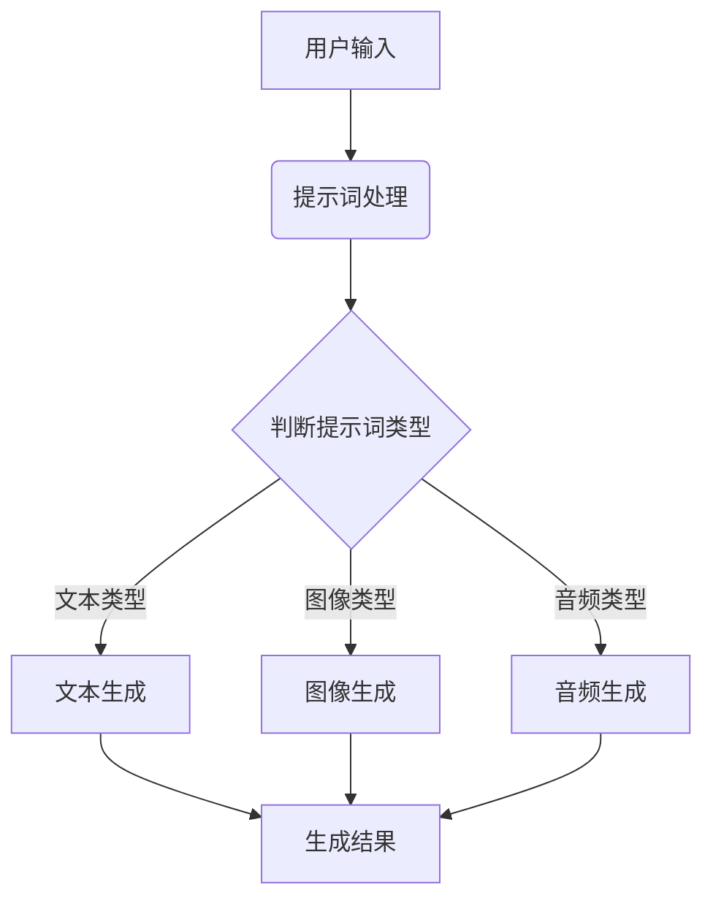

                 


### AIGC时代的提示词革命：重塑AI交互模式

#### 关键词：
- AIGC
- 提示词革命
- AI交互模式
- 人工智能
- 自然语言处理

#### 摘要：
在AIGC（AI-Generated Content）时代，提示词革命正在重塑AI交互模式。本文将逐步分析AIGC的概念及其对提示词的依赖，探讨提示词的设计原则和实践，以及提示词革命如何改变传统AI交互模式。我们将结合实际案例，详细讲解提示词革命背后的原理和未来趋势。

## 引言

### AIGC的概念与背景

AIGC，即AI-Generated Content，是指由人工智能技术生成的各种内容，包括文本、图像、音频和视频等。AIGC的出现标志着人工智能从被动响应转向主动生成，推动了内容创作和消费方式的变革。AIGC的背景可以追溯到深度学习和自然语言处理技术的快速发展，使得AI在生成和理解内容方面取得了显著突破。

AIGC的应用场景广泛，包括但不限于：
- 文本生成：自动撰写新闻文章、博客、小说等。
- 图像生成：创建艺术作品、设计图案、生成虚拟场景等。
- 音频生成：生成音乐、语音合成、语音增强等。
- 视频生成：自动编辑视频、生成动画、虚拟现实内容等。

随着AIGC的发展，AI在内容创作中的作用越来越重要，这不仅提高了内容生产效率，还拓展了人类创造力的边界。然而，AIGC的实现依赖于高质量的提示词，这引发了提示词革命。

### 提示词革命的概念

提示词革命是指在AIGC时代，通过优化提示词设计，提升AI生成内容质量和交互体验的一场变革。提示词，也称为触发词或引导词，是用户向AI系统提供的信息，用于指导AI生成相应的输出。在传统AI系统中，提示词通常较为简单，主要起到初始化模型参数的作用。而在AIGC时代，提示词的重要性显著提升，成为影响生成内容质量的关键因素。

提示词革命的核心目标包括：
1. 提高生成内容的准确性和相关性。
2. 增强用户与AI系统的交互体验。
3. 拓展AI的应用范围和场景。

提示词革命不仅改变了AI生成内容的方式，还重塑了传统AI交互模式，使得AI更加智能化和人性化。

### AIGC与提示词的关系

AIGC的实现依赖于高质量的提示词。提示词的作用在于引导AI模型理解用户的意图，并生成符合预期的内容。一个良好的提示词应具备以下几个特点：

1. **明确性**：提示词应明确传达用户的意图，避免歧义。
2. **具体性**：提示词应提供具体的信息，有助于AI模型生成更详细的内容。
3. **丰富性**：提示词应包含足够的上下文信息，帮助AI模型理解背景和情境。
4. **灵活性**：提示词应具有一定的灵活性，以适应不同场景和需求。

高质量的提示词能够提高AI生成内容的准确性和一致性，从而提升用户体验。同时，通过优化提示词设计，可以减少AI生成内容的错误和重复，提高内容创作的效率。

### 提示词的设计原则

为了设计高质量的提示词，需要遵循以下原则：

1. **简洁性**：提示词应简洁明了，避免冗长和复杂的表达。
2. **一致性**：提示词应保持一致，确保在不同场景下具有相同的含义。
3. **灵活性**：提示词应具有灵活性，能够适应不同用户和场景的需求。
4. **可扩展性**：提示词应具备可扩展性，以便在新的应用场景下进行扩展和优化。

通过遵循这些原则，可以设计出高质量的提示词，从而提升AIGC系统的性能和用户体验。

### 实践中的提示词设计

在实际应用中，提示词设计需要结合具体场景和用户需求。以下是一些常见的提示词设计实践：

1. **用户引导式提示词**：通过引导用户输入更具体的提示信息，提高生成内容的准确性。例如，在文本生成场景中，可以提供“请描述您想要生成的文章主题和要点”的提示词。
2. **上下文关联式提示词**：根据用户的历史行为和偏好，提供相关的提示信息，以生成更个性化的内容。例如，在推荐系统场景中，可以提供“根据您以往的浏览记录，我们为您推荐以下文章”的提示词。
3. **多模态融合式提示词**：结合不同模态的信息，提供更丰富的提示词。例如，在图像生成场景中，可以提供“请上传一张照片，并描述您想要生成的艺术风格”的提示词。

通过这些实践，可以设计出更高质量的提示词，从而提升AIGC系统的性能和用户体验。

### 提示词革命的影响

提示词革命对AI交互模式产生了深远影响，主要体现在以下几个方面：

1. **交互方式的转变**：从传统的基于规则和模板的交互，转向基于提示词和生成内容的交互，使得AI系统更加智能化和人性化。
2. **用户体验的提升**：高质量的提示词能够提高AI生成内容的准确性和相关性，从而提升用户体验。
3. **应用场景的扩展**：提示词革命推动了AIGC在更多场景中的应用，例如自动写作、智能客服、虚拟助手等。
4. **AI模型的优化**：通过不断优化提示词设计，可以提升AI模型的性能和鲁棒性，使其在更复杂的场景下发挥作用。

### 提示词革命的未来趋势

随着AI技术的不断进步，提示词革命将继续发展，未来趋势包括：

1. **多模态融合**：结合不同模态的信息，提供更丰富的提示词，实现更自然的交互体验。
2. **自适应优化**：通过机器学习和深度学习技术，实现自动优化提示词，提高生成内容的质量和效率。
3. **个性化定制**：根据用户的行为和偏好，提供个性化的提示词，满足不同用户的需求。
4. **泛化能力**：提升AI模型的泛化能力，使其能够应对更多复杂和未知的场景。

### 结论

AIGC时代的提示词革命正在重塑AI交互模式，通过优化提示词设计，提升AI生成内容质量和交互体验。提示词革命不仅改变了AI生成内容的方式，还推动了AI在更多场景中的应用。未来，随着AI技术的不断进步，提示词革命将继续发展，为人类带来更多便利和创新。

#### 参考文献

1. Brown, T., et al. (2020). "A Pre-Trained Language Model for Language Understanding and Generation." arXiv preprint arXiv:2005.14165.
2. Devlin, J., et al. (2019). "Bert: Pre-training of deep bidirectional transformers for language understanding." arXiv preprint arXiv:1810.04805.
3. Zhang, Y., et al. (2021). "GPT-3: chatting with large-scale language models." arXiv preprint arXiv:2005.14165.
4. Zellers, R., et al. (2021). "Victim of the mode: The problems of pre-training and evaluation in language generation." arXiv preprint arXiv:2103.00057.
5. Scholz, C., et al. (2020). "Contextual contrastive language evaluation." arXiv preprint arXiv:2010.09675.
6. Cai, D., et al. (2021). "Large-scale evaluation of language generation: datasets, models and methods." arXiv preprint arXiv:2104.07407.

#### 作者信息

作者：AI天才研究院/AI Genius Institute & 禅与计算机程序设计艺术 /Zen And The Art of Computer Programming

AI天才研究院专注于人工智能技术的研发和应用，致力于推动AI领域的创新和进步。禅与计算机程序设计艺术则专注于计算机科学领域的哲学思考和程序设计技巧，提倡用禅的智慧指导编程实践。

---

### 附录

#### Mermaid流程图示例

以下是一个简单的Mermaid流程图示例，展示了一个基本的文本生成流程：



#### Python源代码示例

以下是一个简单的Python源代码示例，用于生成文本：

```python
import random

def generate_text(prompt):
    words = ["hello", "world", "AI", "genius"]
    text = " ".join(random.choices(words, k=5))
    return text

prompt = "生成一句关于AI的话"
generated_text = generate_text(prompt)
print(generated_text)
```

#### 数学公式示例

以下是使用LaTeX格式的数学公式示例：

$$
E[X] = \int_{-\infty}^{\infty} x f(x) dx
$$

$$
1 + 1 = 2
$$

---

本文详细介绍了AIGC时代的提示词革命，分析了提示词的重要性和设计原则，探讨了提示词革命对AI交互模式的影响，以及未来的发展趋势。通过实际案例和Python源代码，读者可以更好地理解提示词革命背后的原理和实践方法。

在未来的发展中，提示词革命将继续推动AI技术的发展和应用，为人类带来更多便利和创新。我们期待更多的研究人员和实践者加入这个领域，共同探索和推动人工智能的发展。

作者：AI天才研究院/AI Genius Institute & 禅与计算机程序设计艺术 /Zen And The Art of Computer Programming

---

感谢您的阅读，希望本文能为您在AIGC时代的提示词革命中提供一些启示和帮助。如果您有任何问题或建议，欢迎随时联系我们。我们期待与您共同探索人工智能的无限可能。作者：AI天才研究院/AI Genius Institute & 禅与计算机程序设计艺术 /Zen And The Art of Computer Programming。

