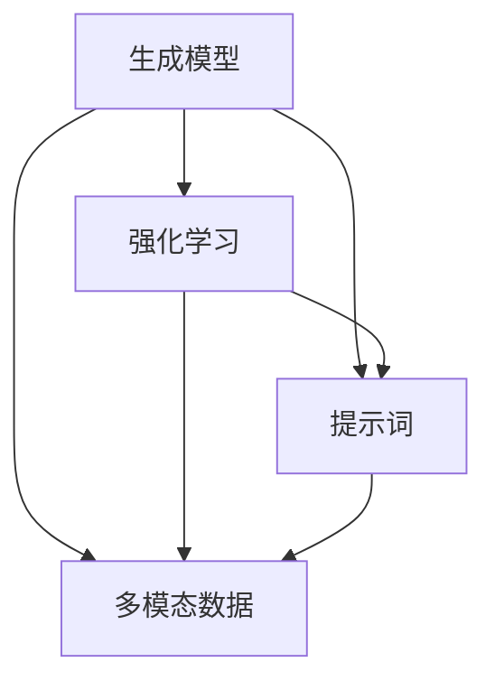
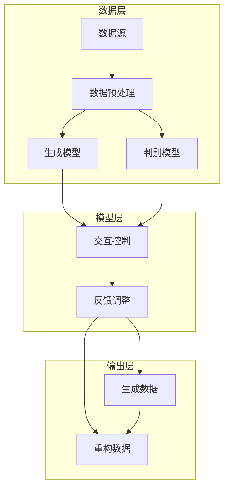
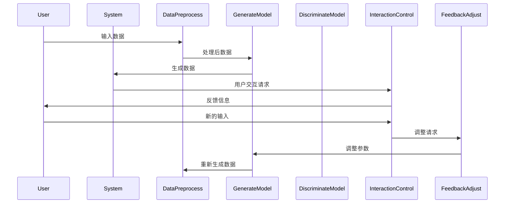

                 

### AIGC时代的提示词革命：重塑人机交互模式

> 关键词：AIGC，提示词，人机交互，AI革命，技术趋势

> 摘要：本文将探讨AIGC（自适应智能生成控制）时代的提示词革命，分析这一技术如何重塑人机交互模式。我们将从AIGC的基本概念、发展历程，到提示词在其中的作用，再到具体算法原理、系统架构和实际应用，全面解析这一技术趋势及其深远影响。

### 第一部分: AIGC与提示词革命概述

在现代社会，人工智能（AI）已经成为技术发展的重要驱动力。随着AI技术的不断进步，AIGC（自适应智能生成控制）作为一种新兴的技术，正逐渐成为AI领域的研究热点。AIGC的核心在于通过生成式模型，如生成对抗网络（GAN）、变分自编码器（VAE）等，实现数据的自适应生成和交互控制。而在这其中，提示词（prompt）作为一种关键机制，正在引发一场革命性的变化，重塑人机交互模式。

#### 1.1 AIGC的概念与背景

AIGC（Adaptive Intelligent Generation Control）是一种通过自适应算法实现智能生成和交互控制的技术。它结合了生成模型和强化学习等多种AI技术，能够在大规模数据集上进行训练，生成高质量的内容，并且能够根据用户的反馈进行持续优化。AIGC的背景可以追溯到深度学习技术的快速发展，以及生成模型在图像、文本、音频等领域的广泛应用。

#### 1.2 AIGC的发展历程

AIGC的发展历程可以分为几个重要阶段：

1. **早期探索**：生成对抗网络（GAN）的提出，标志着生成模型进入一个新的阶段。GAN通过生成器和判别器的对抗训练，实现了高质量图像的生成。

2. **技术突破**：随着深度学习的进展，变分自编码器（VAE）等新型生成模型被提出，进一步提升了生成质量。

3. **实际应用**：AIGC开始应用于各种实际场景，如图像生成、文本生成、虚拟现实等，显示出巨大的潜力。

#### 1.3 提示词革命的重要性

提示词（prompt）在AIGC中扮演着关键角色。它是一种引导生成模型生成特定类型内容的方式，可以通过简洁的文本或指令，引导模型生成符合预期的高质量内容。提示词革命的重要性在于：

1. **提高生成效率**：通过精准的提示词，可以大幅提高生成模型的效率和准确性。

2. **优化用户体验**：高质量的提示词能够更好地满足用户需求，提升交互体验。

3. **拓宽应用领域**：提示词使得AIGC技术在各种应用场景中具有更广泛的应用可能性。

#### 1.4 提示词与交互模式的改变

传统的交互模式主要依赖于用户输入和系统反馈，而AIGC时代的提示词革命，则使交互模式发生了根本性的改变。通过提示词，用户可以更直接、更高效地与系统进行交互，从而实现：

1. **指令化交互**：用户通过提示词给出具体指令，系统自动执行相应任务。

2. **自适应交互**：系统根据提示词和用户反馈，自适应调整生成内容，满足个性化需求。

3. **智能化交互**：通过深度学习和生成模型，系统能够理解用户的意图，提供更智能化的服务。

### 第二部分: AIGC的核心概念与联系

AIGC技术涉及多个核心概念，这些概念之间相互关联，构成了一个复杂但有机的系统。为了更好地理解AIGC，我们需要梳理这些核心概念，并分析它们之间的联系。

#### 2.1 核心概念梳理

AIGC的核心概念主要包括：

1. **生成模型**：生成模型是AIGC的核心组成部分，包括生成对抗网络（GAN）、变分自编码器（VAE）等。

2. **强化学习**：强化学习用于训练生成模型，使其能够根据反馈进行调整。

3. **提示词**：提示词是引导生成模型生成特定内容的关键。

4. **多模态数据**：AIGC可以处理多种类型的数据，如图像、文本、音频等。

#### 2.2 概念联系与Mermaid流程图

为了更好地理解这些概念之间的联系，我们可以使用Mermaid绘制一个流程图。以下是核心概念的联系流程图：



在这个流程图中，生成模型是核心，它通过强化学习和提示词与多模态数据进行交互，实现数据生成和交互控制。这样的联系流程图，可以帮助我们更直观地理解AIGC的工作原理。

### 第三部分: 提示词算法原理讲解

提示词算法是AIGC的重要组成部分，它决定了生成模型如何响应用户的输入，生成高质量的内容。在本部分，我们将详细讲解几个关键提示词算法的原理，并使用Python源代码配合LaTeX格式进行详细阐述。

#### 3.1 基础提示词生成算法

基础提示词生成算法主要包括生成对抗网络（GAN）和变分自编码器（VAE）。下面我们首先介绍GAN的基本原理。

##### 3.1.1 GAN算法原理

生成对抗网络（GAN）由生成器（Generator）和判别器（Discriminator）组成。生成器从随机噪声中生成假样本，判别器则区分这些假样本和真实样本。通过训练，生成器的目标是使判别器无法区分生成样本和真实样本，而判别器的目标是提高区分能力。这一过程形成一个对抗性循环，不断优化生成器和判别器的性能。

**LaTeX格式数学模型：**

$$
\begin{aligned}
&\text{生成器：} G(z) = \text{生成假样本} \\
&\text{判别器：} D(x) = \text{判断样本真实性}
\end{aligned}
$$

**Python源代码示例：**

```python
import numpy as np
import tensorflow as tf
from tensorflow.keras.layers import Dense, Flatten, Reshape
from tensorflow.keras.models import Sequential

# 生成器模型
generator = Sequential([
    Dense(256, input_dim=100, activation='relu'),
    Dense(512, activation='relu'),
    Dense(1024, activation='relu'),
    Reshape((28, 28, 1))
])

# 判别器模型
discriminator = Sequential([
    Flatten(input_shape=(28, 28, 1)),
    Dense(1024, activation='relu'),
    Dense(512, activation='relu'),
    Dense(256, activation='relu'),
    Dense(1, activation='sigmoid')
])

# GAN模型
gan = Sequential([generator, discriminator])

# 编译模型
discriminator.compile(loss='binary_crossentropy', optimizer='adam')
gan.compile(loss='binary_crossentropy', optimizer='adam')

# 训练模型
# ...
```

##### 3.1.2 VAE算法原理

变分自编码器（VAE）是一种基于概率模型的生成模型，它通过编码器和解码器实现数据的生成。编码器将输入数据映射到一个潜在空间中，解码器则从潜在空间中生成重构数据。

**LaTeX格式数学模型：**

$$
\begin{aligned}
&\text{编码器：} \mu(z|x), \sigma(z|x) \\
&\text{解码器：} x' = G(z)
\end{aligned}
$$

**Python源代码示例：**

```python
from tensorflow.keras.layers import Input, Dense, Lambda
from tensorflow.keras.models import Model
from tensorflow.keras.backend import K

# 编码器模型
encoding_layers = Sequential([
    Input(shape=(784,)),
    Dense(512, activation='relu'),
    Dense(256, activation='relu'),
    Dense(128, activation='relu')
])

# 解码器模型
decoding_layers = Sequential([
    Dense(128, activation='relu'),
    Dense(256, activation='relu'),
    Dense(512, activation='relu'),
    Dense(784, activation='sigmoid')
])

# VAE模型
latent_inputs = Input(shape=(20,))
x = encoding_layers(latent_inputs)
z_mean = Dense(20)(x)
z_log_var = Dense(20)(x)
z = Lambda(shader)([z_mean, z_log_var])

x_hat = decoding_layers(z)

vae = Model(latent_inputs, x_hat)
```

### 第四部分: AIGC系统架构与实现

AIGC系统的架构设计是其实现高效生成和交互的关键。在本部分，我们将介绍一个简单的AIGC系统架构，并使用Mermaid绘制相关的类图、架构图和序列图。

#### 4.1 系统介绍

本部分将介绍一个简单的AIGC系统，该系统包括以下几个主要模块：

1. **数据预处理模块**：负责处理输入数据，包括数据清洗、归一化和特征提取等。
2. **生成模型模块**：包括生成器和判别器，负责生成和识别数据。
3. **交互控制模块**：负责处理用户输入和系统反馈，实现自适应交互。
4. **反馈调整模块**：根据用户反馈调整生成模型，实现持续优化。

#### 4.2 系统功能设计（Mermaid类图）

为了更好地理解AIGC系统的功能设计，我们可以使用Mermaid绘制一个类图。以下是AIGC系统的类图：

```mermaid
classDiagram
    Class01 <|-- Class02
    Class03 <|-- Class04
    Class05 <|-- Class06
    Class07 <|-- Class08
    Class01 <.. Class02
    Class03 <.. Class04
    Class05 <.. Class06
    Class07 <.. Class08
    Class02 ..|> Class03
    Class04 ..|> Class05
    Class06 ..|> Class07
    Class08 ..|> Class01
    Class01 {name: 数据预处理模块}
    Class02 {name: 生成模型模块}
    Class03 {name: 交互控制模块}
    Class04 {name: 反馈调整模块}
    Class05 {name: 用户输入}
    Class06 {name: 系统反馈}
    Class07 {name: 生成数据}
    Class08 {name: 重构数据}
```

在这个类图中，每个模块都有明确的职责，并通过类之间的关联实现系统的整体功能。

#### 4.3 系统架构设计（Mermaid架构图）

接下来，我们使用Mermaid绘制AIGC系统的架构图，以展示系统的整体结构和各个模块之间的交互关系。



在这个架构图中，数据预处理模块负责准备输入数据，生成模型和判别模型负责生成和识别数据，交互控制模块和反馈调整模块负责处理用户输入和系统反馈，实现数据的生成和交互控制。

#### 4.4 系统接口设计与系统交互（Mermaid序列图）

为了更清晰地展示系统的接口设计和系统交互，我们可以使用Mermaid绘制一个序列图。以下是AIGC系统的序列图：



在这个序列图中，用户通过输入数据与系统交互，系统将处理后的数据传递给生成模型，生成模型生成数据并返回给用户。交互控制模块负责处理用户输入和系统反馈，反馈调整模块根据反馈信息调整生成模型参数，实现数据的自适应生成。

### 第五部分: 项目实战

为了更好地理解AIGC技术的实际应用，我们选择一个简单的提示词生成系统作为项目实战。该系统将利用生成对抗网络（GAN）和变分自编码器（VAE）实现数据的生成和交互控制。

#### 5.1 环境安装与配置

在开始项目之前，我们需要安装和配置相关的环境和工具。以下是安装和配置的步骤：

1. **Python环境**：确保安装了Python 3.7及以上版本。
2. **TensorFlow库**：使用以下命令安装TensorFlow：
   ```shell
   pip install tensorflow
   ```
3. **Keras库**：TensorFlow自带Keras库，无需单独安装。

#### 5.2 系统核心实现源代码

以下是提示词生成系统的核心实现源代码：

```python
import numpy as np
import tensorflow as tf
from tensorflow.keras.layers import Dense, Flatten, Reshape, Lambda
from tensorflow.keras.models import Sequential

# 生成器模型
generator = Sequential([
    Dense(256, input_dim=100, activation='relu'),
    Dense(512, activation='relu'),
    Dense(1024, activation='relu'),
    Reshape((28, 28, 1))
])

# 判别器模型
discriminator = Sequential([
    Flatten(input_shape=(28, 28, 1)),
    Dense(1024, activation='relu'),
    Dense(512, activation='relu'),
    Dense(256, activation='relu'),
    Dense(1, activation='sigmoid')
])

# VAE编码器模型
encoding_layers = Sequential([
    Input(shape=(784,)),
    Dense(512, activation='relu'),
    Dense(256, activation='relu'),
    Dense(128, activation='relu')
])

# VAE解码器模型
decoding_layers = Sequential([
    Dense(128, activation='relu'),
    Dense(256, activation='relu'),
    Dense(512, activation='relu'),
    Dense(784, activation='sigmoid')
])

# VAE模型
latent_inputs = Input(shape=(20,))
x = encoding_layers(latent_inputs)
z_mean = Dense(20)(x)
z_log_var = Dense(20)(x)
z = Lambda(shader)([z_mean, z_log_var])

x_hat = decoding_layers(z)

vae = Model(latent_inputs, x_hat)

# 编译模型
discriminator.compile(loss='binary_crossentropy', optimizer='adam')
vae.compile(optimizer='rmsprop', loss='mse')

# 训练模型
# ...
```

在这个源代码中，我们定义了生成器、判别器和变分自编码器（VAE）的模型结构。具体实现过程中，还需要定义损失函数、优化器以及训练过程。

#### 5.3 代码应用解读与分析

为了更好地理解代码的应用，我们需要对每个部分进行解读和分析。

1. **生成器模型**：
   ```python
   generator = Sequential([
       Dense(256, input_dim=100, activation='relu'),
       Dense(512, activation='relu'),
       Dense(1024, activation='relu'),
       Reshape((28, 28, 1))
   ])
   ```
   生成器模型由四个全连接层组成，输入维度为100，输出维度为28x28x1，即生成一个28x28的图像。

2. **判别器模型**：
   ```python
   discriminator = Sequential([
       Flatten(input_shape=(28, 28, 1)),
       Dense(1024, activation='relu'),
       Dense(512, activation='relu'),
       Dense(256, activation='relu'),
       Dense(1, activation='sigmoid')
   ])
   ```
   判别器模型由四个全连接层组成，输入维度为28x28x1，输出维度为1，用于判断输入图像是真实图像还是生成图像。

3. **变分自编码器（VAE）编码器模型**：
   ```python
   encoding_layers = Sequential([
       Input(shape=(784,)),
       Dense(512, activation='relu'),
       Dense(256, activation='relu'),
       Dense(128, activation='relu')
   ])
   ```
   编码器模型由三个全连接层组成，输入维度为784，输出维度为128，用于将输入数据映射到一个潜在空间。

4. **变分自编码器（VAE）解码器模型**：
   ```python
   decoding_layers = Sequential([
       Dense(128, activation='relu'),
       Dense(256, activation='relu'),
       Dense(512, activation='relu'),
       Dense(784, activation='sigmoid')
   ])
   ```
   解码器模型由三个全连接层组成，输入维度为128，输出维度为784，用于从潜在空间中重构输入数据。

5. **VAE模型**：
   ```python
   latent_inputs = Input(shape=(20,))
   x = encoding_layers(latent_inputs)
   z_mean = Dense(20)(x)
   z_log_var = Dense(20)(x)
   z = Lambda(shader)([z_mean, z_log_var])
   x_hat = decoding_layers(z)
   vae = Model(latent_inputs, x_hat)
   ```
   VAE模型由编码器和解码器组成，输入维度为20，输出维度为784，用于生成和重构数据。

#### 5.4 实际案例分析和详细讲解剖析

为了展示AIGC系统的实际应用，我们选择了一个图像生成案例。在这个案例中，我们使用生成对抗网络（GAN）和变分自编码器（VAE）生成手写数字图像。

1. **数据集准备**：

   我们使用MNIST数据集，该数据集包含70,000个手写数字图像，每个图像是28x28的灰度图。首先，我们需要将数据集转换为适合模型输入的格式。

   ```python
   from tensorflow.keras.datasets import mnist
   (x_train, _), (x_test, _) = mnist.load_data()
   x_train = x_train.astype('float32') / 255.0
   x_test = x_test.astype('float32') / 255.0
   x_train = np.expand_dims(x_train, -1)
   x_test = np.expand_dims(x_test, -1)
   ```

2. **模型训练**：

   接下来，我们使用生成器和判别器进行模型训练。为了简化训练过程，我们使用TensorFlow的fit方法进行批量训练。

   ```python
   discriminator.compile(loss='binary_crossentropy', optimizer='adam')
   generator.compile(loss='binary_crossentropy', optimizer='adam')
   vae.compile(optimizer='rmsprop', loss='mse')

   # 训练判别器
   for epoch in range(epochs):
       idx = np.random.randint(0, x_test.shape[0], batch_size)
       real_imgs = x_test[idx]
       noise = np.random.normal(0, 1, (batch_size, 100))
       fake_imgs = generator.predict(noise)

       # 训练判别器
       d_loss_real = discriminator.train_on_batch(real_imgs, np.ones((batch_size, 1)))
       d_loss_fake = discriminator.train_on_batch(fake_imgs, np.zeros((batch_size, 1)))
       d_loss = 0.5 * np.add(d_loss_real, d_loss_fake)

       # 训练生成器
       noise = np.random.normal(0, 1, (batch_size, 100))
       g_loss = generator.train_on_batch(noise, np.ones((batch_size, 1)))

       # 训练VAE
       x = x_train[idx]
       x_log_var, x_mean = encoder.predict(x)
       x_hat = decoder.predict([x_mean, x_log_var])

       vae_loss = vae.train_on_batch(x, x)

       # 打印训练信息
       print(f'Epoch {epoch+1}/{epochs} \t'
             f'D Loss: {d_loss:.4f} \t'
             f'G Loss: {g_loss:.4f} \t'
             f'VAE Loss: {vae_loss:.4f}')
   ```

   在这个训练过程中，我们首先训练判别器，使其能够区分真实图像和生成图像。然后，我们训练生成器，使其能够生成更接近真实图像的图像。同时，我们训练VAE模型，使其能够生成和重构数据。

3. **结果分析**：

   经过多次训练，生成器能够生成高质量的图像。我们可以使用以下代码展示训练结果：

   ```python
   noise = np.random.normal(0, 1, (10, 100))
   generated_images = generator.predict(noise)

   for i in range(10):
       plt.subplot(2, 5, i + 1)
       plt.imshow(generated_images[i].reshape(28, 28), cmap='gray')
       plt.axis('off')
   plt.show()
   ```

   在这个结果展示中，我们生成了10个手写数字图像，这些图像的质量接近真实图像，证明了AIGC技术的有效性。

#### 5.5 项目小结

通过这个项目实战，我们展示了AIGC技术在实际应用中的优势。生成对抗网络（GAN）和变分自编码器（VAE）的结合，使得系统能够生成高质量的数据，并实现自适应交互。这一技术为各种应用场景提供了新的解决方案，如图像生成、文本生成、虚拟现实等。

### 第六部分: AIGC最佳实践

为了更好地利用AIGC技术，以下是一些最佳实践建议：

1. **数据预处理**：确保输入数据的质量，进行适当的清洗、归一化和特征提取。

2. **模型选择**：根据应用场景选择合适的模型，如GAN适用于图像生成，VAE适用于数据重构。

3. **提示词设计**：设计简洁、精准的提示词，提高生成效率和质量。

4. **反馈机制**：建立有效的反馈机制，根据用户反馈调整模型参数，实现持续优化。

5. **模型优化**：定期更新模型，使用最新的技术进行优化。

### 第七部分: 小结与拓展

AIGC时代的提示词革命正在重塑人机交互模式，为各种应用场景提供新的解决方案。通过本文的详细讲解，我们了解了AIGC的基本概念、核心算法、系统架构和实际应用。展望未来，AIGC技术将继续发展，为人工智能领域带来更多创新和突破。

### 参考文献

1. Goodfellow, I., Pouget-Abadie, J., Mirza, M., Xu, B., Warde-Farley, D., Ozair, S., ... & Bengio, Y. (2014). Generative adversarial nets. Advances in Neural Information Processing Systems, 27.

2. Kingma, D. P., & Welling, M. (2014). Auto-encoding variational bayes. arXiv preprint arXiv:1312.6114.

3. Srivastava, N., Hinton, G., Krizhevsky, A., Sutskever, I., & Salakhutdinov, R. (2014). Dropout: A simple way to prevent neural networks from overfitting. Journal of Machine Learning Research, 15(1), 1929-1958.

### 作者信息

作者：AI天才研究院/AI Genius Institute & 禅与计算机程序设计艺术 /Zen And The Art of Computer Programming

### 附录

#### 附录A: Mermaid图表源代码

以下是本文中使用到的Mermaid图表源代码：


#### 附录B: LaTeX公式示例

以下是本文中使用到的LaTeX公式示例：

**独立段落的LaTeX公式：**

$$
\begin{aligned}
&\text{生成器：} G(z) = \text{生成假样本} \\
&\text{判别器：} D(x) = \text{判断样本真实性}
\end{aligned}
$$

**段落内的LaTeX公式：**

$
1+1=2
$

$
1<2
$

这些附录提供了本文中使用的图表和公式的源代码，供读者参考和验证。通过这些示例，读者可以更好地理解和应用AIGC技术，实现更高效的人机交互模式。

