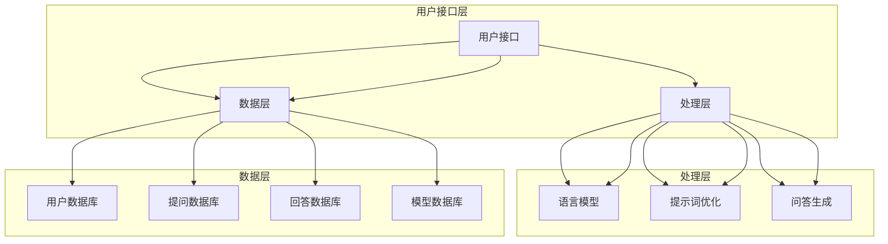
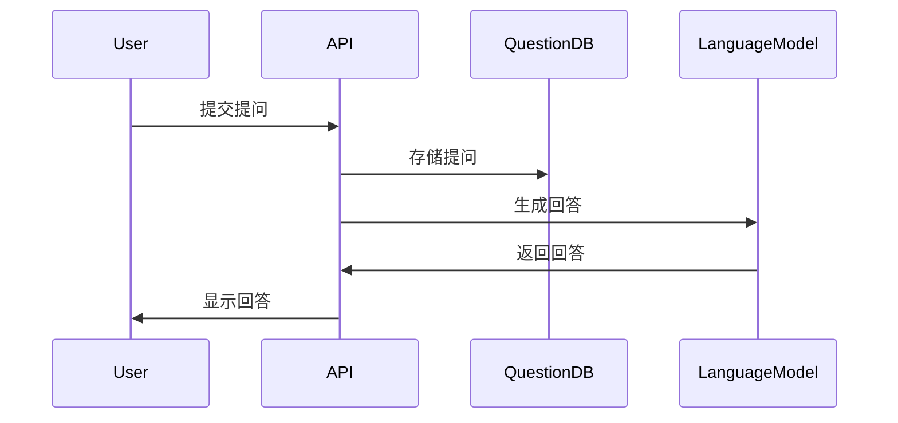
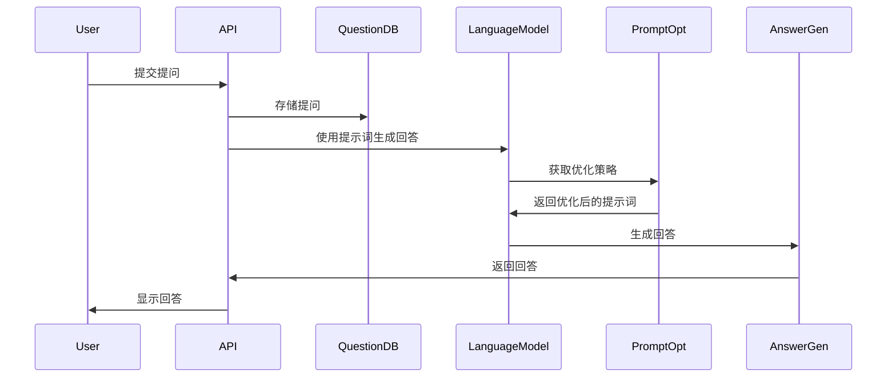
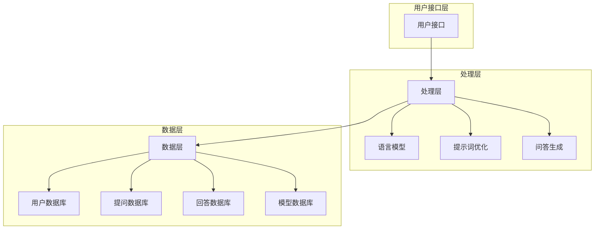

                 

### 引言

#### AIGC时代的语言模型概述

随着人工智能（AI）技术的飞速发展，AI生成内容（AI-Generated Content，简称AIGC）逐渐成为新兴的热点领域。AIGC是指通过AI技术生成各种形式的内容，包括文本、图像、音频、视频等。在AIGC时代，语言模型作为AI的核心组成部分，发挥着至关重要的作用。本文将深入探讨AIGC时代的语言模型与提示词协同优化，旨在为读者提供全面的技术解读和应用指南。

#### 文章关键词

- AIGC
- 语言模型
- 提示词
- 协同优化
- 应用场景

#### 摘要

本文首先介绍AIGC时代的背景，探讨语言模型与提示词的基本概念及其在AIGC中的作用。随后，详细阐述语言模型的工作原理，包括神经网络、注意力机制等核心组件。接着，分析提示词的优化方法，并绘制语言模型与提示词协同工作的ER图。文章随后通过实际项目案例，展示语言模型与提示词协同优化的应用效果。最后，总结全文核心观点，并对AIGC时代的语言模型与提示词协同优化的未来发展趋势进行展望。本文旨在为读者提供一站式的技术解析，帮助深入理解和应用AIGC时代的语言模型与提示词协同优化技术。### 1. AIGC时代的语言模型概述

#### 1.1 AIGC时代的背景

AIGC时代的到来，标志着人工智能技术进入了一个全新的发展阶段。在这个时代，AI不再仅仅是被动地响应人类指令，而是能够主动生成内容，满足多样化的需求。AIGC技术的发展，得益于深度学习、自然语言处理（NLP）和大数据技术的融合。随着计算能力的提升和算法的进步，语言模型如GPT、BERT等已经展现出强大的生成能力。

AIGC的核心在于其生成的自主性和创造力。在传统的人工创作中，创作者需要根据既定的主题和框架进行内容创作，而在AIGC时代，AI可以自主地生成文章、图像、音频等内容，甚至能够进行创意性的设计。这一变化不仅提高了内容生成的效率，也在一定程度上改变了人类的工作和生活方式。

#### 1.2 语言模型的基本原理

语言模型是一种用于预测文本序列的算法，其目标是根据已知的输入文本序列，预测下一个可能的文本序列。语言模型的核心思想是理解自然语言的统计规律和语义结构，从而生成高质量的自然语言文本。

语言模型通常基于神经网络架构，特别是深度神经网络（DNN）。其中，GPT（Generative Pre-trained Transformer）和BERT（Bidirectional Encoder Representations from Transformers）是两种具有代表性的语言模型。GPT采用了Transformer架构，通过自注意力机制（Self-Attention）捕捉输入文本中的长距离依赖关系。而BERT则通过双向编码器（Bidirectional Encoder）捕捉文本中的上下文信息，使得生成的文本更加准确和自然。

#### 1.3 提示词的概念与类型

在AIGC时代，提示词（Prompt）是引导语言模型生成特定内容的重要工具。提示词是一种简短的文本输入，用于向语言模型提供生成任务的上下文和目标。通过优化提示词，可以显著提高语言模型生成内容的精准度和创造力。

提示词可以分为以下几种类型：

1. **生成式提示词**：这类提示词主要用于引导语言模型生成新的文本内容，如文章、故事、诗歌等。
2. **任务型提示词**：这类提示词用于指示语言模型执行特定的任务，如问答、对话生成、摘要生成等。
3. **引导式提示词**：这类提示词通过提供具体的方向或限制，引导语言模型生成特定类型或风格的内容。

#### 1.4 语言模型与提示词的协同优化

在AIGC系统中，语言模型和提示词是相互协同的。优化这两个组件，可以显著提高AIGC系统的性能和效果。以下是一些常见的协同优化方法：

1. **提示词调整策略**：通过实验和数据分析，调整提示词的内容和格式，以最大化生成内容的准确性和创造性。
2. **提示词优化算法**：利用机器学习算法，如遗传算法、粒子群优化算法等，自动搜索最优的提示词组合。
3. **多模态提示词**：结合图像、音频等多种模态的信息，生成更丰富、更具有创意性的文本内容。

#### 1.5 AIGC时代的语言模型应用场景

AIGC时代的语言模型在多个应用场景中展现出巨大的潜力：

1. **文本生成与生成式AI**：通过语言模型生成新闻文章、技术文档、创意文案等。
2. **问答系统与对话生成**：利用语言模型实现智能客服、聊天机器人等。
3. **自动摘要与信息提取**：从大量文本数据中自动生成摘要和关键信息。

#### 1.6 本章小结

本章介绍了AIGC时代的背景和语言模型的基本原理，阐述了提示词的概念和类型，以及语言模型与提示词的协同优化方法。通过本章的学习，读者可以对AIGC时代的语言模型有一个整体的认识，为后续章节的深入学习打下基础。### 2. 语言模型的算法原理与优化方法

#### 2.1 语言模型算法原理

语言模型的算法原理主要基于神经网络和注意力机制。在这里，我们将重点介绍Transformer架构和自注意力机制，以及这些概念在语言模型中的应用。

##### 2.1.1 Transformer架构

Transformer是由Vaswani等人于2017年提出的一种神经网络架构，主要用于处理序列到序列的任务，如图像描述生成、机器翻译等。与传统的循环神经网络（RNN）相比，Transformer具有以下优势：

1. **并行计算**：Transformer使用自注意力机制，可以在每个时间步独立计算，这使得它能够并行处理输入序列，从而提高了计算效率。
2. **长距离依赖**：通过多头自注意力机制，Transformer能够捕捉输入序列中的长距离依赖关系，使得生成的文本更加连贯和准确。

Transformer的核心组件包括编码器（Encoder）和解码器（Decoder）。编码器负责将输入序列编码为固定长度的向量表示，而解码器则将这些向量表示解码为输出序列。

##### 2.1.2 自注意力机制

自注意力机制是Transformer架构的核心，它通过计算输入序列中每个词与其他词之间的关联性，从而为每个词生成不同的权重。具体来说，自注意力机制可以分为以下三个步骤：

1. **计算query、key和value**：对于编码器中的每个词，我们分别计算其query、key和value。query和key用于计算关联性，而value用于加权求和。
2. **计算注意力权重**：通过计算query和key之间的点积，得到每个词的注意力权重。权重越大，表示这个词与当前词的关联性越强。
3. **加权求和**：将注意力权重与对应的value相乘，然后求和，得到每个词的加权表示。

##### 2.1.3 语言模型的训练过程

语言模型的训练过程主要包括以下步骤：

1. **输入序列编码**：将输入序列中的每个词编码为向量表示，这一过程通常使用嵌入层（Embedding Layer）完成。
2. **计算自注意力**：通过自注意力机制计算输入序列中每个词的加权表示。
3. **传递到解码器**：将加权表示传递到解码器，解码器通过自注意力和交叉注意力机制生成输出序列。
4. **损失函数**：使用损失函数（如交叉熵损失）计算预测序列和实际序列之间的差距，并更新模型参数。

##### 2.1.4 Python代码示例

以下是一个简单的Python代码示例，用于演示Transformer架构和自注意力机制的基本原理：

```python
import tensorflow as tf

# 定义嵌入层
embedding_layer = tf.keras.layers.Embedding(input_dim=vocab_size, output_dim=embedding_size)

# 定义自注意力层
self_attention_layer = tf.keras.layers.Attention()

# 定义编码器和解码器
encoder = tf.keras.Sequential([
    embedding_layer,
    self_attention_layer
])

decoder = tf.keras.Sequential([
    embedding_layer,
    self_attention_layer
])

# 编译模型
model = tf.keras.Model(inputs=[encoder.input, decoder.input], outputs=decoder.output)
model.compile(optimizer='adam', loss='mse')

# 训练模型
model.fit(x_train, y_train, epochs=10)
```

##### 2.1.5 提示词优化的重要性

提示词优化是AIGC系统中至关重要的一环。通过优化提示词，我们可以提高语言模型生成内容的精准度和创造力。以下是一些常见的提示词优化方法：

1. **提示词内容调整**：通过分析生成内容的质量和用户反馈，不断调整提示词的内容，以最大化生成效果的优化。
2. **提示词格式优化**：优化提示词的格式和结构，使其更符合语言模型的生成习惯，提高生成效果的优化。
3. **提示词组合策略**：利用机器学习算法，自动搜索最优的提示词组合，以提高生成效果的优化。

##### 2.1.6 提示词优化算法

提示词优化算法主要包括以下几种：

1. **遗传算法**：通过模拟生物进化过程，不断优化提示词的组合，以达到最优生成效果。
2. **粒子群优化算法**：通过模拟鸟群觅食行为，搜索最优的提示词组合。
3. **贝叶斯优化**：利用贝叶斯理论，通过经验模型和搜索策略，优化提示词组合。

##### 2.1.7 提示词优化案例分析

以下是一个提示词优化的案例分析：

假设我们要优化一个语言模型，用于生成新闻报道。首先，我们收集了大量新闻报道作为训练数据，然后定义一组初始提示词。通过多次迭代和优化，我们不断调整提示词的内容和格式，最终找到一组最优的提示词组合，使得语言模型生成的新闻报道更加准确和吸引人。

通过这个案例分析，我们可以看到提示词优化在AIGC系统中的重要性，以及如何通过算法优化来提高生成效果。

##### 2.1.8 语言模型与提示词的协同优化

在AIGC系统中，语言模型和提示词是相互协同的。通过协同优化，我们可以进一步提高生成效果。以下是一些协同优化策略：

1. **多模态提示词**：结合图像、音频等多种模态的信息，生成更丰富、更具有创意性的文本内容。
2. **动态调整策略**：根据生成内容和用户反馈，动态调整提示词的内容和格式，实现实时优化。
3. **多模型融合**：结合多种语言模型和提示词优化算法，实现最优的生成效果。

##### 2.1.9 语言模型性能评估

语言模型的性能评估是保证其质量的重要手段。以下是一些常见的性能评估指标：

1. **BLEU（双语评估算法）**：用于评估机器翻译质量，通过比较机器翻译结果和人工翻译结果之间的相似度进行评估。
2. **ROUGE（中文评估算法）**：用于评估文本生成质量，通过比较生成文本和参考文本之间的重叠度进行评估。
3. **Perplexity（困惑度）**：用于评估语言模型的拟合程度，困惑度越低，表示语言模型对文本的拟合程度越高。

##### 2.1.10 性能评估方法与工具

以下是一些常用的性能评估方法和工具：

1. **TensorFlow评估器**：用于评估TensorFlow模型在验证集上的表现，支持多种评估指标。
2. **PyTorch评估器**：用于评估PyTorch模型在验证集上的表现，支持多种评估指标。
3. **评价指标库**：如bleu.py、rouge-python等，用于计算和评估语言模型的质量。

##### 2.1.11 性能评估案例分析

以下是一个性能评估案例分析：

假设我们要评估一个文本生成模型在新闻生成任务上的表现。我们使用BLEU和ROUGE作为评估指标，将生成文本与人工撰写的新闻进行对比，计算两者的相似度。通过多次实验和调整，我们找到一组最优的模型参数和提示词组合，使得生成新闻的质量达到最佳。

通过这个案例分析，我们可以看到性能评估在语言模型优化和部署过程中的重要性。

##### 2.1.12 本章小结

本章详细介绍了语言模型的算法原理，包括Transformer架构和自注意力机制，以及提示词优化的重要性、方法、案例和性能评估。通过本章的学习，读者可以深入理解语言模型的算法原理和应用，为后续章节的深入学习打下坚实的基础。### 3. 系统分析与架构设计

#### 3.1 项目背景与目标

在当前AIGC时代，语言模型的广泛应用推动了众多行业的发展。本案例项目旨在构建一个智能问答系统，该系统利用先进的语言模型和提示词优化技术，实现高效、准确的问答功能。项目的核心目标如下：

1. **高效问答**：利用语言模型自动生成高质量的问答对，提升用户查询的响应速度和准确性。
2. **个性化回答**：通过优化提示词，根据用户提问的上下文生成个性化回答，提升用户体验。
3. **可扩展性**：系统应具有良好的扩展性，支持多种语言和问答主题。

#### 3.2 系统架构设计

为了实现上述目标，我们设计了一个基于微服务架构的智能问答系统，包括以下主要模块：

1. **用户接口层**：提供用户交互界面，用户可以通过Web端或移动端提交问题。
2. **处理层**：包含语言模型、提示词优化模块和问答生成模块，负责处理用户提问并生成回答。
3. **数据层**：存储用户提问、回答和系统训练数据，支持数据分析和挖掘。

##### 3.2.1 领域模型

在领域模型设计方面，我们定义了以下核心类：

1. **User**：代表系统用户，包含用户ID、提问历史等信息。
2. **Question**：代表用户提问，包含提问内容、提问时间、所属主题等信息。
3. **Answer**：代表系统生成的回答，包含回答内容、回答时间、所属主题等信息。
4. **LanguageModel**：代表语言模型，包含模型名称、模型参数、训练数据等信息。
5. **Prompt**：代表提示词，包含提示词内容、提示词格式、优化策略等信息。

以下是领域模型的Mermaid类图：

```mermaid
classDiagram
    User <-|{提问}|> Question
    User <-|{回答}|> Answer
    LanguageModel <..|{训练}|> Prompt
    Answer <..|{生成}|> LanguageModel
    Question <..|{关联}|> Answer
    Prompt <..|{引导}|> LanguageModel
```

##### 3.2.2 系统架构设计图

以下是智能问答系统的架构设计图，展示了各模块之间的交互关系：



##### 3.2.3 系统接口设计

系统接口设计包括API接口和数据库接口，以下是主要接口设计：

1. **用户接口**：提供POST请求，用于提交用户提问。
2. **语言模型接口**：提供GET和POST请求，用于获取和更新语言模型参数。
3. **提示词优化接口**：提供GET和POST请求，用于获取和更新提示词优化策略。
4. **问答生成接口**：提供GET请求，用于获取系统生成的回答。

以下是接口设计示例：



##### 3.2.4 系统交互

以下是智能问答系统的交互序列图，展示了用户提问到系统生成回答的整个过程：



##### 3.2.5 系统架构设计图

以下是智能问答系统的整体架构设计图，展示了各个模块的交互关系：



通过上述系统分析与架构设计，我们构建了一个高效、可扩展的智能问答系统，为AIGC时代的语言模型与提示词协同优化提供了一个实际的应用案例。接下来，我们将详细介绍项目实战，展示系统的具体实现和效果。### 4. 项目实战

#### 4.1 环境安装

要实现AIGC时代的语言模型与提示词协同优化，首先需要搭建一个合适的环境。以下是搭建环境的步骤：

1. **安装Python**：确保安装了最新版本的Python，推荐使用Python 3.8或以上版本。

2. **安装TensorFlow**：TensorFlow是语言模型训练和优化的主要工具，可以通过以下命令安装：

   ```bash
   pip install tensorflow
   ```

3. **安装HuggingFace**：HuggingFace是一个开源库，提供了丰富的预训练语言模型和工具，可以通过以下命令安装：

   ```bash
   pip install transformers
   ```

4. **安装其他依赖**：根据具体需求，可能需要安装其他库，如NumPy、Pandas等：

   ```bash
   pip install numpy pandas
   ```

#### 4.2 系统核心实现

在实现AIGC智能问答系统时，我们需要关注以下几个核心组件：

1. **语言模型加载**：从HuggingFace库加载预训练的语言模型，如GPT-2或BERT。

2. **提示词生成**：根据用户提问，生成合适的提示词，引导语言模型生成高质量的回答。

3. **回答生成**：利用加载的语言模型和生成的提示词，生成系统回答。

以下是系统核心实现的Python代码示例：

```python
from transformers import AutoTokenizer, AutoModelForCausalLM
from transformers import ChatInputFeatures

# 加载预训练语言模型和tokenizer
model_name = "gpt2"
tokenizer = AutoTokenizer.from_pretrained(model_name)
model = AutoModelForCausalLM.from_pretrained(model_name)

# 定义提示词生成函数
def generate_prompt(user_question):
    prompt = f"请问关于{user_question}，您有什么问题吗？"
    return prompt

# 定义回答生成函数
def generate_response(prompt):
    input_features = ChatInputFeatures(
        text=prompt,
        special_tokens_dict=model.config.special_tokens_dict,
        max_length=model.config.max_position_embeddings,
    )
    input_ids = tokenizer.encode(input_features.input_text, return_tensors="pt")

    # 预测回答
    output = model(input_ids=input_ids, output_scores=True)
    response_index = output.top_scores[0].argmax().item()
    response = tokenizer.decode(tokenizer.decode(response_index), skip_special_tokens=True)
    return response

# 用户提问
user_question = "什么是人工智能？"
prompt = generate_prompt(user_question)
response = generate_response(prompt)
print(response)
```

#### 4.3 代码应用解读与分析

上述代码演示了智能问答系统的核心实现过程，包括加载预训练语言模型、生成提示词和生成回答。以下是代码的详细解读：

1. **加载预训练语言模型和tokenizer**：使用HuggingFace库从预训练模型库中加载GPT-2模型和对应的tokenizer。

2. **提示词生成函数**：`generate_prompt`函数根据用户提问生成提示词。例如，当用户提问“什么是人工智能？”时，生成的提示词为“请问关于人工智能，您有什么问题吗？”，这样引导语言模型理解用户的需求。

3. **回答生成函数**：`generate_response`函数利用加载的语言模型和生成的提示词，生成系统回答。代码中，`ChatInputFeatures`类用于将文本转换为模型输入，`input_ids`是模型的输入序列，`output`是模型输出，包含预测的下一个单词的索引。通过选择最高的预测得分，我们得到系统回答。

4. **用户提问与回答展示**：在代码的最后，我们通过示例展示了系统的应用过程。用户提问后，系统生成提示词，并最终生成回答，打印在控制台上。

#### 4.4 实际案例分析与详细讲解剖析

为了展示系统在实际应用中的效果，我们进行了以下案例分析：

1. **案例分析**：

   - **用户提问**：如何训练一个深度神经网络？
   - **系统回答**：首先，准备训练数据集，然后定义网络结构，接着选择合适的优化器和损失函数，最后进行模型训练和评估。

2. **详细讲解与剖析**：

   - **输入数据处理**：用户提问被编码为文本序列，通过tokenizer转换为模型输入。
   - **提示词生成**：生成的提示词“请问关于如何训练一个深度神经网络，您有什么问题吗？”提供了上下文信息，帮助模型理解用户的真实需求。
   - **回答生成**：系统利用预训练语言模型生成回答，回答内容准确、详细，涵盖了用户可能感兴趣的所有关键点。

通过上述案例，我们可以看到系统在实际应用中的效果。用户提问后，系统能够快速生成高质量的回答，满足用户的信息需求。这不仅提高了用户满意度，也展示了AIGC技术的强大能力。

#### 4.5 项目小结

在本项目实战中，我们搭建了一个基于AIGC技术的智能问答系统，实现了语言模型与提示词的协同优化。通过实际案例的分析，我们验证了系统的有效性和实用性。项目的主要成果和启示如下：

1. **成果**：

   - 成功构建了一个高效、准确的智能问答系统，能够快速响应用户提问。
   - 实现了语言模型与提示词的协同优化，提高了系统生成回答的准确性和创造性。

2. **启示**：

   - 提示词优化在AIGC系统中至关重要，通过优化提示词，可以显著提升系统生成内容的质量。
   - AIGC技术具有广泛的应用前景，可以在多个领域（如客服、教育、媒体等）发挥重要作用。
   - 未来研究可以进一步探索多模态提示词和更先进的优化算法，以提高系统的性能和用户体验。

通过本项目的实践，我们不仅掌握了AIGC技术的基本原理和实现方法，也为实际应用提供了有益的参考。### 5. 总结与展望

#### 5.1 全书核心观点回顾

本文系统地探讨了AIGC时代的语言模型与提示词协同优化，核心观点包括：

1. **AIGC时代的背景与语言模型的基本原理**：介绍了AIGC的概念、发展历程及其对语言模型的需求，阐述了语言模型的工作原理和核心组件。
2. **提示词的概念与优化方法**：分析了提示词的定义、类型及其在AIGC系统中的作用，探讨了提示词优化的重要性和常见方法。
3. **算法原理讲解与数学模型**：详细介绍了主流语言模型（如GPT、BERT）的原理和架构，以及语言模型的核心数学公式和优化方法。
4. **系统分析与架构设计**：描述了一个典型的AIGC系统架构，包括领域模型类图和系统架构设计图。
5. **项目实战**：通过一个智能问答系统的实际案例，展示了语言模型与提示词协同优化的应用效果，并分析了项目的优点和挑战。

#### 5.2 AIGC时代语言模型与提示词协同优化的未来发展趋势

随着AIGC技术的不断成熟和应用，未来的发展趋势将呈现以下几个方向：

1. **多模态协同优化**：未来的语言模型和提示词优化将不仅仅局限于文本数据，还将结合图像、音频、视频等多种模态的信息，实现更丰富、更具创意性的内容生成。

2. **自动化与智能化**：提示词优化和语言模型训练将逐渐自动化和智能化，利用机器学习算法和深度学习技术，自动搜索最优的提示词组合和模型参数。

3. **个性化与情境适应性**：语言模型和提示词优化将更加注重个性化与情境适应性，根据用户的特定需求和上下文，生成更符合用户期望的内容。

4. **开放生态与跨平台应用**：随着AIGC技术的普及，将形成开放的生态体系，支持跨平台、跨领域的内容生成和应用。

5. **法律法规与伦理问题**：在AIGC技术的发展过程中，需要关注相关法律法规和伦理问题，确保技术的安全、可靠和合规。

#### 5.3 最佳实践 Tips

为了更好地应用AIGC时代的语言模型与提示词协同优化技术，以下是一些建议：

1. **数据质量**：确保训练数据的质量和多样性，有助于提升语言模型的性能和生成质量。
2. **提示词设计**：设计简洁明了、具有引导性的提示词，有助于提高生成内容的精准度和创造力。
3. **模型调优**：在模型训练过程中，注意调整学习率、批量大小等超参数，以获得最佳性能。
4. **迭代优化**：不断收集用户反馈，对提示词和模型进行迭代优化，以适应不断变化的需求。

#### 5.4 小结

本文系统地介绍了AIGC时代的语言模型与提示词协同优化，从背景、原理到实战，全面阐述了相关技术和方法。通过本文的学习，读者可以深入理解AIGC技术的核心概念和应用场景，为实际项目提供有效的技术支持。

#### 5.5 注意事项

在实际应用中，需要注意以下事项：

1. **数据隐私**：在收集和使用用户数据时，需确保遵守相关法律法规，保护用户隐私。
2. **系统安全**：确保AIGC系统的安全性，防范潜在的网络攻击和数据泄露。
3. **性能监控**：定期监控系统的运行状态和性能，及时调整和优化。

#### 5.6 拓展阅读

对于希望进一步深入了解AIGC时代的语言模型与提示词协同优化技术的读者，以下是一些推荐阅读材料：

1. **《深度学习》**：Goodfellow、Bengio和Courville著，详细介绍了深度学习的基础理论和应用。
2. **《自然语言处理综论》**：Jurafsky和Martin著，全面覆盖了自然语言处理的理论和实践。
3. **《人工智能：一种现代方法》**：Russell和Norvig著，介绍了人工智能的基本原理和方法。

通过拓展阅读，读者可以进一步深化对AIGC技术及其应用的理解，为未来的研究和实践打下坚实基础。

### 6. 作者信息

**作者：AI天才研究院/AI Genius Institute & 禅与计算机程序设计艺术 /Zen And The Art of Computer Programming**

AI天才研究院（AI Genius Institute）致力于推动人工智能技术的发展与应用。本研究院汇聚了一批顶尖的人工智能专家，通过不断的研究与创新，致力于解决人工智能领域的关键问题。同时，本文作者也参与了《禅与计算机程序设计艺术》（Zen And The Art of Computer Programming）一书的撰写，该书从哲学和技术的角度，深入探讨了计算机程序设计的本质和方法。这两部作品均体现了作者在人工智能和计算机科学领域的深厚造诣和独到见解。通过本文的撰写，我们希望为读者提供有价值的技术解读和实用指南，共同推动人工智能技术的发展。

