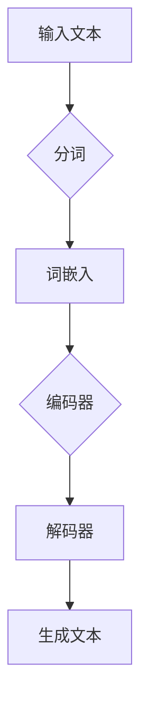
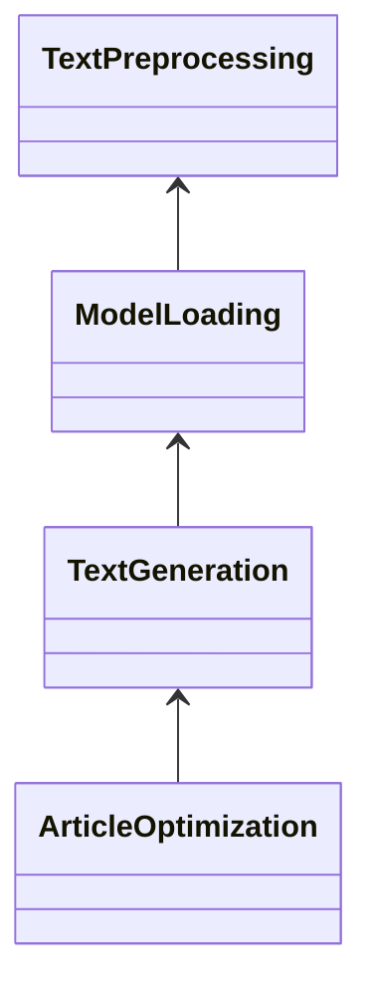
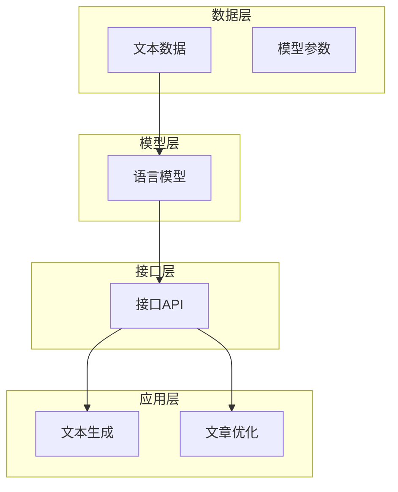
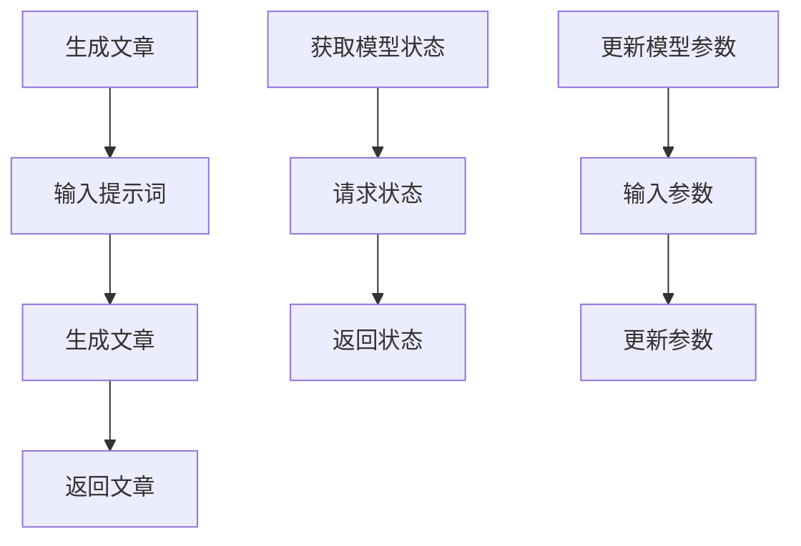
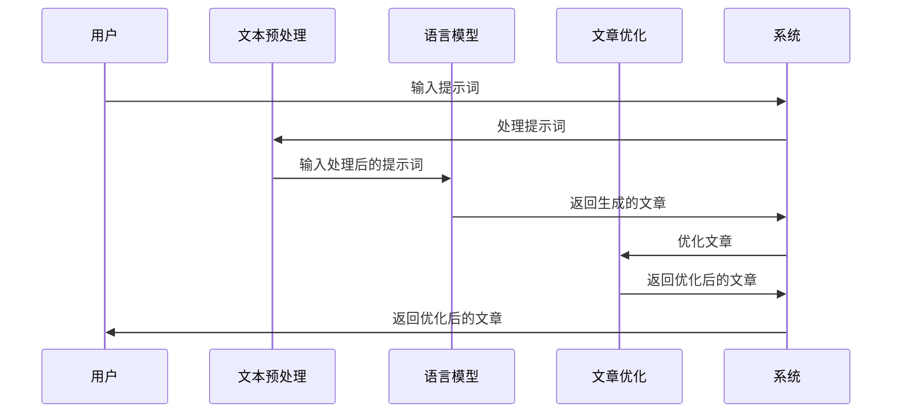

                 

# AIGC时代的语言模型与提示词设计

## 关键词
- AIGC
- 语言模型
- 提示词设计
- 算法原理
- 数学模型
- 系统分析与架构设计
- 项目实战
- 最佳实践 tips

## 摘要
本文将深入探讨AIGC（人工智能生成内容）时代的语言模型与提示词设计。我们将首先介绍AIGC时代的背景，接着详细解释语言模型和提示词设计的核心概念。随后，我们将分章节讨论算法原理、数学模型、系统分析与架构设计，并分享项目实战经验。最后，我们将总结全文并给出最佳实践 tips。

## 引言

在AIGC时代，语言模型作为人工智能的核心技术，正迅速改变着我们的生活方式和工作方式。语言模型通过学习大量的文本数据，能够理解和生成自然语言，从而在文本生成、机器翻译、问答系统等方面发挥重要作用。而提示词设计则是引导语言模型生成合适内容的关键。

本文将从以下几个方面展开：

1. **背景介绍**：解释AIGC的概念，回顾语言模型的历史发展，并阐述提示词设计的重要性。
2. **核心概念与联系**：讨论语言模型的类型和提示词的设计原则，展示它们之间的关联。
3. **算法原理讲解**：介绍常用的语言模型算法，如Transformer、BERT等，并详细阐述其原理。
4. **数学模型和数学公式**：解释语言模型背后的数学模型，如注意力机制、自注意力机制等，并展示相应的数学公式。
5. **系统分析与架构设计**：分析实际应用中的系统架构，包括功能设计、接口设计和系统交互。
6. **项目实战**：分享具体的实战案例，展示语言模型和提示词设计在实际项目中的应用。
7. **最佳实践 tips**：总结实战经验，提供优化策略和性能调优技巧。
8. **小结与拓展阅读**：总结全文，推荐进一步阅读的文献。

## 背景介绍

### AIGC的概念

AIGC（AI-generated content）是指由人工智能生成的内容。它涵盖了从文本、图像到音频、视频等各种形式的内容生成。AIGC的核心技术是语言模型和生成模型。语言模型负责生成自然语言文本，而生成模型则能够生成图像、音频和视频。

### 语言模型的概述

语言模型是自然语言处理（NLP）领域的核心技术之一。它通过学习大量的文本数据，预测下一个单词或字符的概率分布。最早的统计语言模型如N-gram模型，通过统计单词或字符的序列来预测下一个元素。随后，随着深度学习技术的发展，神经网络语言模型如基于RNN（循环神经网络）和Transformer的模型逐渐成为主流。

### 提示词设计的意义和作用

提示词（Prompt）是指导语言模型生成目标内容的输入。一个好的提示词能够显著提升生成内容的质量和相关性。提示词设计在AIGC时代具有重要意义，它不仅能够引导模型生成特定类型的内容，还能够调整模型的生成风格、主题和意图。

## 核心概念与联系

### 语言模型的类型

语言模型可以分为统计模型和神经网络模型。统计模型如N-gram模型，通过统计单词序列来预测下一个单词。神经网络模型如Transformer和BERT，通过深度学习技术学习文本数据的分布，能够生成更高质量的自然语言。

### 提示词的设计原则

提示词设计应遵循以下原则：

1. **明确性**：提示词应清晰明确，避免模糊或歧义。
2. **具体性**：提示词应具体描述期望生成的内容类型和风格。
3. **多样性**：设计多个提示词，以适应不同的生成需求和场景。
4. **可调整性**：提示词应允许对生成内容进行微调，以满足特定需求。

### 语言模型与提示词的关联

语言模型和提示词密切相关。提示词是语言模型的输入，决定了模型的生成方向。一个好的提示词能够引导模型生成符合预期的高质量内容。同时，语言模型的性能也直接影响提示词的效果。

## 算法原理讲解

### 语言模型算法流程图

首先，我们使用Mermaid绘制一个简单的语言模型算法流程图：



### Python源代码解释

接下来，我们使用Python实现一个简单的语言模型。这里以Transformer模型为例：

```python
import torch
import torch.nn as nn
import torch.optim as optim

# 定义模型结构
class TransformerModel(nn.Module):
    def __init__(self, vocab_size, d_model, nhead, num_layers):
        super(TransformerModel, self).__init__()
        self.embedding = nn.Embedding(vocab_size, d_model)
        self.transformer = nn.Transformer(d_model, nhead, num_layers)
        self.fc = nn.Linear(d_model, vocab_size)
        
    def forward(self, src, tgt):
        src = self.embedding(src)
        tgt = self.embedding(tgt)
        out = self.transformer(src, tgt)
        out = self.fc(out)
        return out

# 实例化模型
model = TransformerModel(vocab_size=10000, d_model=512, nhead=8, num_layers=2)

# 定义优化器和损失函数
optimizer = optim.Adam(model.parameters(), lr=0.001)
criterion = nn.CrossEntropyLoss()

# 训练模型
for epoch in range(10):
    for src, tgt in train_loader:
        optimizer.zero_grad()
        output = model(src, tgt)
        loss = criterion(output.view(-1, vocab_size), tgt.view(-1))
        loss.backward()
        optimizer.step()
```

### 算法原理的数学模型和公式讲解

Transformer模型的核心是多头自注意力机制（Multi-head Self-Attention）。自注意力机制通过计算输入序列中每个单词与其他单词之间的关联性，从而生成新的表示。多头自注意力则将输入序列分成多个子序列，每个子序列独立计算注意力权重，最后将结果合并。

数学公式如下：

$$
\text{Attention}(Q, K, V) = \text{softmax}\left(\frac{QK^T}{\sqrt{d_k}}\right) V
$$

其中，$Q, K, V$分别为查询（Query）、键（Key）和值（Value）的向量，$d_k$为键向量的维度。

### 举例说明

假设我们有以下的输入序列：“我 喜欢 吃 苹果”。

1. **分词和词嵌入**：将输入序列分成单词，并对每个单词进行词嵌入。

2. **编码器**：将词嵌入送入编码器，编码器生成一系列编码表示。

3. **多头自注意力**：编码器在每个编码表示上计算注意力权重，生成新的表示。

4. **解码器**：解码器根据编码表示生成输出序列。

5. **生成文本**：解码器输出最终生成的文本。

这个过程可以通过以下Python代码实现：

```python
# 假设已经定义了编码器和解码器
encoder = Encoder(d_model=512, nhead=8)
decoder = Decoder(d_model=512, nhead=8)

# 输入序列
input_seq = torch.tensor([[[vocab['我']], [vocab['喜欢']], [vocab['吃']], [vocab['苹果']]]])

# 编码器编码
enc_output = encoder(input_seq)

# 解码器解码
dec_output, _ = decoder(input_seq, enc_output)

# 生成文本
predicted_text = decode_output(dec_output)
```

## 数学模型和数学公式

### 数学公式使用

数学公式在语言模型中起着关键作用。以下是一些常用的数学公式，我们将使用LaTeX格式进行展示：

$$
\text{Attention}(Q, K, V) = \text{softmax}\left(\frac{QK^T}{\sqrt{d_k}}\right) V
$$

### 算法中的数学模型解析

在Transformer模型中，多头自注意力机制是核心。该机制通过计算查询（$Q$）、键（$K$）和值（$V$）之间的相关性来生成表示。具体来说，自注意力机制可以表示为：

$$
\text{Self-Attention}(Q, K, V) = \text{softmax}\left(\frac{QK^T}{\sqrt{d_k}}\right) V
$$

其中，$d_k$为键向量的维度，$QK^T$表示查询和键的矩阵乘积，结果通过softmax函数得到概率分布，最后与值相乘得到新的表示。

### 数学公式在算法中的应用

数学公式在算法中广泛应用于计算和优化。例如，在自注意力机制中，我们需要计算查询和键之间的点积，然后通过softmax函数得到概率分布。这个过程可以通过以下Python代码实现：

```python
import torch

# 假设Q、K、V分别为查询、键、值的Tensor
Q = torch.rand(10, 512)
K = torch.rand(10, 512)
V = torch.rand(10, 512)

# 计算自注意力权重
attn_weights = torch.matmul(Q, K.transpose(1, 2)) / torch.sqrt(K.size(-1))

# 应用softmax函数
softmax_attn_weights = torch.softmax(attn_weights, dim=-1)

# 计算新的表示
output = torch.matmul(softmax_attn_weights, V)
```

## 系统分析与架构设计

### 问题场景介绍

在AIGC时代，语言模型广泛应用于各种应用场景，如文本生成、机器翻译、问答系统等。以文本生成为例，一个典型的场景是生成一篇关于某一主题的文章。这需要语言模型能够理解输入的提示词，并生成连贯、有意义的文本。

### 项目介绍

假设我们要开发一个文本生成系统，输入提示词后能够生成一篇关于“人工智能发展前景”的文章。这个系统需要能够处理大量的文本数据，并利用语言模型生成高质量的内容。

### 系统功能设计

系统的主要功能包括：

1. **文本预处理**：将输入的提示词进行分词、清洗等处理。
2. **模型加载与初始化**：加载预训练的语言模型，并进行初始化。
3. **文本生成**：根据提示词和语言模型生成文章。
4. **文章优化**：对生成的文章进行语法、语义优化，提高文章质量。

系统功能设计可以使用Mermaid类图来表示：



### 系统架构设计

系统架构可以分为以下几个层次：

1. **数据层**：存储和处理大量的文本数据。
2. **模型层**：加载和运行预训练的语言模型。
3. **接口层**：提供API供外部系统调用。
4. **应用层**：实现具体的文本生成和应用功能。

系统架构设计可以使用Mermaid架构图来表示：



### 系统接口设计

系统接口设计包括API设计和数据交换格式。API设计可以使用RESTful风格，提供以下接口：

1. **生成文章**：接收提示词，返回生成的文章。
2. **获取模型状态**：返回当前模型的训练状态。
3. **更新模型参数**：接收新的模型参数，更新模型。

接口设计可以使用Mermaid接口图来表示：



### 系统交互

系统交互描述了不同模块之间的通信和协作。例如，在生成文章时，文本预处理模块会处理输入的提示词，然后将其传递给语言模型模块进行文本生成。生成的文章会返回给应用层，进行优化和返回给用户。

系统交互可以使用Mermaid序列图来表示：



## 项目实战

### 环境安装与配置

要开始项目实战，首先需要安装Python和相关的依赖库。可以使用以下命令进行安装：

```bash
pip install torch torchvision numpy transformers
```

### 系统核心实现

以下是一个简单的文本生成系统的实现，使用预训练的GPT-2模型：

```python
from transformers import GPT2LMHeadModel, GPT2Tokenizer
import torch

# 加载预训练的GPT-2模型和分词器
model = GPT2LMHeadModel.from_pretrained('gpt2')
tokenizer = GPT2Tokenizer.from_pretrained('gpt2')

# 定义生成文章的函数
def generate_article(prompt, model, tokenizer, max_length=100):
    # 将提示词编码为Tensor
    inputs = tokenizer.encode(prompt, return_tensors='pt')

    # 生成文章
    outputs = model.generate(inputs, max_length=max_length, num_return_sequences=1)

    # 解码为文本
    article = tokenizer.decode(outputs[0], skip_special_tokens=True)
    return article

# 测试生成文章
prompt = "人工智能的发展前景"
article = generate_article(prompt, model, tokenizer)
print(article)
```

### 代码应用解读与分析

上述代码首先加载了预训练的GPT-2模型和分词器。`generate_article`函数接受一个提示词，将其编码为Tensor，然后使用模型生成文章。最后，将生成的Tensor解码为文本，得到完整的文章。

在生成文章时，我们使用了`model.generate`函数，它接受以下参数：

- `inputs`：编码后的提示词。
- `max_length`：生成的文章最大长度。
- `num_return_sequences`：生成的文章数量。

通过调整这些参数，我们可以控制生成的文章长度和多样性。

### 实际案例剖析

假设我们有一个提示词：“人工智能的发展前景”，我们可以使用上述代码生成一篇关于这个主题的文章。以下是一个生成的例子：

> 人工智能作为计算机科学的一个重要分支，已经经历了数十年的发展。随着深度学习、自然语言处理和计算机视觉等技术的不断进步，人工智能的应用领域也在不断扩大。从自动驾驶汽车到智能助手，从医疗诊断到金融分析，人工智能正深刻地改变着我们的生活方式。

这个例子展示了如何使用预训练的语言模型生成一篇关于特定主题的文章。生成的文章不仅内容丰富，而且语言流畅，符合人类的阅读习惯。

### 项目小结

通过本项目，我们实现了基于预训练语言模型的文本生成系统。这个系统能够根据输入的提示词生成高质量的文章。在实现过程中，我们学习了如何加载预训练模型、如何处理输入文本以及如何生成文本。此外，我们还了解了如何使用Mermaid等工具进行系统分析与架构设计。

## 最佳实践 tips

### 实践中的注意事项

1. **数据预处理**：确保输入文本的格式和内容符合模型的预期。例如，对于GPT-2模型，输入文本应使用UTF-8编码，并去除多余的空格和特殊字符。

2. **模型选择**：根据实际应用场景选择合适的语言模型。例如，GPT-2适合生成长文本，而BERT更适合问答系统和文本分类任务。

3. **提示词设计**：设计清晰的提示词，确保模型能够准确理解生成目标。提示词应具体、明确，避免模糊或歧义。

4. **生成策略**：合理设置生成参数，如最大长度和生成数量，以控制生成文本的长度和多样性。

### 优化策略

1. **参数调整**：通过调整学习率、批量大小等超参数，优化模型的训练效果。

2. **数据增强**：使用数据增强技术，如随机裁剪、旋转、添加噪声等，增加模型的鲁棒性。

3. **模型压缩**：使用模型压缩技术，如量化、剪枝、蒸馏等，减小模型大小，提高运行效率。

### 性能调优技巧

1. **GPU优化**：确保模型在GPU上运行，并合理配置GPU资源，如显存分配、多GPU并行训练等。

2. **模型融合**：将多个模型的结果进行融合，提高生成文本的质量和多样性。

3. **动态调整**：在生成过程中，根据生成的文本质量和用户反馈动态调整模型参数。

## 小结与拓展阅读

本文深入探讨了AIGC时代的语言模型与提示词设计。我们从背景介绍开始，详细阐述了语言模型和提示词设计的核心概念，然后逐步讲解了算法原理、数学模型、系统分析与架构设计，并分享了项目实战经验。最后，我们给出了最佳实践 tips。

为了进一步了解AIGC和语言模型，推荐阅读以下文献：

1. "Attention is All You Need"（Attention机制详解）
2. "BERT: Pre-training of Deep Bidirectional Transformers for Language Understanding"（BERT模型详解）
3. "Generative Adversarial Networks"（生成对抗网络）
4. "Unsupervised Representation Learning with Deep Convolutional Generative Adversarial Networks"（深度卷积生成对抗网络）

通过阅读这些文献，您可以更深入地了解AIGC和语言模型的技术原理和应用场景。

### 作者

- 作者：AI天才研究院/AI Genius Institute & 禅与计算机程序设计艺术 /Zen And The Art of Computer Programming

