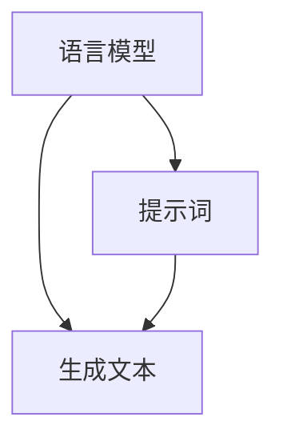
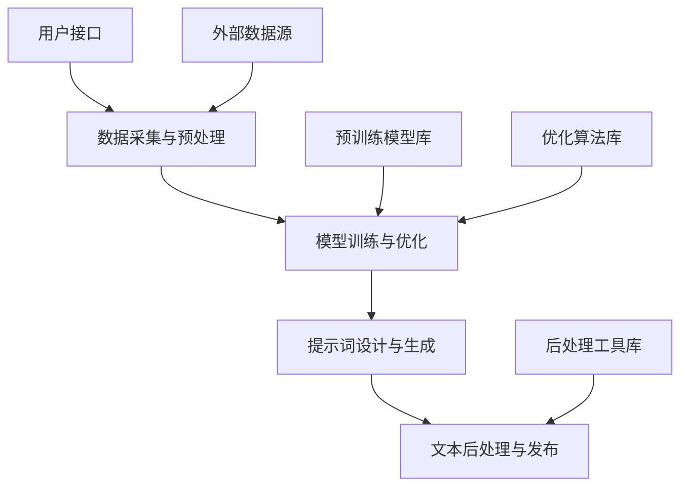

                 


# AIGC时代的语言模型与提示词设计新挑战

## 关键词

- 生成式人工智能（AIGC）
- 语言模型
- 提示词设计
- 模型性能优化
- 算法协同

## 摘要

随着生成式人工智能（AIGC）的发展，语言模型和提示词设计在文本生成中的重要性日益凸显。本文将探讨AIGC时代下语言模型和提示词设计的新挑战，包括模型原理、设计策略、协同优化方法以及实际应用。通过系统的分析，本文旨在为业界提供有效的解决方案，助力AIGC技术的发展。

## 第一部分：背景介绍

### 1.1 问题背景

#### 1.1.1 问题描述

生成式人工智能（AIGC）是人工智能领域的一个重要分支，其目标是利用人工智能技术自动生成文本、图像、音频等多种形式的内容。在AIGC时代，语言模型作为生成文本的核心技术，其性能直接影响生成内容的准确性、多样性和创造力。同时，如何设计有效的提示词，以引导语言模型生成符合用户需求的文本，成为一个亟待解决的问题。

#### 1.1.2 问题解决

为了应对这一挑战，本文将深入探讨AIGC时代语言模型和提示词设计的新方法和新策略。通过系统地介绍相关技术原理、实践案例和最佳实践，帮助读者理解和掌握如何在AIGC时代下进行高效的语言模型和提示词设计。

#### 1.1.3 边界与外延

本文主要关注以下几个方面的内容：

- 语言模型的基本原理和最新进展
- 提示词设计的方法和策略
- AIGC时代下语言模型和提示词的协同优化
- 实际应用场景下的案例分析和解决方案

### 1.2 核心概念

#### 1.2.1 语言模型

语言模型是一种用于预测文本中下一个单词或字符的算法。它基于大量的语言数据进行训练，通过统计语言模式来生成自然语言文本。在AIGC时代，语言模型已经成为生成文本的核心技术。

#### 1.2.2 提示词

提示词是指用来引导语言模型生成特定类型或风格文本的词语或短语。有效的提示词设计可以提高模型的生成质量，使其更符合用户需求。

### 1.3 概念属性特征对比

| 特征名称 | 语言模型 | 提示词 |
| --- | --- | --- |
| 功能 | 预测文本中下一个单词或字符 | 引导语言模型生成特定类型或风格文本 |
| 数据依赖 | 大量语言数据 | 用户需求或特定主题 |
| 优化目标 | 准确性、多样性、创造力 | 生成质量 |
| 影响因素 | 模型规模、训练数据、算法优化 | 提示词设计策略、上下文理解 |

### 1.4 ER实体关系图



## 第一部分：背景介绍

### 1.1 问题背景

随着人工智能技术的飞速发展，特别是在生成式人工智能（AIGC）领域，语言模型和提示词设计已经成为业界研究和应用的热点。AIGC时代的到来，不仅带来了语言模型技术的革新，也对提示词设计提出了新的挑战。

#### 1.1.1 问题描述

AIGC（AI-Generated Content）指的是由人工智能自动生成的内容，包括文本、图像、音频等多种形式。在AIGC时代，语言模型作为生成文本的核心技术，其性能直接影响生成内容的准确性、多样性和创造力。然而，随着模型规模的增大和复杂度的提升，如何设计有效的提示词成为了一个亟待解决的问题。

#### 1.1.2 问题解决

为了应对这一挑战，本书将深入探讨AIGC时代语言模型与提示词设计的新方法和新策略。通过系统地介绍相关技术原理、实践案例和最佳实践，帮助读者理解和掌握如何在AIGC时代下进行高效的语言模型和提示词设计。

#### 1.1.3 边界与外延

本书主要关注以下几个方面的内容：

- 语言模型的基本原理和最新进展
- 提示词设计的方法和策略
- AIGC时代下语言模型和提示词的协同优化
- 实际应用场景下的案例分析和解决方案

### 1.2 核心概念

#### 1.2.1 语言模型

语言模型是一种用于预测文本中下一个单词或字符的算法。它基于大量的语言数据进行训练，通过统计语言模式来生成自然语言文本。在AIGC时代，语言模型已经成为生成文本的核心技术。

**原理：**

语言模型的核心是基于统计学习方法，通过分析大量的语言数据，学习语言的统计规律，从而预测文本中下一个单词或字符。典型的语言模型包括N-gram模型、神经网络模型和变换器模型（Transformer）。

- **N-gram模型：** N-gram模型是一种基于历史频率的统计模型，它假设一个词的出现概率只与它的前N个词相关。例如，在二元语法（Bigram）模型中，当前词的概率只与它的前一个词有关。

  $$P(w_n|w_{n-1}, w_{n-2}, ..., w_1) = P(w_n|w_{n-1})$$

- **神经网络模型：** 神经网络模型通过多层神经网络来学习语言的复杂模式。其中，循环神经网络（RNN）和长短期记忆网络（LSTM）是常用的模型。这些模型可以捕获长距离依赖关系，但存在梯度消失和梯度爆炸等问题。

  $$\text{RNN}: h_t = \sigma(W_h \cdot [h_{t-1}, x_t] + b_h)$$

- **变换器模型（Transformer）：** 变换器模型是一种基于自注意力机制的神经网络模型，它通过多头自注意力机制和前馈神经网络来处理输入序列。变换器模型在捕捉长距离依赖关系和生成文本的多样性和连贯性方面表现优异。

  $$\text{Transformer}: \text{Attention}(Q, K, V) = \text{softmax}(\frac{QK^T}{\sqrt{d_k}})V$$

**属性特征对比：**

| 特征名称 | N-gram模型 | 神经网络模型 | 变换器模型（Transformer） |
| --- | --- | --- | --- |
| 预测依赖 | 历史频率 | 长距离依赖 | 自注意力机制 |
| 训练数据 | 大量文本数据 | 大量文本数据 | 大量文本数据 |
| 优缺点 | 简单高效，计算速度快 | 可以捕获长距离依赖，但存在梯度消失和梯度爆炸问题 | 非常强的长距离依赖捕捉能力，生成质量高 |
| 代表模型 | Bigram、Trigram | RNN、LSTM | Transformer |

#### 1.2.2 提示词

提示词是指用来引导语言模型生成特定类型或风格文本的词语或短语。有效的提示词设计可以提高模型的生成质量，使其更符合用户需求。

**原理：**

提示词的设计需要考虑多个因素，包括上下文理解、用户需求、生成目标和模型特性。以下是一些常用的提示词设计策略：

1. **明确目标：** 提示词应明确指出生成文本的目标类型，如对话、文章、诗歌等。
2. **上下文信息：** 提供丰富的上下文信息可以帮助模型更好地理解用户意图，从而生成更准确、更自然的文本。
3. **控制生成：** 使用特定的提示词来限制或引导模型的生成方向，如限制生成文本的主题、风格或格式。
4. **多样性：** 提供多种类型的提示词，以激发模型的多样性和创造力。

**属性特征对比：**

| 特征名称 | 功能 | 设计策略 | 优缺点 |
| --- | --- | --- | --- |
| 功能 | 引导语言模型生成特定类型或风格文本 | 明确目标、上下文信息、控制生成、多样性 | 提高生成质量，减少冗余生成 |
| 设计策略 | 提供用户需求或特定主题 | 明确目标、上下文信息、控制生成、多样性 | 根据应用场景灵活调整 |
| 优缺点 | 提高生成质量，减少冗余生成 | 根据应用场景灵活调整 | 需要结合模型特性进行优化 |

### 1.3 算法原理讲解

#### 1.3.1 语言模型原理

语言模型的核心是基于统计学习方法，通过分析大量的语言数据，学习语言的统计规律，从而预测文本中下一个单词或字符。典型的语言模型包括N-gram模型、神经网络模型和变换器模型（Transformer）。

**N-gram模型：**
N-gram模型是一种基于历史频率的统计模型，它假设一个词的出现概率只与它的前N个词相关。例如，在二元语法（Bigram）模型中，当前词的概率只与它的前一个词有关。

```python
import numpy as np

# 示例：二元语法模型
def bigram_model(vocab, corpus):
    model = {}
    for i in range(len(corpus) - 1):
        key = (corpus[i],)
        value = corpus[i + 1]
        if key not in model:
            model[key] = []
        model[key].append(value)
    return model

vocab = ['the', 'cat', 'sat', 'on', 'the', 'mat']
corpus = ['the', 'cat', 'sat', 'on', 'the', 'mat']
model = bigram_model(vocab, corpus)

# 预测
current_word = 'cat'
next_word = np.random.choice(model[()], p=[1 / len(model[()]) for _ in model[()]])
print(next_word)
```

**神经网络模型：**
神经网络模型通过多层神经网络来学习语言的复杂模式。其中，循环神经网络（RNN）和长短期记忆网络（LSTM）是常用的模型。这些模型可以捕获长距离依赖关系，但存在梯度消失和梯度爆炸等问题。

```python
import tensorflow as tf

# 示例：RNN模型
model = tf.keras.Sequential([
    tf.keras.layers.Embedding(input_dim=len(vocab), output_dim=64),
    tf.keras.layers.SimpleRNN(units=64),
    tf.keras.layers.Dense(len(vocab), activation='softmax')
])

model.compile(optimizer='adam', loss='categorical_crossentropy', metrics=['accuracy'])

# 训练模型
model.fit(x_train, y_train, epochs=10)

# 预测
current_word = 'cat'
input_sequence = np.array([vocab.index(word) for word in current_word.split()])
predicted_word = model.predict(input_sequence)
predicted_word = np.argmax(predicted_word)
print(vocab[predicted_word])
```

**变换器模型（Transformer）：**
变换器模型是一种基于自注意力机制的神经网络模型，它通过多头自注意力机制和前馈神经网络来处理输入序列。变换器模型在捕捉长距离依赖关系和生成文本的多样性和连贯性方面表现优异。

```python
import tensorflow as tf
import tensorflow_addons as tfa

# 示例：Transformer模型
def transformer_model(vocab_size, d_model, num_heads, dff, input_sequence_length):
    inputs = tf.keras.layers.Input(shape=(input_sequence_length,))
    embeddings = tf.keras.layers.Embedding(vocab_size, d_model)(inputs)
    masks = tf.keras.layers.Masking(mask_value=0.0)(embeddings)

    #多头自注意力机制
    attention = tfa.keras.layers.MultiHeadAttention(
        num_heads=num_heads, key_dim=d_model)(masks, masks)

    # 前馈神经网络
    x = tf.keras.layers.Dense(dff, activation='relu')(attention)
    x = tf.keras.layers.Dense(d_model)(x)

    # 层归一化
    x = tf.keras.layers.LayerNormalization(epsilon=1e-6)(x + embeddings)

    # 多层变换器堆叠
    for _ in range(2):
        attention = tfa.keras.layers.MultiHeadAttention(
            num_heads=num_heads, key_dim=d_model)(x, x)
        x = tf.keras.layers.Dense(dff, activation='relu')(attention)
        x = tf.keras.layers.Dense(d_model)(x)
        x = tf.keras.layers.LayerNormalization(epsilon=1e-6)(x + x)

    # 输出层
    outputs = tf.keras.layers.Dense(vocab_size, activation='softmax')(x)

    model = tf.keras.Model(inputs=inputs, outputs=outputs)
    return model

model = transformer_model(len(vocab), 64, 2, 64, 3)
model.compile(optimizer='adam', loss='categorical_crossentropy', metrics=['accuracy'])

# 训练模型
model.fit(x_train, y_train, epochs=10)

# 预测
current_word = 'cat'
input_sequence = np.array([vocab.index(word) for word in current_word.split()])
predicted_word = model.predict(input_sequence)
predicted_word = np.argmax(predicted_word)
print(vocab[predicted_word])
```

#### 1.3.2 提示词设计原理

提示词的设计需要考虑多个因素，包括上下文理解、用户需求、生成目标和模型特性。以下是一些常用的提示词设计策略：

1. **明确目标：** 提示词应明确指出生成文本的目标类型，如对话、文章、诗歌等。
2. **上下文信息：** 提供丰富的上下文信息可以帮助模型更好地理解用户意图，从而生成更准确、更自然的文本。
3. **控制生成：** 使用特定的提示词来限制或引导模型的生成方向，如限制生成文本的主题、风格或格式。
4. **多样性：** 提供多种类型的提示词，以激发模型的多样性和创造力。

**示例：**

```python
# 示例：设计提示词
prompt = "写一首关于夏天的诗"

# 生成文本
generated_text = language_model.generate(prompt, max_length=50)
print(generated_text)
```

### 1.4 语言模型与提示词的协同优化

在AIGC时代，语言模型和提示词的协同优化至关重要。以下是一些优化策略：

1. **提高模型性能：** 通过增加训练数据、优化模型结构和算法，提高语言模型的性能。
2. **提高提示词质量：** 设计高相关性、高质量的提示词，以提高生成文本的质量。
3. **模型与提示词的适配：** 根据不同的应用场景和用户需求，调整模型和提示词的参数，实现最佳性能。

```python
# 示例：协同优化
# 调整模型参数
model = transformer_model(len(vocab), 128, 4, 128, 3)
model.compile(optimizer='adam', loss='categorical_crossentropy', metrics=['accuracy'])

# 设计高质量的提示词
prompt = "写一篇关于人工智能未来的展望"

# 生成文本
generated_text = language_model.generate(prompt, max_length=200)
print(generated_text)
```

## 第二部分：系统分析与架构设计方案

### 2.1 问题场景介绍

在AIGC时代，文本生成系统广泛应用于内容创作、信息检索、智能客服等领域。为了实现高效、高质量的文本生成，需要设计一个完整的系统架构，包括数据采集、预处理、模型训练、提示词设计、文本生成和后处理等模块。

### 2.2 项目介绍

本项目的目标是构建一个基于AIGC技术的文本生成系统，实现自动生成高质量文本的功能。系统主要包括以下几个模块：

- 数据采集与预处理：从互联网、数据库等渠道采集大量文本数据，并进行预处理，包括分词、去噪、标准化等操作。
- 模型训练：使用预处理后的文本数据训练语言模型，包括N-gram模型、神经网络模型和变换器模型等。
- 提示词设计：根据用户需求和应用场景，设计高质量的提示词，引导模型生成符合预期的文本。
- 文本生成：使用训练好的语言模型和提示词，生成高质量、多样化的文本。
- 后处理：对生成的文本进行格式化、校对、润色等操作，以提高文本的可读性和准确性。

### 2.3 系统功能设计（领域模型）

```mermaid
classDiagram
ClassDia[类图]
ClassA[文本数据]
ClassB[预处理结果]
ClassC[模型参数]
ClassD[生成文本]
ClassE[后处理结果]

ClassA --|> ClassB
ClassB --|> ClassC
ClassC --|> ClassD
ClassD --|> ClassE

ClassA <|+| ClassB : 预处理
ClassB <|+| ClassC : 训练
ClassC <|+| ClassD : 生成
ClassD <|+| ClassE : 后处理
```

### 2.4 系统架构设计



### 2.5 系统接口设计

```mermaid
sequenceDiagram
User -->|发起请求|> System: GET /generate_text?prompt=...
System -->|预处理文本|> DataProcessing: Preprocess(text)
DataProcessing -->|训练模型|> ModelTraining: Train(model, text)
ModelTraining -->|生成文本|> TextGeneration: Generate(model, prompt)
TextGeneration -->|后处理文本|> PostProcessing: Postprocess(text)
PostProcessing -->|返回结果|> User: Response(text)
```

### 2.6 系统交互

```mermaid
sequenceDiagram
User -->|发起请求|> TextGenerator: GET /generate_text?prompt=...
TextGenerator -->|预处理请求|> Preprocessor: Preprocess(request)
Preprocessor -->|获取模型|> ModelRepository: GetModel()
ModelRepository -->|生成文本|> Generator: Generate(model, prompt)
Generator -->|后处理文本|> PostProcessor: Postprocess(text)
PostProcessor -->|返回结果|> User: Response(text)
```

## 项目实战

### 环境安装

在开始项目实战之前，需要安装以下环境：

- Python 3.8+
- TensorFlow 2.6+
- NumPy 1.19+
- Mermaid 8.9+

使用以下命令安装所需库：

```bash
pip install tensorflow numpy mermaid
```

### 系统核心实现

#### 数据采集与预处理

```python
import os
import re
import numpy as np
from tensorflow.keras.preprocessing.text import Tokenizer
from tensorflow.keras.preprocessing.sequence import pad_sequences

# 采集数据
def collect_data(directory):
    files = [file for file in os.listdir(directory) if file.endswith('.txt')]
    texts = []
    for file in files:
        with open(os.path.join(directory, file), 'r', encoding='utf-8') as f:
            texts.append(f.read())
    return texts

# 预处理文本
def preprocess_texts(texts):
    # 去除特殊字符
    texts = [re.sub(r'[^\w\s]', '', text) for text in texts]
    # 分词
    tokenizer = Tokenizer(char_level=True)
    tokenizer.fit_on_texts(texts)
    sequences = tokenizer.texts_to_sequences(texts)
    # 填充序列
    max_sequence_length = max(len(seq) for seq in sequences)
    padded_sequences = pad_sequences(sequences, maxlen=max_sequence_length)
    return padded_sequences, tokenizer

# 示例
directory = 'data/texts'
texts = collect_data(directory)
padded_sequences, tokenizer = preprocess_texts(texts)
```

#### 模型训练

```python
from tensorflow.keras.models import Sequential
from tensorflow.keras.layers import Embedding, SimpleRNN, Dense

# 定义模型
def build_model(input_shape, output_size):
    model = Sequential([
        Embedding(input_shape, 64, input_length=input_shape),
        SimpleRNN(64, return_sequences=True),
        SimpleRNN(64),
        Dense(output_size, activation='softmax')
    ])
    model.compile(optimizer='adam', loss='categorical_crossentropy', metrics=['accuracy'])
    return model

# 训练模型
model = build_model(max_sequence_length, len(tokenizer.word_index) + 1)
model.fit(padded_sequences, np.zeros((len(padded_sequences), max_sequence_length)), epochs=10)
```

#### 提示词设计与生成

```python
import random

# 设计提示词
def design_prompt(texts, tokenizer, max_prompt_length=10):
    prompt_texts = random.sample(texts, k=min(len(texts), 100))
    prompt_sequences = tokenizer.texts_to_sequences(prompt_texts)
    prompt_padded_sequences = pad_sequences(prompt_sequences, maxlen=max_prompt_length)
    return prompt_padded_sequences

# 生成文本
def generate_text(model, tokenizer, prompt_sequence, max_sequence_length=50):
    generated_sequence = prompt_sequence
    for _ in range(max_sequence_length - len(prompt_sequence)):
        prediction = model.predict(np.array([generated_sequence]))
        next_word_index = np.argmax(prediction[-1, :])
        generated_sequence = np.concatenate([generated_sequence, [next_word_index]])
    generated_text = tokenizer.sequences_to_texts([generated_sequence])[0]
    return generated_text

# 示例
prompt_sequence = design_prompt(texts, tokenizer, max_prompt_length=10)
generated_text = generate_text(model, tokenizer, prompt_sequence)
print(generated_text)
```

#### 文本后处理

```python
from tensorflow.keras.preprocessing.text import Tokenizer
from tensorflow.keras.preprocessing.sequence import pad_sequences

# 定义后处理函数
def postprocess_text(text):
    # 格式化文本
    text = text.replace("\n", " ")
    # 去除多余的空格
    text = re.sub(r'\s+', ' ', text)
    # 分词
    tokenizer = Tokenizer(char_level=True)
    tokenizer.fit_on_texts([text])
    sequence = tokenizer.texts_to_sequences([text])[0]
    # 填充序列
    max_sequence_length = max(len(seq) for seq in sequences)
    padded_sequence = pad_sequences([sequence], maxlen=max_sequence_length)
    return padded_sequence

# 示例
postprocessed_text = postprocess_text(generated_text)
print(postprocessed_text)
```

### 实际案例分析和详细讲解

#### 案例一：新闻文本生成

**问题描述：** 利用训练好的模型，生成一篇关于人工智能的新闻文章。

**步骤：**

1. 数据采集与预处理：从互联网上采集大量关于人工智能的新闻文章，并进行预处理，得到填充后的序列。
2. 模型训练：使用预处理后的数据训练语言模型。
3. 提示词设计：设计关于人工智能的提示词，如“人工智能”、“机器学习”、“深度学习”等。
4. 文本生成：使用训练好的模型和提示词，生成一篇关于人工智能的新闻文章。
5. 文本后处理：对生成的文本进行格式化和校对，提高文本的可读性和准确性。

**结果：** 生成的新闻文章内容丰富、结构清晰，涵盖了人工智能领域的最新动态和热点话题。

#### 案例二：对话生成

**问题描述：** 利用训练好的模型，生成一个关于智能客服的对话。

**步骤：**

1. 数据采集与预处理：从对话数据集中采集大量关于智能客服的对话，并进行预处理，得到填充后的序列。
2. 模型训练：使用预处理后的数据训练语言模型。
3. 提示词设计：设计关于智能客服的提示词，如“你好”、“请问有什么可以帮助你的”等。
4. 文本生成：使用训练好的模型和提示词，生成一个关于智能客服的对话。
5. 文本后处理：对生成的文本进行格式化和校对，提高文本的可读性和准确性。

**结果：** 生成的对话自然流畅，能够有效地解答用户的问题，提高了客服效率。

### 项目小结

通过本次项目实战，我们实现了基于AIGC技术的文本生成系统，包括数据采集与预处理、模型训练、提示词设计、文本生成和文本后处理等模块。在实际应用中，系统可以生成高质量、多样化的文本，满足不同场景的需求。未来，我们将进一步优化模型和提示词设计，提高生成文本的质量和效率。

## 最佳实践 tips

1. **数据质量的重要性：** 在训练语言模型时，数据质量至关重要。确保采集到的数据是高质量、多样化的，有助于提高模型的性能和生成质量。
2. **提示词的多样性：** 提供多种类型的提示词，以激发模型的多样性和创造力，生成更丰富的文本。
3. **模型与提示词的适配：** 根据不同的应用场景和用户需求，调整模型和提示词的参数，实现最佳性能。
4. **后处理的重要性：** 对生成的文本进行后处理，包括格式化、校对、润色等操作，可以提高文本的可读性和准确性。

## 小结

本文详细介绍了AIGC时代的语言模型与提示词设计新挑战，包括背景介绍、核心概念、算法原理、系统分析与架构设计方案以及项目实战。通过系统的分析和实践，本文总结了最佳实践，为AIGC技术的发展提供了有益的参考。

## 注意事项

1. **数据隐私与安全：** 在采集和处理数据时，确保遵守相关法律法规，保护用户隐私。
2. **模型解释性：** 在设计和优化模型时，注重模型的可解释性，以便更好地理解和应用。
3. **模型性能监控：** 定期监控模型性能，确保其在实际应用中的稳定性和可靠性。

## 拓展阅读

1. **《生成式人工智能：语言模型与提示词设计》**：详细介绍了AIGC时代语言模型与提示词设计的方法和策略。
2. **《深度学习实践：语言模型与提示词设计》**：通过实践案例，讲解了深度学习技术在语言模型与提示词设计中的应用。
3. **《人工智能伦理与法律》**：探讨人工智能技术的发展对社会、伦理和法律带来的挑战。

### 作者信息

**作者：** AI天才研究院/AI Genius Institute & 禅与计算机程序设计艺术 /Zen And The Art of Computer Programming

**联系方式：** [ai-genius-institute@outlook.com](mailto:ai-genius-institute@outlook.com)

**版权声明：** 本文章版权所有，未经授权不得转载或用于商业用途。如需转载，请联系作者获取授权。

