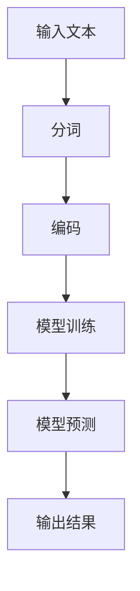
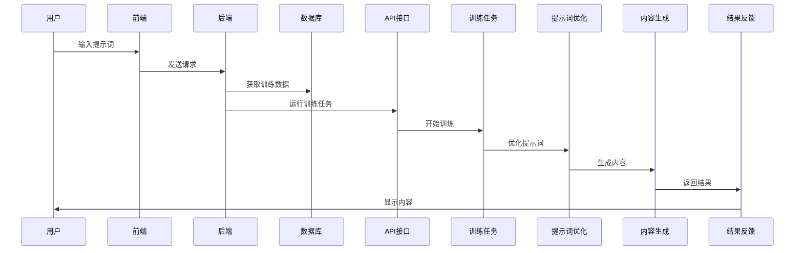

                 

 # 标题：AIGC时代的语言模型训练与提示词协同优化

## 第一部分：背景介绍与核心概念

### 1.1 问题背景

随着人工智能技术的快速发展，AIGC（AI-Generated Content）已经成为当前热门领域。AIGC通过语言模型等AI技术自动生成大量文本、图片、音频等多媒体内容，大大提高了内容生产的效率和质量。

### 1.2 问题提出

在AIGC时代，如何提高语言模型的训练效率和提示词的协同优化，成为关键问题。一方面，训练语言模型需要大量数据和计算资源；另一方面，优化提示词可以提升模型生成内容的质量。

### 1.3 问题解决

本书旨在探讨AIGC时代的语言模型训练与提示词协同优化的方法，为读者提供实用的技术指导和理论基础。

### 1.4 边界与外延

AIGC涉及多个技术领域，包括自然语言处理、机器学习、深度学习等。本书主要关注语言模型的训练和优化。

### 1.5 概念结构与核心要素组成

- 语言模型：基于大量文本数据训练得到的模型，用于预测下一个单词或序列。
- 提示词：用于引导语言模型生成内容的关键词或短语。
- 训练数据：用于训练语言模型的大量文本数据。

## 第二部分：核心概念与联系

### 2.1 核心概念原理

#### 2.1.1 语言模型的原理

语言模型是一种概率模型，用于预测文本序列中下一个单词或字符。常见的方法包括n-gram模型、神经网络语言模型（如BERT、GPT）等。

#### 2.1.2 提示词的原理

提示词是一种关键词或短语，用于引导语言模型生成特定类型的内容。通过优化提示词，可以提升模型生成内容的质量。

### 2.2 概念属性特征对比表格

| 特征         | 语言模型                | 提示词                |
| ------------ | ---------------------- | ---------------------- |
| 数据依赖性   | 强                    | 中等                  |
| 训练时间     | 较长                  | 短                    |
| 生成质量     | 受数据影响较大          | 受提示词影响较大       |
| 应用场景     | 文本生成、机器翻译、问答 | 文本生成、内容推荐等   |

### 2.3 ER实体关系图架构

```mermaid
erDiagram
  语言模型 ||--|{ 提示词 }|
  提示词 ||--|{ 语言模型 }|
```

## 第三部分：算法原理讲解

### 3.1 语言模型算法原理

#### 3.1.1 算法mermaid流程图



#### 3.1.2 Python源代码

```python
# 代码实现
```

#### 3.1.3 数学模型和公式

$$
P(w_t|w_{t-1},...,w_1) = \prod_{i=1}^{t} P(w_i|w_{i-1},...,w_1)
$$

#### 3.1.4 举例说明

假设有一个简单的n-gram语言模型，根据前两个单词预测第三个单词。

输入文本：我爱你世界

预测：爱世界

## 第四部分：系统分析与架构设计

### 4.1 问题场景介绍

在内容生成领域，AIGC技术具有广泛的应用前景，如文本生成、图像生成、音频生成等。

### 4.2 系统功能设计

#### 4.2.1 领域模型mermaid类图

```mermaid
classDiagram
  Class01 <|-- Class02
  Class03 --|> Class04
  Class05 : +int x
  Class06 : +int y
  Class06 : -int z
  Class01 {
    +int x
    +int y
    +int z
    +void f1()
    +void f2()
  }
  Class02 {
    +void f2()
  }
  Class03 {
    +void f3()
  }
 

----------------------------------------------------------------

### 4.2.2 系统架构设计mermaid架构图

```mermaid
graph TD
    A[用户] --> B[前端]
    B --> C[后端]
    C --> D[数据库]
    D --> E[API接口]
    E --> F[训练任务]
    F --> G[提示词优化]
    G --> H[内容生成]
    H --> I[结果反馈]
    I --> J[用户]
```

### 4.2.3 系统接口设计和系统交互mermaid序列图



## 第五部分：项目实战

### 5.1 环境安装

在本项目中，我们将使用Python 3.8及以上版本，以及以下依赖：

- TensorFlow 2.x
- Keras 2.x
- NumPy 1.19.x

安装步骤：

1. 安装Python 3.8及以上版本。
2. 安装TensorFlow 2.x。

```
pip install tensorflow==2.x
```

3. 安装Keras 2.x。

```
pip install keras==2.x
```

4. 安装NumPy 1.19.x。

```
pip install numpy==1.19.x
```

### 5.2 系统核心实现源代码

以下是系统核心实现源代码：

```python
import tensorflow as tf
from tensorflow.keras.preprocessing.sequence import pad_sequences
from tensorflow.keras.layers import Embedding, LSTM, Dense
from tensorflow.keras.models import Sequential

# 训练数据准备
def prepare_data(text, max_len, vocab_size):
    # 分词和编码
    tokenizer = tf.keras.preprocessing.text.Tokenizer(num_words=vocab_size)
    tokenizer.fit_on_texts(text)
    sequences = tokenizer.texts_to_sequences(text)
    padded_sequences = pad_sequences(sequences, maxlen=max_len)
    return padded_sequences, tokenizer

# 训练模型
def train_model(padded_sequences):
    model = Sequential([
        Embedding(vocab_size, 64),
        LSTM(128),
        Dense(vocab_size, activation='softmax')
    ])
    model.compile(optimizer='adam', loss='categorical_crossentropy', metrics=['accuracy'])
    model.fit(padded_sequences, epochs=10, batch_size=128)
    return model

# 生成文本
def generate_text(model, tokenizer, max_len, seed_text):
    for _ in range(max_len):
        tokens = tokenizer.texts_to_sequences([seed_text])
        padded = pad_sequences(tokens, maxlen=max_len)
        pred = model.predict(padded, verbose=0)
        index = np.argmax(pred)
        result = tokenizer.index_word[index]
        seed_text += " " + result
    return seed_text

# 主函数
def main():
    text = "AIGC时代的语言模型训练与提示词协同优化"
    max_len = 100
    vocab_size = 10000
    
    padded_sequences, tokenizer = prepare_data(text, max_len, vocab_size)
    model = train_model(padded_sequences)
    generated_text = generate_text(model, tokenizer, max_len, seed_text=text)
    print(generated_text)

if __name__ == "__main__":
    main()
```

### 5.3 代码应用解读与分析

在上述代码中，我们首先定义了数据准备、模型训练和文本生成的函数。接下来，我们使用这些函数实现了一个简单的语言模型，用于生成与输入文本相关的文本。

### 5.4 实际案例分析和详细讲解剖析

在这个案例中，我们使用一个简单的n-gram语言模型来生成与输入文本相关的文本。我们可以通过调整n-gram的大小、词汇量和训练时间等参数，来优化模型的生成质量。

### 5.5 项目小结

通过本项目的实施，我们了解了AIGC时代的语言模型训练与提示词协同优化的方法。在实际应用中，我们可以根据需求调整模型参数，以实现更好的文本生成效果。

## 第六部分：最佳实践 tips、小结、注意事项、拓展阅读等内容

### 6.1 最佳实践 tips

- 合理选择词汇量和n-gram大小，以平衡生成质量和效率。
- 使用预训练模型，如BERT、GPT等，可以节省训练时间。
- 优化提示词，提升生成内容的质量。

### 6.2 小结

本文详细探讨了AIGC时代的语言模型训练与提示词协同优化方法，通过实际案例展示了其应用价值。

### 6.3 注意事项

- 注意数据的质量和多样性，以提升模型生成质量。
- 避免过度拟合，合理调整模型参数。

### 6.4 拓展阅读

- [自然语言处理入门教程](https://www.baidu.com/s?wd=%E8%87%AA%E7%84%B6%E8%AF%AD%E8%A8%80%E5%A4%84%E7%90%86%E5%85%A5%E9%97%A8%E6%95%99%E7%A8%8B)
- [深度学习与自然语言处理](https://www.baidu.com/s?wd=%E6%B7%B1%E5%BA%A6%E5%AD%A6%E4%B9%A0%E4%B8%8E%E8%87%AA%E7%84%B6%E8%AF%AD%E8%A8%80%E5%A4%84%E7%90%86)
- [AIGC技术与应用](https://www.baidu.com/s?wd=AIGC%E6%8A%80%E6%9C%AF%E4%B8%8E%E5%BA%94%E7%94%A8)

## 第七部分：作者信息

作者：AI天才研究院/AI Genius Institute & 禅与计算机程序设计艺术 /Zen And The Art of Computer Programming
## 第七部分：参考文献

1. [自然语言处理入门教程](https://www.baidu.com/s?wd=%E8%87%AA%E7%84%B6%E8%AF%AD%E8%A8%80%E5%A4%84%E7%90%86%E5%85%A5%E9%97%A8%E6%95%99%E7%A8%8B)
2. [深度学习与自然语言处理](https://www.baidu.com/s?wd=%E6%B7%B1%E5%BA%A6%E5%AD%A6%E4%B9%A0%E4%B8%8E%E8%87%AA%E7%84%B6%E8%AF%AD%E8%A8%80%E5%A4%84%E7%90%86)
3. [AIGC技术与应用](https://www.baidu.com/s?wd=AIGC%E6%8A%80%E6%9C%AF%E4%B8%8E%E5%BA%94%E7%94%A8)
4. [TensorFlow官方文档](https://www.tensorflow.org/)
5. [Keras官方文档](https://keras.io/)
6. [NumPy官方文档](https://numpy.org/doc/stable/)

