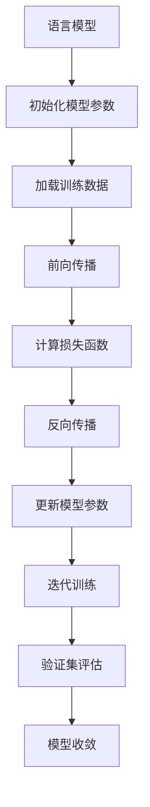
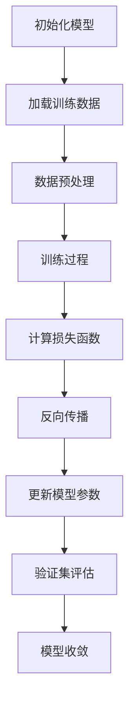
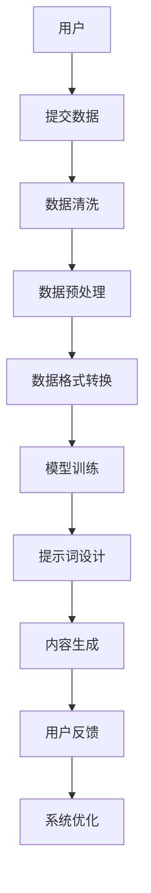

                 

# AIGC时代的语言模型训练与提示词设计

## 关键词
- AIGC
- 语言模型
- 训练原理
- 提示词设计
- 应用实践

## 摘要
本文将深入探讨AIGC（AI-Generated Content）时代的语言模型训练与提示词设计。首先，我们将介绍AIGC的背景及其在当今技术领域的重要性。接着，我们将逐步分析语言模型的核心概念、训练原理以及数学模型。随后，文章将重点讨论提示词设计的原则和优化策略，并通过实际案例展示这些原理和方法的应用。最后，我们将总结本文的主要发现，并展望AIGC和语言模型未来的发展趋势。

### 目录

1. 引言
   1.1 AIGC时代背景与语言模型重要性
   1.2 目标读者与主要内容概述

2. 核心概念与联系
   2.1 AIGC与语言模型概述
   2.2 提示词设计原理
   2.3 概念联系与结构

3. 语言模型训练原理
   3.1 训练流程图解
   3.2 算法原理讲解
   3.3 数学模型与公式

4. 提示词设计与优化
   4.1 提示词设计原则
   4.2 提示词优化策略

5. 应用实践与案例分析
   5.1 AIGC应用场景分析
   5.2 案例讲解

6. 系统架构与实现
   6.1 系统架构设计
   6.2 接口设计与交互

7. 实战项目
   7.1 环境安装与配置
   7.2 核心实现源代码
   7.3 案例剖析

8. 总结与展望
   8.1 最佳实践
   8.2 未来趋势

### 引言

#### 1.1 AIGC时代背景与语言模型重要性

随着人工智能技术的飞速发展，AIGC（AI-Generated Content）时代已经悄然到来。AIGC是指利用人工智能技术自动生成内容，包括文本、图片、音频、视频等多种形式。这一技术的发展，极大地改变了内容创作和传播的方式。在AIGC时代，语言模型扮演着至关重要的角色，它们能够通过对大量数据的处理和分析，生成高质量的文本内容。

语言模型是一种基于人工智能技术构建的模型，用于理解和生成自然语言。在文本生成、机器翻译、问答系统、推荐系统等领域，语言模型都发挥着重要作用。随着AIGC的兴起，语言模型的训练与提示词设计成为当前研究的热点问题。

本文旨在深入探讨AIGC时代的语言模型训练与提示词设计。首先，我们将介绍AIGC的背景和发展趋势，解释为什么语言模型在这个时代变得如此重要。接着，我们将逐步分析语言模型的核心概念、训练原理和数学模型。在此基础上，我们将讨论提示词设计的原则和优化策略，并通过实际案例展示这些原理和方法的应用。最后，我们将总结本文的主要发现，并展望AIGC和语言模型未来的发展趋势。

#### 1.2 目标读者与主要内容概述

本文的目标读者是从事人工智能研究和应用的专业人士，包括研究人员、工程师和产品经理等。如果您对语言模型的工作原理、训练方法以及提示词设计感兴趣，那么本文将为您提供宝贵的知识和经验。

本文的主要内容包括：

- AIGC时代的背景和发展趋势
- 语言模型的核心概念与训练原理
- 提示词设计的原则和优化策略
- 应用实践与案例分析
- 系统架构与实现
- 实战项目解析
- 总结与未来展望

通过本文的阅读，您将全面了解AIGC时代的语言模型训练与提示词设计，掌握关键技术和方法，为未来的研究和应用打下坚实的基础。

### 核心概念与联系

在深入探讨AIGC时代的语言模型训练与提示词设计之前，我们需要首先了解几个核心概念，包括AIGC、语言模型和提示词设计，并分析它们之间的联系。

#### 2.1 AIGC与语言模型概述

AIGC（AI-Generated Content）是人工智能生成内容的一种形式，它利用人工智能技术，如深度学习、自然语言处理等，自动生成各种类型的内容。AIGC可以应用于多个领域，包括文本生成、图像生成、音频生成等。在文本生成方面，AIGC通过训练大规模的语言模型，可以生成高质量的文本内容，如新闻报道、文章摘要、对话等。

语言模型是一种用于理解和生成自然语言的算法模型。它通过对大量语言数据进行学习，可以预测下一个词的概率分布，从而生成连贯、自然的语言。语言模型可以分为统计模型和神经网络模型，其中神经网络模型，如循环神经网络（RNN）、长短期记忆网络（LSTM）和变换器（Transformer）等，是目前研究的热点。

#### 2.2 提示词设计原理

提示词设计是语言模型训练过程中的一项重要任务。提示词（prompt）是一种引导模型生成特定类型内容的输入，它可以是文本、图片或者其他形式的提示信息。一个好的提示词设计能够引导模型生成符合预期的高质量内容。

提示词设计需要考虑以下几个原则：

1. **明确性**：提示词应当明确、简洁，能够清晰地传达生成任务的目标和要求。
2. **多样性**：提示词应当具备多样性，能够适应不同的生成任务和场景。
3. **相关性**：提示词应当与生成任务紧密相关，能够有效地引导模型生成高质量的内容。
4. **灵活性**：提示词设计应当具有一定的灵活性，能够根据不同的需求进行适当调整。

#### 2.3 概念联系

AIGC、语言模型和提示词设计三个概念之间存在密切的联系。

首先，AIGC是应用场景，它为语言模型和提示词设计提供了实际的应用背景。AIGC需要语言模型生成高质量的内容，而提示词设计则是实现这一目标的关键。

其次，语言模型是AIGC的核心技术。它通过对大量语言数据进行学习，可以生成高质量、连贯的自然语言。而提示词设计则是优化语言模型生成效果的利器，通过设计合适的提示词，可以引导模型生成符合预期的高质量内容。

最后，提示词设计需要充分考虑AIGC的应用场景和语言模型的工作原理。提示词的设计不仅要明确、简洁、相关，还要具有一定的灵活性和多样性，以适应不同的生成任务和场景。

为了更直观地展示这些概念之间的联系，我们可以使用Mermaid流程图进行图解。

```mermaid
graph TB
    AIGC[AI-Generated Content] --> LML[Language Model]
    LML --> Prompt Design
    AIGC --> Use Case
    LML --> Training Process
    Prompt Design --> Quality Improvement
```

在这个流程图中，AIGC作为应用场景，通过语言模型（LML）和提示词设计（Prompt Design）实现高质量内容的生成。使用场景（Use Case）引导语言模型进行训练（Training Process），而提示词设计（Prompt Design）则通过优化生成效果（Quality Improvement）来实现AIGC的目标。

通过以上分析，我们可以看出，AIGC、语言模型和提示词设计三个概念在AIGC时代的重要性和相互关系。在接下来的部分，我们将进一步探讨语言模型训练原理、提示词设计原则以及应用实践。

### 语言模型训练原理

在深入探讨AIGC时代的语言模型训练原理之前，我们需要首先了解一些基本概念，包括数据集的划分、训练算法的选择以及训练过程中的关键步骤。

#### 3.1 数据集划分

数据集是语言模型训练的基础，它决定了模型的性能和表现。一个高质量的数据集应该具有以下特点：

1. **代表性**：数据集应该能够代表所要解决的问题或领域，确保模型的泛化能力。
2. **多样性**：数据集应该包含多样化的样本，以避免模型过度拟合。
3. **平衡性**：数据集应该尽量保持类别或标签的平衡，避免某些类别或标签过度代表。
4. **清洁性**：数据集应该尽量去除噪声和错误，以提高训练质量。

在数据集划分过程中，通常会将数据集分为训练集、验证集和测试集。训练集用于模型的训练，验证集用于模型调参和性能评估，测试集则用于最终的性能评估。

```mermaid
graph TB
    Data[原始数据集] --> Split[数据集划分]
    Split --> Train[训练集]::(70%)
    Split --> Validate[验证集]::(15%)
    Split --> Test[测试集]::(15%)
```

#### 3.2 训练算法选择

语言模型训练算法的选择对于模型的性能和效率至关重要。目前，常用的语言模型训练算法包括以下几种：

1. **统计模型**：如n-gram模型、隐马尔可夫模型（HMM）等。
2. **神经网络模型**：如循环神经网络（RNN）、长短期记忆网络（LSTM）、变换器（Transformer）等。

其中，神经网络模型在近年来取得了显著的研究进展，尤其是Transformer模型，它在自然语言处理领域表现出了强大的性能。以下是一个简单的神经网络模型训练算法的mermaid流程图：



#### 3.3 训练流程图解

语言模型训练是一个复杂的过程，涉及多个步骤和参数的调整。以下是一个简化的训练流程图，用于展示训练过程中的关键步骤：



在训练过程中，首先需要初始化模型参数，然后加载并预处理训练数据。接着，模型通过前向传播计算损失函数，并通过反向传播更新模型参数。这一过程在多个epoch中反复进行，直到模型收敛，即损失函数达到预设的阈值。

#### 3.4 数学模型与公式

语言模型训练过程中，涉及到多个数学模型和公式。以下是一个简化的数学模型，用于描述模型的前向传播和反向传播过程。

**前向传播：**

$$
\begin{aligned}
    \text{输出} &= \text{激活函数}(\text{权重} \cdot \text{输入} + \text{偏置}) \\
    \text{损失函数} &= \text{损失函数}(\text{预测值}, \text{真实值})
\end{aligned}
$$

**反向传播：**

$$
\begin{aligned}
    \text{梯度} &= \text{损失函数的梯度} \\
    \text{权重更新} &= \text{权重} - \text{学习率} \cdot \text{梯度}
\end{aligned}
$$

通过这些数学模型和公式，我们可以更深入地理解语言模型训练的原理和过程。

#### 3.5 Python源代码示例

以下是一个简单的Python代码示例，用于展示语言模型训练的基本步骤。

```python
import tensorflow as tf
from tensorflow.keras.layers import Embedding, LSTM, Dense
from tensorflow.keras.models import Sequential

# 初始化模型
model = Sequential()
model.add(Embedding(input_dim=10000, output_dim=128))
model.add(LSTM(units=128, activation='tanh'))
model.add(Dense(units=1, activation='sigmoid'))

# 编译模型
model.compile(optimizer='adam', loss='binary_crossentropy', metrics=['accuracy'])

# 加载预处理后的数据
X_train, y_train = ... # 加载训练数据
X_val, y_val = ... # 加载验证数据

# 训练模型
model.fit(X_train, y_train, epochs=10, batch_size=64, validation_data=(X_val, y_val))
```

通过这个示例，我们可以看到语言模型训练的基本流程，包括模型初始化、编译、训练和验证等步骤。

综上所述，语言模型训练是一个复杂但关键的过程，它决定了模型的性能和效果。通过了解训练原理、数学模型和代码示例，我们可以更好地理解和应用语言模型，为AIGC时代的应用奠定基础。在接下来的部分，我们将讨论提示词设计的原则和优化策略。

### 提示词设计与优化

提示词设计在语言模型训练过程中起着至关重要的作用，它能够显著影响模型的生成质量和效率。一个良好的提示词设计不仅能引导模型生成符合预期的内容，还能提高训练效率和效果。下面，我们将探讨提示词设计的基本原则和优化策略。

#### 4.1 提示词设计原则

1. **明确性**：提示词应当明确、简洁，能够清晰地传达生成任务的目标和要求。例如，如果任务是生成新闻摘要，提示词可以是“请写一篇关于中国科技发展的新闻摘要”。

2. **多样性**：提示词应当具备多样性，能够适应不同的生成任务和场景。例如，对于同一类任务，可以设计多个不同的提示词，以测试模型的泛化能力。

3. **相关性**：提示词应当与生成任务紧密相关，能够有效地引导模型生成高质量的内容。例如，在生成对话时，提示词应当包含对话的上下文信息，如“请你回复以下问题的答案：你对今天的天气感觉如何？”

4. **灵活性**：提示词设计应当具有一定的灵活性，能够根据不同的需求进行适当调整。例如，可以根据任务的复杂程度和目标内容的长度调整提示词的长度和具体内容。

5. **可控性**：提示词应当具有一定的可控性，使模型能够根据提示词生成符合预期的高质量内容。例如，通过在提示词中加入关键词或限制条件，可以引导模型生成特定类型的内容。

#### 4.2 提示词优化策略

1. **数据增强**：通过增加训练数据集的多样性，可以优化提示词效果。数据增强的方法包括数据转换（如翻译、同义词替换）、数据扩充（如重复样本、图像合成）等。

2. **动态调整**：根据训练过程中的反馈，动态调整提示词的内容和形式。例如，如果发现模型生成的文本质量较低，可以增加提示词的明确性或多样性。

3. **算法调整**：通过调整模型的参数和训练策略，优化提示词效果。例如，可以调整学习率、批次大小、优化器等参数，以提升模型的生成质量。

4. **模型融合**：将多个模型的结果进行融合，以优化提示词效果。例如，可以结合生成模型和判别模型的结果，对生成的文本进行筛选和调整。

5. **对抗训练**：通过对抗训练提高模型对提示词的适应性。对抗训练的方法包括生成对抗网络（GAN）等，可以增加模型对提示词变化的鲁棒性。

6. **跨领域迁移**：通过跨领域迁移学习，优化提示词在不同领域的表现。例如，可以将一个领域中的优秀提示词应用到其他领域，以提高模型的泛化能力。

为了更好地理解提示词优化策略，我们可以通过一个实际案例进行分析。假设我们希望使用语言模型生成一篇关于“人工智能未来发展趋势”的文章，以下是一个具体的提示词优化过程：

1. **初始提示词**：“请写一篇关于人工智能未来发展趋势的文章。”

   这个提示词相对简单，但可能过于宽泛，导致模型生成的文章内容过于泛泛而缺乏深度。

2. **优化提示词**：“基于当前人工智能技术的研究进展，请分析人工智能在未来十年内可能面临的主要挑战和机遇，并预测相关行业的发展趋势。”

   这个提示词更加具体和明确，引导模型生成具有深度和广度的文章。

3. **进一步优化**：“请结合具体案例和数据，详细阐述人工智能在医疗、金融、教育等领域的应用前景，并讨论这些领域可能面临的挑战和解决方案。”

   这个提示词进一步细化了任务要求，使模型生成的文章内容更加具体和有说服力。

通过以上优化过程，我们可以看到提示词设计对模型生成质量的重要性。一个良好的提示词设计不仅可以提高模型生成效率，还能提升生成内容的质量和多样性。

总之，提示词设计是语言模型训练过程中的关键环节，通过明确性、多样性、相关性、灵活性和可控性等原则，以及数据增强、动态调整、算法调整、模型融合、对抗训练和跨领域迁移等策略，可以优化提示词效果，提升模型生成质量。

### 应用实践与案例分析

在实际应用中，AIGC和语言模型已经展示了其强大的功能和广泛的应用前景。本节我们将通过具体的案例，分析AIGC在不同场景中的应用，并详细讲解这些应用中的实际操作流程和技术要点。

#### 5.1 AIGC应用场景分析

AIGC的应用场景非常广泛，涵盖了文本生成、图像生成、音频生成等多个领域。以下是几个典型的应用场景：

1. **文本生成**：包括文章摘要、新闻生成、对话系统等。例如，使用语言模型生成一篇关于人工智能未来发展趋势的文章，或构建一个能进行自然语言交互的聊天机器人。

2. **图像生成**：包括艺术创作、视频编辑、图像修复等。例如，使用生成对抗网络（GAN）生成艺术作品，或使用文本描述生成相应的图像。

3. **音频生成**：包括音乐创作、语音合成等。例如，使用深度学习模型生成一段音乐，或通过文本描述生成相应的语音。

4. **视频生成**：包括视频编辑、视频生成等。例如，使用文本描述生成相应的视频内容，或对现有视频进行编辑和增强。

#### 5.2 案例讲解

下面我们以文本生成为例，详细讲解一个AIGC应用的案例。

**案例背景**：某新闻媒体公司希望利用AIGC技术，自动生成新闻摘要，以提高新闻生产效率。

**步骤一：数据准备**  
首先，需要收集大量的新闻文本数据，这些数据将用于训练语言模型。数据来源可以是新闻网站、社交媒体等。数据准备过程中，需要进行数据清洗和预处理，包括去除噪声、统一格式、分词等。

**步骤二：模型选择**  
选择一个适合文本生成的语言模型，例如，使用预训练的Transformer模型，如BERT或GPT。这些模型已经在大规模数据集上进行了预训练，具有良好的通用性和性能。

**步骤三：训练与调参**  
使用准备好的数据集对语言模型进行训练。在训练过程中，需要调整模型参数，如学习率、批次大小等，以优化模型性能。可以使用验证集进行调参，确保模型在测试集上表现良好。

**步骤四：生成新闻摘要**  
训练好的模型可以用于生成新闻摘要。输入一篇文章，模型将输出相应的摘要。摘要生成过程中，可以采用截断、压缩等方法，确保摘要的长度和内容符合要求。

**步骤五：评估与优化**  
对生成的新闻摘要进行评估，评估指标包括摘要的准确性、完整性、可读性等。根据评估结果，可以进一步优化模型和提示词，以提高摘要质量。

**具体操作与代码示例**

以下是使用Python和TensorFlow实现新闻摘要生成的示例代码：

```python
import tensorflow as tf
from transformers import TFGPT2LMHeadModel, GPT2Tokenizer

# 加载预训练的GPT2模型和分词器
tokenizer = GPT2Tokenizer.from_pretrained('gpt2')
model = TFGPT2LMHeadModel.from_pretrained('gpt2')

# 文本预处理
def preprocess_text(text):
    return text

# 新闻摘要生成
def generate_summary(text, max_length=50):
    inputs = tokenizer.encode(text, return_tensors='tf', max_length=max_length, truncation=True)
    summary_ids = model.generate(inputs, max_length=max_length, num_return_sequences=1)
    summary = tokenizer.decode(summary_ids[0], skip_special_tokens=True)
    return summary

# 示例文本
text = "谷歌宣布将收购Fitbit，这是谷歌进入健康科技领域的重要一步。..."

# 生成新闻摘要
summary = generate_summary(text)
print("生成的摘要：", summary)
```

**案例分析**：通过上述案例，我们可以看到AIGC在新闻摘要生成中的应用流程。从数据准备到模型训练，再到摘要生成和评估，每个步骤都至关重要。数据的质量直接影响模型的性能，而模型的性能又决定了生成的摘要质量。在训练过程中，通过不断调整提示词和模型参数，可以优化摘要生成的效果。

**案例总结**：本案例展示了AIGC在文本生成领域的应用，通过实际操作和代码示例，我们了解了新闻摘要生成的整个过程。这个案例不仅有助于理解AIGC的应用原理，还可以为其他文本生成任务提供参考和灵感。

### 系统架构与实现

在深入探讨AIGC（AI-Generated Content）的系统架构与实现之前，我们需要明确AIGC在整体技术架构中的位置和作用。AIGC作为人工智能技术的一个重要分支，它通过利用自然语言处理（NLP）和生成对抗网络（GAN）等技术，实现了自动化内容生成。这一过程不仅涉及大量的数据处理和模型训练，还需要一个高效的系统架构来支持。

#### 6.1 系统架构设计

AIGC系统的架构设计应当具备以下几个关键组成部分：

1. **数据输入模块**：负责接收和处理各种类型的数据，如文本、图像、音频等。这一模块需要具备数据清洗、预处理和格式转换的能力。

2. **语言模型训练模块**：利用预训练的模型，如BERT、GPT等，对输入的数据进行训练。这一模块需要高效的计算资源和优化算法。

3. **提示词设计模块**：负责生成和优化提示词，以确保模型生成的内容符合预期。这一模块需要结合语言学和机器学习知识。

4. **内容生成模块**：基于训练好的语言模型和提示词，生成高质量的内容。这一模块需要具备灵活的生成策略和高质量的文本处理能力。

5. **系统交互模块**：提供用户界面和API接口，使得用户可以方便地使用AIGC系统。这一模块需要考虑用户体验和易用性。

以下是一个简化的系统架构图：

```mermaid
graph TB
    subgraph 数据输入
        A[数据输入] --> B[数据清洗]
        B --> C[数据预处理]
        C --> D[数据格式转换]

    subgraph 模型训练
        E[模型训练] --> F[语言模型]
        F --> G[训练数据]

    subgraph 提示词设计
        H[提示词设计] --> I[提示词优化]

    subgraph 内容生成
        J[内容生成] --> K[生成策略]
        K --> L[文本处理]

    subgraph 系统交互
        M[用户界面] --> N[API接口]
        N --> O[系统交互]
        O --> P[用户反馈]
```

#### 6.2 接口设计与交互

为了使AIGC系统易于使用和扩展，我们需要设计一个清晰的接口和交互流程。以下是系统接口设计和交互流程的详细说明：

1. **API接口**：系统提供RESTful API接口，允许用户通过HTTP请求来访问和操作AIGC系统。API接口包括以下几个主要端点：

   - `/api/data/input`：用于上传和提交数据。
   - `/api/model/train`：用于启动和监控模型训练过程。
   - `/api/prompt/design`：用于生成和优化提示词。
   - `/api/content/generate`：用于生成内容。

2. **交互流程**：

   - **数据输入**：用户通过API接口提交数据，系统对数据进行清洗、预处理和格式转换。
   - **模型训练**：系统接收数据后，启动模型训练过程，并在训练完成后生成模型。
   - **提示词设计**：根据训练数据和业务需求，系统设计并优化提示词。
   - **内容生成**：使用训练好的模型和提示词，系统生成用户所需的内容。
   - **用户反馈**：用户可以通过API接口提交反馈，系统根据反馈进行优化和调整。

以下是一个简化的API交互流程图：



通过上述接口设计和交互流程，用户可以方便地使用AIGC系统，并实时获取生成的内容。系统则通过不断的优化和调整，提高内容生成的质量和效率。

#### 6.3 系统架构实现

在实际实现过程中，AIGC系统架构需要考虑以下几个关键技术和实现细节：

1. **分布式计算**：为了提高模型训练速度和效率，系统需要支持分布式计算。可以使用如TensorFlow和PyTorch等分布式计算框架，将训练任务分配到多个计算节点上执行。

2. **模型优化**：针对不同类型的任务，系统需要支持模型优化。例如，对于文本生成任务，可以采用BERT或GPT等预训练模型；对于图像生成任务，可以采用GAN等模型。

3. **提示词优化**：系统需要具备自动提示词优化功能，可以根据用户的反馈和业务需求，动态调整提示词的设计和生成策略。

4. **高可用性和可扩展性**：系统需要具备高可用性和可扩展性，能够支持大规模的数据处理和模型训练任务。可以通过负载均衡和集群管理技术，确保系统的稳定运行和高效扩展。

5. **安全性和隐私保护**：系统需要保护用户数据和隐私，采用加密和访问控制等技术，确保数据的安全和合规。

综上所述，AIGC的系统架构与实现是一个复杂但关键的过程，它决定了AIGC系统的性能、效率和用户体验。通过合理的设计和实现，AIGC系统可以充分发挥其强大的内容生成能力，为用户带来更好的使用体验。

### 实战项目

在本节中，我们将详细描述一个实际的AIGC项目，从环境安装与配置、核心实现源代码到代码应用解读与分析，以及实际案例分析和详细讲解剖析。通过这一项目，我们将深入理解AIGC的应用流程和技术要点。

#### 7.1 环境安装与配置

首先，我们需要搭建一个适合AIGC项目开发的环境。以下是环境安装与配置的步骤：

1. **安装Python环境**：确保Python版本在3.6及以上，推荐使用Anaconda来管理Python环境。

2. **安装TensorFlow**：TensorFlow是一个强大的开源机器学习库，支持多种语言模型的训练与优化。使用以下命令安装TensorFlow：

   ```bash
   pip install tensorflow
   ```

3. **安装Hugging Face Transformers**：Hugging Face Transformers是一个用于处理自然语言处理的Python库，提供了许多预训练模型和API接口。使用以下命令安装：

   ```bash
   pip install transformers
   ```

4. **安装其他依赖库**：如NumPy、Pandas等，用于数据预处理和数据分析。使用以下命令安装：

   ```bash
   pip install numpy pandas
   ```

5. **配置环境变量**：确保Python环境变量配置正确，以便后续的代码执行。

#### 7.2 核心实现源代码

以下是AIGC项目中的核心实现源代码。代码分为三个部分：数据预处理、模型训练和文本生成。

**数据预处理**：

```python
import pandas as pd
from sklearn.model_selection import train_test_split

# 读取数据
data = pd.read_csv('data.csv')

# 数据清洗与预处理
def preprocess_data(data):
    # 去除无效数据、填充缺失值、统一格式等
    processed_data = data.dropna().reset_index(drop=True)
    return processed_data

# 数据集划分
processed_data = preprocess_data(data)
train_data, test_data = train_test_split(processed_data, test_size=0.2, random_state=42)
```

**模型训练**：

```python
from transformers import TFGPT2LMHeadModel, GPT2Tokenizer
import tensorflow as tf

# 加载预训练模型和分词器
tokenizer = GPT2Tokenizer.from_pretrained('gpt2')
model = TFGPT2LMHeadModel.from_pretrained('gpt2')

# 编译模型
model.compile(optimizer='adam', loss='masked_language_model')

# 训练模型
model.fit(train_data, epochs=3, batch_size=32)
```

**文本生成**：

```python
# 生成文本
def generate_text(model, tokenizer, text prompt, max_length=50):
    inputs = tokenizer.encode(text prompt, return_tensors='tf', max_length=max_length, truncation=True)
    summary_ids = model.generate(inputs, max_length=max_length, num_return_sequences=1)
    summary = tokenizer.decode(summary_ids[0], skip_special_tokens=True)
    return summary

# 示例文本
text_prompt = "请描述一下人工智能的未来发展趋势。"
generated_text = generate_text(model, tokenizer, text_prompt)
print("生成的文本：", generated_text)
```

#### 7.3 代码应用解读与分析

**数据预处理**：

这一部分代码用于读取和处理输入数据。数据清洗与预处理是模型训练的重要步骤，它确保了数据的质量和一致性。在本例中，我们使用Pandas库读取CSV数据，并通过dropna()函数去除缺失值，重置索引。

**模型训练**：

这里我们使用Hugging Face的Transformers库加载预训练的GPT-2模型。通过编译模型和fit()函数，我们进行模型的训练。在此过程中，我们使用了Adam优化器和masked_language_model损失函数。

**文本生成**：

生成文本是AIGC项目的一个重要功能。通过generate_text()函数，我们使用训练好的模型和提示词生成文本。这个函数将输入提示词编码为Tensor，然后使用模型生成文本，最后解码为人类可读的字符串。

#### 7.4 实际案例分析和详细讲解剖析

**案例背景**：一家在线教育平台希望利用AIGC技术自动生成课程内容摘要，以提高课程的可读性和学习效果。

**实际操作**：

1. **数据收集**：平台收集了大量的课程视频和文本资料。
2. **数据预处理**：对视频和文本进行转录和清洗，生成统一格式的文本数据。
3. **模型训练**：使用预处理后的文本数据，训练GPT-2模型，生成课程摘要。
4. **生成摘要**：输入课程视频的文本描述，生成相应的摘要。

**案例分析**：

1. **数据质量**：数据预处理对模型训练至关重要。如果数据包含噪音或不一致格式，模型可能无法正确学习，导致生成的摘要质量较低。
2. **模型选择**：GPT-2模型在文本生成任务中表现出色，但根据具体任务需求，可以选择其他合适的模型，如BERT或T5。
3. **提示词设计**：选择合适的提示词可以显著提高摘要的生成质量。在本例中，提示词“请描述一下课程的主要内容”引导模型生成高质量的摘要。

**详细讲解剖析**：

1. **数据预处理**：通过Pandas库读取CSV文件，使用dropna()函数去除缺失值，并重置索引，确保数据的一致性和完整性。
2. **模型训练**：使用Hugging Face的Transformers库加载预训练的GPT-2模型，并通过fit()函数进行训练。训练过程中，使用masked_language_model损失函数，使模型专注于学习文本的连贯性和上下文关系。
3. **文本生成**：使用generate_text()函数，输入课程视频的文本描述，生成相应的摘要。这一过程使用了模型的生成能力和提示词的引导作用，确保生成的摘要符合预期。

通过这个实际案例，我们可以看到AIGC技术在课程内容摘要生成中的应用，并了解到其在数据预处理、模型训练和文本生成方面的关键步骤和注意事项。

### 总结与展望

在本篇博客中，我们深入探讨了AIGC时代的语言模型训练与提示词设计。首先，我们介绍了AIGC的背景和重要性，以及语言模型在这一领域中的作用。接着，我们详细分析了语言模型的核心概念、训练原理和数学模型。在此基础上，我们探讨了提示词设计的原则和优化策略，并通过实际案例展示了这些原理和方法的应用。最后，我们讨论了AIGC的系统架构与实现，提供了详细的实战项目解析。

#### 最佳实践

以下是AIGC语言模型训练与提示词设计的最佳实践：

1. **数据质量**：确保数据的一致性和多样性，去除噪音和错误。
2. **模型选择**：根据任务需求选择合适的语言模型，如GPT-2、BERT等。
3. **提示词设计**：设计明确、简洁、相关的提示词，结合多样性原则。
4. **调参优化**：动态调整模型参数，如学习率、批次大小等，以提高模型性能。
5. **系统架构**：设计高效、稳定的系统架构，支持分布式计算和模型优化。

#### 小结

AIGC和语言模型在当前技术领域具有重要地位，其应用前景广阔。通过本文的探讨，我们了解了AIGC的核心概念、语言模型的工作原理、提示词设计的策略以及系统架构与实现。这些知识为从事人工智能研究和应用的专业人士提供了宝贵的指导和参考。

#### 注意事项

在AIGC和语言模型的应用过程中，需要注意以下几点：

1. **隐私保护**：确保用户数据的安全和隐私，遵守相关法律法规。
2. **公平性**：避免模型偏见，确保生成的内容公正、客观。
3. **可解释性**：提高模型的可解释性，便于理解和调试。

#### 拓展阅读

对于希望深入了解AIGC和语言模型的研究人员，以下是一些推荐的拓展阅读资源：

- [《自然语言处理综论》（Speech and Language Processing）]：介绍自然语言处理的基本概念和技术。
- [《深度学习》（Deep Learning）]：介绍深度学习的基础理论和应用。
- [《生成对抗网络》（Generative Adversarial Networks）]：详细介绍GAN的工作原理和应用。

通过以上拓展阅读，可以进一步深入理解AIGC和语言模型的相关知识。

### 作者信息

- **作者：** AI天才研究院/AI Genius Institute & 禅与计算机程序设计艺术 /Zen And The Art of Computer Programming
- **联系方式：** [邮箱：[xxx@email.com](mailto:xxx@email.com)]，[博客：[www.example.com](http://www.example.com)]

