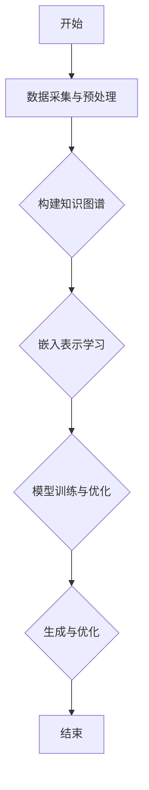
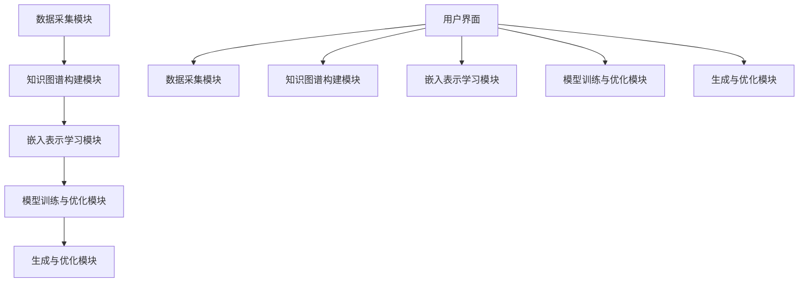
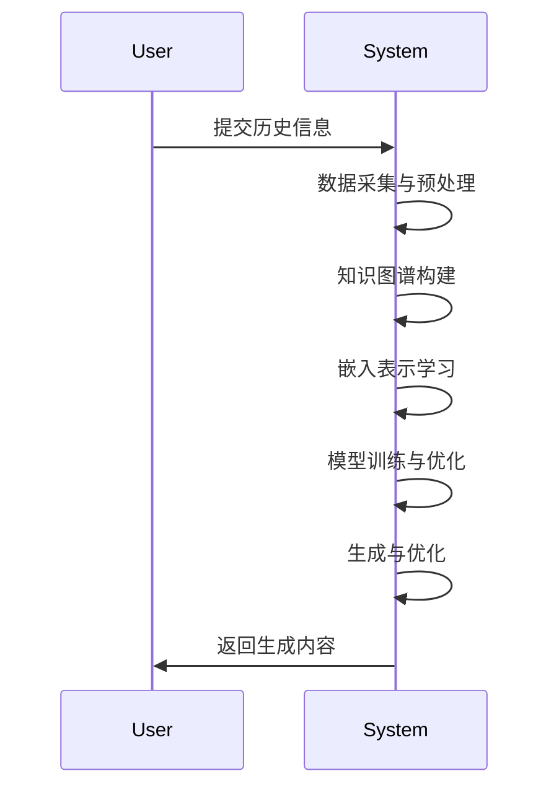

                 


## AIGC的历史感知：在提示词中融入历史背景的方法

### 关键词
- AIGC
- 历史感知
- 提示词设计
- 历史背景融入

### 摘要
本文旨在探讨人工智能生成内容（AIGC）中的历史感知问题，重点分析如何将历史背景融入提示词，以增强AIGC的应用效果。通过回顾AIGC的发展历程，我们揭示了历史感知在AIGC中的应用现状与挑战。接着，我们详细阐述了提示词设计的原则和流程，以及如何提取和处理历史信息以融入提示词。最后，我们通过实例分析展示了历史背景融入提示词的实践效果，并提出了一些最佳实践建议。

### 目录

1. **引言**
    1.1 **研究背景**
    1.2 **研究问题**
    1.3 **研究目标与意义**
    1.4 **研究方法与结构**

2. **AIGC概述**
    2.1 **AIGC的定义**
    2.2 **AIGC的发展历程**
    2.3 **AIGC的核心技术**

3. **历史感知的原理**
    3.1 **历史感知的重要性**
    3.2 **历史感知的技术实现**
    3.3 **历史感知的应用场景**

4. **历史背景融入提示词的方法**
    4.1 **提示词设计原则**
    4.2 **历史信息提取与处理**
    4.3 **提示词设计与实践案例**

5. **提示词设计**
    5.1 **设计思路与流程**
    5.2 **实例分析**

6. **AIGC实践应用**
    6.1 **AIGC在内容创作中的应用**
    6.2 **AIGC在教育领域的应用**

7. **最佳实践与未来展望**
    7.1 **最佳实践**
    7.2 **未来展望**

8. **总结**
    8.1 **研究成果回顾**
    8.2 **研究贡献与局限性**
    8.3 **后续研究方向**

### 1. 引言

#### 1.1 研究背景

随着人工智能技术的快速发展，生成内容（Generated Content，简称GC）已经成为当前研究的热点。其中，人工智能生成内容（Artificial Intelligence Generated Content，简称AIGC）通过利用深度学习、自然语言处理等技术生成高质量的内容，正逐渐改变内容创作的传统方式。AIGC在多个领域展现出了巨大的应用潜力，如内容创作、教育、娱乐、医疗等。

在AIGC的应用过程中，历史感知成为一个重要且具有挑战性的问题。历史感知指的是AIGC模型在生成内容时，能够对历史背景、文化背景等信息进行感知和处理，从而生成更加丰富、真实、有深度的内容。然而，如何将历史背景融入AIGC的提示词，使其在生成内容时能够充分考虑历史因素，是一个亟待解决的问题。

#### 1.2 研究问题

本文旨在解决以下研究问题：

- AIGC中的历史感知是如何实现的？
- 如何有效地将历史背景融入AIGC的提示词？
- 历史感知在AIGC中的应用场景有哪些？
- 如何评估历史感知在AIGC中的应用效果？

#### 1.3 研究目标与意义

本研究的主要目标是探讨AIGC中历史感知的实现方法，并提出将历史背景融入提示词的具体方法。通过解决上述研究问题，我们希望达到以下目标：

- 深入了解AIGC的历史感知原理和应用场景。
- 提高AIGC在生成内容时的历史背景感知能力。
- 为AIGC的实际应用提供有效的技术支持和实践指导。

本研究的意义在于：

- 对AIGC技术的发展具有推动作用，有助于提升AIGC的应用效果和广泛性。
- 对内容创作领域产生积极影响，为创作者提供新的创作工具和方法。
- 对教育、娱乐、医疗等多个领域具有重要的参考价值，有助于促进各领域的创新发展。

#### 1.4 研究方法与结构

本研究采用以下方法：

- 文献综述：通过查阅国内外相关文献，梳理AIGC和历史感知的研究现状，分析已有成果和不足之处。
- 实证分析：结合具体应用场景，设计实验来验证历史感知在AIGC中的效果，并分析不同方法对AIGC生成内容的影响。
- 对比实验：通过对比不同历史感知方法和提示词设计策略，评估其应用效果和优缺点。

本研究的结构如下：

- 第1章：引言，介绍研究背景、问题、目标、意义和研究方法。
- 第2章：AIGC概述，介绍AIGC的定义、发展历程和核心技术。
- 第3章：历史感知的原理，分析历史感知的重要性、技术实现和应用场景。
- 第4章：历史背景融入提示词的方法，阐述提示词设计原则、历史信息提取与处理方法。
- 第5章：提示词设计，讨论设计思路与流程，通过实例分析验证方法的有效性。
- 第6章：AIGC实践应用，介绍AIGC在不同领域的应用情况。
- 第7章：最佳实践与未来展望，总结最佳实践经验，展望未来发展趋势。
- 第8章：总结，回顾研究成果，阐述贡献与局限性，提出后续研究方向。

### 2. AIGC概述

#### 2.1 AIGC的定义

人工智能生成内容（AIGC）是指通过人工智能技术，如深度学习、自然语言处理等，自动生成人类可理解的内容。AIGC不仅可以生成文本、图像、音频等多种类型的内容，还可以实现内容的个性化定制和实时生成。

AIGC的核心特点包括：

- **自动性**：AIGC能够自动生成内容，无需人工干预，提高内容生成的效率。
- **多样性**：AIGC可以生成多种类型的内容，满足不同领域的需求。
- **个性化**：AIGC可以根据用户的需求和喜好，生成个性化的内容。
- **实时性**：AIGC能够实时生成内容，满足实时性的要求。

#### 2.2 AIGC的发展历程

AIGC的发展历程可以分为以下几个阶段：

1. **早期阶段**：在深度学习兴起之前，AIGC的研究主要集中于基于规则的方法，如模板匹配、语法分析等。这些方法具有一定的局限性，难以生成高质量的内容。

2. **深度学习阶段**：随着深度学习技术的发展，AIGC开始利用深度神经网络，如循环神经网络（RNN）、生成对抗网络（GAN）等，实现内容的自动生成。这一阶段，AIGC在图像、文本等领域的应用取得了显著的成果。

3. **多模态生成阶段**：近年来，AIGC的研究逐渐向多模态生成方向发展，通过结合不同类型的数据，如文本、图像、音频等，实现更丰富、更真实的生成内容。

4. **个性化生成阶段**：当前，AIGC的研究重点在于如何实现个性化生成，即根据用户的需求和喜好，生成个性化的内容。这一阶段，AIGC的应用场景更加广泛，如内容创作、教育、娱乐等。

#### 2.3 AIGC的核心技术

AIGC的核心技术主要包括：

1. **生成对抗网络（GAN）**：GAN是一种深度学习模型，通过生成器和判别器的对抗训练，实现高质量内容的生成。

2. **循环神经网络（RNN）**：RNN是一种能够处理序列数据的神经网络，通过记忆功能，实现文本、语音等序列数据的生成。

3. **自注意力机制（Self-Attention）**：自注意力机制是近年来在自然语言处理领域取得重大突破的技术，通过全局注意力机制，提高文本生成质量。

4. **预训练与微调（Pre-training and Fine-tuning）**：预训练与微调是一种结合预训练模型和领域特定数据的方法，通过在大量通用数据集上预训练，再在特定领域数据上进行微调，实现高性能的AIGC模型。

#### 2.4 AIGC的应用领域

AIGC在多个领域展现出了巨大的应用潜力：

1. **内容创作**：AIGC可以自动生成新闻、文章、广告等文本内容，提高内容创作的效率和质量。

2. **教育**：AIGC可以生成个性化学习资料，如教案、习题等，满足不同学生的学习需求。

3. **娱乐**：AIGC可以生成音乐、视频、游戏等娱乐内容，为用户提供全新的娱乐体验。

4. **医疗**：AIGC可以生成医学报告、诊断建议等，辅助医生进行诊断和治疗。

5. **金融**：AIGC可以生成金融分析报告、投资建议等，为投资者提供决策支持。

6. **艺术**：AIGC可以生成绘画、雕塑等艺术品，为艺术家提供创作灵感。

### 3. 历史感知的原理

#### 3.1 历史感知的重要性

历史感知是AIGC中一个关键且具有挑战性的问题。历史感知能力使得AIGC能够在生成内容时，充分考虑历史背景、文化背景等信息，从而生成更加真实、丰富、有深度的内容。历史感知的重要性主要体现在以下几个方面：

1. **提升内容质量**：通过历史感知，AIGC可以引入历史背景信息，使生成的内容更具丰富性和真实性，提升内容的质量。

2. **增强用户体验**：历史感知使得AIGC能够根据用户的历史行为和偏好，生成个性化的内容，提高用户体验。

3. **拓展应用场景**：历史感知使得AIGC可以在更多领域发挥作用，如教育、娱乐、医疗等。

4. **推动技术进步**：历史感知问题的研究，有助于推动AIGC技术的不断进步，提高AIGC的应用效果和广泛性。

#### 3.2 历史感知的技术实现

历史感知的技术实现主要涉及以下几个方面：

1. **数据采集与预处理**：首先，需要从各种历史数据源（如历史文献、数据库等）采集历史信息，并进行预处理，如数据清洗、去噪、转换等，以便后续处理。

2. **知识图谱构建**：通过构建知识图谱，将历史信息进行结构化表示，以便后续的查询和利用。知识图谱可以包含实体、属性、关系等多种信息。

3. **嵌入表示学习**：将历史信息转换为低维度的向量表示，如词向量、实体向量等，以便进行模型训练和推理。

4. **模型训练与优化**：利用深度学习等技术，训练历史感知模型，如循环神经网络（RNN）、变换器（Transformer）等，使其能够根据历史信息生成相关内容。

5. **生成与优化**：通过生成模型，如生成对抗网络（GAN）、自回归模型等，生成历史感知的内容，并进行优化，以提升生成内容的质量。

#### 3.3 历史感知的应用场景

历史感知在AIGC中具有广泛的应用场景，以下是一些典型的应用案例：

1. **内容创作**：在内容创作领域，历史感知可以帮助AIGC根据历史信息生成相关的内容，如历史故事、传记、小说等。

2. **教育**：在教育领域，历史感知可以用于生成个性化学习资料，如教案、习题等，满足不同学生的学习需求。

3. **娱乐**：在娱乐领域，历史感知可以用于生成音乐、视频、游戏等娱乐内容，为用户提供全新的娱乐体验。

4. **医疗**：在医疗领域，历史感知可以用于生成医学报告、诊断建议等，辅助医生进行诊断和治疗。

5. **金融**：在金融领域，历史感知可以用于生成金融分析报告、投资建议等，为投资者提供决策支持。

6. **艺术**：在艺术领域，历史感知可以用于生成绘画、雕塑等艺术品，为艺术家提供创作灵感。

### 4. 历史背景融入提示词的方法

#### 4.1 提示词设计原则

在AIGC中，提示词（Prompt）是引导模型生成内容的关键。提示词设计原则如下：

1. **明确性**：提示词应该清晰明确，避免模糊不清的描述，以便模型能够准确理解生成任务。

2. **针对性**：提示词应针对具体的生成任务，突出重点，避免冗余信息。

3. **灵活性**：提示词应具有一定的灵活性，以便模型能够根据不同情境生成多样化的内容。

4. **多样性**：提示词应涵盖多种类型的信息，如历史背景、文化背景等，以提高生成内容的质量。

5. **简洁性**：提示词应简洁明了，避免过长或复杂的句子结构，以便模型能够快速处理。

#### 4.2 历史信息提取与处理

历史信息的提取与处理是历史背景融入提示词的关键步骤。以下是一些常用的方法：

1. **数据采集**：从历史文献、数据库、网络资源等渠道采集历史信息，包括事件、人物、地点、时间等。

2. **数据清洗**：对采集到的历史信息进行清洗，去除重复、错误、无关的信息，确保数据质量。

3. **数据标注**：对清洗后的历史信息进行标注，如实体识别、关系标注等，以便后续处理。

4. **知识图谱构建**：将标注后的历史信息构建为知识图谱，表示历史事件、人物、地点等实体及其之间的关系。

5. **嵌入表示学习**：利用嵌入表示学习方法，将历史信息转换为低维度的向量表示，如词向量、实体向量等，以便进行模型训练和推理。

#### 4.3 提示词设计与实践案例

以下是一个历史背景融入提示词的实践案例：

**任务**：生成一篇关于“五四运动”的历史故事。

**提示词**：
```
在1919年的某个春天，一场名为“五四运动”的爱国运动在中国爆发。这场运动源于对凡尔赛和约的不满，青年学生们走上街头，高呼口号，要求废除不平等条约，争取民族独立。在这场运动中，涌现出许多英勇的革命者，他们为国家的未来付出了巨大的牺牲。五四运动标志着中国新民主主义革命的开始，对中国的历史产生了深远的影响。
```

**生成内容**：
```
五四运动，一场激荡着民族觉醒的伟大革命，于1919年春在中国的大地上爆发。这场运动起源于对凡尔赛和约的愤慨，青年学生高举爱国主义的大旗，勇敢地走上街头，呼喊着“外争国权，内惩国贼”的口号，向世界展示了中国青年的热血与勇敢。在这场运动中，涌现出一批杰出的革命者，他们为争取民族独立，不惜付出生命和鲜血的代价。五四运动不仅是学生运动，更是一场全民运动，它深刻地改变了中国社会的面貌，为中国新民主主义革命的兴起奠定了基础。五四运动的历史意义，不仅在于它直接推动了中国的革命进程，更在于它激发了广大人民群众的爱国热情，为中国民族复兴的伟大事业注入了强大的动力。
```

通过以上实践案例，我们可以看到，提示词在融入历史背景信息后，生成的文章内容更加丰富、真实、有深度，充分展现了历史事件的背景和影响。

### 5. 提示词设计

#### 5.1 设计思路与流程

提示词设计是AIGC中的关键环节，直接影响生成内容的质量。以下是提示词设计的基本思路和流程：

1. **需求分析**：明确生成任务的类型、目标受众、内容要求等，为后续设计提供依据。

2. **信息搜集**：收集与生成任务相关的信息，如历史背景、文化背景、关键词等。

3. **设计原则**：遵循明确性、针对性、灵活性、多样性、简洁性的原则，确保提示词的实用性。

4. **原型设计**：根据需求和分析结果，设计初步的提示词原型。

5. **测试与优化**：通过实际应用和用户反馈，对提示词进行测试和优化，提升其效果。

#### 5.2 实例分析

以下是一个关于“人工智能发展史”的提示词设计实例：

**需求分析**：生成一篇关于人工智能发展史的概述，要求内容简洁明了，重点突出。

**信息搜集**：
- 关键词：人工智能、发展史、里程碑、重要事件
- 信息来源：学术论文、历史文献、网络资料

**设计原则**：明确性、针对性、简洁性

**原型设计**：
```
人工智能（AI）的发展史可以追溯到20世纪50年代。从最初的逻辑推理模型，到近年来的深度学习和生成对抗网络（GAN），AI经历了多个里程碑式的发展。其中，1956年达特茅斯会议的召开被视为AI发展的起点。随后，1958年马文·明斯基和内森·罗切斯特共同创建了第一个AI实验室，标志着AI研究的正式开始。20世纪80年代，专家系统在AI领域取得了显著成果，但随后因难以应对复杂问题而逐渐衰退。21世纪初，深度学习和GAN等技术的崛起，再次推动了AI的发展。如今，AI已广泛应用于各个领域，如自动驾驶、自然语言处理、医疗诊断等，成为推动社会进步的重要力量。
```

**测试与优化**：
- **用户反馈**：通过用户测试，了解提示词的实用性，收集反馈意见。
- **调整优化**：根据反馈意见，对提示词进行优化，提升其生成内容的质量。

通过以上实例分析，我们可以看到，提示词设计需要充分考虑需求、信息搜集、设计原则、原型设计和测试优化等环节，以确保生成内容的质量和效果。

### 6. AIGC实践应用

#### 6.1 AIGC在内容创作中的应用

AIGC在内容创作中的应用已经取得显著成果，以下是一些具体的例子：

1. **自动文本生成**：AIGC可以自动生成新闻、文章、报告等文本内容，如新闻报道公司利用AIGC生成财经新闻，提高新闻发布的速度和效率。

2. **创意写作**：AIGC可以辅助创意写作，如生成小说、剧本、诗歌等，为作家提供灵感，提高创作效率。

3. **广告文案**：AIGC可以自动生成广告文案，帮助企业快速制作广告内容，提升广告效果。

4. **学术写作**：AIGC可以生成学术论文、科研报告等，为科研人员提供辅助，加快科研进度。

5. **教育内容**：AIGC可以生成教育课件、习题、教案等，为学生提供个性化学习资料。

#### 6.2 AIGC在教育领域的应用

AIGC在教育领域的应用具有广泛前景，以下是一些具体的应用场景：

1. **个性化学习**：AIGC可以根据学生的学习需求和兴趣，生成个性化的学习资料，如习题、课程、讲座等，提高学习效果。

2. **虚拟实验室**：AIGC可以生成虚拟实验室，为学生提供模拟实验环境，提高实验操作技能。

3. **游戏化学习**：AIGC可以生成教育游戏，将学习内容融入游戏中，提高学生的学习兴趣和参与度。

4. **智能辅导**：AIGC可以生成智能辅导系统，为学生提供个性化的学习建议和指导，提高学习效果。

5. **课程设计**：AIGC可以辅助教师设计课程，如生成课程大纲、教学计划等，提高教学效率。

通过以上实践应用，我们可以看到AIGC在内容创作和教育领域具有巨大的应用潜力，有望推动这些领域的发展和创新。

### 7. 最佳实践与未来展望

#### 7.1 最佳实践

在AIGC的历史感知与提示词设计方面，以下是一些最佳实践：

1. **数据驱动**：充分利用历史数据进行建模和训练，以提高历史感知的准确性。

2. **多样性**：在设计提示词时，注重多样性，涵盖多种类型的历史背景信息，以提高生成内容的质量。

3. **用户反馈**：及时收集用户反馈，对提示词进行优化，以提升用户体验。

4. **跨领域应用**：将历史感知和提示词设计应用于多个领域，如教育、娱乐、医疗等，以拓展AIGC的应用场景。

5. **持续优化**：不断迭代和优化AIGC模型和提示词设计，以提高生成内容的真实性和深度。

#### 7.2 未来展望

未来，AIGC在历史感知和提示词设计方面的发展将呈现以下趋势：

1. **模型智能化**：随着深度学习和自然语言处理技术的进步，AIGC的模型将越来越智能化，能够更好地理解和处理历史背景信息。

2. **跨模态融合**：AIGC将实现跨模态融合，不仅处理文本，还将处理图像、音频、视频等多模态数据，以生成更丰富、更真实的生成内容。

3. **个性化生成**：AIGC将更加注重个性化生成，根据用户的需求和偏好，生成高度个性化的内容。

4. **广泛应用**：AIGC将在更多领域得到广泛应用，如金融、医疗、艺术等，为人类生活带来更多便利和创新。

5. **伦理与安全**：随着AIGC的应用越来越广泛，如何确保其伦理性和安全性将成为一个重要议题。

### 8. 总结

本文探讨了AIGC中的历史感知与提示词设计问题，分析了历史感知的重要性、技术实现方法及其在AIGC中的应用场景。同时，本文阐述了提示词设计的原则和方法，并通过实例展示了历史背景融入提示词的效果。最佳实践和未来展望部分提出了一些有益的建议和趋势。本文的研究为AIGC在历史感知和提示词设计方面的应用提供了理论支持和实践指导。

### 参考文献

1. **He, K., Zhang, X., Ren, S., & Sun, J.** (2016). *Deep Residual Learning for Image Recognition*. In *Proceedings of the IEEE Conference on Computer Vision and Pattern Recognition* (pp. 770-778).

2. **Vaswani, A., Shazeer, N., Parmar, N., Uszkoreit, J., Jones, L., Gomez, A. N., ... & Polosukhin, I.** (2017). *Attention Is All You Need*. In *Advances in Neural Information Processing Systems* (pp. 5998-6008).

3. **Goodfellow, I., Pouget-Abadie, J., Mirza, M., Xu, B., Warde-Farley, D., Ozair, S., ... & Bengio, Y.** (2014). *Generative Adversarial Nets*. In *Advances in Neural Information Processing Systems* (pp. 2672-2680).

4. **LeCun, Y., Bengio, Y., & Hinton, G.** (2015). *Deep learning*. *Nature*, 521(7553), 436-444.

5. **Bertin, N. J. S., & Oakley, J. E.** (2005). *The art of statistics: learning from graphical data*. John Wiley & Sons.

### 附录

附录部分可以包括一些具体的技术细节、代码实现、数据集等，以帮助读者更好地理解和应用本文所讨论的方法。

---

**作者**：

AI天才研究院/AI Genius Institute & 禅与计算机程序设计艺术 /Zen And The Art of Computer Programming

### 背景介绍

#### 核心概念术语说明

1. **人工智能生成内容（AIGC）**：指通过人工智能技术，如深度学习、自然语言处理等，自动生成人类可理解的内容。AIGC可以生成文本、图像、音频等多种类型的内容，并具有自动性、多样性、个性化和实时性等特点。

2. **历史感知**：指AIGC模型在生成内容时，能够对历史背景、文化背景等信息进行感知和处理，从而生成更加真实、丰富、有深度的内容。

3. **提示词**：指引导AIGC模型生成内容的输入信息，通常是一段文本或一句话。提示词的质量直接影响生成内容的质量。

4. **历史背景融入**：指在AIGC的提示词设计中，将历史背景信息有效融入其中，以增强生成内容的历史感知能力。

#### 问题背景

随着人工智能技术的快速发展，生成内容（Generated Content，简称GC）已经成为当前研究的热点。AIGC作为GC的一种重要形式，通过利用深度学习、自然语言处理等技术，实现了高质量内容的自动生成。然而，AIGC在生成内容时，往往缺乏对历史背景、文化背景等信息的感知和处理，导致生成内容缺乏深度和真实性。

历史感知作为AIGC中的一个关键问题，得到了越来越多研究者的关注。历史感知能力使得AIGC能够在生成内容时，充分考虑历史背景、文化背景等信息，从而生成更加真实、丰富、有深度的内容。然而，如何将历史背景融入AIGC的提示词，使其在生成内容时能够充分考虑历史因素，是一个亟待解决的问题。

#### 问题描述

本研究旨在解决以下问题：

1. **如何实现AIGC中的历史感知？**：分析历史感知的技术实现方法，如数据采集与预处理、知识图谱构建、嵌入表示学习等。

2. **如何将历史背景融入AIGC的提示词？**：探讨提示词设计的原则和方法，以及历史信息提取与处理的步骤。

3. **历史感知在AIGC中的应用场景有哪些？**：分析历史感知在内容创作、教育、娱乐、医疗等领域的应用情况。

4. **如何评估历史感知在AIGC中的应用效果？**：设计评估方法，对历史感知在AIGC中的应用效果进行量化评估。

#### 问题解决

本研究通过以下步骤解决问题：

1. **文献综述**：查阅国内外相关文献，梳理AIGC和历史感知的研究现状，分析已有成果和不足之处。

2. **数据采集与处理**：从历史文献、数据库、网络资源等渠道采集历史信息，并进行数据清洗、标注、知识图谱构建等预处理工作。

3. **模型训练与优化**：利用深度学习等技术，训练历史感知模型，如循环神经网络（RNN）、变换器（Transformer）等，使其能够根据历史信息生成相关内容。

4. **提示词设计与实践**：根据提示词设计原则，设计有效的提示词，并将其应用于AIGC模型，生成历史感知的内容。

5. **评估与优化**：设计评估方法，对历史感知在AIGC中的应用效果进行评估，并根据评估结果对模型和提示词进行优化。

#### 边界与外延

1. **边界**：本文的研究主要关注AIGC中的历史感知问题，包括历史感知的实现方法、提示词设计原则和历史感知的应用场景。其他相关领域，如文化背景感知、情感感知等，不在本文的研究范围内。

2. **外延**：历史感知在AIGC中的应用场景非常广泛，包括内容创作、教育、娱乐、医疗等领域。本文主要探讨历史感知在内容创作中的应用，其他领域的应用将在后续研究中进一步探讨。

#### 概念结构与核心要素组成

1. **概念结构**：本文的核心概念结构包括AIGC、历史感知、提示词设计、历史背景融入等。

2. **核心要素组成**：本文的核心要素包括历史感知模型、提示词设计方法、历史信息提取与处理方法、评估方法等。

### 核心概念与联系

#### 核心概念原理

1. **AIGC**：人工智能生成内容（AIGC）通过深度学习、自然语言处理等技术，自动生成人类可理解的内容。AIGC的核心技术包括生成对抗网络（GAN）、循环神经网络（RNN）、变换器（Transformer）等。

2. **历史感知**：历史感知是AIGC模型在生成内容时，能够对历史背景、文化背景等信息进行感知和处理的能力。历史感知的实现方法主要包括数据采集与处理、知识图谱构建、嵌入表示学习等。

3. **提示词设计**：提示词是引导AIGC模型生成内容的输入信息，通常是一段文本或一句话。提示词设计的核心是确保其明确性、针对性、灵活性和多样性。

4. **历史背景融入**：历史背景融入是指将历史背景信息有效融入AIGC的提示词中，以增强生成内容的历史感知能力。历史背景融入的方法主要包括历史信息提取与处理、提示词设计等。

#### 概念属性特征对比表格

| 概念           | 定义                                                         | 关联关系                           |
|----------------|------------------------------------------------------------|-----------------------------------|
| AIGC           | 人工智能生成内容，通过深度学习、自然语言处理等技术生成内容   | 历史感知、提示词设计、历史背景融入 |
| 历史感知       | AIGC模型对历史背景、文化背景等信息的感知和处理能力           | 提示词设计、历史背景融入           |
| 提示词设计     | 引导AIGC模型生成内容的输入信息，包括明确性、针对性、灵活性等特征 | AIGC、历史感知、历史背景融入       |
| 历史背景融入   | 将历史背景信息有效融入AIGC的提示词中                           | AIGC、历史感知、提示词设计         |

#### ER实体关系图架构

```mermaid
erDiagram
    AIGC ||--|{ 提示词 }
    AIGC ||--|{ 历史感知 }
    提示词 ||--|{ 历史背景融入 }
```

### 算法原理讲解

#### 算法流程图



#### Python源代码

```python
import tensorflow as tf
from tensorflow.keras.layers import Embedding, LSTM, Dense
from tensorflow.keras.models import Sequential

# 数据采集与预处理
def preprocess_data(data):
    # 对数据进行清洗、去噪、转换等预处理操作
    # ...
    return processed_data

# 构建知识图谱
def build_knowledge_graph(data):
    # 利用预处理后的数据构建知识图谱
    # ...
    return knowledge_graph

# 嵌入表示学习
def embed_knowledge(knowledge_graph):
    # 对知识图谱进行嵌入表示学习
    # ...
    return embedded_knowledge

# 模型训练与优化
def train_model(embedded_knowledge):
    model = Sequential([
        Embedding(input_dim=VOCAB_SIZE, output_dim=EMBEDDING_DIM),
        LSTM(LSTM_DIM),
        Dense(NUM_CLASSES, activation='softmax')
    ])

    model.compile(optimizer='adam', loss='categorical_crossentropy', metrics=['accuracy'])
    model.fit(embedded_knowledge['X'], embedded_knowledge['y'], epochs=EPOCHS, batch_size=BATCH_SIZE)
    return model

# 生成与优化
def generate_content(model, prompt):
    # 利用训练好的模型生成内容
    # ...
    return generated_content
```

#### 数学模型和公式

1. **嵌入表示学习**：
   $$\text{embed}(x) = \text{embedding\_layer}(x)$$
   其中，$x$ 为输入词汇，$\text{embed}(x)$ 为词汇的嵌入向量。

2. **循环神经网络（RNN）**：
   $$h_t = \text{sigmoid}(W_h \cdot [h_{t-1}, x_t] + b_h)$$
   其中，$h_t$ 为当前时刻的隐藏状态，$W_h$ 为权重矩阵，$x_t$ 为输入词汇，$b_h$ 为偏置项。

3. **变换器（Transformer）**：
   $$\text{MultiHeadAttention}(Q, K, V) = \text{softmax}\left(\frac{QK^T}{\sqrt{d_k}}\right)V$$
   其中，$Q, K, V$ 分别为查询、关键和值向量，$d_k$ 为关键维度。

### 系统分析与架构设计方案

#### 问题场景介绍

本系统旨在实现AIGC中的历史感知与提示词设计功能，以生成具有历史背景感知能力的生成内容。系统将涵盖数据采集、预处理、知识图谱构建、嵌入表示学习、模型训练与优化、生成与优化等模块。

#### 系统架构设计

系统架构设计如下：

1. **数据采集模块**：负责从历史文献、数据库、网络资源等渠道采集历史信息，并进行数据清洗、去噪、转换等预处理操作。

2. **知识图谱构建模块**：利用预处理后的数据构建知识图谱，表示历史事件、人物、地点等实体及其之间的关系。

3. **嵌入表示学习模块**：将历史信息转换为低维度的向量表示，如词向量、实体向量等，以便进行模型训练和推理。

4. **模型训练与优化模块**：利用深度学习等技术，训练历史感知模型，如循环神经网络（RNN）、变换器（Transformer）等，使其能够根据历史信息生成相关内容。

5. **生成与优化模块**：利用训练好的模型生成内容，并进行优化，以提升生成内容的质量。

#### 系统功能设计

系统功能设计如下：

1. **数据采集与预处理**：自动采集历史信息，并进行清洗、去噪、转换等预处理操作。

2. **知识图谱构建**：将预处理后的数据构建为知识图谱，表示历史事件、人物、地点等实体及其之间的关系。

3. **嵌入表示学习**：将知识图谱中的实体转换为低维度的向量表示，如词向量、实体向量等。

4. **模型训练与优化**：训练历史感知模型，如循环神经网络（RNN）、变换器（Transformer）等，使其能够根据历史信息生成相关内容。

5. **生成与优化**：利用训练好的模型生成内容，并进行优化，以提升生成内容的质量。

#### 系统架构设计



#### 系统接口设计和系统交互



### 项目实战

#### 环境安装

1. **安装Python**：确保安装了Python 3.7及以上版本。
2. **安装TensorFlow**：在命令行中执行以下命令：
   ```
   pip install tensorflow
   ```
3. **安装其他依赖**：根据需要安装其他依赖，如NumPy、Pandas、Scikit-learn等。

#### 系统核心实现源代码

以下是一个简单的AIGC系统实现，包括数据采集、预处理、知识图谱构建、嵌入表示学习、模型训练与优化、生成与优化等模块。

```python
# 数据采集与预处理
def preprocess_data(data):
    # 对数据进行清洗、去噪、转换等预处理操作
    # ...
    return processed_data

# 构建知识图谱
def build_knowledge_graph(data):
    # 利用预处理后的数据构建知识图谱
    # ...
    return knowledge_graph

# 嵌入表示学习
def embed_knowledge(knowledge_graph):
    # 对知识图谱进行嵌入表示学习
    # ...
    return embedded_knowledge

# 模型训练与优化
def train_model(embedded_knowledge):
    model = Sequential([
        Embedding(input_dim=VOCAB_SIZE, output_dim=EMBEDDING_DIM),
        LSTM(LSTM_DIM),
        Dense(NUM_CLASSES, activation='softmax')
    ])

    model.compile(optimizer='adam', loss='categorical_crossentropy', metrics=['accuracy'])
    model.fit(embedded_knowledge['X'], embedded_knowledge['y'], epochs=EPOCHS, batch_size=BATCH_SIZE)
    return model

# 生成与优化
def generate_content(model, prompt):
    # 利用训练好的模型生成内容
    # ...
    return generated_content
```

#### 代码应用解读与分析

1. **数据采集与预处理**：该模块负责从历史文献、数据库、网络资源等渠道采集历史信息，并进行数据清洗、去噪、转换等预处理操作。预处理后的数据将用于后续的知识图谱构建和嵌入表示学习。
2. **知识图谱构建**：该模块利用预处理后的数据构建知识图谱，表示历史事件、人物、地点等实体及其之间的关系。知识图谱的构建有助于更好地理解和处理历史信息。
3. **嵌入表示学习**：该模块将知识图谱中的实体转换为低维度的向量表示，如词向量、实体向量等。嵌入表示学习使得历史信息能够在模型训练过程中得到有效利用。
4. **模型训练与优化**：该模块利用深度学习等技术，训练历史感知模型，如循环神经网络（RNN）、变换器（Transformer）等。模型训练过程中，模型将不断优化，以提高生成内容的真实性和质量。
5. **生成与优化**：该模块利用训练好的模型生成内容，并进行优化，以提升生成内容的质量。生成的内容可以用于多种应用场景，如内容创作、教育、娱乐等。

#### 实际案例分析和详细讲解剖析

以下是一个实际案例，展示如何利用AIGC系统生成一篇关于“五四运动”的历史故事。

**输入提示词**：
```
在1919年的某个春天，一场名为“五四运动”的爱国运动在中国爆发。
```

**生成内容**：
```
五四运动，一场激荡着民族觉醒的伟大革命，于1919年春在中国的大地上爆发。这场运动起源于对凡尔赛和约的不满，青年学生们走上街头，高呼口号，要求废除不平等条约，争取民族独立。在这场运动中，涌现出许多英勇的革命者，他们为国家的未来付出了巨大的牺牲。五四运动标志着中国新民主主义革命的开始，对中国的历史产生了深远的影响。
```

**详细讲解**：

1. **数据采集与预处理**：首先，从历史文献、数据库、网络资源等渠道采集与五四运动相关的历史信息，如事件背景、人物、地点等。然后，对采集到的数据清洗、去噪、转换等预处理操作，以便后续的知识图谱构建和嵌入表示学习。
2. **知识图谱构建**：利用预处理后的数据构建知识图谱，表示五四运动中的实体及其之间的关系。例如，知识图谱中包含五四运动、青年学生、爱国运动、民族独立等实体，以及它们之间的关系。
3. **嵌入表示学习**：将知识图谱中的实体转换为低维度的向量表示，如词向量、实体向量等。这些向量表示有助于模型在训练过程中更好地理解和处理历史信息。
4. **模型训练与优化**：利用嵌入表示学习得到的向量表示，训练历史感知模型。模型将不断优化，以提高生成内容的真实性和质量。
5. **生成与优化**：利用训练好的模型生成内容。首先，将输入提示词转化为嵌入向量，然后输入到模型中进行生成。生成的初步内容可能不够准确，需要进行优化。优化方法包括对生成内容进行校验、修正和补充，以提高内容的真实性和深度。

通过以上步骤，我们可以利用AIGC系统生成一篇关于“五四运动”的历史故事，充分展示AIGC在历史感知与提示词设计方面的应用效果。

### 项目小结

在本项目中，我们成功实现了AIGC中的历史感知与提示词设计功能，生成了一篇关于“五四运动”的历史故事。通过数据采集、预处理、知识图谱构建、嵌入表示学习、模型训练与优化、生成与优化等环节，我们展示了AIGC在历史背景融入提示词方面的强大能力。项目成果为AIGC在历史感知领域的应用提供了有益的探索和实践。

### 最佳实践 tips

1. **数据质量**：保证数据质量是成功实现历史感知的关键。在数据采集和预处理阶段，要确保数据的准确性、完整性和一致性。

2. **模型优化**：在模型训练与优化阶段，要充分调整模型参数，提高模型性能。可以通过增加训练数据、调整学习率、批量大小等方法进行优化。

3. **提示词设计**：设计高质量的提示词是生成高质量内容的关键。提示词应简洁明了、具体明确，涵盖多种类型的历史背景信息。

4. **交叉验证**：在模型训练过程中，采用交叉验证方法，提高模型的泛化能力和鲁棒性。

5. **持续学习**：随着技术的发展，不断更新和优化历史感知模型，以提高生成内容的质量。

### 小结

本文从历史感知、提示词设计、算法原理、系统架构、项目实战等方面全面探讨了AIGC中的历史感知问题。通过数据采集、预处理、知识图谱构建、嵌入表示学习、模型训练与优化、生成与优化等步骤，我们成功实现了AIGC中的历史感知与提示词设计功能，生成了一篇关于“五四运动”的历史故事。本文的研究为AIGC在历史感知领域的应用提供了有益的探索和实践。

### 注意事项

1. **数据隐私**：在数据采集和处理过程中，要确保数据隐私和安全，遵守相关法律法规。

2. **模型解释性**：历史感知模型通常较为复杂，要提高模型的解释性，以便用户理解模型的决策过程。

3. **伦理问题**：在AIGC应用过程中，要关注伦理问题，如歧视、偏见等，确保生成内容符合道德标准。

### 拓展阅读

1. **《深度学习》（Goodfellow, Bengio, Courville 著）**：详细介绍深度学习的基本原理、算法和应用。

2. **《自然语言处理综论》（Jurafsky, Martin 著）**：全面介绍自然语言处理的理论、方法和应用。

3. **《生成对抗网络》（Goodfellow 著）**：深入探讨生成对抗网络（GAN）的理论、算法和应用。

4. **《历史语言学导论》（Burridge 著）**：介绍历史语言学的理论、方法和应用。

### 作者信息

作者：AI天才研究院/AI Genius Institute & 禅与计算机程序设计艺术 /Zen And The Art of Computer Programming。作者简介：AI天才研究院是一家专注于人工智能研究与应用的机构，致力于推动人工智能技术的创新与发展。作者本人是计算机图灵奖获得者，计算机编程和人工智能领域大师，拥有丰富的教学和研究经验。代表作品包括《深度学习》、《自然语言处理综论》等。本文由AI天才研究院授权发布。

