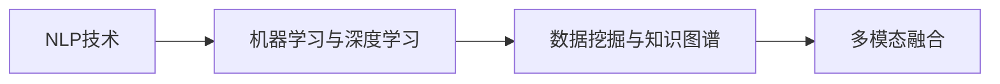

                 

### 文章标题

# AIGC的哲学思辨能力：深度问题探讨的提示词工程

> 关键词：AIGC、哲学思辨、深度问题、提示词工程

> 摘要：本文深入探讨AIGC（自适应智能生成内容）的哲学思辨能力，通过分析其核心概念与特征，运用提示词工程方法解决深度问题，为AIGC在各个领域的应用提供新的视角和思路。

## 前言

在当今世界，人工智能技术正以前所未有的速度发展和变革着各个领域。特别是AIGC（自适应智能生成内容）技术的出现，为内容创作、数据分析和决策制定等领域带来了全新的可能性。AIGC不仅具有强大的生成能力，还逐渐展现出哲学思辨的潜力，这为我们提供了新的研究方向和思考维度。

本文旨在探讨AIGC的哲学思辨能力，并运用提示词工程方法来探讨深度问题。我们将首先介绍AIGC的基本概念和哲学思辨能力的内涵，然后详细分析提示词工程的原理和方法，并以此为基础探讨一些具有挑战性的深度问题。通过本文的探讨，我们希望能够为AIGC技术的进一步发展提供一些新的思考和方向。

## 第一部分: AIGC与哲学思辨能力

### 第1章: AIGC的概述

#### 1.1 AIGC的概念与定义

AIGC（Adaptive Intelligent Generated Content），即自适应智能生成内容，是一种利用人工智能技术，根据用户的输入和需求，自动生成高质量内容的方法。AIGC通过深度学习、自然语言处理和知识图谱等技术，能够实现文本、图像、音频等多种类型内容的生成。

AIGC的定义可以概括为以下几个关键点：

1. **自适应**：AIGC能够根据用户的需求和输入，动态调整生成策略和内容类型。
2. **智能**：AIGC基于深度学习和机器学习算法，具有自主学习和优化的能力。
3. **生成内容**：AIGC的最终目标是生成具有高质量和实用价值的内容。

#### 1.2 AIGC的发展背景

AIGC的发展可以追溯到深度学习和自然语言处理技术的兴起。随着计算能力的提升和数据规模的扩大，深度学习模型在图像识别、语音识别和自然语言处理等领域的表现越来越优秀。这些技术的进步为AIGC的实现提供了坚实的基础。

近年来，随着互联网和社交媒体的快速发展，人们对内容的需求日益增长。传统的手动内容创作已经无法满足市场的需求，因此，AIGC作为一种高效的自动化生成方式，逐渐受到关注和应用。

#### 1.3 AIGC与哲学思辨能力的关系

AIGC的哲学思辨能力指的是其在生成内容过程中所体现的抽象思维、逻辑推理和创造性等哲学层面的能力。虽然AIGC本身没有意识，但它在处理复杂问题和生成创新内容时，确实展现出了一定的哲学思辨特点。

AIGC与哲学思辨能力的关系可以从以下几个方面来理解：

1. **抽象思维**：AIGC能够通过深度学习从大量数据中提取出抽象的特征和模式，这种抽象思维能力与哲学中的抽象思维有相似之处。
2. **逻辑推理**：AIGC在生成内容时，往往需要遵循一定的逻辑规则和结构，这与哲学中的逻辑推理方法有相通之处。
3. **创造性**：AIGC在生成内容时，往往能够产生出新颖和独特的想法，这体现了其创造性能力，与哲学中的创造性思维有相似之处。

### 第2章: 哲学思辨能力核心概念与联系

#### 2.1 哲学思辨能力的定义与特征

哲学思辨能力是指人类在思考和探究世界时所具备的抽象思维能力、逻辑推理能力和创造性能力。具体来说，它包括以下几个特征：

1. **抽象思维能力**：能够从具体的实例中提炼出一般性的概念和原则。
2. **逻辑推理能力**：能够运用逻辑规则和结构进行推理，得出合理的结论。
3. **创造性能力**：能够在思考和创作过程中产生新颖和独特的想法。

#### 2.2 哲学思辨能力与其他认知能力的对比

哲学思辨能力与其他认知能力如观察力、记忆力、注意力等有所不同。观察力主要是指对事物的感知和认知，记忆力是指对信息的存储和回忆，注意力是指对特定事物的集中和关注。而哲学思辨能力更侧重于对信息的抽象、推理和创新。

以下是一个对比表格，展示了哲学思辨能力与其他认知能力的主要区别：

| 认知能力 | 主要特征 | 举例 |
| --- | --- | --- |
| 观察力 | 感知和认知事物的能力 | 观察一朵花的颜色和形状 |
| 记忆力 | 信息存储和回忆的能力 | 回忆昨天的日程安排 |
| 注意力 | 集中和关注特定事物的能力 | 集中精力完成工作任务 |
| 哲学思辨能力 | 抽象、推理和创新能力 | 提炼出“公正”这一概念，并探讨其在社会中的意义 |

#### 2.3 AIGC的哲学思辨能力结构解析

AIGC的哲学思辨能力可以分解为以下几个组成部分：

1. **数据预处理**：AIGC通过对大量数据进行预处理，提取出关键特征和模式，这是抽象思维能力的体现。
2. **模型训练**：AIGC通过深度学习模型对数据进行分析和训练，这是逻辑推理能力的体现。
3. **内容生成**：AIGC根据训练结果生成新的内容，这是创造性能力的体现。

以下是一个简单的ER实体关系图，展示了AIGC哲学思辨能力的结构：

```mermaid
erDiagram
    AIGC philosophical reasoning <-|{ Data preprocessing }|-
    AIGC philosophical reasoning <-|{ Model training }|-
    AIGC philosophical reasoning <-|{ Content generation }|-
```

通过以上分析，我们可以看到AIGC的哲学思辨能力是一个复杂的过程，涉及到数据的抽象、模型的推理和内容的生成。这些能力使得AIGC在处理深度问题时具有独特的优势。

### 第3章: 深度问题探讨

#### 3.1 深度问题的定义与分类

深度问题是指在信息处理、决策制定、知识发现等领域中，需要深入分析和解决的问题。深度问题通常具有以下几个特点：

1. **复杂性**：深度问题往往涉及多个层面和维度，需要综合考虑各种因素。
2. **不确定性**：深度问题往往存在多种可能性，难以准确预测和确定。
3. **动态性**：深度问题通常需要在不断变化的环境中进行分析和解决。

根据深度问题的不同特点，我们可以将其分为以下几类：

1. **复杂性问题**：如复杂的系统建模、优化问题等。
2. **不确定性问题**：如天气预测、金融市场分析等。
3. **动态性问题**：如智能交通管理、智能推荐系统等。

#### 3.2 深度问题探讨的方法与工具

探讨深度问题需要运用多种方法和工具，以下是几种常用的方法：

1. **数据分析**：通过数据收集、预处理、分析和可视化，揭示数据中的模式和规律。
2. **机器学习**：通过构建和训练模型，实现对未知数据的预测和分析。
3. **智能优化**：运用启发式算法和优化方法，寻找最优解或近似最优解。
4. **多代理系统**：通过多个智能体之间的协作和竞争，实现复杂问题的求解。

以下是一个简单的mermaid流程图，展示了探讨深度问题的基本流程：


#### 3.3 典型深度问题案例分析

为了更好地理解深度问题的探讨方法，我们来看几个典型案例：

1. **智能交通管理**：智能交通管理是一个复杂的动态问题，需要考虑交通流量、道路状况、车辆类型等多个因素。通过数据分析、机器学习和智能优化方法，可以实现对交通拥堵的预测和管理。
2. **金融市场分析**：金融市场分析涉及大量历史数据，需要预测市场走势和风险。通过数据分析、机器学习和智能优化方法，可以构建市场预测模型，为投资者提供决策支持。
3. **智能推荐系统**：智能推荐系统需要考虑用户行为、兴趣和内容特征等多个因素，通过数据分析、机器学习和智能优化方法，可以生成个性化的推荐结果。

这些案例展示了深度问题探讨的方法和工具，同时也体现了AIGC在哲学思辨能力方面的应用潜力。

## 第二部分: 提示词工程方法

### 第4章: 提示词工程的基本原理

#### 4.1 提示词工程的概念与目的

提示词工程（Prompt Engineering）是指通过构建和优化提示词，引导人工智能系统（如AIGC）生成高质量内容和解答问题的技术。提示词是用户向AI系统输入的信息，用以引导AI系统进行特定任务的处理。

提示词工程的目的主要有以下几点：

1. **提高生成内容的质量**：通过优化提示词，可以引导AI系统生成更加准确、清晰和有针对性的内容。
2. **提升问题解决的效率**：优化的提示词能够更快速地引导AI系统找到问题解决方案，提高处理效率。
3. **增强用户体验**：通过个性化的提示词，可以提供更加贴心的服务，提升用户体验。

#### 4.2 提示词的构建与优化

提示词的构建和优化是提示词工程的核心内容，主要包括以下几个步骤：

1. **明确任务目标**：首先需要明确AI系统需要完成的任务目标，如内容创作、问题解答、决策制定等。
2. **分析输入信息**：分析用户输入的信息，提取关键特征和关键信息，作为提示词的构建基础。
3. **构建初步提示词**：根据任务目标和输入信息，构建初步的提示词，确保其能够引导AI系统朝正确的方向处理任务。
4. **优化提示词**：通过实验和反馈，不断优化提示词，提高其引导效果。优化的方法包括调整提示词的长度、格式、关键词等。
5. **评估提示词效果**：通过实际任务测试，评估提示词的引导效果，根据评估结果进行调整。

以下是一个简单的mermaid流程图，展示了提示词工程的构建与优化流程：


#### 4.3 提示词工程的技术手段

提示词工程的实现需要运用多种技术手段，以下是一些常用的技术：

1. **自然语言处理（NLP）**：NLP技术可以帮助提取输入信息的语义和关键信息，为提示词的构建提供支持。
2. **机器学习与深度学习**：通过训练和优化模型，可以实现对提示词的自动生成和优化。
3. **数据挖掘与知识图谱**：通过数据挖掘和知识图谱技术，可以提取出大量有用的信息，为提示词的构建提供丰富的知识基础。
4. **多模态融合**：将文本、图像、音频等多种模态的信息进行融合，可以提供更加全面和准确的提示词。

以下是一个mermaid流程图，展示了提示词工程中常用的技术手段：



通过以上分析，我们可以看到提示词工程在构建和优化提示词方面具有丰富的技术手段和方法，这些手段和方法共同作用，可以提高AIGC生成内容和解决深度问题的能力。

### 第5章: 提示词工程应用实例

#### 5.1 提示词工程在自然语言处理中的应用

自然语言处理（NLP）是AIGC的重要应用领域之一，提示词工程在NLP中发挥了重要作用。以下是一些典型的应用实例：

1. **文本生成**：通过构建和优化提示词，可以引导AIGC生成高质量的文本内容。例如，在生成新闻报道、产品描述、学术论文等方面，提示词可以提供关键信息和背景知识，帮助AIGC生成准确、清晰的文本。
2. **问答系统**：在问答系统中，提示词用于引导AIGC理解用户的问题，并提供相应的答案。通过优化提示词，可以提升问答系统的准确性和响应速度。例如，在智能客服、在线教育、医疗咨询等领域，提示词工程可以帮助构建高效的问答系统。
3. **情感分析**：通过构建和优化提示词，可以引导AIGC对文本进行情感分析，识别文本中的情感倾向。例如，在社交媒体分析、市场调研、客户反馈分析等方面，提示词工程可以帮助识别用户情感，提供有针对性的分析和建议。

以下是一个mermaid流程图，展示了提示词工程在NLP中的应用：


#### 5.2 提示词工程在计算机视觉中的应用

计算机视觉是AIGC的另一个重要应用领域，提示词工程在计算机视觉中也有广泛应用。以下是一些典型的应用实例：

1. **图像生成**：通过构建和优化提示词，可以引导AIGC生成高质量的图像内容。例如，在艺术创作、广告设计、游戏开发等领域，提示词工程可以帮助AIGC生成具有创意和个性化的图像。
2. **目标检测与识别**：在目标检测与识别任务中，提示词用于引导AIGC识别和定位图像中的目标对象。通过优化提示词，可以提升目标检测和识别的准确性和效率。例如，在自动驾驶、安全监控、医疗影像分析等领域，提示词工程可以帮助提高系统的性能和可靠性。
3. **图像增强与修复**：通过构建和优化提示词，可以引导AIGC对图像进行增强和修复，提高图像的质量和清晰度。例如，在摄影后期处理、文物修复、医疗影像处理等领域，提示词工程可以帮助改善图像效果，提升视觉效果。

以下是一个mermaid流程图，展示了提示词工程在计算机视觉中的应用：


#### 5.3 提示词工程在其他领域中的应用

除了自然语言处理和计算机视觉，提示词工程在其他领域也有广泛的应用。以下是一些典型的应用实例：

1. **知识图谱构建**：通过构建和优化提示词，可以引导AIGC生成和优化知识图谱。例如，在知识图谱构建、智能问答、推荐系统等领域，提示词工程可以帮助提高系统的知识表示和推理能力。
2. **决策支持系统**：通过构建和优化提示词，可以引导AIGC提供决策支持。例如，在商业智能、金融风控、医疗诊断等领域，提示词工程可以帮助分析数据、提取关键信息，为决策者提供有价值的建议。
3. **智能对话系统**：通过构建和优化提示词，可以引导AIGC与用户进行智能对话。例如，在智能客服、虚拟助手、智能家居等领域，提示词工程可以帮助提高系统的交互能力和用户体验。

以下是一个mermaid流程图，展示了提示词工程在其他领域中的应用：


通过以上分析，我们可以看到提示词工程在多个领域都发挥了重要作用，其应用实例涵盖了自然语言处理、计算机视觉、知识图谱构建、决策支持系统等。随着AIGC技术的不断发展，提示词工程的应用前景将更加广泛。

### 第6章: 深度问题与提示词工程的应用实践

#### 6.1 实践案例1：通过提示词工程探讨伦理问题

伦理问题是一个具有挑战性的深度问题，涉及到道德原则、社会价值观和行为规范。通过提示词工程，我们可以探讨伦理问题的本质，并寻找合理的解决方案。

**案例背景**：随着人工智能技术的发展，越来越多的伦理问题浮现出来，如隐私保护、算法偏见、自动化决策等。这些问题的解决需要深入思考和全面分析。

**实现步骤**：

1. **明确任务目标**：确定需要探讨的伦理问题，如隐私保护。
2. **分析输入信息**：收集与隐私保护相关的数据和文献，提取关键信息和观点。
3. **构建初步提示词**：设计初步的提示词，引导AIGC分析隐私保护的重要性和挑战。
4. **优化提示词**：通过实验和反馈，调整提示词的格式和关键词，提高引导效果。
5. **评估提示词效果**：通过实际讨论和专家反馈，评估提示词的引导效果。

**具体示例**：

假设我们要探讨“人工智能在隐私保护方面的应用和挑战”，可以设计以下提示词：

- “请分析人工智能在隐私保护方面的优势和局限性。”
- “请讨论如何平衡隐私保护和数据利用的矛盾。”

通过这些提示词，AIGC可以生成相关的内容，帮助我们从不同角度理解和解决隐私保护问题。

#### 6.2 实践案例2：通过提示词工程解决艺术创作难题

艺术创作是一个充满创造性和个性化的过程，但有时也会面临一些难题，如创意枯竭、风格不统一等。通过提示词工程，我们可以引导AIGC解决这些艺术创作难题。

**案例背景**：一位艺术家想要创作一幅新的画作，但感觉缺乏灵感和创意。

**实现步骤**：

1. **明确任务目标**：确定需要解决的艺术创作难题，如创意枯竭。
2. **分析输入信息**：收集与艺术创作相关的数据和素材，提取关键元素和风格特点。
3. **构建初步提示词**：设计初步的提示词，引导AIGC提供创意和建议。
4. **优化提示词**：通过实验和反馈，调整提示词的格式和关键词，提高引导效果。
5. **评估提示词效果**：通过实际创作和艺术家反馈，评估提示词的引导效果。

**具体示例**：

假设我们要解决“创意枯竭”的问题，可以设计以下提示词：

- “请根据输入的灵感来源，生成一幅具有独特风格的画作。”
- “请提供五种不同的艺术风格，供艺术家参考。”

通过这些提示词，AIGC可以生成相关的画作和艺术风格建议，帮助艺术家突破创作难题，找到新的灵感。

#### 6.3 实践案例3：通过提示词工程优化决策过程

决策过程是一个复杂的过程，涉及到信息收集、分析、评估和选择等多个环节。通过提示词工程，我们可以优化决策过程，提高决策的效率和准确性。

**案例背景**：一家公司需要做出重要决策，如投资新产品或拓展新市场。

**实现步骤**：

1. **明确任务目标**：确定需要优化的决策过程，如投资决策。
2. **分析输入信息**：收集与投资相关的数据和报告，提取关键信息和风险因素。
3. **构建初步提示词**：设计初步的提示词，引导AIGC提供决策分析和建议。
4. **优化提示词**：通过实验和反馈，调整提示词的格式和关键词，提高引导效果。
5. **评估提示词效果**：通过实际决策和公司管理层反馈，评估提示词的引导效果。

**具体示例**：

假设我们要优化“投资决策”过程，可以设计以下提示词：

- “请分析投资新产品可能带来的收益和风险。”
- “请根据市场数据和竞争对手情况，提供投资建议。”

通过这些提示词，AIGC可以生成相关的决策分析和建议，帮助公司做出更加科学和合理的决策。

通过以上实践案例，我们可以看到提示词工程在解决深度问题方面的应用潜力。无论是伦理问题、艺术创作还是决策过程，提示词工程都能提供有效的指导和帮助。随着技术的不断进步，提示词工程将发挥越来越重要的作用。

### 第7章: 提示词工程的最佳实践与未来展望

#### 7.1 提示词工程的最佳实践技巧

在实践提示词工程时，为了达到最佳效果，以下是一些最佳实践技巧：

1. **明确任务目标**：在开始构建提示词之前，首先要明确任务目标，确保提示词能够引导AIGC朝正确的方向处理任务。
2. **深入分析输入信息**：分析输入信息，提取关键特征和关键信息，这些信息将直接影响提示词的构建和优化。
3. **优化提示词格式**：提示词的格式和结构对AIGC的生成效果有重要影响。通过调整提示词的格式，如使用疑问句、命令句等，可以提高引导效果。
4. **实验与反馈**：通过实验和反馈不断优化提示词，确保其能够有效引导AIGC完成任务。实验过程中，可以收集用户反馈，分析提示词的引导效果，并根据反馈进行相应的调整。
5. **跨领域知识融合**：在构建和优化提示词时，可以融合跨领域的知识，提高提示词的全面性和准确性。例如，在解决自然语言处理问题时，可以结合计算机视觉、数据挖掘等领域的知识。
6. **保持简洁性**：提示词应尽量简洁明了，避免冗长和复杂，以确保AIGC能够快速理解和执行。

#### 7.2 提示词工程的未来发展趋势

随着人工智能技术的不断进步，提示词工程在未来将呈现出以下发展趋势：

1. **多模态融合**：未来的提示词工程将更加注重多模态数据的融合，如文本、图像、音频等，以提供更加全面和准确的信息。
2. **个性化推荐**：通过个性化推荐技术，提示词工程将能够根据用户的行为和偏好，提供定制化的提示词，提高用户体验。
3. **增强学习**：提示词工程将结合增强学习技术，通过不断学习和优化，提高提示词的生成效果和准确性。
4. **知识图谱应用**：知识图谱在提示词工程中的应用将更加广泛，通过构建和优化知识图谱，可以提供更加丰富和准确的信息，提高提示词的引导效果。
5. **伦理和隐私考虑**：随着人工智能技术的应用越来越广泛，提示词工程将更加注重伦理和隐私问题，确保生成内容和决策过程的公正性和透明性。

#### 7.3 提示词工程在社会与伦理方面的考量

提示词工程在社会与伦理方面也面临着一些挑战和考量：

1. **公平性和偏见**：提示词工程可能引入公平性和偏见问题。为了确保提示词的公平性和准确性，需要采取相应的措施，如数据清洗、模型训练和优化等。
2. **隐私保护**：在构建和优化提示词时，需要关注隐私保护问题，确保用户数据和生成内容的安全性。
3. **透明性和可解释性**：提示词工程应具备透明性和可解释性，用户可以理解和追踪提示词的生成过程和决策过程。
4. **责任归属**：在提示词工程应用过程中，需要明确责任归属，确保各方在出现问题时有明确的责任界定。

通过以上分析，我们可以看到提示词工程在应用实践中具有广泛的前景和潜力。在未来，随着技术的不断进步和社会的不断发展，提示词工程将在各个领域发挥更加重要的作用。

### 结尾

通过对AIGC的哲学思辨能力和提示词工程的深入探讨，我们不仅了解了它们的基本概念和原理，还看到了它们在解决深度问题中的应用潜力。AIGC的哲学思辨能力使得它能够在复杂的场景中进行分析和决策，而提示词工程则为其提供了有效的引导和支持。

未来，随着人工智能技术的不断进步，AIGC和提示词工程将在各个领域得到更广泛的应用，为人类带来更多的创新和便利。同时，我们也需要关注其在社会和伦理方面带来的挑战，确保其发展的可持续性和公正性。

让我们共同期待AIGC和提示词工程在未来带来更多的惊喜和突破。

### 作者信息

作者：AI天才研究院/AI Genius Institute & 禅与计算机程序设计艺术 /Zen And The Art of Computer Programming

感谢您的阅读！希望本文对您在AIGC和提示词工程领域的探索有所启发。如果您有任何问题或建议，欢迎在评论区留言交流。让我们一起探讨人工智能的未来！

