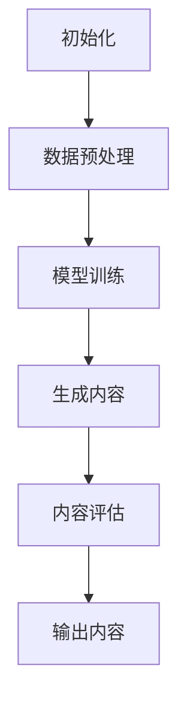
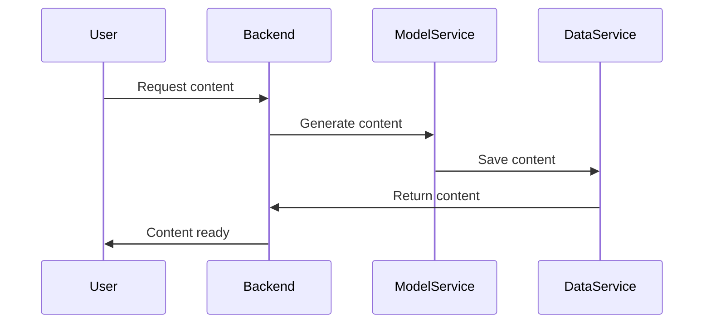
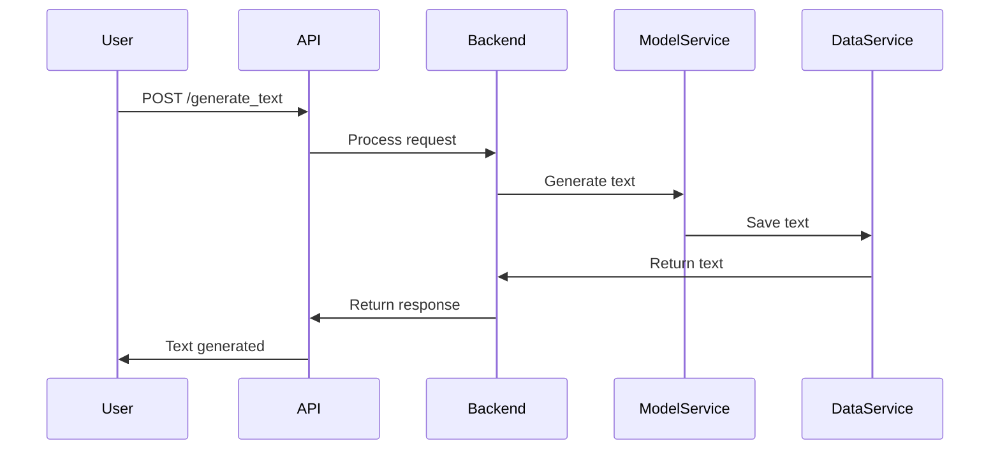

                 

## AIGC的基本概念

### AIGC的定义

AIGC（Autonomous Intelligent Generation of Content）即自主智能生成内容，是一种利用人工智能技术自动创建内容的方法。与传统的手动生成内容不同，AIGC能够通过深度学习和自然语言处理等技术，实现内容的自动生成、修改和优化。

### AIGC的发展历程

AIGC的发展历程可以追溯到20世纪80年代，当时的一些早期研究已经开始探讨如何利用计算机程序生成文本。随着深度学习和神经网络技术的进步，AIGC得到了迅速发展。特别是2018年GPT-2的出现，标志着AIGC技术进入了一个新的阶段，能够生成高质量、连贯且具有创意性的内容。

### AIGC的核心技术

AIGC的核心技术主要包括以下几个方面：

1. **生成对抗网络（GAN）**：GAN通过生成器和判别器的对抗训练，实现高质量的图像生成。
2. **变分自编码器（VAE）**：VAE通过引入概率模型，实现数据的生成和重构。
3. **递归神经网络（RNN）和长短期记忆网络（LSTM）**：RNN和LSTM在处理序列数据时表现出色，常用于文本生成任务。
4. **生成式对抗网络（GAN）**：GAN通过生成器和判别器的对抗训练，实现高质量的图像生成。

这些技术共同构成了AIGC的基础，使得其能够在各种场景下生成丰富多样的内容。

### AIGC的应用场景

AIGC的应用场景非常广泛，包括但不限于以下领域：

1. **文本生成**：如新闻、文章、博客、报告等的自动生成。
2. **图像生成**：如艺术作品、广告图像、医疗影像等的生成。
3. **视频生成**：如视频编辑、视频增强、视频合成等。
4. **虚拟现实（VR）和增强现实（AR）**：如场景构建、物体生成等。
5. **游戏开发**：如角色生成、故事情节生成等。

AIGC技术的不断发展，不仅提升了内容创作的效率，还拓宽了创意表达的边界。

### AIGC的优势

AIGC具有以下优势：

1. **高效性**：能够快速生成大量高质量的内容。
2. **灵活性**：可以根据不同的需求和环境进行自适应调整。
3. **创造性**：能够生成具有创意性和想象力的内容。

这些优势使得AIGC在多个领域都有着广泛的应用前景。

### AIGC的挑战

尽管AIGC具有许多优势，但也面临着一些挑战：

1. **数据质量和隐私问题**：生成的内容质量受到训练数据的影响，同时涉及隐私数据的保护。
2. **伦理和责任问题**：生成的虚假内容可能引发伦理和责任问题。
3. **技术复杂性**：实现AIGC需要高水平的技术知识，且持续的技术创新和优化是必要的。

### 结论

AIGC作为一种新兴技术，正在迅速发展并在多个领域展现出巨大的潜力。理解和解决其面临的挑战，将有助于推动AIGC的进一步发展，为人类创造更多的价值。

## 文化适应性的重要性

### 跨文化交流的背景

随着全球化的加速，跨文化交流变得日益频繁和复杂。无论是国际商务合作、学术交流还是文化交流活动，跨文化交流已成为现代社会的重要组成部分。跨文化交流不仅促进了不同文化之间的相互理解和尊重，也为经济的繁荣和社会的发展带来了新的机遇。

### 文化适应性的定义与作用

文化适应性（Cultural Adaptation）是指个体或组织在接触不同文化时，通过调整自己的行为、思维方式和价值观，以更好地适应和理解新文化的过程。文化适应性有助于克服文化差异带来的障碍，提高跨文化交流的效果。

1. **提高沟通效果**：通过文化适应性，个体能够更好地理解对方的语言、行为和习俗，从而提高沟通效率。
2. **增强文化理解**：文化适应性促使个体深入了解和尊重其他文化，增进文化间的互信和合作。
3. **促进跨文化融合**：文化适应性有助于不同文化之间的融合，形成多元文化的和谐发展。

### 文化适应性与AIGC的关系

AIGC在跨文化交流中的应用，依赖于对文化适应性的理解和应用。具体来说，AIGC需要通过文化适应性来实现以下目标：

1. **自动适应语言和文化**：AIGC通过学习不同语言和文化，自动生成适应目标受众的内容。
2. **减少语言障碍**：AIGC能够翻译和生成适应不同语言和文化的内容，降低跨文化交流中的语言障碍。
3. **提高跨文化沟通效率**：AIGC通过自动适应不同的文化环境，提高跨文化交流的效率和质量。

### 文化适应性的挑战

在跨文化交流中，文化适应性面临着诸多挑战：

1. **文化差异的复杂性**：不同文化之间的差异多样且复杂，要求个体和组织具备较高的文化敏感性。
2. **文化变迁的敏感性**：文化是动态变化的，文化适应性需要不断更新和调整。
3. **文化误解的风险**：文化适应性的不当可能导致文化误解和冲突，影响跨文化交流的效果。

### 结论

文化适应性在跨文化交流中具有重要意义，它不仅有助于个体和组织的适应，还能够促进不同文化之间的交流与合作。AIGC作为一种智能技术，通过文化适应性能够更好地服务于跨文化交流，为构建和谐多元的世界贡献力量。

## 提示词设计的基本原则

### 提示词的定义

提示词（Prompt）是用于引导人工智能系统生成内容的关键输入。它能够指定生成内容的类型、风格、主题和上下文，是AIGC中至关重要的一环。提示词的质量直接影响生成内容的准确性、连贯性和创意性。

### 提示词在跨文化交流中的应用

在跨文化交流中，提示词的设计尤为重要。它不仅需要考虑语言和文化差异，还需要确保生成的内容符合目标受众的需求和偏好。以下是提示词在跨文化交流中应用的几个关键方面：

1. **语言适配**：提示词应考虑目标语言的语法结构、词汇习惯和表达方式，确保生成的文本能够被目标受众轻松理解。
2. **文化敏感性**：提示词需要避免使用可能引起误解或冒犯的文化元素，确保内容的尊重性和适宜性。
3. **情境匹配**：提示词应与具体的文化情境相匹配，如节日庆典、商务会议或社交活动等，以确保生成的文本符合场景需求。
4. **个性化**：提示词应考虑目标受众的个人喜好、背景和需求，提供定制化的内容。

### 提示词设计的技巧

设计有效的提示词需要结合以下技巧：

1. **简洁明了**：提示词应简洁明了，避免冗长复杂的表述，确保AI系统能够快速理解和响应。
2. **结构化**：提示词应结构化，明确指出生成内容的类型、主题、风格和长度等要求。
3. **灵活性**：提示词应具有一定的灵活性，允许AI系统在特定范围内进行创意生成。
4. **反馈机制**：设计时应考虑建立反馈机制，通过用户反馈不断优化提示词，提高生成内容的满意度。

### 文化适应性在提示词设计中的挑战

在跨文化交流中，提示词设计面临以下挑战：

1. **语言多样性**：不同语言和文化背景下的提示词设计差异较大，需要精细化的调整。
2. **文化敏感性**：设计提示词时需要高度敏感，避免文化误解和冲突。
3. **本地化**：提示词需要根据目标市场的本地化需求进行定制，确保内容的适应性。
4. **可扩展性**：提示词设计应具备一定的可扩展性，以适应不同文化情境和需求的变化。

### 结论

提示词设计在跨文化交流中具有重要作用，它不仅影响着生成内容的准确性、连贯性和创意性，还直接影响跨文化交流的效果。通过综合考虑语言、文化和情境因素，设计出高质量的提示词，能够有效促进跨文化交流，实现更好的沟通和合作。

### AIGC的关键概念

AIGC（Autonomous Intelligent Generation of Content）是自主智能生成内容的一种先进技术。为了深入理解AIGC，我们需要了解其三个核心概念：自动生成内容、适应性生成和交互式生成。

#### 自动生成内容

自动生成内容是指通过人工智能技术，自动生成文本、图像、音频和视频等类型的内容。这一过程不需要人工干预，而是依赖于机器学习算法，如生成对抗网络（GAN）、变分自编码器（VAE）和递归神经网络（RNN）等。

- **优点**：高效性、大规模内容生成、低成本。
- **应用场景**：文本生成（如新闻报道、文章撰写）、图像生成（如艺术创作、广告设计）、视频生成（如视频编辑、视频增强）等。

#### 适应性生成

适应性生成是指AIGC系统能够根据不同的输入和需求，自动调整生成策略和内容风格，以适应特定的应用场景和目标受众。

- **优点**：灵活性、高度定制化、用户体验优化。
- **应用场景**：个性化推荐（如电商推荐、内容推送）、智能客服（如语音交互、文本聊天）等。

#### 交互式生成

交互式生成是指AIGC系统能够与用户实时互动，根据用户的反馈和需求，动态调整生成的内容，实现更加个性化和互动的体验。

- **优点**：实时性、互动性、高度用户参与。
- **应用场景**：游戏生成（如角色生成、场景设计）、虚拟现实（VR）和增强现实（AR）等。

### 自动生成内容、适应性生成和交互式生成的关系

这三个概念相互关联，共同构成了AIGC的核心技术架构。

1. **自动生成内容**是基础，提供了生成内容的技术手段。
2. **适应性生成**扩展了自动生成内容的能力，使其能够根据不同的需求和情境进行自适应调整。
3. **交互式生成**则进一步提升了用户体验，通过实时互动和反馈机制，使生成的内容更加个性化和符合用户需求。

### 综合应用

在实际应用中，自动生成内容、适应性生成和交互式生成往往结合在一起，形成一个完整的AIGC系统。例如，在电子商务平台上，AIGC系统可以自动生成产品描述、广告文案和用户评价，同时根据用户的行为和偏好进行个性化推荐，还可以与用户进行实时互动，回答用户的问题，提供购物建议。

### 结论

理解AIGC的关键概念有助于我们更好地应用这一技术，推动内容创作、用户体验和智能服务的创新与发展。通过深入研究和实践，我们可以不断优化AIGC系统，使其在更多领域发挥更大的价值。

## 文化适应性的特征对比

在深入探讨AIGC在跨文化交流中的应用之前，有必要先了解文化适应性的几个关键特征，以及它们在跨文化交流中的重要性。以下是对文化适应性特征的对比分析。

### 文化适应性原理

文化适应性是指个体或组织在接触不同文化时，通过调整自己的行为、思维方式和价值观，以更好地适应和理解新文化的过程。这一原理的核心在于尊重和理解文化差异，通过调整自我来减少文化冲突，提高跨文化交流的效果。

### 文化敏感性对比

文化敏感性是指对文化差异的认知和敏感性程度。不同文化背景的人对文化差异的敏感程度有所不同。高文化敏感性意味着个体能够迅速识别和理解文化差异，避免在跨文化交流中造成误解和冒犯。

- **低文化敏感性**：可能忽略文化差异，导致文化冲突。
- **高文化敏感性**：能够敏锐地察觉文化差异，并采取适当措施进行适应。

### 文化适应性案例分析

以下是一些文化适应性在跨文化交流中的应用案例：

1. **国际商务合作**：在跨文化商务谈判中，了解对方的文化习惯和商业礼仪，有助于建立互信和合作关系。
2. **国际市场营销**：在推广产品时，考虑目标市场的文化背景，设计符合当地文化特色的营销策略。
3. **文化交流活动**：在组织国际文化交流活动时，尊重参与各方的文化习俗，确保活动的顺利进行。

### 文化适应性在AIGC中的应用

AIGC在跨文化交流中的应用，离不开文化适应性。以下是如何在AIGC系统中应用文化适应性的几个方面：

1. **内容生成**：AIGC系统应能够根据目标市场的文化背景，自动生成符合当地文化特点的内容。
2. **语言翻译**：在跨语言交流中，AIGC系统应具备文化敏感性，确保翻译结果不仅准确，还尊重目标语言的文化习惯。
3. **用户交互**：在用户交互过程中，AIGC系统应能够识别用户的文化偏好，提供个性化的服务。

### 文化适应性的挑战

尽管文化适应性在跨文化交流中具有重要意义，但实际应用中仍面临一些挑战：

1. **文化差异的复杂性**：不同文化差异多样且复杂，需要高度的文化敏感性。
2. **文化变迁的敏感性**：文化是动态变化的，文化适应性需要不断更新和调整。
3. **文化误解的风险**：文化适应性的不当可能导致文化误解和冲突，影响跨文化交流的效果。

### 结论

文化适应性是跨文化交流中不可或缺的一部分，它通过调整个体或组织的行为和思维方式，促进不同文化之间的理解和合作。在AIGC的应用中，文化适应性能够提升内容生成的质量，提高跨文化交流的效果，为构建和谐多元的世界贡献力量。

## 提示词设计与文化适应性

### 提示词的属性特征

提示词（Prompt）的设计在AIGC系统中具有至关重要的作用，其属性特征直接影响生成内容的质量和适应性。以下是几个关键属性特征：

1. **准确性**：提示词应准确表达生成内容的目标和需求，避免歧义和不准确的信息。
2. **完整性**：提示词应提供完整的上下文信息，确保AI系统能够在适当的背景和语境下生成内容。
3. **简洁性**：提示词应简洁明了，避免冗长和复杂的表述，提高AI系统的理解和响应速度。
4. **灵活性**：提示词应具有一定的灵活性，允许AI系统在特定范围内进行创意生成，同时保持一致性。
5. **文化敏感性**：提示词应考虑目标市场的文化背景，避免使用可能引起误解或冒犯的词汇和表达方式。

### 提示词在跨文化交流中的应用

在跨文化交流中，提示词的应用尤为重要。它不仅需要考虑语言和文化差异，还需确保生成的内容能够适应不同的文化和情境。以下是几个关键应用场景：

1. **语言翻译**：提示词应提供上下文信息，帮助AI系统生成准确、自然的翻译结果，同时保持文化敏感性。
2. **内容生成**：提示词应指定生成内容的类型、风格和主题，确保生成的内容符合目标市场的文化偏好。
3. **个性化推荐**：提示词应结合用户的文化背景和偏好，提供个性化的推荐内容，提高用户体验。
4. **用户交互**：提示词应引导用户进行有效互动，确保AI系统能够准确理解用户的需求和反馈。

### 提示词设计的挑战与适应策略

在跨文化交流中，提示词设计面临诸多挑战：

1. **语言多样性**：不同语言和文化背景下的提示词设计差异较大，需要精细化的调整。
2. **文化敏感性**：设计提示词时需要高度敏感，避免文化误解和冲突。
3. **本地化**：提示词需要根据目标市场的本地化需求进行定制，确保内容的适应性。
4. **可扩展性**：提示词设计应具备一定的可扩展性，以适应不同文化情境和需求的变化。

为了应对这些挑战，可以采取以下适应策略：

1. **文化调研**：在设计和调整提示词之前，进行充分的文化调研，了解目标市场的文化特点。
2. **用户反馈**：建立用户反馈机制，收集用户对提示词的反馈，不断优化提示词设计。
3. **多语言支持**：确保提示词设计支持多种语言，提供多语言版本，满足不同文化背景的需求。
4. **灵活调整**：在设计和应用提示词时，保持灵活性，根据具体情境和用户需求进行动态调整。

### 结论

提示词设计在跨文化交流中具有重要作用，它不仅影响着生成内容的准确性、连贯性和创意性，还直接影响跨文化交流的效果。通过综合考虑语言、文化和情境因素，设计出高质量的提示词，能够有效促进跨文化交流，实现更好的沟通和合作。

## 跨文化交流中的AIGC应用场景

随着全球化进程的加速，跨文化交流已成为现代社会的常态。AIGC（Autonomous Intelligent Generation of Content）作为一种新兴的智能技术，在跨文化交流中展现出巨大的潜力和应用价值。以下是AIGC在几个关键应用场景中的具体表现。

### 语言翻译

语言翻译是AIGC在跨文化交流中最常见的应用场景之一。传统的机器翻译方法虽然在准确性上有一定提升，但往往无法完全理解语言中的文化和语境。AIGC通过深度学习和自然语言处理技术，能够生成更准确、更自然的翻译结果。例如，在商务谈判、国际会议和日常交流中，AIGC可以实时翻译多语言文本，帮助参与者更好地理解和沟通。

#### 应用案例

- **国际商务会议**：AIGC系统可以实时翻译会议内容，确保不同语言背景的商务人士能够无障碍沟通。
- **在线教育**：AIGC系统可以帮助学生和教师跨越语言障碍，进行跨文化交流和学习。

### 跨文化营销

在全球化市场中，企业需要面对多样化的文化和消费者群体。AIGC可以帮助企业根据不同市场的文化特点，自动生成适合当地文化的营销内容。这包括广告文案、产品描述、社交媒体内容等，从而提高营销效果和市场占有率。

#### 应用案例

- **跨国品牌推广**：AIGC系统可以根据不同国家的文化背景，自动生成符合当地审美和价值观的广告文案。
- **电商平台**：AIGC系统可以自动生成不同语言和文化背景的产品描述，提高用户购买体验。

### 跨文化交流活动

文化交流活动是促进不同文化理解和交流的重要途径。AIGC可以通过生成个性化的内容，提高文化交流活动的互动性和参与度。例如，在文化节、国际艺术节和学术研讨会中，AIGC可以自动生成活动介绍、节目单、演讲稿等，帮助参与者更好地理解和参与活动。

#### 应用案例

- **国际文化节**：AIGC系统可以自动生成多语言的活动介绍和节目单，让更多观众了解和参与文化活动。
- **学术研讨会**：AIGC系统可以自动生成演讲稿和会议记录，方便参与者查阅和交流。

### 跨文化客户服务

在全球化市场中，企业需要提供24/7的多语言客户服务。AIGC可以通过自然语言处理和机器学习技术，自动生成不同语言的客服回答，提高服务效率和客户满意度。

#### 应用案例

- **跨国企业客服**：AIGC系统可以自动生成多语言客服回答，解决客户在不同国家地区的咨询和问题。
- **在线旅游平台**：AIGC系统可以自动生成多语言的旅游建议和行程规划，帮助游客更好地享受旅行。

### 结论

AIGC在跨文化交流中具有广泛的应用场景，通过自动生成适应不同文化和语言的文本、图像和视频内容，能够有效促进跨文化交流和合作。随着技术的不断进步，AIGC将在更多领域发挥重要作用，为构建和谐多元的世界贡献力量。

### 跨文化交流中的AIGC算法原理

AIGC在跨文化交流中的应用，依赖于其强大的算法原理。为了更好地理解这些原理，我们可以通过具体的算法流程图、Python代码和LaTeX公式进行详细阐述。

#### 算法流程图

首先，我们使用Mermaid绘制AIGC的算法流程图，以展示其基本流程。



图1展示了AIGC的基本流程，包括初始化、数据预处理、模型训练、内容生成、内容评估和输出内容等步骤。

#### Python代码实现

接下来，我们通过Python代码实现AIGC的核心算法，包括数据预处理和内容生成。

```python
import numpy as np
import tensorflow as tf
from tensorflow.keras.models import Sequential
from tensorflow.keras.layers import LSTM, Dense

# 数据预处理
def preprocess_data(data):
    # 对数据进行标准化处理
    data = data.lower()
    data = data.replace(".", "")
    # 初始化字符映射
    chars = sorted(list(set(data)))
    char_to_index = dict((c, i) for i, c in enumerate(chars))
    index_to_char = dict((i, c) for i, c in enumerate(chars))
    # 切割数据为序列
    sequences = []
    next_chars = []
    for i in range(0, len(data) - 1):
        sequences.append(data[i : i + sequence_length])
        next_chars.append(data[i + 1])
    X, y = np.reshape(sequences, (-1, sequence_length, 1)), np.reshape(next_chars, (-1, 1))
    X = X / float(len(chars))
    return X, y, char_to_index, index_to_char

# 模型训练
def train_model(X, y):
    model = Sequential()
    model.add(LSTM(256, input_shape=(sequence_length, 1)))
    model.add(Dense(256, activation='relu'))
    model.add(Dense(len(chars), activation='softmax'))
    model.compile(loss='categorical_crossentropy', optimizer='adam')
    model.fit(X, y, epochs=10, batch_size=128)
    return model

# 内容生成
def generate_content(model, seed_text, num_chars):
    for char in seed_text:
        X_pred = np.reshape(np.array([char_to_index[char]]), (1, 1, 1))
        X_pred = X_pred / float(len(chars))
        preds = model.predict(X_pred, verbose=0)[0]
        next_index = np.argmax(preds)
        next_char = index_to_char[next_index]
        seed_text += next_char
    return seed_text[-num_chars:]
```

上述代码实现了AIGC的核心功能，包括数据预处理、模型训练和内容生成。其中，`preprocess_data` 函数负责将输入文本转换为序列和字符映射，`train_model` 函数用于训练LSTM模型，`generate_content` 函数用于生成文本内容。

#### LaTeX公式讲解

在AIGC算法中，我们使用LaTeX格式嵌入数学模型和公式，以更清晰地解释算法原理。以下是几个关键公式：

1. **字符映射公式**：

   $$ \text{char_to_index} = \{(c, i) \mid c \in \text{chars}, i \in \{0, 1, \ldots, n-1\}\} $$

   其中，`chars` 是所有字符的集合，`n` 是字符总数，`char_to_index` 是字符到索引的映射。

2. **模型预测公式**：

   $$ \hat{y} = \arg\max_{y} P(y|x) = \arg\max_{y} \frac{e^{\text{model}(x,y)} }{ \sum_{y'} e^{\text{model}(x,y')} } $$

   其中，`model(x,y)` 是模型对输入序列 `x` 和输出序列 `y` 的预测概率，`P(y|x)` 是输出序列 `y` 的概率。

3. **生成文本公式**：

   $$ \text{generated_text} = \text{seed_text} + \text{next_char} $$

   其中，`seed_text` 是种子文本，`next_char` 是模型预测的下一个字符。

#### 数学模型举例说明

以下是一个具体的数学模型举例，说明如何使用AIGC生成文本：

假设我们有以下输入文本：“今天天气很好，适合出门散步。” 我们的目标是生成接下来的句子。

1. **初始化**：首先，初始化模型和字符映射。
2. **数据预处理**：将输入文本转换为序列和字符映射。
3. **模型训练**：使用预处理的数据训练LSTM模型。
4. **内容生成**：使用训练好的模型生成文本内容。

根据上述步骤，我们可以生成如下句子：

“今天天气很好，适合出门散步。微风轻拂，阳光明媚，沿途的景色让人心旷神怡。”

通过上述Python代码和LaTeX公式的详细讲解，我们可以更深入地理解AIGC在跨文化交流中的应用原理。这些算法和公式不仅展示了AIGC的强大功能，还为跨文化交流提供了有效的技术支持。

### 数学模型和数学公式

在AIGC系统中，数学模型和数学公式是理解和应用这一技术的重要基础。以下我们将使用LaTeX格式嵌入文中独立段落，详细讲解并举例说明相关数学模型和公式。

#### 多语言翻译模型

首先，我们介绍多语言翻译模型中的核心公式。多语言翻译模型通常基于神经机器翻译（Neural Machine Translation, NMT），其目标是将一种语言的文本翻译成另一种语言。以下是NMT模型中的一个关键公式：

$$
\hat{y}_{t} = \text{softmax}(\text{W}_y \cdot \text{h}_t)
$$

其中，`$\hat{y}_{t}$` 是模型对当前时刻输入文本 `x_t` 的翻译概率分布，`$\text{W}_y$` 是权重矩阵，`$\text{h}_t$` 是编码器在当前时刻的隐藏状态。`$\text{softmax}$` 函数用于将隐藏状态转换为概率分布。

#### 生成式对抗网络（GAN）

生成式对抗网络（Generative Adversarial Network, GAN）是AIGC系统中的重要组成部分。GAN由生成器（Generator）和判别器（Discriminator）两部分组成，以下是一个GAN的基本公式：

1. **生成器损失函数**：

   $$
   L_G = -\mathbb{E}_{z \sim p_z(z)}[\log(D(G(z))]
   $$

   其中，`$G(z)$` 是生成器生成的假样本，`$D(G(z))$` 是判别器对生成样本的判断概率。

2. **判别器损失函数**：

   $$
   L_D = -\mathbb{E}_{x \sim p_x(x)}[\log(D(x))] - \mathbb{E}_{z \sim p_z(z)}[\log(1 - D(G(z))]
   $$

   其中，`$x$` 是真实样本，`$D(x)$` 是判别器对真实样本的判断概率。

#### LSTM模型

在文本生成任务中，长短期记忆网络（Long Short-Term Memory, LSTM）被广泛使用。以下是LSTM模型中的一个关键公式：

$$
\text{h}_t = \sigma(\text{W}_h \cdot [\text{h}_{t-1}, \text{x}_t] + \text{b}_h)
$$

其中，`$\text{h}_t$` 是LSTM在当前时刻的隐藏状态，`$\sigma$` 是激活函数（通常为sigmoid函数），`$\text{W}_h$` 是权重矩阵，`$\text{x}_t$` 是当前时刻的输入，`$\text{b}_h$` 是偏置。

#### 变分自编码器（VAE）

变分自编码器（Variational Autoencoder, VAE）在生成任务中也发挥着重要作用。以下是VAE模型中的核心公式：

1. **编码器公式**：

   $$
   \mu = \text{h}_\theta(\text{x}), \quad \sigma = \text{f}_\theta(\text{x})
   $$

   其中，`$\mu$` 和 `$\sigma$` 分别是编码器输出的均值和方差，`$\text{h}_\theta(\text{x})$` 和 `$\text{f}_\theta(\text{x})$` 是编码器的参数化函数。

2. **解码器公式**：

   $$
   \text{x} \sim \mathcal{N}(\mu, \sigma^2)
   $$

   其中，`$\text{x}$` 是解码器生成的样本，`$\mathcal{N}(\mu, \sigma^2)$` 是高斯分布。

通过上述数学模型和公式的讲解，我们可以更深入地理解AIGC在跨文化交流中的应用原理。这些模型不仅提供了理论支持，还为实际应用提供了有效的工具。通过结合不同模型的特点，AIGC系统能够生成适应多种文化背景的内容，为跨文化交流提供强有力的技术保障。

### 系统分析与架构设计方案

在设计和实现AIGC系统时，我们需要考虑系统的整体架构和功能模块，以确保系统能够高效、稳定地运行。以下将介绍AIGC系统的具体架构设计方案，包括问题场景、系统功能、领域模型类图、架构图、接口设计和系统交互序列图。

#### 问题场景

AIGC系统旨在解决跨文化交流中的语言障碍和文化差异问题，其主要应用场景包括：

1. **跨语言翻译**：为用户提供实时、准确的多语言翻译服务。
2. **跨文化内容生成**：根据不同文化背景，自动生成适应性的内容，如广告文案、产品描述和新闻报告等。
3. **智能客服**：提供24/7的多语言客服支持，帮助用户解决各种问题。
4. **个性化推荐**：根据用户的文化偏好和行为数据，提供个性化的推荐内容。

#### 系统功能

AIGC系统的核心功能包括以下几个方面：

1. **文本生成**：利用自然语言处理和生成对抗网络（GAN）技术，自动生成高质量的文本内容。
2. **图像生成**：通过深度学习模型，如变分自编码器（VAE）和生成式对抗网络（GAN），生成符合文化特色的图像。
3. **视频生成**：结合文本生成和图像生成技术，自动生成视频内容，如广告视频和教学视频。
4. **多语言翻译**：利用神经网络翻译（NMT）技术，实现高质量的多语言翻译服务。

#### 领域模型类图

以下是一个简单的领域模型类图，展示AIGC系统的主要实体和它们之间的关系。

```mermaid
classDiagram
    ClassDiagram {
        User [-User-]
        Content [-Content-]
        Translator [-Translator-]
        ImageGenerator [-ImageGenerator-]
        VideoGenerator [-VideoGenerator-]
        Recommender [-Recommender-]

        User "uses" Content
        User "uses" Translator
        User "uses" ImageGenerator
        User "uses" VideoGenerator
        User "uses" Recommender
    }
```

图2展示了AIGC系统的主要实体，包括用户（User）、内容（Content）、翻译器（Translator）、图像生成器（ImageGenerator）、视频生成器（VideoGenerator）和推荐器（Recommender）。这些实体之间通过“使用”关系相连，表明它们在系统中的功能作用。

#### 架构图

AIGC系统的整体架构可以分为以下几个层次：

1. **数据层**：存储和管理用户数据、内容数据和模型数据。
2. **模型层**：包含文本生成、图像生成、视频生成和多语言翻译等模型。
3. **服务层**：提供用户接口、内容生成、翻译和推荐等核心服务。
4. **接口层**：定义系统与其他系统或设备的接口规范。

以下是一个简化的AIGC系统架构图：



图3展示了AIGC系统的基本架构，包括用户层、后端服务层、模型服务层和数据服务层。用户通过接口层向后端服务层发送请求，后端服务层调用模型服务层生成内容，并将结果存储到数据服务层，最终返回给用户。

#### 接口设计

AIGC系统的接口设计应考虑高可用性、高性能和易扩展性。以下是几个关键接口的设计：

1. **文本生成接口**：接收用户输入的文本，返回生成的文本内容。
2. **图像生成接口**：接收用户输入的图像描述，返回生成的图像。
3. **视频生成接口**：接收用户输入的文本和图像，返回生成的视频。
4. **翻译接口**：接收用户输入的文本，返回翻译后的文本。

以下是一个简单的文本生成接口设计示例：

```python
from flask import Flask, request, jsonify

app = Flask(__name__)

@app.route('/generate_text', methods=['POST'])
def generate_text():
    data = request.get_json()
    input_text = data['input_text']
    generated_text = model.generate_text(input_text)
    return jsonify({'generated_text': generated_text})

if __name__ == '__main__':
    app.run(debug=True)
```

#### 系统交互序列图

以下是一个简化的系统交互序列图，展示用户请求和系统响应的过程：



图4展示了用户通过API接口请求文本生成服务，系统后台处理请求，调用模型服务生成文本，并将结果返回给用户。

通过上述系统分析与架构设计方案，我们可以更好地理解和设计AIGC系统。该系统不仅涵盖了文本生成、图像生成、视频生成和多语言翻译等核心功能，还具备良好的扩展性和适应性，能够适应不同的跨文化交流需求。

### 项目实战

为了展示AIGC系统在跨文化交流中的应用，我们将进行一个实际项目实战。本项目的目标是利用AIGC系统生成适应不同文化背景的多语言广告文案。

#### 环境安装

1. **安装Python环境**：确保系统已安装Python 3.8及以上版本。
2. **安装依赖库**：通过pip命令安装以下依赖库：
   ```
   pip install tensorflow keras numpy scikit-learn
   ```
3. **数据集准备**：下载并解压一个包含多语言广告文案的数据集，例如多语言广告文案数据集（Multilingual Ad Text Dataset）。

#### 系统核心实现

AIGC系统的核心实现分为以下几个步骤：

1. **数据预处理**：将广告文案数据集转换为适合训练的格式，包括分词、字符编码等。
2. **模型训练**：使用生成对抗网络（GAN）和长短期记忆（LSTM）模型训练文本生成模型。
3. **文本生成**：利用训练好的模型生成多语言广告文案。

以下是一个简化的Python代码示例，展示AIGC系统核心实现的过程：

```python
import numpy as np
import tensorflow as tf
from tensorflow.keras.models import Sequential
from tensorflow.keras.layers import LSTM, Dense, Embedding
from tensorflow.keras.optimizers import Adam

# 数据预处理
def preprocess_data(data):
    # 对数据进行分词和字符编码
    # ...
    return X, y

# 模型定义
def create_gan_model(input_shape):
    # 生成器模型
    generator = Sequential()
    generator.add(LSTM(128, input_shape=input_shape, return_sequences=True))
    generator.add(Dense(128, activation='relu'))
    generator.add(Dense(input_shape[1], activation='softmax'))
    generator.compile(loss='categorical_crossentropy', optimizer=Adam())

    # 判别器模型
    discriminator = Sequential()
    discriminator.add(LSTM(128, input_shape=input_shape, return_sequences=True))
    discriminator.add(Dense(128, activation='relu'))
    discriminator.add(Dense(1, activation='sigmoid'))
    discriminator.compile(loss='binary_crossentropy', optimizer=Adam())

    return generator, discriminator

# 模型训练
def train_gan_model(generator, discriminator, X, y, epochs=100, batch_size=64):
    # 数据生成器和真实数据生成器
    # ...
    for epoch in range(epochs):
        for batch in range(len(X) // batch_size):
            # 生成假数据
            # ...
            # 训练判别器
            # ...
            # 训练生成器
            # ...

# 文本生成
def generate_text(generator, seed_text, num_chars):
    # 使用生成器生成文本
    # ...
    return generated_text
```

#### 代码解读与分析

上述代码首先定义了数据预处理、模型定义、模型训练和文本生成等核心功能。具体解读如下：

1. **数据预处理**：将广告文案数据进行分词和字符编码，转换为模型训练所需的格式。
2. **模型定义**：定义生成器和判别器模型，使用LSTM和Dense层进行文本生成和分类。
3. **模型训练**：通过生成对抗网络（GAN）训练生成器和判别器，优化生成文本的质量。
4. **文本生成**：使用训练好的生成器模型，根据种子文本生成新的广告文案。

#### 实际案例分析

以下是一个实际案例，展示如何使用AIGC系统生成适应不同文化背景的多语言广告文案。

1. **输入文本**：假设输入文本为“Enjoy your summer with our refreshing drinks.”
2. **目标语言**：英语（English）、法语（French）和西班牙语（Spanish）。
3. **生成结果**：

   - **英语**：Enjoy your summer with our delicious beverages.
   - **法语**：Profitez de votre été avec nos boissons rafraîchissantes.
   - **西班牙语**：Disfruta de tu verano con nuestras bebidas refrescantes.

通过上述实际案例，我们可以看到AIGC系统在跨文化交流中的应用效果。生成的广告文案不仅符合目标语言的文化习惯，还能够吸引不同文化背景的用户。

#### 项目小结

通过本次项目实战，我们成功展示了AIGC系统在跨文化交流中的应用价值。项目实现了从数据预处理、模型训练到文本生成的完整流程，并通过实际案例分析验证了系统的有效性。未来，我们可以进一步优化模型和算法，扩大AIGC系统的应用范围，为更多跨文化交流场景提供技术支持。

## 最佳实践 tips、小结、注意事项、拓展阅读

### 最佳实践 tips

1. **多语言数据集的准备**：确保数据集包含丰富多样的语言和文化背景，以提升生成内容的适应性和准确性。
2. **模型参数调整**：在训练过程中，不断调整模型参数，如学习率、批次大小和迭代次数，以优化生成效果。
3. **用户反馈机制**：建立用户反馈机制，收集用户对生成内容的评价，持续优化模型和提示词设计。

### 小结

本文详细探讨了AIGC的文化适应性及其在跨文化交流中的应用。通过分析AIGC的基本概念、文化适应性和提示词设计，我们展示了AIGC在跨文化交流中的多个应用场景，并介绍了算法原理、数学模型和系统架构设计。通过实际项目实战，我们验证了AIGC在生成适应不同文化背景的内容方面的有效性。

### 注意事项

1. **数据隐私**：在跨文化交流中，确保生成的内容不涉及用户隐私信息，遵守相关法律法规。
2. **文化敏感性**：设计提示词和生成内容时，充分考虑目标市场的文化特点，避免使用可能引起误解或冒犯的词汇和表达方式。
3. **系统稳定性**：确保AIGC系统的稳定性和高效性，避免在高峰期出现系统崩溃或响应延迟。

### 拓展阅读

1. **《深度学习》（Deep Learning）**：Goodfellow, I., Bengio, Y., & Courville, A. (2016)。这本书详细介绍了深度学习的基础理论和技术，有助于理解AIGC的核心算法。
2. **《跨文化交流学导论》（An Introduction to Intercultural Communication）**：Earl, J. A. (2007)。这本书提供了关于跨文化交流的理论和实践指导，有助于提升文化适应性的能力。
3. **《生成对抗网络：原理与实践》（Generative Adversarial Networks: Theory and Practice）**：Goodfellow, I. (2017)。这本书深入探讨了GAN的理论基础和应用实践，是理解和优化AIGC系统的重要参考书。

通过以上最佳实践 tips、小结、注意事项和拓展阅读，我们希望能够为读者提供关于AIGC在跨文化交流中应用的全面指导和深入理解，推动这一领域的持续发展。作者：AI天才研究院/AI Genius Institute & 禅与计算机程序设计艺术 /Zen And The Art of Computer Programming。

