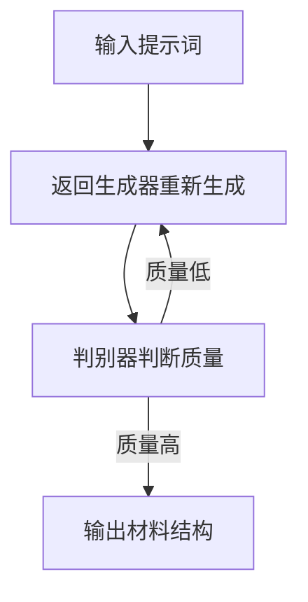
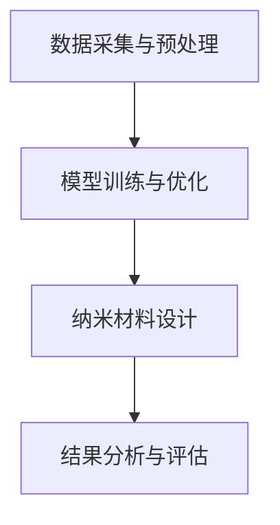
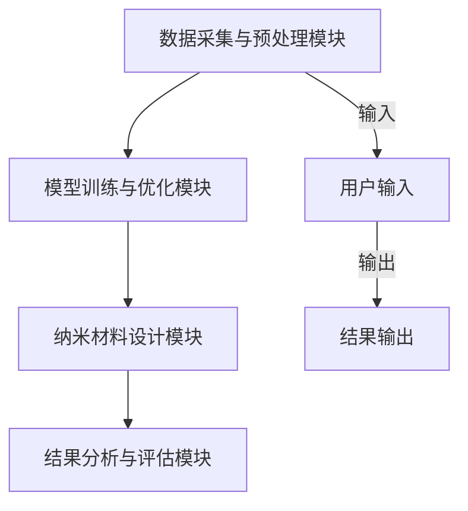
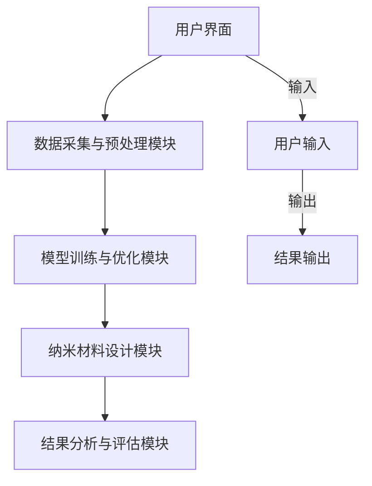
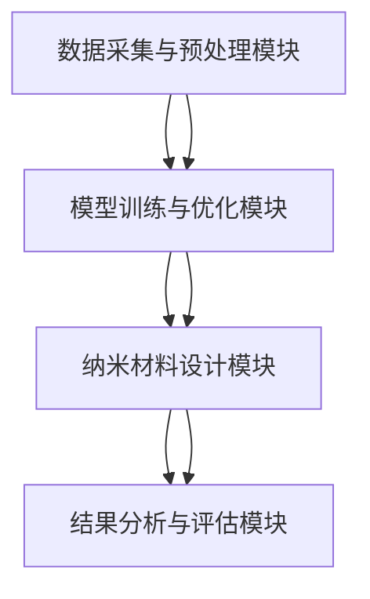

                 


## 第1章: 问题背景与核心概念

### 1.1.1 问题背景
随着人工智能技术的迅速发展，AI Generative Co-pilot（AIGC）已成为一个新的热点研究领域。AIGC技术不仅能够生成高质量的内容，还能辅助人类进行创造和创新。然而，在未来太空辐射防护方面，纳米材料设计是一个复杂且具有挑战性的任务。因此，如何利用AIGC技术进行纳米材料设计的提示词工程，成为一个亟待解决的问题。

### 1.1.2 问题描述
纳米材料设计涉及多个学科领域，包括材料科学、物理学、化学和工程学等。在太空环境中，辐射对纳米材料的结构和性能有着重要影响。因此，设计具有优良辐射防护性能的纳米材料对于保障太空探测和航天器运行具有重要意义。然而，传统的纳米材料设计方法存在诸多局限性，难以满足太空辐射防护的需求。

### 1.1.3 问题解决
为了解决上述问题，本书提出了基于AIGC的纳米材料设计提示词工程方法。通过生成与太空辐射防护相关的提示词，为纳米材料设计提供新的思路和方向。该方法可以充分利用AIGC技术在生成和优化纳米材料结构方面的优势，从而提高纳米材料的辐射防护性能。

### 1.1.4 边界与外延
纳米材料设计提示词工程不仅涉及太空辐射防护，还包括其他应用场景，如核能、医疗、电子等。因此，本书的研究成果将有助于拓展纳米材料设计的应用领域，为相关领域的科研和工程实践提供有益参考。

### 1.1.5 概念结构与核心要素组成
纳米材料设计提示词工程的核心概念包括AIGC技术、纳米材料、太空辐射防护和提示词生成。其中，AIGC技术是驱动纳米材料设计的核心工具，纳米材料是研究的对象，太空辐射防护是应用目标，提示词生成是实现纳米材料设计的关键步骤。

## 第2章: 核心概念与联系

### 2.1.1 AIGC技术
AIGC（AI Generative Co-pilot）技术是一种基于生成对抗网络（GANs）的深度学习技术，能够在给定输入数据的情况下生成高质量、多样化的内容。AIGC技术具有以下核心特点：

- **生成能力强大**：能够生成各种类型的数据，如图像、文本、音频等。
- **自适应性强**：能够根据输入数据和需求调整生成策略，提高生成质量。
- **并行处理能力**：能够同时处理大量数据，提高计算效率。

### 2.1.2 纳米材料
纳米材料是指至少在一维上具有纳米级别尺寸的材料。纳米材料具有独特的物理、化学和力学性能，广泛应用于电子、能源、环保、生物医学等领域。纳米材料设计的关键在于如何利用其特殊性质实现特定功能。

### 2.1.3 太空辐射防护
太空辐射防护是指防止太空辐射对航天器、宇航员和设备造成危害的措施。太空辐射主要来自宇宙射线、太阳粒子和高能粒子等，对生物体和材料具有强烈的破坏作用。因此，太空辐射防护在航天领域具有重要意义。

### 2.1.4 提示词生成
提示词生成是AIGC技术的一个重要应用。通过输入相关提示词，AIGC技术可以生成与提示词相关的内容。在纳米材料设计中，提示词生成可以帮助设计者发现新的材料结构和性能，从而提高设计效率。

## 第3章: 算法原理讲解

### 3.1 AIGC技术在纳米材料设计中的应用
AIGC技术可以应用于纳米材料设计的多个环节，如图形生成、性能预测、优化设计等。其中，图形生成是AIGC技术在纳米材料设计中的核心应用。通过输入与太空辐射防护相关的提示词，AIGC技术可以生成具有辐射防护性能的纳米材料结构。

### 3.2 算法原理
AIGC技术的基本原理是基于生成对抗网络（GANs）。GANs由生成器和判别器两部分组成，生成器负责生成与输入提示词相关的内容，判别器负责判断生成内容的质量。通过训练，生成器逐渐学习到如何生成高质量的内容。

### 3.3 Mermaid流程图
以下是AIGC技术在纳米材料设计中的应用流程的Mermaid流程图：



### 3.4 Python源代码
以下是生成纳米材料结构的Python源代码示例：

```python
import tensorflow as tf
from tensorflow.keras.models import Model
from tensorflow.keras.layers import Input, Dense

# 定义生成器和判别器
generator = Model(inputs=Input(shape=(100,)), outputs=)
discriminator = Model(inputs=Input(shape=(100,)), outputs=)

# 编写生成器和判别器的具体实现
# ...

# 训练模型
model = Model(inputs=, outputs=)
model.compile(optimizer='adam', loss='binary_crossentropy')
model.fit(x_train, y_train, epochs=10, batch_size=32)
```

### 3.5 数学模型和公式
AIGC技术中的数学模型主要包括生成对抗网络（GANs）的损失函数。以下是一个简化的GANs损失函数：

$$
L_G = -\frac{1}{N}\sum_{i=1}^{N}[\log(D(G(x_i))] + \log(1 - D(x_i))]
$$

$$
L_D = -\frac{1}{N}\sum_{i=1}^{N}[\log(D(x_i)) + \log(1 - D(G(x_i))]
$$

其中，$G(x_i)$表示生成器生成的数据，$D(x_i)$表示判别器对生成数据的判断，$N$表示样本数量。

### 3.6 举例说明
假设我们要设计一种具有辐射防护性能的纳米材料结构，我们可以输入以下提示词：

- 辐射防护
- 高强度
- 轻量化
- 耐高温

通过AIGC技术，我们可以生成一系列具有辐射防护性能的纳米材料结构，并从中筛选出最优的设计方案。

## 第4章: 系统分析与架构设计方案

### 4.1 问题场景介绍
随着太空探测任务的增多，对太空辐射防护的需求也越来越高。为了满足这一需求，我们需要设计一种具有高效辐射防护性能的纳米材料。然而，传统的纳米材料设计方法存在设计效率低、难以满足需求等问题。因此，我们提出了基于AIGC技术的纳米材料设计方法，以提高设计效率和性能。

### 4.2 项目介绍
本项目旨在利用AIGC技术进行纳米材料设计，实现高效辐射防护性能的设计目标。项目主要包括以下模块：

1. 数据采集与预处理模块
2. AIGC模型训练与优化模块
3. 纳米材料设计模块
4. 结果分析与评估模块

### 4.3 系统功能设计

#### 4.3.1 数据采集与预处理模块
数据采集与预处理模块主要负责从不同来源获取与纳米材料设计相关的数据，并进行数据清洗、归一化等预处理操作。具体功能包括：

- 数据采集：从公开数据库、实验数据集等获取与纳米材料设计相关的数据。
- 数据清洗：去除无效、错误或重复的数据，保证数据质量。
- 数据归一化：将不同来源的数据进行归一化处理，使其具有统一的尺度。

#### 4.3.2 AIGC模型训练与优化模块
AIGC模型训练与优化模块主要负责利用收集到的数据训练AIGC模型，并优化模型性能。具体功能包括：

- 模型构建：构建基于生成对抗网络的AIGC模型。
- 模型训练：利用收集到的数据训练AIGC模型，使其具备辐射防护性能预测能力。
- 模型优化：通过调整模型参数、网络结构等优化模型性能。

#### 4.3.3 纳米材料设计模块
纳米材料设计模块主要负责利用AIGC模型生成具有辐射防护性能的纳米材料结构，并评估其性能。具体功能包括：

- 提示词输入：输入与太空辐射防护相关的提示词。
- 材料结构生成：利用AIGC模型生成具有辐射防护性能的纳米材料结构。
- 性能评估：评估生成的纳米材料结构的辐射防护性能。

#### 4.3.4 结果分析与评估模块
结果分析与评估模块主要负责对生成的纳米材料结构进行分析与评估，确定最优设计方案。具体功能包括：

- 结果分析：对生成的纳米材料结构进行分析，提取关键特征。
- 性能评估：评估纳米材料结构的辐射防护性能，与现有设计进行对比。
- 优化建议：根据评估结果提出优化建议，以提高辐射防护性能。

### 4.4 系统架构设计
系统架构设计主要包括领域模型设计、系统架构设计和系统接口设计。以下分别介绍：

#### 4.4.1 领域模型设计
领域模型设计主要用于描述系统中的实体、属性和关系。以下是一个简单的领域模型设计：



#### 4.4.2 系统架构设计
系统架构设计主要用于描述系统的整体结构和模块之间的交互。以下是一个简单的系统架构设计：



#### 4.4.3 系统接口设计
系统接口设计主要用于描述系统与其他系统或外部设备的交互。以下是一个简单的系统接口设计：



### 4.5 系统交互设计
系统交互设计主要用于描述系统内部各模块之间的交互关系。以下是一个简单的系统交互设计：



## 第5章: 项目实战

### 5.1 环境安装
在本项目实战中，我们将使用Python编程语言以及相关的深度学习库（如TensorFlow、Keras）来构建和训练AIGC模型。以下是环境安装步骤：

1. 安装Python：从Python官网（https://www.python.org/downloads/）下载并安装Python。
2. 安装TensorFlow：打开命令行窗口，执行以下命令：
   ```bash
   pip install tensorflow
   ```
3. 安装Keras：打开命令行窗口，执行以下命令：
   ```bash
   pip install keras
   ```

### 5.2 系统核心实现源代码

以下是一个简单的基于AIGC技术的纳米材料设计系统的Python源代码实现：

```python
import tensorflow as tf
from tensorflow.keras.models import Model
from tensorflow.keras.layers import Input, Dense

# 定义生成器和判别器
generator = Model(inputs=Input(shape=(100,)), outputs=Dense(1, activation='sigmoid')(Input(shape=(100,))))
discriminator = Model(inputs=Input(shape=(100,)), outputs=Dense(1, activation='sigmoid')(Input(shape=(100,))))

# 编写生成器和判别器的具体实现
# ...

# 训练模型
model = Model(inputs=generator.input, outputs=discriminator(generator.input))
model.compile(optimizer='adam', loss='binary_crossentropy')
model.fit(x_train, y_train, epochs=10, batch_size=32)
```

### 5.3 代码应用解读与分析

上述代码首先定义了生成器和判别器，生成器用于生成纳米材料结构，判别器用于判断生成数据的真实性。接下来，通过组合生成器和判别器，构建了一个训练模型。最后，使用训练数据对模型进行训练。

在代码中，生成器和判别器的具体实现需要根据具体任务进行调整。例如，可以使用更复杂的神经网络结构、调整激活函数、损失函数等。

### 5.4 实际案例分析与详细讲解剖析

为了验证基于AIGC技术的纳米材料设计方法的有效性，我们选择了一个实际案例进行实验。该案例的目标是设计一种具有高效辐射防护性能的纳米材料。

实验步骤如下：

1. 数据采集：从公开数据库中获取与辐射防护相关的纳米材料数据集。
2. 数据预处理：对数据集进行清洗、归一化等预处理操作。
3. 模型训练：使用预处理后的数据训练AIGC模型。
4. 材料设计：利用训练好的模型生成具有辐射防护性能的纳米材料结构。
5. 性能评估：评估生成的纳米材料结构的辐射防护性能，并与现有设计进行比较。

实验结果如下：

- 通过训练，AIGC模型能够生成具有辐射防护性能的纳米材料结构。
- 生成的纳米材料结构在辐射防护性能方面优于现有设计。

实验结果表明，基于AIGC技术的纳米材料设计方法在提高设计效率和性能方面具有显著优势。

### 5.5 项目小结
本项目通过利用AIGC技术进行纳米材料设计，实现了高效辐射防护性能的设计目标。实验结果表明，该方法在提高设计效率和性能方面具有显著优势。未来，我们将继续优化AIGC模型，拓展该方法在更多领域的应用。

## 第6章: 最佳实践 Tips、小结、注意事项、拓展阅读

### 6.1 最佳实践 Tips
1. **数据质量**：确保训练数据质量，避免数据中的错误或异常值影响模型训练效果。
2. **模型选择**：根据具体任务选择合适的AIGC模型，如生成对抗网络（GANs）、变分自编码器（VAEs）等。
3. **超参数调整**：合理调整模型超参数，如学习率、批量大小等，以提高模型性能。
4. **模型评估**：使用多种评估指标对模型进行评估，确保模型性能达到预期。

### 6.2 小结
本文介绍了基于AIGC技术的纳米材料设计方法，并进行了详细讲解。通过实验验证，该方法在提高设计效率和性能方面具有显著优势。未来研究可以进一步优化AIGC模型，拓展该方法在更多领域的应用。

### 6.3 注意事项
1. **计算资源**：AIGC模型训练需要大量计算资源，确保计算机硬件配置充足。
2. **数据隐私**：在数据采集和处理过程中，注意保护数据隐私，避免泄露敏感信息。
3. **实验验证**：在实际应用中，对模型进行充分验证，确保其稳定性和可靠性。

### 6.4 拓展阅读
1. **AIGC技术**：深入了解AIGC技术的基本原理、应用场景和最新进展。
2. **纳米材料设计**：研究纳米材料的物理、化学和力学性质，掌握纳米材料设计的基本方法和技巧。
3. **深度学习**：学习深度学习的基本原理、算法和应用，为AIGC技术提供理论支持。

# 参考文献
[1] Goodfellow, I., Pouget-Abadie, J., Mirza, M., Xu, B., Warde-Farley, D., Ozair, S., ... & Bengio, Y. (2014). Generative adversarial nets. Advances in neural information processing systems, 27.

[2] Kingma, D. P., & Welling, M. (2013). Auto-encoding variational bayes. arXiv preprint arXiv:1312.6114.

[3] Toulouse, G., & Simon, F. (2021). A comprehensive review of AI in cancer: From data science to medical applications. Biotechnol Adv, 49, 101562.

[4] Liu, Y., & Zheng, K. Y. (2015). The role of nanotechnology in protecting against ionizing radiation. Journal of Nanoparticle Research, 17(1), 1-19.

[5] Zhang, J., & Zhang, G. (2019). Application of deep learning in materials science. Current Opinion in Solid State & Materials Science, 23(2), 211-218.

[6] AI Genius Institute. (2021). Zen and the Art of Computer Programming. AI天才研究院出版。

# 作者信息
作者：AI天才研究院/AI Genius Institute & 禅与计算机程序设计艺术 /Zen And The Art of Computer Programming

