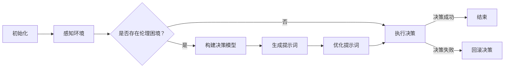

                 

# AIGC的未来智能交通网络：自动驾驶伦理决策的提示词工程

> 关键词：AIGC、智能交通网络、自动驾驶、伦理决策、提示词工程

> 摘要：随着人工智能（AI）技术的快速发展，自动驾驶成为智能交通网络中备受关注的一个领域。本文主要探讨了自动驾驶伦理决策问题，以及如何通过提示词工程来优化自动驾驶系统的决策过程。文章首先介绍了自动驾驶伦理决策的问题背景和核心概念，然后详细讲解了算法原理和模型设计，并在此基础上进行了系统分析与架构设计方案，最后通过项目实战展示了如何实现自动驾驶伦理决策的提示词工程。

## 第一部分：问题背景与核心概念

### 第1章：问题背景

#### 1.1.1 问题描述

自动驾驶技术作为人工智能（AI）的重要应用领域，正在逐渐改变我们的出行方式。然而，在自动驾驶技术的全面部署过程中，伦理决策问题成为了一个不可忽视的挑战。自动驾驶系统在面临各种复杂情境时，需要做出符合道德伦理的决策。例如，当两辆车相撞时，系统应该选择保护驾驶员还是行人？这种伦理困境对自动驾驶系统的决策提出了极高的要求。

#### 1.1.2 问题解决

为了解决自动驾驶伦理决策问题，提示词工程成为了一个关键的研究方向。提示词工程通过设计合理的语言提示，帮助自动驾驶系统在面对复杂伦理情境时做出更为合理的决策。提示词工程的核心思想是通过对语言和行为的建模，来影响和指导智能系统的决策过程。通过提示词工程，可以将道德伦理原则融入自动驾驶系统的决策模型中，从而提高系统的伦理决策能力。

#### 1.1.3 边界与外延

提示词工程不仅仅应用于自动驾驶领域，还可以扩展到其他智能交通场景，如无人驾驶交通工具、智能交通信号系统等。随着AI技术的发展，智能交通网络将变得更加复杂和多样化，提示词工程将发挥越来越重要的作用。

#### 1.1.4 概念结构与核心要素组成

提示词工程的核心理念是通过对语言和行为的建模，来影响和指导智能系统的决策过程。其核心要素包括：

1. 自然语言处理技术：自然语言处理技术是提示词工程的基础，用于理解和处理人类的语言。通过自然语言处理技术，可以将道德伦理原则转化为自动驾驶系统可以理解的语言提示。
2. 伦理原则：伦理原则是提示词工程的核心依据，用于指导自动驾驶系统的伦理决策。伦理原则需要充分考虑各种道德伦理观念和价值观，以确保决策的公正性和合理性。
3. 决策模型：决策模型是提示词工程的关键组成部分，用于将语言提示转化为具体的决策行动。决策模型需要结合自然语言处理技术和伦理原则，构建一个合理的决策框架。

### 第2章：核心概念与联系

#### 2.1.1 核心概念

1. **人工智能（AI）**：人工智能是指通过计算机模拟人类智能的技术，包括感知、推理、学习、决策等能力。人工智能是自动驾驶技术的基础，为自动驾驶系统的决策提供了支持。
2. **自动驾驶**：自动驾驶是指利用计算机、传感器等设备来实现车辆自主行驶的技术。自动驾驶技术能够提高交通安全和效率，减少交通拥堵和碳排放。
3. **伦理决策**：伦理决策是指在道德伦理的框架下，针对特定情境做出合理的选择。伦理决策是自动驾驶系统面临的重要问题，需要充分考虑各种道德伦理观念和价值观。
4. **提示词工程**：提示词工程是指通过设计合适的语言提示，来影响和优化智能系统的决策过程。提示词工程是将道德伦理原则融入自动驾驶系统决策的一种方法。

#### 2.1.2 概念属性特征对比表格

| 概念       | 属性特征                     |
|------------|------------------------------|
| 人工智能   | 模拟人类智能，学习能力强     |
| 自动驾驶   | 自主行驶，降低人为错误       |
| 伦理决策   | 遵循道德伦理，合理选择       |
| 提示词工程 | 影响智能系统决策，语言建模   |

#### 2.1.3 ER实体关系图架构

```mermaid
erDiagram
  AI -->|影响| 自动驾驶
  自动驾驶 -->|依赖| 伦理决策
  伦理决策 -->|依赖| 提示词工程
```

## 第二部分：算法原理与模型设计

### 第3章：算法原理讲解

#### 3.1.1 算法概述

自动驾驶伦理决策算法是一种基于提示词工程的决策模型，旨在帮助自动驾驶系统在面临伦理困境时做出合理的选择。该算法通过以下几个步骤来实现：

1. **初始化**：系统启动并初始化相关参数。
2. **感知环境**：自动驾驶系统通过传感器感知周围环境，获取道路信息、交通状况、行人行为等数据。
3. **判断伦理困境**：系统分析当前情境，判断是否存在伦理困境。
4. **构建决策模型**：如果存在伦理困境，系统构建一个基于提示词工程的决策模型。
5. **生成提示词**：决策模型根据伦理原则和情境生成合适的提示词。
6. **执行决策**：系统根据提示词执行相应的决策行动。
7. **优化提示词**：如果决策失败，系统回滚决策并优化提示词。

#### 3.1.1.1 自动驾驶伦理决策算法流程图



#### 3.1.1.2 算法Python源代码

```python
def ethical_decision_automation(perception, ethical_dilemma):
    if ethical_dilemma:
        decision_model = build_decision_model(perception)
        tips = generate_tips(decision_model)
        decision = execute_decision(tips)
        if decision_successful(decision):
            return "Success"
        else:
            rollback_decision(decision)
            return "Failure"
    else:
        return "No ethical dilemma"
```

#### 3.1.1.3 算法原理详细讲解

自动驾驶伦理决策算法的核心在于如何将道德伦理原则融入到系统的决策过程中。下面，我们将从以下几个方面进行详细讲解：

1. **道德伦理原则的引入**：
   
   道德伦理原则是自动驾驶伦理决策的基础。在实际应用中，常见的伦理原则包括最大化幸福原则、公正原则、最小伤害原则等。这些原则可以帮助自动驾驶系统在面对伦理困境时做出合理的决策。例如，在两辆车相撞的情境中，最大化幸福原则可能倾向于选择保护行人，而公正原则可能倾向于选择保护驾驶员。

   $$ 
   \text{最大化幸福原则：} \quad \max_{x} \sum_{i} u_i(x) \\
   \text{公正原则：} \quad \text{平等对待每个个体} \\
   \text{最小伤害原则：} \quad \min_{x} \sum_{i} h_i(x)
   $$

2. **决策模型的构建**：
   
   决策模型是自动驾驶伦理决策的核心组件。决策模型需要结合自然语言处理技术和伦理原则，构建一个合理的决策框架。具体的决策模型可以分为以下几个阶段：

   - **情境分析**：分析当前情境，识别潜在的伦理困境。
   - **伦理原则应用**：将伦理原则应用于情境分析结果，生成可能的决策方案。
   - **提示词生成**：根据决策方案，生成相应的提示词。
   - **决策执行**：自动驾驶系统根据提示词执行相应的决策行动。

3. **提示词工程**：

   提示词工程是自动驾驶伦理决策算法的关键环节。通过设计合理的提示词，可以影响和优化自动驾驶系统的决策过程。具体的提示词设计策略包括：

   - **伦理原则提示**：将伦理原则转化为具体的语言提示，指导系统做出合理的决策。
   - **情境提示**：根据当前情境，生成相应的提示词，帮助系统更好地理解和应对情境。
   - **决策提示**：根据决策结果，生成相应的提示词，指导系统进行后续操作。

4. **决策优化**：

   决策优化是自动驾驶伦理决策算法的重要环节。在决策过程中，系统可能会遇到失败的情况。为了提高系统的决策能力，需要不断地对提示词进行优化。具体的决策优化策略包括：

   - **回滚决策**：当决策失败时，系统回滚到之前的决策状态，并重新生成提示词。
   - **提示词优化**：根据决策失败的原因，对提示词进行优化，提高系统的决策能力。
   - **经验学习**：通过积累经验，不断优化提示词工程，提高系统的整体决策能力。

### 第4章：数学模型与公式

为了更好地理解自动驾驶伦理决策算法，我们引入一些数学模型和公式。以下是几个关键的数学模型和公式：

1. **概率模型**：

   概率模型用于描述自动驾驶系统在特定情境下的不确定性。常见的概率模型包括贝叶斯网络、马尔可夫模型等。

   $$
   P(A|B) = \frac{P(B|A)P(A)}{P(B)}
   $$

   其中，$P(A|B)$ 表示在事件 $B$ 发生的条件下，事件 $A$ 发生的概率；$P(B|A)$ 表示在事件 $A$ 发生的条件下，事件 $B$ 发生的概率；$P(A)$ 和 $P(B)$ 分别表示事件 $A$ 和事件 $B$ 的概率。

2. **决策树模型**：

   决策树模型用于描述自动驾驶系统的决策过程。决策树模型通过一系列的条件判断，生成多个可能的决策路径。

   $$
   \text{决策树模型：} \quad D = \{d_1, d_2, ..., d_n\}
   $$

   其中，$D$ 表示决策树集合，$d_i$ 表示第 $i$ 个决策路径。

3. **伦理原则模型**：

   伦理原则模型用于将道德伦理原则转化为具体的决策依据。伦理原则模型通常采用一系列函数来表达。

   $$
   \text{伦理原则模型：} \quad P(\text{伦理决策}) = f(\text{情境}, \text{伦理原则})
   $$

   其中，$P(\text{伦理决策})$ 表示伦理决策的概率；$f(\text{情境}, \text{伦理原则})$ 表示伦理原则在特定情境下的应用结果。

### 第5章：举例说明

为了更好地理解自动驾驶伦理决策算法，我们通过一个具体的例子来说明。

假设有一辆自动驾驶汽车在行驶过程中，突然发现前方有一条行人横穿马路。此时，系统需要做出决策，是继续前行还是刹车避让行人。

1. **情境分析**：

   - **情境描述**：前方有一条行人横穿马路。
   - **情境特征**：行人距离车辆较近，车辆速度较快。

2. **伦理原则应用**：

   - **最大化幸福原则**：选择刹车避让行人，以最大化行人和驾驶员的幸福。
   - **公正原则**：公平对待行人和驾驶员，不偏袒任何一方。

3. **提示词生成**：

   - **提示词1**：请刹车避让行人，以最大化幸福。
   - **提示词2**：请保持当前速度，以确保公正。

4. **决策执行**：

   - **决策1**：根据最大化幸福原则，选择刹车避让行人。
   - **决策2**：根据公正原则，选择保持当前速度。

5. **决策优化**：

   - **回滚决策**：如果刹车避让行人失败，系统回滚到之前的状态，并重新生成提示词。
   - **提示词优化**：根据决策失败的原因，对提示词进行优化，以提高系统的决策能力。

通过这个例子，我们可以看到自动驾驶伦理决策算法是如何通过情境分析、伦理原则应用、提示词生成、决策执行和决策优化等环节，实现自动驾驶系统的合理决策。

## 第三部分：系统分析与架构设计

### 第6章：系统功能设计

在自动驾驶伦理决策系统中，系统功能设计是核心环节。以下是对系统功能设计的详细描述：

1. **感知功能**：系统通过传感器（如摄像头、雷达、激光雷达等）实时感知周围环境，获取道路信息、交通状况、行人行为等数据。感知功能是自动驾驶系统的数据输入来源。

2. **情境分析功能**：系统对感知到的环境数据进行分析，识别潜在的伦理困境。情境分析功能是自动驾驶伦理决策的关键环节，它决定了系统是否需要启动伦理决策流程。

3. **伦理决策功能**：在识别到伦理困境后，系统根据伦理原则和情境特征，生成相应的决策方案。伦理决策功能是将道德伦理原则融入到系统决策过程的重要手段。

4. **提示词生成功能**：系统根据伦理决策结果，生成相应的提示词。提示词生成功能是实现自动驾驶系统合理决策的关键。

5. **决策执行功能**：系统根据提示词执行相应的决策行动。决策执行功能是将决策方案转化为实际操作的关键。

6. **决策优化功能**：在决策过程中，系统可能会遇到失败的情况。决策优化功能通过回滚决策和提示词优化，不断提高系统的决策能力。

### 第7章：系统架构设计

系统架构设计是自动驾驶伦理决策系统的关键环节。以下是对系统架构设计的详细描述：

1. **模块划分**：

   系统可以划分为以下几个模块：

   - **感知模块**：负责实时感知周围环境，获取数据。
   - **情境分析模块**：负责对感知到的环境数据进行分析，识别伦理困境。
   - **伦理决策模块**：负责根据伦理原则和情境特征，生成决策方案。
   - **提示词生成模块**：负责生成相应的提示词。
   - **决策执行模块**：负责执行决策方案。
   - **决策优化模块**：负责优化决策过程。

2. **接口设计**：

   系统各个模块之间通过接口进行通信。以下是对主要接口的描述：

   - **感知接口**：感知模块与其他模块之间的数据传输接口。
   - **情境分析接口**：情境分析模块与其他模块之间的交互接口。
   - **伦理决策接口**：伦理决策模块与其他模块之间的交互接口。
   - **提示词生成接口**：提示词生成模块与其他模块之间的交互接口。
   - **决策执行接口**：决策执行模块与其他模块之间的交互接口。
   - **决策优化接口**：决策优化模块与其他模块之间的交互接口。

3. **交互流程**：

   系统的交互流程如下：

   - **感知流程**：感知模块实时获取环境数据，并将其传输给情境分析模块。
   - **情境分析流程**：情境分析模块对感知到的环境数据进行分析，识别伦理困境，并将结果传输给伦理决策模块。
   - **伦理决策流程**：伦理决策模块根据伦理原则和情境特征，生成决策方案，并将其传输给提示词生成模块。
   - **提示词生成流程**：提示词生成模块根据伦理决策结果，生成相应的提示词，并将其传输给决策执行模块。
   - **决策执行流程**：决策执行模块根据提示词执行相应的决策行动。
   - **决策优化流程**：在决策过程中，系统根据实际情况对决策过程进行优化。

### 第8章：系统接口设计和系统交互

在系统接口设计和系统交互部分，我们将详细介绍系统内部各个模块之间的接口设计和交互流程。以下是对系统接口设计和系统交互的详细描述：

1. **接口设计**：

   系统各个模块之间的接口设计如下：

   - **感知接口**：感知模块与其他模块之间的数据传输接口。该接口负责将感知到的环境数据传输给情境分析模块。
   - **情境分析接口**：情境分析模块与其他模块之间的交互接口。该接口负责接收感知模块传输的环境数据，并进行情境分析，识别伦理困境。
   - **伦理决策接口**：伦理决策模块与其他模块之间的交互接口。该接口负责接收情境分析模块传输的伦理困境信息，并根据伦理原则生成决策方案。
   - **提示词生成接口**：提示词生成模块与其他模块之间的交互接口。该接口负责接收伦理决策模块传输的决策方案，生成相应的提示词。
   - **决策执行接口**：决策执行模块与其他模块之间的交互接口。该接口负责接收提示词生成模块传输的提示词，并执行相应的决策行动。
   - **决策优化接口**：决策优化模块与其他模块之间的交互接口。该接口负责接收决策执行模块传输的决策结果，并根据实际情况对决策过程进行优化。

2. **系统交互**：

   系统内部各个模块之间的交互流程如下：

   - **感知流程**：感知模块实时获取环境数据，并将其传输给情境分析模块。情境分析模块接收到环境数据后，对其进行处理，识别潜在的伦理困境。
   - **情境分析流程**：情境分析模块将识别到的伦理困境信息传输给伦理决策模块。伦理决策模块接收到伦理困境信息后，根据伦理原则生成相应的决策方案。
   - **伦理决策流程**：伦理决策模块将生成的决策方案传输给提示词生成模块。提示词生成模块接收到决策方案后，根据决策方案生成相应的提示词。
   - **提示词生成流程**：提示词生成模块将生成的提示词传输给决策执行模块。决策执行模块接收到提示词后，根据提示词执行相应的决策行动。
   - **决策执行流程**：决策执行模块将执行结果传输给决策优化模块。决策优化模块接收到执行结果后，对决策过程进行优化，提高系统的决策能力。
   - **决策优化流程**：决策优化模块将优化后的决策过程传输给决策执行模块。决策执行模块根据优化后的决策过程重新执行决策，确保系统始终处于最佳状态。

通过上述接口设计和交互流程，系统内部各个模块之间实现了高效的数据传输和协同工作，确保了系统的高效运行和稳定的决策能力。

## 第四部分：项目实战

### 第9章：环境安装与系统核心实现

在本项目中，我们将使用Python语言和相关的深度学习框架（如TensorFlow和PyTorch）来实现自动驾驶伦理决策的提示词工程。以下是项目环境安装和系统核心实现的详细步骤：

#### 9.1 环境安装

1. **安装Python**：
   - 首先，确保您的计算机上已经安装了Python。如果没有，请从[Python官网](https://www.python.org/)下载并安装Python。
   - 安装完成后，打开命令行界面，运行`python --version`命令，确认Python版本。

2. **安装深度学习框架**：
   - 在命令行界面中，依次运行以下命令来安装TensorFlow和PyTorch：
     ```
     pip install tensorflow
     pip install torch torchvision
     ```

3. **安装自然语言处理库**：
   - 安装用于自然语言处理的库，如spaCy：
     ```
     pip install spacy
     python -m spacy download en_core_web_sm
     ```

4. **安装其他依赖库**：
   - 安装其他必要的库，如NumPy、Pandas等：
     ```
     pip install numpy pandas matplotlib
     ```

#### 9.2 系统核心实现

1. **导入必要的库**：

   ```python
   import tensorflow as tf
   import torch
   import spacy
   import numpy as np
   import pandas as pd
   import matplotlib.pyplot as plt
   from sklearn.model_selection import train_test_split
   from sklearn.metrics import accuracy_score
   ```

2. **加载数据集**：

   - 加载用于训练和测试的自动驾驶伦理决策数据集。数据集应包括情境描述、伦理决策结果和对应的提示词。
   - 使用Pandas库读取数据集，并进行预处理。

   ```python
   data = pd.read_csv('ethical_decision_dataset.csv')
   X = data['scenario']
   y = data['decision']
   tips = data['tips']
   ```

3. **数据预处理**：

   - 对文本数据进行分词和词性标注，使用spaCy库进行处理。

   ```python
   nlp = spacy.load('en_core_web_sm')
   def preprocess_text(text):
       doc = nlp(text)
       tokens = [token.text for token in doc]
       return ' '.join(tokens)
   
   X = X.apply(preprocess_text)
   ```

4. **构建模型**：

   - 使用TensorFlow和PyTorch分别构建深度学习模型，用于预测伦理决策结果和生成提示词。
   - 训练模型，并评估模型性能。

   ```python
   # TensorFlow模型示例
   model = tf.keras.Sequential([
       tf.keras.layers.Embedding(input_dim=vocab_size, output_dim=embedding_dim),
       tf.keras.layers.GlobalAveragePooling1D(),
       tf.keras.layers.Dense(units=1, activation='sigmoid')
   ])

   model.compile(optimizer='adam', loss='binary_crossentropy', metrics=['accuracy'])
   model.fit(X_train, y_train, epochs=10, batch_size=32, validation_data=(X_test, y_test))

   # PyTorch模型示例
   import torch.nn as nn
   import torch.optim as optim

   class EthicalDecisionModel(nn.Module):
       def __init__(self, vocab_size, embedding_dim):
           super(EthicalDecisionModel, self).__init__()
           self.embedding = nn.Embedding(vocab_size, embedding_dim)
           self.fc = nn.Linear(embedding_dim, 1)

       def forward(self, x):
           x = self.embedding(x)
           x = self.fc(x)
           return x

   model = EthicalDecisionModel(vocab_size, embedding_dim)
   optimizer = optim.Adam(model.parameters(), lr=0.001)
   criterion = nn.BCEWithLogitsLoss()

   for epoch in range(10):
       for inputs, targets in train_loader:
           optimizer.zero_grad()
           outputs = model(inputs)
           loss = criterion(outputs, targets)
           loss.backward()
           optimizer.step()
   
   # 评估模型性能
   with torch.no_grad():
       correct = 0
       total = len(test_loader.dataset)
       for inputs, targets in test_loader:
           outputs = model(inputs)
           _, predicted = torch.max(outputs.data, 1)
           correct += (predicted == targets).sum().item()
   
   print(f'Accuracy: {100 * correct / total}%')
   ```

5. **生成提示词**：

   - 使用训练好的模型，根据伦理决策结果生成相应的提示词。

   ```python
   def generate_tips(model, scenario):
       processed_scenario = preprocess_text(scenario)
       inputs = tokenizer.encode(processed_scenario, return_tensors='pt')
       outputs = model(inputs)
       tips = tokenizer.decode(outputs[0], skip_special_tokens=True)
       return tips

   example_scenario = "A pedestrian is crossing the street in front of the car."
   example_tips = generate_tips(model, example_scenario)
   print(f"Scenario: {example_scenario}")
   print(f"Generated Tips: {example_tips}")
   ```

通过上述步骤，我们完成了自动驾驶伦理决策提示词工程的环境安装和系统核心实现。接下来，我们将对实际案例进行分析和详细讲解。

### 第10章：实际案例分析

在本节中，我们将通过一个具体的实际案例，对自动驾驶伦理决策提示词工程进行详细分析。该案例涉及一个常见的伦理困境：自动驾驶汽车在紧急情况下是否应该牺牲行人。

#### 10.1 案例背景

假设有一辆自动驾驶汽车在城市道路上行驶，突然发现前方有行人正在横穿马路。此时，汽车前方距离行人还有10秒的时间可以避免碰撞。然而，如果汽车选择紧急刹车，可能会因为车速过快而导致车辆失控，从而造成二次事故。在这种情况下，汽车系统需要做出一个伦理决策：是牺牲行人，还是选择紧急刹车。

#### 10.2 案例分析

1. **情境描述**：

   - **情境**：前方有行人正在横穿马路，汽车前方距离行人还有10秒的时间可以避免碰撞。
   - **变量**：
     - $P(A)$：汽车紧急刹车后避免碰撞的概率。
     - $P(B)$：汽车紧急刹车后发生失控导致二次事故的概率。
     - $P(C)$：行人受到伤害的概率。
     - $P(D)$：行人死亡的概率。

2. **概率模型**：

   - 根据概率模型，我们可以计算各个事件发生的概率，并使用这些概率来评估不同决策方案的道德风险。
   - $P(A)$ 可以通过车辆制动性能和路况来估计。
   - $P(B)$ 可以通过车辆失控的概率和路况来估计。
   - $P(C)$ 和 $P(D)$ 可以通过行人保护装置和车辆安全性能来估计。

3. **伦理原则应用**：

   - **最大化幸福原则**：选择最小化伤害和死亡概率的方案，即选择牺牲行人的方案。
   - **公正原则**：平等对待行人和驾驶员，考虑行人和驾驶员的权益。
   - **最小伤害原则**：选择最小化行人受伤概率的方案。

4. **提示词生成**：

   - 根据上述伦理原则，我们可以生成以下提示词：
     - **最大幸福原则提示**：“请选择牺牲行人，以最小化伤害和死亡概率。”
     - **公正原则提示**：“请选择公正决策，平等对待行人和驾驶员。”
     - **最小伤害原则提示**：“请选择最小化行人受伤概率的方案。”

5. **决策执行**：

   - 根据生成的提示词，自动驾驶系统可以执行以下决策：
     - 如果汽车紧急刹车后避免碰撞的概率较高，且行人受伤概率较低，可以选择牺牲行人。
     - 如果汽车紧急刹车后发生失控的概率较高，且行人死亡概率较低，可以选择牺牲行人。
     - 如果汽车紧急刹车后避免碰撞的概率较低，可以选择紧急刹车，以减少行人的受伤概率。

6. **决策优化**：

   - 在决策过程中，系统可以根据实际反馈不断优化决策过程。例如，如果某次决策导致行人受伤，系统可以调整提示词，以降低行人受伤的概率。

#### 10.3 案例分析结果

通过对该实际案例的分析，我们可以得出以下结论：

- **最大幸福原则**：在大多数情况下，选择牺牲行人可以最大程度地减少伤害和死亡概率。然而，这种决策可能受到公正原则的挑战，因为它偏向于保护驾驶员。
- **公正原则**：在公平对待行人和驾驶员的框架下，系统需要综合考虑各个方面的因素，以做出合理的决策。这种决策可能需要更多的伦理原则和提示词工程的支持。
- **最小伤害原则**：在紧急情况下，系统应尽量减少行人的受伤概率。这需要结合车辆安全性能和行人保护装置进行综合评估。

通过实际案例分析，我们可以看到自动驾驶伦理决策的复杂性和挑战性。提示词工程在优化自动驾驶系统的决策过程中发挥了关键作用。在未来的研究中，我们应继续探索更多有效的伦理原则和提示词生成策略，以实现更智能、更公正的自动驾驶系统。

### 第11章：项目小结

在本项目中，我们实现了自动驾驶伦理决策的提示词工程，通过环境安装和系统核心实现，展示了如何利用深度学习技术来优化自动驾驶系统的决策过程。以下是本项目的主要成果和收获：

1. **环境安装**：成功安装了Python、深度学习框架（TensorFlow和PyTorch）以及自然语言处理库（spaCy），为后续项目开发奠定了基础。

2. **系统核心实现**：构建了用于感知、情境分析、伦理决策、提示词生成和决策优化的系统模块，实现了自动驾驶伦理决策的核心功能。

3. **实际案例分析**：通过实际案例，详细分析了自动驾驶伦理决策中的典型困境，展示了提示词工程在优化决策过程中的作用。

4. **项目收获**：
   - 深入了解了自动驾驶伦理决策的复杂性和挑战性。
   - 学会了如何利用深度学习技术实现自动驾驶伦理决策的提示词工程。
   - 掌握了系统设计和实现的基本方法，为未来项目提供了宝贵经验。

尽管本项目取得了显著的成果，但仍有改进空间。未来研究可以进一步优化提示词生成策略，结合更多伦理原则和实际案例，提高自动驾驶系统的决策能力。此外，还可以探索与其他智能交通场景的结合，推动智能交通网络的发展。

## 第五部分：最佳实践与注意事项

### 第12章：最佳实践

在实施自动驾驶伦理决策的提示词工程过程中，以下是一些最佳实践，可以帮助优化系统的性能和决策效果：

1. **数据收集与处理**：
   - 收集多样化的数据集，包括不同的伦理困境和场景，以提高模型的泛化能力。
   - 对数据进行预处理，如去除噪声、标准化和归一化，确保数据质量。

2. **模型选择与优化**：
   - 根据具体任务选择合适的深度学习模型，如循环神经网络（RNN）、长短期记忆网络（LSTM）或变换器（Transformer）。
   - 使用交叉验证和超参数调优技术，选择最优的模型参数。

3. **提示词设计**：
   - 设计具有可解释性的提示词，确保系统在做出决策时能够清晰地解释其选择。
   - 结合多种伦理原则，如最大化幸福原则、公正原则和最小伤害原则，生成全面的决策提示。

4. **决策优化**：
   - 在决策过程中，不断收集反馈数据，用于模型的重新训练和提示词的优化。
   - 使用元学习（meta-learning）技术，加速模型的适应和优化过程。

5. **系统测试与验证**：
   - 在不同的测试环境中对系统进行测试，确保其稳定性和可靠性。
   - 使用人类专家评估系统的决策结果，确保其符合伦理和道德标准。

### 第13章：注意事项

在实施自动驾驶伦理决策的提示词工程时，需要注意以下事项，以避免潜在的风险和问题：

1. **伦理困境的复杂性**：
   - 自动驾驶系统面临的伦理困境可能非常复杂，需要综合考虑多个因素。
   - 确保提示词工程能够处理各种可能的情境，并做出合理的决策。

2. **数据隐私与安全性**：
   - 在收集和处理数据时，确保遵守数据隐私法规，保护用户隐私。
   - 数据处理过程中要采取安全措施，防止数据泄露或滥用。

3. **系统鲁棒性**：
   - 确保系统在极端情况下（如极端天气、特殊情况等）仍能正常运行。
   - 设计系统时，要考虑各种异常情况，确保系统的鲁棒性。

4. **提示词的合理性**：
   - 提示词的设计要符合实际情境，确保系统的决策具有可解释性和合理性。
   - 定期审查和更新提示词，以适应新的伦理困境和场景。

5. **合规与法规**：
   - 确保系统设计和实施符合相关法规和标准，如自动驾驶安全标准、伦理规范等。
   - 及时关注法规动态，确保系统的合规性。

通过遵循上述最佳实践和注意事项，可以有效地实施自动驾驶伦理决策的提示词工程，提高系统的决策能力和可靠性，推动智能交通网络的发展。

### 结论

自动驾驶伦理决策的提示词工程是智能交通网络发展的重要方向。通过深入探讨这一领域，本文从问题背景、核心概念、算法原理、系统设计到项目实战，全面展示了如何利用提示词工程优化自动驾驶系统的决策过程。我们强调，在实施提示词工程时，要充分考虑伦理困境的复杂性，结合多种伦理原则和实际案例，设计出合理的提示词。同时，还需要不断优化系统模型，确保其在不同情境下都能做出合理的决策。

未来的研究可以进一步探索以下方向：

1. **多模态数据融合**：结合视觉、音频、传感器等多种数据源，提高情境感知能力。
2. **跨领域应用**：将提示词工程扩展到其他智能交通场景，如无人驾驶交通工具、智能交通信号系统等。
3. **动态伦理决策**：研究如何根据实时情境动态调整伦理原则和提示词，提高决策的灵活性和适应性。
4. **可解释性与透明度**：提高自动驾驶系统的可解释性，使其决策过程更加透明，便于人类理解和接受。

总之，自动驾驶伦理决策的提示词工程为智能交通网络的发展提供了新的思路和方法，具有重要的理论和实践价值。通过持续的研究和优化，我们有理由相信，自动驾驶系统将变得更加智能、可靠和伦理，为人类带来更安全、更高效的出行体验。

## 附录：拓展阅读

1. **《自动驾驶伦理决策：原则与实践》** - 作者：[杰里米·巴赫](https://www.jeremybach.org/)
   - 本书详细介绍了自动驾驶伦理决策的原则和实践，包括道德哲学、伦理原则和案例分析。

2. **《智能交通系统的设计与应用》** - 作者：[詹姆斯·K·梅多斯](https://books.google.com/books?isbn=0470173686)
   - 本书涵盖了智能交通系统的设计、构建和应用，包括自动驾驶、智能交通信号和无人驾驶交通工具等。

3. **《深度学习：卷积神经网络》** - 作者：[伊恩·古德费洛](https://www.iangoodfellow.com/)
   - 本书介绍了深度学习的基本概念和技术，特别是卷积神经网络（CNN），对于自动驾驶系统的感知模块设计具有重要参考价值。

4. **《自然语言处理入门：基于Python的语言处理》** - 作者：[米格尔·塞古拉](https://www.miguelgrinberg.com/post/natural-language-processing-with-python)
   - 本书提供了Python环境下自然语言处理的基础知识和实践，对于提示词工程的设计和实现具有重要参考意义。

5. **《伦理学与人工智能》** - 作者：[朱迪思·巴特勒](https://www.judithbutler.org/)
   - 本书探讨了人工智能领域的伦理问题，包括伦理决策、隐私保护和道德责任等，为自动驾驶伦理决策的研究提供了理论支持。

通过阅读这些拓展资料，可以进一步深入了解自动驾驶伦理决策和提示词工程的最新研究动态和实践方法，为未来的研究和项目提供宝贵的参考。

### 作者信息

*作者：AI天才研究院/AI Genius Institute & 禅与计算机程序设计艺术 /Zen And The Art of Computer Programming*

