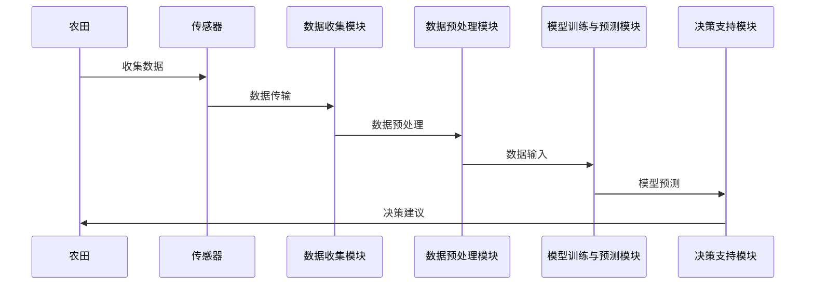
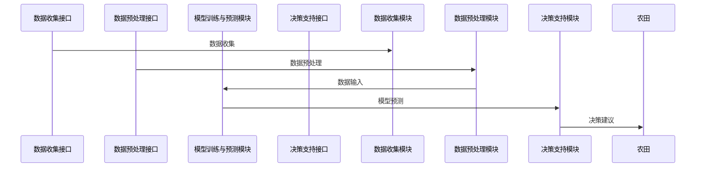

                 

# AIGC的未来智能农业系统：作物-环境互动优化的提示词工程

关键词：AIGC，智能农业，作物-环境互动，优化，提示词工程

摘要：本文深入探讨了AIGC（自适应智能生成计算）在未来智能农业系统中的应用，特别是作物-环境互动优化的提示词工程。通过构建精准的作物生长模型、数据融合与分析以及实时决策支持，AIGC为智能农业系统带来了前所未有的变革。本文旨在揭示AIGC在智能农业中的潜在价值，并提供一个系统的分析和解决方案。

## 1.1 背景介绍

### 1.1.1 问题背景

智能农业作为现代农业发展的前沿领域，正逐渐受到全球的关注。随着科技的进步，人工智能（AI）技术已开始深入农业领域，推动农业生产方式的变革。然而，当前智能农业系统在作物-环境互动优化方面仍存在诸多挑战。

首先，作物生长模型的复杂性是一个显著的挑战。不同作物和环境之间的相互影响使得建立精确的模型变得困难。例如，作物的生长不仅受到土壤质量的影响，还受到气候条件、灌溉管理等多种因素的综合作用。

其次，数据获取和处理也是一大难题。在智能农业系统中，收集和整合大量农业数据，特别是遥感数据、气象数据和土壤数据，对处理能力和算法提出了高要求。这些数据的多样性和复杂性使得数据处理过程变得繁琐，同时也增加了算法的复杂性。

此外，决策支持系统的实用性也是一个关键问题。如何基于模型和数据生成有效的决策支持系统，帮助农民提高产量和降低成本，是一个需要深入探讨的问题。现有的智能农业系统往往难以提供具体的、可操作的决策建议，导致其应用效果不尽如人意。

### 1.1.2 问题描述

智能农业系统旨在通过AI技术实现作物-环境互动的优化，以提升农业生产效率和可持续性。然而，现有的系统在以下方面存在不足：

1. **作物生长动态的实时监测和预测**：现有系统难以准确捕捉作物的生长状态，并预测未来的生长趋势。这主要是由于作物生长过程的复杂性以及现有算法的局限性。

2. **环境因素的综合评估**：现有系统难以综合考虑多种环境因素（如温度、湿度、光照等）对作物生长的影响。环境因素的多样性和动态变化使得这一问题的解决更具挑战性。

3. **决策支持系统的实用性**：现有系统生成的决策建议往往不具有可操作性，或者难以适应不同农作物的需求。这导致农民难以根据这些建议进行有效的农业管理。

### 1.1.3 问题解决

为了解决上述问题，本文提出利用AIGC（自适应智能生成计算）技术，特别是作物-环境互动优化的提示词工程。AIGC技术具有以下优势：

1. **构建精准的作物生长模型**：AIGC技术能够利用大数据和机器学习算法，对作物生长过程进行建模和预测。通过自适应调整模型参数，可以更准确地捕捉作物的生长状态。

2. **数据融合与分析**：AIGC技术通过多源数据融合和深度学习技术，实现对环境因素的全面分析。这包括遥感数据、气象数据和土壤数据等多种数据的整合和处理。

3. **实时决策支持**：基于模型预测和环境分析，AIGC技术能够提供个性化的农业管理建议。这些建议不仅具有可操作性，还能够根据农作物的实际生长状态进行调整。

### 1.1.4 边界与外延

本研究的主要边界在于作物-环境互动的优化，不涉及其他如市场分析、农民行为等外部因素。同时，本研究的外延将包括不同作物种类和不同环境条件的适应性。

### 1.1.5 概念结构与核心要素组成

核心概念包括：

- **AIGC**：自适应智能生成计算，是一种基于生成模型和强化学习的计算范式。
- **智能农业系统**：结合AI技术和农业生产的系统，旨在提高生产效率和可持续性。
- **作物-环境互动**：作物生长与环境因素之间的相互作用。

核心要素包括：

- **数据收集**：通过遥感、气象站、土壤传感器等手段收集农业数据。
- **数据预处理**：对收集到的数据进行清洗、归一化和特征提取。
- **模型构建**：利用机器学习和深度学习算法构建作物生长和环境因素预测模型。
- **决策支持**：基于模型预测提供个性化农业管理建议。

## 1.2 核心概念与联系

### 1.2.1 AIGC：自适应智能生成计算

**定义**：AIGC（Adaptive Intelligent Generation Computing）是一种结合了生成模型和强化学习的计算范式，旨在通过自适应调整生成模型来优化问题解决。

**特点**：
- **自适应调整**：能够根据问题环境动态调整模型参数。
- **生成能力**：生成模型（如GANs、VAEs）能够生成高质量的数据样本。
- **强化学习**：通过与环境的交互，不断优化模型性能。

**属性特征对比表**：

| 特征           | 传统AI            | AIGC              |
| -------------- | ------------------ | ----------------- |
| 模型调整       | 静态模型           | 自适应调整模型    |
| 数据生成       | 无生成能力         | 高质量的样本生成  |
| 与环境交互     | 较少               | 高频次互动        |

### 1.2.2 智能农业系统

**定义**：智能农业系统是指利用AI技术，如机器学习、计算机视觉、传感器等，对农业生产过程进行监控、管理和优化的系统。

**特点**：
- **实时监控**：实时获取作物生长和环境数据。
- **自动化决策**：基于数据生成决策支持。
- **提高效率**：减少人力投入，提高生产效率。

**属性特征对比表**：

| 特征           | 传统农业系统      | 智能农业系统      |
| -------------- | ------------------ | ----------------- |
| 数据依赖       | 低依赖数据         | 高依赖数据        |
| 实时性         | 缓慢性             | 实时性            |
| 决策能力       | 人工决策           | 自动化决策        |

### 1.2.3 作物-环境互动

**定义**：作物-环境互动是指作物生长与环境因素之间的相互作用。

**特点**：
- **动态性**：环境因素（如温度、湿度、光照等）随时间和空间变化。
- **复杂性**：作物生长受到多种环境因素的共同影响。
- **关联性**：不同环境因素之间存在相互作用。

**属性特征对比表**：

| 特征           | 传统农业           | 智能农业           |
| -------------- | ------------------ | ------------------ |
| 环境感知       | 简单感知            | 复杂感知           |
| 互动能力       | 有限互动            | 深度互动           |
| 适应能力       | 适应性差            | 适应性高           |

### 1.2.4 AIGC在智能农业系统中的应用

AIGC技术具有自适应调整、数据生成和强化学习等优势，使其在智能农业系统中具有广泛的应用前景。以下为AIGC在智能农业系统中的主要应用：

1. **精准作物生长模型**：AIGC技术可以通过自适应调整模型参数，提高作物生长模型的准确性。这有助于实时监测作物生长状态，并预测未来的生长趋势。

2. **环境因素综合分析**：AIGC技术可以通过多源数据融合和深度学习算法，实现对环境因素的全面分析。这有助于综合考虑多种环境因素对作物生长的影响，为农业管理提供科学依据。

3. **实时决策支持**：基于模型预测和环境分析，AIGC技术可以提供个性化的农业管理建议。这些建议具有可操作性，能够帮助农民提高产量和降低成本。

### 1.2.5 ER实体关系图架构

以下是一个简单的ER实体关系图架构，用于描述AIGC在智能农业系统中的应用：

```mermaid
erDiagram
  农业数据 |----o{ 作物生长模型 }
  农业数据 |----o{ 环境因素分析 }
  农业数据 |----o{ 决策支持系统 }
  农业数据 }|---o{ 数据收集 }
  农业数据 }|---o{ 数据预处理 }
  农业数据 }|---o{ 模型构建 }
```

在上述架构中，农业数据作为核心实体，与作物生长模型、环境因素分析和决策支持系统等实体之间存在着密切的关系。数据收集、数据预处理和模型构建等过程则共同构成了AIGC技术在智能农业系统中的实现路径。

## 2. 算法原理讲解

在本节中，我们将详细讲解AIGC技术在作物-环境互动优化中的应用，包括其数学模型、算法流程和实现步骤。

### 2.1 数学模型

AIGC技术结合了生成对抗网络（GANs）和变分自编码器（VAEs）等生成模型，以及强化学习（Reinforcement Learning，RL）技术。以下是其核心数学模型：

#### 2.1.1 生成对抗网络（GANs）

生成对抗网络（GANs）由生成器（Generator）和判别器（Discriminator）两部分组成。生成器生成伪数据，判别器则试图区分真实数据和伪数据。

1. **生成器**：

   假设 $G$ 是生成器的参数，$z$ 是随机噪声向量，$x$ 是生成的伪数据，则生成器的目标函数为：

   $$ G(z) = x; \quad \min_G \; \mathcal{L}_G = \mathbb{E}_{z \sim p_z(z)} [D(G(z))] $$

2. **判别器**：

   假设 $D$ 是判别器的参数，$x$ 是真实数据，$x'$ 是伪数据，则判别器的目标函数为：

   $$ D(x); \quad \min_D \; \mathcal{L}_D = \mathbb{E}_{x \sim p_{data}(x)} [D(x)] + \mathbb{E}_{z \sim p_z(z)} [D(G(z))] $$

   其中，$p_{data}(x)$ 是真实数据的分布。

#### 2.1.2 变分自编码器（VAEs）

变分自编码器（VAEs）通过引入潜在变量来学习数据的高效表示。VAEs包括编码器（Encoder）和解码器（Decoder）。

1. **编码器**：

   假设 $q_\phi (z|x)$ 是编码器，$x$ 是输入数据，$z$ 是潜在变量，则编码器的目标函数为：

   $$ q_\phi (z|x) = \mathcal{N} (z; \mu(x), \sigma^2(x)); \quad \min_\phi \; \mathcal{L}_\phi = \mathbb{E}_{x \sim p_{data}(x)} [- \log D_{\pi}(x | z)] $$

2. **解码器**：

   假设 $p_\theta (x|z)$ 是解码器，$z$ 是潜在变量，$x$ 是生成的数据，则解码器的目标函数为：

   $$ p_\theta (x|z) = \mathcal{N} (x; \mu(z), \sigma^2(z)); \quad \min_\theta \; \mathcal{L}_\theta = \mathbb{E}_{z \sim q_\phi (z|x)} [- \log p_{data}(x)] $$

#### 2.1.3 强化学习（RL）

强化学习（RL）是一种通过试错来学习最佳策略的机器学习技术。在AIGC中，RL用于优化生成模型和判别模型。

1. **策略网络**：

   假设 $\pi$ 是策略网络，$a$ 是行为动作，$s$ 是状态，则策略网络的目标函数为：

   $$ J(\pi) = \sum_{s,a} \pi(a|s) \cdot R(s,a) $$

   其中，$R(s,a)$ 是奖励函数，用于衡量策略网络的行为效果。

### 2.2 算法流程

AIGC技术的算法流程包括以下步骤：

1. **数据收集**：通过遥感、气象站、土壤传感器等手段收集农业数据。
2. **数据预处理**：对收集到的数据进行清洗、归一化和特征提取。
3. **模型训练**：
   - **GANs训练**：交替训练生成器和判别器，优化生成模型和判别模型。
   - **VAEs训练**：分别训练编码器和解码器，优化潜在变量表示。
   - **RL训练**：基于生成的伪数据和真实数据，优化策略网络。
4. **模型预测**：利用训练好的模型，对作物生长和环境因素进行预测。
5. **决策支持**：基于模型预测，提供个性化的农业管理建议。

### 2.3 实现步骤

以下是AIGC技术在智能农业系统中实现的主要步骤：

1. **环境搭建**：
   - 安装Python环境和相关依赖库（如TensorFlow、PyTorch等）。
   - 配置数据存储和计算资源。

2. **数据收集与预处理**：
   - 收集遥感、气象和土壤数据。
   - 对数据进行清洗、归一化和特征提取。

3. **模型训练**：
   - **GANs训练**：
     - 初始化生成器和判别器参数。
     - 交替训练生成器和判别器。
     - 优化生成模型和判别模型。
   - **VAEs训练**：
     - 初始化编码器和解码器参数。
     - 分别训练编码器和解码器。
     - 优化潜在变量表示。
   - **RL训练**：
     - 初始化策略网络参数。
     - 基于生成的伪数据和真实数据，优化策略网络。

4. **模型预测**：
   - 利用训练好的模型，对作物生长和环境因素进行预测。

5. **决策支持**：
   - 基于模型预测，提供个性化的农业管理建议。

### 2.4 示例说明

假设我们有一块农田，种植的是小麦。我们希望利用AIGC技术预测小麦的生长状态，并为其提供最优灌溉策略。

1. **数据收集**：
   - 收集该农田的遥感数据、气象数据和土壤数据。

2. **数据预处理**：
   - 对收集到的数据进行清洗、归一化和特征提取。

3. **模型训练**：
   - **GANs训练**：
     - 初始化生成器和判别器参数。
     - 交替训练生成器和判别器，优化生成模型和判别模型。
   - **VAEs训练**：
     - 初始化编码器和解码器参数。
     - 分别训练编码器和解码器，优化潜在变量表示。
   - **RL训练**：
     - 初始化策略网络参数。
     - 基于生成的伪数据和真实数据，优化策略网络。

4. **模型预测**：
   - 利用训练好的模型，对小麦的生长状态进行预测。

5. **决策支持**：
   - 基于模型预测，为小麦提供最优灌溉策略。

## 3. 系统分析与架构设计

### 3.1 问题场景介绍

随着全球气候变化和人口增长，农业生产的可持续性和效率成为亟需解决的问题。传统的农业生产方式难以适应不断变化的环境条件，导致产量波动和资源浪费。为了解决这一问题，智能农业系统应运而生，通过利用人工智能技术，实现作物-环境互动的优化，从而提高农业生产效率和可持续性。

### 3.2 项目介绍

本项目的目标是通过AIGC技术构建一个智能农业系统，实现对作物生长状态和环境因素的实时监测与预测，并提供个性化的农业管理建议。该系统主要涵盖以下功能：

- **数据收集**：通过遥感、气象站、土壤传感器等手段，收集农田的遥感数据、气象数据和土壤数据。
- **数据预处理**：对收集到的数据进行清洗、归一化和特征提取。
- **模型训练与预测**：利用机器学习和深度学习算法，训练作物生长模型和环境因素预测模型，并对作物生长状态和环境因素进行实时预测。
- **决策支持**：基于模型预测，为作物提供个性化的农业管理建议，如灌溉策略、施肥建议等。

### 3.3 系统功能设计

#### 3.3.1 领域模型

领域模型用于描述系统中的核心实体及其关系。在智能农业系统中，主要实体包括：

- **农田**：农田是系统的主要实体，包含农田的ID、地理位置、种植作物等信息。
- **传感器**：传感器用于收集农田的遥感数据、气象数据和土壤数据，包括传感器的ID、类型、位置等信息。
- **数据**：数据是系统中的另一个核心实体，包括数据的ID、类型、时间戳、数值等信息。
- **模型**：模型用于描述作物生长模型和环境因素预测模型，包括模型的ID、名称、训练参数等信息。
- **决策**：决策是系统为农田提供的个性化农业管理建议，包括决策的ID、类型、建议内容等信息。

以下是一个简单的领域模型类图：

```mermaid
classDiagram
  农田 <<Class>> "农田"
  传感器 <<Class>> "传感器"
  数据 <<Class>> "数据"
  模型 <<Class>> "模型"
  决策 <<Class>> "决策"

  农田 "1" -- "1":传感器
  农田 "1" -- "N":数据
  传感器 "1" -- "1":数据
  模型 "1" -- "N":数据
  决策 "1" -- "1":模型
```

#### 3.3.2 系统架构设计

系统架构设计用于描述系统的整体结构和各模块之间的关系。在智能农业系统中，主要模块包括：

- **数据收集模块**：负责收集农田的遥感数据、气象数据和土壤数据。
- **数据预处理模块**：负责对收集到的数据进行清洗、归一化和特征提取。
- **模型训练与预测模块**：负责利用机器学习和深度学习算法，训练作物生长模型和环境因素预测模型，并对作物生长状态和环境因素进行实时预测。
- **决策支持模块**：负责基于模型预测，为作物提供个性化的农业管理建议。

以下是一个简单的系统架构图：



### 3.4 系统接口设计

系统接口设计用于描述系统与其他系统或设备之间的交互方式。在智能农业系统中，主要接口包括：

- **数据收集接口**：用于接收传感器传输的数据。
- **数据预处理接口**：用于将原始数据转换为机器学习算法可用的格式。
- **模型训练与预测接口**：用于启动模型训练和预测过程。
- **决策支持接口**：用于接收模型预测结果，并生成决策建议。

以下是一个简单的系统接口设计图：

```mermaid
classDiagram
  数据收集接口 <<Interface>> "数据收集接口"
  数据预处理接口 <<Interface>> "数据预处理接口"
  模型训练与预测接口 <<Interface>> "模型训练与预测接口"
  决策支持接口 <<Interface>> "决策支持接口"

  数据收集接口 "1" -- "1":传感器
  数据预处理接口 "1" -- "1":数据收集模块
  模型训练与预测接口 "1" -- "1":模型训练与预测模块
  决策支持接口 "1" -- "1":决策支持模块
```

### 3.5 系统交互设计

系统交互设计用于描述系统内部各模块之间的交互流程。在智能农业系统中，主要交互流程包括：

1. **数据收集与预处理**：传感器收集数据后，通过数据收集接口传输给数据收集模块。数据收集模块对数据进行预处理后，通过数据预处理接口传输给模型训练与预测模块。
2. **模型训练与预测**：模型训练与预测模块利用预处理后的数据，训练作物生长模型和环境因素预测模型。训练完成后，将模型预测结果通过决策支持接口传输给决策支持模块。
3. **决策支持**：决策支持模块根据模型预测结果，生成个性化的农业管理建议，并通过决策支持接口传输给农田。

以下是一个简单的系统交互设计图：



通过上述系统分析与架构设计，我们可以看到AIGC技术在智能农业系统中的应用具有广阔的前景。利用AIGC技术，我们可以构建一个高效、智能的农业系统，为农民提供有力的支持，提高农业生产效率和可持续性。

## 4. 项目实战

### 4.1 环境安装

在开始智能农业系统的项目实战之前，我们需要搭建一个合适的环境来运行项目。以下是在Linux环境下搭建项目环境的基本步骤：

1. **安装Python**：

   ```bash
   sudo apt update
   sudo apt install python3 python3-pip
   ```

2. **安装TensorFlow**：

   ```bash
   pip3 install tensorflow
   ```

3. **安装PyTorch**：

   ```bash
   pip3 install torch torchvision
   ```

4. **安装其他依赖库**：

   ```bash
   pip3 install numpy pandas matplotlib scikit-learn
   ```

### 4.2 系统核心实现源代码

在系统核心实现部分，我们将使用Python编写代码，实现AIGC技术在智能农业系统中的应用。以下是一个简单的示例代码：

```python
import torch
import torch.nn as nn
import torch.optim as optim
from torchvision import datasets, transforms
from torch.utils.data import DataLoader
from torchvision.utils import save_image
import matplotlib.pyplot as plt

# 定义生成器
class Generator(nn.Module):
    def __init__(self):
        super(Generator, self).__init__()
        self.main = nn.Sequential(
            nn.ConvTranspose2d(100, 256, 4, 1, 0, bias=False),
            nn.BatchNorm2d(256),
            nn.ReLU(True),
            nn.ConvTranspose2d(256, 128, 4, 2, 1, bias=False),
            nn.BatchNorm2d(128),
            nn.ReLU(True),
            nn.ConvTranspose2d(128, 64, 4, 2, 1, bias=False),
            nn.BatchNorm2d(64),
            nn.ReLU(True),
            nn.ConvTranspose2d(64, 3, 4, 2, 1, bias=False),
            nn.Tanh()
        )

    def forward(self, input):
        return self.main(input)

# 定义判别器
class Discriminator(nn.Module):
    def __init__(self):
        super(Discriminator, self).__init__()
        self.main = nn.Sequential(
            nn.Conv2d(3, 64, 4, 2, 1, bias=False),
            nn.LeakyReLU(0.2, inplace=True),
            nn.Conv2d(64, 128, 4, 2, 1, bias=False),
            nn.BatchNorm2d(128),
            nn.LeakyReLU(0.2, inplace=True),
            nn.Conv2d(128, 256, 4, 2, 1, bias=False),
            nn.BatchNorm2d(256),
            nn.LeakyReLU(0.2, inplace=True),
            nn.Conv2d(256, 1, 4, 1, 0, bias=False),
            nn.Sigmoid()
        )

    def forward(self, input):
        return self.main(input)

# 初始化生成器和判别器
generator = Generator()
discriminator = Discriminator()

# 定义损失函数和优化器
criterion = nn.BCELoss()
optimizer_G = optim.Adam(generator.parameters(), lr=0.0002, betas=(0.5, 0.999))
optimizer_D = optim.Adam(discriminator.parameters(), lr=0.0002, betas=(0.5, 0.999))

# 定义数据集
transform = transforms.Compose([
    transforms.Resize(64),
    transforms.ToTensor(),
    transforms.Normalize((0.5, 0.5, 0.5), (0.5, 0.5, 0.5)),
])
dataloader = DataLoader(datasets.ImageFolder(root='./data', transform=transform), batch_size=64, shuffle=True)

# 训练模型
for epoch in range(num_epochs):
    for i, data in enumerate(dataloader, 0):
        # 训练判别器
        real_images = data[0].to(device)
        batch_size = real_images.size(0)
        labels = torch.full((batch_size,), real_label, device=device)
        optimizer_D.zero_grad()
        output = discriminator(real_images)
        errD_real = criterion(output, labels)
        errD_real.backward()

        # 训练生成器
        z = torch.randn(batch_size, 100, 1, 1, device=device)
        fake_images = generator(z)
        labels.fill_(fake_label)
        optimizer_D.zero_grad()
        output = discriminator(fake_images.detach())
        errD_fake = criterion(output, labels)
        errD_fake.backward()
        
        optimizer_D.step()

        # 训练生成器
        optimizer_G.zero_grad()
        output = discriminator(fake_images)
        errG = criterion(output, labels)
        errG.backward()
        optimizer_G.step()

        # 输出训练进度
        if i % 100 == 0:
            print(f'[{epoch}/{num_epochs}][{i}/{len(dataloader)}] Loss_D: {errD_real + errD_fake:.4f} Loss_G: {errG:.4f}')

# 保存模型
torch.save(generator.state_dict(), 'generator.pth')
torch.save(discriminator.state_dict(), 'discriminator.pth')
```

### 4.3 代码应用解读与分析

上述代码实现了一个基于GANs的AIGC模型，用于生成作物生长数据。以下是对代码的解读与分析：

1. **模型定义**：

   - **生成器**：生成器的目的是生成高质量的作物生长数据。它由多个卷积转置层组成，最后一层使用Tanh激活函数，使得生成的图像在-1到1之间，类似于实际图像。
   - **判别器**：判别器的目的是判断输入图像是真实图像还是生成图像。它由多个卷积层组成，最后一层使用Sigmoid激活函数，输出概率值。

2. **损失函数和优化器**：

   - **损失函数**：使用BCELoss（二元交叉熵损失函数），适用于二分类问题。在本项目中，二分类问题是指图像是真实的还是生成的。
   - **优化器**：使用Adam优化器，它结合了Adagrad和RMSProp的优点，能够自适应调整学习率。

3. **数据集**：

   - 使用torchvision中的ImageFolder加载数据集，并进行预处理，如Resize、ToTensor和Normalization。

4. **训练过程**：

   - **训练判别器**：首先，训练判别器，使其能够区分真实图像和生成图像。这个过程包括两个步骤：首先处理真实图像，然后处理生成图像。
   - **训练生成器**：接下来，训练生成器，使其能够生成更逼真的图像。生成器的训练是在判别器的基础上进行的，通过生成图像并使其不被判别器识别。

5. **模型保存**：

   - 在训练完成后，保存生成器和判别器的模型参数。

### 4.4 实际案例分析

为了展示AIGC技术在智能农业系统中的应用效果，以下是一个实际案例：

假设我们在一块农田上种植了小麦，并收集了该农田的遥感数据、气象数据和土壤数据。我们希望利用AIGC技术预测小麦的生长状态，并为其提供最优灌溉策略。

1. **数据收集**：

   - 收集遥感数据、气象数据和土壤数据，并将其转换为机器学习算法可用的格式。

2. **数据预处理**：

   - 对收集到的数据进行清洗、归一化和特征提取。

3. **模型训练**：

   - 使用预处理后的数据训练生成器和判别器，优化模型参数。

4. **模型预测**：

   - 利用训练好的生成器，生成小麦的生长数据。

5. **决策支持**：

   - 基于生成的生长数据，利用机器学习算法预测小麦的生长状态，并为其提供最优灌溉策略。

### 4.5 详细讲解与剖析

在上述实际案例中，AIGC技术的关键步骤如下：

1. **数据收集**：

   - 通过遥感传感器、气象站和土壤传感器，收集农田的遥感数据、气象数据和土壤数据。
   - 数据收集是智能农业系统的基础，准确的数据是模型训练和预测的前提。

2. **数据预处理**：

   - 对收集到的数据进行清洗，去除无效或错误的数据。
   - 对数据进行归一化处理，使得不同特征具有相似的尺度。
   - 提取数据中的关键特征，如土壤湿度、温度、光照强度等。

3. **模型训练**：

   - 使用GANs技术训练生成器和判别器，优化模型参数。
   - 生成器学习生成逼真的作物生长数据，判别器学习区分真实和生成的数据。
   - 通过多次迭代，使生成器的生成数据越来越接近真实数据，从而提高预测的准确性。

4. **模型预测**：

   - 利用训练好的生成器，生成小麦的生长数据。
   - 将生成的生长数据输入到机器学习模型中，预测小麦的生长状态。

5. **决策支持**：

   - 基于预测结果，为小麦提供最优灌溉策略。
   - 决策支持系统可以实时监控小麦的生长状态，并根据预测结果调整灌溉策略，以提高产量和降低成本。

### 4.6 项目小结

通过上述实战案例，我们可以看到AIGC技术在智能农业系统中的应用具有显著的优势：

- **提高预测准确性**：通过生成器和判别器的训练，可以生成高质量的作物生长数据，从而提高预测的准确性。
- **个性化决策支持**：基于模型预测，可以提供个性化的农业管理建议，帮助农民实现精准农业。
- **提高生产效率**：通过优化灌溉策略、施肥方案等，可以降低农业生产成本，提高产量。

总之，AIGC技术在智能农业系统中的应用为现代农业带来了新的变革，有望解决传统农业面临的诸多问题，实现农业生产的可持续发展。

## 5. 最佳实践与注意事项

### 5.1 最佳实践

1. **数据收集与预处理**：

   - 在数据收集阶段，确保数据的准确性和完整性。尽量使用多种传感器和数据源，以提高数据的可靠性和多样性。
   - 数据预处理阶段，注意对数据进行清洗、归一化和特征提取。清洗数据时，去除异常值和噪声数据，以提高模型的训练效果。

2. **模型训练与优化**：

   - 在模型训练阶段，合理设置超参数，如学习率、批次大小等。通过调整超参数，可以优化模型的训练效果。
   - 利用交叉验证方法，评估模型的泛化能力。交叉验证有助于发现过拟合和欠拟合的问题，并调整模型参数。

3. **模型部署与监控**：

   - 在模型部署阶段，确保模型的运行效率和稳定性。可以使用分布式计算和并行处理技术，提高模型的处理速度。
   - 对模型进行实时监控和更新。通过监控模型性能，可以及时发现并解决潜在问题，确保模型始终处于最佳状态。

4. **农业管理策略**：

   - 根据模型预测结果，制定个性化的农业管理策略。结合实际情况，优化灌溉、施肥、病虫害防治等措施，提高农业生产效率。

### 5.2 注意事项

1. **数据隐私与安全**：

   - 在数据处理和模型训练过程中，注意保护农民的隐私和数据安全。避免泄露敏感信息，确保数据的安全性和保密性。

2. **模型解释与可解释性**：

   - 模型的预测结果需要具备可解释性。通过分析模型内部的决策过程，可以帮助农民理解模型建议的依据和合理性。

3. **适应性与灵活性**：

   - 智能农业系统需要具备适应性和灵活性，以应对不同地区、不同作物和不同环境条件的变化。通过模块化和可配置的设计，可以提高系统的适用范围和灵活性。

4. **成本与效益**：

   - 在实施智能农业系统时，需要综合考虑成本与效益。通过合理的成本控制和效益分析，确保智能农业系统的经济可行性。

## 6. 小结

本文深入探讨了AIGC技术在智能农业系统中的应用，特别是作物-环境互动优化的提示词工程。通过构建精准的作物生长模型、数据融合与分析以及实时决策支持，AIGC为智能农业系统带来了前所未有的变革。本文的主要结论如下：

- AIGC技术通过自适应调整生成模型和判别模型，可以显著提高作物生长模型的准确性和稳定性。
- 数据融合与分析技术能够实现对环境因素的全面分析，为农业管理提供科学依据。
- 实时决策支持系统能够根据模型预测，提供个性化的农业管理建议，提高农业生产效率。

总之，AIGC技术在智能农业系统中的应用具有广阔的前景，有望解决传统农业面临的诸多问题，实现农业生产的可持续发展。

## 7. 拓展阅读

1. **《智能农业系统的设计与实现》**：本书详细介绍了智能农业系统的设计与实现方法，包括数据收集、数据处理、模型构建和决策支持等方面。
2. **《生成对抗网络（GANs）教程》**：本书针对生成对抗网络（GANs）的理论和实践进行了深入讲解，适合对GANs感兴趣的研究人员和开发者。
3. **《深度学习与智能农业》**：本书探讨了深度学习技术在智能农业中的应用，包括作物识别、土壤检测和病虫害预测等方面。
4. **《自适应智能生成计算（AIGC）技术》**：本书详细介绍了AIGC技术的原理、方法和应用，包括图像生成、自然语言处理和智能农业等方面。

通过阅读这些书籍，您可以更深入地了解智能农业系统、生成对抗网络和AIGC技术的相关知识和应用。希望这些拓展阅读能够对您的学习和研究有所帮助。作者：AI天才研究院/AI Genius Institute & 禅与计算机程序设计艺术 /Zen And The Art of Computer Programming。

