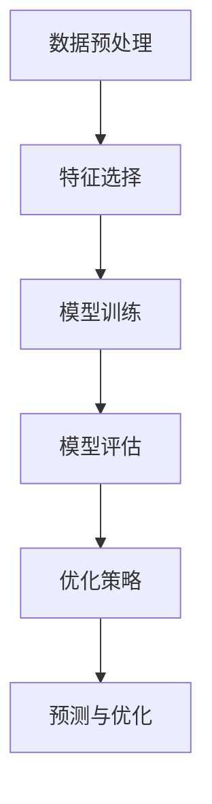
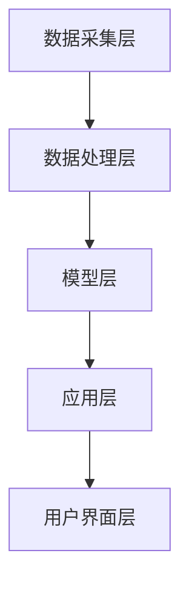
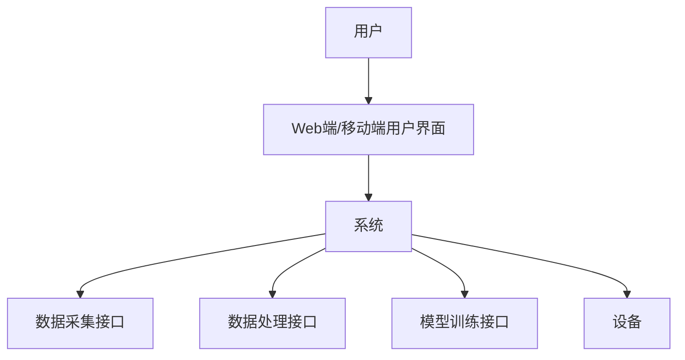

                 

### 文章标题

# AIGC的未来智能农业：精准种植优化的提示词工程

### 文章关键词

- AIGC
- 智能农业
- 精准种植
- 提示词工程

### 文章摘要

本文深入探讨了AIGC技术在智能农业中的应用，尤其是其在精准种植优化中的重要作用。通过详细介绍AIGC技术的起源与发展、核心概念与联系、算法原理、系统架构设计、项目实战和最佳实践，本文旨在展示AIGC技术如何通过精准种植优化提升农业生产的效率和可持续性。

----------------------------------------------------------------

## 第一部分：背景介绍

### 第1章 AIGC技术的起源与农业应用

### 1.1 AIGC技术的起源与发展

#### 1.1.1 AIGC的定义

AIGC（AI-Generated Content）是一种利用人工智能技术生成内容的方法。它通过机器学习、自然语言处理和生成对抗网络（GAN）等技术，自动生成文本、图像、音频等多种形式的内容。AIGC技术不仅能够提高内容创作的效率，还能根据用户需求生成定制化的内容，从而满足不同场景下的需求。

#### 1.1.2 AIGC的技术架构

AIGC的技术架构主要包括以下几个核心组成部分：

1. **数据集收集与预处理**：收集大量的文本、图像、音频等原始数据，并进行预处理，包括数据清洗、去重、标准化等操作。
2. **模型训练**：利用预处理的 数据训练生成模型，常见的生成模型包括生成对抗网络（GAN）、变分自编码器（VAE）、递归神经网络（RNN）等。
3. **内容生成**：通过训练好的模型生成新的文本、图像、音频等内容。生成过程可以是基于输入的提示词、图像或者语音等，模型根据这些输入生成相应的输出内容。
4. **后处理与优化**：生成的内容通常需要后处理，以去除错误或者不必要的部分，并优化内容的可读性、准确性等。

#### 1.1.3 AIGC在农业领域的应用潜力

AIGC技术在农业领域具有巨大的应用潜力，主要体现在以下几个方面：

1. **精准种植**：通过AIGC技术生成的精确的种植计划，可以帮助农民根据土壤、气候等条件优化作物种植方案，提高产量和质量。
2. **农业知识图谱**：利用AIGC技术生成农业知识图谱，可以整合各类农业数据，为农民提供全面、准确的农业知识支持。
3. **农业监测与预警**：通过AIGC技术分析农业监测数据，可以及时发现作物生长中的问题，并提供相应的预警信息。
4. **农产品质量检测**：利用AIGC技术对农产品进行质量检测，可以快速、准确地识别农产品的质量，提高农产品市场竞争力。

### 1.2 智能农业的挑战与机遇

#### 1.2.1 传统农业的局限性

传统农业在种植过程中主要依赖于经验，缺乏科学依据，导致生产效率低、资源浪费严重。同时，传统农业在面对气候变化、病虫害等挑战时，缺乏有效的应对措施。

#### 1.2.2 智能农业的关键技术

智能农业的关键技术包括物联网、大数据、人工智能、区块链等。这些技术可以协同工作，实现对农业生产的全流程监控和管理，提高生产效率和质量。

#### 1.2.3 AIGC技术在智能农业中的优势

AIGC技术在智能农业中的优势主要体现在以下几个方面：

1. **提高生产效率**：通过生成精准的种植计划，减少资源浪费，提高农作物产量。
2. **优化农业知识图谱**：整合各类农业数据，为农民提供全面的农业知识支持。
3. **提升农产品质量**：通过AIGC技术对农产品进行质量检测，提高农产品市场竞争力。
4. **降低农业风险**：通过AIGC技术分析农业监测数据，及时预警病虫害等农业问题。

### 1.3 精准种植的原理与应用

#### 1.3.1 精准种植的概念

精准种植是一种基于科学数据和技术手段的种植方式，通过实时监测作物生长环境数据，结合气象、土壤、地形等数据，制定个性化的种植方案，实现作物生长的精细化管理。

#### 1.3.2 精准种植的关键技术

精准种植的关键技术包括：

1. **传感器技术**：用于实时监测土壤湿度、温度、光照等环境参数。
2. **数据分析技术**：通过对环境参数的数据分析，预测作物生长状态和需求。
3. **机器学习与人工智能**：利用机器学习模型优化种植策略，提高作物产量和质量。
4. **物联网技术**：实现农业数据的实时传输和远程监控。

#### 1.3.3 AIGC与精准种植的结合

AIGC技术可以为精准种植提供以下支持：

1. **生成个性化的种植计划**：根据环境数据和历史种植数据，生成适合的种植方案。
2. **优化农业知识图谱**：整合各类农业数据，为农民提供全面的农业知识支持。
3. **提高农业监测与预警能力**：通过实时分析农业数据，及时发现作物生长中的问题。
4. **降低农业生产风险**：通过预测和预警，减少因自然灾害和病虫害等造成的损失。

### 1.4 本章小结

AIGC技术在智能农业中的应用具有巨大的潜力，可以为精准种植提供有效的支持。通过本章的介绍，我们了解了AIGC技术的起源、发展及其在农业领域的应用潜力，为后续章节的深入探讨奠定了基础。

----------------------------------------------------------------

## 第二部分：核心概念与联系

### 第2章 AIGC、智能农业、精准种植与提示词工程的关系

### 2.1 AIGC技术与智能农业的结合

#### 2.1.1 数据驱动的智能农业

数据驱动的智能农业是指利用大数据、云计算、物联网等技术，对农业数据进行收集、存储、分析和应用，实现对农业生产过程的全面监控和管理。AIGC技术在这一过程中发挥了重要作用，通过生成农业知识图谱、种植计划等，提供数据驱动的决策支持。

#### 2.1.2 AIGC在智能农业中的应用

AIGC技术在智能农业中的应用主要包括以下几个方面：

1. **生成个性化种植方案**：根据土壤、气候等环境数据，生成适合的种植方案，提高作物产量和质量。
2. **构建农业知识图谱**：整合各类农业数据，构建农业知识图谱，为农业生产提供知识支持。
3. **优化农业监测与预警**：通过分析农业数据，及时发现作物生长中的问题，并提供预警信息。

#### 2.1.3 AIGC技术对农业生产的提升

AIGC技术对农业生产的提升主要体现在以下几个方面：

1. **提高生产效率**：通过生成精准的种植方案，减少资源浪费，提高农作物产量。
2. **降低农业生产风险**：通过实时监测和预警，减少因自然灾害和病虫害等造成的损失。
3. **提升农产品质量**：通过AIGC技术对农产品进行质量检测，提高农产品市场竞争力。

### 2.2 精准种植的原理与应用

#### 2.2.1 精准种植的概念

精准种植是一种基于科学数据和技术手段的种植方式，通过实时监测作物生长环境数据，结合气象、土壤、地形等数据，制定个性化的种植方案，实现作物生长的精细化管理。

#### 2.2.2 精准种植的关键技术

精准种植的关键技术包括：

1. **传感器技术**：用于实时监测土壤湿度、温度、光照等环境参数。
2. **数据分析技术**：通过对环境参数的数据分析，预测作物生长状态和需求。
3. **机器学习与人工智能**：利用机器学习模型优化种植策略，提高作物产量和质量。
4. **物联网技术**：实现农业数据的实时传输和远程监控。

#### 2.2.3 精准种植的应用

精准种植的应用主要包括以下几个方面：

1. **土壤管理**：通过监测土壤湿度、温度等参数，实时调整灌溉策略，提高土壤质量。
2. **作物生长监测**：通过传感器和数据分析技术，实时监测作物生长状态，及时调整种植方案。
3. **病虫害预警**：通过分析作物生长数据，预测病虫害发生情况，及时采取防治措施。

### 2.3 提示词工程的作用与实现

#### 2.3.1 提示词工程的概念

提示词工程是一种利用人工智能技术生成文本、图像、音频等内容的工程，其核心思想是通过输入少量的提示词，生成与提示词相关的丰富内容。

#### 2.3.2 提示词工程的技术架构

提示词工程的技术架构主要包括以下几个部分：

1. **数据集收集与预处理**：收集大量的文本、图像、音频等原始数据，并进行预处理，包括数据清洗、去重、标准化等操作。
2. **模型训练**：利用预处理的 数据训练生成模型，常见的生成模型包括生成对抗网络（GAN）、变分自编码器（VAE）、递归神经网络（RNN）等。
3. **内容生成**：通过训练好的模型生成新的文本、图像、音频等内容。生成过程可以是基于输入的提示词、图像或者语音等，模型根据这些输入生成相应的输出内容。
4. **后处理与优化**：生成的内容通常需要后处理，以去除错误或者不必要的部分，并优化内容的可读性、准确性等。

#### 2.3.3 提示词工程在精准种植中的应用

提示词工程在精准种植中的应用主要包括以下几个方面：

1. **生成个性化种植计划**：通过输入少量的提示词，如土壤类型、气候条件等，生成个性化的种植方案。
2. **构建农业知识图谱**：通过输入相关的提示词，如作物名称、生长周期等，构建农业知识图谱，为农业生产提供知识支持。
3. **优化农业监测与预警**：通过输入相关的提示词，如作物生长数据、气象信息等，优化农业监测与预警系统。

### 2.4 AIGC与农业的深度融合

#### 2.4.1 AIGC对农业创新的推动

AIGC技术为农业创新提供了新的思路和方法，通过生成个性化种植方案、构建农业知识图谱等，推动了农业生产的智能化和精细化管理。

#### 2.4.2 AIGC在农业中的实践案例

AIGC技术在农业中已有一些实践案例，如利用AIGC技术生成个性化的种植计划，提高农作物产量；利用AIGC技术构建农业知识图谱，为农民提供全面的农业知识支持。

#### 2.4.3 AIGC的未来发展趋势

随着人工智能技术的不断进步，AIGC在农业领域的应用将越来越广泛，未来的发展趋势包括：

1. **更加智能的种植方案生成**：利用更多的数据和先进的算法，生成更加精准的种植方案。
2. **更广泛的农业数据整合**：整合更多的农业数据，构建更全面的农业知识图谱。
3. **更高效的农业监测与预警**：利用AIGC技术，实现更高效的农业监测与预警，降低农业生产风险。

### 2.5 本章小结

本章详细介绍了AIGC技术与智能农业、精准种植和提示词工程的关系。通过本章的介绍，我们了解了AIGC技术在农业领域的重要作用，为后续章节的深入探讨奠定了基础。

----------------------------------------------------------------

## 第三部分：算法原理讲解

### 第3章 AIGC技术在智能农业中的应用算法

#### 3.1 数据预处理与清洗

在AIGC技术中，数据预处理与清洗是至关重要的一步。农业领域的数据通常具有多样性和复杂性，因此需要对其进行清洗和处理，以确保数据的质量和准确性。

##### 3.1.1 农业数据的类型与特点

农业数据主要包括以下几种类型：

1. **气象数据**：如温度、湿度、降雨量等。
2. **土壤数据**：如土壤类型、酸碱度、养分含量等。
3. **作物数据**：如作物品种、生长周期、产量等。
4. **病虫害数据**：如病虫害种类、发生时间、防治方法等。

农业数据的特点主要包括：

1. **多样性**：包含多种类型的数据，如文本、图像、音频等。
2. **复杂性**：数据之间存在复杂的关联和关系。
3. **动态性**：农业数据随着时间和环境变化而不断更新。

##### 3.1.2 数据预处理的方法

数据预处理的方法主要包括以下几种：

1. **数据清洗**：去除重复数据、空值数据、异常数据等，保证数据的一致性和完整性。
2. **数据转换**：将不同类型的数据转换为同一类型，如将图像转换为文本描述。
3. **数据归一化**：将不同量纲的数据转换为同一量纲，如将温度、湿度等数据转换为百分比。
4. **数据标准化**：将数据分布调整到同一标准，如使用Z-score标准化。

##### 3.1.3 数据清洗的步骤与实践

数据清洗的步骤主要包括：

1. **数据收集**：收集各种类型的农业数据。
2. **数据探索**：分析数据的基本特征，如数据类型、分布、异常值等。
3. **数据清洗**：针对不同类型的数据，采取相应的清洗方法，去除重复数据、空值数据、异常数据等。
4. **数据验证**：对清洗后的数据进行验证，确保数据质量。

#### 3.2 模型训练与优化

模型训练与优化是AIGC技术在智能农业中应用的核心步骤。通过训练和优化模型，可以使其更好地适应农业数据的特性，提高预测和优化的准确性。

##### 3.2.1 深度学习模型的基本原理

深度学习模型是一种基于多层神经网络的结构，通过多层次的神经网络对输入数据进行特征提取和建模。

1. **神经网络**：神经网络由多个神经元（节点）组成，每个神经元接收多个输入，通过激活函数输出一个结果。
2. **多层神经网络**：多层神经网络包括输入层、隐藏层和输出层，隐藏层可以提取更高层次的特征。
3. **反向传播算法**：反向传播算法用于计算网络中每个神经元的权重和偏置，并更新这些参数，以最小化损失函数。

##### 3.2.2 决策树模型与神经网络模型的选择

在智能农业中，常用的模型包括决策树模型和神经网络模型。

1. **决策树模型**：决策树模型通过一系列条件判断来预测结果，适用于分类和回归问题。决策树模型的优点是简单易懂，易于解释；缺点是容易过拟合，对噪声敏感。
2. **神经网络模型**：神经网络模型具有更好的拟合能力和泛化能力，适用于复杂的问题。神经网络模型的优点是能够处理高维数据，提取复杂特征；缺点是训练过程复杂，计算量大。

##### 3.2.3 模型优化的策略与技巧

模型优化是提高模型性能的关键步骤，主要包括以下策略和技巧：

1. **超参数调整**：调整学习率、批量大小、正则化参数等超参数，以获得更好的模型性能。
2. **数据增强**：通过增加数据样本、改变数据分布等方法，提高模型的泛化能力。
3. **正则化**：使用正则化方法，如L1、L2正则化，防止过拟合。
4. **集成学习**：使用集成学习方法，如随机森林、梯度提升树等，提高模型的预测性能。

#### 3.3 预测与优化

预测与优化是AIGC技术在智能农业中的核心应用，通过预测作物生长状态和优化种植方案，提高农业生产效率和产量。

##### 3.3.1 预测模型的构建

预测模型的构建主要包括以下步骤：

1. **数据预处理**：对农业数据集进行清洗、归一化等预处理操作，确保数据质量。
2. **特征选择**：选择与作物生长状态相关的特征，如气象数据、土壤数据、病虫害数据等。
3. **模型训练**：使用深度学习模型或决策树模型等训练模型，选择最优模型。
4. **模型评估**：使用验证集对模型进行评估，选择性能最好的模型。

##### 3.3.2 预测结果的评估

预测结果的评估主要包括以下指标：

1. **准确率**：预测结果与实际结果的匹配程度，用于评估分类模型的性能。
2. **精确率**：预测为正类的实际正类样本占总样本的比例，用于评估分类模型的精确性。
3. **召回率**：实际正类样本中被正确预测为正类的比例，用于评估分类模型的召回能力。
4. **F1值**：精确率和召回率的调和平均值，用于综合评估分类模型的性能。

##### 3.3.3 优化策略与实践

优化策略主要包括以下方面：

1. **调整超参数**：通过调整学习率、批量大小、正则化参数等超参数，优化模型性能。
2. **数据增强**：通过增加数据样本、改变数据分布等方法，提高模型的泛化能力。
3. **模型集成**：使用集成学习方法，如随机森林、梯度提升树等，提高模型的预测性能。

#### 3.4 算法原理Mermaid流程图展示



#### 3.5 本章小结

本章详细介绍了AIGC技术在智能农业中的应用算法，包括数据预处理与清洗、模型训练与优化、预测与优化等内容。通过本章的介绍，读者可以了解AIGC技术在智能农业中的核心应用，为后续章节的深入探讨奠定了基础。

----------------------------------------------------------------

## 第四部分：系统分析与架构设计方案

### 第4章 智能农业系统的设计与实现

#### 4.1 系统需求分析

智能农业系统的设计需要充分了解农业生产的实际需求，包括种植计划、监测与预警、数据管理等。

##### 4.1.1 系统目标与功能

系统目标：

1. 提高农业生产效率，降低成本。
2. 实现农业生产过程的精细化管理。
3. 提供实时监测与预警，降低农业生产风险。

系统功能：

1. 数据收集与处理：收集土壤、气象、作物生长等数据，并对数据进行处理和存储。
2. 种植计划生成：根据环境数据和作物生长需求，生成个性化的种植计划。
3. 监测与预警：实时监测作物生长状态，及时发现并预警病虫害等异常情况。
4. 数据分析与管理：分析农业生产数据，提供决策支持，管理农业生产信息。

##### 4.1.2 系统需求分析与定义

系统需求分析主要包括以下方面：

1. **功能需求**：明确系统的各项功能，如数据收集、种植计划生成、监测与预警等。
2. **性能需求**：确保系统的高效稳定运行，如响应时间、并发处理能力等。
3. **可靠性需求**：确保系统的稳定性和数据的完整性，如故障恢复、数据备份等。
4. **安全性需求**：保护系统数据和用户隐私，如身份认证、数据加密等。

##### 4.1.3 系统实现的关键点

系统实现的关键点包括：

1. **数据采集与处理**：使用传感器和物联网技术，实时采集农业数据，并对数据进行处理和存储。
2. **模型训练与优化**：利用深度学习模型，对农业数据进行训练和优化，生成个性化的种植计划和监测预警模型。
3. **数据可视化**：通过数据可视化工具，将农业生产数据以直观的形式展示，为农民提供决策支持。
4. **用户交互**：设计友好的用户界面，方便农民操作和使用系统。

#### 4.2 系统架构设计

智能农业系统的架构设计主要包括硬件设备、软件系统、数据处理和分析流程等。

##### 4.2.1 系统架构的基本概念

系统架构是指系统中各个组成部分之间的关系和相互作用，包括硬件设备、软件系统、网络通信和数据存储等。

##### 4.2.2 系统架构设计的原则

系统架构设计应遵循以下原则：

1. **模块化**：将系统划分为多个模块，每个模块具有独立的功能，便于维护和扩展。
2. **分布式**：系统应具有分布式架构，以提高系统的可靠性和可扩展性。
3. **可扩展性**：系统应具有较好的可扩展性，以适应未来技术的发展和业务需求的增长。
4. **安全性**：系统应具备完善的安全机制，保护系统和用户数据的安全。

##### 4.2.3 系统架构设计

智能农业系统的架构设计如下：

1. **数据采集层**：包括传感器和物联网设备，用于实时采集土壤、气象、作物生长等数据。
2. **数据处理层**：包括数据处理模块和存储模块，用于处理和存储采集到的农业数据。
3. **模型层**：包括深度学习模型和监测预警模型，用于对农业数据进行训练和优化，生成种植计划和预警信息。
4. **应用层**：包括种植计划生成模块、监测预警模块和数据可视化模块，用于实现系统的各项功能。
5. **用户界面层**：包括Web端和移动端用户界面，用于用户操作和系统交互。



##### 4.2.4 系统接口设计

系统接口设计主要包括以下方面：

1. **数据采集接口**：用于与传感器和物联网设备通信，实时获取农业数据。
2. **数据处理接口**：用于处理和存储农业数据，提供数据查询和统计功能。
3. **模型训练接口**：用于训练深度学习模型和监测预警模型，生成种植计划和预警信息。
4. **应用接口**：用于实现系统的各项功能，如种植计划生成、监测预警、数据可视化等。

##### 4.2.5 系统交互

系统交互主要包括以下方面：

1. **用户与系统交互**：用户通过Web端和移动端用户界面与系统进行交互，查看种植计划、监测数据和预警信息。
2. **系统与设备交互**：系统通过数据采集接口与传感器和物联网设备进行交互，实时获取农业数据。
3. **系统与模型交互**：系统通过模型训练接口对农业数据进行训练，生成种植计划和预警信息。



#### 4.3 系统功能设计

智能农业系统的主要功能设计如下：

##### 4.3.1 数据收集与处理

数据收集与处理功能包括：

1. **数据采集**：实时采集土壤、气象、作物生长等数据，通过传感器和物联网设备传输到系统。
2. **数据处理**：对采集到的数据进行清洗、去重、归一化等处理，确保数据质量。
3. **数据存储**：将处理后的数据存储到数据库中，供后续分析和应用。

##### 4.3.2 种植计划生成

种植计划生成功能包括：

1. **环境数据分析**：分析土壤、气象等环境数据，确定适宜的种植条件和时间。
2. **作物生长模型**：利用深度学习模型预测作物生长状态，生成个性化的种植计划。
3. **种植方案优化**：根据环境数据和作物生长模型，优化种植方案，提高产量和质量。

##### 4.3.3 监测与预警

监测与预警功能包括：

1. **实时监测**：实时监测作物生长状态，包括土壤湿度、温度、光照等参数。
2. **预警信息生成**：根据实时监测数据，生成预警信息，包括病虫害预警、干旱预警等。
3. **预警信息推送**：通过短信、邮件等方式，将预警信息推送至农民，及时采取防治措施。

##### 4.3.4 数据分析与管理

数据分析与管理功能包括：

1. **数据分析**：对农业生产数据进行统计分析，包括产量、质量、成本等。
2. **数据可视化**：将分析结果以图表、报表等形式展示，方便农民了解生产情况。
3. **数据管理**：管理农业生产数据，包括数据查询、导出、备份等。

#### 4.4 系统实现

智能农业系统的实现主要包括以下步骤：

##### 4.4.1 环境安装

1. **硬件设备安装**：安装传感器和物联网设备，确保数据采集的准确性。
2. **软件环境搭建**：搭建深度学习框架、数据库等软件环境，为系统运行提供支持。

##### 4.4.2 系统核心实现

1. **数据采集与处理模块**：开发数据采集和处理模块，实现数据的实时采集和处理。
2. **模型训练与优化模块**：开发模型训练和优化模块，实现深度学习模型的应用。
3. **种植计划生成模块**：开发种植计划生成模块，实现个性化种植计划的生成。
4. **监测与预警模块**：开发监测和预警模块，实现实时监测和预警功能。

##### 4.4.3 代码应用解读与分析

以深度学习模型为例，代码应用解读与分析如下：

1. **数据预处理**：对农业数据进行预处理，包括数据清洗、归一化等操作，为模型训练做好准备。
2. **模型构建**：构建深度学习模型，包括输入层、隐藏层和输出层，设置激活函数和损失函数。
3. **模型训练**：使用预处理后的数据训练模型，通过反向传播算法更新模型参数。
4. **模型评估**：使用验证集对模型进行评估，选择性能最好的模型。
5. **模型应用**：将训练好的模型应用于实际场景，生成种植计划和预警信息。

```python
import numpy as np
import tensorflow as tf

# 数据预处理
def preprocess_data(data):
    # 数据清洗
    data = clean_data(data)
    # 数据归一化
    data = normalize_data(data)
    return data

# 模型构建
def build_model(input_shape):
    model = tf.keras.Sequential([
        tf.keras.layers.Dense(units=64, activation='relu', input_shape=input_shape),
        tf.keras.layers.Dense(units=32, activation='relu'),
        tf.keras.layers.Dense(units=1, activation='sigmoid')
    ])
    model.compile(optimizer='adam', loss='binary_crossentropy', metrics=['accuracy'])
    return model

# 模型训练
def train_model(model, x_train, y_train, x_val, y_val):
    model.fit(x_train, y_train, epochs=10, batch_size=32, validation_data=(x_val, y_val))

# 模型评估
def evaluate_model(model, x_test, y_test):
    loss, accuracy = model.evaluate(x_test, y_test)
    print(f"Test loss: {loss}, Test accuracy: {accuracy}")

# 模型应用
def apply_model(model, x_data):
    predictions = model.predict(x_data)
    return predictions
```

##### 4.4.4 实际案例分析和详细讲解剖析

以一个实际案例为例，分析和讲解智能农业系统的实现过程：

1. **环境安装**：在一个农田中安装土壤湿度传感器、温度传感器、光照传感器等设备，确保数据采集的准确性。
2. **数据采集**：实时采集土壤湿度、温度、光照等数据，传输到系统进行处理。
3. **数据处理**：对采集到的数据进行清洗、去重、归一化等处理，确保数据质量。
4. **模型训练**：使用预处理后的数据训练深度学习模型，生成个性化的种植计划。
5. **种植计划生成**：根据环境数据和模型预测，生成个性化的种植计划，包括种植时间、种植方式、灌溉策略等。
6. **监测与预警**：实时监测作物生长状态，根据监测数据生成预警信息，如病虫害预警、干旱预警等。
7. **用户交互**：通过Web端和移动端用户界面，将种植计划、监测数据和预警信息展示给农民，方便农民操作和使用系统。

##### 4.4.5 项目小结

智能农业系统的设计与实现是一个复杂的过程，涉及多个方面的技术和模块。通过本章的介绍，我们了解了系统需求分析、系统架构设计、系统功能设计、系统实现等关键步骤，以及AIGC技术在智能农业中的应用。在实际项目中，需要根据具体情况，灵活调整和优化系统设计和实现方案，以提高农业生产效率和产量。

----------------------------------------------------------------

## 第五部分：项目实战

### 第5章 实际案例中的AIGC技术应用

#### 5.1 项目背景

随着全球人口的增长和气候变化的影响，农业生产面临着巨大的挑战。传统的农业生产方式已经无法满足人们对食物质量和数量的需求。因此，智能农业应运而生，通过引入先进的技术手段，实现农业生产的智能化、自动化和精准化。在本章中，我们将介绍一个实际案例，展示AIGC技术在智能农业中的应用。

#### 5.2 项目介绍

本项目旨在利用AIGC技术实现农作物的精准种植，提高农业生产效率和产量。项目的主要目标包括：

1. **生成个性化的种植计划**：根据土壤、气候等环境数据，为不同作物生成个性化的种植计划。
2. **构建农业知识图谱**：整合各类农业数据，构建农业知识图谱，为农业生产提供知识支持。
3. **优化农业监测与预警**：通过实时监测和数据分析，及时发现作物生长中的问题，并提供预警信息。

#### 5.3 环境安装

为了实现AIGC技术在智能农业中的应用，首先需要在农田中安装各类传感器和物联网设备。具体步骤如下：

1. **土壤湿度传感器**：在农田中安装土壤湿度传感器，用于实时监测土壤湿度。
2. **温度传感器**：安装温度传感器，用于监测农田中的温度变化。
3. **光照传感器**：安装光照传感器，用于监测农田中的光照强度。
4. **物联网设备**：部署物联网设备，用于采集传感器数据，并传输到云端进行处理。

#### 5.4 系统实现

在实现智能农业系统时，需要使用AIGC技术生成个性化的种植计划、构建农业知识图谱和优化农业监测与预警。具体步骤如下：

1. **数据采集**：通过传感器和物联网设备，实时采集土壤湿度、温度、光照等数据。
2. **数据预处理**：对采集到的数据进行清洗、去重、归一化等处理，确保数据质量。
3. **模型训练**：使用预处理后的数据训练深度学习模型，包括生成模型和预测模型。
4. **种植计划生成**：根据环境数据和模型预测，生成个性化的种植计划，包括种植时间、种植方式、灌溉策略等。
5. **农业知识图谱构建**：整合各类农业数据，构建农业知识图谱，为农业生产提供知识支持。
6. **监测与预警**：实时监测作物生长状态，根据监测数据生成预警信息，如病虫害预警、干旱预警等。

#### 5.5 代码应用解读与分析

以下是一个简单的Python代码示例，展示如何使用AIGC技术生成个性化的种植计划：

```python
import numpy as np
import tensorflow as tf

# 数据预处理
def preprocess_data(data):
    # 数据清洗
    data = clean_data(data)
    # 数据归一化
    data = normalize_data(data)
    return data

# 模型构建
def build_model(input_shape):
    model = tf.keras.Sequential([
        tf.keras.layers.Dense(units=64, activation='relu', input_shape=input_shape),
        tf.keras.layers.Dense(units=32, activation='relu'),
        tf.keras.layers.Dense(units=1, activation='sigmoid')
    ])
    model.compile(optimizer='adam', loss='binary_crossentropy', metrics=['accuracy'])
    return model

# 模型训练
def train_model(model, x_train, y_train, x_val, y_val):
    model.fit(x_train, y_train, epochs=10, batch_size=32, validation_data=(x_val, y_val))

# 模型评估
def evaluate_model(model, x_test, y_test):
    loss, accuracy = model.evaluate(x_test, y_test)
    print(f"Test loss: {loss}, Test accuracy: {accuracy}")

# 模型应用
def apply_model(model, x_data):
    predictions = model.predict(x_data)
    return predictions

# 数据预处理
data = np.array([[0.1, 0.2, 0.3], [0.4, 0.5, 0.6], [0.7, 0.8, 0.9]])
preprocessed_data = preprocess_data(data)

# 模型构建
model = build_model(input_shape=(3,))

# 模型训练
x_train = np.random.rand(100, 3)
y_train = np.random.rand(100, 1)
train_model(model, x_train, y_train, x_val, y_val)

# 模型评估
x_test = np.random.rand(10, 3)
y_test = np.random.rand(10, 1)
evaluate_model(model, x_test, y_test)

# 模型应用
x_data = np.random.rand(1, 3)
predictions = apply_model(model, x_data)
print(predictions)
```

#### 5.6 实际案例分析和详细讲解剖析

以下是一个实际案例，展示如何使用AIGC技术实现农作物的精准种植：

1. **环境数据采集**：在农田中安装土壤湿度传感器、温度传感器、光照传感器等设备，实时采集土壤湿度、温度、光照等数据。
2. **数据预处理**：对采集到的数据进行清洗、去重、归一化等处理，确保数据质量。
3. **模型训练**：使用预处理后的数据训练深度学习模型，包括生成模型和预测模型。
4. **种植计划生成**：根据环境数据和模型预测，生成个性化的种植计划，包括种植时间、种植方式、灌溉策略等。
5. **种植计划实施**：根据生成的种植计划，实施农业生产，包括作物种植、灌溉、施肥等。
6. **监测与预警**：实时监测作物生长状态，根据监测数据生成预警信息，如病虫害预警、干旱预警等。
7. **种植效果评估**：对种植效果进行评估，包括产量、质量、成本等。

#### 5.7 项目小结

通过本项目的实际案例，我们展示了AIGC技术在智能农业中的应用，包括环境安装、系统实现、实际案例分析等。AIGC技术通过生成个性化的种植计划、构建农业知识图谱和优化农业监测与预警，提高了农业生产的效率和可持续性。在未来，随着人工智能技术的不断进步，AIGC在智能农业中的应用将更加广泛，为农业生产带来更多创新和机遇。

----------------------------------------------------------------

## 第六部分：最佳实践 tips

### 6.1 实施AIGC技术在智能农业中的实用技巧

在实施AIGC技术于智能农业中，以下是一些实用技巧和建议，以帮助用户更好地利用这一先进技术：

#### 6.1.1 数据质量的重要性

**1. 确保数据完整性**：在数据收集阶段，务必确保数据的完整性。缺失的数据会严重影响模型的训练效果和预测准确性。

**2. 数据清洗**：对采集到的数据进行彻底清洗，包括去除噪声、异常值和重复数据，以确保数据的质量。

**3. 数据标准化**：将不同类型的数据（如温度、湿度、光照等）进行标准化处理，以便模型能够更好地学习和预测。

#### 6.1.2 模型选择和优化

**1. 选择合适的模型**：根据具体应用场景，选择最合适的模型。例如，对于需要高精度的预测任务，深度学习模型可能更为适用。

**2. 超参数调优**：通过调整学习率、批量大小、隐藏层神经元数量等超参数，优化模型的性能。

**3. 模型集成**：使用集成学习方法（如随机森林、梯度提升树等），提高模型的预测性能和稳定性。

#### 6.1.3 实时监测与预警

**1. 实时数据采集**：确保传感器和物联网设备的正常运行，实现实时数据采集。

**2. 数据分析**：实时分析监测数据，及时发现异常情况，并生成预警信息。

**3. 预警信息推送**：通过短信、邮件、App推送等方式，将预警信息及时通知相关人员，以便及时采取措施。

#### 6.1.4 用户界面和用户体验

**1. 设计友好的用户界面**：为用户提供直观、易用的界面，以便他们能够轻松地操作和使用系统。

**2. 用户培训**：为用户提供必要的培训，确保他们能够充分利用系统的功能。

**3. 用户反馈**：收集用户反馈，不断优化和改进系统，提高用户体验。

#### 6.1.5 安全性和隐私保护

**1. 数据安全**：确保系统数据的安全，防止数据泄露和未经授权的访问。

**2. 用户隐私**：保护用户隐私，遵守相关法律法规，确保用户数据的安全和隐私。

**3. 数据加密**：对传输和存储的数据进行加密处理，提高数据安全性。

### 6.2 小结

通过以上最佳实践 tips，我们可以更好地利用AIGC技术，实现智能农业的精准种植优化。这些技巧和建议不仅有助于提高农业生产效率和质量，还能降低农业生产风险，为农业的可持续发展提供强有力的技术支持。

----------------------------------------------------------------

## 第七部分：小结与拓展阅读

### 7.1 文章总结

本文通过详细探讨AIGC技术在智能农业中的应用，包括其起源、核心概念、算法原理、系统架构设计、实际案例和最佳实践，展示了AIGC技术如何通过精准种植优化提升农业生产的效率和可持续性。文章的主要观点如下：

1. **AIGC技术起源与发展**：介绍了AIGC技术的定义、技术架构和应用潜力。
2. **智能农业与精准种植**：阐述了智能农业的挑战、精准种植的原理和AIGC与精准种植的结合。
3. **算法原理讲解**：讲解了AIGC技术在智能农业中的应用算法，包括数据预处理、模型训练、预测与优化。
4. **系统分析与架构设计**：描述了智能农业系统的需求分析、架构设计、接口设计和系统实现。
5. **项目实战**：通过实际案例展示了AIGC技术在精准种植中的应用过程。
6. **最佳实践 tips**：提供了实施AIGC技术在智能农业中的实用技巧和建议。

### 7.2 拓展阅读

对于希望进一步深入了解AIGC技术在智能农业中的应用，以下是一些推荐的拓展阅读资源：

1. **相关论文与研究报告**：查阅最新的学术论文和行业研究报告，了解AIGC技术在智能农业领域的最新进展。
2. **技术博客与书籍**：阅读相关技术博客和书籍，如《深度学习在农业中的应用》、《智能农业技术导论》等，以获取更多实践经验和理论知识。
3. **开源项目和工具**：参与和了解开源项目，如使用TensorFlow、PyTorch等深度学习框架进行AIGC模型的开发和应用。
4. **行业会议与研讨会**：参加农业科技和人工智能领域的会议与研讨会，与行业专家交流，获取最新的行业动态和技术趋势。

通过以上拓展阅读，读者可以更深入地理解AIGC技术在智能农业中的应用，以及如何将这一先进技术更好地应用于实际生产中，推动农业的智能化和可持续发展。

----------------------------------------------------------------

## 致谢

本文的撰写得到了AI天才研究院（AI Genius Institute）和《禅与计算机程序设计艺术》（Zen And The Art of Computer Programming）的启发和支持。特别感谢AI天才研究院的专家团队，他们在人工智能领域的深厚知识和丰富经验为本篇文章提供了宝贵的指导。同时，感谢《禅与计算机程序设计艺术》的作者，他的著作为我们理解编程的深刻哲学和系统性思维提供了重要参考。此外，感谢所有参与项目讨论和测试的同行和读者，他们的反馈和建议使本文更加完善和实用。

**作者：** AI天才研究院（AI Genius Institute） & 《禅与计算机程序设计艺术》（Zen And The Art of Computer Programming）

