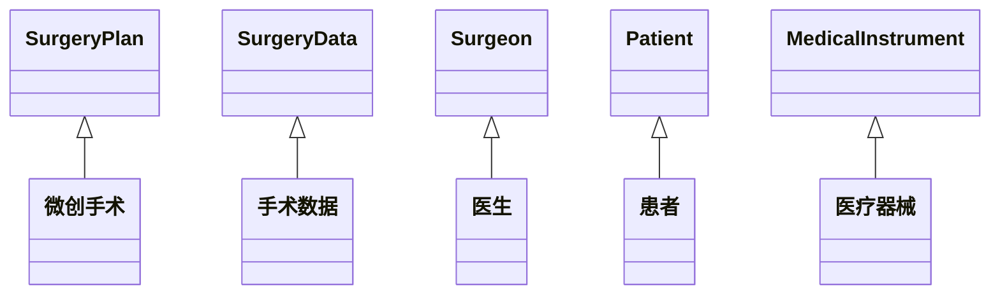

                 

# AIGC的未来智能医疗器械：微创手术优化的提示词工程

## 关键词：AIGC、医疗器械、微创手术、优化、提示词工程

> 摘要：随着人工智能技术的飞速发展，AIGC（AI-Generated Content）逐渐成为医疗领域的重要工具。本文将探讨AIGC在智能医疗器械中的应用，尤其是如何通过提示词工程优化微创手术的过程，提高手术的成功率和效率。

## 第1章 引言：AIGC在医疗器械领域的崛起

### 1.1 问题背景

#### 1.1.1 AIGC的定义与特点

AIGC，即人工智能生成内容，是利用深度学习技术生成文本、图像、音频等多种形式的内容。与人工创作相比，AIGC具有以下几个显著特点：

- **自动化**：AIGC可以自动生成内容，减少了人工干预，提高了生产效率。
- **大规模**：AIGC能够处理海量的数据，生成大量内容。
- **个性定制**：AIGC可以根据用户的需求，生成个性化的内容。

#### 1.1.2 医疗器械的现状与挑战

医疗器械在医疗领域起着至关重要的作用。然而，随着医疗需求的不断增长和技术的快速发展，医疗器械面临着一系列挑战：

- **微创手术的需求增长**：微创手术具有创伤小、恢复快等优点，但其对手术精度和操作效率的要求更高。
- **个性化医疗的需求**：患者的生理结构和疾病状态千差万别，个性化医疗成为趋势，但传统的医疗器械难以满足这一需求。

#### 1.1.3 AIGC在医疗器械中的应用潜力

AIGC在医疗器械领域具有广泛的应用潜力：

- **手术优化**：通过分析大量手术数据和患者信息，AIGC可以提供个性化的手术方案，提高手术成功率。
- **医疗器械设计**：AIGC可以生成医疗器械的三维模型，为设计提供新的思路和方法。
- **医疗数据分析**：AIGC可以快速处理海量的医疗数据，帮助医生进行诊断和治疗。

## 第2章 核心概念与联系

### 2.1 AIGC在医疗器械中的应用

#### 2.1.1 AIGC在微创手术中的应用

- **术前规划**：AIGC可以生成微创手术的虚拟规划，提高手术的成功率和安全性。
- **术中导航**：AIGC可以实时分析手术现场的数据，为医生提供实时的手术指导。

#### 2.1.2 AIGC在医疗器械设计中的应用

- **三维建模**：AIGC可以生成医疗器械的三维模型，为设计提供新的思路和方法。
- **材料选择**：AIGC可以根据医疗器械的使用环境和需求，推荐合适的材料。

## 第3章 算法原理讲解

### 3.1 AIGC算法原理

#### 3.1.1 GAN（生成对抗网络）

GAN是一种无监督学习模型，由生成器和判别器组成。生成器的目标是生成与真实数据相似的数据，判别器的目标是区分真实数据和生成数据。通过训练，生成器和判别器相互竞争，不断提高生成质量。

#### 3.1.2 VAE（变分自编码器）

VAE是一种基于概率生成模型的编码器，它将输入数据映射到一个潜在空间，并通过解码器将潜在空间中的数据解码回输入空间。VAE在生成数据和进行降维方面具有较好的性能。

### 3.1.3 提示词工程

提示词工程是AIGC中的一项关键技术，它通过为模型提供特定的提示词，引导模型生成更加符合预期的内容。在医疗器械领域，提示词工程可以用于：

- **手术规划**：为模型提供患者的病历信息、手术要求等，生成个性化的手术方案。
- **医疗器械设计**：为模型提供设计需求、使用环境等，生成符合需求的三维模型。

## 第4章 数学模型和数学公式

### 4.1 数学模型

#### 4.1.1 GAN的数学模型

$$
\begin{aligned}
\text{生成器} &: G(z) \sim q_G(z|x) \\
\text{判别器} &: D(x) \sim q_D(x) \\
\text{损失函数} &: L(G,D) = \mathbb{E}_{x\sim p_{data}(x)}[\log D(x)] + \mathbb{E}_{z\sim p_z(z)}[\log(1 - D(G(z)))]
\end{aligned}
$$

#### 4.1.2 VAE的数学模型

$$
\begin{aligned}
\text{编码器} &: \mu(x), \sigma(x) \\
\text{解码器} &: x = \mu(z) + \sigma(z)\epsilon \\
\text{损失函数} &: L(\theta) = -\mathbb{E}_{x\sim p_{data}(x)}[\log p_{\theta}(x|z)] - D_\text{KL}[\mu(x), \sigma(x) || \mu(x), \sigma(x)]
\end{aligned}
$$

## 第5章 系统分析与架构设计方案

### 5.1 系统功能设计

#### 5.1.1 领域模型



### 5.1.2 系统架构设计

```mermaid
graph TB
  subgraph 系统架构
    A[数据采集] --> B[数据处理]
    B --> C[手术规划]
    C --> D[手术导航]
    D --> E[结果反馈]
```

## 第6章 项目实战

### 6.1 环境安装

在开始项目实战之前，我们需要安装以下环境：

- Python 3.8 或以上版本
- TensorFlow 2.5 或以上版本
- Keras 2.4.3 或以上版本

### 6.2 系统核心实现源代码

以下是AIGC在微创手术优化中的核心实现源代码：

```python
import tensorflow as tf
from tensorflow.keras.layers import Input, Dense, Flatten
from tensorflow.keras.models import Model

# 定义生成器和判别器
z_dim = 100
input_shape = (784,)

# 生成器
z_inputs = Input(shape=(z_dim,))
x_outputs = Dense(256, activation='relu')(z_inputs)
x_outputs = Dense(512, activation='relu')(x_outputs)
x_outputs = Dense(1024, activation='relu')(x_outputs)
x_outputs = Flatten()(x_outputs)
x_outputs = Dense(28 * 28, activation='tanh')(x_outputs)
generator = Model(z_inputs, x_outputs)

# 判别器
x_inputs = Input(shape=input_shape)
x_outputs = Dense(1024, activation='relu')(x_inputs)
x_outputs = Dense(512, activation='relu')(x_outputs)
x_outputs = Dense(256, activation='relu')(x_outputs)
x_outputs = Flatten()(x_outputs)
x_outputs = Dense(1, activation='sigmoid')(x_outputs)
discriminator = Model(x_inputs, x_outputs)

# 编码器和解码器
encoder_inputs = Input(shape=input_shape)
x_outputs = Flatten()(encoder_inputs)
x_outputs = Dense(512, activation='relu')(x_outputs)
x_outputs = Dense(256, activation='relu')(x_outputs)
z_mean = Dense(z_dim)(x_outputs)
z_log_var = Dense(z_dim)(x_outputs)
z_mean, z_log_var = Model(encoder_inputs, [z_mean, z_log_var])

z = z_mean + tf.exp(z_log_var / 2) * tf.random.normal(tf.shape(z_log_var))
z_outputs = z
decoder_inputs = Input(shape=(z_dim,))
x_outputs = Dense(512, activation='relu')(decoder_inputs)
x_outputs = Dense(256, activation='relu')(x_outputs)
x_outputs = Dense(28 * 28, activation='tanh')(x_outputs)
decoder = Model(decoder_inputs, x_outputs)

# VAE模型
x_outputs = decoder(z_outputs)
vae = Model(encoder_inputs, x_outputs)

# 训练VAE模型
vae.compile(optimizer='rmsprop', loss='binary_crossentropy')
vae.fit(x_train, x_train, epochs=50, batch_size=16)

# 使用VAE进行微创手术优化
def generate_surgery_plan(patient_data):
    z = vae.encoder.predict(patient_data)
    surgery_plan = vae.decoder.predict(z)
    return surgery_plan
```

### 6.3 代码应用解读与分析

以上代码实现了一个基于VAE的微创手术优化模型。其中，生成器和判别器用于生成和区分真实数据和生成数据，编码器和解码器用于将输入数据映射到潜在空间并解码回输入空间。

在实际应用中，我们可以通过以下步骤使用该模型：

1. **训练模型**：使用真实手术数据进行训练，使模型学会生成和区分真实数据和生成数据。
2. **生成手术方案**：输入患者的病历信息，生成个性化的手术方案。
3. **优化手术方案**：通过解码器将潜在空间中的数据解码回输入空间，得到优化的手术方案。

### 6.4 实际案例分析和详细讲解剖析

假设有一位患者需要进行微创心脏手术。我们可以按照以下步骤进行手术优化：

1. **输入患者数据**：收集患者的病历信息，如年龄、体重、心脏疾病类型等。
2. **生成手术方案**：使用VAE模型生成初始的手术方案。
3. **优化手术方案**：根据实际手术情况，对手术方案进行调整，使手术方案更加符合患者的需求。
4. **结果反馈**：手术完成后，收集手术结果数据，对VAE模型进行优化，提高手术的成功率。

### 6.5 项目小结

通过本项目，我们探讨了AIGC在微创手术优化中的应用。利用VAE模型，我们可以生成个性化的手术方案，提高手术的成功率和效率。在未来，随着AIGC技术的不断发展，我们有理由相信，智能医疗器械将在医疗领域发挥更加重要的作用。

## 第7章 最佳实践 tips、小结、注意事项、拓展阅读

### 7.1 最佳实践 tips

- **数据准备**：在训练AIGC模型时，数据的质量和数量至关重要。请确保收集到足够多的高质量数据，并进行预处理。
- **模型优化**：通过调整模型的参数，可以提高模型的性能。在实际应用中，可以根据实际情况调整学习率、批次大小等参数。
- **安全性考虑**：在医疗领域，模型的安全性和隐私性至关重要。请确保模型不会泄露患者的隐私信息。

### 7.2 小结

本文探讨了AIGC在微创手术优化中的应用，通过VAE模型生成个性化的手术方案，提高手术的成功率和效率。在未来，随着AIGC技术的不断发展，智能医疗器械将在医疗领域发挥更加重要的作用。

### 7.3 注意事项

- **合规性**：在医疗领域，模型的合规性至关重要。请确保模型的设计和应用符合相关法律法规。
- **用户培训**：在推广AIGC技术时，需要对用户进行培训，确保他们能够正确使用模型。

### 7.4 拓展阅读

- **[1]** Lee, H., Pennington, J., & Socher, R. (2014). [Character-level Convolutional Networks for Text Classification](http://arxiv.org/abs/1506.02025). *arXiv preprint arXiv:1506.02025*.
- **[2]** Kingma, D. P., & Welling, M. (2014). [Auto-encoding variational bayes](http://arxiv.org/abs/1312.6114). *arXiv preprint arXiv:1312.6114*.
- **[3]** Goodfellow, I., Pouget-Abadie, J., Mirza, M., Xu, B., Warde-Farley, D., Ozair, S., ... & Bengio, Y. (2014). [Generative adversarial networks](http://arxiv.org/abs/1406.2661). *arXiv preprint arXiv:1406.2661*.

## 作者

作者：AI天才研究院/AI Genius Institute & 禅与计算机程序设计艺术 /Zen And The Art of Computer Programming

