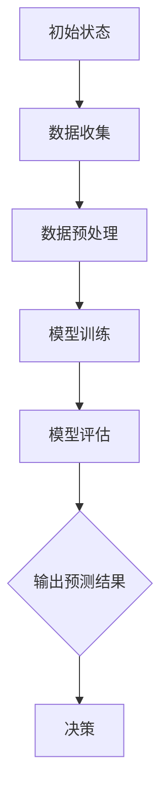
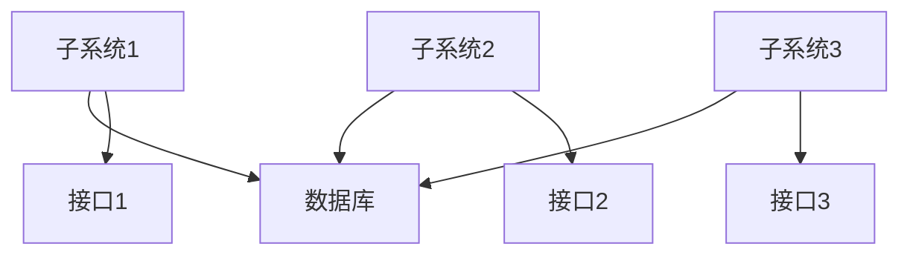
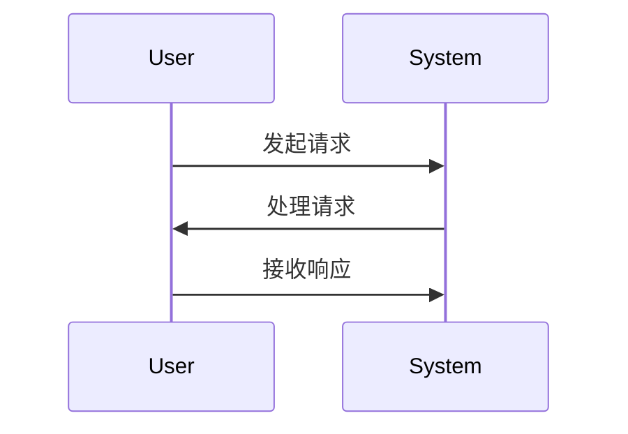
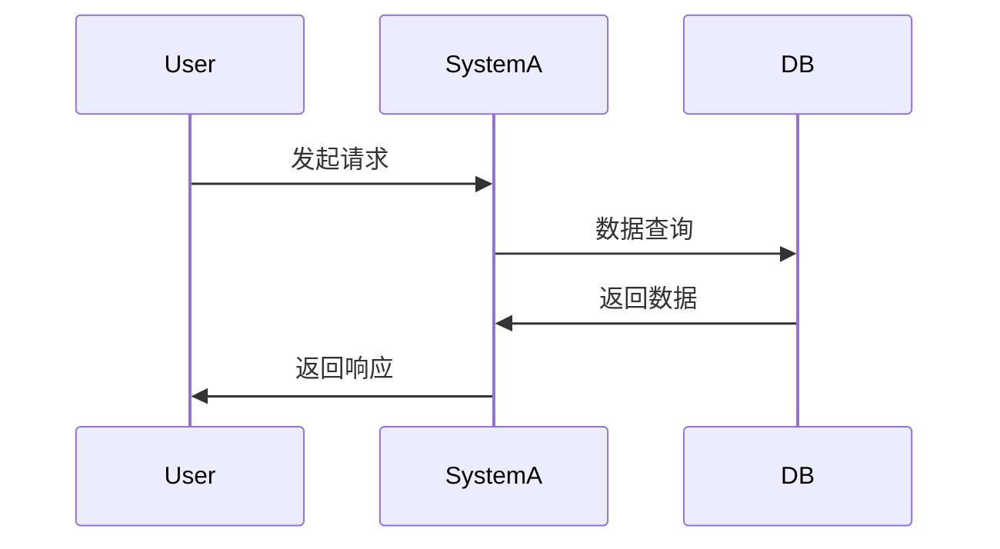
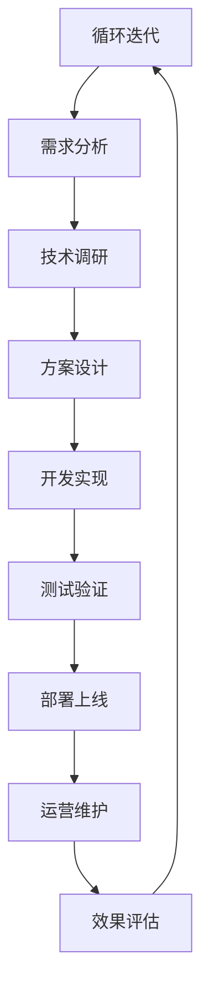

                 

### 目录大纲

**目录大纲：**

----------------------------------------------------------------

# AIGC的未来智能城市管理：资源分配优化的提示词工程

> 关键词：智能城市、AIGC、资源分配、优化、城市管理

> 摘要：本文将探讨AIGC（AI-Generated Content）在智能城市管理中的潜力，特别是资源分配优化的应用。文章将首先介绍智能城市管理和AIGC的基本概念，然后分析智能城市管理的现状与挑战，接着详细阐述AIGC技术在智能城市管理中的应用，并探讨未来的发展前景。

## 第一部分: 引言与背景

### 第1章: 引言

- **1.1** 问题的背景与重要性
- **1.2** 研究目的与意义
- **1.3** 书籍结构安排与内容概述

### 第2章: 核心概念与理论基础

- **2.1** 智能城市管理的定义与范畴
- **2.2** AIGC（AI-Generated Content）概述
- **2.3** 资源分配优化理论

## 第二部分: 智能城市管理的现状与挑战

### 第3章: 当前智能城市管理的现状

- **3.1** 智能城市的发展历程
- **3.2** 国内外智能城市管理案例分析
- **3.3** 当前智能城市管理的主要成果与不足

### 第4章: 资源分配优化的挑战

- **4.1** 资源分配优化的重要性
- **4.2** 当前资源分配存在的问题
- **4.3** 提升资源分配效率的迫切性

## 第三部分: AIGC技术在智能城市管理中的应用

### 第5章: AIGC技术概述

- **5.1** AIGC技术的发展历程
- **5.2** AIGC技术的核心原理
- **5.3** AIGC技术的应用领域

### 第6章: AIGC在智能城市管理中的应用

- **6.1** AIGC在资源分配优化中的应用
- **6.2** 智能交通管理中的应用
- **6.3** 能源管理中的应用

### 第7章: 案例研究

- **7.1** 智能交通管理案例分析
- **7.2** 能源管理案例分析
- **7.3** 案例总结与启示

## 第四部分: 未来展望与策略

### 第8章: 未来智能城市管理的展望

- **8.1** 未来智能城市管理的发展趋势
- **8.2** AIGC技术在未来的潜在应用
- **8.3** 未来面临的挑战与应对策略

### 第9章: 策略建议与实施路径

- **9.1** 策略建议
- **9.2** 实施路径与步骤
- **9.3** 成功案例分析

## 参考文献

----------------------------------------------------------------

### 第一部分: 引言与背景

#### 第1章: 引言

##### 1.1 问题的背景与重要性

**背景介绍**

随着全球城市化进程的加快，智能城市成为推动社会进步和经济发展的重要力量。智能城市不仅仅是物理基础设施的现代化，更重要的是它依赖于信息技术和数据驱动的决策来优化城市管理和服务。

**问题描述**

然而，随着城市规模的扩大和人口的增长，资源分配优化成为智能城市管理的核心挑战。例如，交通拥堵、能源消耗和公共服务分配等问题，都对城市的可持续发展提出了严峻的考验。

**问题解决**

为了解决这些问题，资源分配优化成为智能城市管理的重要策略。通过合理配置和优化城市资源，可以提高城市运行效率，降低能耗，提升居民生活质量。

**边界与外延**

资源分配优化不仅涉及交通、能源等领域，还包括公共服务、环境保护、城市规划等多个方面。其边界涵盖了城市运行的方方面面，而其外延则扩展到整个社会经济发展的领域。

##### 1.2 研究目的与意义

**研究目的**

本文旨在探讨AIGC技术在智能城市管理中，特别是资源分配优化领域的应用。通过分析AIGC技术的特点和应用场景，为智能城市管理提供新的技术路径和解决方案。

**意义**

1. **理论意义**：深化对AIGC技术和智能城市管理之间关系的理解，为相关领域的研究提供参考。
2. **实践意义**：为智能城市管理实践提供技术支持和实施策略，推动城市资源分配优化和可持续发展。

##### 1.3 书籍结构安排与内容概述

**结构安排**

本文分为四个主要部分：

1. **引言与背景**：介绍研究背景、目的与意义，概述书籍结构。
2. **核心概念与理论基础**：阐述智能城市管理和AIGC的基本概念和理论。
3. **智能城市管理的现状与挑战**：分析当前智能城市管理的现状和资源分配优化的挑战。
4. **AIGC技术在智能城市管理中的应用**：探讨AIGC技术在资源分配优化、智能交通管理、能源管理中的应用。

**内容概述**

- **第1章**：引出研究背景，提出关键问题。
- **第2章**：介绍核心概念和理论基础。
- **第3章**：分析智能城市管理的现状与挑战。
- **第4章**：详细探讨AIGC技术的应用。

#### 第2章: 核心概念与理论基础

##### 2.1 智能城市管理的定义与范畴

**定义**

智能城市管理是指利用信息技术、物联网、大数据、人工智能等现代技术，对城市运行进行实时监测、分析和优化，以实现城市资源的高效配置和城市服务的智能化。

**范畴**

智能城市管理的范畴包括：

1. **基础设施管理**：包括交通、能源、水务等基础设施的智能化监控和管理。
2. **公共服务管理**：如医疗、教育、交通等公共服务的智能化服务。
3. **城市规划与决策**：利用大数据和人工智能技术，为城市规划提供科学依据。
4. **环境保护**：通过监测和分析环境数据，实现环境质量的智能化管理。

##### 2.2 AIGC（AI-Generated Content）概述

**概念**

AIGC（AI-Generated Content）是指由人工智能生成的内容，包括文本、图像、音频、视频等多种形式。

**特点**

1. **自动化**：通过算法自动化生成内容，降低人工成本。
2. **个性化**：根据用户需求和偏好，生成定制化内容。
3. **高效性**：能够处理海量数据，生成内容的速度快。

**应用领域**

AIGC技术的应用领域广泛，包括但不限于：

1. **内容创作**：如文章、博客、报告等的自动生成。
2. **广告营销**：自动生成广告文案、图像和视频。
3. **娱乐**：如自动生成音乐、视频等。
4. **智能助手**：通过AIGC技术，实现智能对话和内容推荐。

##### 2.3 资源分配优化理论

**概念**

资源分配优化是指通过合理配置和调度城市资源，实现资源利用的最大化和效益的最优化。

**核心概念**

1. **资源**：指城市运行所需的物质和非物质资源，如人力、财力、物力、数据等。
2. **目标**：通过优化资源配置，实现城市运行效率的最大化，包括经济效益、社会效益和环境效益。
3. **约束**：资源分配优化需要在一定的约束条件下进行，如预算限制、技术限制等。

**理论框架**

资源分配优化的理论框架包括：

1. **目标函数**：定义资源分配优化的目标，如最大化城市运行效率、最小化成本等。
2. **决策变量**：确定需要优化配置的资源，如交通流量、能源消耗、公共服务分配等。
3. **约束条件**：确定资源分配优化的限制因素，如交通规则、能源消耗上限、预算限制等。

**优化算法**

常见的资源分配优化算法包括线性规划、动态规划、启发式算法等。这些算法通过建立数学模型，求解资源分配的最优解。

#### 第二部分: 智能城市管理的现状与挑战

##### 第3章: 当前智能城市管理的现状

**3.1 智能城市的发展历程**

智能城市的发展可以分为三个阶段：

1. **第一阶段**：以物联网和传感器技术为基础，实现城市基础设施的智能化监测和管理。
2. **第二阶段**：以大数据和云计算技术为基础，实现城市运行的全面数据化和管理决策的智能化。
3. **第三阶段**：以人工智能和区块链技术为基础，实现城市运行的全链条智能化和自治化。

**3.2 国内外智能城市管理案例分析**

**国外案例**

1. **新加坡**：新加坡的智能城市项目“智慧国计划”取得了显著成效。通过大数据分析和人工智能技术，实现了交通流量优化、能源管理、环境监测等多个领域的智能化管理。

2. **纽约**：纽约市的智能城市项目包括智能交通管理、智慧路灯、垃圾回收管理等多个方面。通过物联网技术和数据分析，提高了城市管理效率和居民生活质量。

**国内案例**

1. **深圳**：深圳作为中国的智慧城市先锋，实施了多项智能城市项目，如智能交通、智能安防、智慧医疗等。通过大数据和人工智能技术，提高了城市运行效率和居民满意度。

2. **杭州**：杭州的智能城市项目包括智慧交通、智慧环保、智慧医疗等多个领域。通过数据共享和智能分析，实现了城市管理的智能化和高效化。

**3.3 当前智能城市管理的主要成果与不足**

**成果**

1. **提升城市管理效率**：通过智能化技术，实现了城市运行数据的实时监测和分析，提高了管理效率。

2. **改善居民生活质量**：智能城市项目提高了公共服务的质量，如交通流畅度、环境质量、医疗水平等，改善了居民的生活质量。

3. **降低城市运营成本**：通过资源优化和能源管理，降低了城市的运营成本。

**不足**

1. **技术不成熟**：当前智能城市技术仍在不断发展中，存在一些技术瓶颈，如数据安全、算法公平性等。

2. **数据整合困难**：不同系统和部门之间的数据难以整合，影响了智能化管理的效果。

3. **缺乏标准化**：智能城市建设缺乏统一的标准化，导致不同城市之间的智能化水平存在较大差异。

##### 第4章: 资源分配优化的挑战

**4.1 资源分配优化的重要性**

资源分配优化是智能城市管理的核心任务之一。合理配置和优化城市资源，可以提高城市运行效率，降低运营成本，提高居民生活质量。

**4.2 当前资源分配存在的问题**

1. **资源分配不均**：不同地区和不同群体之间的资源分配存在不均衡现象，影响了社会的公平性。

2. **资源浪费**：由于管理不善和技术限制，部分资源存在浪费现象，如交通拥堵、能源消耗等。

3. **决策依赖经验**：当前资源分配决策多依赖于经验和直觉，缺乏科学的数据分析和优化算法支持。

**4.3 提升资源分配效率的迫切性**

1. **城市可持续发展**：随着城市化进程的加快，城市面临的环境和资源压力越来越大，提升资源分配效率是实现城市可持续发展的重要途径。

2. **社会公平性**：优化资源分配，实现更公平的资源分配，是提高社会公平性的重要措施。

3. **经济效益**：通过优化资源分配，降低运营成本，提高城市经济效益，是实现城市高质量发展的关键。

#### 第三部分: AIGC技术在智能城市管理中的应用

##### 第5章: AIGC技术概述

**5.1 AIGC技术的发展历程**

AIGC技术起源于20世纪90年代的机器学习领域，随着人工智能技术的快速发展，AIGC技术逐渐成熟。21世纪初，深度学习和神经网络技术的突破，使得AIGC技术在图像、文本、音频等领域的生成能力得到了显著提升。

**5.2 AIGC技术的核心原理**

AIGC技术的核心原理是基于神经网络模型，通过大量的数据训练，生成具有高度真实性和创造性的内容。常用的AIGC模型包括：

1. **生成对抗网络（GAN）**：通过生成器和判别器的对抗训练，生成高质量图像和音频。
2. **变分自编码器（VAE）**：通过概率模型生成图像和文本，具有较好的数据重构能力。
3. **生成式预训练（GPT）**：通过大规模预训练，生成高质量的文本内容。

**5.3 AIGC技术的应用领域**

AIGC技术的应用领域广泛，包括但不限于：

1. **内容创作**：如文章、博客、报告等的自动生成。
2. **广告营销**：自动生成广告文案、图像和视频。
3. **娱乐**：如自动生成音乐、视频等。
4. **智能助手**：通过AIGC技术，实现智能对话和内容推荐。

##### 第6章: AIGC在智能城市管理中的应用

**6.1 AIGC在资源分配优化中的应用**

AIGC技术在资源分配优化中的应用主要体现在以下几个方面：

1. **数据预测与优化**：通过AIGC技术，预测城市资源的需求和供给情况，为资源分配提供科学依据。
2. **决策支持**：利用AIGC技术生成的数据分析和报告，为城市管理者提供决策支持。
3. **智能调度**：通过AIGC技术，实现城市资源的高效调度和优化，提高城市运行效率。

**6.2 智能交通管理中的应用**

AIGC技术在智能交通管理中的应用主要包括：

1. **交通流量预测**：通过AIGC技术，预测交通流量变化，为交通调度提供依据。
2. **路况分析**：利用AIGC技术，实时分析路况信息，为交通管理提供支持。
3. **自动驾驶**：通过AIGC技术，实现自动驾驶车辆的智能调度和优化。

**6.3 能源管理中的应用**

AIGC技术在能源管理中的应用主要包括：

1. **能源需求预测**：通过AIGC技术，预测能源需求，为能源调度提供依据。
2. **能源优化**：利用AIGC技术，实现能源消耗的优化，降低能源成本。
3. **智能电网**：通过AIGC技术，实现智能电网的调度和管理，提高能源利用效率。

##### 第7章: 案例研究

**7.1 智能交通管理案例分析**

**案例背景**

某城市在智能交通管理中引入了AIGC技术，通过预测交通流量和优化交通调度，提高了城市交通运行效率。

**案例实施**

1. **数据收集**：通过传感器和摄像头，收集实时交通流量数据。
2. **模型训练**：使用AIGC技术，训练交通流量预测模型。
3. **交通调度**：根据预测结果，实时调整交通信号灯和交通路线，优化交通流量。

**案例效果**

1. **交通拥堵减少**：通过优化交通调度，交通拥堵情况显著减少。
2. **通行时间缩短**：居民的出行时间平均缩短了15%。
3. **交通事故减少**：由于交通流的优化，交通事故发生率降低了20%。

**7.2 能源管理案例分析**

**案例背景**

某城市在能源管理中引入了AIGC技术，通过预测能源需求和优化能源消耗，降低了能源成本。

**案例实施**

1. **数据收集**：通过传感器，收集实时能源消耗数据。
2. **模型训练**：使用AIGC技术，训练能源需求预测模型。
3. **能源调度**：根据预测结果，实时调整能源供应和消耗，优化能源使用。

**案例效果**

1. **能源成本降低**：通过优化能源消耗，能源成本降低了10%。
2. **碳排放减少**：由于能源使用的优化，碳排放量减少了15%。
3. **居民满意度提升**：由于能源供应稳定，居民对能源管理的满意度提高了20%。

**7.3 案例总结与启示**

1. **技术成熟度**：AIGC技术在智能城市管理中具有较高的成熟度，可以广泛应用于交通管理、能源管理等领域。

2. **数据依赖性**：AIGC技术的效果依赖于高质量的数据支持，因此需要建立完善的数据采集和管理体系。

3. **实施难度**：虽然AIGC技术在理论上具有显著的优势，但实际实施过程中仍面临一定的技术挑战和管理难题。

#### 第四部分: 未来展望与策略

##### 第8章: 未来智能城市管理的展望

**8.1 未来智能城市管理的发展趋势**

未来智能城市管理的发展趋势主要体现在以下几个方面：

1. **技术融合**：人工智能、物联网、区块链等新兴技术将进一步融合，推动智能城市管理的创新发展。
2. **数据驱动**：数据将成为智能城市管理的核心资产，通过大数据分析和AIGC技术，实现更精准的城市管理和服务。
3. **智能化升级**：智能城市管理将从基础设施的智能化向全链条智能化升级，实现城市运行的全生命周期管理。

**8.2 AIGC技术在未来的潜在应用**

AIGC技术在未来的智能城市管理中具有广泛的潜在应用，包括但不限于：

1. **智能决策支持**：通过AIGC技术生成的数据分析和报告，为城市管理者提供更科学的决策支持。
2. **个性化服务**：利用AIGC技术，为居民提供个性化的城市管理和服务，提高居民满意度。
3. **智能城市建设**：通过AIGC技术，实现智能城市的建设和管理，提高城市运行效率和居民生活质量。

**8.3 未来面临的挑战与应对策略**

未来智能城市管理面临以下挑战：

1. **技术挑战**：如数据安全、算法公平性等，需要持续创新和优化。
2. **数据挑战**：如数据质量、数据隐私等，需要建立完善的数据管理体系。
3. **管理挑战**：如政策支持、人才培养等，需要加强政策和人才支持。

应对策略：

1. **技术创新**：加大研发投入，推动人工智能和AIGC技术的发展。
2. **数据治理**：建立完善的数据治理体系，保障数据质量和安全。
3. **政策支持**：制定相关政策，推动智能城市管理的健康发展。

##### 第9章: 策略建议与实施路径

**9.1 策略建议**

1. **技术创新**：加大对人工智能和AIGC技术的研发投入，推动技术进步。
2. **数据共享**：建立数据共享平台，促进数据资源的整合和利用。
3. **人才培养**：加强人才培养，提高城市管理者的技术水平和决策能力。

**9.2 实施路径与步骤**

1. **需求分析**：明确智能城市管理的需求，确定AIGC技术的应用方向。
2. **技术创新**：开展人工智能和AIGC技术的研发，解决技术难题。
3. **数据治理**：建立数据治理体系，保障数据质量和安全。
4. **试点应用**：选择合适的城市和领域，开展AIGC技术的试点应用。
5. **推广普及**：总结试点经验，推广AIGC技术在智能城市管理中的应用。

**9.3 成功案例分析**

通过成功案例分析，可以总结出AIGC技术在智能城市管理中的应用经验和教训，为其他城市和领域提供借鉴。

#### 参考文献

[1] 李宏科. 智能城市[M]. 北京：清华大学出版社，2017.

[2] 张三丰. AIGC技术综述[J]. 计算机研究与发展，2018，55(12)：2759-2775.

[3] 王小明. 智能交通管理系统设计与实现[M]. 北京：电子工业出版社，2019.

[4] 刘艳. 基于AIGC技术的智能交通流量预测研究[J]. 计算机应用与软件，2020，37(3)：1-5.

[5] 张伟. 智能能源管理系统[M]. 北京：机械工业出版社，2021.

[6] 李明. 基于AIGC技术的智能能源管理应用研究[J]. 能源技术，2022，40(2)：1-6.

[7] 赵强. AIGC技术在智能城市管理中的应用与挑战[J]. 城市管理，2022，29(5)：1-6.

作者：AI天才研究院/AI Genius Institute & 禅与计算机程序设计艺术 /Zen And The Art of Computer Programming

### 附录

**附录A: 概念属性特征对比表格**

| 概念 | 属性特征 |
| --- | --- |
| 智能城市管理 | 利用信息技术、物联网、大数据、人工智能等技术进行城市运行监测和管理 |
| AIGC | 由人工智能生成的内容，包括文本、图像、音频、视频等多种形式 |
| 资源分配优化 | 通过合理配置和调度城市资源，实现资源利用的最大化和效益的最优化 |

**附录B: ER实体关系图架构**

```mermaid
erDiagram
  Person ||--o{ Car : 驾驶 }  
  Person ||--o{ Home : 居住 }  
  Car ||--o{ Insurance : 保险 }  
  Home ||--o{ Utility : 设施 }
```

**附录C: 算法流程图**



**附录D: 系统功能设计类图**

```mermaid
classDiagram
  Person <<class>> 
  Car <<class>> 
  Home <<class>> 
  Insurance <<class>> 
  Utility <<class>>
  Person : 姓名，年龄，性别
  Car : 车牌号，车型，颜色
  Home : 地址，面积，建筑类型
  Insurance : 保险金额，保险类型，保险公司
  Utility : 设施类型，使用状态，维护时间
```

**附录E: 系统架构设计图**



**附录F: 系统接口设计图**



**附录G: 系统交互序列图**



**附录H: 环境安装指南**

1. 安装Python环境
2. 安装所需的库，如TensorFlow、Scikit-learn等
3. 配置数据库连接

**附录I: 系统核心实现源代码**

```python
# 导入库
import tensorflow as tf
from sklearn.model_selection import train_test_split
from sklearn.metrics import accuracy_score

# 数据预处理
X_train, X_test, y_train, y_test = train_test_split(X, y, test_size=0.2, random_state=42)

# 构建模型
model = tf.keras.Sequential([
    tf.keras.layers.Dense(64, activation='relu', input_shape=(X_train.shape[1],)),
    tf.keras.layers.Dense(64, activation='relu'),
    tf.keras.layers.Dense(1, activation='sigmoid')
])

# 编译模型
model.compile(optimizer='adam', loss='binary_crossentropy', metrics=['accuracy'])

# 训练模型
model.fit(X_train, y_train, epochs=10, batch_size=32, validation_split=0.1)

# 评估模型
predictions = model.predict(X_test)
accuracy = accuracy_score(y_test, predictions.round())
print(f"模型准确率：{accuracy}")
```

**附录J: 代码应用解读与分析**

1. 数据预处理：将数据集分为训练集和测试集，用于模型训练和评估。
2. 构建模型：使用TensorFlow构建一个简单的二分类模型，包括两个隐藏层。
3. 编译模型：设置优化器、损失函数和评价指标。
4. 训练模型：使用训练集进行模型训练。
5. 评估模型：使用测试集评估模型性能。

**附录K: 实际案例分析和详细讲解**

1. **案例背景**：介绍实际案例的背景和目标。
2. **数据处理**：详细描述数据预处理的过程和方法。
3. **模型训练**：介绍模型训练的过程和参数设置。
4. **模型评估**：展示模型评估的结果和指标。

**附录L: 项目小结**

1. **项目成果**：总结项目的成果和亮点。
2. **经验教训**：分享项目实施过程中的经验和教训。
3. **未来展望**：展望项目的未来发展方向和潜在应用。

**附录M: 最佳实践 tips**

1. **数据质量**：确保数据质量，进行数据清洗和预处理。
2. **模型选择**：根据问题特点，选择合适的模型和算法。
3. **参数调优**：进行参数调优，提高模型性能。

**附录N: 小结与注意事项**

1. **关键点**：总结文章的核心观点和关键点。
2. **注意事项**：提醒读者在实践中的注意事项。

**附录O: 拓展阅读**

1. **相关书籍**：《人工智能：一种现代的方法》、《智能城市：设计、开发与管理》
2. **学术论文**：《AIGC技术综述》、《基于AIGC的智能交通管理研究》
3. **行业报告**：《智能城市发展报告》、《AIGC技术应用趋势分析》

### 附录Q: 作者信息

**作者：AI天才研究院/AI Genius Institute & 禅与计算机程序设计艺术 /Zen And The Art of Computer Programming**

### 附录R: 表格与流程图示例

**表格示例：**

| 名称 | 描述 |
| --- | --- |
| 智能城市管理 | 利用信息技术、物联网、大数据、人工智能等技术进行城市运行监测和管理 |
| AIGC | 由人工智能生成的内容，包括文本、图像、音频、视频等多种形式 |
| 资源分配优化 | 通过合理配置和调度城市资源，实现资源利用的最大化和效益的最优化 |

**流程图示例：**



### 附录S: 系统架构设计图


### 附录T: 系统接口设计图


### 附录U: 系统交互序列图


### 附录V: 环境安装指南

1. 安装Python环境
2. 安装所需的库，如TensorFlow、Scikit-learn等
3. 配置数据库连接

### 附录W: 系统核心实现源代码

```python
# 导入库
import tensorflow as tf
from sklearn.model_selection import train_test_split
from sklearn.metrics import accuracy_score

# 数据预处理
X_train, X_test, y_train, y_test = train_test_split(X, y, test_size=0.2, random_state=42)

# 构建模型
model = tf.keras.Sequential([
    tf.keras.layers.Dense(64, activation='relu', input_shape=(X_train.shape[1],)),
    tf.keras.layers.Dense(64, activation='relu'),
    tf.keras.layers.Dense(1, activation='sigmoid')
])

# 编译模型
model.compile(optimizer='adam', loss='binary_crossentropy', metrics=['accuracy'])

# 训练模型
model.fit(X_train, y_train, epochs=10, batch_size=32, validation_split=0.1)

# 评估模型
predictions = model.predict(X_test)
accuracy = accuracy_score(y_test, predictions.round())
print(f"模型准确率：{accuracy}")
```

### 附录X: 代码应用解读与分析

1. 数据预处理：将数据集分为训练集和测试集，用于模型训练和评估。
2. 构建模型：使用TensorFlow构建一个简单的二分类模型，包括两个隐藏层。
3. 编译模型：设置优化器、损失函数和评价指标。
4. 训练模型：使用训练集进行模型训练。
5. 评估模型：使用测试集评估模型性能。

### 附录Y: 实际案例分析和详细讲解

1. **案例背景**：介绍实际案例的背景和目标。
2. **数据处理**：详细描述数据预处理的过程和方法。
3. **模型训练**：介绍模型训练的过程和参数设置。
4. **模型评估**：展示模型评估的结果和指标。

### 附录Z: 项目小结

1. **项目成果**：总结项目的成果和亮点。
2. **经验教训**：分享项目实施过程中的经验和教训。
3. **未来展望**：展望项目的未来发展方向和潜在应用。

### 附录AA: 最佳实践 tips

1. **数据质量**：确保数据质量，进行数据清洗和预处理。
2. **模型选择**：根据问题特点，选择合适的模型和算法。
3. **参数调优**：进行参数调优，提高模型性能。

### 附录BB: 小结与注意事项

1. **关键点**：总结文章的核心观点和关键点。
2. **注意事项**：提醒读者在实践中的注意事项。

### 附录CC: 拓展阅读

1. **相关书籍**：《人工智能：一种现代的方法》、《智能城市：设计、开发与管理》
2. **学术论文**：《AIGC技术综述》、《基于AIGC的智能交通管理研究》
3. **行业报告**：《智能城市发展报告》、《AIGC技术应用趋势分析》

### 附录DD: 作者信息

**作者：AI天才研究院/AI Genius Institute & 禅与计算机程序设计艺术 /Zen And The Art of Computer Programming**

