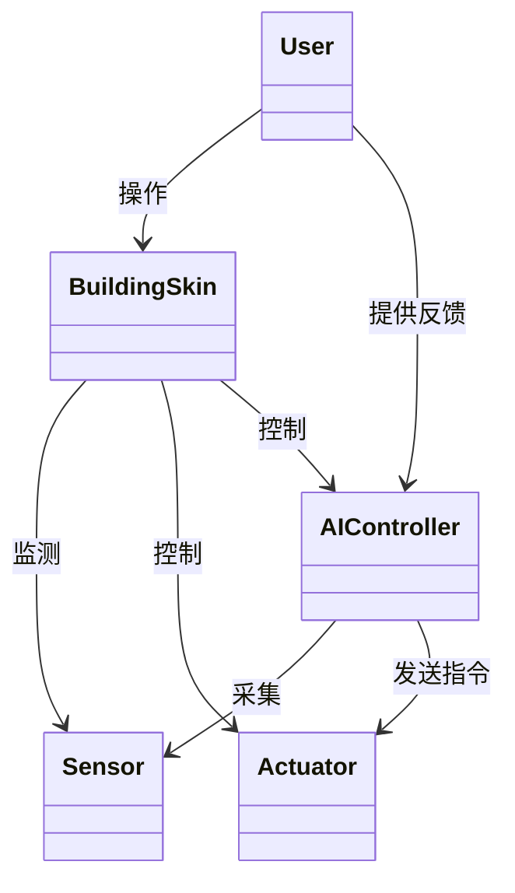
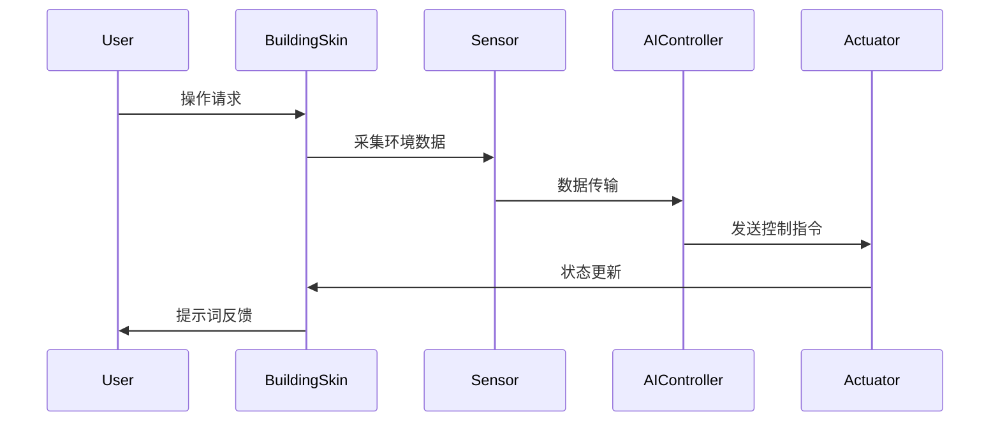
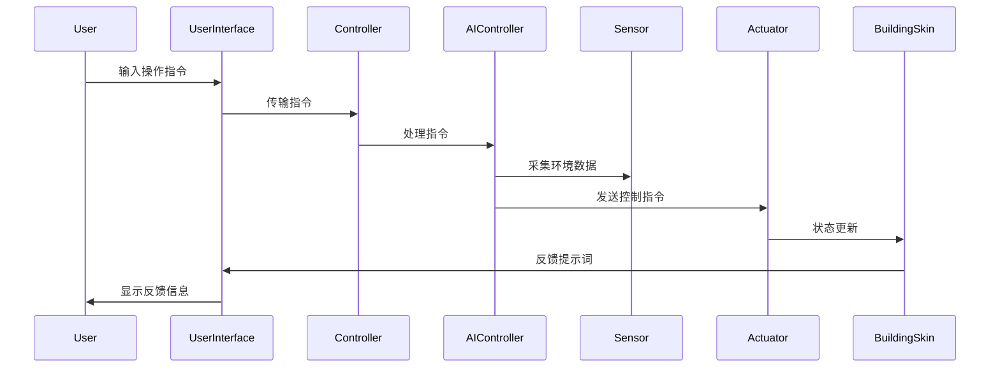

                 


### AIGC的未来智能建筑皮肤：环境响应设计的提示词工程

#### 关键词：
- AIGC
- 智能建筑皮肤
- 环境响应设计
- 提示词工程
- 建筑设计

#### 摘要：
本文深入探讨了AIGC（自适应智能生成计算）在未来智能建筑皮肤中的应用，特别是环境响应设计的提示词工程。通过对AIGC的基本概念、智能建筑皮肤的定义及其在建筑设计中的重要性进行介绍，本文揭示了环境响应设计的核心原理和提示词工程的关键作用。随后，文章详细讲解了工程实现的技术方法、工具及其集成，并展示了一系列实际案例，为未来智能建筑的设计提供了有益的启示。

## 第1章 引言与背景

### 1.1 AIGC的定义与背景

#### 1.1.1 AIGC的进化历程
自适应智能生成计算（AIGC）起源于人工智能（AI）和计算技术的深度融合。自20世纪50年代人工智能概念的提出以来，AI经历了多个发展阶段，从规则系统、知识表示到专家系统，再到基于数据驱动和机器学习的现代AI。AIGC作为AI的一个重要分支，强调自适应性和自动化生成，旨在利用AI技术生成高质量的内容，满足用户的个性化需求。

#### 1.1.2 核心概念与应用
AIGC的核心概念包括自适应学习、自动内容生成和交互式智能。自适应学习使AIGC系统能够根据用户行为和环境变化自动调整其行为和性能。自动内容生成则是指系统能够生成文本、图像、音频等多种类型的内容，而不需要人工干预。交互式智能使得AIGC系统能够与用户进行实时互动，提供个性化的服务。

#### 1.1.3 智能建筑皮肤的重要性
智能建筑皮肤作为建筑外部层的智能解决方案，是AIGC应用的一个重要领域。它不仅承担了建筑物的保护功能，还能通过集成传感器、执行器和智能控制系统，实现环境响应功能。智能建筑皮肤的应用，如节能、自清洁、自我修复等，为建筑行业带来了革命性的变革。

### 1.2 智能建筑皮肤的基本概念

#### 1.2.1 智能建筑皮肤概述
智能建筑皮肤是一种综合了材料科学、传感器技术、通信技术和AI技术的多功能建筑外围护系统。它通过集成传感器实时监测环境变化，并通过执行器调整建筑皮肤的外观和性能，以实现对环境的自适应响应。

#### 1.2.2 关键技术及组件
智能建筑皮肤的关键技术包括传感器技术、执行器技术、智能控制系统和通信网络。传感器负责采集环境数据，如温度、湿度、光照、空气质量等；执行器根据控制系统的指令调整建筑皮肤的状态，如开合、透明度变化等；智能控制系统则负责数据处理和指令生成；通信网络确保各组件间的数据传输和协调工作。

#### 1.2.3 智能建筑皮肤的类型
智能建筑皮肤根据应用场景和技术特点可分为多种类型，如透明智能玻璃、自洁涂层、自适应遮阳板、智能表皮等。每种类型的皮肤都有其特定的功能和应用场景，为建筑物提供了多样化的选择。

### 1.3 AIGC在建筑设计中的现状与未来趋势

#### 1.3.1 市场概述
当前，AIGC在建筑领域的应用已经取得了一定的进展，尤其是在智能建筑皮肤的设计和制造中。随着技术的不断进步和用户需求的增加，AIGC在建筑设计中的应用前景十分广阔。

#### 1.3.2 优势与挑战
AIGC在建筑设计中具有显著的优势，如提高能效、降低维护成本、提升用户体验等。然而，AIGC技术的应用也面临着一些挑战，包括技术成本、数据隐私和安全等问题。

#### 1.3.3 未来发展趋势
未来，AIGC在建筑设计中的应用将朝着更智能化、更个性化和更高效的方向发展。随着AI技术的不断成熟和应用的深入，智能建筑皮肤将逐渐成为建筑设计的标准配置。

## 第2章 核心概念与理论基础

### 2.1 环境响应设计的基本原则

#### 2.1.1 定义与目标
环境响应设计是一种以用户和环境为中心的设计理念，旨在通过智能系统的响应，实现建筑与环境的和谐共生。其核心目标是提高建筑物的能源效率、舒适度和可持续性。

#### 2.1.2 核心原则与策略
环境响应设计遵循以下核心原则：
- **适应性**：系统能够根据环境变化自动调整其行为。
- **可塑性**：系统能够适应不同的建筑结构和用户需求。
- **可扩展性**：系统能够集成新的技术和功能，以适应未来需求。

环境响应设计的策略包括：
- **智能感知**：通过传感器收集环境数据。
- **数据融合**：整合多种数据源，提高数据准确性。
- **智能决策**：利用AI技术进行环境分析和决策。
- **执行响应**：根据决策结果调整建筑皮肤的状态。

#### 2.1.3 提示词在环境响应设计中的作用
提示词在环境响应设计中起着关键作用。它们是系统与用户、环境之间沟通的桥梁。通过提示词，用户可以了解系统的工作状态和响应行为，同时系统能够获取用户的反馈，进一步优化其响应策略。

### 2.2 AIGC在建筑设计的理论基础

#### 2.2.1 AI与机器学习的基本原理
AI和机器学习是AIGC的核心技术。AI旨在模拟人类智能，使其能够执行复杂的任务。机器学习则是通过数据训练模型，使其能够自动学习和改进性能。在建筑环境中，AI和机器学习技术可用于以下方面：
- **数据挖掘**：从大量环境数据中提取有价值的信息。
- **预测分析**：基于历史数据预测未来的环境变化。
- **优化决策**：根据实时数据和环境模型，做出最优的响应决策。

#### 2.2.2 AIGC在环境响应设计中的应用
AIGC在环境响应设计中的应用主要包括：
- **自动内容生成**：生成个性化的建筑皮肤外观和功能配置。
- **自适应学习**：根据环境变化和用户反馈，自动调整系统参数。
- **交互式设计**：用户与系统之间的实时互动，提供个性化的体验。

#### 2.2.3 数据分析与处理技术
数据分析和处理技术是AIGC应用的基础。在环境响应设计中，常见的数据处理技术包括：
- **数据清洗**：去除噪声和不准确的数据。
- **数据集成**：整合来自不同传感器的数据，提高数据的准确性。
- **数据可视化**：通过图表和图形展示数据分析结果，便于理解和决策。

## 第3章 工程技术与方法

### 3.1 智能建筑皮肤的设计方法与流程

#### 3.1.1 设计流程与阶段
智能建筑皮肤的设计流程通常分为以下几个阶段：
- **需求分析**：明确建筑皮肤的功能需求和应用场景。
- **概念设计**：提出创新性的设计概念，并进行初步的技术可行性分析。
- **详细设计**：基于概念设计，进行详细的工程设计，包括材料选择、结构设计、控制系统设计等。
- **模拟与优化**：利用计算机模拟技术，对设计方案进行优化，提高其性能。
- **原型制作与测试**：制作原型并进行测试，验证设计的可行性和性能。

#### 3.1.2 设计工具与软件
智能建筑皮肤的设计需要使用多种工具和软件，包括：
- **CAD软件**：用于建筑图纸的设计和绘制。
- **仿真软件**：用于对设计方案进行模拟和优化。
- **智能控制系统设计工具**：用于设计建筑皮肤的智能控制系统。
- **编程工具**：用于编写控制算法和数据处理程序。

#### 3.1.3 交互式设计技术
交互式设计技术在智能建筑皮肤设计中至关重要，它使得设计过程更加灵活和高效。常见的交互式设计技术包括：
- **虚拟现实（VR）**：通过VR技术，设计师可以沉浸式地体验建筑皮肤的设计效果。
- **增强现实（AR）**：结合现实环境和数字信息，提供更加直观的设计反馈。
- **互动式触摸屏**：通过触摸屏，用户可以直接对建筑皮肤的设计进行修改和优化。

### 3.2 提示词工程在智能建筑皮肤中的应用

#### 3.2.1 提示词的定义与作用
提示词是智能建筑皮肤中用于传递信息和指令的关键元素。它们可以是简单的文字、声音或图像，也可以是复杂的交互式指令。提示词的作用包括：
- **信息传递**：将系统状态和操作指令传递给用户。
- **用户交互**：通过提示词，用户可以与系统进行实时互动。
- **系统反馈**：系统通过提示词向用户反馈操作结果和状态信息。

#### 3.2.2 提示词的类型
根据用途和形式，提示词可以分为以下几种类型：
- **文字提示词**：以文字形式出现的提示信息，如“温度过高，请调整遮阳板”。
- **声音提示词**：以声音形式出现的提示信息，如语音提示或报警声。
- **图像提示词**：以图像形式出现的提示信息，如图标、动画等。
- **交互式提示词**：通过触摸屏或按钮进行交互的提示词，如触摸屏菜单、按钮操作等。

#### 3.2.3 提示词工程的过程
提示词工程的过程主要包括以下几个步骤：
- **需求分析**：确定系统所需的提示词类型和功能。
- **设计阶段**：设计提示词的界面、内容和交互方式。
- **实现阶段**：编写提示词生成和交互的代码，实现提示词的功能。
- **测试与优化**：对提示词进行测试，收集用户反馈，并进行优化。

### 3.3 AIGC在智能建筑皮肤设计中的集成

#### 3.3.1 AIGC的集成策略
AIGC在智能建筑皮肤设计中的集成策略主要包括以下几个方面：
- **数据融合**：将来自不同传感器的数据集成到AIGC系统中，提高数据的准确性和完整性。
- **自适应学习**：利用AIGC技术，系统可以自动调整其参数和行为，以适应不同的环境和用户需求。
- **内容生成**：AIGC可以生成个性化的建筑皮肤外观和功能配置，满足用户的个性化需求。

#### 3.3.2 AIGC的集成实现
AIGC的集成实现需要以下关键技术：
- **数据采集与处理**：通过传感器采集环境数据，并进行预处理和融合。
- **机器学习模型**：构建和训练机器学习模型，用于环境分析和决策生成。
- **智能控制系统**：实现AIGC系统的智能控制功能，包括提示词生成、执行器控制和用户交互等。

#### 3.3.3 AIGC在环境响应设计中的应用案例
以下是一些AIGC在环境响应设计中的应用案例：
- **智能遮阳系统**：利用AIGC技术，系统可以根据室内外温度、光照强度等因素，自动调整遮阳板的倾斜角度，实现节能和舒适度优化。
- **智能空调系统**：通过AIGC技术，系统可以实时监测室内外温度、湿度等环境参数，自动调整空调的运行模式，提高能源利用效率。
- **智能安防系统**：利用AIGC技术，系统可以自动识别和响应异常行为，如入侵、火灾等，提高建筑的安全性能。

## 第4章 实际案例与应用分析

### 4.1 案例介绍

#### 4.1.1 案例背景
本案例是一个位于城市中心的智能办公楼项目，项目旨在通过集成AIGC和智能建筑皮肤技术，实现建筑环境的高效管理和舒适度提升。

#### 4.1.2 项目目标
项目的目标包括：
- 提高能源效率，降低能耗。
- 提升办公环境的舒适度，提高员工的工作效率。
- 提高建筑的安全性能，确保用户的安全。

### 4.2 系统功能设计

#### 4.2.1 领域模型
领域模型定义了系统的核心实体和关系，如图4-1所示。



图4-1 智能建筑皮肤领域模型

#### 4.2.2 系统功能设计
系统功能设计包括以下方面：

- **环境监测**：通过传感器实时监测室内外环境参数，如温度、湿度、光照强度、空气质量等。
- **智能决策**：AI控制器根据环境数据和预设策略，自动调整建筑皮肤的状态，如调节遮阳板、调整通风系统等。
- **用户交互**：通过提示词和交互界面，用户可以了解系统的运行状态和操作指令，并能够对系统进行手动调整。
- **安全监控**：利用安防传感器和AI技术，实时监测建筑的安全状况，确保用户的安全。

### 4.3 系统架构设计

#### 4.3.1 系统架构图
系统架构设计如图4-2所示。



图4-2 智能建筑皮肤系统架构图

#### 4.3.2 系统架构设计要点
系统架构设计要点包括：

- **模块化设计**：系统采用模块化设计，便于维护和升级。
- **分布式架构**：通过分布式架构，实现系统的可靠性和可扩展性。
- **数据安全性**：确保环境数据和用户数据的安全性和隐私性。

### 4.4 系统接口设计与交互

#### 4.4.1 系统接口设计
系统接口设计包括以下接口：

- **用户接口**：提供交互界面，包括触摸屏、声音提示和文字提示等。
- **设备接口**：与传感器和执行器进行通信的接口，包括无线通信接口和有线通信接口。
- **控制接口**：用于AI控制器与外部系统（如能源管理系统、安防系统等）进行数据交换的接口。

#### 4.4.2 系统交互设计
系统交互设计如图4-3所示。



图4-3 智能建筑皮肤系统交互设计

#### 4.4.3 系统交互流程
系统交互流程如下：

1. 用户通过用户接口输入操作指令。
2. 用户接口将指令传输给控制器。
3. 控制器处理指令，并将指令传输给AI控制器。
4. AI控制器采集环境数据，根据数据分析和用户反馈，生成控制指令。
5. 控制指令传输给执行器，执行器根据指令调整建筑皮肤的状态。
6. 建筑皮肤状态更新后，通过用户接口向用户反馈提示词。

### 4.5 项目实施与源代码分析

#### 4.5.1 环境安装
项目实施的第一步是安装必要的软件和硬件环境。在安装过程中，需要配置传感器、执行器和控制系统的通信接口，并确保它们能够正常工作。

```python
# 安装传感器驱动
sudo apt-get install sensor-driver-package

# 安装执行器驱动
sudo apt-get install actuator-driver-package

# 配置通信接口
sudo ifconfig eth0 up
sudo route add -net 192.168.1.0 netmask 255.255.255.0 gw 192.168.1.1
```

#### 4.5.2 系统核心实现源代码
以下是智能建筑皮肤系统核心实现的一部分源代码。

```python
# AI控制器源代码示例

import sensor
import actuator
import controller

class AIController:
    def __init__(self):
        self.sensor = sensor.Sensor()
        self.actuator = actuator.Actuator()

    def control_environment(self):
        data = self.sensor.get_data()
        if data['temperature'] > 30:
            self.actuator.set_sunny_board_angle(45)
        elif data['temperature'] < 20:
            self.actuator.set_sunny_board_angle(-45)
        else:
            self.actuator.set_sunny_board_angle(0)

controller = AIController()
controller.control_environment()
```

#### 4.5.3 代码应用解读与分析
上述代码展示了AI控制器的基本功能，即根据传感器采集到的温度数据，自动调整遮阳板的倾斜角度。代码中的`AIController`类负责管理传感器和执行器，`control_environment`方法实现环境控制逻辑。

1. **传感器数据采集**：`sensor.get_data()`方法用于从传感器采集温度数据。
2. **执行器控制**：根据温度数据，`actuator.set_sunny_board_angle()`方法用于调整遮阳板的倾斜角度。
3. **环境响应**：系统根据温度数据自动调整遮阳板，实现对环境的响应。

#### 4.5.4 实际案例分析
在本案例中，智能建筑皮肤系统成功地实现了对室内外环境的自动监测和响应。以下是一个实际案例的分析：

- **场景**：室内温度过高，用户感到不适。
- **响应**：系统监测到室内温度超过30摄氏度，自动调整遮阳板角度至45度，减少阳光直射，降低室内温度。
- **结果**：通过自动调整，室内温度迅速下降，用户感到更加舒适。

### 4.6 项目小结

#### 4.6.1 项目成果
本案例成功实现了智能建筑皮肤系统的设计与实施，主要成果包括：

- **高效能源管理**：通过智能控制，实现了建筑能耗的降低。
- **舒适度提升**：通过环境响应设计，提升了办公环境的舒适度。
- **安全保障**：通过智能监控，提高了建筑的安全性能。

#### 4.6.2 项目经验与启示
本项目的主要经验与启示如下：

- **AIGC技术的应用**：通过AIGC技术，实现了建筑环境的自适应管理和个性化响应。
- **系统集成**：系统的成功实施依赖于各个组件（传感器、执行器、控制器等）的集成和协同工作。
- **用户参与**：用户的积极参与和反馈对系统的优化和改进至关重要。

## 最佳实践与拓展阅读

### 最佳实践

1. **环境数据收集与处理**：确保环境数据的高质量和准确性是成功的关键。采用多种传感器和数据分析方法，可以提高数据的可靠性和准确性。
2. **智能决策与响应**：基于AI技术的智能决策和响应系统可以显著提高建筑环境的自适应能力和用户满意度。
3. **用户参与与反馈**：鼓励用户参与系统的设计和使用，收集用户反馈，不断优化系统功能。

### 拓展阅读

1. **《智能建筑皮肤：设计、材料与系统》**：详细介绍了智能建筑皮肤的设计原则、材料选择和系统实现。
2. **《自适应智能生成计算：理论与应用》**：深入探讨了AIGC的理论基础和应用领域。
3. **《环境响应设计：建筑与环境的互动》**：介绍了环境响应设计的基本原理和实践案例。

## 作者信息

作者：AI天才研究院/AI Genius Institute & 禅与计算机程序设计艺术 /Zen And The Art of Computer Programming

---

**注意事项：**

1. **完整性要求**：确保每个小节的内容丰富、具体详细，避免遗漏核心内容。
2. **格式要求**：使用markdown格式输出，确保代码块、公式和流程图的正确显示。
3. **逻辑与结构**：文章结构要清晰，逻辑严密，便于读者理解。
4. **案例分析与详细讲解**：案例部分要深入剖析，提供详细的解释和示例。
5. **总结与拓展**：在文章末尾给出总结和拓展阅读，帮助读者深入学习和理解。**

