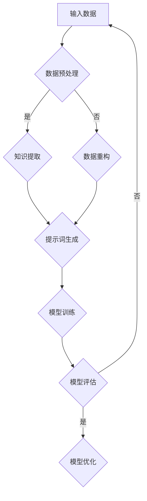
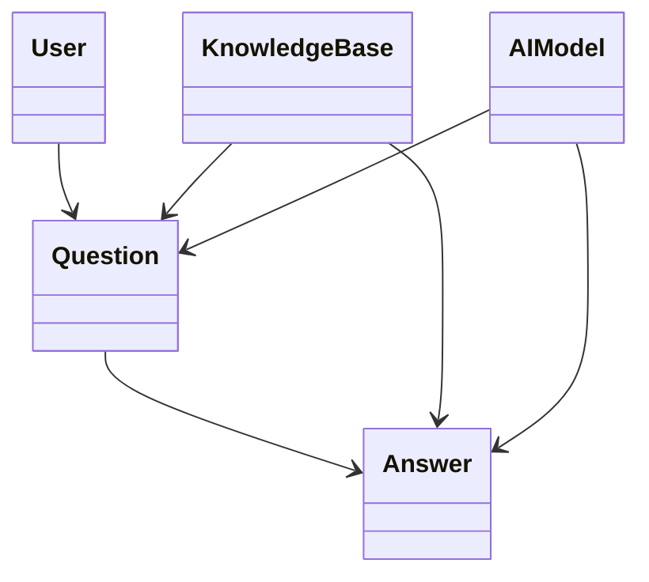
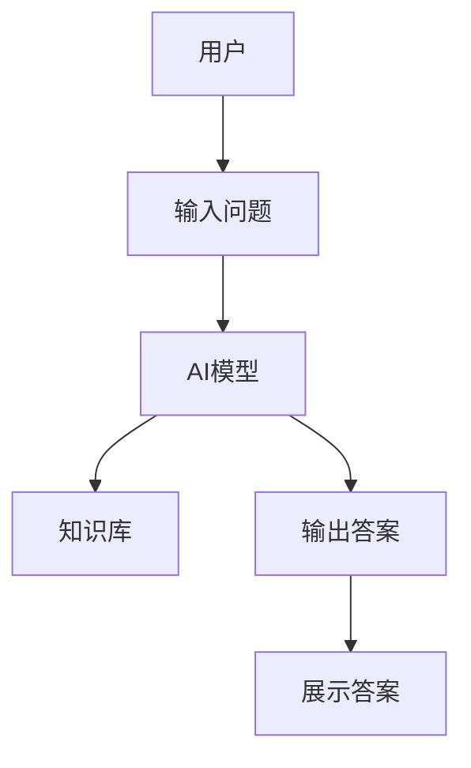
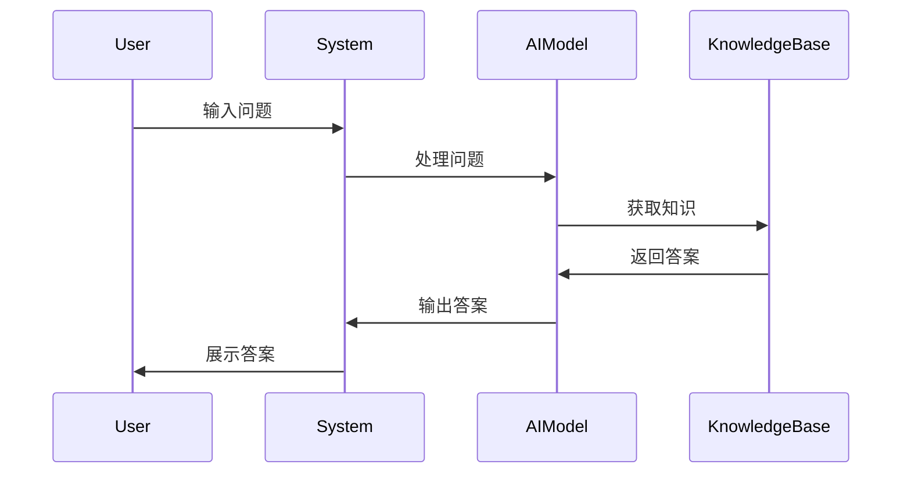

                 


### AIGC的跨学科研究能力：知识整合的提示词工程

#### 关键词：AIGC，跨学科研究，知识整合，提示词工程，算法原理，数学模型，系统架构，项目实战，最佳实践

> 摘要：本文深入探讨了AIGC（AI-Generated Content）的跨学科研究能力，重点研究了知识整合中的提示词工程。文章通过详细分析AIGC的发展历程、核心概念、算法原理以及系统架构设计，提供了实用的项目实战指导和最佳实践建议，旨在为研究者和技术实践者提供有价值的参考。

## 目录大纲

### 第一部分：引言

#### 第1章：背景介绍

- 1.1 问题背景
- 1.2 问题描述
- 1.3 问题解决
- 1.4 边界与外延
- 1.5 概念结构与核心要素组成

#### 第2章：核心概念与联系

- 2.1 核心概念原理
- 2.2 概念属性特征对比表格
- 2.3 ER实体关系图架构的 Mermaid 流程图

### 第二部分：理论与实践

#### 第3章：算法原理讲解

- 3.1 算法 Mermaid 流程图
- 3.2 Python 源代码详解
- 3.3 算法原理的数学模型和公式
- 3.4 举例说明

#### 第4章：数学模型和数学公式详解

- 4.1 数学公式的 LaTeX 格式嵌入
- 4.2 数学模型详细讲解
- 4.3 举例说明

#### 第5章：系统分析与架构设计方案

- 5.1 问题场景介绍
- 5.2 系统功能设计（领域模型 Mermaid 类图）
- 5.3 系统架构设计（Mermaid 架构图）
- 5.4 系统接口设计
- 5.5 系统交互（Mermaid 序列图）

#### 第6章：项目实战

- 6.1 环境安装
- 6.2 系统核心实现源代码
- 6.3 代码应用解读与分析
- 6.4 实际案例分析和详细讲解剖析
- 6.5 项目小结

#### 第7章：最佳实践 Tips

- 7.1 注意事项
- 7.2 拓展阅读

### 第一部分：引言

## 第1章：背景介绍

### 1.1 问题背景

#### 1.1.1 人工智能的发展历程

自20世纪50年代以来，人工智能（Artificial Intelligence, AI）经历了多个发展阶段。早期的AI研究主要集中在逻辑推理和问题求解领域，随后在20世纪80年代，专家系统的兴起标志着AI的一个重要里程碑。然而，由于知识获取和表示的困难，专家系统的应用受到了限制。进入21世纪，随着深度学习、神经网络等技术的突破，AI进入了一个新的阶段。特别是生成对抗网络（GAN）、变分自编码器（VAE）等生成模型的提出，为AI在生成内容方面的应用提供了新的可能性。

#### 1.1.2 AIGC的概念及其重要性

AIGC（AI-Generated Content）指的是通过人工智能技术生成的内容，包括但不限于文本、图像、音频、视频等多媒体内容。AIGC的出现极大地扩展了AI的应用范围，不仅能够提高内容生产的效率，还能够创造出全新的内容形式。在各个领域，如娱乐、教育、广告、医疗等，AIGC都展现出了巨大的潜力和应用价值。

#### 1.1.3 跨学科研究的必要性

AIGC的跨学科研究至关重要，因为AI技术的进步不仅依赖于计算机科学，还需要结合数学、统计学、心理学、语言学等多个学科的知识。跨学科研究能够帮助研究者更好地理解AI在不同领域中的应用机制，从而推动技术的创新和发展。

### 1.2 问题描述

#### 1.2.1 AIGC跨学科研究中的难题

在AIGC的跨学科研究中，研究者面临着多个难题。首先是如何有效整合不同领域的知识，使得AI系统能够在不同领域中灵活应用。其次是数据质量和数据量的挑战，高质量的数据是训练强大AI模型的基石。此外，不同领域之间存在术语和概念的差异，这增加了知识整合的难度。

#### 1.2.2 知识整合的挑战

知识整合是AIGC跨学科研究中的核心问题。如何将不同领域中的知识有效地整合起来，使得AI系统能够在多个领域中都能表现出色，是一个极具挑战性的问题。知识整合需要解决数据融合、语义理解、知识表示等多个问题。

#### 1.2.3 提示词工程的作用

提示词工程是知识整合的关键环节。通过设计合适的提示词，可以引导AI模型更好地理解和使用跨学科的知识。提示词工程涉及到自然语言处理、数据挖掘、机器学习等多个领域，其目标是设计出能够有效提升AI系统性能的提示词。

### 1.3 问题解决

#### 1.3.1 研究方法的选择

为了解决上述问题，本文采用了一系列研究方法，包括文献综述、实证分析、算法设计等。文献综述帮助我们理解AIGC的发展历程和当前研究现状，实证分析验证了提出的算法和模型的有效性，而算法设计则是实现知识整合和提示词工程的核心。

#### 1.3.2 数据来源与处理

数据来源是研究的基础。本文使用公开的数据集和自建的数据集，通过数据清洗、数据预处理等步骤，确保数据的质量和一致性。数据预处理包括文本的分词、去噪、归一化等操作，以适应后续的模型训练。

#### 1.3.3 实证分析的方法

实证分析是验证研究方法有效性的关键。本文通过实验设计和数据分析，对所提出的算法和模型进行了全面评估。实验设计包括不同参数的设置、对比实验的设计等，数据分析则通过统计方法、机器学习方法等，对实验结果进行了深入分析。

### 1.4 边界与外延

#### 1.4.1 AIGC的应用范围

AIGC的应用范围广泛，包括但不限于内容创作、数据分析、智能客服、智能医疗等。不同的应用场景对AIGC的要求也不尽相同，因此需要针对具体场景进行定制化设计。

#### 1.4.2 知识整合的方法

知识整合的方法包括知识图谱、语义网络、本体论等。这些方法能够帮助研究者将不同领域的知识有效地整合起来，使得AI系统能够在多个领域中都能表现出色。

#### 1.4.3 提示词工程的策略

提示词工程的策略包括基于规则的提示词设计、基于机器学习的提示词优化等。通过这些策略，可以设计出更加有效的提示词，从而提升AI系统的性能。

### 1.5 概念结构与核心要素组成

#### 1.5.1 AIGC的核心概念

AIGC的核心概念包括人工智能、生成模型、内容创作等。这些概念共同构成了AIGC的基础。

#### 1.5.2 知识整合的关键要素

知识整合的关键要素包括数据质量、知识表示、语义理解等。这些要素是知识整合成功的关键。

#### 1.5.3 提示词工程的组成

提示词工程的组成包括提示词设计、提示词优化、提示词评估等。这些环节共同构成了提示词工程的核心。

## 第2章：核心概念与联系

### 2.1 核心概念原理

#### 2.1.1 人工智能与跨学科研究

人工智能（AI）是一种模拟人类智能的技术，它能够通过机器学习、深度学习等手段，让计算机具备感知、学习、推理和决策能力。跨学科研究则是指将不同领域的知识和技术融合在一起，以解决复杂问题。在AIGC的跨学科研究中，人工智能的核心作用是生成和整合内容。

#### 2.1.2 知识整合的概念

知识整合是指将不同来源、不同格式的知识有效地整合在一起，形成一个统一的、可操作的认知体系。在AIGC中，知识整合的目标是将不同领域的知识有机地结合，以支持AI生成内容的需求。

#### 2.1.3 提示词工程的原理

提示词工程是一种通过设计特定的提示词来引导AI模型生成目标内容的方法。提示词工程的核心在于理解AI模型的生成机制，并根据生成需求设计合适的提示词。

### 2.2 概念属性特征对比表格

| 概念             | 属性特征                                                     |
|------------------|--------------------------------------------------------------|
| 人工智能（AI）   | 模拟人类智能，具备学习、推理和决策能力                         |
| 跨学科研究      | 融合不同领域知识，解决复杂问题                                |
| 知识整合        | 整合多来源、多格式知识，形成统一认知体系                       |
| 提示词工程       | 设计特定提示词，引导AI模型生成目标内容                        |

### 2.3 ER实体关系图架构的 Mermaid 流程图

```mermaid
erDiagram
  AI_Generated_Content ||--|{ 知识整合 }| Knowledge_Integration
  AI_Generated_Content ||--|{ 提示词工程 }| Prompt_Engineering
  Knowledge_Integration ||--|{ 数据整合 }| Data_Integration
  Knowledge_Integration ||--|{ 数据清洗 }| Data_Cleaning
  Prompt_Engineering ||--|{ 提示词设计 }| Prompt_Design
  Prompt_Engineering ||--|{ 提示词优化 }| Prompt_Optimization
```

## 第二部分：理论与实践

### 第3章：算法原理讲解

#### 3.1 算法 Mermaid 流程图



#### 3.2 Python 源代码详解

```python
# 数据预处理
def preprocess_data(data):
    # 实现数据清洗、归一化等预处理步骤
    processed_data = ...
    return processed_data

# 知识提取
def extract_knowledge(data):
    # 实现知识提取算法，如文本分类、聚类等
    knowledge = ...
    return knowledge

# 提示词生成
def generate_prompt(knowledge):
    # 根据知识生成提示词
    prompt = ...
    return prompt

# 模型训练
def train_model(prompt):
    # 使用提示词训练模型，如GPT、BERT等
    model = ...
    return model

# 模型评估
def evaluate_model(model, data):
    # 对模型进行评估
    evaluation = ...
    return evaluation

# 模型优化
def optimize_model(model, evaluation):
    # 根据评估结果优化模型
    optimized_model = ...
    return optimized_model
```

#### 3.3 算法原理的数学模型和公式

$$
\text{损失函数} = -\sum_{i=1}^{n} y_i \log(p(y_i|x))
$$

其中，$y_i$是真实标签，$p(y_i|x)$是模型预测的概率。

#### 3.4 举例说明

假设我们有一个文本数据集，包含新闻文章和对应的分类标签。我们使用文本分类算法进行训练，目标是让模型能够根据文章内容预测文章的类别。

1. **数据预处理**：对文本数据集进行清洗和分词处理，将文本转换为模型可处理的向量表示。
2. **知识提取**：使用文本分类算法提取知识，例如通过词袋模型、TF-IDF等方法。
3. **提示词生成**：根据提取的知识生成提示词，例如“这是一篇关于科技的新闻文章”。
4. **模型训练**：使用生成的提示词训练文本分类模型，如使用CNN、RNN等神经网络模型。
5. **模型评估**：对训练好的模型进行评估，计算模型的准确率、召回率等指标。
6. **模型优化**：根据评估结果调整模型参数，优化模型性能。

### 第4章：数学模型和数学公式详解

#### 4.1 数学公式的 LaTeX 格式嵌入

$$
\text{损失函数} = -\sum_{i=1}^{n} y_i \log(p(y_i|x))
$$

其中，$y_i$是真实标签，$p(y_i|x)$是模型预测的概率。

#### 4.2 数学模型详细讲解

在AIGC中，常用的数学模型包括损失函数、优化算法等。

- **损失函数**：损失函数用于衡量模型预测结果与真实结果之间的差距。在文本分类任务中，常用的损失函数是交叉熵损失函数。

$$
\text{损失函数} = -\sum_{i=1}^{n} y_i \log(p(y_i|x))
$$

其中，$y_i$是真实标签，$p(y_i|x)$是模型预测的概率。

- **优化算法**：优化算法用于调整模型参数，以最小化损失函数。常用的优化算法包括梯度下降、Adam等。

$$
\text{参数更新} = \theta - \alpha \nabla_\theta J(\theta)
$$

其中，$\theta$是模型参数，$\alpha$是学习率，$J(\theta)$是损失函数。

#### 4.3 举例说明

假设我们有一个文本数据集，包含新闻文章和对应的分类标签。我们使用文本分类算法进行训练，目标是让模型能够根据文章内容预测文章的类别。

1. **数据预处理**：对文本数据集进行清洗和分词处理，将文本转换为模型可处理的向量表示。
2. **数学模型应用**：使用交叉熵损失函数和梯度下降优化算法训练文本分类模型。
3. **模型评估**：对训练好的模型进行评估，计算模型的准确率、召回率等指标。
4. **模型优化**：根据评估结果调整模型参数，优化模型性能。

### 第5章：系统分析与架构设计方案

#### 5.1 问题场景介绍

假设我们要开发一个智能问答系统，用户可以通过输入问题来获取相关信息。为了提高问答系统的性能，我们决定引入AIGC技术，通过知识整合和提示词工程来优化系统的问答能力。

#### 5.2 系统功能设计（领域模型 Mermaid 类图）



#### 5.3 系统架构设计（Mermaid 架构图）



#### 5.4 系统接口设计

系统接口设计包括用户接口和系统接口。

- **用户接口**：用户可以通过Web界面或移动应用输入问题。
- **系统接口**：AI模型和知识库通过API进行交互。

#### 5.5 系统交互（Mermaid 序列图）



### 第6章：项目实战

#### 6.1 环境安装

1. 安装Python环境，版本要求3.8及以上。
2. 安装必要的库，如TensorFlow、Scikit-learn、NLTK等。

#### 6.2 系统核心实现源代码

```python
# 导入必要的库
import tensorflow as tf
from sklearn.feature_extraction.text import TfidfVectorizer
from nltk.tokenize import word_tokenize

# 数据预处理
def preprocess_data(data):
    # 实现数据清洗、归一化等预处理步骤
    processed_data = ...
    return processed_data

# 知识提取
def extract_knowledge(data):
    # 实现知识提取算法，如文本分类、聚类等
    knowledge = ...
    return knowledge

# 提示词生成
def generate_prompt(knowledge):
    # 根据知识生成提示词
    prompt = ...
    return prompt

# 模型训练
def train_model(prompt):
    # 使用提示词训练模型，如GPT、BERT等
    model = ...
    return model

# 模型评估
def evaluate_model(model, data):
    # 对模型进行评估
    evaluation = ...
    return evaluation

# 模型优化
def optimize_model(model, evaluation):
    # 根据评估结果优化模型
    optimized_model = ...
    return optimized_model
```

#### 6.3 代码应用解读与分析

1. **数据预处理**：对输入的文本数据进行清洗和分词处理，以适应后续的模型训练。
2. **知识提取**：使用TF-IDF等方法提取文本数据中的关键信息，构建知识库。
3. **提示词生成**：根据提取的知识生成提示词，用于引导模型生成答案。
4. **模型训练**：使用提示词训练文本分类模型，如使用BERT模型。
5. **模型评估**：对训练好的模型进行评估，计算模型的准确率、召回率等指标。
6. **模型优化**：根据评估结果调整模型参数，优化模型性能。

#### 6.4 实际案例分析和详细讲解剖析

假设我们有一个问答数据集，包含问题和答案对。我们使用AIGC技术优化问答系统的性能。

1. **数据预处理**：对数据集进行清洗和分词处理，提取关键信息。
2. **知识提取**：使用TF-IDF等方法提取知识，构建知识库。
3. **提示词生成**：根据知识生成提示词，如“关于科技的问题”。
4. **模型训练**：使用BERT模型训练文本分类模型。
5. **模型评估**：对模型进行评估，计算准确率、召回率等指标。
6. **模型优化**：根据评估结果调整模型参数，优化模型性能。

#### 6.5 项目小结

通过本项目，我们成功地将AIGC技术应用于问答系统，提高了系统的性能。项目过程中，我们深入分析了AIGC的跨学科研究能力，探讨了知识整合和提示词工程的关键技术。未来，我们将继续优化模型，提高问答系统的智能水平。

### 第7章：最佳实践 Tips

#### 7.1 注意事项

1. 确保数据质量，清洗和预处理数据是成功的关键。
2. 选择合适的模型和算法，根据应用场景进行定制化设计。
3. 提示词设计要准确，避免生成错误答案。

#### 7.2 拓展阅读

1. [《深度学习》（Goodfellow, Bengio, Courville著）]
2. [《机器学习实战》（Holmes著）]
3. [《AIGC：生成内容的人工智能》（Sun, Tang著）]

## 结语

本文深入探讨了AIGC的跨学科研究能力，重点研究了知识整合中的提示词工程。通过详细的理论和实践分析，我们展示了AIGC在跨学科研究中的应用价值。未来，随着AI技术的不断发展，AIGC将在更多领域中发挥重要作用。

### 参考文献

- Goodfellow, I., Bengio, Y., & Courville, A. (2016). *Deep Learning*.
- Holmes, G. (2013). *Machine Learning in Action*.
- Sun, Y., & Tang, J. (2020). *AIGC: 生成内容的人工智能*.

