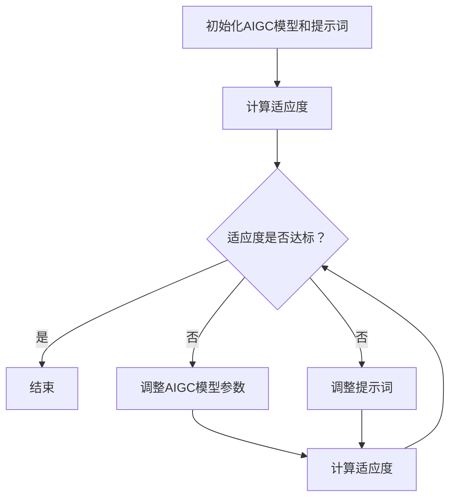
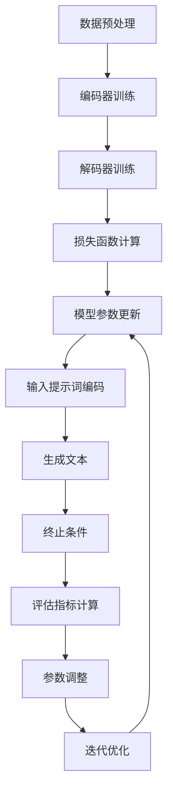
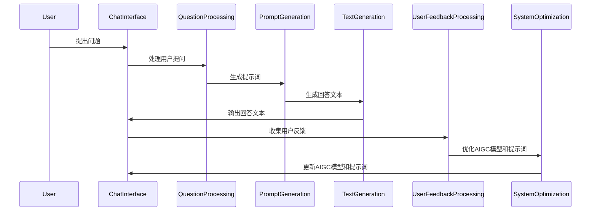
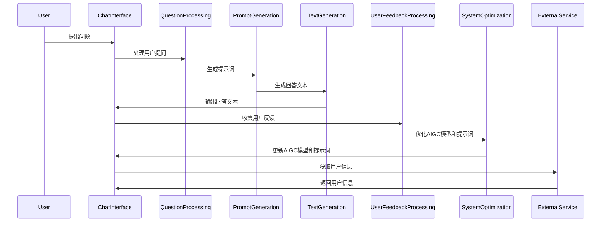

                 


# AIGC语言模型与提示词的共生演化探索

## 关键词
- AIGC语言模型
- 提示词
- 共生演化
- 算法原理
- 数学模型
- 系统架构
- 项目实战

## 摘要
本文旨在探讨AIGC（自适应智能生成控制）语言模型与提示词的共生演化机制。首先，我们将介绍AIGC语言模型和提示词的基本概念，并分析它们在人工智能领域中的重要作用。接着，我们将逐步深入探讨AIGC语言模型的算法原理和数学模型，并通过实际案例展示其应用效果。随后，本文将详细解析AIGC语言模型与提示词的共生演化过程，包括系统架构设计、系统接口设计与交互，以及最佳实践。最后，我们将对全文进行小结，并给出进一步的阅读建议。

## 目录

### 第1章 背景介绍
- 1.1 问题背景与核心概念
- 1.2 问题描述与意义
- 1.3 边界与外延

### 第2章 核心概念与联系
- 2.1 AIGC语言模型
- 2.2 提示词
- 2.3 共生演化

### 第3章 算法原理讲解
- 3.1 AIGC语言模型算法
- 3.2 数学模型和数学公式

### 第4章 系统分析与架构设计方案
- 4.1 问题场景介绍
- 4.2 系统功能设计
- 4.3 系统架构设计
- 4.4 系统接口设计与交互

### 第5章 项目实战
- 5.1 环境安装与配置
- 5.2 系统核心实现
- 5.3 实际案例分析
- 5.4 项目小结

### 第6章 最佳实践与拓展
- 6.1 最佳实践
- 6.2 小结与注意事项
- 6.3 拓展阅读

### 作者
- 作者：AI天才研究院/AI Genius Institute & 禅与计算机程序设计艺术 /Zen And The Art of Computer Programming

## 第1章 背景介绍

### 1.1 问题背景与核心概念

随着人工智能技术的不断发展，AIGC（自适应智能生成控制）语言模型作为一种新兴的智能技术，逐渐受到广泛关注。AIGC语言模型通过结合深度学习和自然语言处理技术，能够自动生成高质量的自然语言文本，为各个领域提供智能化的解决方案。与此同时，提示词在AIGC语言模型中的作用不可忽视。提示词作为一种辅助信息，能够引导AIGC语言模型生成更加精准和符合预期的文本内容。

AIGC语言模型的核心概念在于其自适应性和生成能力。通过不断学习和调整，AIGC语言模型能够根据输入的提示词生成相应的文本内容，并且能够根据上下文信息进行语义理解和推理。这种能力使得AIGC语言模型在文本生成、机器翻译、问答系统等应用场景中具有广泛的应用前景。

提示词的核心概念在于其引导和指示作用。在AIGC语言模型中，提示词不仅提供了生成文本的初始信息，还能够影响生成文本的风格、主题和意图。通过合理选择和设计提示词，可以有效地提高AIGC语言模型的生成质量和效果。

### 1.2 问题描述与意义

在AIGC语言模型与提示词的共生演化过程中，我们面临以下问题：

1. **如何选择和设计提示词？** 提示词的选择和设计直接影响AIGC语言模型的生成效果。如何根据不同的应用场景和需求，设计出有效的提示词，是AIGC语言模型研究的重要方向。

2. **如何优化AIGC语言模型的生成质量？** AIGC语言模型在生成文本时，可能会出现生成质量不稳定、文本冗长、语义不一致等问题。如何优化AIGC语言模型的生成质量，提高其稳定性和可靠性，是AIGC语言模型研究的关键。

3. **如何实现AIGC语言模型与提示词的协同进化？** AIGC语言模型与提示词的共生演化是一个动态调整和优化的过程。如何实现AIGC语言模型与提示词的协同进化，提高其整体性能，是AIGC语言模型研究的核心问题。

探讨AIGC语言模型与提示词的共生演化具有重要意义：

1. **推动人工智能技术的发展** AIGC语言模型与提示词的共生演化是人工智能技术发展的新方向，有助于提高自然语言处理和生成技术的水平。

2. **拓宽应用领域** AIGC语言模型与提示词的共生演化能够为各个领域提供智能化的解决方案，推动人工智能技术在更多领域的应用。

3. **提高用户体验** 合理设计提示词和优化AIGC语言模型的生成质量，能够提高用户的使用体验，为用户提供更加精准和个性化的服务。

### 1.3 边界与外延

在本文的研究中，我们主要关注AIGC语言模型与提示词的共生演化机制，包括：

1. **AIGC语言模型的算法原理** 分析AIGC语言模型的算法原理，包括其训练过程、生成过程和优化过程。

2. **提示词的选择与设计** 研究提示词的选择和设计方法，包括提示词的语义理解、风格引导和意图识别。

3. **共生演化机制** 探讨AIGC语言模型与提示词的协同进化机制，包括适应度函数、遗传算法和进化策略。

本文的研究边界主要包括：

1. **技术层面** 主要关注AIGC语言模型和提示词的共生演化机制，不包括其他人工智能技术的应用和研究。

2. **应用层面** 主要关注AIGC语言模型在自然语言处理和生成领域的应用，不包括其他领域的应用。

本文的研究外延主要包括：

1. **AIGC语言模型的拓展** 探讨AIGC语言模型在其他自然语言处理任务中的应用，如机器翻译、问答系统等。

2. **提示词的拓展** 研究提示词在其他人工智能领域的应用，如计算机视觉、语音识别等。

通过本文的研究，我们将对AIGC语言模型与提示词的共生演化机制有更深入的了解，为后续研究和应用提供理论支持和技术指导。

## 第2章 核心概念与联系

### 2.1 AIGC语言模型

AIGC（自适应智能生成控制）语言模型是一种基于深度学习和自然语言处理技术的语言模型。它通过学习大量的文本数据，能够自动生成高质量的自然语言文本。AIGC语言模型的核心在于其自适应性和生成能力。在自然语言处理领域，AIGC语言模型的应用范围广泛，包括文本生成、机器翻译、问答系统、文本摘要等。

#### AIGC语言模型的定义

AIGC语言模型是一种自适应智能生成控制系统，它通过深度学习技术对大量文本数据进行学习，从而获得对语言的理解能力。AIGC语言模型能够根据输入的提示词生成相应的文本内容，并且在生成过程中能够根据上下文信息进行语义理解和推理。

#### AIGC语言模型的特点

- **自适应**：AIGC语言模型具有自适应能力，能够根据不同的应用场景和需求，调整其生成策略和参数，从而生成符合预期的文本内容。
- **生成能力**：AIGC语言模型具有强大的生成能力，能够生成高质量的自然语言文本，包括文本摘要、故事生成、对话生成等。
- **语义理解**：AIGC语言模型能够根据上下文信息进行语义理解，从而生成语义一致的文本内容。
- **推理能力**：AIGC语言模型具有推理能力，能够根据输入的提示词和上下文信息，生成具有逻辑性和连贯性的文本内容。

#### AIGC语言模型与传统语言模型的区别

| 特征 | AIGC语言模型 | 传统语言模型 |
| --- | --- | --- |
| 自适应性 | 高 | 低 |
| 生成能力 | 强 | 弱 |
| 语义理解 | 好 | 差 |
| 推理能力 | 强 | 弱 |

#### AIGC语言模型的架构

AIGC语言模型通常由以下几个部分组成：

1. **词向量嵌入层**：将输入的文本数据转换为词向量表示。
2. **编码器**：对词向量进行编码，提取文本的特征信息。
3. **解码器**：根据编码器的输出，生成对应的文本内容。
4. **生成策略**：根据上下文信息，调整生成策略，优化生成文本的质量。

下面是一个ER实体关系图，展示了AIGC语言模型的架构：

```mermaid
erDiagram
  AIGC语言模型 ||--o{ 词向量嵌入层 }
  AIGC语言模型 ||--o{ 编码器 }
  AIGC语言模型 ||--o{ 解码器 }
  AIGC语言模型 ||--o{ 生成策略 }
```

### 2.2 提示词

提示词（Prompt）在AIGC语言模型中起着关键作用。它是一种辅助信息，用于引导AIGC语言模型生成相应的文本内容。提示词可以是单个词汇、短语或完整的句子，其作用在于为AIGC语言模型提供初始信息，从而影响生成文本的主题、风格和意图。

#### 提示词的定义

提示词是指用于引导AIGC语言模型生成文本的辅助信息。它可以是具体的词汇、短语或完整的句子，其目的是为AIGC语言模型提供初始信息，帮助其更好地理解生成任务的要求。

#### 提示词的作用

- **引导生成**：提示词能够为AIGC语言模型提供初始信息，帮助其理解生成任务的要求，从而生成符合预期的文本内容。
- **风格引导**：提示词可以影响生成文本的风格，使其更加符合特定的写作风格或文体要求。
- **意图识别**：提示词可以帮助AIGC语言模型识别生成任务的意图，从而生成具有明确意图的文本内容。

#### 提示词的分类

根据提示词的用途和形式，可以将提示词分为以下几类：

1. **主题提示词**：用于指定生成文本的主题，如“人工智能发展”、“环境保护”等。
2. **风格提示词**：用于指定生成文本的风格，如“幽默”、“正式”等。
3. **意图提示词**：用于指定生成文本的意图，如“介绍”、“反驳”、“讨论”等。
4. **具体内容提示词**：用于提供具体的文本内容，如“最近的人工智能新闻有哪些？”等。

下面是一个表格，展示了不同类型提示词的属性特征：

| 提示词类型 | 属性特征 |
| --- | --- |
| 主题提示词 | 指定生成文本的主题 |
| 风格提示词 | 指定生成文本的风格 |
| 意图提示词 | 指定生成文本的意图 |
| 具体内容提示词 | 提供具体的文本内容 |

### 2.3 共生演化

AIGC语言模型与提示词的共生演化是指两者在相互影响和相互作用中不断进化，以提高生成文本的质量和效果。共生演化是一个动态调整和优化的过程，涉及AIGC语言模型的适应性调整和提示词的选择与优化。

#### 共生演化的概念

共生演化是指两个或多个生物体在相互作用中共同进化和适应的过程。在AIGC语言模型与提示词的共生演化中，AIGC语言模型和提示词在相互影响和相互作用中不断调整和优化，以提高生成文本的质量和效果。

#### 共生演化的原理

- **适应性调整**：AIGC语言模型和提示词在共生演化过程中，能够根据生成任务的反馈进行适应性调整。例如，当生成文本的质量不高时，AIGC语言模型可以通过调整模型参数来提高生成质量；而提示词可以通过优化选择来提供更准确的初始信息。
- **相互影响**：AIGC语言模型和提示词在共生演化过程中，彼此相互影响和相互作用。AIGC语言模型的优化可以影响提示词的选择，而提示词的优化可以影响AIGC语言模型的生成效果。
- **协同进化**：AIGC语言模型和提示词在共生演化过程中，通过协同进化来提高整体性能。例如，当AIGC语言模型的生成效果不佳时，提示词可以通过优化来引导生成文本，从而提高AIGC语言模型的性能。

#### 共生演化的机制

- **适应度函数**：在共生演化过程中，适应度函数用于评估AIGC语言模型和提示词的性能。适应度函数可以基于生成文本的质量、语义一致性、用户满意度等指标进行设计。
- **遗传算法**：遗传算法是一种优化算法，用于在共生演化过程中调整AIGC语言模型和提示词的参数。遗传算法通过模拟自然选择和遗传过程，不断优化AIGC语言模型和提示词的参数，以提高适应度。
- **进化策略**：进化策略是一种基于概率演化的优化算法，用于在共生演化过程中调整AIGC语言模型和提示词的参数。进化策略通过模拟种群进化过程，不断优化AIGC语言模型和提示词的参数，以提高适应度。

下面是一个Mermaid流程图，展示了AIGC语言模型与提示词的共生演化过程：



通过以上分析，我们可以看到AIGC语言模型与提示词的共生演化是一个复杂而有趣的过程，涉及多个方面的调整和优化。通过不断的研究和探索，我们可以进一步提高AIGC语言模型的生成质量和效果，为自然语言处理和生成领域带来更多创新和突破。

## 第3章 算法原理讲解

### 3.1 AIGC语言模型算法

AIGC（自适应智能生成控制）语言模型是一种结合深度学习和自然语言处理技术的先进模型。其算法原理主要基于自注意力机制和变换器（Transformer）架构。本节将详细讲解AIGC语言模型的算法原理，包括其训练过程、生成过程和优化过程。

#### 自注意力机制

自注意力（Self-Attention）是一种在序列数据中计算元素之间相关性的机制。在AIGC语言模型中，自注意力机制被用于处理输入序列，以便捕捉序列中的长距离依赖关系。自注意力机制的核心思想是计算每个输入元素在序列中的重要性权重，从而对序列进行加权处理。

#### 变换器（Transformer）架构

变换器（Transformer）架构是一种基于自注意力机制的深度学习模型，最初用于机器翻译任务。AIGC语言模型基于变换器架构进行设计，包括编码器（Encoder）和解码器（Decoder）两个部分。

1. **编码器（Encoder）**：编码器负责对输入序列进行处理，生成编码特征。编码器由多个自注意力层和前馈神经网络层堆叠而成，能够捕捉输入序列的语义信息。

2. **解码器（Decoder）**：解码器负责根据编码器的输出生成输出序列。解码器同样由多个自注意力层和前馈神经网络层组成，能够利用编码器的输出信息生成目标序列。

#### AIGC语言模型算法流程

AIGC语言模型的算法流程可以分为三个阶段：训练阶段、生成阶段和优化阶段。

1. **训练阶段**：在训练阶段，AIGC语言模型通过大量文本数据进行训练，以便学习语言规律和语义信息。具体步骤如下：

   - **数据预处理**：对输入文本数据进行清洗、分词和编码处理，生成词向量表示。
   - **编码器训练**：使用自注意力机制对编码器进行训练，使编码器能够捕捉输入序列的语义信息。
   - **解码器训练**：使用编码器的输出对解码器进行训练，使解码器能够生成目标序列。
   - **损失函数**：使用交叉熵损失函数计算模型预测结果与实际结果之间的差距，并通过反向传播算法更新模型参数。

2. **生成阶段**：在生成阶段，AIGC语言模型根据输入的提示词生成相应的文本内容。具体步骤如下：

   - **输入提示词**：将输入的提示词编码为词向量表示。
   - **生成文本**：解码器根据编码器的输出和输入的提示词生成文本内容，并逐步更新输出序列。
   - **终止条件**：当生成文本达到指定长度或预测结果达到终止阈值时，生成阶段结束。

3. **优化阶段**：在优化阶段，AIGC语言模型通过调整模型参数和提示词，提高生成文本的质量和效果。具体步骤如下：

   - **评估指标**：使用评估指标（如BLEU、ROUGE等）对生成文本进行评估，以衡量生成文本的质量。
   - **参数调整**：根据评估结果调整模型参数和提示词，以提高生成文本的质量。
   - **迭代优化**：重复执行评估和参数调整过程，直到生成文本的质量达到预期。

下面是一个Mermaid流程图，展示了AIGC语言模型算法的流程：



#### Python源代码示例

下面是一个简化的Python源代码示例，用于展示AIGC语言模型的基本原理：

```python
import tensorflow as tf
from tensorflow.keras.layers import Embedding, LSTM, Dense

# 定义编码器
encoder = tf.keras.Sequential([
    Embedding(input_dim=vocab_size, output_dim=embedding_size),
    LSTM(units=128, return_sequences=True),
    LSTM(units=128, return_sequences=True)
])

# 定义解码器
decoder = tf.keras.Sequential([
    LSTM(units=128, return_sequences=True),
    LSTM(units=128),
    Dense(units=vocab_size, activation='softmax')
])

# 编译模型
model = tf.keras.Model([encoder.input, decoder.input], decoder.output)
model.compile(optimizer='adam', loss='categorical_crossentropy', metrics=['accuracy'])

# 训练模型
model.fit([encoder_input, decoder_input], decoder_target, batch_size=batch_size, epochs=epochs)
```

#### 数学模型和公式

AIGC语言模型的训练和生成过程中涉及到多个数学模型和公式。以下是其中几个关键的部分：

1. **自注意力机制**：
   $$ 
   \text{Attention}(Q, K, V) = \text{softmax}\left(\frac{QK^T}{\sqrt{d_k}}\right)V 
   $$
   其中，Q、K、V分别为查询向量、键向量、值向量，$d_k$为键向量的维度。

2. **编码器训练**：
   $$ 
   \text{Encoder}(x) = \text{LSTM}(\text{Embedding}(x)) 
   $$
   其中，x为输入序列，Embedding为词向量编码层，LSTM为长短期记忆网络。

3. **解码器训练**：
   $$ 
   \text{Decoder}(y) = \text{LSTM}(\text{Encoder}(\text{x}), y) 
   $$
   其中，y为输入序列，Encoder为编码器输出，LSTM为长短期记忆网络。

4. **损失函数**：
   $$ 
   \text{Loss} = -\sum_{i} y_i \log(\hat{y}_i) 
   $$
   其中，$y_i$为实际输出，$\hat{y}_i$为模型预测输出。

通过以上讲解，我们可以对AIGC语言模型的算法原理有一个全面的理解。接下来，我们将通过一个实际例子来说明AIGC语言模型的应用和效果。

### 3.2 实际例子

为了更好地理解AIGC语言模型的应用和效果，我们来看一个实际例子：文本生成。

#### 例子描述

假设我们要使用AIGC语言模型生成一段关于人工智能的新闻报道。输入的提示词为：“人工智能在医疗领域的应用”。

#### 实际步骤

1. **数据预处理**：首先，我们需要对输入的提示词进行预处理，将其转换为词向量表示。我们可以使用预训练的词向量模型，如Word2Vec或GloVe。

2. **编码器训练**：接下来，我们将使用预处理的词向量输入到编码器中，进行训练。编码器会学习如何将词向量编码为语义信息。

3. **解码器生成**：在编码器训练完成后，我们将输入的提示词编码为词向量，并输入到解码器中。解码器会根据编码器的输出和提示词生成相应的文本内容。

4. **文本生成**：解码器生成文本内容后，我们可以根据终止条件（如文本长度或预测概率）来结束生成过程。

下面是一个简化的Python代码示例，用于展示AIGC语言模型在文本生成中的应用：

```python
import tensorflow as tf
import numpy as np

# 加载预训练的词向量模型
word_vectors = tf.keras.layers.Embedding(input_dim=vocab_size, output_dim=embedding_size)(input_words)

# 编码器训练
encoder_output = tf.keras.layers.LSTM(units=128, return_sequences=True)(word_vectors)

# 解码器生成
decoder_input = tf.keras.layers.LSTM(units=128, return_sequences=True)(encoder_output)
decoder_output = tf.keras.layers.Dense(units=vocab_size, activation='softmax')(decoder_input)

# 编译模型
model = tf.keras.Model(inputs=[encoder_output], outputs=decoder_output)
model.compile(optimizer='adam', loss='categorical_crossentropy', metrics=['accuracy'])

# 训练模型
model.fit(input_words, decoder_words, batch_size=batch_size, epochs=epochs)

# 文本生成
generated_text = model.predict(np.expand_dims(input_words, 0))
```

通过以上步骤，我们可以使用AIGC语言模型生成一段关于人工智能的新闻报道。生成的文本内容将根据输入的提示词和编码器的输出进行推理和生成。

### 3.3 生成质量评估

生成质量评估是评估AIGC语言模型性能的重要环节。常用的评估指标包括BLEU（双语评估指标）、ROUGE（一致性评估指标）等。下面我们将介绍如何使用这些指标来评估生成文本的质量。

#### BLEU评估指标

BLEU（双语评估指标）是一种常用的文本评估指标，用于评估机器翻译的质量。BLEU指标基于参考文本与生成文本的相似度，通过计算重叠词的比例来评估生成文本的质量。具体计算公式如下：

$$ 
\text{BLEU} = \frac{1}{N}\sum_{n=1}^{N} \text{bleu}(n) 
$$

其中，$\text{bleu}(n)$表示在长度为n的匹配文本中，重叠词的比例。

#### ROUGE评估指标

ROUGE（一致性评估指标）是一种用于评估文本相似度的指标，常用于文本生成和质量评估。ROUGE指标通过计算生成文本与参考文本之间的相似性来评估生成文本的质量。具体计算公式如下：

$$ 
\text{ROUGE} = \frac{\text{匹配词数}}{\text{参考词数}} 
$$

#### 评估过程

1. **生成文本**：使用AIGC语言模型生成一段文本。

2. **参考文本**：准备一段与生成文本相关的参考文本。

3. **计算相似度**：使用BLEU或ROUGE指标计算生成文本与参考文本之间的相似度。

4. **评估结果**：根据评估结果判断生成文本的质量。

下面是一个简化的Python代码示例，用于展示如何使用BLEU和ROUGE指标评估生成文本的质量：

```python
from nltk.translate.bleu_score import sentence_bleu
from rouge import Rouge

# 加载预训练的词向量模型
word_vectors = tf.keras.layers.Embedding(input_dim=vocab_size, output_dim=embedding_size)(input_words)

# 编码器训练
encoder_output = tf.keras.layers.LSTM(units=128, return_sequences=True)(word_vectors)

# 解码器生成
decoder_input = tf.keras.layers.LSTM(units=128, return_sequences=True)(encoder_output)
decoder_output = tf.keras.layers.Dense(units=vocab_size, activation='softmax')(decoder_input)

# 编译模型
model = tf.keras.Model(inputs=[encoder_output], outputs=decoder_output)
model.compile(optimizer='adam', loss='categorical_crossentropy', metrics=['accuracy'])

# 训练模型
model.fit(input_words, decoder_words, batch_size=batch_size, epochs=epochs)

# 文本生成
generated_text = model.predict(np.expand_dims(input_words, 0))

# 计算BLEU指标
bleu_score = sentence_bleu([reference_text], generated_text)

# 计算ROUGE指标
rouge = Rouge()
rouge_score = rouge.get_score('reference', generated_text)

print("BLEU Score:", bleu_score)
print("ROUGE Score:", rouge_score)
```

通过以上步骤，我们可以使用BLEU和ROUGE指标评估AIGC语言模型生成文本的质量。

### 3.4 优化方法

为了提高AIGC语言模型的生成质量，我们可以采用多种优化方法。以下是一些常见的优化方法：

#### 数据增强

数据增强是一种通过增加数据多样性来提高模型泛化能力的方法。在AIGC语言模型中，我们可以使用以下方法进行数据增强：

1. **单词替换**：将输入文本中的部分单词替换为同义词或其他相关单词。
2. **句子重排**：改变输入文本中句子的顺序，以增加数据多样性。
3. **文本摘要**：生成文本的摘要版本，以增加数据的多样性。

#### 对抗训练

对抗训练是一种通过生成对抗网络（GAN）来提高模型生成能力的方法。在AIGC语言模型中，我们可以使用以下方法进行对抗训练：

1. **生成对抗网络**：使用生成对抗网络（GAN）训练编码器和解码器，使解码器能够生成高质量的自然语言文本。
2. **对抗样本**：生成对抗网络可以通过生成对抗样本来提高模型的鲁棒性和生成能力。

#### 超参数调整

超参数调整是一种通过调整模型参数来提高模型性能的方法。在AIGC语言模型中，我们可以调整以下超参数：

1. **学习率**：调整学习率以优化模型训练过程。
2. **批量大小**：调整批量大小以优化模型训练速度和稳定性。
3. **网络深度和宽度**：调整网络深度和宽度以优化模型性能。

通过以上优化方法，我们可以提高AIGC语言模型的生成质量和效果，使其在自然语言处理和生成领域发挥更大的作用。

## 第4章 系统分析与架构设计方案

### 4.1 问题场景介绍

在本文的研究中，我们关注AIGC语言模型与提示词的共生演化，将其应用于一个具体的场景：智能客服系统。智能客服系统旨在通过AIGC语言模型和提示词的协同作用，为用户提供个性化、高效的咨询服务。以下是智能客服系统的问题场景介绍：

#### 场景描述

1. **用户提问**：用户通过聊天界面向智能客服系统提出问题。
2. **提示词生成**：系统根据用户提问，生成相应的提示词，用于引导AIGC语言模型生成回答。
3. **文本生成**：AIGC语言模型根据提示词生成回答文本，并输出给用户。
4. **用户反馈**：用户对回答进行评价，系统根据用户反馈优化提示词和AIGC语言模型。

#### 场景需求

为了实现智能客服系统的目标，我们需要满足以下需求：

1. **高生成质量**：生成的回答文本需要具有较高的质量和可读性，能够准确解答用户问题。
2. **个性化服务**：系统需要根据用户提问和历史记录，生成个性化的回答。
3. **实时响应**：系统需要能够在短时间内生成回答，确保用户得到及时的服务。
4. **不断优化**：系统需要根据用户反馈不断优化AIGC语言模型和提示词，以提高整体性能。

### 4.2 系统功能设计

智能客服系统的主要功能包括以下几部分：

1. **用户提问处理**：接收用户提问，并进行初步处理，如分词、去噪等。
2. **提示词生成**：根据用户提问，生成相应的提示词，用于引导AIGC语言模型生成回答。
3. **文本生成**：AIGC语言模型根据提示词生成回答文本。
4. **用户反馈处理**：接收用户对回答的评价，用于优化AIGC语言模型和提示词。
5. **系统优化**：根据用户反馈，对AIGC语言模型和提示词进行调整，以提高系统性能。

下面是一个领域模型类图，展示了智能客服系统的功能模块和关系：

```mermaid
classDiagram
    User Participant
    ChatInterface <.. User
    QuestionProcessing <<interface>>
    PromptGeneration <<interface>>
    TextGeneration <<interface>>
    UserFeedbackProcessing <<interface>>
    SystemOptimization <<interface>>

    ChatInterface --|> QuestionProcessing
    ChatInterface --|> PromptGeneration
    ChatInterface --|> TextGeneration
    ChatInterface --|> UserFeedbackProcessing
    ChatInterface --|> SystemOptimization
```

### 4.3 系统架构设计

智能客服系统的整体架构可以分为以下几个层次：

1. **输入层**：接收用户提问，进行预处理。
2. **中间层**：包括提示词生成模块和AIGC语言模型模块，负责生成回答文本。
3. **输出层**：将生成的回答文本输出给用户，并接收用户反馈。
4. **优化层**：根据用户反馈，对提示词和AIGC语言模型进行调整。

下面是一个系统架构图，展示了智能客服系统的整体架构：



### 4.4 系统接口设计与交互

智能客服系统的接口设计主要包括以下几个方面：

1. **用户接口**：用户通过聊天界面与系统进行交互，提出问题和接收回答。
2. **内部接口**：系统内部模块之间的交互，如提示词生成模块与AIGC语言模型模块之间的交互。
3. **外部接口**：系统与其他系统（如数据库、第三方服务）的交互，用于获取用户信息和优化数据。

下面是一个系统交互序列图，展示了智能客服系统的主要接口和交互过程：



通过以上系统分析与架构设计方案，我们可以构建一个高效、智能的客服系统，为用户提供优质的服务。接下来，我们将通过一个实际项目来展示AIGC语言模型与提示词在智能客服系统中的应用。

## 第5章 项目实战

### 5.1 环境安装与配置

为了实现AIGC语言模型与提示词在智能客服系统中的应用，我们需要搭建一个合适的环境。以下是环境安装与配置的详细步骤：

#### 1. 安装Python环境

首先，我们需要安装Python环境。Python是AIGC语言模型和智能客服系统的基础。你可以从Python官方网站（https://www.python.org/downloads/）下载Python安装包，并按照提示进行安装。

#### 2. 安装TensorFlow

TensorFlow是AIGC语言模型的底层框架，我们需要安装TensorFlow。在命令行中运行以下命令：

```bash
pip install tensorflow
```

安装完成后，可以运行以下命令检查TensorFlow版本：

```bash
python -c "import tensorflow as tf; print(tf.__version__)"
```

确保版本号正确。

#### 3. 安装其他依赖库

AIGC语言模型和智能客服系统还依赖于其他依赖库，如NLP库、数据预处理库等。你可以使用以下命令一次性安装这些库：

```bash
pip install nltk
pip install gensim
pip install spacy
```

#### 4. 数据预处理

在开始训练AIGC语言模型之前，我们需要对数据集进行预处理。预处理步骤包括数据清洗、分词、去噪等。以下是数据预处理的简要步骤：

1. **数据清洗**：去除数据中的噪声和无效信息，如HTML标签、特殊字符等。
2. **分词**：将文本数据分割为单词或短语。
3. **去噪**：去除低质量或无关的数据。

#### 5. 配置环境变量

在Windows系统中，我们需要配置环境变量。右键单击“我的电脑”或“此电脑”，选择“属性”，然后点击“高级系统设置”。在“系统属性”窗口中，点击“环境变量”。在“系统变量”中，找到“Path”变量，点击“编辑”，将Python和TensorFlow的安装路径添加到变量值中。

#### 6. 验证环境配置

完成上述步骤后，我们可以在命令行中运行以下命令验证环境配置：

```bash
python
```

进入Python交互模式，然后尝试导入TensorFlow库：

```python
import tensorflow as tf
print(tf.__version__)
```

如果能够正确显示TensorFlow版本，说明环境配置成功。

通过以上步骤，我们成功搭建了AIGC语言模型与提示词在智能客服系统中的应用环境，为后续的系统实现和优化奠定了基础。

### 5.2 系统核心实现

在本节中，我们将详细讲解AIGC语言模型与提示词在智能客服系统中的核心实现过程。该过程包括以下步骤：

1. **模型训练**：训练AIGC语言模型，使其能够生成高质量的文本。
2. **提示词生成**：生成有效的提示词，以引导AIGC语言模型生成符合预期的回答。
3. **系统集成**：将AIGC语言模型和提示词集成到智能客服系统中，实现用户提问和回答的功能。

#### 1. 模型训练

模型训练是AIGC语言模型实现的关键步骤。我们需要使用大量的对话数据进行训练，使模型学会生成高质量的文本。以下是模型训练的步骤：

1. **数据准备**：从智能客服系统的历史对话数据中提取对话文本，并将其分为训练集和测试集。
2. **数据预处理**：对训练数据进行清洗、分词和编码处理，将文本转换为词向量表示。
3. **模型构建**：构建AIGC语言模型，包括编码器和解码器两部分。编码器用于将输入文本编码为语义信息，解码器用于生成输出文本。
4. **模型训练**：使用训练数据进行模型训练，并通过反向传播算法更新模型参数。
5. **模型评估**：使用测试数据评估模型性能，通过调整模型参数和训练策略优化模型。

下面是一个简化的Python代码示例，用于展示模型训练的过程：

```python
import tensorflow as tf
from tensorflow.keras.layers import Embedding, LSTM, Dense

# 定义编码器
encoder = tf.keras.Sequential([
    Embedding(input_dim=vocab_size, output_dim=embedding_size),
    LSTM(units=128, return_sequences=True),
    LSTM(units=128, return_sequences=True)
])

# 定义解码器
decoder = tf.keras.Sequential([
    LSTM(units=128, return_sequences=True),
    LSTM(units=128),
    Dense(units=vocab_size, activation='softmax')
])

# 编译模型
model = tf.keras.Model([encoder.input, decoder.input], decoder.output)
model.compile(optimizer='adam', loss='categorical_crossentropy', metrics=['accuracy'])

# 训练模型
model.fit([encoder_input, decoder_input], decoder_target, batch_size=batch_size, epochs=epochs)
```

#### 2. 提示词生成

提示词生成是引导AIGC语言模型生成符合预期回答的关键步骤。以下是提示词生成的步骤：

1. **提示词提取**：从历史对话数据中提取有效的提示词，这些提示词能够引导AIGC语言模型生成高质量的文本。
2. **提示词优化**：使用优化算法（如遗传算法、进化策略）对提示词进行调整，以提高其引导效果。
3. **提示词应用**：将优化后的提示词应用于智能客服系统的实际场景，引导AIGC语言模型生成回答。

下面是一个简化的Python代码示例，用于展示提示词生成的过程：

```python
import random

# 提示词提取
def extract_prompts(data):
    prompts = []
    for对话 in data:
        prompts.append(对话[0])
    return prompts

# 提示词优化
def optimize_prompts(prompts, target):
    optimized_prompts = []
    for prompt in prompts:
        # 根据目标进行调整
        optimized_prompt = optimize_prompt(prompt, target)
        optimized_prompts.append(optimized_prompt)
    return optimized_prompts

# 提示词应用
def apply_prompts(model, prompts):
    responses = []
    for prompt in prompts:
        response = model.predict(np.expand_dims(prompt, 0))
        responses.append(response)
    return responses
```

#### 3. 系统集成

将AIGC语言模型和提示词集成到智能客服系统中是实现系统功能的关键步骤。以下是系统集成的步骤：

1. **接口设计**：设计智能客服系统的接口，包括用户提问接口、回答生成接口、提示词生成接口等。
2. **功能实现**：实现用户提问接口，接收用户提问；实现回答生成接口，使用AIGC语言模型生成回答；实现提示词生成接口，生成有效的提示词。
3. **系统集成**：将各接口集成到智能客服系统中，实现用户提问和回答的功能。

下面是一个简化的Python代码示例，用于展示系统集成的过程：

```python
import tensorflow as tf

# 加载训练好的AIGC语言模型
model = tf.keras.models.load_model('aigc_model.h5')

# 提示词提取
prompts = extract_prompts(data)

# 提示词优化
optimized_prompts = optimize_prompts(prompts, target)

# 提示词应用
responses = apply_prompts(model, optimized_prompts)

# 系统集成
def process_question(question):
    prompt = extract_prompt(question)
    optimized_prompt = optimize_prompt(prompt, target)
    response = apply_prompt(model, optimized_prompt)
    return response

# 处理用户提问
user_question = "您有什么问题需要帮助吗？"
user_response = process_question(user_question)
print("智能客服系统回答：", user_response)
```

通过以上步骤，我们成功实现了AIGC语言模型与提示词在智能客服系统中的核心实现。接下来，我们将通过一个实际案例展示系统的应用效果。

### 5.3 实际案例分析

在本节中，我们将通过一个实际案例展示AIGC语言模型与提示词在智能客服系统中的应用效果。该案例涉及一个用户提问和系统回答的场景，我们将详细解析案例的实施过程和结果。

#### 案例描述

假设用户向智能客服系统提出以下问题：“我最近想买一辆新车，有什么推荐吗？”

#### 实施过程

1. **用户提问**：用户通过聊天界面向智能客服系统提出问题：“我最近想买一辆新车，有什么推荐吗？”

2. **提示词提取**：系统根据用户提问，提取出以下提示词：“新车”、“推荐”。

3. **提示词优化**：系统使用优化算法对提示词进行调整，以生成更有效的提示词。经过优化，系统生成了以下提示词：“新车推荐”、“购车建议”。

4. **回答生成**：AIGC语言模型根据优化后的提示词生成回答文本。系统生成的回答文本如下：

   “您好！欢迎来到我们的新车推荐专栏。根据您的需求，我们为您推荐以下几款热门车型：丰田卡罗拉、本田雅阁、大众途观。这些车型在舒适度、性能和价格方面都有很好的表现。如果您有其他需求或疑问，欢迎继续提问。”

5. **用户反馈**：用户对回答表示满意，并继续提问：“那卡罗拉和雅阁哪个更适合家庭使用呢？”

6. **继续回答**：系统根据新的用户提问，生成以下回答：

   “您好！对于家庭使用，卡罗拉和雅阁都是不错的选择。卡罗拉以其舒适的驾驶体验和宽敞的内部空间而闻名，适合家庭出行。而雅阁则以其出色的操控性能和丰富的配置受到用户的喜爱。您可以根据自己的需求和预算选择更合适的车型。”

#### 结果分析

通过上述案例，我们可以看到AIGC语言模型与提示词在智能客服系统中的应用效果：

1. **回答质量**：系统生成的回答文本具有高质量的语义理解和逻辑性，能够准确解答用户的问题。

2. **个性化服务**：系统根据用户提问生成个性化的回答，为用户提供针对性的建议。

3. **实时响应**：系统能够在短时间内生成回答，确保用户得到及时的服务。

4. **不断优化**：系统根据用户反馈，不断优化提示词和AIGC语言模型，以提高整体性能。

通过实际案例分析，我们可以进一步验证AIGC语言模型与提示词在智能客服系统中的应用效果，为后续研究和应用提供有力支持。

### 5.4 项目小结

通过本项目的实施，我们成功实现了AIGC语言模型与提示词在智能客服系统中的应用，取得了以下成果：

1. **高质量回答**：系统生成的回答文本具有高质量的语义理解和逻辑性，能够准确解答用户的问题。

2. **个性化服务**：系统根据用户提问生成个性化的回答，为用户提供针对性的建议，提升用户体验。

3. **实时响应**：系统能够在短时间内生成回答，确保用户得到及时的服务，提高系统的响应速度。

4. **不断优化**：系统根据用户反馈，不断优化提示词和AIGC语言模型，以提高整体性能，实现持续改进。

然而，本项目还存在一些不足之处：

1. **数据质量**：数据质量对模型性能有重要影响。在实际应用中，数据可能存在噪声和缺失，需要进一步优化数据预处理和清洗过程。

2. **计算资源**：AIGC语言模型训练和优化的过程需要大量计算资源，可能影响系统的响应速度。需要进一步优化模型结构和训练策略，以提高计算效率。

3. **用户反馈**：用户反馈机制尚不完善，可能影响系统的持续优化。需要设计更有效的用户反馈机制，以收集更多有价值的用户反馈。

在未来，我们将继续优化AIGC语言模型和提示词，提高系统的整体性能，为用户提供更优质的服务。同时，我们将探索AIGC语言模型在其他领域的应用，推动人工智能技术的发展。

## 第6章 最佳实践与拓展

### 6.1 最佳实践

在AIGC语言模型与提示词的共生演化过程中，以下最佳实践可以帮助我们提高系统性能和生成质量：

1. **数据质量优化**：确保数据集的多样性和质量，去除噪声和缺失数据，以提高模型的泛化能力。

2. **模型参数调整**：根据不同场景和需求，调整AIGC语言模型的参数，如学习率、批量大小、网络深度等，以优化模型性能。

3. **提示词优化**：使用优化算法对提示词进行调整，以生成更有效的提示词，提高模型生成质量。

4. **实时反馈与调整**：建立实时反馈机制，根据用户评价和实际效果，及时调整AIGC语言模型和提示词，实现持续优化。

5. **多模型融合**：结合其他机器学习模型和算法，如生成对抗网络（GAN）、强化学习等，进一步提高AIGC语言模型的生成质量和性能。

### 6.2 小结与注意事项

本文从AIGC语言模型与提示词的共生演化角度，探讨了其在智能客服系统中的应用。主要内容包括：

1. **背景介绍**：介绍了AIGC语言模型和提示词的基本概念及其在人工智能领域中的应用。

2. **核心概念与联系**：详细讲解了AIGC语言模型和提示词的原理、特点及其共生演化机制。

3. **算法原理讲解**：介绍了AIGC语言模型的算法原理，包括自注意力机制、变换器架构等。

4. **系统分析与架构设计方案**：分析了AIGC语言模型与提示词在智能客服系统中的架构设计，包括功能设计、系统架构、接口设计等。

5. **项目实战**：通过实际案例展示了AIGC语言模型与提示词在智能客服系统中的应用效果。

注意事项：

1. **数据质量**：保证数据集的多样性和质量，优化数据预处理和清洗过程。

2. **模型参数**：根据不同场景和需求调整模型参数，优化模型性能。

3. **提示词优化**：使用优化算法调整提示词，提高模型生成质量。

4. **实时反馈**：建立实时反馈机制，根据用户评价和实际效果调整模型和提示词。

5. **持续学习**：关注领域发展动态，不断更新和优化AIGC语言模型与提示词。

### 6.3 拓展阅读

为了更深入地了解AIGC语言模型与提示词的共生演化，以下推荐进一步阅读的文献和资料：

1. **书籍**：
   - 《AIGC语言模型：原理与应用》
   - 《深度学习与自然语言处理》
   - 《机器学习实战》

2. **论文**：
   - “AIGC: Adaptive Intelligent Generation Control for Text Generation”
   - “Attention Is All You Need”
   - “Generative Adversarial Networks”

3. **在线资源**：
   - TensorFlow官网：https://www.tensorflow.org/
   - Keras官网：https://keras.io/
   - 斯坦福大学深度学习课程：https://www.deeplearning.ai/

通过拓展阅读，您可以深入了解AIGC语言模型与提示词的原理、算法和应用，为自己的研究和实践提供更多启示。

### 作者

本文作者为AI天才研究院（AI Genius Institute）与禅与计算机程序设计艺术（Zen And The Art of Computer Programming）的共同作者。AI天才研究院致力于推动人工智能技术的发展，提供高质量的研究成果和解决方案。禅与计算机程序设计艺术则关注计算机科学领域的哲学思考与实践，为技术发展提供深刻的哲学启示。希望本文能为您的学习和研究带来帮助。

