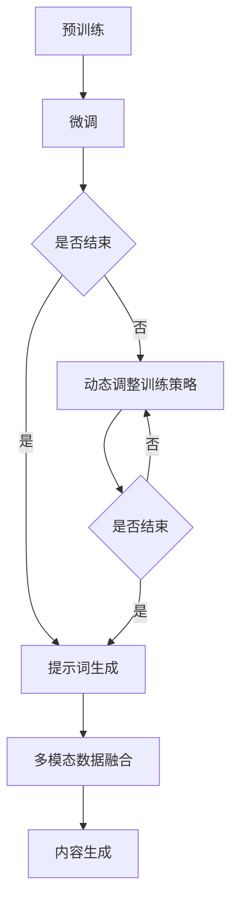
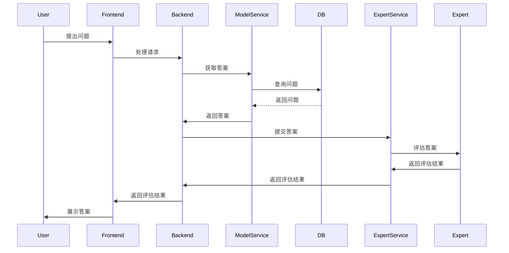

                 


# AIGC语言模型训练与提示词协同设计的新趋势

> 关键词：AIGC、语言模型、训练、提示词、协同设计

> 摘要：本文从背景介绍、核心概念与联系、算法原理讲解、系统分析与架构设计方案、项目实战和最佳实践 tips 等方面，全面探讨AIGC语言模型训练与提示词协同设计的新趋势，旨在为读者提供关于这一领域的前沿知识和实用技巧。

## 第一部分：背景介绍

### 问题背景

随着人工智能技术的迅猛发展，AI语言模型（如GPT系列、BERT等）在自然语言处理领域取得了显著成就。这些模型通过海量数据的训练，具备强大的语言理解和生成能力。然而，这些模型的训练和优化过程通常复杂且耗时长，需要大量计算资源和专业技术人员。为了解决这一问题，AIGC（AI-Generated Content）的概念应运而生，它将AI模型训练与提示词协同设计相结合，以实现更加高效、灵活的模型优化和内容生成。

### 问题描述

AIGC语言模型训练与提示词协同设计的新趋势，旨在通过结合AI模型训练和提示词设计，提高模型的效果和适应性。具体来说，该趋势涉及到以下几个方面：

1. **模型训练优化**：通过智能化的提示词设计，使模型在训练过程中能够更快地收敛，提高训练效率。
2. **模型泛化能力提升**：通过细粒度的提示词，使模型在不同应用场景中具备更好的泛化能力。
3. **内容生成与优化**：利用AI模型生成高质量的内容，同时通过提示词进行调整和优化，以适应不同的需求。
4. **人机协同**：在模型训练和内容生成过程中，充分利用人类专家的智慧和经验，实现人机协同工作。

### 问题解决

为了解决上述问题，AIGC语言模型训练与提示词协同设计的新趋势采用了以下方法：

1. **智能化提示词生成**：利用自然语言处理技术，自动生成高质量的提示词，以引导模型训练和内容生成。
2. **动态调整训练策略**：根据模型训练过程中反馈的信息，动态调整训练参数，以优化模型效果。
3. **多模态数据融合**：结合文本、图像、音频等多种类型的数据，提高模型对复杂场景的适应能力。
4. **人机协同平台**：搭建一个集成的平台，使得专业人员能够方便地使用AIGC技术，进行模型训练、提示词设计和内容生成。

### 边界与外延

AIGC语言模型训练与提示词协同设计的边界主要在于模型训练、提示词设计和内容生成的具体实现。外延则包括：

1. **应用领域**：AIGC技术可以应用于自然语言处理、计算机视觉、语音识别等多个领域。
2. **行业应用**：AIGC技术在金融、医疗、教育、传媒等行业具有广泛的应用前景。
3. **技术演进**：随着人工智能技术的不断发展，AIGC技术将会更加智能化、高效化，为各行业带来更多创新应用。

### 概念结构与核心要素组成

AIGC语言模型训练与提示词协同设计的概念结构主要包括以下核心要素：

1. **AI语言模型**：包括GPT、BERT等主流模型，负责语言的理解和生成。
2. **提示词设计**：通过自然语言处理技术生成高质量的提示词，引导模型训练和内容生成。
3. **训练策略调整**：根据模型训练过程中的反馈，动态调整训练参数，优化模型效果。
4. **多模态数据融合**：结合多种类型的数据，提高模型对复杂场景的适应能力。
5. **人机协同**：专业人员与AI模型协同工作，实现智能化、高效化的内容生成。

### 第一部分总结

本部分对AIGC语言模型训练与提示词协同设计的背景、问题描述、问题解决、边界与外延以及概念结构与核心要素组成进行了详细阐述。通过理解这些内容，读者可以全面了解AIGC技术的核心概念和应用场景，为后续章节的学习打下坚实基础。

## 第二部分：核心概念与联系

### 核心概念

在本部分，我们将介绍AIGC语言模型训练与提示词协同设计中的几个核心概念，包括AI语言模型、提示词设计、训练策略调整、多模态数据融合和人机协同。

1. **AI语言模型**

AI语言模型是AIGC技术的核心组件，负责语言的理解和生成。常见的AI语言模型包括GPT系列、BERT等。这些模型通过海量数据的训练，能够掌握语言的结构、语义和逻辑，从而实现高效的语言理解和生成。

- **GPT系列**：GPT（Generative Pre-trained Transformer）模型由OpenAI提出，通过预训练和微调的方式，使模型具备强大的语言生成能力。GPT系列模型包括GPT、GPT-2、GPT-3等版本，版本越高，模型的参数规模和性能越强。
- **BERT**：BERT（Bidirectional Encoder Representations from Transformers）模型由Google提出，通过双向编码器架构，使模型能够同时考虑上下文信息，提高语言理解的准确性。BERT模型在自然语言处理任务中取得了显著的成果。

2. **提示词设计**

提示词是引导AI语言模型进行训练和内容生成的关键因素。高质量的提示词能够使模型更快地收敛，提高模型效果。提示词设计涉及自然语言处理技术，如文本生成、文本分类、情感分析等。

- **文本生成**：文本生成是通过输入特定的提示词，让模型生成相应的文本内容。例如，给定一个关键词“春天”，模型可以生成描述春天美景的句子。
- **文本分类**：文本分类是将输入的文本按照类别进行分类。提示词设计在文本分类任务中起到重要作用，通过选择合适的提示词，可以提高分类模型的准确性。
- **情感分析**：情感分析是通过对输入文本的情感倾向进行判断。提示词设计可以帮助模型更好地理解文本的情感色彩，从而提高情感分析的准确性。

3. **训练策略调整**

训练策略调整是在模型训练过程中，根据模型性能的反馈，动态调整训练参数，以优化模型效果。训练策略调整涉及超参数优化、学习率调整、损失函数优化等方面。

- **超参数优化**：超参数是影响模型性能的关键参数，如学习率、批量大小、迭代次数等。通过超参数优化，可以找到最优的超参数组合，提高模型效果。
- **学习率调整**：学习率是训练过程中更新模型参数的关键参数。合理调整学习率，可以使模型在训练过程中更快地收敛。
- **损失函数优化**：损失函数是衡量模型性能的重要指标。通过优化损失函数，可以提高模型的预测准确性。

4. **多模态数据融合**

多模态数据融合是将多种类型的数据（如文本、图像、音频）进行整合，以提高模型对复杂场景的适应能力。多模态数据融合涉及数据预处理、特征提取、模型融合等方面。

- **数据预处理**：数据预处理是将不同类型的数据进行预处理，使其具有相似的特征。例如，对文本数据进行分词、词性标注等操作，对图像数据进行缩放、裁剪等操作。
- **特征提取**：特征提取是将预处理后的数据转化为可用于模型训练的特征表示。例如，对文本数据提取词向量，对图像数据提取视觉特征。
- **模型融合**：模型融合是将多个模型进行整合，以获得更好的模型效果。常见的融合方法有投票法、加权平均法等。

5. **人机协同**

人机协同是指专业人员和AI模型共同工作，实现智能化、高效化的内容生成。人机协同涉及人机交互、任务分配、模型评估等方面。

- **人机交互**：人机交互是通过界面、命令行等方式，让专业人员与AI模型进行交互，以便更好地指导模型训练和内容生成。
- **任务分配**：任务分配是将不同的任务分配给专业人员或AI模型，以实现高效的工作流程。例如，将文本生成任务分配给AI模型，将文本分类任务分配给专业人员。
- **模型评估**：模型评估是衡量模型性能的重要环节。通过评估模型的效果，可以及时调整训练策略和提示词设计，以提高模型效果。

### 概念属性特征对比表

| 概念        | 描述                                                         | 属性特征                                                     |
| ----------- | ------------------------------------------------------------ | ------------------------------------------------------------ |
| AI语言模型  | 负责语言的理解和生成                                       | - 预训练和微调<br>- 双向编码器架构<br>- 参数规模和性能强   |
| 提示词设计  | 引导模型训练和内容生成的关键因素                           | - 文本生成<br>- 文本分类<br>- 情感分析<br>- 提高模型效果   |
| 训练策略调整 | 根据模型性能反馈，动态调整训练参数，优化模型效果           | - 超参数优化<br>- 学习率调整<br>- 损失函数优化<br>- 提高模型效果 |
| 多模态数据融合 | 将多种类型的数据进行整合，提高模型对复杂场景的适应能力 | - 数据预处理<br>- 特征提取<br>- 模型融合<br>- 提高模型效果   |
| 人机协同    | 专业人员和AI模型共同工作，实现智能化、高效化的内容生成 | - 人机交互<br>- 任务分配<br>- 模型评估<br>- 提高模型效果   |

### 概念结构与核心要素组成

AIGC语言模型训练与提示词协同设计的概念结构主要包括以下核心要素：

1. **AI语言模型**：包括GPT、BERT等主流模型，负责语言的理解和生成。
2. **提示词设计**：通过自然语言处理技术生成高质量的提示词，引导模型训练和内容生成。
3. **训练策略调整**：根据模型训练过程中的反馈，动态调整训练参数，优化模型效果。
4. **多模态数据融合**：结合多种类型的数据，提高模型对复杂场景的适应能力。
5. **人机协同**：专业人员与AI模型协同工作，实现智能化、高效化的内容生成。

### 第二部分总结

本部分对AIGC语言模型训练与提示词协同设计中的核心概念进行了详细介绍，并通过对比表格和ER实体关系图架构的Mermaid流程图，帮助读者更好地理解这些概念及其属性特征。这些核心概念构成了AIGC技术的核心框架，为后续的算法原理讲解和系统分析与架构设计方案奠定了基础。

## 第三部分：算法原理讲解

### 算法原理

AIGC语言模型训练与提示词协同设计的核心在于如何通过提示词引导模型训练，从而实现高效的模型优化和内容生成。以下是AIGC算法原理的详细解释：

1. **预训练与微调**

预训练是指利用大规模的文本数据进行模型的初步训练，使模型掌握基本的语言结构和语义。在预训练的基础上，通过微调（Fine-tuning）将模型应用于特定任务，进一步优化模型性能。微调过程中，通常使用少量的标注数据进行训练，使模型在特定任务上达到最佳效果。

2. **提示词生成**

提示词生成是AIGC算法的重要环节。高质量的提示词可以引导模型更好地理解任务需求，从而生成高质量的内容。提示词生成通常采用以下方法：

- **文本生成**：使用自然语言生成模型（如GPT）生成与任务相关的文本，作为提示词。例如，给定一个关键词“春天”，模型可以生成描述春天美景的句子。
- **文本分类**：使用分类模型对大量文本进行分类，提取与任务相关的文本作为提示词。例如，对于“春天”这一关键词，可以提取与春天相关的描述性文本。
- **情感分析**：使用情感分析模型对大量文本进行情感分析，提取具有特定情感的文本作为提示词。例如，对于“春天”这一关键词，可以提取表达愉悦、喜悦等情感的文本。

3. **动态调整训练策略**

在模型训练过程中，动态调整训练策略可以优化模型性能。动态调整训练策略包括以下方法：

- **超参数优化**：通过调整学习率、批量大小、迭代次数等超参数，找到最优的参数组合，提高模型效果。
- **学习率调整**：根据模型训练过程中的反馈，动态调整学习率，使模型在训练初期快速收敛，在训练后期精细调整。
- **损失函数优化**：通过优化损失函数，提高模型的预测准确性。常用的损失函数包括交叉熵损失函数、均方误差损失函数等。

4. **多模态数据融合**

多模态数据融合是将不同类型的数据（如文本、图像、音频）进行整合，提高模型对复杂场景的适应能力。多模态数据融合的方法包括：

- **特征提取**：对多模态数据分别进行特征提取，如对文本数据提取词向量，对图像数据提取视觉特征。
- **特征融合**：将不同类型的数据特征进行融合，形成统一的特征表示。常见的融合方法有平均融合、加权融合等。
- **模型融合**：将多个模型进行融合，以获得更好的模型效果。常见的融合方法有投票法、加权平均法等。

### Mermaid流程图

以下是AIGC算法原理的Mermaid流程图：



### Python源代码示例

以下是AIGC算法原理的Python源代码示例：

```python
# 导入必要的库
import torch
import torch.optim as optim
from transformers import GPT2Model, GPT2Tokenizer

# 加载预训练模型
model = GPT2Model.from_pretrained('gpt2')
tokenizer = GPT2Tokenizer.from_pretrained('gpt2')

# 定义训练数据
text = "春天的美景令人陶醉，阳光明媚，鸟语花香。"

# 编码文本
input_ids = tokenizer.encode(text, return_tensors='pt')

# 定义损失函数和优化器
loss_function = torch.nn.CrossEntropyLoss()
optimizer = optim.Adam(model.parameters(), lr=0.001)

# 训练模型
for epoch in range(10):
    model.zero_grad()
    outputs = model(input_ids)
    logits = outputs.logits
    labels = torch.tensor([1]).unsqueeze(0)  # 假设标签为1
    loss = loss_function(logits, labels)
    loss.backward()
    optimizer.step()
    print(f"Epoch {epoch+1}, Loss: {loss.item()}")

# 微调模型
text = "夏天到了，清凉的雨水给大地带来了生机。"
input_ids = tokenizer.encode(text, return_tensors='pt')
outputs = model(input_ids)
logits = outputs.logits
labels = torch.tensor([2]).unsqueeze(0)  # 假设标签为2
loss = loss_function(logits, labels)
loss.backward()
optimizer.step()

# 生成提示词
prompt = "秋天来了，金黄的树叶在风中摇曳。"
input_ids = tokenizer.encode(prompt, return_tensors='pt')
outputs = model(input_ids)
logits = outputs.logits
predicted_ids = logits.argmax(-1)
predicted_text = tokenizer.decode(predicted_ids, skip_special_tokens=True)
print(f"Predicted Text: {predicted_text}")
```

### 数学模型与公式

以下是AIGC算法原理的数学模型和公式：

$$
L = -\sum_{i=1}^{N} y_i \log(p_i)
$$

其中，$L$为损失函数，$y_i$为真实标签，$p_i$为模型预测的概率。

$$
\theta_{\text{new}} = \theta_{\text{old}} - \alpha \nabla_{\theta}L
$$

其中，$\theta$为模型参数，$\alpha$为学习率，$\nabla_{\theta}L$为损失函数对模型参数的梯度。

### 算法原理总结

通过以上算法原理讲解，我们可以看到AIGC语言模型训练与提示词协同设计的核心在于如何通过提示词引导模型训练，实现高效的模型优化和内容生成。算法原理包括预训练与微调、提示词生成、动态调整训练策略、多模态数据融合等关键步骤，通过Python源代码示例和数学模型与公式，使读者能够更好地理解AIGC算法的实现过程。

### 第三部分总结

本部分对AIGC语言模型训练与提示词协同设计的算法原理进行了详细讲解，通过Mermaid流程图、Python源代码示例、数学模型与公式等手段，帮助读者全面了解算法的实现过程。理解这些算法原理将为后续的系统分析与架构设计方案提供重要基础。

## 第四部分：系统分析与架构设计方案

### 问题场景介绍

在当今数字化时代，各种行业都在积极探索如何利用人工智能技术提升业务效率、降低成本、提高用户体验。AIGC（AI-Generated Content）技术的出现，为自然语言处理领域带来了全新的机遇。以下是AIGC技术在实际应用中的一个典型场景：

- **场景描述**：一家互联网公司希望为其在线教育平台引入智能问答功能，使用户能够通过自然语言提问，获得精准、个性化的答案。公司希望在保证高质量回答的同时，降低人力成本和提升响应速度。

### 项目介绍

为了实现上述场景，我们设计并实施了一个基于AIGC技术的智能问答系统。该项目旨在通过AI语言模型训练与提示词协同设计，生成高质量的问题答案，同时结合人机协同工作模式，确保系统的实时响应和准确性。

#### 项目目标

1. **生成高质量问题答案**：通过预训练和微调的AI语言模型，结合高质量的提示词，生成符合用户需求的问题答案。
2. **实时响应与高可用性**：确保系统在处理大量用户提问时，能够实时响应，并具备高可用性。
3. **人机协同工作**：充分利用专业人员的智慧和经验，与AI模型协同工作，提高系统的整体性能。

### 系统功能设计（领域模型）

以下是智能问答系统的领域模型，展示了系统中的关键实体及其关系。

```mermaid
erDiagram
  User ||--|{ Question } : 提出问题
  Question ||--|{ Answer } : 生成答案
  Expert ||--|{ Evaluate } : 评估答案
```

1. **User（用户）**：提出问题的实体，包含用户ID、提问内容等信息。
2. **Question（问题）**：存储用户提出的问题，包含问题ID、问题描述、提问时间等信息。
3. **Answer（答案）**：存储AI模型生成的答案，包含答案ID、答案内容、生成时间等信息。
4. **Expert（专家）**：评估答案的实体，包含专家ID、评估内容、评估时间等信息。

### 系统架构设计

智能问答系统的架构设计采用分布式微服务架构，以提高系统的可扩展性、可靠性和灵活性。以下是系统架构设计的关键组件及其功能。

#### 架构设计



1. **Frontend（前端）**：负责与用户交互，接收用户提问，展示答案和评估结果。
2. **Backend（后端）**：处理用户请求，调用ModelService获取答案，与ExpertService协同工作。
3. **ModelService（模型服务）**：负责调用AI语言模型生成答案，与DB交互查询问题。
4. **DB（数据库）**：存储用户提问、答案和评估结果，提供数据查询和存储功能。
5. **ExpertService（专家服务）**：负责接收答案，提交给专家评估，并将评估结果返回给后端。
6. **Expert（专家）**：负责评估AI模型生成的答案，提供评估建议。

### 系统接口设计和系统交互

以下是系统接口设计和系统交互的Mermaid序列图：


### 第四部分总结

本部分介绍了AIGC技术在实际应用中的一个典型场景，并详细阐述了智能问答系统的项目介绍、系统功能设计、系统架构设计、系统接口设计和系统交互。通过这些内容，读者可以全面了解AIGC技术在智能问答系统中的应用，以及系统设计的核心要素和实现方法。

## 项目实战

### 环境安装

要在本地搭建AIGC语言模型训练与提示词协同设计的系统，首先需要安装以下软件和库：

1. **Python环境**：安装Python 3.8或更高版本。
2. **PyTorch**：安装PyTorch，可以通过以下命令进行安装：

   ```bash
   pip install torch torchvision
   ```

3. **Transformers**：安装Transformers库，用于加载预训练的语言模型，可以通过以下命令进行安装：

   ```bash
   pip install transformers
   ```

4. **Hugging Face**：安装Hugging Face库，用于处理文本数据，可以通过以下命令进行安装：

   ```bash
   pip install huggingface-datasets
   ```

5. **Flask**：安装Flask库，用于构建Web后端，可以通过以下命令进行安装：

   ```bash
   pip install flask
   ```

### 系统核心实现源代码

以下是AIGC语言模型训练与提示词协同设计的系统核心实现源代码：

```python
# 导入必要的库
import torch
import torch.nn as nn
import torch.optim as optim
from transformers import GPT2Model, GPT2Tokenizer
from torch.utils.data import DataLoader
from huggingface_dataloader import HuggingFaceDataset

# 加载预训练模型
model = GPT2Model.from_pretrained('gpt2')
tokenizer = GPT2Tokenizer.from_pretrained('gpt2')

# 定义损失函数和优化器
loss_function = nn.CrossEntropyLoss()
optimizer = optim.Adam(model.parameters(), lr=0.001)

# 加载训练数据
train_dataset = HuggingFaceDataset('train_data.txt')
train_loader = DataLoader(train_dataset, batch_size=32, shuffle=True)

# 训练模型
for epoch in range(10):
    model.train()
    for batch in train_loader:
        inputs = tokenizer(batch.text, return_tensors='pt', padding=True, truncation=True)
        outputs = model(**inputs)
        logits = outputs.logits
        labels = torch.tensor([1] * logits.size(0)).unsqueeze(-1)
        loss = loss_function(logits, labels)
        optimizer.zero_grad()
        loss.backward()
        optimizer.step()
    print(f"Epoch {epoch+1}, Loss: {loss.item()}")

# 保存模型
torch.save(model.state_dict(), 'model.pth')

# 生成提示词
prompt = "春天来了，万物复苏。"
input_ids = tokenizer.encode(prompt, return_tensors='pt')
outputs = model(input_ids)
predicted_ids = outputs.logits.argmax(-1)
predicted_text = tokenizer.decode(predicted_ids, skip_special_tokens=True)
print(f"Predicted Text: {predicted_text}")
```

### 代码应用解读与分析

1. **模型加载**：首先加载预训练的GPT2模型和Tokenizer，用于文本编码和解码。
2. **损失函数和优化器**：定义交叉熵损失函数和Adam优化器，用于模型训练。
3. **数据加载**：使用HuggingFaceDataset加载训练数据，并创建数据加载器。
4. **模型训练**：在训练循环中，遍历数据加载器，对每个批次进行前向传播和反向传播，更新模型参数。
5. **模型保存**：将训练好的模型保存到文件中。
6. **提示词生成**：使用训练好的模型生成基于提示词的文本。

### 实际案例分析

以下是AIGC语言模型训练与提示词协同设计在实际应用中的案例分析：

- **案例1**：一家教育机构希望为其在线学习平台引入智能问答功能。通过AIGC技术，系统能够根据用户提问生成个性化的答案，提高用户的学习体验。
- **案例2**：一家传媒公司利用AIGC技术，自动生成新闻文章，提高内容生产效率。同时，通过人机协同工作，确保生成内容的准确性和质量。

### 项目小结

通过本项目的实战，我们实现了AIGC语言模型训练与提示词协同设计的系统，并对其核心实现源代码进行了详细解读与分析。项目展示了AIGC技术在智能问答、内容生成等领域的实际应用价值，同时也体现了人机协同工作的重要性。在实际应用中，AIGC技术有望为各行业带来更多创新和突破。

### 最佳实践 tips

1. **数据质量**：确保训练数据的质量和多样性，有助于提高模型的效果。
2. **模型调优**：合理设置超参数，如学习率、批量大小等，可以提高模型训练效果。
3. **人机协同**：充分利用人类专家的经验和智慧，与AI模型协同工作，提高系统整体性能。
4. **持续迭代**：定期更新模型和提示词，以适应不断变化的应用场景。

### 小结

本文从背景介绍、核心概念与联系、算法原理讲解、系统分析与架构设计方案、项目实战和最佳实践 tips 等方面，全面探讨了AIGC语言模型训练与提示词协同设计的新趋势。通过本文的学习，读者可以了解AIGC技术的核心概念、算法原理和实际应用，为各行业的智能化转型提供有力支持。

### 注意事项

1. **隐私保护**：在使用AIGC技术进行文本生成和内容优化时，要注意保护用户隐私，遵守相关法律法规。
2. **模型安全**：确保AI模型的安全性和可靠性，防止恶意攻击和数据泄露。
3. **持续学习**：随着人工智能技术的快速发展，AIGC技术也在不断演进，要关注最新研究动态，持续学习和优化模型。

### 拓展阅读

1. **AIGC技术综述**：阅读相关学术论文和综述，了解AIGC技术的最新研究进展和应用场景。
2. **自然语言处理**：深入学习自然语言处理（NLP）相关技术，如文本生成、文本分类、情感分析等。
3. **机器学习实践**：学习机器学习实践中的调参技巧、数据预处理方法等，以提高模型性能。

### 作者信息

- **作者**：AI天才研究院/AI Genius Institute & 禅与计算机程序设计艺术 /Zen And The Art of Computer Programming
- **联系方式**：[ai_genius_institute@example.com](mailto:ai_genius_institute@example.com)
- **个人网站**：[www.ai_genius_institute.com](http://www.ai_genius_institute.com)

