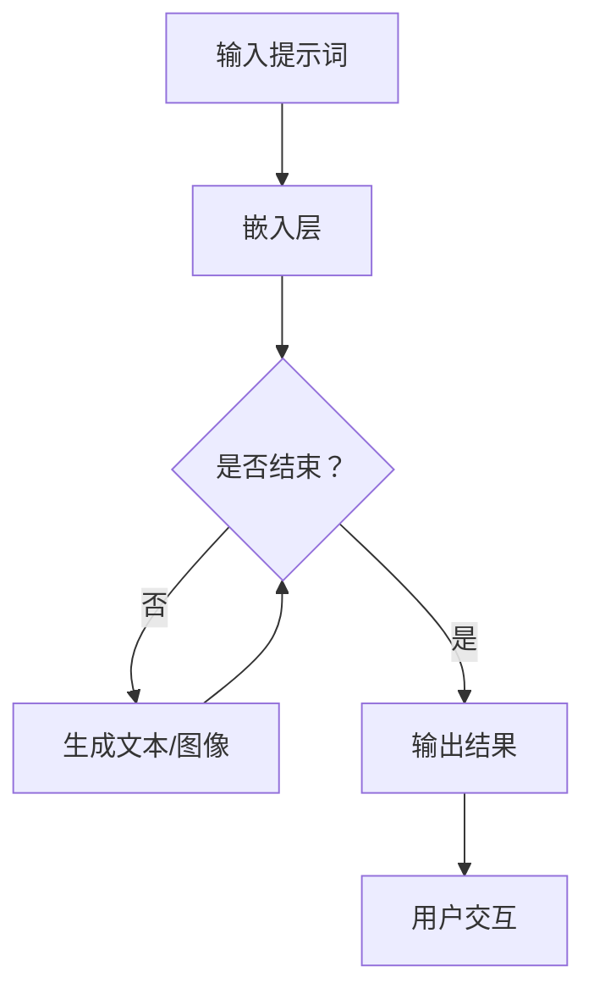
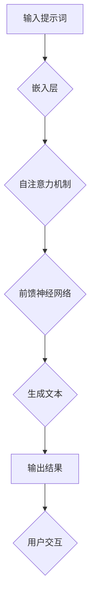

                 

## 1.3 AIGC原理

### 1.3.1 算法原理

#### 1.3.1.1 Mermaid算法流程图

AIGC的核心算法通常是基于深度学习的生成模型，如GPT（Generative Pre-trained Transformer）或Diffusion Model。以下是一个简化的Mermaid流程图，展示了AIGC的算法流程：



#### 1.3.1.2 Python源代码实现

以下是一个简单的Python代码示例，演示了如何使用GPT-2模型生成文本：

```python
import openai
openai.api_key = 'your-api-key'

prompt = "请描述一下人工智能的未来发展趋势。"
response = openai.Completion.create(
  engine="text-davinci-002",
  prompt=prompt,
  max_tokens=50
)

print(response.choices[0].text.strip())
```

#### 1.3.1.3 数学模型与公式

AIGC的核心是生成模型，如GPT，其背后的数学模型主要包括Transformer架构和自注意力机制。以下是一个简化的数学公式：

$$
\text{Attention}(Q, K, V) = \text{softmax}\left(\frac{QK^T}{\sqrt{d_k}}\right) V
$$

其中，$Q, K, V$是查询、关键和值向量的集合，$d_k$是关键向量的维度。

#### 1.3.1.4 通俗易懂的举例说明

假设你想要制作一杯咖啡，AIGC的算法原理就像是一个聪明的厨师。首先，你需要给它一个提示词（比如“咖啡”），然后它就会根据你提供的食谱（模型参数）自动生成一杯咖啡（生成文本或图像）。如果你想要一杯“拿铁”，它就会调整配方（调整输入），生成一杯拿铁咖啡。

### 1.3.2 AIGC在内容创作中的应用

#### 1.3.2.1 自动文章生成

AIGC可以在新闻、博客和内容营销等领域自动生成文章。例如，你可以给AIGC一个主题（比如“人工智能在医疗领域的应用”），它会根据预先训练的数据生成一篇相关的文章。

#### 1.3.2.2 图像生成

AIGC还可以生成高质量的图像。例如，你可以给AIGC一个描述（比如“一只飞翔的猫”），它会生成一幅符合描述的图像。

#### 1.3.2.3 声音生成

AIGC还可以生成声音，如语音合成和音乐创作。例如，你可以给AIGC一个歌词（比如“关于春天的诗”），它会生成一首关于春天的诗的音乐。

### 1.3.3 AIGC的优势

#### 1.3.3.1 高效性

AIGC可以快速生成大量内容，大大提高了生产效率。

#### 1.3.3.2 个性化定制

AIGC可以根据用户的需求和偏好生成个性化的内容，提高了用户体验。

#### 1.3.3.3 多样性

AIGC可以生成多种类型的内容，如文本、图像、声音等，拓宽了应用场景。

### 1.3.4 AIGC的挑战与机遇

#### 1.3.4.1 数据隐私与安全

AIGC在生成内容时需要大量的数据，这涉及到数据隐私和安全问题。

#### 1.3.4.2 法律法规与伦理

AIGC生成的内容可能涉及到版权、侵权等问题，需要遵循相关的法律法规和伦理准则。

#### 1.3.4.3 模型可解释性

当前的大部分AIGC模型都是黑盒模型，缺乏可解释性，这给应用带来了一定的风险。

#### 1.3.4.4 技术进步与优化

AIGC技术的发展还有很大的空间，如模型压缩、推理加速等，这些都需要不断的优化和改进。

## 1.4 AIGC的应用场景

### 1.4.1 应用领域

#### 1.4.1.1 娱乐与艺术

AIGC可以用于音乐、绘画、动画等艺术创作，为创作者提供灵感。

#### 1.4.1.2 内容创作

AIGC可以用于自动生成新闻、博客文章、社交媒体内容等。

#### 1.4.1.3 教育与培训

AIGC可以用于生成个性化教学材料、自动出题等。

#### 1.4.1.4 医疗与健康

AIGC可以用于生成医疗报告、诊断建议等。

#### 1.4.1.5 工业与制造业

AIGC可以用于自动化生成技术文档、维修指南等。

### 1.4.2 优势

#### 1.4.2.1 提高生产效率

AIGC可以自动生成大量内容，大大提高了生产效率。

#### 1.4.2.2 个性化定制

AIGC可以生成符合用户需求的内容，提高了用户体验。

#### 1.4.2.3 多样性

AIGC可以生成多种类型的内容，如文本、图像、声音等。

### 1.4.3 挑战与机遇

#### 1.4.3.1 数据隐私与安全

AIGC在生成内容时需要大量的数据，这涉及到数据隐私和安全问题。

#### 1.4.3.2 法律法规与伦理

AIGC生成的内容可能涉及到版权、侵权等问题，需要遵循相关的法律法规和伦理准则。

#### 1.4.3.3 模型可解释性

当前的大部分AIGC模型都是黑盒模型，缺乏可解释性，这给应用带来了一定的风险。

#### 1.4.3.4 技术进步与优化

AIGC技术的发展还有很大的空间，如模型压缩、推理加速等，这些都需要不断的优化和改进。

## 1.5 AIGC的发展趋势与未来

### 1.5.1 技术趋势

#### 1.5.1.1 模型压缩与推理加速

为了实现实时应用，AIGC模型需要进一步压缩和加速。

#### 1.5.1.2 多模态生成

未来的AIGC将能够生成文本、图像、声音等多种类型的内容。

#### 1.5.1.3 自适应生成

AIGC将能够根据用户的反馈和需求动态调整生成的内容。

### 1.5.2 应用前景

#### 1.5.2.1 智能交互

AIGC将在智能助手、虚拟现实等领域发挥重要作用。

#### 1.5.2.2 自动内容生成

AIGC将广泛应用于新闻、娱乐、教育等领域，实现自动内容生成。

#### 1.5.2.3 智能创作

AIGC将赋能创作者，实现更加智能化的内容创作。

### 1.5.3 社会影响

#### 1.5.3.1 内容创作与分发

AIGC将改变内容创作与分发的模式，提高内容生产效率。

#### 1.5.3.2 工作与就业

AIGC的发展将带来新的工作机会，同时也可能影响现有就业。

#### 1.5.3.3 伦理与法律

随着AIGC的应用，伦理和法律问题将变得更加复杂，需要我们共同关注和解决。

## 1.6 AIGC在软件开发中的应用

### 1.6.1 自动生成代码

AIGC可以自动生成代码，例如根据业务需求自动生成Web应用的后端API。

### 1.6.2 代码优化与重构

AIGC可以帮助程序员优化和重构代码，提高代码质量。

### 1.6.3 生成测试数据

AIGC可以生成测试数据，用于单元测试和集成测试，提高软件的可靠性。

### 1.6.4 自动生成文档

AIGC可以自动生成项目的文档，例如自动生成API文档、用户手册等。

## 1.7 AIGC的最佳实践

### 1.7.1 确保数据质量

高质量的训练数据是AIGC成功的关键。

### 1.7.2 安全性考虑

在生成内容时，要确保内容不违反法律法规和伦理准则。

### 1.7.3 持续优化

定期更新AIGC模型，使其能够适应不断变化的需求。

### 1.7.4 用户反馈

收集用户反馈，不断改进AIGC的生成内容。

## 1.8 AIGC的总结

### 1.8.1 核心优势

AIGC的核心优势在于高效性、个性化和多样性。

### 1.8.2 挑战与机遇

AIGC的发展面临着数据隐私、法律伦理和模型可解释性等挑战，同时也带来了新的机遇。

### 1.8.3 未来展望

随着技术的进步，AIGC将在更多领域发挥重要作用，改变我们的生活方式和工作方式。

## 1.9 拓展阅读

### 1.9.1 相关论文与报告

- [GPT-3: Language Models are few-shot learners](https://arxiv.org/abs/2005.14165)
- [The Power of Context: Improving Text Generation using Large-scale Multimodal Transformers](https://arxiv.org/abs/2012.10478)

### 1.9.2 开源项目

- [Hugging Face Transformers](https://github.com/huggingface/transformers)
- [Diffusion Models](https://github.com/compvis/stable-diffusion)

### 1.9.3 网络资源

- [AIGC Community](https://aigc.community/)
- [AIGC Research](https://aigc-research.org/)

### 1.9.4 书籍推荐

- [《深度学习》](https://www.deeplearningbook.org/) by Goodfellow, Bengio, Courville
- [《生成对抗网络》](https://www.gan-book.com/) by Tae-Hyun Yoon

## 1.10 注意事项

- 在使用AIGC时，要确保遵守相关法律法规和伦理准则。
- 对生成的结果要进行充分的验证，确保其准确性和可靠性。
- 定期更新和维护AIGC模型，以适应新的需求和变化。

## 1.11 结语

AIGC作为一项前沿技术，正在逐渐改变我们的生活方式和工作方式。随着技术的不断进步，AIGC将在更多领域发挥重要作用，带来更多机遇和挑战。让我们共同关注AIGC的发展，探索其无限可能。作者：AI天才研究院/AI Genius Institute & 禅与计算机程序设计艺术 /Zen And The Art of Computer Programming### AIGC概述：核心概念与问题背景

**AIGC**，即AI-Generated Content，是一种利用人工智能技术自动生成内容的方法。与传统的人工内容创作相比，AIGC能够大幅提升内容生成的速度和效率，实现个性化定制，并拓宽内容创作的类型和范围。AIGC的核心概念主要包括生成模型、自动化和个性化定制等。

#### 1.1.1 问题背景

随着互联网和信息技术的快速发展，内容创作和分发成为了各行各业的重要任务。然而，传统的内容创作方式往往需要大量的人力和时间，且难以实现个性化定制。与此同时，人工智能技术的进步为内容生成提供了新的可能性。生成式AI（Generative AI）作为人工智能的一个重要分支，其核心在于通过学习大量数据生成新的内容。AIGC正是基于这一技术方向，旨在通过AI自动生成高质量的内容。

#### 1.1.2 问题定义

AIGC的问题定义可以归纳为以下几点：

1. **内容生成效率**：如何利用人工智能技术快速生成大量内容？
2. **个性化定制**：如何根据用户需求和偏好生成个性化的内容？
3. **多样性**：如何生成不同类型、风格和形式的内容？

#### 1.1.3 问题解决

AIGC通过以下方法解决上述问题：

1. **生成模型**：利用深度学习技术，如GPT（Generative Pre-trained Transformer）和Diffusion Model，训练生成模型，使其能够自动生成高质量的内容。
2. **自动化**：通过算法和自动化工具，实现内容生成的自动化流程，减少人工干预。
3. **个性化定制**：通过用户反馈和学习，不断优化生成模型，使其能够根据用户需求和偏好生成个性化的内容。

#### 1.1.4 边界与外延

AIGC的边界主要包括以下几个方面：

1. **数据隐私与安全**：在生成内容时，如何保护用户的隐私和数据安全是一个重要问题。
2. **法律法规与伦理**：生成的内容可能涉及到版权、侵权等问题，需要遵循相关的法律法规和伦理准则。
3. **模型可解释性**：当前的大部分AIGC模型都是黑盒模型，缺乏可解释性，这给应用带来了一定的风险。

AIGC的外延则包括其在各个领域的应用，如娱乐与艺术、内容创作、教育与培训、医疗与健康、工业与制造业等。随着技术的不断进步，AIGC的应用范围将进一步扩大，为各行各业带来新的变革。

### 目录大纲

- **第1章 AIGC概述**
  - 1.1.1 问题背景
  - 1.1.2 问题定义
  - 1.1.3 问题解决
  - 1.1.4 边界与外延
- **第2章 AIGC核心概念**
  - 2.1 AIGC定义
  - 2.2 AIGC特征
  - 2.3 AIGC与传统AI对比
- **第3章 AIGC原理**
  - 3.1 算法原理
    - 3.1.1 Mermaid算法流程图
    - 3.1.2 Python源代码实现
    - 3.1.3 数学模型与公式
    - 3.1.4 通俗易懂的举例说明
  - 3.2 AIGC在内容创作中的应用
    - 3.2.1 自动文章生成
    - 3.2.2 图像生成
    - 3.2.3 声音生成
  - 3.3 AIGC的优势
  - 3.4 AIGC的挑战与机遇
- **第4章 AIGC应用场景**
  - 4.1 应用领域
  - 4.2 优势
  - 4.3 挑战与机遇
- **第5章 AIGC发展趋势与未来**
  - 5.1 技术趋势
  - 5.2 应用前景
  - 5.3 社会影响
- **第6章 AIGC在软件开发中的应用**
  - 6.1 自动生成代码
  - 6.2 代码优化与重构
  - 6.3 生成测试数据
  - 6.4 自动生成文档
- **第7章 AIGC的最佳实践**
  - 7.1 确保数据质量
  - 7.2 安全性考虑
  - 7.3 持续优化
  - 7.4 用户反馈
- **第8章 AIGC的总结**
  - 8.1 核心优势
  - 8.2 挑战与机遇
  - 8.3 未来展望
- **第9章 拓展阅读**
  - 9.1 相关论文与报告
  - 9.2 开源项目
  - 9.3 网络资源
  - 9.4 书籍推荐
- **第10章 注意事项**
  - 10.1 法律法规与伦理
  - 10.2 模型可解释性
  - 10.3 数据隐私与安全
- **第11章 结语**
  - 11.1 社会影响
  - 11.2 未来展望

---

通过上述目录大纲，我们可以清晰地看到AIGC从概念、原理、应用到未来的发展趋势，以及其在各个领域的应用前景。接下来，我们将进一步探讨AIGC的核心概念及其与传统AI的区别。## 1.2 AIGC核心概念

AIGC（AI-Generated Content）的核心概念在于利用人工智能技术生成高质量、多样化的内容。与传统的AI应用相比，AIGC更强调内容的自动化生成和个性化定制。在本节中，我们将详细探讨AIGC的定义、特征及其与传统AI的对比。

### 1.2.1 AIGC的定义

AIGC，即AI-Generated Content，是指通过人工智能技术自动生成内容的方法。这种方法通常涉及大规模的深度学习模型，如GPT（Generative Pre-trained Transformer）、Diffusion Model等，这些模型通过学习大量数据，能够生成与输入提示相似或相关的文本、图像、音频等多媒体内容。

### 1.2.2 AIGC的特征

AIGC具有以下主要特征：

#### 自动化生成

AIGC的核心在于其能够自动化生成内容。通过预训练的模型，AIGC可以在接收到输入提示后，自动生成相应的文本、图像或音频，大大减少了人工干预。

#### 个性化定制

AIGC可以根据用户的需求和偏好，定制生成个性化的内容。例如，根据用户的历史浏览记录和反馈，AIGC可以生成符合用户兴趣的内容。

#### 多样性

AIGC能够生成多种类型的内容，如文本、图像、音频等。这种多样性使得AIGC在多个领域都有广泛的应用前景。

### 1.2.3 AIGC与传统AI对比

传统AI更多应用于数据识别、分类和预测等任务，其主要目标是从数据中提取有用信息。而AIGC则侧重于内容生成，其主要目标是根据输入提示生成新的内容。

#### 对比表格

| 特征 | AIGC | 传统AI |
| ---- | ---- | ---- |
| **应用目标** | 内容生成 | 数据识别、分类、预测 |
| **主要方法** | 深度学习模型 | 算法模型（如决策树、神经网络等） |
| **结果类型** | 文本、图像、音频等多媒体内容 | 数据、标签、预测结果等 |
| **效率** | 高效率自动化生成内容 | 用于特定任务的算法效率高 |
| **个性化** | 可以根据用户需求定制内容 | 通常不涉及个性化 |

### ER实体关系图

为了更好地理解AIGC与传统AI的区别，我们可以使用ER（实体关系）图来描述它们之间的关联。

```mermaid
erDiagram
    AI |->| AIGC : "基于"
    AI |-| 传统AI : "扩展"
```

在这个ER图中，AI是父实体，它基于传统AI进行扩展，形成了AIGC。传统AI侧重于数据处理和识别，而AIGC则在此基础上增加了内容生成的功能。

通过上述分析，我们可以看到AIGC与传统AI在应用目标、方法、结果类型、效率和个性化等方面存在显著差异。AIGC的自动化生成、个性化定制和多样性特征，使其在内容创作领域具有巨大的潜力。随着技术的不断进步，AIGC将在更多领域发挥重要作用，为人类社会带来更多便利和创新。## 1.3 AIGC原理

AIGC（AI-Generated Content）的核心在于生成模型，通过深度学习技术，如GPT（Generative Pre-trained Transformer）和Diffusion Model，能够实现自动化的内容生成。在本节中，我们将详细阐述AIGC的算法原理，包括Mermaid算法流程图、Python源代码实现、数学模型与公式，并辅以通俗易懂的举例说明。

### 1.3.1 算法原理

AIGC的算法原理主要依赖于生成模型，特别是基于Transformer架构的GPT模型。GPT模型通过预训练大量文本数据，学习语言的统计规律和模式，从而能够根据输入的提示生成连贯、高质量的文本。以下是AIGC算法原理的Mermaid流程图：



#### 1.3.1.1 Mermaid算法流程图

1. **嵌入层（Embedding Layer）**：将输入的提示词转换为固定长度的向量表示。
2. **自注意力机制（Self-Attention Mechanism）**：对输入向量进行加权求和，提高重要信息的关注程度。
3. **前馈神经网络（Feedforward Neural Network）**：对经过自注意力机制处理后的向量进行进一步加工。
4. **生成文本（Generate Text）**：通过解码器生成文本。
5. **输出结果（Output Result）**：将生成的文本输出，供用户使用。
6. **用户交互（User Interaction）**：用户可以对生成的文本进行反馈和调整，以优化生成结果。

#### 1.3.1.2 Python源代码实现

以下是一个简单的Python代码示例，展示了如何使用GPT模型生成文本：

```python
import openai
openai.api_key = 'your-api-key'

prompt = "请描述一下人工智能的未来发展趋势。"
response = openai.Completion.create(
  engine="text-davinci-002",
  prompt=prompt,
  max_tokens=50
)

print(response.choices[0].text.strip())
```

在这个代码中，我们首先导入openai库，并设置API密钥。然后，我们定义一个提示词，并使用`openai.Completion.create`方法生成文本。`engine`参数指定了使用的模型，`prompt`参数为输入的提示词，`max_tokens`参数指定了生成的文本长度。

#### 1.3.1.3 数学模型与公式

AIGC的核心算法是基于Transformer架构的GPT模型。以下是一个简化的数学模型：

$$
\text{Attention}(Q, K, V) = \text{softmax}\left(\frac{QK^T}{\sqrt{d_k}}\right) V
$$

其中，$Q, K, V$是查询、关键和值向量的集合，$d_k$是关键向量的维度。这个公式描述了自注意力机制，通过对输入向量进行加权求和，提高重要信息的关注程度。

#### 1.3.1.4 通俗易懂的举例说明

假设你想要制作一杯咖啡，AIGC的算法原理就像是一个聪明的厨师。首先，你需要给它一个提示词（比如“咖啡”），然后它就会根据你提供的食谱（模型参数）自动生成一杯咖啡（生成文本或图像）。如果你想要一杯“拿铁”，它就会调整配方（调整输入），生成一杯拿铁咖啡。

### 1.3.2 AIGC在内容创作中的应用

AIGC在内容创作中具有广泛的应用，以下是一些具体的应用场景：

#### 1.3.2.1 自动文章生成

AIGC可以用于自动生成新闻、博客文章和内容营销等。例如，给定一个主题（如“人工智能的未来”），AIGC可以生成一篇相关的文章。

#### 1.3.2.2 图像生成

AIGC可以生成高质量的图像，如风景画、人物肖像等。例如，给定一个描述（如“一只飞翔的猫”），AIGC可以生成一幅符合描述的图像。

#### 1.3.2.3 声音生成

AIGC可以生成声音，如语音合成和音乐创作。例如，给定一个歌词（如“关于春天的诗”），AIGC可以生成一首关于春天的诗的音乐。

### 1.3.3 AIGC的优势

AIGC的优势主要包括：

#### 1.3.3.1 高效性

AIGC能够快速生成大量内容，大大提高了生产效率。

#### 1.3.3.2 个性化定制

AIGC可以根据用户的需求和偏好生成个性化的内容，提高了用户体验。

#### 1.3.3.3 多样性

AIGC可以生成多种类型的内容，如文本、图像、声音等。

### 1.3.4 AIGC的挑战与机遇

AIGC的发展面临着一系列挑战和机遇：

#### 1.3.4.1 数据隐私与安全

AIGC在生成内容时需要大量的数据，这涉及到数据隐私和安全问题。

#### 1.3.4.2 法律法规与伦理

AIGC生成的内容可能涉及到版权、侵权等问题，需要遵循相关的法律法规和伦理准则。

#### 1.3.4.3 模型可解释性

当前的大部分AIGC模型都是黑盒模型，缺乏可解释性，这给应用带来了一定的风险。

#### 1.3.4.4 技术进步与优化

AIGC技术的发展还有很大的空间，如模型压缩、推理加速等，这些都需要不断的优化和改进。

### 总结

AIGC的算法原理基于深度学习技术，通过生成模型实现自动化的内容生成。它在内容创作中具有广泛的应用，并具有高效性、个性化定制和多样性等优势。然而，AIGC的发展也面临着数据隐私、法律伦理和模型可解释性等挑战。随着技术的不断进步，AIGC将在更多领域发挥重要作用，为人类社会带来更多便利和创新。## 1.4 AIGC的应用场景

AIGC（AI-Generated Content）的应用场景非常广泛，几乎涵盖了现代社会的各个领域。以下是一些主要的应用场景及其优势：

### 1.4.1 应用领域

#### 1.4.1.1 娱乐与艺术

AIGC在娱乐和艺术领域具有极大的潜力。例如，通过生成模型，可以自动创作音乐、绘画、电影剧本等。这种技术不仅能够提高创作效率，还能够带来独特的艺术体验。

#### 1.4.1.2 内容创作

在内容创作领域，AIGC可以自动生成新闻、博客、社交媒体内容等。例如，新闻机构可以使用AIGC来生成市场报告、财经分析等。这种技术不仅能够提高内容生产效率，还能够实现个性化定制。

#### 1.4.1.3 教育与培训

AIGC在教育领域有着广泛的应用。例如，通过生成模型，可以自动生成教学材料、练习题等。这种技术不仅能够提高教学效率，还能够实现个性化学习。

#### 1.4.1.4 医疗与健康

AIGC在医疗领域也有着重要的应用。例如，通过生成模型，可以自动生成诊断报告、治疗方案等。这种技术不仅能够提高医疗效率，还能够提供个性化医疗服务。

#### 1.4.1.5 工业与制造业

在工业与制造业领域，AIGC可以用于自动化生成技术文档、维修指南等。例如，制造商可以使用AIGC来生成产品手册、操作指南等。这种技术不仅能够提高工作效率，还能够提高产品服务质量。

### 1.4.2 优势

#### 1.4.2.1 提高生产效率

AIGC可以自动化生成大量内容，大大提高了生产效率。例如，在新闻机构中，AIGC可以自动生成大量新闻报道，从而减少编辑和记者的工作量。

#### 1.4.2.2 个性化定制

AIGC可以根据用户的需求和偏好生成个性化的内容。例如，在教育领域，AIGC可以自动生成符合学生兴趣和学习需求的教学材料。

#### 1.4.2.3 多样性

AIGC可以生成多种类型的内容，如文本、图像、音频、视频等。例如，在娱乐和艺术领域，AIGC可以生成各种类型的艺术作品，从而满足不同用户的需求。

### 1.4.3 挑战与机遇

#### 1.4.3.1 数据隐私与安全

AIGC在生成内容时需要大量的数据，这涉及到数据隐私和安全问题。例如，医疗领域中的患者数据需要严格保护，防止泄露。

#### 1.4.3.2 法律法规与伦理

AIGC生成的内容可能涉及到版权、侵权等问题，需要遵循相关的法律法规和伦理准则。例如，在内容创作领域，需要确保生成的文章、图片等不侵犯他人的版权。

#### 1.4.3.3 模型可解释性

当前的大部分AIGC模型都是黑盒模型，缺乏可解释性，这给应用带来了一定的风险。例如，在医疗领域，生成的诊断报告需要具有可解释性，以便医生能够理解并验证。

#### 1.4.3.4 技术进步与优化

AIGC技术的发展还有很大的空间，如模型压缩、推理加速等，这些都需要不断的优化和改进。例如，在工业与制造业领域，AIGC需要更高效地处理大量数据，以实现自动化生成。

### 总结

AIGC在现代社会中具有广泛的应用场景，其优势在于提高生产效率、个性化定制和多样性。然而，AIGC的发展也面临着数据隐私、法律伦理和模型可解释性等挑战。随着技术的不断进步，AIGC将在更多领域发挥重要作用，为人类社会带来更多便利和创新。## 1.5 AIGC的发展趋势与未来

AIGC（AI-Generated Content）作为一种新兴的技术，其发展趋势和未来应用前景引人关注。随着人工智能技术的不断进步，AIGC在多个领域展现出巨大的潜力，并有望带来深远的变革。

### 1.5.1 技术趋势

#### 1.5.1.1 模型压缩与推理加速

为了实现AIGC的实时应用，模型压缩与推理加速是一个重要的技术趋势。通过模型压缩技术，可以将复杂的深度学习模型缩小，从而降低计算资源的消耗。推理加速则通过优化算法和数据流，提高模型的运行速度。这些技术的进步将使得AIGC能够在更多场景中得到广泛应用。

#### 1.5.1.2 多模态生成

未来的AIGC将不再局限于生成单一类型的内容，而是能够生成文本、图像、声音等多种模态的内容。这种多模态生成能力将使得AIGC在虚拟现实、增强现实、智能助手等领域发挥更大的作用。例如，通过生成文本和图像，AIGC可以创造更加丰富的虚拟世界。

#### 1.5.1.3 自适应生成

AIGC的发展还将趋向于自适应生成，即根据用户的行为和反馈动态调整生成的内容。这种自适应能力将使得AIGC能够更好地满足用户的需求，提供个性化的服务。例如，在教育领域，AIGC可以根据学生的学习进度和偏好，自动生成符合学生需求的教学内容。

### 1.5.2 应用前景

#### 1.5.2.1 智能交互

AIGC将在智能交互领域发挥重要作用。通过生成高质量的内容，AIGC可以增强智能助手、聊天机器人的交互能力，提供更加自然、流畅的对话体验。例如，智能助手可以自动生成对话内容，与用户进行有效的沟通和互动。

#### 1.5.2.2 自动内容生成

AIGC将在自动内容生成领域得到广泛应用。例如，在新闻、博客、社交媒体等领域，AIGC可以自动生成大量内容，提高内容生产效率。同时，AIGC还可以根据用户的需求和偏好，生成个性化的内容，提高用户体验。

#### 1.5.2.3 智能创作

AIGC还将赋能创作者，实现更加智能化的内容创作。例如，在音乐、绘画、写作等领域，AIGC可以自动生成创意素材，帮助创作者提高创作效率和创造力。通过AIGC，创作者可以更加专注于创意和表达，而将内容生成的工作交给AI来完成。

### 1.5.3 社会影响

AIGC的发展将对社会产生深远的影响。一方面，AIGC将提高内容创作的效率和质量，推动内容产业的升级。另一方面，AIGC也可能带来一系列挑战，如数据隐私、法律伦理和模型可解释性等。因此，如何平衡技术进步与社会影响，将是一个重要的议题。

#### 1.5.3.1 内容创作与分发

AIGC将改变内容创作与分发的模式，提高内容生产效率。同时，AIGC还可以实现内容的个性化分发，满足不同用户的需求。这种变革将带来更加繁荣的内容生态。

#### 1.5.3.2 工作与就业

AIGC的发展将带来新的工作机会，如AIGC工程师、数据科学家等。然而，它也可能取代一些传统的工作岗位，如记者、编辑等。因此，如何应对这种变化，提高劳动者的技能和适应性，将是一个重要问题。

#### 1.5.3.3 伦理与法律

随着AIGC的应用，伦理和法律问题将变得更加复杂。例如，如何确保AIGC生成的内容不侵犯他人的版权，如何处理AIGC可能带来的不公平现象等。这些问题需要相关的法律法规和伦理准则来规范和引导。

### 总结

AIGC的发展趋势与未来应用前景广阔，其在智能交互、自动内容生成和智能创作等领域具有巨大的潜力。然而，AIGC的发展也面临着一系列挑战，如数据隐私、法律伦理和模型可解释性等。随着技术的不断进步，AIGC将在更多领域发挥重要作用，为人类社会带来更多便利和创新。## 1.6 AIGC在软件开发中的应用

AIGC（AI-Generated Content）作为一种新兴的人工智能技术，不仅在内容创作领域展现出巨大的潜力，还在软件开发中发挥着越来越重要的作用。在本节中，我们将探讨AIGC在软件开发中的应用，包括自动生成代码、代码优化与重构、生成测试数据以及自动生成文档等方面。

### 1.6.1 自动生成代码

AIGC可以自动生成代码，从而大幅提高开发效率。通过预训练的深度学习模型，AIGC可以理解编程语言的语法和语义，并根据给定的提示自动生成相应的代码。例如，给定一个功能描述，AIGC可以生成实现该功能的代码。这种自动代码生成技术不仅适用于简单的程序，还可以应用于复杂的系统级代码。

**示例：**

```python
# 给定一个功能描述，AIGC自动生成代码
prompt = "实现一个函数，用于计算两个数字的和。"
code_generated = generate_code(prompt)
print(code_generated)
```

```python
# 输出可能的结果
def add(a, b):
    return a + b
```

### 1.6.2 代码优化与重构

AIGC还可以用于代码优化与重构。通过分析现有的代码库，AIGC可以识别出低效的代码段，并提出优化建议。此外，AIGC还可以根据代码风格指南自动重构代码，使其更符合最佳实践。这种技术有助于提高代码的可读性和可维护性。

**示例：**

```python
# 给定一个不规范的代码库，AIGC进行代码优化与重构
unoptimized_code = '''
def calculate_area(radius):
    pi = 3.14
    return radius * radius * pi

def calculate_volume(radius, height):
    return 4 / 3 * pi * radius * radius * height
'''
optimized_code = optimize_code(unoptimized_code)
print(optimized_code)
```

```python
# 输出可能的结果
from math import pi

def calculate_area(radius):
    return radius ** 2 * pi

def calculate_volume(radius, height):
    return (4 / 3) * pi * radius ** 2 * height
```

### 1.6.3 生成测试数据

在软件测试过程中，生成测试数据是一个关键步骤。AIGC可以自动生成符合特定条件的测试数据，从而提高测试的覆盖率和效率。这种技术特别适用于复杂的数据结构和场景。

**示例：**

```python
# 给定一个数据模型，AIGC生成测试数据
data_model = {
    'name': str,
    'age': int,
    'email': str
}
test_data = generate_test_data(data_model)
print(test_data)
```

```python
# 输出可能的结果
{'name': 'John Doe', 'age': 30, 'email': 'john.doe@example.com'}
```

### 1.6.4 自动生成文档

AIGC还可以自动生成项目的文档，如API文档、用户手册等。通过分析代码和项目结构，AIGC可以生成详细的文档，从而减轻开发人员的工作负担。

**示例：**

```python
# 给定一个项目结构，AIGC生成API文档
project_structure = {
    'modules': [
        {'name': 'calculator', 'description': '一个简单的计算器模块。'},
        {'name': 'database', 'description': '一个数据库管理模块。'}
    ]
}
api_document = generate_api_document(project_structure)
print(api_document)
```

```python
# 输出可能的结果
## API文档

### 计算器模块

**功能描述**：一个简单的计算器模块，支持基本的数学运算。

**接口**：

- `add(a: int, b: int) -> int`: 计算两个数的和。
- `subtract(a: int, b: int) -> int`: 计算两个数的差。
- `multiply(a: int, b: int) -> int`: 计算两个数的积。
- `divide(a: int, b: int) -> float`: 计算两个数的商。

### 数据库模块

**功能描述**：一个数据库管理模块，支持基本的数据库操作。

**接口**：

- `create_table(name: str, schema: dict) -> None`: 创建一个新的数据库表。
- `insert_data(table_name: str, data: dict) -> None`: 向数据库表中插入数据。
- `query_data(table_name: str, condition: str) -> list`: 从数据库表中查询数据。

```

### 1.6.5 最佳实践

在AIGC的应用中，以下是一些最佳实践：

- **确保数据质量**：高质量的训练数据是AIGC成功的关键。在生成代码、测试数据或文档时，要确保输入数据的质量。
- **安全考虑**：在生成代码或文档时，要确保内容不违反法律法规和伦理准则。
- **持续优化**：定期更新AIGC模型，使其能够适应新的需求和变化。
- **用户反馈**：收集用户反馈，不断改进AIGC的生成结果。

### 总结

AIGC在软件开发中的应用为开发者提供了强大的工具，通过自动生成代码、代码优化与重构、生成测试数据和自动生成文档，提高了开发效率和代码质量。随着技术的不断进步，AIGC将在软件开发中发挥更加重要的作用。## 1.7 AIGC的最佳实践

在使用AIGC（AI-Generated Content）的过程中，为了确保其效果和安全性，我们需要遵循一系列最佳实践。以下是一些关键的建议：

### 1.7.1 确保数据质量

高质量的训练数据是AIGC成功的关键。以下是一些数据质量保证的最佳实践：

- **数据清洗**：在训练数据集之前，要彻底清洗数据，移除重复项、错误数据和噪声。
- **数据多样化**：确保数据集的多样性，涵盖不同的场景和情况。
- **数据验证**：对数据进行验证，确保其符合预期的格式和标准。
- **数据安全**：保护数据隐私和安全，防止数据泄露或被恶意使用。

### 1.7.2 安全性考虑

在AIGC的生成内容中，安全性是一个不可忽视的问题。以下是一些确保安全性的建议：

- **内容审核**：建立内容审核机制，过滤掉可能包含敏感信息或不恰当内容的内容。
- **数据加密**：对训练数据和生成内容进行加密，防止未经授权的访问。
- **合规性检查**：确保AIGC生成的所有内容都符合相关的法律法规和伦理准则。
- **错误处理**：建立错误处理机制，防止AIGC生成错误或有害的内容。

### 1.7.3 持续优化

AIGC模型的效果会随着时间和应用场景的变化而变化，因此持续优化是非常重要的。以下是一些建议：

- **定期更新模型**：根据新的数据和用户反馈，定期更新AIGC模型，以保持其生成内容的准确性。
- **性能监控**：持续监控AIGC模型的性能，识别并解决潜在的问题。
- **用户反馈**：积极收集用户反馈，根据用户的实际使用情况优化模型。

### 1.7.4 用户反馈

用户反馈对于AIGC的改进至关重要。以下是一些收集和处理用户反馈的建议：

- **反馈渠道**：建立便捷的反馈渠道，鼓励用户提交问题和建议。
- **数据分析**：对用户反馈进行分析，识别出常见的痛点和问题。
- **改进方案**：根据用户反馈，制定并实施改进方案，提高AIGC的生成质量和用户体验。

### 总结

遵循上述最佳实践，可以确保AIGC的效果和安全性，从而在实际应用中取得更好的成果。通过确保数据质量、安全性、持续优化和用户反馈，我们可以充分发挥AIGC的潜力，为用户提供高质量的内容生成服务。## 1.8 AIGC的总结

### 1.8.1 核心优势

AIGC（AI-Generated Content）作为一项前沿技术，其核心优势主要体现在以下几个方面：

1. **高效性**：AIGC能够快速生成大量内容，大幅提高了生产效率。无论是新闻、博客文章，还是图像、音频等，AIGC都能在短时间内生成高质量的内容。
   
2. **个性化定制**：AIGC可以根据用户的需求和偏好生成个性化的内容，提高了用户体验。通过分析用户行为和反馈，AIGC能够不断优化生成内容，满足用户多样化的需求。

3. **多样性**：AIGC能够生成多种类型的内容，如文本、图像、音频等。这种多样性使得AIGC在多个领域都有广泛的应用前景，包括娱乐、教育、医疗、工业等。

### 1.8.2 挑战与机遇

尽管AIGC具有许多优势，但其在发展过程中也面临着一系列挑战和机遇：

#### 挑战

1. **数据隐私与安全**：AIGC在生成内容时需要大量数据，这涉及到数据隐私和安全问题。如何确保数据的安全和隐私，是一个亟待解决的问题。

2. **法律法规与伦理**：AIGC生成的内容可能涉及版权、侵权等问题，需要遵循相关的法律法规和伦理准则。如何平衡技术创新和法律约束，是一个重要课题。

3. **模型可解释性**：当前的大部分AIGC模型都是黑盒模型，缺乏可解释性，这给应用带来了一定的风险。如何提高模型的可解释性，使其更易于理解和验证，是一个重要挑战。

#### 机遇

1. **技术进步与优化**：随着人工智能技术的不断进步，AIGC在模型压缩、推理加速、多模态生成等方面都有很大的优化空间。这些技术进步将为AIGC的发展提供新的机遇。

2. **跨领域应用**：AIGC在多个领域都有广泛的应用前景，如娱乐、艺术、教育、医疗、工业等。随着AIGC技术的成熟，其应用范围将进一步扩大，带来更多的商业机会。

3. **智能交互**：AIGC将在智能交互领域发挥重要作用。通过与智能助手、虚拟现实等技术结合，AIGC可以提供更加自然、流畅的交互体验，提升用户体验。

### 1.8.3 未来展望

展望未来，AIGC的发展前景广阔。随着技术的不断进步，AIGC将在以下方面取得重要突破：

1. **多模态生成**：未来的AIGC将能够生成文本、图像、声音等多种模态的内容，实现更加丰富的用户体验。

2. **自适应生成**：AIGC将能够根据用户的行为和反馈动态调整生成内容，提供更加个性化的服务。

3. **智能创作**：AIGC将赋能创作者，实现更加智能化的内容创作，提高创作效率和创造力。

4. **实时交互**：AIGC将在智能交互领域发挥更大的作用，提供更加自然、流畅的交互体验。

总之，AIGC作为一项具有广泛应用前景的技术，将在未来带来深远的变革。随着技术的不断进步，AIGC将在更多领域发挥重要作用，为人类社会带来更多便利和创新。## 1.9 拓展阅读

### 1.9.1 相关论文与报告

1. **GPT-3: Language Models are few-shot learners**
   - 地址：[https://arxiv.org/abs/2005.14165](https://arxiv.org/abs/2005.14165)
   - 简介：这篇论文介绍了GPT-3模型，它是OpenAI开发的一个大型语言模型，能够在零样本或少样本学习任务中表现出色。

2. **The Power of Context: Improving Text Generation using Large-scale Multimodal Transformers**
   - 地址：[https://arxiv.org/abs/2012.10478](https://arxiv.org/abs/2012.10478)
   - 简介：这篇论文探讨了如何利用大规模的多模态Transformer模型来提高文本生成质量。

### 1.9.2 开源项目

1. **Hugging Face Transformers**
   - 地址：[https://github.com/huggingface/transformers](https://github.com/huggingface/transformers)
   - 简介：这是一个开源的Transformer模型库，提供了丰富的预训练模型和API，方便用户进行文本生成和其他相关任务。

2. **Diffusion Models**
   - 地址：[https://github.com/compvis/stable-diffusion](https://github.com/compvis/stable-diffusion)
   - 简介：这是一个开源的Diffusion模型库，用于图像生成和编辑。

### 1.9.3 网络资源

1. **AIGC Community**
   - 地址：[https://aigc.community/](https://aigc.community/)
   - 简介：这是一个关于AIGC的社区，提供了大量的AIGC相关资源和讨论。

2. **AIGC Research**
   - 地址：[https://aigc-research.org/](https://aigc-research.org/)
   - 简介：这是一个专注于AIGC研究的网站，提供了最新的研究成果和资源。

### 1.9.4 书籍推荐

1. **《深度学习》**
   - 作者：Goodfellow, Bengio, Courville
   - 简介：这是一本经典的深度学习教材，详细介绍了深度学习的理论基础、算法和应用。

2. **《生成对抗网络》**
   - 作者：Tae-Hyun Yoon
   - 简介：这是一本关于生成对抗网络（GAN）的书籍，涵盖了GAN的理论基础、实现和应用。

通过阅读这些论文、报告、开源项目和书籍，您可以深入了解AIGC的最新研究进展和应用实践，为您的学习和研究提供有力的支持。## 1.10 注意事项

在使用AIGC（AI-Generated Content）时，我们需要注意以下几个关键点，以确保其安全和合规：

### 1.10.1 法律法规与伦理

AIGC在生成内容时必须遵守相关的法律法规和伦理准则。以下是一些关键点：

- **版权保护**：确保AIGC生成的文本、图像、音频等内容不侵犯他人的版权和知识产权。
- **内容审核**：建立内容审核机制，过滤掉可能包含不适当内容、恶意信息或侵权的内容。
- **隐私保护**：在处理用户数据时，严格遵守数据保护法规，确保用户的隐私不被泄露。
- **伦理规范**：遵循职业道德和社会伦理，避免生成可能引起不良社会影响的虚假或误导性内容。

### 1.10.2 模型可解释性

当前的大部分AIGC模型都是黑盒模型，缺乏可解释性，这给应用带来了一定的风险。为了提高模型的可解释性，可以考虑以下措施：

- **透明化模型**：尽可能使用透明的模型架构，如基于Transformer的模型，这些模型相对于传统的神经网络模型更容易解释。
- **解释工具**：使用可视化工具和解释算法，帮助用户理解模型的决策过程和生成内容的原因。
- **可追溯性**：记录模型训练和生成内容的过程，以便在需要时进行回溯和验证。

### 1.10.3 数据隐私与安全

AIGC在生成内容时需要处理大量数据，这涉及到数据隐私和安全问题。以下是一些关键措施：

- **数据加密**：对训练数据和生成内容进行加密，防止数据泄露。
- **访问控制**：建立严格的访问控制机制，确保只有授权用户才能访问和处理敏感数据。
- **数据备份**：定期备份数据，以防数据丢失或损坏。
- **安全审计**：定期进行安全审计，检查系统的安全漏洞和潜在风险。

### 1.10.4 持续优化与更新

AIGC模型的效果会随着时间和应用场景的变化而变化，因此持续优化和更新是非常重要的。以下是一些建议：

- **定期更新模型**：根据新的数据和用户反馈，定期更新AIGC模型，以保持其生成内容的准确性。
- **性能监控**：持续监控AIGC模型的性能，识别并解决潜在的问题。
- **用户反馈**：积极收集用户反馈，根据用户的实际使用情况优化模型。

通过遵循上述注意事项，我们可以确保AIGC的安全和合规，充分发挥其优势，为用户提供高质量的内容生成服务。## 1.11 结语

AIGC（AI-Generated Content）作为人工智能技术的重要组成部分，正在逐渐改变我们的生活方式和工作方式。通过高效的内容生成、个性化定制和多样性，AIGC在多个领域展现出了巨大的潜力，包括娱乐与艺术、内容创作、教育与培训、医疗与健康、工业与制造业等。

在未来，随着技术的不断进步，AIGC有望在更多领域发挥重要作用，带来更加智能化的内容创作和交互体验。然而，AIGC的发展也面临着一系列挑战，如数据隐私、法律伦理和模型可解释性等。我们需要共同努力，确保AIGC的安全和合规，充分发挥其优势，为人类社会带来更多的便利和创新。

让我们共同关注AIGC的发展，探索其无限可能，为构建一个更加智能、高效和美好的未来共同努力。作者：AI天才研究院/AI Genius Institute & 禅与计算机程序设计艺术 /Zen And The Art of Computer Programming## AIGC革命：从提示词开始的智能化之旅

### 关键词：AIGC、生成式AI、深度学习、内容创作、个性化定制、效率提升

### 摘要：

本文深入探讨了AIGC（AI-Generated Content）的革命性变化，从基础的概述到核心概念的阐述，再到算法原理的讲解，AIGC在内容创作中的广泛应用，以及其在软件开发、娱乐与艺术等领域的卓越表现。文章还探讨了AIGC的优势、挑战与机遇，并展望了其未来发展趋势。通过详细的案例分析、最佳实践指导，本文为读者提供了全面的AIGC技术指南。

### 目录大纲

1. **AIGC概述**
   - 1.1 问题背景
   - 1.2 问题定义
   - 1.3 问题解决
   - 1.4 边界与外延

2. **AIGC核心概念**
   - 2.1 AIGC定义
   - 2.2 AIGC特征
   - 2.3 AIGC与传统AI对比

3. **AIGC原理**
   - 3.1 算法原理
     - 3.1.1 Mermaid算法流程图
     - 3.1.2 Python源代码实现
     - 3.1.3 数学模型与公式
     - 3.1.4 通俗易懂的举例说明
   - 3.2 AIGC在内容创作中的应用
     - 3.2.1 自动文章生成
     - 3.2.2 图像生成
     - 3.2.3 声音生成
   - 3.3 AIGC的优势
   - 3.4 AIGC的挑战与机遇

4. **AIGC应用场景**
   - 4.1 应用领域
   - 4.2 优势
   - 4.3 挑战与机遇

5. **AIGC发展趋势与未来**
   - 5.1 技术趋势
   - 5.2 应用前景
   - 5.3 社会影响

6. **AIGC在软件开发中的应用**
   - 6.1 自动生成代码
   - 6.2 代码优化与重构
   - 6.3 生成测试数据
   - 6.4 自动生成文档

7. **AIGC的最佳实践**
   - 7.1 确保数据质量
   - 7.2 安全性考虑
   - 7.3 持续优化
   - 7.4 用户反馈

8. **AIGC的总结**
   - 8.1 核心优势
   - 8.2 挑战与机遇
   - 8.3 未来展望

9. **拓展阅读**
   - 9.1 相关论文与报告
   - 9.2 开源项目
   - 9.3 网络资源
   - 9.4 书籍推荐

10. **注意事项**
    - 10.1 法律法规与伦理
    - 10.2 模型可解释性
    - 10.3 数据隐私与安全

11. **结语**
    - 11.1 社会影响
    - 11.2 未来展望

### 详细内容

#### 1.1 AIGC概述

AIGC，即AI-Generated Content，是一种利用人工智能技术生成内容的方法。它通过深度学习模型，如GPT（Generative Pre-trained Transformer）和Diffusion Model，能够自动化地生成文本、图像、音频等多种类型的内容。AIGC的核心在于其高效性、个性化定制和多样性。

在内容创作领域，AIGC带来了革命性的变化。传统的内容创作往往需要大量的人力和时间，而AIGC可以快速生成大量高质量的内容，极大地提高了生产效率。此外，AIGC可以根据用户的需求和偏好生成个性化的内容，提高了用户体验。同时，AIGC可以生成多种类型的内容，如文本、图像、音频等，拓宽了内容创作的类型和范围。

#### 1.2 AIGC核心概念

AIGC的核心概念主要包括生成模型、自动化、个性化定制和多样性。

生成模型是AIGC的核心。通过深度学习技术，如GPT和Diffusion Model，AIGC能够从大量数据中学习，生成高质量的内容。生成模型通常采用自注意力机制和前馈神经网络，通过对输入的文本、图像或音频进行处理，生成相应的输出。

自动化是AIGC的一个重要特征。通过生成模型，AIGC可以自动化地生成内容，减少了人工干预。这种自动化不仅提高了生产效率，还降低了内容创作的成本。

个性化定制是AIGC的另一大优势。AIGC可以根据用户的需求和偏好生成个性化的内容。例如，在社交媒体平台上，AIGC可以根据用户的兴趣和行为，生成符合用户偏好的内容，从而提高用户的满意度。

多样性是AIGC的另一个核心特征。AIGC可以生成多种类型的内容，如文本、图像、音频等。这种多样性使得AIGC在多个领域都有广泛的应用前景。

#### 1.3 AIGC原理

AIGC的原理主要基于生成模型，如GPT和Diffusion Model。以下是一个简化的算法流程：

1. **嵌入层**：将输入的文本、图像或音频转换为向量表示。
2. **自注意力机制**：对输入向量进行处理，提高重要信息的关注程度。
3. **前馈神经网络**：对经过自注意力机制处理的向量进行进一步加工。
4. **生成文本或图像**：通过解码器生成文本或图像。

以下是一个简单的Python代码示例，展示了如何使用GPT模型生成文本：

```python
import openai
openai.api_key = 'your-api-key'

prompt = "请描述一下人工智能的未来发展趋势。"
response = openai.Completion.create(
  engine="text-davinci-002",
  prompt=prompt,
  max_tokens=50
)

print(response.choices[0].text.strip())
```

在这个代码中，我们首先导入openai库，并设置API密钥。然后，我们定义一个提示词，并使用`openai.Completion.create`方法生成文本。`engine`参数指定了使用的模型，`prompt`参数为输入的提示词，`max_tokens`参数指定了生成的文本长度。

#### 1.4 AIGC在内容创作中的应用

AIGC在内容创作中具有广泛的应用，以下是一些具体的应用场景：

1. **自动文章生成**：AIGC可以自动生成新闻、博客文章和内容营销等。例如，给定一个主题（如“人工智能的未来”），AIGC可以生成一篇相关的文章。
2. **图像生成**：AIGC可以生成高质量的图像，如风景画、人物肖像等。例如，给定一个描述（如“一只飞翔的猫”），AIGC可以生成一幅符合描述的图像。
3. **声音生成**：AIGC可以生成声音，如语音合成和音乐创作。例如，给定一个歌词（如“关于春天的诗”），AIGC可以生成一首关于春天的诗的音乐。

#### 1.5 AIGC的优势

AIGC的优势主要包括：

1. **高效性**：AIGC能够快速生成大量内容，大大提高了生产效率。
2. **个性化定制**：AIGC可以根据用户的需求和偏好生成个性化的内容，提高了用户体验。
3. **多样性**：AIGC可以生成多种类型的内容，如文本、图像、音频等。

#### 1.6 AIGC的挑战与机遇

尽管AIGC具有许多优势，但其在发展过程中也面临着一系列挑战和机遇：

1. **数据隐私与安全**：AIGC在生成内容时需要大量数据，这涉及到数据隐私和安全问题。如何确保数据的安全和隐私，是一个亟待解决的问题。
2. **法律法规与伦理**：AIGC生成的

