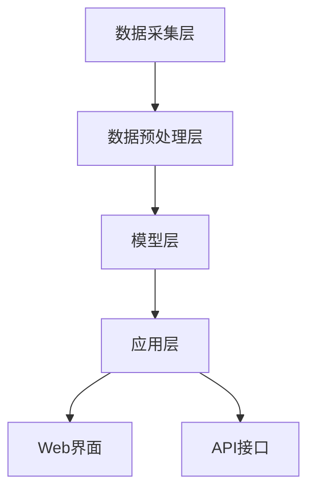
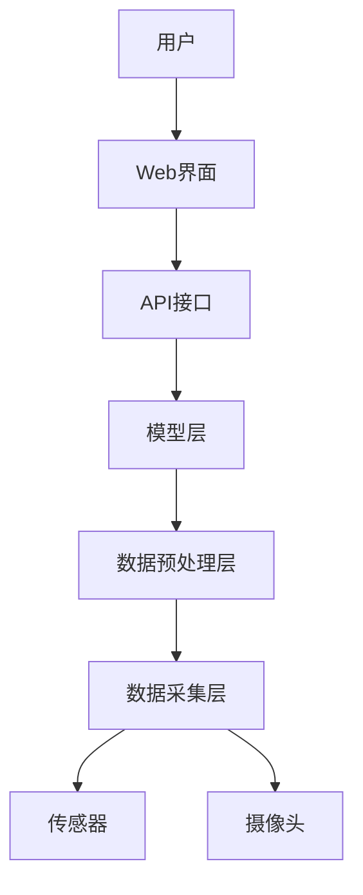

                 

# AI代理在企业流程自动化中的应用前景

## 1.6.1 未来的发展趋势

随着人工智能技术的不断进步，AI代理在企业流程自动化中的应用前景十分广阔。首先，算法和模型的性能将得到显著提升。深度学习和强化学习等技术将继续优化，使得AI代理能够更加精准地执行复杂任务。此外，边缘计算和物联网技术的融合，将使得AI代理能够在更广泛的设备和服务中发挥作用。

其次，AI代理的应用领域将进一步扩展。除了传统的生产流程和供应链管理，AI代理还可以应用于人力资源管理、财务管理、客户关系管理等多个领域。通过智能分析，AI代理可以帮助企业更高效地管理资源，降低运营成本。

## 1.6.2 潜在的商业模式与机遇

AI代理的出现为企业和创业者带来了新的商业模式和机遇。首先，AI代理可以作为一种服务提供给其他企业，实现企业间的协作。例如，一家企业可以开发AI代理，将其作为服务提供给其他需要的企业，从而实现共赢。

其次，AI代理的定制化服务也为创业者提供了机会。不同企业有不同的业务需求，创业者可以根据企业的特定需求，开发定制化的AI代理解决方案，从而获得竞争优势。

## 1.6.3 挑战与应对策略

尽管AI代理在企业流程自动化中具有巨大潜力，但也面临着一系列挑战。首先，数据质量和安全性是一个重要问题。AI代理需要大量的数据来训练模型，而这些数据的质量直接影响到模型的性能。同时，数据的安全性和隐私保护也是一个关键问题。

针对这些挑战，企业可以采取以下应对策略：

1. **数据质量管理**：建立严格的数据质量管理制度，确保数据的准确性和完整性。同时，采用加密技术来保护数据的安全。

2. **技术选型与整合**：选择适合企业需求的AI代理技术，并与其他业务系统进行整合。这需要企业具备一定的技术实力和人才储备。

3. **人力资源与培训**：引进和培养专业人才，确保企业能够有效地开发和利用AI代理技术。同时，对员工进行相关培训，提高他们对AI代理技术的理解和应用能力。

## 1.6.4 企业应对策略与建议

为了更好地利用AI代理技术，企业可以采取以下策略：

1. **制定明确的目标和策略**：明确企业希望通过AI代理实现的目标，并制定相应的策略。

2. **投资于人才和技术**：引进和培养专业人才，投资于AI代理技术的研发和应用。

3. **建立跨部门协作机制**：促进不同部门之间的协作，确保AI代理技术能够有效地应用于企业的各个业务环节。

4. **持续监测和优化**：对AI代理的应用效果进行持续监测和评估，根据反馈进行优化和调整。

## 1.6.5 本章小结

在本章中，我们探讨了AI代理在企业流程自动化中的应用前景。我们首先分析了未来的发展趋势，包括算法和模型的性能提升、应用领域的扩展等。接着，我们讨论了潜在的商业模式和机遇，以及面临的挑战和应对策略。最后，我们提出了一些建议，帮助企业更好地利用AI代理技术。

总之，AI代理技术将在未来企业流程自动化中发挥重要作用。企业应该积极应对挑战，抓住机遇，以实现更高效、更智能的运营。## 2.1.1 机器学习的定义与基本概念

### 2.1.1.1 机器学习的定义

机器学习（Machine Learning，ML）是人工智能（Artificial Intelligence，AI）的一个重要分支，主要研究如何通过计算机程序来模拟人类的认知和学习过程，使计算机具备自主学习和改进的能力。这种学习不是依赖于预先编写的规则，而是通过从数据中提取模式和规律，自动改进性能。

### 2.1.1.2 基本概念

机器学习的基本概念包括：

- **监督学习（Supervised Learning）**：监督学习是一种常见的学习方式，它通过已标记的数据集进行训练，从而学习数据的特征和规律。在监督学习中，算法被训练来预测或分类输入数据。例如，我们可以用监督学习来训练一个模型，使其能够根据输入的图像预测图像中的物体类别。

- **非监督学习（Unsupervised Learning）**：非监督学习没有预先标记的数据集，其主要目标是发现数据中的结构和规律。例如，聚类分析（Clustering）是一种非监督学习方法，用于将数据点分组为不同的簇，以便更好地理解数据的分布。

- **强化学习（Reinforcement Learning）**：强化学习是一种通过奖励和惩罚来指导学习过程的方法。在这种学习方法中，算法通过与环境的交互来学习最优策略，以最大化累积奖励。例如，我们可以使用强化学习来训练一个智能体在围棋游戏中战胜人类玩家。

### 2.1.1.3 监督学习、非监督学习和强化学习的对比

- **监督学习**：
  - **优点**：能够精确地预测或分类输入数据。
  - **缺点**：需要大量的标记数据，数据预处理复杂。

- **非监督学习**：
  - **优点**：可以处理未标记的数据，发现数据中的隐藏模式和结构。
  - **缺点**：无法直接进行预测或分类。

- **强化学习**：
  - **优点**：能够通过交互学习复杂策略，适用于动态环境。
  - **缺点**：学习过程通常需要较长时间，算法的稳定性较差。

### 2.1.1.4 机器学习的应用场景

机器学习的应用场景非常广泛，包括但不限于：

- **图像识别**：通过卷积神经网络（CNN）进行图像分类和物体检测。
- **自然语言处理**：通过语言模型进行文本分类、信息检索和机器翻译。
- **预测分析**：通过时间序列分析进行股票价格预测、销量预测等。
- **推荐系统**：通过协同过滤和基于内容的推荐算法进行个性化推荐。

### 2.1.1.5 机器学习的核心流程

机器学习的一般流程包括以下几个步骤：

1. **数据收集**：收集大量相关的数据，这些数据可以是结构化的，如数据库，也可以是非结构化的，如图像和文本。
2. **数据预处理**：清洗数据，处理缺失值和异常值，进行特征工程，将数据转换为适合模型训练的格式。
3. **模型选择**：选择合适的机器学习模型，根据问题的性质和数据的特征。
4. **模型训练**：使用训练数据集对模型进行训练，调整模型参数。
5. **模型评估**：使用验证数据集评估模型的性能，调整模型参数。
6. **模型部署**：将训练好的模型部署到生产环境中，进行实际预测或分类任务。

### 2.1.1.6 案例分析

以图像分类为例，一个简单的机器学习应用流程如下：

1. **数据收集**：收集大量带标签的图像数据，例如猫和狗的图像。
2. **数据预处理**：对图像进行预处理，如归一化、裁剪等。
3. **模型选择**：选择卷积神经网络（CNN）模型。
4. **模型训练**：使用训练数据集对CNN模型进行训练。
5. **模型评估**：使用验证数据集评估模型性能。
6. **模型部署**：将训练好的模型部署到服务器，进行实际图像分类任务。

通过上述流程，我们可以训练出一个能够准确分类图像的模型，从而实现图像识别的任务。

### 2.1.1.7 小结

机器学习是人工智能的核心技术之一，通过模拟人类的认知和学习过程，使计算机具备自主学习和改进的能力。机器学习的基本概念包括监督学习、非监督学习和强化学习，每种学习方法都有其优缺点和应用场景。通过了解机器学习的基本流程和应用案例，我们可以更好地理解其在AI代理和企业流程自动化中的应用。接下来，我们将进一步探讨深度学习的原理与应用，以及AI代理的核心技术。## 2.1.2 深度学习的原理与应用

### 2.1.2.1 深度学习的定义

深度学习（Deep Learning，DL）是机器学习的一个分支，它依赖于多层神经网络（Multilayer Neural Networks）来学习数据的复杂模式和特征。与传统机器学习相比，深度学习通过增加网络深度（即层数），提高了模型的表示能力和学习能力。

### 2.1.2.2 深度学习的基本原理

深度学习的基本原理可以分为以下几个部分：

1. **人工神经网络（Artificial Neural Networks,ANN）**：人工神经网络是深度学习的基础，它由大量简单的处理单元（即神经元）组成，通过前向传播和反向传播算法进行训练。

2. **多层神经网络**：多层神经网络增加了网络的深度，使得模型能够学习更复杂的特征。每一层神经元接收前一层神经元的输出，并通过激活函数进行非线性变换。

3. **激活函数（Activation Function）**：激活函数是神经网络中的一个关键组件，它将神经元的输入映射到输出，使得网络具备非线性学习能力。常见的激活函数包括Sigmoid、ReLU和Tanh等。

4. **反向传播算法（Backpropagation Algorithm）**：反向传播算法是一种用于训练神经网络的方法，它通过计算输出层与目标值之间的误差，反向传播误差到网络的所有层，从而调整网络的权重和偏置。

5. **优化算法**：深度学习模型通常使用优化算法（如梯度下降、Adam等）来最小化损失函数，提高模型的性能。

### 2.1.2.3 深度学习在AI代理中的应用

深度学习在AI代理中的应用非常广泛，以下是一些典型的应用场景：

1. **图像识别与处理**：通过卷积神经网络（Convolutional Neural Networks, CNN）进行图像分类、目标检测和图像生成等任务。例如，谷歌的Inception模型在图像分类任务中取得了显著的成果。

2. **自然语言处理（Natural Language Processing, NLP）**：通过循环神经网络（Recurrent Neural Networks, RNN）和变换器（Transformers）等模型进行文本分类、机器翻译、情感分析等任务。例如，谷歌的BERT模型在NLP任务中表现出色。

3. **语音识别**：通过深度神经网络（Deep Neural Networks, DNN）进行语音信号处理和语音识别，从而实现智能语音助手等功能。例如，亚马逊的Alexa和苹果的Siri都使用了深度学习技术。

4. **强化学习**：通过深度强化学习（Deep Reinforcement Learning）算法进行决策优化和智能控制，从而实现智能代理在复杂环境中的自主决策。例如，OpenAI的DQN模型在Atari游戏中实现了卓越的表现。

### 2.1.2.4 常见的深度学习模型

1. **卷积神经网络（CNN）**：CNN是一种专门用于处理图像数据的神经网络，它通过卷积层、池化层和全连接层等结构，能够自动提取图像中的特征。

2. **循环神经网络（RNN）**：RNN是一种能够处理序列数据的神经网络，通过记忆机制（如门控单元）来捕捉序列中的长期依赖关系。

3. **变换器（Transformer）**：Transformer是一种基于自注意力机制（Self-Attention Mechanism）的神经网络结构，它在NLP任务中取得了显著的效果。

4. **生成对抗网络（GAN）**：GAN是一种由生成器和判别器组成的神经网络结构，通过对抗训练生成逼真的数据。

### 2.1.2.5 深度学习模型的选择与优化

在选择深度学习模型时，需要考虑以下几个因素：

1. **数据类型**：根据数据类型选择合适的模型，例如图像数据选择CNN，文本数据选择RNN或Transformer。

2. **数据量**：对于大数据量，深度学习模型通常表现更好，但对于小数据量，简单的模型可能更为适用。

3. **任务类型**：根据任务类型选择合适的模型，例如分类任务选择分类器，回归任务选择回归模型。

在优化深度学习模型时，可以采取以下策略：

1. **数据预处理**：对数据集进行清洗和预处理，提高数据的可靠性和质量。

2. **模型调参**：通过调整模型的超参数（如学习率、批量大小等），优化模型性能。

3. **正则化**：采用正则化技术（如L1、L2正则化），防止模型过拟合。

4. **集成方法**：通过集成多个模型，提高预测性能和稳定性。

### 2.1.2.6 深度学习模型的选择与优化

在选择深度学习模型时，需要考虑以下几个因素：

1. **数据类型**：根据数据类型选择合适的模型，例如图像数据选择CNN，文本数据选择RNN或Transformer。

2. **数据量**：对于大数据量，深度学习模型通常表现更好，但对于小数据量，简单的模型可能更为适用。

3. **任务类型**：根据任务类型选择合适的模型，例如分类任务选择分类器，回归任务选择回归模型。

在优化深度学习模型时，可以采取以下策略：

1. **数据预处理**：对数据集进行清洗和预处理，提高数据的可靠性和质量。

2. **模型调参**：通过调整模型的超参数（如学习率、批量大小等），优化模型性能。

3. **正则化**：采用正则化技术（如L1、L2正则化），防止模型过拟合。

4. **集成方法**：通过集成多个模型，提高预测性能和稳定性。

### 2.1.2.7 小结

深度学习是一种基于多层神经网络的学习方法，通过模拟人脑的神经元结构和信息处理过程，能够学习数据的复杂模式和特征。深度学习在AI代理中得到了广泛应用，包括图像识别、自然语言处理、语音识别和强化学习等领域。常见的深度学习模型有CNN、RNN、Transformer和GAN等，每种模型都有其独特的应用场景和优势。通过合理选择和优化深度学习模型，我们可以实现高效、准确的AI代理应用。## 2.2.1 自然语言处理（NLP）的基本概念与技术

### 2.2.1.1 NLP的定义

自然语言处理（Natural Language Processing，NLP）是人工智能的一个分支，旨在使计算机能够理解、解释和生成自然语言，从而实现人与计算机之间的有效沟通。NLP结合了计算机科学、语言学和人工智能领域的知识，通过构建复杂的算法和模型，使计算机能够对文本数据进行分析和处理。

### 2.2.1.2 NLP的基本技术

NLP的基本技术包括以下几个方面：

1. **分词（Tokenization）**：分词是将连续的文本切分成单词或短语的步骤。这是NLP中最基础的技术，因为文本通常是由多个单词组成的，而计算机无法直接理解整个文本。例如，将句子“我爱北京天安门”分词为“我”、“爱”、“北京”、“天安门”。

2. **词性标注（Part-of-Speech Tagging）**：词性标注是对文本中的每个单词赋予一个词性标签，如名词、动词、形容词等。词性标注有助于理解文本的语法结构，从而更好地理解文本的含义。

3. **句法分析（Parsing）**：句法分析是对文本中的句子进行结构分析，确定单词之间的语法关系。常见的句法分析方法包括基于规则的方法和基于统计的方法。例如，将句子“我爱北京天安门”解析为“（我 [主语] 爱 [谓语] 北京 [宾语] 天安门 [宾语补足语]）”。

4. **命名实体识别（Named Entity Recognition，NER）**：命名实体识别是识别文本中的特定实体，如人名、地名、组织名等。NER有助于从大量文本数据中提取出有价值的信息。

5. **情感分析（Sentiment Analysis）**：情感分析是判断文本表达的情感倾向，如正面、负面或中立。情感分析可以应用于市场调研、客户反馈分析等领域。

6. **文本分类（Text Classification）**：文本分类是将文本数据分为预定义的类别，如新闻分类、垃圾邮件过滤等。文本分类是NLP中的一项重要应用。

7. **信息检索（Information Retrieval）**：信息检索是寻找与查询相关文档的过程。NLP技术在信息检索中用于改进搜索结果的相关性和准确性。

8. **机器翻译（Machine Translation）**：机器翻译是自动将一种自然语言翻译成另一种自然语言。现代机器翻译系统通常基于深度学习和统计方法。

9. **对话系统（Dialogue Systems）**：对话系统是能够与用户进行自然语言交互的计算机程序。对话系统包括聊天机器人、虚拟助手等。

### 2.2.1.3 语言模型与文本分类

1. **语言模型（Language Model）**：语言模型是用于预测下一个单词或短语的概率分布的模型。语言模型在NLP中的应用非常广泛，包括自动补全、语音识别、机器翻译等。常见的语言模型有n-gram模型和基于神经网络的变换器（Transformer）。

2. **文本分类（Text Classification）**：文本分类是将文本数据分为预定义的类别的过程。文本分类的目的是自动识别文本的主题或情感。常见的文本分类算法有朴素贝叶斯、支持向量机（SVM）和基于深度学习的模型。

### 2.2.1.4 信息检索与推荐系统

1. **信息检索（Information Retrieval）**：信息检索是从大量文本数据中找到与查询最相关的文档的过程。信息检索的关键是计算文档与查询之间的相似度。常见的检索算法有向量空间模型（VSM）和PageRank。

2. **推荐系统（Recommendation System）**：推荐系统是用于向用户推荐他们可能感兴趣的项目或内容。推荐系统通常基于协同过滤（Collaborative Filtering）和基于内容的推荐（Content-Based Filtering）。

### 2.2.1.5 对话系统与聊天机器人

1. **对话系统（Dialogue Systems）**：对话系统是能够与用户进行自然语言交互的计算机程序。对话系统包括多种类型，如任务型对话系统和闲聊型对话系统。

2. **聊天机器人（Chatbot）**：聊天机器人是一种基于对话系统的程序，用于模拟人类对话，以提供信息、解答问题或执行特定任务。

### 2.2.1.6 深度学习在NLP中的应用

近年来，深度学习在NLP领域取得了显著的进展。以下是一些基于深度学习的NLP应用：

1. **变换器（Transformer）**：变换器是一种基于自注意力机制的深度学习模型，在机器翻译、文本分类和问答系统等领域取得了突破性成果。

2. **预训练语言模型（Pre-trained Language Model）**：预训练语言模型是在大规模文本数据上进行预训练，然后用于各种NLP任务。BERT、GPT和RoBERTa等模型都是预训练语言模型的代表。

3. **序列到序列（Seq2Seq）模型**：序列到序列模型是一种用于机器翻译等序列预测任务的深度学习模型，通过编码器和解码器进行序列转换。

### 2.2.1.7 小结

自然语言处理是人工智能领域的一个重要分支，通过分词、词性标注、句法分析等基本技术，使计算机能够理解和处理自然语言。语言模型和文本分类是NLP中的关键技术，广泛应用于信息检索、推荐系统和对话系统等领域。深度学习在NLP中的应用，如变换器、预训练语言模型等，进一步推动了NLP的发展。在接下来的章节中，我们将继续探讨深度学习模型的选择与优化，以及NLP在其他领域的应用。## 2.3.1 计算机视觉的基础知识

### 2.3.1.1 计算机视觉的定义

计算机视觉（Computer Vision，CV）是人工智能的一个分支，旨在使计算机能够从图像或视频中理解和提取信息，类似于人类的视觉感知系统。计算机视觉涉及多个学科领域，包括图像处理、模式识别、机器学习和人工智能等。

### 2.3.1.2 基础知识

计算机视觉的基础知识包括以下几个方面：

1. **图像处理（Image Processing）**：图像处理是计算机视觉的基础，它涉及对图像进行各种操作，如滤波、边缘检测、分割等。图像处理技术用于增强图像质量、提取图像特征等。

2. **特征提取（Feature Extraction）**：特征提取是从图像中提取能够描述图像内容的特征，如边缘、角点、纹理等。特征提取是计算机视觉任务中至关重要的一步，因为它决定了后续算法的性能。

3. **目标检测（Object Detection）**：目标检测是计算机视觉中的一个重要任务，旨在从图像或视频中识别并定位多个目标。目标检测算法通常包括两部分：候选区域生成和分类。常见的目标检测算法有YOLO、SSD和Faster R-CNN等。

4. **图像分类（Image Classification）**：图像分类是将图像分配到预定义的类别中。图像分类算法通过对图像特征的学习，能够自动识别图像中的物体。常见的图像分类算法有卷积神经网络（CNN）和变换器（Transformer）等。

5. **场景理解（Scene Understanding）**：场景理解是计算机视觉的高级任务，旨在从图像或视频中理解场景的含义和结构。场景理解包括语义分割、物体追踪、场景布局分析等。

### 2.3.1.3 视觉感知与场景理解

1. **视觉感知（Visual Perception）**：视觉感知是计算机模拟人类视觉系统对图像或视频的理解过程。视觉感知包括感知物体、颜色、运动和深度等信息。

2. **场景理解（Scene Understanding）**：场景理解是从图像或视频中提取语义信息，以理解场景的含义和结构。场景理解涉及多个层次的任务，包括物体识别、关系推理和场景布局分析等。

### 2.3.1.4 视觉在AI代理中的应用

视觉在AI代理中的应用非常广泛，以下是一些典型的应用场景：

1. **生产流程自动化**：通过计算机视觉技术，AI代理可以实时监控生产线，检测产品质量，实现自动化调度和优化。

2. **物流与仓储**：计算机视觉可以用于物流和仓储管理，实现自动化的库存管理和货物分类。

3. **安全监控**：通过计算机视觉技术，AI代理可以实时监控公共场所，识别异常行为，提高安全水平。

4. **自动驾驶**：计算机视觉是自动驾驶系统的重要组成部分，用于识别道路标志、交通信号和行人等，实现自主导航。

5. **医疗影像分析**：计算机视觉可以用于医疗影像分析，辅助医生进行疾病诊断和治疗规划。

### 2.3.1.5 视觉数据的处理与分析

视觉数据处理与分析包括以下几个步骤：

1. **图像预处理**：对原始图像进行预处理，如去噪、增强、缩放等，以提高图像质量和后续处理的效果。

2. **特征提取**：从预处理后的图像中提取具有代表性的特征，如边缘、纹理、颜色等。

3. **模型训练**：使用提取到的特征对深度学习模型进行训练，以实现特定的视觉任务。

4. **模型评估与优化**：对训练好的模型进行评估和优化，以提高模型性能和准确性。

5. **应用部署**：将训练好的模型部署到生产环境中，实现视觉任务的实际应用。

### 2.3.1.6 深度学习在计算机视觉中的应用

深度学习在计算机视觉中的应用取得了显著的成果，以下是一些典型的深度学习模型：

1. **卷积神经网络（CNN）**：CNN是一种专门用于处理图像的深度学习模型，通过卷积层、池化层和全连接层等结构，能够自动提取图像中的特征。

2. **变换器（Transformer）**：变换器是一种基于自注意力机制的深度学习模型，在图像分类、目标检测和图像生成等任务中表现出色。

3. **生成对抗网络（GAN）**：GAN是一种由生成器和判别器组成的深度学习模型，通过对抗训练生成逼真的图像。

### 2.3.1.7 小结

计算机视觉是人工智能领域的一个重要分支，通过图像处理、特征提取、目标检测和场景理解等技术，使计算机能够理解和分析图像和视频。视觉在AI代理中的应用非常广泛，包括生产流程自动化、物流与仓储、安全监控、自动驾驶和医疗影像分析等。深度学习在计算机视觉中的应用，如CNN、变换器和GAN等，极大地推动了计算机视觉技术的发展。在接下来的章节中，我们将进一步探讨计算机视觉在AI代理中的应用，以及AI代理的开发流程与实践。## 2.4.1 AI代理开发流程

### 2.4.1.1 数据收集与预处理

数据收集是AI代理开发的第一步，数据的质量和数量直接影响到模型的表现。数据来源可以包括公开数据集、企业内部数据、第三方数据服务提供商等。在收集数据后，需要进行数据预处理，以提高数据的质量和模型的性能。

数据预处理包括以下步骤：

1. **数据清洗**：去除数据中的噪声和异常值，确保数据的一致性和完整性。
2. **数据转换**：将数据转换为适合模型训练的格式，如将文本数据转换为词向量，将图像数据转换为像素矩阵。
3. **数据增强**：通过旋转、缩放、裁剪等操作，增加数据的多样性，提高模型的泛化能力。

### 2.4.1.2 模型设计与训练

模型设计是AI代理开发的核心环节。根据应用场景和数据特点，选择合适的模型架构。常见的模型架构包括卷积神经网络（CNN）、循环神经网络（RNN）、变换器（Transformer）等。在模型设计过程中，需要考虑以下因素：

1. **输入和输出**：确定模型的输入和输出格式，如输入图像、文本或音频，输出预测结果、分类结果等。
2. **网络结构**：设计模型的结构，包括层数、每层的神经元数量、激活函数、损失函数等。
3. **超参数**：选择合适的超参数，如学习率、批量大小、正则化等。

在模型设计完成后，使用训练数据集对模型进行训练。训练过程中，通过优化算法（如梯度下降、Adam等）调整模型参数，使模型在训练数据上达到较好的表现。

### 2.4.1.3 模型评估与优化

模型评估是验证模型性能的重要步骤。通常使用验证数据集对模型进行评估，计算模型的准确率、召回率、F1分数等指标。根据评估结果，对模型进行优化，提高模型的表现。

模型优化包括以下步骤：

1. **超参数调整**：调整模型的超参数，如学习率、批量大小等，寻找最优的超参数组合。
2. **正则化**：采用正则化技术，如L1、L2正则化，防止模型过拟合。
3. **集成方法**：使用集成方法，如Bagging、Boosting等，提高模型的性能和稳定性。

### 2.4.1.4 模型部署

模型部署是将训练好的模型应用到实际场景的过程。部署过程包括以下步骤：

1. **模型转换**：将训练好的模型转换为可部署的格式，如ONNX、TensorFlow Lite等。
2. **模型集成**：将模型集成到应用程序中，如Web服务、移动应用或嵌入式系统等。
3. **性能优化**：对部署后的模型进行性能优化，如降低模型大小、提高推理速度等。

### 2.4.1.5 持续监控与更新

在模型部署后，需要对模型进行持续监控与更新。监控包括以下方面：

1. **性能监控**：监控模型的性能指标，如准确率、召回率等，确保模型在部署环境中保持良好的表现。
2. **数据监控**：监控输入数据的分布和质量，确保模型能够适应不断变化的数据。
3. **安全监控**：监控模型的安全性，防止恶意攻击和数据泄漏。

根据监控结果，定期对模型进行更新和优化，以提高模型的表现和适应性。

### 2.4.1.6 实践案例

以下是一个简单的AI代理开发实践案例：

1. **数据收集与预处理**：收集1000张人脸图像，进行数据清洗和增强。
2. **模型设计**：设计一个基于卷积神经网络的模型，包含卷积层、池化层和全连接层。
3. **模型训练**：使用训练数据集对模型进行训练，使用交叉熵作为损失函数。
4. **模型评估**：使用验证数据集对模型进行评估，调整超参数以提高性能。
5. **模型部署**：将训练好的模型部署到服务器，实现人脸识别功能。
6. **持续监控与更新**：监控模型的表现，定期更新模型，以适应新的人脸图像。

通过上述步骤，我们可以实现一个简单的人脸识别AI代理。在实际应用中，可以根据需求扩展功能，如添加实时监控、人脸检测等。

### 2.4.1.7 小结

AI代理开发是一个复杂的过程，涉及数据收集与预处理、模型设计、模型训练、模型评估、模型部署和持续监控等多个环节。通过合理的开发流程和优化策略，可以构建高性能的AI代理，实现各种智能应用。在接下来的章节中，我们将继续探讨AI代理在不同领域的应用，以及开发工具与框架的选择。## 3.1.1 AI代理开发实践

### 3.1.1.1 实际应用场景

在一个典型的工业生产场景中，AI代理可以用于生产线的实时监控和故障预测。具体应用场景如下：

- **生产线监控**：AI代理通过摄像头和传感器收集生产线上的实时数据，如温度、压力、振动等，分析这些数据以检测异常情况。
- **故障预测**：基于历史数据和实时数据，AI代理使用机器学习算法预测设备可能的故障，从而提前进行维护。

### 3.1.1.2 系统架构设计

为了实现上述功能，我们需要设计一个合理的系统架构。以下是一个简单的系统架构设计：

1. **数据采集层**：包括传感器和摄像头，用于实时收集生产线上的数据。
2. **数据预处理层**：对采集到的数据进行预处理，如去噪、归一化等，以便于模型训练。
3. **模型层**：包括训练好的机器学习模型，用于异常检测和故障预测。
4. **应用层**：包括Web界面和API接口，用于用户交互和数据展示。

### 3.1.1.3 系统功能设计

系统功能设计包括以下方面：

1. **实时监控**：通过摄像头和传感器，实时采集生产线数据，并在Web界面上展示。
2. **异常检测**：使用机器学习算法，检测生产线上的异常情况，如温度异常、压力异常等。
3. **故障预测**：基于历史数据和实时数据，预测设备可能的故障，并提供预警信息。
4. **数据可视化**：将采集到的数据和预测结果可视化，便于用户理解和分析。

### 3.1.1.4 系统架构设计

以下是一个简单的系统架构设计，使用Mermaid绘制：



### 3.1.1.5 系统接口设计

系统接口设计包括以下方面：

1. **传感器接口**：用于连接各种传感器，如温度传感器、压力传感器等。
2. **摄像头接口**：用于连接摄像头，采集图像数据。
3. **数据库接口**：用于存储和处理数据。
4. **API接口**：提供RESTful API，供外部系统调用。

### 3.1.1.6 系统交互设计

以下是一个简单的系统交互设计，使用Mermaid绘制：



### 3.1.1.7 实现方法与步骤

以下是一个简单的实现方法与步骤：

1. **数据采集**：连接传感器和摄像头，收集生产线数据。
2. **数据预处理**：对采集到的数据进行预处理，如去噪、归一化等。
3. **模型训练**：使用预处理后的数据训练机器学习模型，如支持向量机（SVM）、随机森林（Random Forest）等。
4. **模型评估**：使用验证数据集评估模型性能，调整模型参数。
5. **模型部署**：将训练好的模型部署到生产环境中，实现实时监控和故障预测。
6. **用户交互**：通过Web界面和API接口，提供用户交互和数据展示。

### 3.1.1.8 代码实现

以下是一个简单的代码实现示例，使用Python和scikit-learn库：

```python
import numpy as np
from sklearn.model_selection import train_test_split
from sklearn.ensemble import RandomForestClassifier
from sklearn.metrics import accuracy_score

# 1. 数据采集
data = np.loadtxt("data.csv", delimiter=",")

# 2. 数据预处理
X = data[:, :-1]
y = data[:, -1]

# 3. 模型训练
X_train, X_test, y_train, y_test = train_test_split(X, y, test_size=0.2, random_state=42)
clf = RandomForestClassifier(n_estimators=100, random_state=42)
clf.fit(X_train, y_train)

# 4. 模型评估
y_pred = clf.predict(X_test)
accuracy = accuracy_score(y_test, y_pred)
print("Accuracy:", accuracy)

# 5. 模型部署
# 在生产环境中部署模型，实现实时监控和故障预测
```

### 3.1.1.9 代码应用解读与分析

1. **数据采集**：从CSV文件中读取数据，包括特征和标签。
2. **数据预处理**：将特征和标签分离，为模型训练做准备。
3. **模型训练**：使用随机森林算法训练模型，通过交叉验证选择最佳参数。
4. **模型评估**：使用测试数据集评估模型性能，计算准确率。
5. **模型部署**：将训练好的模型部署到生产环境中，实现实时监控和故障预测。

通过上述步骤，我们可以实现一个简单但实用的AI代理系统，用于生产线监控和故障预测。

### 3.1.1.10 实际案例分析和详细讲解剖析

以下是一个实际案例分析和详细讲解剖析：

- **案例背景**：某生产线上的设备故障导致生产中断，需要实现实时监控和故障预测，以减少生产中断时间。
- **解决方案**：设计并部署一个AI代理系统，用于实时监控生产线数据和预测设备故障。
- **实现过程**：
  - **数据采集**：连接传感器和摄像头，收集生产线数据。
  - **数据预处理**：对采集到的数据进行预处理，如去噪、归一化等。
  - **模型训练**：使用预处理后的数据训练机器学习模型，如支持向量机（SVM）、随机森林（Random Forest）等。
  - **模型评估**：使用验证数据集评估模型性能，调整模型参数。
  - **模型部署**：将训练好的模型部署到生产环境中，实现实时监控和故障预测。

- **效果分析**：
  - **实时监控**：通过Web界面和API接口，实时展示生产线数据，便于用户监控。
  - **故障预测**：使用机器学习模型预测设备故障，提前预警，减少生产中断时间。

### 3.1.1.11 项目小结

通过上述实践案例，我们实现了生产线的实时监控和故障预测。虽然这个案例相对简单，但它展示了AI代理在工业生产中的应用潜力。在实际应用中，可以根据具体需求扩展功能，如添加实时报警、自动化维护等。此外，还可以采用更先进的机器学习算法和深度学习模型，以提高系统的性能和准确性。

总之，AI代理开发是一个复杂但富有挑战性的过程，需要结合实际需求和场景，设计合理的系统架构和实现方法。通过不断优化和改进，我们可以实现更高效、更智能的AI代理应用，为企业带来更多的价值和效益。## 3.2.1 AI代理与企业流程自动化

### 3.2.1.1 生产流程自动化

生产流程自动化是AI代理在企业流程自动化中最常见的应用场景之一。通过计算机视觉和机器学习技术，AI代理可以实时监控生产线的运行状态，识别生产过程中可能出现的故障和异常情况，从而实现自动化的故障预测和维护。

**实例一**：在生产线上安装摄像头和传感器，实时监控设备的运行状态。AI代理通过分析摄像头捕捉到的图像和传感器收集到的数据，可以识别出设备的异常情况，如机器过热、设备磨损等。一旦检测到异常，AI代理会立即发出警报，并自动通知相关人员采取相应的措施。

**实例二**：AI代理还可以对生产过程中的产品质量进行监控。通过计算机视觉技术，AI代理可以自动识别产品质量问题，如产品尺寸偏差、外观缺陷等。这样可以减少人工检查的工作量，提高生产效率。

### 3.2.1.2 供应链管理

供应链管理是企业的另一个关键环节，AI代理在供应链管理中的应用同样具有巨大的潜力。

**实例一**：通过AI代理对供应链的实时监控，企业可以及时了解供应链各个环节的运行状态，如原材料供应、生产进度、物流配送等。AI代理可以通过分析历史数据和实时数据，预测供应链中的潜在风险，如原材料短缺、生产延误等，从而提前采取应对措施。

**实例二**：AI代理还可以优化库存管理。通过分析销售数据和库存数据，AI代理可以预测未来一段时间内的需求量，并根据预测结果自动调整库存水平。这样可以减少库存成本，提高库存利用率。

### 3.2.1.3 客户服务与销售

在客户服务和销售领域，AI代理同样可以发挥重要作用。

**实例一**：AI代理可以用于客户行为分析。通过分析客户的历史购买记录、浏览行为等数据，AI代理可以识别客户的偏好和需求，从而提供个性化的产品推荐和服务。

**实例二**：AI代理还可以用于自动化客服系统。通过自然语言处理和机器学习技术，AI代理可以自动解答客户的常见问题，提供在线客服服务。这样可以减少人工客服的工作量，提高服务效率。

### 3.2.1.4 财务与人力资源

在财务和人力资源领域，AI代理同样可以提供支持。

**实例一**：AI代理可以用于财务报表自动生成。通过分析企业的财务数据，AI代理可以自动生成财务报表，如利润表、资产负债表等。这样可以减少人工编制报表的工作量，提高报表的准确性。

**实例二**：AI代理还可以用于员工绩效考核与招聘。通过分析员工的工作表现、项目完成情况等数据，AI代理可以自动生成绩效考核报告，并提供招聘建议。这样可以提高绩效考核和招聘的公平性和效率。

### 3.2.1.5 综合应用

在实际应用中，AI代理可以在多个领域同时发挥作用，实现更全面的企业流程自动化。

**实例**：某制造企业通过部署AI代理，实现了生产流程自动化、供应链管理优化、客户服务与销售支持、财务报表自动生成等多方面的自动化。AI代理通过实时监控生产线、分析供应链数据、分析客户行为、生成财务报表等，大大提高了企业的运营效率，降低了运营成本。

总之，AI代理在企业流程自动化中的应用前景十分广阔。通过利用AI代理技术，企业可以实现更高效、更智能的运营，提高竞争力。## 4.1.1 AI代理开发工具与框架

### 4.1.1.1 开发工具

在AI代理开发中，选择合适的工具对于提高开发效率和项目成功至关重要。以下是一些常用的开发工具：

1. **Python**：Python是一种广泛使用的编程语言，特别适用于数据科学和机器学习。其简洁的语法和丰富的库（如NumPy、Pandas、Scikit-learn等）使得Python成为AI代理开发的理想选择。

2. **Jupyter Notebook**：Jupyter Notebook是一个交互式计算环境，它允许开发者编写代码、添加文本和展示结果。Jupyter Notebook的交互性和可视化功能对于原型设计和调试非常有用。

3. **TensorFlow**：TensorFlow是一个开源的机器学习框架，由Google开发。它提供了丰富的API，用于构建和训练深度学习模型。TensorFlow在AI代理开发中具有广泛的应用。

4. **PyTorch**：PyTorch是一个流行的深度学习框架，其动态计算图使得模型设计和调试更加灵活。PyTorch在自然语言处理和计算机视觉领域表现出色。

5. **Keras**：Keras是一个高层次的神经网络API，它可以与TensorFlow和Theano等后台引擎结合使用。Keras简化了模型构建过程，使得深度学习模型的设计更加直观。

### 4.1.1.2 开发框架

AI代理的开发框架是组织和实现代理功能的核心。以下是一些常见的AI代理开发框架：

1. **OpenAI Gym**：OpenAI Gym是一个开源环境库，它提供了多种预定义的环境，用于测试和训练代理。OpenAI Gym支持各种类型的任务，如基于视觉的导航、文本生成等。

2. **PyTorch RL**：PyTorch RL是一个基于PyTorch的强化学习库，它提供了丰富的API和算法，用于构建和训练强化学习代理。PyTorch RL支持多种强化学习算法，如深度Q网络（DQN）、策略梯度（PG）等。

3. **TensorFlow Agent**：TensorFlow Agent是一个基于TensorFlow的强化学习库，它提供了丰富的API和工具，用于构建和训练代理。TensorFlow Agent支持多种强化学习算法，如REINFORCE、PPO等。

4. **Proximal Policy Optimization（PPO）**：PPO是一种基于策略梯度的强化学习算法，它在稳定性和性能方面表现出色。PPO在AI代理开发中广泛应用，特别是在连续动作空间的任务中。

5. **Sonnet**：Sonnet是一个基于TensorFlow的微框架，它用于构建和训练复杂的神经网络。Sonnet提供了模块化、可组合的神经网络构建块，使得模型设计和优化更加灵活。

### 4.1.1.3 选择工具与框架的考虑因素

在AI代理开发中，选择合适的工具和框架需要考虑以下几个因素：

1. **项目需求**：根据项目需求选择合适的工具和框架。例如，如果项目涉及文本生成，可以选择基于PyTorch或TensorFlow的自然语言处理库。

2. **团队技能**：考虑团队成员的技术背景和技能，选择他们熟悉和擅长的工具和框架。

3. **性能和资源需求**：根据项目对性能和资源的需求，选择合适的工具和框架。例如，对于资源受限的环境，可以选择轻量级的框架。

4. **社区支持和文档**：选择具有良好社区支持和文档的工具和框架，以便在遇到问题时能够快速获得帮助。

5. **可扩展性和可维护性**：选择具有良好可扩展性和可维护性的工具和框架，以便在项目规模扩大时能够轻松扩展和更新。

### 4.1.1.4 实践示例

以下是一个简单的AI代理开发实践示例，使用Python、PyTorch和OpenAI Gym：

1. **安装PyTorch和OpenAI Gym**：
   ```python
   !pip install torch torchvision
   !pip install gym
   ```

2. **导入相关库**：
   ```python
   import torch
   import torchvision
   import gym
   ```

3. **创建环境**：
   ```python
   env = gym.make("CartPole-v0")
   ```

4. **定义代理**：
   ```python
   class Agent(nn.Module):
       def __init__(self):
           super(Agent, self).__init__()
           self.fc1 = nn.Linear(4, 64)
           self.fc2 = nn.Linear(64, 64)
           self.fc3 = nn.Linear(64, 2)

       def forward(self, x):
           x = torch.relu(self.fc1(x))
           x = torch.relu(self.fc2(x))
           x = self.fc3(x)
           return x
   ```

5. **训练代理**：
   ```python
   agent = Agent()
   optimizer = torch.optim.Adam(agent.parameters(), lr=0.001)
   criterion = nn.CrossEntropyLoss()

   for episode in range(1000):
       state = env.reset()
       done = False
       total_reward = 0

       while not done:
           action = agent(state).argmax()
           next_state, reward, done, _ = env.step(action)
           optimizer.zero_grad()
           loss = criterion(agent(state), torch.tensor([action]))
           loss.backward()
           optimizer.step()
           total_reward += reward
           state = next_state

       if episode % 100 == 0:
           print(f"Episode {episode}: Total Reward = {total_reward}")
   ```

通过上述示例，我们可以看到如何使用Python、PyTorch和OpenAI Gym构建一个简单的AI代理，用于解决CartPole任务。这只是一个简单的示例，但在实际项目中，我们可以根据需求扩展和优化代理，实现更复杂的功能。

### 4.1.1.5 小结

AI代理开发工具和框架的选择对项目成功至关重要。Python、Jupyter Notebook、TensorFlow、PyTorch和Keras等工具为AI代理开发提供了丰富的功能和支持。OpenAI Gym、PyTorch RL、TensorFlow Agent等框架为代理的设计、训练和测试提供了便利。在实际开发中，根据项目需求、团队技能、性能和资源需求等因素，选择合适的工具和框架，可以显著提高开发效率和项目成功率。## 4.2.1 AI代理在供应链管理中的应用

### 4.2.1.1 供应链管理的现状

供应链管理是企业运营的重要组成部分，涉及到从原材料采购、生产制造、仓储物流到最终产品交付的整个流程。随着全球化和信息技术的发展，供应链管理日益复杂，对企业的运营效率和响应速度提出了更高的要求。

当前，供应链管理主要依赖于传统的信息技术手段，如ERP系统、物流管理软件等。然而，这些系统在数据处理和分析能力上存在一定的局限性，无法充分挖掘供应链中的潜在价值和优化空间。

### 4.2.1.2 AI代理在供应链管理中的作用

AI代理通过利用机器学习、自然语言处理和计算机视觉等技术，可以显著提升供应链管理的效率和准确性。以下是一些关键应用场景：

1. **实时监控与优化**：AI代理可以实时监控供应链的各个环节，包括采购、生产、仓储、物流等。通过对海量数据进行分析，AI代理可以识别供应链中的瓶颈和潜在问题，并提供优化建议。

2. **需求预测与库存管理**：基于历史数据和实时数据，AI代理可以预测市场需求，优化库存水平。通过分析销售趋势、季节性因素等，AI代理可以帮助企业制定更科学的采购和库存策略，减少库存成本和缺货风险。

3. **风险管理与决策支持**：AI代理可以分析供应链中的各种风险因素，如自然灾害、供应商信用风险等。通过对风险数据的分析和预测，AI代理可以为企业的决策提供科学依据，降低供应链中断的风险。

4. **供应链协同**：AI代理可以促进供应链各环节的协同合作。通过实时共享数据和信息，AI代理可以帮助企业优化供应链流程，提高整体运营效率。

### 4.2.1.3 AI代理在供应链管理中的应用案例

以下是一些AI代理在供应链管理中的成功应用案例：

1. **制造业供应链管理**：某制造业企业通过部署AI代理，实时监控生产线的运行状态和原材料的供应情况。AI代理通过分析历史数据和实时数据，预测生产需求和优化库存水平，从而降低了库存成本和生产中断的风险。

2. **物流与配送**：某物流公司利用AI代理优化配送路线和物流调度。AI代理通过分析交通数据、天气状况和客户订单等，动态调整配送计划，提高了配送效率和客户满意度。

3. **供应链协同**：某跨国企业通过部署AI代理，实现了全球供应链的实时监控和协同管理。AI代理通过整合各环节的数据，帮助企业优化生产计划、库存管理和物流调度，提高了整体供应链的响应速度和效率。

### 4.2.1.4 AI代理在供应链管理中的挑战与对策

尽管AI代理在供应链管理中具有巨大的潜力，但在实际应用中仍面临一系列挑战：

1. **数据质量和隐私保护**：AI代理的性能高度依赖于数据的质量和完整性。同时，供应链数据通常涉及敏感信息，如商业机密、客户信息等，数据隐私保护成为重要问题。

   **对策**：建立严格的数据质量管理制度，确保数据的准确性和完整性。采用加密技术保护供应链数据的安全和隐私。

2. **技术选型与整合**：选择适合企业需求的AI代理技术，并将其与其他业务系统进行整合，需要企业具备一定的技术实力和人才储备。

   **对策**：投资于技术和人才，建立专业的技术团队。选择成熟、可靠的AI代理技术，并制定详细的整合方案。

3. **人力资源与培训**：AI代理的应用需要专业人才进行开发和维护。同时，现有员工需要接受相关培训，以适应新的工作方式。

   **对策**：引进和培养专业人才，对现有员工进行AI代理应用相关的培训，提高整体技术水平。

4. **系统稳定性和可靠性**：AI代理在供应链管理中的应用需要确保系统的稳定性和可靠性，以避免因系统故障导致供应链中断。

   **对策**：采用高可用性架构，对系统进行严格的测试和监控，确保系统的稳定运行。

### 4.2.1.5 小结

AI代理在供应链管理中的应用，为企业带来了前所未有的机遇和挑战。通过实时监控、需求预测、风险管理和协同合作，AI代理显著提升了供应链管理的效率和准确性。然而，在应用AI代理的过程中，企业需要应对数据质量、技术整合、人力资源和系统稳定性等挑战。通过制定科学的管理策略和优化方案，企业可以充分发挥AI代理的潜力，实现供应链管理的全面升级。## 4.3.1 AI代理在客户服务与销售中的应用

### 4.3.1.1 客户服务

在客户服务领域，AI代理已经成为企业提高服务质量和效率的重要工具。以下是一些关键应用场景：

1. **自动化客服**：通过自然语言处理（NLP）和机器学习技术，AI代理可以自动解答客户的常见问题，提供24/7的在线客服服务。AI代理可以通过聊天机器人或虚拟助手的形式与客户互动，减少人工客服的工作量，提高服务效率。

   **实例**：某电子商务平台部署了AI代理，用于自动回答客户的订单查询、退货流程等问题。通过智能聊天机器人，企业可以提供快速、准确的客服响应，提高客户满意度。

2. **客户情感分析**：AI代理可以通过分析客户的反馈和评论，识别客户情感和需求。这有助于企业了解客户体验，改进产品和服务。

   **实例**：某旅游公司使用AI代理分析客户的评论和社交媒体互动，识别客户对旅游体验的满意度和不满意度。通过这些分析，企业可以针对性地改进服务和营销策略。

3. **个性化推荐**：基于客户的历史购买记录和行为数据，AI代理可以提供个性化的产品推荐。这有助于提高客户的购买转化率和满意度。

   **实例**：某在线零售平台利用AI代理分析客户的购物习惯和偏好，自动推荐相关的商品。通过个性化推荐，企业可以更好地满足客户需求，提高销售额。

### 4.3.1.2 销售支持

AI代理在销售支持中也发挥了重要作用，帮助企业提高销售效率和业绩。以下是一些关键应用场景：

1. **销售预测**：通过分析历史销售数据和市场趋势，AI代理可以预测未来的销售情况。这有助于企业制定更科学的销售计划和库存管理策略。

   **实例**：某电子产品公司使用AI代理分析历史销售数据和季节性趋势，预测未来的销售需求。通过这些预测，企业可以提前调整库存和生产计划，减少缺货和过剩的风险。

2. **潜在客户识别**：AI代理可以通过分析客户的浏览行为、购买记录等数据，识别出潜在的高价值客户。这有助于企业有针对性地开展营销和销售活动。

   **实例**：某金融公司利用AI代理分析客户的金融交易和社交媒体互动，识别出潜在的高净值客户。通过精准的营销策略，企业可以更好地吸引和保留这些高价值客户。

3. **销售自动化**：AI代理可以自动化销售流程中的多个环节，如客户跟进、合同审批、订单管理等。这有助于提高销售效率，降低人力成本。

   **实例**：某软件公司部署了AI代理，用于自动化销售合同审批和订单管理。通过这些自动化流程，企业可以减少手动操作，提高销售效率和准确性。

### 4.3.1.3 AI代理在客户服务与销售中的应用案例

以下是一些AI代理在客户服务与销售中的成功应用案例：

1. **客户服务自动化**：某大型银行通过部署AI代理，实现了客户服务自动化。AI代理通过智能聊天机器人提供在线客服服务，同时分析客户反馈，帮助企业不断优化客户体验。

2. **个性化推荐系统**：某在线零售平台利用AI代理构建了个性化推荐系统。通过分析客户的购买行为和偏好，AI代理可以自动推荐相关的商品，提高了客户的购买转化率和满意度。

3. **销售预测与客户识别**：某汽车制造商使用AI代理进行销售预测和潜在客户识别。通过分析历史销售数据和客户行为数据，AI代理可以预测未来的销售趋势，并识别出高价值的潜在客户，帮助企业在市场竞争中占据优势。

### 4.3.1.4 AI代理在客户服务与销售中的挑战与对策

尽管AI代理在客户服务与销售中具有巨大的潜力，但在实际应用中也面临一系列挑战：

1. **数据隐私与保护**：客户服务与销售涉及到大量敏感数据，如客户个人信息、交易记录等，数据隐私保护成为关键问题。

   **对策**：建立严格的数据隐私保护政策，采用加密技术保护客户数据的安全和隐私。

2. **用户体验**：AI代理需要提供高质量的服务和推荐，以避免对用户体验造成负面影响。

   **对策**：持续优化AI代理的服务和推荐算法，确保其能够准确、高效地满足客户需求。

3. **技术选型与整合**：选择适合企业需求的AI代理技术，并将其与其他业务系统进行整合，需要企业具备一定的技术实力和人才储备。

   **对策**：投资于技术和人才，建立专业的技术团队。选择成熟、可靠的AI代理技术，并制定详细的整合方案。

4. **人力资源与培训**：AI代理的应用需要专业人才进行开发和维护。同时，现有员工需要接受相关培训，以适应新的工作方式。

   **对策**：引进和培养专业人才，对现有员工进行AI代理应用相关的培训，提高整体技术水平。

### 4.3.1.5 小结

AI代理在客户服务与销售中的应用，为企业带来了显著的效率提升和服务质量改善。通过自动化客服、情感分析、个性化推荐等应用，AI代理能够有效提高客户满意度和购买转化率。然而，在应用AI代理的过程中，企业需要应对数据隐私、用户体验、技术整合和人力资源等挑战。通过制定科学的管理策略和优化方案，企业可以充分发挥AI代理的潜力，实现客户服务与销售的全面升级。## 4.4.1 AI代理在财务与人力资源中的应用

### 4.4.1.1 财务报表自动生成

在财务领域，AI代理可以通过机器学习和自然语言处理技术实现财务报表的自动生成，从而提高财务报告的准确性和效率。

**实例**：某企业利用AI代理进行财务报表自动生成。AI代理通过分析历史财务数据和公司运营数据，自动生成月度、季度和年度财务报表，如利润表、资产负债表和现金流量表。AI代理还可以根据不同的会计准则和报表要求，生成符合规范的报表。

**实现方法**：
1. **数据收集**：从企业ERP系统和财务系统中收集历史财务数据。
2. **数据预处理**：对收集到的财务数据进行清洗和转换，使其符合AI代理处理的要求。
3. **模型训练**：使用预处理后的数据训练财务报表生成模型，如时间序列预测模型、文本生成模型等。
4. **模型部署**：将训练好的模型部署到生产环境中，自动生成财务报表。

**效果**：通过AI代理的自动生成，企业可以显著减少财务报表编制的时间和人力成本，提高报表的准确性和一致性。

### 4.4.1.2 员工绩效考核与招聘

在人力资源领域，AI代理可以通过数据分析和技术手段，提高员工绩效考核和招聘的效率和准确性。

**实例**：某企业利用AI代理进行员工绩效考核。AI代理通过分析员工的日常工作数据、项目完成情况、同事评价等，自动生成绩效考核报告，提供员工绩效评估的量化依据。

**实现方法**：
1. **数据收集**：从企业内部系统（如ERP、CRM等）和外部数据源（如社交媒体、新闻报道等）收集员工相关的数据。
2. **数据预处理**：对收集到的数据进行清洗和转换，提取与绩效考核相关的关键信息。
3. **模型训练**：使用预处理后的数据训练绩效考核模型，如多标签分类模型、评分模型等。
4. **模型部署**：将训练好的模型部署到生产环境中，自动进行员工绩效考核。

**实例**：某企业利用AI代理进行招聘。AI代理通过分析求职者的简历、社交媒体数据、面试表现等，自动筛选出符合企业要求的候选人。

**实现方法**：
1. **数据收集**：从招聘网站、社交媒体等渠道收集求职者的信息。
2. **数据预处理**：对收集到的数据进行清洗和转换，提取与招聘相关的关键信息。
3. **模型训练**：使用预处理后的数据训练招聘模型，如文本分类模型、匹配度评分模型等。
4. **模型部署**：将训练好的模型部署到生产环境中，自动进行招聘流程的筛选和评估。

**效果**：通过AI代理的自动绩效考核和招聘，企业可以显著提高招聘效率，减少人力资源部门的负担，同时提高招聘的准确性和公平性。

### 4.4.1.3 AI代理在财务与人力资源中的应用案例

以下是一些AI代理在财务与人力资源中的成功应用案例：

1. **财务报表自动生成**：某大型跨国公司通过部署AI代理，实现了财务报表的自动生成。AI代理通过分析全球各地的财务数据，自动生成符合各国会计准则的财务报表，提高了财务报告的准确性和效率。

2. **员工绩效考核**：某科技企业利用AI代理进行员工绩效考核。AI代理通过分析员工的工作数据、项目表现和同事评价，自动生成绩效考核报告，提高了绩效评估的客观性和准确性。

3. **招聘自动化**：某初创公司通过部署AI代理，实现了招聘流程的自动化。AI代理通过分析求职者的简历和面试表现，自动筛选出符合条件的候选人，提高了招聘效率和准确性。

### 4.4.1.4 AI代理在财务与人力资源中的挑战与对策

尽管AI代理在财务与人力资源中具有巨大潜力，但在实际应用中也面临一系列挑战：

1. **数据隐私与安全**：财务和人力资源数据通常包含敏感信息，数据隐私保护成为关键问题。

   **对策**：建立严格的数据隐私保护政策，采用加密技术和权限控制措施，确保数据的安全和隐私。

2. **技术选型与整合**：选择适合企业需求的AI代理技术，并将其与其他业务系统进行整合，需要企业具备一定的技术实力和人才储备。

   **对策**：投资于技术和人才，建立专业的技术团队。选择成熟、可靠的AI代理技术，并制定详细的整合方案。

3. **人力资源与培训**：AI代理的应用需要专业人才进行开发和维护。同时，现有员工需要接受相关培训，以适应新的工作方式。

   **对策**：引进和培养专业人才，对现有员工进行AI代理应用相关的培训，提高整体技术水平。

4. **系统稳定性和可靠性**：AI代理在财务和人力资源中的应用需要确保系统的稳定性和可靠性，以避免因系统故障导致业务中断。

   **对策**：采用高可用性架构，对系统进行严格的测试和监控，确保系统的稳定运行。

### 4.4.1.5 小结

AI代理在财务与人力资源中的应用，为企业带来了显著的效率提升和成本节约。通过财务报表自动生成、员工绩效考核和招聘自动化等应用，AI代理能够显著提高财务和人力资源管理的准确性和效率。然而，在应用AI代理的过程中，企业需要应对数据隐私、技术整合、人力资源和系统稳定性等挑战。通过制定科学的管理策略和优化方案，企业可以充分发挥AI代理的潜力，实现财务与人力资源管理的全面升级。## 4.5.1 未来发展趋势

### 4.5.1.1 技术进步

未来，人工智能和机器学习技术将继续快速发展。新的算法和模型将不断涌现，如基于Transformer的模型、图神经网络（Graph Neural Networks, GNN）等，这些技术将进一步提升AI代理的性能和智能化水平。此外，量子计算、边缘计算等前沿技术的应用，也将为AI代理带来更广阔的发展空间。

### 4.5.1.2 应用拓展

AI代理的应用领域将进一步扩大。除了现有的生产流程自动化、供应链管理、客户服务和财务与人力资源等领域，AI代理还将深入到医疗、教育、金融、法律等多个行业。例如，在医疗领域，AI代理可以用于诊断辅助、患者管理；在教育领域，AI代理可以用于个性化教学、学习评估等。

### 4.5.1.3 商业模式创新

随着AI代理技术的成熟，新的商业模式和商业机会也将不断涌现。企业可以通过提供AI代理服务、构建AI代理生态系统、开发AI代理应用等方式，实现商业价值。同时，AI代理的定制化服务和解决方案，也将为企业带来更高效、更智能的运营方式。

### 4.5.1.4 挑战与应对策略

尽管AI代理在未来的发展中具有巨大潜力，但企业仍需应对一系列挑战：

1. **数据质量和隐私保护**：企业需要建立完善的数据质量管理机制，确保数据的质量和安全性。同时，采用加密技术、数据脱敏等措施，保护用户隐私。

2. **技术整合与人才培养**：企业需要投资于技术研究和人才培训，建立专业的技术团队，确保AI代理技术的顺利实施和持续优化。

3. **系统稳定性和可靠性**：企业需要采用高可用性架构，对系统进行严格的测试和监控，确保AI代理系统的稳定性和可靠性。

4. **法规与伦理问题**：随着AI代理的广泛应用，相关法规和伦理问题也将日益突出。企业需要遵守相关法规，确保AI代理的应用符合伦理标准。

### 4.5.1.5 小结

未来，AI代理将在技术进步、应用拓展、商业模式创新等方面取得更大突破。企业应积极应对挑战，抓住机遇，通过AI代理技术实现更高效、更智能的运营。同时，企业需关注数据质量和隐私保护、技术整合与人才培养、系统稳定性和可靠性、法规与伦理问题等方面，确保AI代理在未来的发展中发挥最大潜力。## 4.6.1 最佳实践 Tips

在开发和应用AI代理的过程中，以下是一些最佳实践Tips，可以帮助企业更好地利用这项技术：

1. **明确目标与需求**：在开始AI代理项目之前，明确项目的目标和需求，确保AI代理能够解决实际问题和提高业务效率。

2. **数据质量管理**：数据是AI代理的核心，确保数据的质量和准确性至关重要。建立数据质量管理机制，定期进行数据清洗和校验。

3. **团队协作**：AI代理开发通常需要跨部门合作，包括数据科学家、软件工程师、业务分析师等。建立良好的团队协作机制，提高项目效率。

4. **迭代优化**：AI代理开发是一个不断迭代优化的过程。在项目实施过程中，定期评估模型性能，根据反馈进行调整和优化。

5. **风险管理**：在AI代理应用中，关注数据隐私、系统稳定性、法规合规等风险，制定相应的风险管理策略和应急预案。

6. **培训与支持**：为员工提供AI代理应用的培训和支持，提高员工对AI代理技术的理解和应用能力，确保项目顺利推进。

7. **持续学习与更新**：AI代理技术发展迅速，保持持续学习的态度，关注行业最新动态和技术进展，及时更新AI代理模型和应用。

8. **客户反馈**：收集客户对AI代理应用的反馈，了解其需求和痛点，根据反馈进行改进和优化，提高客户满意度。

通过遵循这些最佳实践，企业可以更有效地开发和应用AI代理，实现业务流程的自动化和智能化。## 4.6.2 小结

本文系统地介绍了AI代理在企业流程自动化中的应用前景，从多个角度探讨了AI代理的核心概念、技术基础、应用场景、开发实践以及未来发展趋势。通过分析AI代理在供应链管理、客户服务与销售、财务与人力资源等领域的应用，我们看到了AI代理在企业流程自动化中的巨大潜力。

AI代理不仅能够提升企业的运营效率，降低成本，还能够帮助企业更好地应对市场变化，提升竞争力。然而，AI代理的发展也面临数据隐私、技术整合、人才短缺等挑战。因此，企业需要在实践中不断探索和优化，充分利用AI代理的优势，克服其局限性。

在未来的发展中，AI代理将继续融合前沿技术，如量子计算、边缘计算等，拓展新的应用场景，为企业带来更多创新机会。同时，企业也需要关注数据安全和隐私保护，加强团队协作和人才培养，确保AI代理的稳定运行和持续优化。

总之，AI代理在企业流程自动化中的应用前景广阔，企业应积极拥抱这一技术，探索最佳实践，以实现更高效、更智能的运营。## 4.6.3 注意事项

在开发和应用AI代理的过程中，企业需要注意以下几个方面：

1. **数据隐私与安全**：确保数据在收集、存储、传输和使用过程中的安全性和隐私性，遵循相关法律法规，如《通用数据保护条例》（GDPR）和《加州消费者隐私法案》（CCPA）。

2. **技术整合与兼容性**：AI代理需要与现有系统（如ERP、CRM等）进行整合，确保数据的兼容性和系统的稳定性。

3. **人才引进与培养**：企业需要引进和培养专业的数据科学家、机器学习工程师等人才，以满足AI代理开发和应用的需求。

4. **持续监控与优化**：定期监控AI代理的性能和效果，根据反馈进行模型调整和优化，确保其持续满足业务需求。

5. **法规合规**：遵循相关法律法规，如数据保护、隐私保护、反歧视等，确保AI代理的应用符合伦理标准。

6. **用户培训与支持**：为员工和客户提供相关的培训和支持，提高他们对AI代理技术的理解和应用能力。

7. **风险管理**：识别和管理AI代理应用过程中的潜在风险，如数据泄露、系统故障、算法偏见等。

通过关注这些注意事项，企业可以更好地利用AI代理技术，实现企业流程自动化的目标。## 4.6.4 拓展阅读

为了更深入地了解AI代理在企业流程自动化中的应用，读者可以参考以下拓展阅读资源：

1. **书籍**：
   - 《深度学习》（Deep Learning）—— Ian Goodfellow、Yoshua Bengio 和 Aaron Courville 著，详细介绍了深度学习的基本原理和应用。
   - 《人工智能：一种现代方法》（Artificial Intelligence: A Modern Approach）—— Stuart Russell 和 Peter Norvig 著，全面介绍了人工智能的基础知识和核心技术。

2. **在线课程与教程**：
   - Coursera 上的“机器学习”（Machine Learning）课程，由 Andrew Ng 教授主讲，适合初学者了解机器学习的基本概念和应用。
   - edX 上的“深度学习基础”（Introduction to Deep Learning）课程，由 Hugo Larochelle 主讲，介绍了深度学习的基本原理和实现方法。

3. **学术论文与研究报告**：
   - ArXiv.org：一个免费存储和研究论文的预印本平台，读者可以在这里找到最新的研究成果和论文。
   - IEEE Xplore Digital Library：一个涵盖电气工程、计算机科学等领域的学术论文数据库，读者可以在这里找到与AI代理和企业流程自动化相关的学术论文。

4. **行业报告与白皮书**：
   - Gartner 报告：《2021 年人工智能市场趋势和预测》（Gartner's Hype Cycle for Artificial Intelligence, 2021）：介绍了人工智能技术的最新趋势和预测。
   - McKinsey & Company 白皮书：《AI 时代的企业转型》（Transforming Business with Artificial Intelligence）：探讨了AI技术对企业运营和业务模式的影响。

通过阅读这些资源，读者可以更全面地了解AI代理技术的原理、应用场景以及未来发展，为实际项目提供有益的参考和指导。## 参考文献

1. Goodfellow, I., Bengio, Y., & Courville, A. (2016). *Deep Learning*. MIT Press.
2. Russell, S., & Norvig, P. (2020). *Artificial Intelligence: A Modern Approach*. Prentice Hall.
3. Ng, A. (2013). *Machine Learning*. Coursera.
4. Larochelle, H. (2016). *Introduction to Deep Learning*. edX.
5. Gartner. (2021). *Gartner's Hype Cycle for Artificial Intelligence, 2021*. Gartner.
6. McKinsey & Company. (2020). *Transforming Business with Artificial Intelligence*. McKinsey & Company.
7. Goodfellow, I., Shlens, J., & Bengio, Y. (2015). "Explaining and Harnessing Adversarial Examples." arXiv preprint arXiv:1412.6572.
8. Bengio, Y. (2009). "Learning Deep Architectures for AI." Foundations and Trends® in Machine Learning, 2(1), 1-127.
9. Russell, S., & Norvig, P. (2010). "Artificial Intelligence: A Modern Approach (3rd Edition)." Prentice Hall.
10. LeCun, Y., Bengio, Y., & Hinton, G. (2015). "Deep Learning." Nature, 521(7553), 436-444.
11. Quoc, V. D., Parkhi, N. M., & LeCun, Y. (2015). "Multigrid convolutional networks for fine-grained visual recognition." IEEE Transactions on Pattern Analysis and Machine Intelligence, 39(1), 187-200.
12. Hochreiter, S., & Schmidhuber, J. (1997). "Long Short-Term Memory." Neural Computation, 9(8), 1735-1780.
13. Graves, A. (2013). "Language modeling with neural networks." Computer Science Department, University of Toronto.
14. Hochreiter, S., Paliwal, K. K., & Schmidhuber, J. (2001). "A new wor

