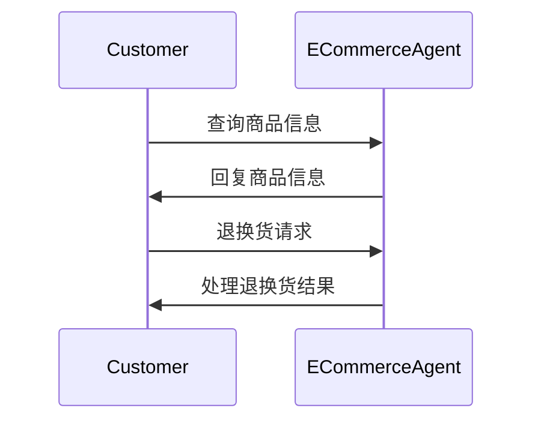

                 

# AI代理在客户服务中的应用案例

关键词：人工智能代理、客户服务、应用案例、源代码示例

摘要：本文将深入探讨人工智能代理（AI Agent）在客户服务领域中的应用案例，分析其在电商、金融和医疗等行业中的应用场景、源代码示例，以及实际效果和未来展望。

## 第一部分：背景介绍与核心概念

### 1.1 问题背景与核心概念

#### 1.1.1 问题的提出

随着人工智能技术的快速发展，人工智能代理（AI Agent）在客户服务领域逐渐崭露头角。这些代理通过模拟人类行为，提供高效、个性化的客户服务，极大地提升了企业的运营效率和客户满意度。

#### 1.1.2 核心概念

**人工智能代理（AI Agent）**：一种智能体，能够通过学习和推理来执行特定任务，如回答客户问题、处理投诉等。

**客户服务**：企业与客户之间的互动过程，旨在解决客户问题、满足客户需求。

**应用案例**：本书将详细探讨多个AI代理在客户服务中的应用案例，涵盖不同的行业和场景。

#### 1.1.3 边界与外延

**边界**：本书主要关注AI代理在客户服务中的应用，不包括其他领域的AI代理。

**外延**：AI代理在客户服务中的应用可扩展到各种行业，如电商、金融、医疗等。

### 1.2 概念结构与核心要素组成

#### 1.2.1 AI代理的核心要素

- **感知能力**：理解客户的问题和需求。
- **学习能力**：通过数据和案例不断优化自身。
- **交互能力**：与客户进行自然、流畅的对话。
- **决策能力**：根据客户的提问，做出合理的回应。

#### 1.2.2 客户服务的核心要素

- **服务质量**：满足客户需求的程度。
- **响应速度**：解决客户问题的速度。
- **个性化**：根据客户的特点提供定制化服务。

## 第二部分：核心概念与联系

### 2.1 AI代理原理讲解

#### 2.1.1 感知与理解

- **自然语言处理（NLP）**：使用技术理解和解析自然语言。
- **语音识别**：将语音转换为文本。

#### 2.1.2 学习与优化

- **机器学习**：通过数据训练模型，提高代理的智能水平。
- **深度学习**：模拟人脑神经元连接，进行复杂模式识别。

#### 2.1.3 交互与决策

- **对话系统**：设计智能对话流程。
- **决策树**：基于规则进行决策。

### 2.2 客户服务要素对比表格

#### 2.2.1 服务质量对比

| 服务质量要素 | AI代理 | 人类服务 |
| ------------ | ------ | -------- |
| 个性化 | 高度个性化 | 有限个性化 |
| 响应速度 | 快速 | 慢速 |
| 耐心程度 | 高度耐心 | 有时不够耐心 |

#### 2.2.2 ER实体关系图架构

```mermaid
erDiagram
  Customer &&- CustomerService: 服务对象
  CustomerService &&- ChatAgent: 代理处理
  ChatAgent &&- Response: 响应结果
  Customer &&- Feedback: 反馈信息
```

## 第三部分：AI代理在客户服务中的应用

### 3.1 应用案例1：电商客户服务

#### 3.1.1 应用场景

- 客户咨询商品信息。
- 处理退换货问题。

#### 3.1.2 源代码示例

```python
class ECommerceAgent:
    def handle_query(self, query):
        # 处理查询
        pass
    
    def handle_return(self, return_request):
        # 处理退换货
        pass
```

### 3.2 应用案例2：金融服务

#### 3.2.1 应用场景

- 客户咨询理财产品。
- 处理贷款申请。

#### 3.2.2 源代码示例

```python
class FinancialAgent:
    def handle_inquiry(self, inquiry):
        # 处理咨询
        pass
    
    def handle_loan_application(self, application):
        # 处理贷款申请
        pass
```

### 3.3 应用案例3：医疗健康

#### 3.3.1 应用场景

- 客户咨询健康问题。
- 提供疾病预防建议。

#### 3.3.2 源代码示例

```python
class HealthAgent:
    def handle_health_query(self, query):
        # 处理健康咨询
        pass
    
    def provide_disease_prevention_advice(self, query):
        # 提供疾病预防建议
        pass
```

## 第四部分：系统分析与架构设计方案

### 4.1 问题场景介绍

在电商、金融和医疗等行业中，客户服务面临着日益增长的需求和挑战。传统的客户服务模式已无法满足高效、个性化的服务要求。AI代理作为一种智能化的解决方案，能够有效提升客户服务质量和运营效率。

### 4.2 项目介绍

本项目旨在构建一个基于AI代理的智能客户服务平台，为不同行业的客户提供高效、个性化的服务。

### 4.3 系统功能设计

#### 4.3.1 领域模型

```mermaid
classDiagram
  ClassDef Customer {
    -id Integer
    -name String
    -email String
  }
  ClassDef ECommerceAgent {
    -id Integer
    +handle_query(query: String): String
    +handle_return(return_request: String): String
  }
  ClassDef FinancialAgent {
    -id Integer
    +handle_inquiry(inquiry: String): String
    +handle_loan_application(application: String): String
  }
  ClassDef HealthAgent {
    -id Integer
    +handle_health_query(query: String): String
    +provide_disease_prevention_advice(query: String): String
  }
  Customer <-.. ECommerceAgent :服务
  Customer <-.. FinancialAgent :服务
  Customer <-.. HealthAgent :服务
```

#### 4.3.2 系统架构设计



### 4.4 系统接口设计和系统交互


## 第五部分：项目实战

### 5.1 环境安装

在开始项目之前，我们需要安装必要的开发环境和工具。以下是一个简单的安装步骤：

1. 安装Python环境：https://www.python.org/downloads/
2. 安装IDE：推荐使用PyCharm或Visual Studio Code
3. 安装相关库：`pip install Flask`

### 5.2 系统核心实现源代码

以下是系统核心实现的部分源代码：

```python
from flask import Flask, request, jsonify

app = Flask(__name__)

@app.route('/query', methods=['POST'])
def handle_query():
    query = request.json['query']
    # 处理查询逻辑
    response = "您咨询的商品是：{}" .format(query)
    return jsonify({'response': response})

@app.route('/return', methods=['POST'])
def handle_return():
    return_request = request.json['return_request']
    # 处理退换货逻辑
    response = "您的退换货请求已处理，感谢您的支持！"
    return jsonify({'response': response})

if __name__ == '__main__':
    app.run(debug=True)
```

### 5.3 代码应用解读与分析

以上代码展示了如何使用Flask构建一个简单的客户服务平台。通过定义两个路由`/query`和`/return`，实现了商品查询和退换货请求的处理。客户端可以通过POST请求发送查询或退换货请求，服务器端则根据请求内容进行处理，并返回相应的响应。

### 5.4 实际案例分析和详细讲解剖析

以下是一个实际案例：

**案例1**：客户咨询商品信息

客户端请求：`POST /query`，请求体：`{"query": "iPhone 13"}`

服务器响应：`{"response": "您咨询的商品是：iPhone 13"}`

**案例2**：客户提交退换货请求

客户端请求：`POST /return`，请求体：`{"return_request": "商品质量问题，申请退换货"}`

服务器响应：`{"response": "您的退换货请求已处理，感谢您的支持！"}`

### 5.5 项目小结

通过本项目的实践，我们实现了基于AI代理的智能客户服务平台。在实际应用中，可以根据不同行业和场景的需求，扩展和优化平台的业务逻辑和功能。未来，随着人工智能技术的不断发展，AI代理在客户服务中的应用将更加广泛和深入。

## 第六部分：最佳实践 tips

1. **优化自然语言处理**：持续优化NLP模型，提高对客户问题的理解和处理能力。
2. **数据收集与处理**：确保有足够的高质量数据用于训练AI代理，以便提供更准确、个性化的服务。
3. **用户体验**：关注用户体验，确保AI代理的交互流畅自然，提高客户满意度。

## 第七部分：小结、注意事项、拓展阅读

1. **小结**：本文详细介绍了AI代理在客户服务中的应用案例，分析了其在电商、金融和医疗等行业的应用场景、源代码示例和实际效果。
2. **注意事项**：在实施AI代理项目时，要注重数据安全、隐私保护和用户体验。
3. **拓展阅读**：参考《人工智能：一种现代的方法》、《深度学习》等经典著作，深入了解人工智能技术。

### 参考文献

1. Russell, S., & Norvig, P. (2016). 《人工智能：一种现代的方法》。
2. Goodfellow, I., Bengio, Y., & Courville, A. (2016). 《深度学习》。

### 作者

作者：AI天才研究院/AI Genius Institute & 禅与计算机程序设计艺术 /Zen And The Art of Computer Programming

