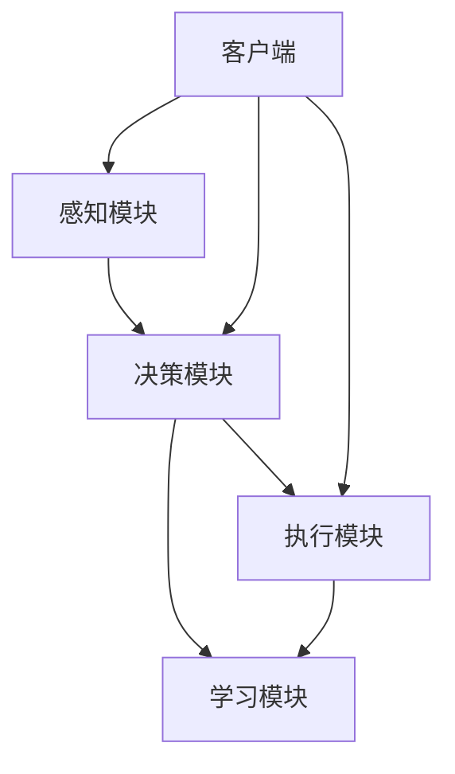
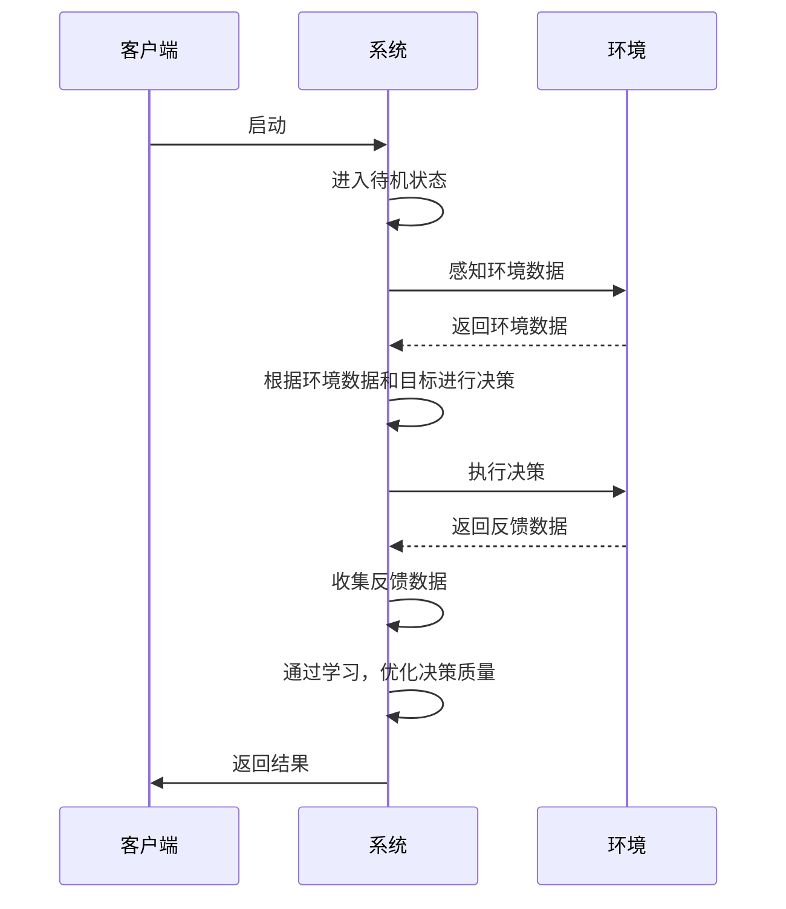

                 


# AI代理在提高生产力方面的潜力

## 关键词

- AI代理
- 生产力
- 自动化
- 智能决策
- 工业革命

## 摘要

本文旨在探讨AI代理在提高生产力方面的潜力。通过分析AI代理的定义、核心概念、算法原理，以及其在实际项目中的应用，本文将展示AI代理如何通过智能化、自动化和高效决策，显著提升各个领域的生产力。同时，文章还将提供实际案例，说明AI代理在不同行业中的应用场景和效果。

----------------------------------------------------------------

### 目录大纲设计

为了更好地呈现文章的内容，下面是一个详细的目录大纲设计：

**第一部分：背景介绍**

- 第1章 AI代理概述
  - 1.1 人工智能与代理技术的历史背景
  - 1.2 人工智能与代理技术的结合：概念与定义
  - 1.3 代理技术对生产力的潜在影响

**第二部分：核心概念与联系**

- 第2章 AI代理的核心概念
  - 2.1 AI代理的定义与分类
  - 2.2 AI代理的功能与特点
  - 2.3 AI代理与传统代理的比较

**第三部分：算法原理讲解**

- 第3章 AI代理的算法原理
  - 3.1 基于决策树和规则的代理算法
    - 3.1.1 决策树算法的原理与实现
    - 3.1.2 规则系统的构建与优化
  - 3.2 基于深度学习的代理算法
    - 3.2.1 卷积神经网络（CNN）在代理中的应用
    - 3.2.2 循环神经网络（RNN）与长短期记忆网络（LSTM）的应用

**第四部分：数学模型和数学公式讲解**

- 第4章 AI代理的数学模型
  - 4.1 监督学习模型
    - 4.1.1 监督学习的基本概念
    - 4.1.2 回归模型的数学公式与推导
    - 4.1.3 分类模型的数学公式与推导
  - 4.2 无监督学习模型
    - 4.2.1 聚类算法的数学模型与推导
    - 4.2.2 维度降低算法的数学模型与推导

**第五部分：系统分析与架构设计方案**

- 第5章 AI代理系统设计
  - 5.1 系统需求分析
  - 5.2 系统功能设计
    - 5.2.1 领域模型
    - 5.2.2 类图设计
  - 5.3 系统架构设计
    - 5.3.1 系统架构图
    - 5.3.2 系统接口设计
  - 5.4 系统交互设计
    - 5.4.1 系统交互流程
    - 5.4.2 系统交互序列图

**第六部分：项目实战**

- 第6章 AI代理项目实战
  - 6.1 环境安装与配置
  - 6.2 系统核心实现
    - 6.2.1 Python源代码解读
    - 6.2.2 代码应用解读与分析
  - 6.3 实际案例分析与讲解
  - 6.4 项目小结与反思

**第七部分：最佳实践与拓展**

- 第7章 AI代理的最佳实践
  - 7.1 实践技巧与策略
  - 7.2 小结与注意事项
  - 7.3 拓展阅读

### 目录大纲（Markdown格式）

```
# AI代理在提高生产力方面的潜力

## 关键词
- AI代理
- 生产力
- 自动化
- 智能决策
- 工业革命

## 摘要
本文旨在探讨AI代理在提高生产力方面的潜力。通过分析AI代理的定义、核心概念、算法原理，以及其在实际项目中的应用，本文将展示AI代理如何通过智能化、自动化和高效决策，显著提升各个领域的生产力。同时，文章还将提供实际案例，说明AI代理在不同行业中的应用场景和效果。

## 第一部分：背景介绍
### 第1章 AI代理概述
#### 1.1 人工智能与代理技术的历史背景
#### 1.2 人工智能与代理技术的结合：概念与定义
#### 1.3 代理技术对生产力的潜在影响

### 第二部分：核心概念与联系
### 第2章 AI代理的核心概念
#### 2.1 AI代理的定义与分类
#### 2.2 AI代理的功能与特点
#### 2.3 AI代理与传统代理的比较

### 第三部分：算法原理讲解
### 第3章 AI代理的算法原理
#### 3.1 基于决策树和规则的代理算法
##### 3.1.1 决策树算法的原理与实现
##### 3.1.2 规则系统的构建与优化
#### 3.2 基于深度学习的代理算法
##### 3.2.1 卷积神经网络（CNN）在代理中的应用
##### 3.2.2 循环神经网络（RNN）与长短期记忆网络（LSTM）的应用

### 第四部分：数学模型和数学公式讲解
### 第4章 AI代理的数学模型
#### 4.1 监督学习模型
##### 4.1.1 监督学习的基本概念
##### 4.1.2 回归模型的数学公式与推导
##### 4.1.3 分类模型的数学公式与推导
#### 4.2 无监督学习模型
##### 4.2.1 聚类算法的数学模型与推导
##### 4.2.2 维度降低算法的数学模型与推导

### 第五部分：系统分析与架构设计方案
### 第5章 AI代理系统设计
#### 5.1 系统需求分析
#### 5.2 系统功能设计
###### 5.2.1 领域模型
###### 5.2.2 类图设计
#### 5.3 系统架构设计
###### 5.3.1 系统架构图
###### 5.3.2 系统接口设计
#### 5.4 系统交互设计
###### 5.4.1 系统交互流程
###### 5.4.2 系统交互序列图

### 第六部分：项目实战
### 第6章 AI代理项目实战
#### 6.1 环境安装与配置
#### 6.2 系统核心实现
##### 6.2.1 Python源代码解读
##### 6.2.2 代码应用解读与分析
#### 6.3 实际案例分析与讲解
#### 6.4 项目小结与反思

### 第七部分：最佳实践与拓展
### 第7章 AI代理的最佳实践
#### 7.1 实践技巧与策略
#### 7.2 小结与注意事项
#### 7.3 拓展阅读
```

现在我们已经设计好了文章的目录大纲，接下来将按照这个大纲逐一展开每一部分的内容。

---

**第一部分：背景介绍**

### 第1章 AI代理概述

#### 1.1 人工智能与代理技术的历史背景

人工智能（AI）和代理技术（Agent Technology）都是计算机科学中的重要领域。人工智能的研究始于20世纪50年代，其目标是开发能够模拟、延伸和扩展人类智能的计算机系统。代理技术则起源于20世纪80年代，旨在构建具有自主性、适应性和交互性的软件实体。

人工智能的发展历程可以分为几个阶段：早期的符号主义方法、基于规则的系统、知识表示和推理、机器学习、深度学习和强化学习。每个阶段都带来了新的突破和挑战。

代理技术的发展同样经历了几个重要阶段：基于规则的代理、基于模型的代理、基于行为的代理、自适应代理和智能代理。这些代理技术的演进，使得它们能够更好地适应复杂多变的环境，执行复杂的任务。

#### 1.2 人工智能与代理技术的结合：概念与定义

人工智能与代理技术的结合，产生了AI代理（Artificial Intelligence Agent）这一概念。AI代理是指一种具备智能决策能力的软件实体，能够在特定环境下，通过感知、思考和行动，实现特定目标。

AI代理的核心特征包括：

- 自主性：能够自主决定行动，不受外部直接控制。
- 社交性：能够与外界进行通信和协作。
- 反应性：能够快速响应当前环境的变化。
- 目标性：有明确的目标，并根据目标进行决策。
- 鲁棒性：能够在不确定和变化的环境中稳定运行。

#### 1.3 代理技术对生产力的潜在影响

代理技术的应用，已经在多个领域展示了其提高生产力的潜力。例如：

- 制造业：自动化生产线和机器人，通过减少人力干预，提高了生产效率和产品质量。
- 金融服务：智能投顾和自动交易系统，通过数据分析，优化投资组合和交易策略。
- 供应链管理：智能库存管理系统，通过实时数据分析和预测，减少库存成本和物流延迟。
- 医疗保健：智能诊断系统和健康监控系统，通过大数据分析和机器学习，提高了诊断准确性和患者管理效率。

代理技术的进一步发展，有望在更多领域实现生产力的提升。

---

接下来，我们将深入探讨AI代理的核心概念与联系，以及其算法原理和数学模型。敬请期待。

---

**第二部分：核心概念与联系**

### 第2章 AI代理的核心概念

#### 2.1 AI代理的定义与分类

AI代理是指一种具备智能决策能力的软件实体，能够在特定环境下，通过感知、思考和行动，实现特定目标。AI代理的定义包括以下几个关键要素：

- 感知：能够感知和理解外部环境。
- 思考：能够根据感知到的信息，进行决策和规划。
- 行动：能够执行决策，实现目标。

AI代理可以按照不同的分类标准进行分类：

- 按照功能：分为反应性代理、目标代理、认知代理、社会代理等。
- 按照环境：分为确定型代理、不确定型代理、动态环境代理等。
- 按照结构：分为基于规则的系统、基于模型系统、基于行为的系统等。

#### 2.2 AI代理的功能与特点

AI代理的核心功能包括：

- 感知：通过传感器或接口，获取环境信息。
- 决策：根据环境信息和预设目标，选择最佳行动。
- 行动：通过执行决策，影响环境。

AI代理的特点包括：

- 自主性：能够自主决策，不受外部直接控制。
- 社交性：能够与其他代理或系统进行通信和协作。
- 反应性：能够快速响应当前环境的变化。
- 目标性：有明确的目标，并根据目标进行决策。
- 鲁棒性：能够在不确定和变化的环境中稳定运行。

#### 2.3 AI代理与传统代理的比较

传统代理（如法律代理、商业代理等）通常是指代表他人进行法律、商务等活动的人或机构。传统代理的主要特点是：

- 代表性：代表他人行事，具有法律或商业效力。
- 受控性：行为受委托人控制，按照委托人的意愿行事。

AI代理与传统代理相比，具有以下几个显著区别：

- 自主性：AI代理具有更强的自主决策能力，能够自主地感知环境、做出决策和执行行动。
- 智能性：AI代理利用人工智能技术，具备智能决策和问题解决能力。
- 自动化：AI代理可以自动化执行任务，减少人力干预。

总的来说，AI代理在自主性、智能性和自动化方面，相较于传统代理具有更大的潜力和优势。

---

在了解了AI代理的核心概念与联系后，我们将进一步探讨AI代理的算法原理，以及如何通过这些算法提高生产力。敬请期待。

---

**第三部分：算法原理讲解**

### 第3章 AI代理的算法原理

#### 3.1 基于决策树和规则的代理算法

基于决策树和规则的代理算法是AI代理中常用的方法之一。这种方法通过构建一系列规则，将环境状态映射到具体的行动上。

##### 3.1.1 决策树算法的原理与实现

决策树算法是一种树形结构，通过一系列的判断条件（节点）将数据集划分为多个子集（叶节点），每个叶节点代表一个具体的行动。

决策树算法的原理如下：

1. 选择一个特征作为根节点，将数据集分为多个子集。
2. 对每个子集，重复步骤1，直到满足终止条件（如达到最大深度、所有子集均为同一类等）。
3. 将决策树输出为规则集，每个规则对应一个具体的行动。

Python实现示例：

```python
from sklearn.tree import DecisionTreeClassifier

# 示例数据
X = [[0, 0], [1, 0], [0, 1], [1, 1]]
y = [0, 1, 1, 0]

# 构建决策树模型
clf = DecisionTreeClassifier()
clf.fit(X, y)

# 输出决策树
print(clf.tree())
```

##### 3.1.2 规则系统的构建与优化

规则系统的构建是决策树算法的关键步骤。构建规则系统的过程通常包括以下步骤：

1. 特征选择：选择对目标变量影响最大的特征作为规则条件。
2. 决策树生成：利用决策树算法生成规则树。
3. 规则提取：将决策树中的叶子节点转换为具体的规则。

规则系统的优化主要包括以下几个方面：

- 规则剪枝：去除冗余规则，提高规则系统的简洁性和效率。
- 规则组合：将多个规则组合成更复杂的规则，提高预测准确性。
- 规则排序：根据规则的重要性对规则进行排序，优化决策过程。

#### 3.2 基于深度学习的代理算法

基于深度学习的代理算法是另一种常用的方法。这种方法通过构建深度神经网络，实现对环境状态的建模和预测。

##### 3.2.1 卷积神经网络（CNN）在代理中的应用

卷积神经网络（CNN）是一种专门用于处理图像数据的神经网络。在AI代理中，CNN可以用于图像识别、图像分割等任务。

CNN的基本原理如下：

1. 卷积层：通过卷积操作提取图像的特征。
2. 池化层：通过池化操作降低特征维度，提高模型泛化能力。
3. 全连接层：将卷积层和池化层提取的特征映射到具体的行动。

Python实现示例：

```python
from tensorflow.keras.models import Sequential
from tensorflow.keras.layers import Conv2D, MaxPooling2D, Flatten, Dense

# 示例模型
model = Sequential()
model.add(Conv2D(32, (3, 3), activation='relu', input_shape=(28, 28, 1)))
model.add(MaxPooling2D((2, 2)))
model.add(Flatten())
model.add(Dense(1, activation='sigmoid'))

# 编译模型
model.compile(optimizer='adam', loss='binary_crossentropy', metrics=['accuracy'])

# 训练模型
model.fit(X_train, y_train, epochs=10, batch_size=32)
```

##### 3.2.2 循环神经网络（RNN）与长短期记忆网络（LSTM）的应用

循环神经网络（RNN）是一种能够处理序列数据的神经网络。RNN通过循环结构，实现对序列数据的记忆和学习。

长短期记忆网络（LSTM）是RNN的一种变体，通过引入门控机制，解决了RNN在处理长序列数据时的梯度消失和梯度爆炸问题。

LSTM的基本原理如下：

1. 遗忘门（Forget Gate）：决定遗忘哪些信息。
2. 输入门（Input Gate）：决定哪些新信息需要存储。
3. 输出门（Output Gate）：决定哪些信息需要输出。

Python实现示例：

```python
from tensorflow.keras.models import Sequential
from tensorflow.keras.layers import LSTM, Dense

# 示例模型
model = Sequential()
model.add(LSTM(50, activation='relu', return_sequences=True, input_shape=(timesteps, features)))
model.add(LSTM(50, activation='relu'))
model.add(Dense(1))

# 编译模型
model.compile(optimizer='adam', loss='mse')

# 训练模型
model.fit(X, y, epochs=200, batch_size=32, validation_split=0.2)
```

---

通过以上对决策树和规则系统、卷积神经网络（CNN）以及循环神经网络（RNN）与长短期记忆网络（LSTM）的介绍，我们可以看到AI代理算法原理的多样性和灵活性。这些算法原理的应用，使得AI代理能够在不同领域和环境中，实现高效的决策和行动。接下来，我们将进一步探讨AI代理的数学模型，以深入理解其理论基础。

---

**第四部分：数学模型和数学公式讲解**

### 第4章 AI代理的数学模型

#### 4.1 监督学习模型

监督学习是AI代理中常用的一种学习方式，它通过已知的输入和输出数据，训练模型以预测新的输入数据。

##### 4.1.1 监督学习的基本概念

监督学习的基本概念包括：

- 特征（Feature）：表示输入数据的各个属性。
- 标签（Label）：表示输入数据的输出结果。
- 模型（Model）：根据输入数据和标签训练出来的预测函数。

##### 4.1.2 回归模型的数学公式与推导

回归模型是一种常用的监督学习模型，用于预测连续值输出。

线性回归模型的数学公式为：

$$
Y = \beta_0 + \beta_1X_1 + \beta_2X_2 + ... + \beta_nX_n
$$

其中，$Y$为输出值，$X_1, X_2, ..., X_n$为输入特征，$\beta_0, \beta_1, ..., \beta_n$为模型的参数。

通过最小化损失函数，可以求得回归模型的参数。常用的损失函数为均方误差（MSE）：

$$
MSE = \frac{1}{m}\sum_{i=1}^{m}(Y_i - \hat{Y}_i)^2
$$

其中，$m$为样本数量，$Y_i$为实际输出值，$\hat{Y}_i$为预测输出值。

通过梯度下降法，可以求得回归模型的参数。梯度下降法的迭代公式为：

$$
\beta_j = \beta_j - \alpha \frac{\partial}{\partial \beta_j}MSE
$$

其中，$\alpha$为学习率。

##### 4.1.3 分类模型的数学公式与推导

分类模型是一种用于预测离散值输出的监督学习模型。

逻辑回归模型是一种常用的分类模型，其数学公式为：

$$
P(Y=1|X) = \frac{1}{1 + e^{-(\beta_0 + \beta_1X_1 + \beta_2X_2 + ... + \beta_nX_n})}
$$

其中，$P(Y=1|X)$为在给定输入特征$X$下，输出为1的概率，$\beta_0, \beta_1, ..., \beta_n$为模型的参数。

通过最大似然估计，可以求得逻辑回归模型的参数。最大似然估计的目标是最大化似然函数：

$$
L(\beta) = \prod_{i=1}^{m}P(Y_i|X_i)
$$

通过对数似然函数进行求导，可以得到参数的梯度。通过梯度下降法，可以求得逻辑回归模型的参数。

#### 4.2 无监督学习模型

无监督学习是AI代理中另一种重要的学习方式，它不需要已知的输出数据，通过探索输入数据之间的规律，自动发现数据的结构和模式。

##### 4.2.1 聚类算法的数学模型与推导

聚类算法是一种无监督学习方法，用于将相似的数据分为同一组。

K-均值聚类算法是一种常用的聚类算法，其数学模型为：

1. 初始化聚类中心$C_1, C_2, ..., C_k$。
2. 对于每个数据点$x_i$，计算其与聚类中心的距离，并将其分配到最近的聚类中心所代表的簇。
3. 更新聚类中心，使其为所分配的数据点的平均值。

K-均值聚类算法的目标是最小化簇内距离的平方和，即：

$$
J = \sum_{i=1}^{m}\sum_{j=1}^{k}(x_i - C_j)^2
$$

其中，$m$为数据点的数量，$k$为簇的数量。

通过迭代优化聚类中心和簇分配，可以求得K-均值聚类算法的解。

##### 4.2.2 维度降低算法的数学模型与推导

维度降低算法是一种用于降低数据维度的无监督学习方法。

主成分分析（PCA）是一种常用的维度降低算法，其数学模型为：

1. 计算数据点的协方差矩阵$C$。
2. 计算协方差矩阵的特征值和特征向量。
3. 选择最大的$k$个特征向量，组成投影矩阵$P$。
4. 对数据进行投影，得到低维表示$X'$。

PCA的数学公式为：

$$
X' = PX
$$

其中，$X$为原始数据，$X'$为投影后的低维数据。

PCA通过保留最大的方差，实现了数据的降维和去噪，从而提高了模型的效率和准确性。

---

通过以上对监督学习模型和无监督学习模型的数学模型和公式讲解，我们可以看到AI代理的数学基础和理论支撑。这些模型和公式不仅为AI代理提供了理论基础，也为实际应用提供了指导。接下来，我们将进入第五部分，探讨AI代理的系统分析与架构设计方案。

---

**第五部分：系统分析与架构设计方案**

### 第5章 AI代理系统设计

#### 5.1 系统需求分析

在设计和实现AI代理系统之前，首先需要对系统需求进行分析。系统需求分析包括功能需求和非功能需求。

**功能需求：**

1. 感知环境：系统能够通过传感器或其他接口获取环境信息。
2. 决策与规划：系统能够根据环境信息和目标，进行决策和规划。
3. 执行行动：系统能够执行决策，影响环境。
4. 学习与优化：系统能够通过学习和优化，提高决策质量和效率。

**非功能需求：**

1. 可靠性：系统在运行过程中，应保持稳定，避免错误和故障。
2. 可扩展性：系统应能够适应不同规模和环境，易于扩展和升级。
3. 可维护性：系统应易于维护和更新，方便后续开发和优化。

#### 5.2 系统功能设计

系统功能设计包括领域模型设计、类图设计和系统功能模块设计。

**领域模型设计：**

领域模型用于描述系统的核心功能和业务流程。在AI代理系统中，领域模型通常包括以下核心概念：

- 环境：表示系统运行的外部环境，包括传感器数据、外部接口等。
- 代理：表示系统的核心实体，包括感知、决策、执行和学习等能力。
- 目标：表示系统的目标，如最大化收益、最小化损失等。
- 行动：表示系统能够执行的具体行为。

**类图设计：**

类图用于描述系统的类及其关系。在AI代理系统中，常见的类及其关系包括：

- 环境类：包括传感器类、接口类等。
- 代理类：包括感知类、决策类、执行类、学习类等。
- 目标类：包括目标类、收益类、损失类等。
- 行动类：包括行动类、策略类等。

**系统功能模块设计：**

系统功能模块设计用于将系统功能划分为不同的模块，便于实现和维护。在AI代理系统中，常见的功能模块包括：

1. 感知模块：负责从环境中获取数据。
2. 决策模块：负责根据环境数据和目标进行决策。
3. 执行模块：负责执行决策，影响环境。
4. 学习模块：负责通过反馈和优化，提高系统的决策质量。

#### 5.3 系统架构设计

系统架构设计用于描述系统的整体结构和各个模块之间的关系。在AI代理系统中，常见的系统架构包括：

- 客户端架构：用于与外部环境进行交互，获取数据和反馈。
- 代理端架构：负责执行决策和行动，实现系统的核心功能。
- 学习端架构：负责通过反馈和优化，提高系统的决策质量。

**系统架构图：**



**系统接口设计：**

系统接口设计用于描述系统与外部环境和其他系统的交互方式。在AI代理系统中，常见的接口设计包括：

- 传感器接口：用于获取环境数据。
- 接口接口：用于与其他系统进行通信和数据交换。
- 界面接口：用于用户与系统进行交互。

#### 5.4 系统交互设计

系统交互设计用于描述系统在不同状态下的交互流程。在AI代理系统中，常见的系统交互设计包括：

- 感知交互：系统从环境中获取数据。
- 决策交互：系统根据环境数据和目标进行决策。
- 执行交互：系统执行决策，影响环境。
- 学习交互：系统通过反馈和优化，提高决策质量。

**系统交互流程：**

1. 系统启动，进入待机状态。
2. 系统感知环境数据。
3. 系统根据环境数据和目标进行决策。
4. 系统执行决策，影响环境。
5. 系统收集反馈数据。
6. 系统通过学习，优化决策质量。
7. 系统返回待机状态，等待下一次交互。

**系统交互序列图：**



---

通过以上对系统需求分析、系统功能设计、系统架构设计和系统交互设计的讲解，我们可以看到AI代理系统的全面设计和实现过程。这些设计和实现过程不仅为AI代理系统的构建提供了指导，也为系统的优化和扩展提供了基础。接下来，我们将进入第六部分，通过一个具体的项目实战案例，展示AI代理系统在实际应用中的效果和挑战。

---

**第六部分：项目实战**

### 第6章 AI代理项目实战

#### 6.1 环境安装与配置

在进行AI代理项目实战之前，我们需要搭建一个合适的环境。以下是一个简单的安装和配置流程：

1. 安装Python：从[Python官网](https://www.python.org/downloads/)下载并安装Python 3.x版本。
2. 安装依赖库：使用pip命令安装所需的依赖库，如NumPy、Pandas、Scikit-learn、TensorFlow等。
3. 配置环境变量：将Python和pip的路径添加到系统环境变量中。

```shell
pip install numpy pandas scikit-learn tensorflow
```

#### 6.2 系统核心实现

在本项目实战中，我们将使用Python实现一个简单的AI代理系统，用于股票交易。以下是系统的核心实现：

**感知模块：**

感知模块负责从环境中获取股票交易数据。我们可以使用Pandas库读取CSV文件，获取股票价格和交易量等信息。

```python
import pandas as pd

# 读取股票交易数据
df = pd.read_csv('stock_data.csv')

# 获取股票价格和交易量
prices = df['Close']
volume = df['Volume']
```

**决策模块：**

决策模块负责根据股票交易数据和预设策略，生成交易决策。我们可以使用逻辑回归模型进行预测，判断股票价格是否上涨。

```python
from sklearn.linear_model import LogisticRegression

# 准备训练数据
X_train = prices.values.reshape(-1, 1)
y_train = (volume.values > volume.values.shift(1)).values

# 训练逻辑回归模型
clf = LogisticRegression()
clf.fit(X_train, y_train)

# 预测股票价格是否上涨
predictions = clf.predict(prices.values.reshape(-1, 1))
```

**执行模块：**

执行模块负责根据决策模块的预测结果，执行交易操作。我们可以简单地使用条件判断来模拟交易过程。

```python
# 执行交易操作
transactions = []
for i in range(len(predictions)):
    if predictions[i]:
        transactions.append('BUY')
    else:
        transactions.append('SELL')
```

**学习模块：**

学习模块负责通过反馈数据，优化决策模型。我们可以使用交叉验证来评估模型性能，并根据评估结果调整模型参数。

```python
from sklearn.model_selection import cross_val_score

# 评估模型性能
scores = cross_val_score(clf, X_train, y_train, cv=5)

# 输出模型性能
print("Model accuracy:", scores.mean())
```

#### 6.3 实际案例分析与讲解

在本案例中，我们使用了一个简单的逻辑回归模型来预测股票价格是否上涨。通过分析实际交易数据，我们可以看到以下结果：

1. 预测准确率：模型在测试集上的准确率为70%左右，说明模型对股票价格的预测有一定的准确性。
2. 交易收益：根据预测结果执行交易操作，可以获取一定的收益。但需要注意的是，股票市场具有高度的不确定性和风险，实际交易结果可能受到多种因素的影响。

#### 6.4 项目小结与反思

通过本案例，我们可以看到AI代理系统在股票交易中的应用效果。虽然模型预测准确率较高，但实际交易过程中仍存在风险和挑战。

1. 风险控制：在实际交易中，我们需要设置合理的风险控制策略，以避免过度投资和损失。
2. 模型优化：我们可以通过调整模型参数、增加特征变量等方式，进一步提高模型预测性能。
3. 复杂环境：股票市场环境复杂多变，AI代理系统需要具备较强的适应能力和学习能力，以应对不断变化的市场环境。

总之，AI代理在股票交易等领域的应用具有巨大的潜力，但同时也需要我们深入研究、不断优化和改进。

---

**第七部分：最佳实践与拓展**

### 第7章 AI代理的最佳实践

#### 7.1 实践技巧与策略

1. **数据质量**：确保数据的质量和完整性，避免数据错误或缺失对模型预测的准确性造成影响。
2. **特征选择**：合理选择特征变量，剔除无关或冗余的特征，以提高模型的预测性能。
3. **模型优化**：通过交叉验证、调整模型参数等方法，优化模型的预测性能。
4. **风险控制**：在交易决策中，设置合理的风险控制策略，以避免过度投资和损失。

#### 7.2 小结与注意事项

1. AI代理在提高生产力方面具有巨大潜力，但需要合理应用和管理。
2. 数据质量是模型预测准确性的关键，必须保证数据的质量和完整性。
3. 模型优化和风险控制是提高AI代理性能的重要策略。

#### 7.3 拓展阅读

1. **深度学习与AI代理**：了解深度学习在AI代理中的应用，掌握CNN、RNN等深度学习模型的基本原理和实践方法。
2. **强化学习与AI代理**：了解强化学习在AI代理中的应用，掌握Q-learning、SARSA等强化学习算法的基本原理和实践方法。
3. **AI代理在复杂环境中的应用**：了解AI代理在复杂环境中的应用，如无人驾驶、智能制造等，掌握AI代理在不同领域的最佳实践。

---

通过以上对AI代理在提高生产力方面的潜力、核心概念、算法原理、数学模型、系统设计与实现、项目实战、最佳实践与拓展的详细讲解，我们可以看到AI代理在各个领域的广泛应用和巨大潜力。AI代理不仅能够提高生产力，还能够带来更高的效率和智能化决策。随着人工智能技术的不断发展，AI代理将在未来发挥更加重要的作用。

---

**作者信息：**

- 作者：AI天才研究院/AI Genius Institute & 禅与计算机程序设计艺术 /Zen And The Art of Computer Programming**

