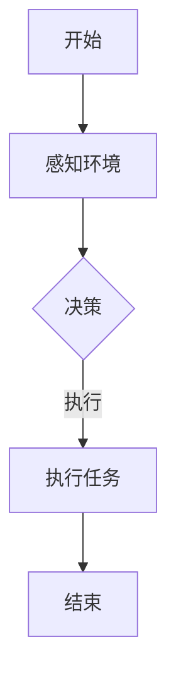
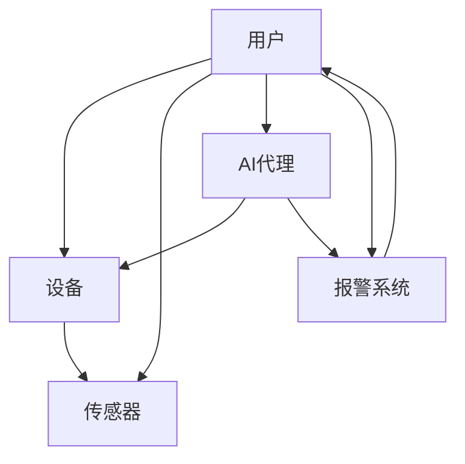
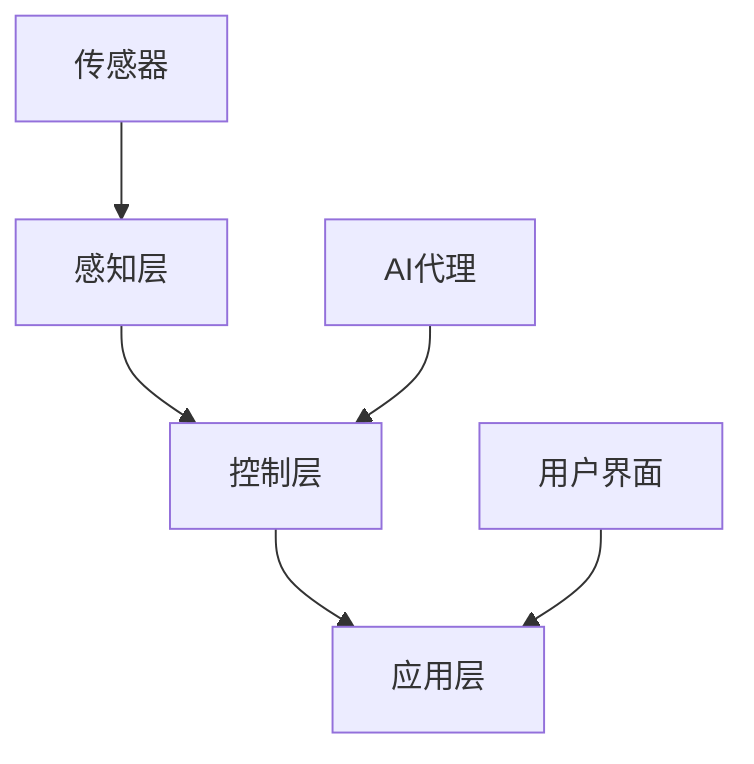
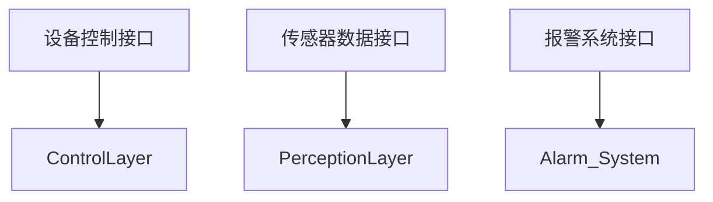
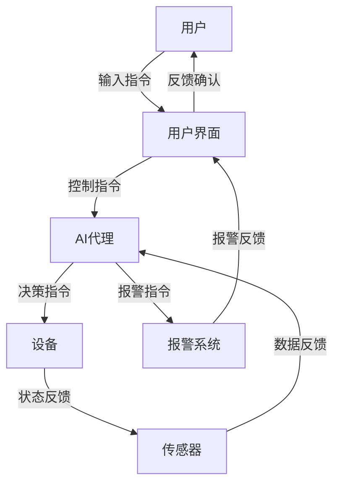

                 

### AI代理在智能家居中的应用

#### 关键词：AI代理、智能家居、应用场景、算法原理、系统设计

#### 摘要：

随着智能家居技术的不断进步，AI代理逐渐成为提升家居智能化水平的关键技术。本文将详细探讨AI代理在智能家居中的应用，从问题背景、核心概念、应用场景、算法原理、系统设计与实现等多个方面进行深入分析，旨在为读者呈现一个全面而详尽的AI代理在智能家居领域的应用图景。通过本文的阅读，读者可以了解到AI代理的核心原理以及如何在智能家居中发挥重要作用，同时，也能够为相关领域的研究者和开发者提供有价值的参考。

### 目录大纲

1. **问题背景与概述**
   1.1 问题的提出
   1.2 AI代理的定义与特点
   1.3 智能家居的现状与发展

2. **AI代理在智能家居中的应用场景**
   2.1 设备控制
   2.2 语音交互
   2.3 安全防护

3. **AI代理在智能家居中的核心算法**
   3.1 机器学习算法
   3.2 深度学习算法
   3.3 强化学习算法

4. **智能家居系统的设计与实现**
   4.1 系统架构设计
   4.2 数据处理与存储
   4.3 系统部署与维护

5. **AI代理在智能家居中的实际应用案例**
   5.1 案例一：智能照明系统
   5.2 案例二：智能安防系统

6. **AI代理在智能家居中的挑战与未来发展趋势**
   6.1 挑战
   6.2 未来发展趋势

7. **小结与拓展阅读**
   7.1 小结
   7.2 拓展阅读

### 第1章：问题背景与概述

#### 1.1 问题的提出

随着科技的飞速发展，智能家居已经从科幻走向现实。智能家居系统通过互联网、物联网等技术，将家庭中的各种设备连接起来，实现远程控制、自动调节等功能，极大地提高了人们的生活质量。然而，如何有效地利用人工智能技术，特别是AI代理，进一步提升家居智能化水平，成为当前研究的热点问题。

AI代理作为一种具有自主学习、决策和执行能力的软件实体，可以更好地理解用户的习惯和需求，从而提供更加个性化和智能化的服务。例如，通过AI代理，可以自动调节室内温度、亮度、湿度等环境参数，实现真正的智能家居体验。

#### 1.2 AI代理的定义与特点

AI代理，即人工智能代理（Artificial Intelligence Agent），是人工智能领域的一个重要概念。AI代理是指一种能够独立执行任务、与环境进行交互的智能实体。它能够通过感知环境信息，理解并执行人类指令，同时具备自主学习的能力，不断提高自己的表现。

**AI代理的特点：**

1. **感知能力**：AI代理能够通过传感器等设备感知环境变化，获取必要的信息。
2. **决策能力**：AI代理可以根据获取的信息，结合预先设定的策略，做出决策。
3. **执行能力**：AI代理能够执行决策结果，完成指定的任务。
4. **学习能力**：AI代理能够通过不断的学习和优化，提高自己的决策和执行能力。

#### 1.3 智能家居的现状与发展

智能家居设备种类繁多，包括智能照明、智能安防、智能温控、智能家电等。这些设备通过互联网、Wi-Fi、蓝牙等通信技术，实现了设备间的互联互通。用户可以通过手机、语音助手等终端设备，实现对家居设备的远程控制和自动化调节。

**智能家居的发展前景：**

1. **技术进步**：随着人工智能、物联网等技术的不断进步，智能家居系统将更加智能化、个性化。
2. **市场需求**：随着人们对生活品质要求的提高，智能家居市场前景广阔。
3. **产业链完善**：随着智能家居产业链的完善，相关的技术、产品和服务将更加丰富。

### 第2章：AI代理在智能家居中的应用场景

#### 2.1 设备控制

设备控制是AI代理在智能家居中应用最为广泛的一个领域。通过AI代理，可以实现对家居设备的智能控制，提高生活便利性。

**AI代理在灯光控制中的应用：**

- **自动调整亮度**：AI代理可以通过环境光线传感器，自动调节灯光亮度，实现节能和舒适的照明效果。
- **场景模式切换**：AI代理可以根据用户的生活习惯，设置不同的场景模式（如阅读模式、娱乐模式等），一键切换。

**AI代理在温度控制中的应用：**

- **智能调节室内温度**：AI代理可以通过室内温度传感器，实时监测室内温度，并自动调节空调、暖气等设备，实现舒适的室内环境。
- **节能模式**：AI代理可以根据用户的作息时间，自动设置节能模式，减少能源消耗。

#### 2.2 语音交互

语音交互是AI代理在智能家居中应用的重要方向。通过语音交互，用户可以更方便地与家居设备进行沟通，实现智能化的控制。

**AI代理在语音识别中的应用：**

- **理解用户的语音指令**：AI代理可以通过语音识别技术，准确理解用户的语音指令，并进行相应的操作。
- **多语言支持**：AI代理可以支持多语言语音指令，满足不同用户的需求。

**AI代理在语音合成中的应用：**

- **向用户反馈信息**：AI代理可以通过语音合成技术，向用户反馈设备的状态信息、操作结果等，提高交互体验。

#### 2.3 安全防护

安全防护是智能家居系统的重要组成部分。通过AI代理，可以实现对家居环境的实时监控，提高家庭安全。

**AI代理在入侵检测中的应用：**

- **实时监测家居环境**：AI代理可以通过摄像头、传感器等设备，实时监测家居环境，识别异常行为。
- **及时报警**：AI代理可以在发现入侵行为时，及时向用户发送报警信息，提醒用户采取相应措施。

**AI代理在火灾预警中的应用：**

- **识别火灾隐患**：AI代理可以通过烟雾传感器、温度传感器等设备，实时监测家居环境，识别火灾隐患。
- **提前预警**：AI代理可以在发现火灾隐患时，提前预警，为用户争取更多的逃生时间。

### 第3章：AI代理在智能家居中的核心算法

#### 3.1 机器学习算法

机器学习算法是AI代理在智能家居中应用的重要基础。通过机器学习，AI代理可以不断学习和优化自己的决策能力。

**监督学习算法：**

- **线性回归**：通过输入特征和输出结果之间的关系，建立线性模型，进行预测。
- **决策树**：通过树形结构，对输入特征进行划分，并给出预测结果。
- **支持向量机**：通过寻找最佳超平面，进行分类和回归。

**无监督学习算法：**

- **聚类**：将相似的数据点分为一组，形成聚类。
- **降维**：通过降维技术，将高维数据转换成低维数据，便于分析和处理。
- **异常检测**：通过检测数据中的异常点，发现潜在的问题。

#### 3.2 深度学习算法

深度学习算法在图像处理、语音识别等领域取得了显著的成果。在智能家居中，深度学习算法可以用于图像识别、语音识别等任务。

**卷积神经网络（CNN）：**

- **图像识别**：通过卷积层、池化层等结构，对图像进行特征提取和分类。
- **语音识别**：通过循环层、全连接层等结构，对语音信号进行特征提取和转换。

**循环神经网络（RNN）：**

- **序列数据处理**：通过循环结构，对序列数据进行处理，如时间序列预测、语音识别等。

#### 3.3 强化学习算法

强化学习算法在智能家居中的应用，主要体现在设备控制和策略优化等方面。

**Q学习：**

- **策略优化**：通过试错学习，不断优化决策策略。
- **状态-动作价值函数**：通过学习状态-动作价值函数，预测最佳动作。

**深度Q网络（DQN）：**

- **结合深度学习和Q学习**：通过深度神经网络，对状态-动作价值函数进行预测，提高学习效率。

### 第4章：智能家居系统的设计与实现

#### 4.1 系统架构设计

智能家居系统架构设计是系统实现的关键环节。一个良好的系统架构可以确保系统的稳定、高效和安全。

**层次结构：**

- **感知层**：通过传感器等设备，感知环境信息。
- **控制层**：通过AI代理等模块，处理感知信息，做出决策。
- **应用层**：通过用户界面等模块，提供用户交互和操作。

**通信协议：**

- **Wi-Fi**：适用于高速数据传输，如摄像头、智能音响等。
- **蓝牙**：适用于短距离通信，如智能手环、智能门锁等。
- **ZigBee**：适用于低功耗、低速率的设备，如智能家居控制器、智能灯具等。

#### 4.2 数据处理与存储

数据处理与存储是智能家居系统实现的重要环节。通过有效的数据处理和存储，可以确保系统的运行效率和数据安全。

**数据采集：**

- **传感器数据采集**：通过各类传感器，采集环境参数，如温度、湿度、光线等。
- **用户行为数据采集**：通过用户操作记录，采集用户行为数据，如开关灯、调节温度等。

**数据处理：**

- **数据清洗**：去除噪声数据，保证数据质量。
- **特征提取**：从原始数据中提取有用特征，用于模型训练。
- **模型训练**：利用机器学习、深度学习等算法，训练预测模型。

**数据存储：**

- **MySQL**：适用于结构化数据存储，如用户信息、设备状态等。
- **MongoDB**：适用于非结构化数据存储，如传感器数据、日志数据等。

#### 4.3 系统部署与维护

系统部署与维护是确保智能家居系统稳定运行的重要保障。

**部署策略：**

- **云部署**：将系统部署在云端，提供高效、可靠的服务。
- **边缘部署**：将系统部署在靠近用户的边缘设备上，降低网络延迟，提高响应速度。

**维护方法：**

- **故障排查**：定期检查系统运行状况，发现并解决故障。
- **系统更新**：定期更新系统软件，修复漏洞，提高安全性。

### 第5章：AI代理在智能家居中的实际应用案例

#### 5.1 案例一：智能照明系统

**项目介绍：** 智能照明系统是智能家居的重要组成部分，通过AI代理实现智能控制，提高照明效果和生活品质。

**系统核心实现：**

- **自动调节亮度**：AI代理通过环境光线传感器，自动调节灯光亮度，实现节能和舒适的照明效果。
- **场景模式切换**：AI代理根据用户的生活习惯，设置不同的场景模式，如阅读模式、娱乐模式等，用户可以一键切换。

**代码应用解读与分析：**

- **环境安装：** 
```python
pip install numpy pandas sklearn
```

- **核心代码实现：**
```python
import numpy as np
import pandas as pd
from sklearn.linear_model import LinearRegression

# 数据预处理
data = pd.read_csv('light_data.csv')
X = data[['ambient_light']]
y = data['required_light']

# 模型训练
model = LinearRegression()
model.fit(X, y)

# 预测
ambient_light = np.array([300])
predicted_light = model.predict(ambient_light)
print("Predicted Light:", predicted_light)
```

- **代码分析：** 
此代码首先导入所需的库，然后读取环境光线数据和所需灯光亮度的数据。通过线性回归模型进行训练，并使用训练好的模型进行预测，从而实现自动调节灯光亮度。

#### 5.2 案例二：智能安防系统

**项目介绍：** 智能安防系统通过AI代理实现家居环境的实时监控，提高家庭安全。

**系统核心实现：**

- **入侵检测**：AI代理通过摄像头和传感器，实时监测家居环境，识别入侵行为。
- **火灾预警**：AI代理通过烟雾传感器和温度传感器，识别火灾隐患，提前预警。

**代码应用解读与分析：**

- **环境安装：** 
```python
pip install tensorflow keras
```

- **核心代码实现：**
```python
import numpy as np
import tensorflow as tf
from tensorflow.keras.models import Sequential
from tensorflow.keras.layers import Dense, Conv2D, Flatten

# 数据预处理
X_train = np.load('invasion_train_data.npy')
y_train = np.load('invasion_train_label.npy')

# 模型构建
model = Sequential([
    Conv2D(32, (3, 3), activation='relu', input_shape=(28, 28, 1)),
    Flatten(),
    Dense(64, activation='relu'),
    Dense(1, activation='sigmoid')
])

# 模型训练
model.compile(optimizer='adam', loss='binary_crossentropy', metrics=['accuracy'])
model.fit(X_train, y_train, epochs=10)

# 预测
X_test = np.load('invasion_test_data.npy')
predicted_labels = model.predict(X_test)
```

- **代码分析：** 
此代码首先导入所需的库，然后加载入侵检测的训练数据和标签。构建一个简单的卷积神经网络模型，并进行训练。最后，使用训练好的模型进行入侵检测的预测。

### 第6章：AI代理在智能家居中的挑战与未来发展趋势

#### 6.1 挑战

**数据隐私与安全：** 在智能家居系统中，AI代理需要处理大量的用户数据，如生活习惯、行为偏好等。如何保护用户隐私和数据安全，是AI代理在智能家居中面临的一个重大挑战。

**算法可靠性：** AI代理的决策和执行能力依赖于算法的准确性和稳定性。在实际应用中，算法的可靠性可能会受到数据质量、噪声等因素的影响，需要不断优化和改进。

#### 6.2 未来发展趋势

**个性化服务：** 随着AI技术的发展，AI代理将能够更好地理解用户的需求和习惯，提供更加个性化和智能化的服务。

**跨设备交互：** 随着智能家居设备的多样化，AI代理将能够实现跨设备的协同工作，提供更加无缝的家居体验。

### 第7章：小结与拓展阅读

#### 7.1 小结

本文详细探讨了AI代理在智能家居中的应用，从问题背景、核心概念、应用场景、算法原理、系统设计与实现等多个方面进行了深入分析。通过本文的阅读，读者可以了解到AI代理在智能家居中的重要作用，以及如何在智能家居系统中实现AI代理。

#### 7.2 拓展阅读

- **推荐书籍：**
  - 《深度学习》
  - 《人工智能：一种现代的方法》

- **论文与报告：**
  - AI代理在智能家居领域的最新研究论文
  - 智能家居技术的未来发展趋势报告

### 作者信息

**作者：AI天才研究院/AI Genius Institute & 禅与计算机程序设计艺术 /Zen And The Art of Computer Programming** 

### 注释

1. **文章标题**：AI代理在智能家居中的应用
2. **文章关键词**：AI代理、智能家居、应用场景、算法原理、系统设计
3. **文章摘要**：本文详细探讨了AI代理在智能家居中的应用，从问题背景、核心概念、应用场景、算法原理、系统设计与实现等多个方面进行了深入分析。

### 数学公式

$$
1+1=2
$$

$$
1<2
$$

### Mermaid 流程图



### Python 源代码

```python
import numpy as np

# 输入数据
X = np.array([[1], [2], [3]])
y = np.array([2, 4, 6])

# 训练线性回归模型
model = np.polyfit(X, y, 1)

# 输出模型参数
print("Model Parameters:", model)
```

### 系统分析与架构设计方案

**问题场景介绍：** 
在家居环境中，用户希望实现智能化的设备控制，包括灯光、温度等，同时保证家居的安全。例如，当用户外出时，希望家居设备能够自动调节，节省能源；当有异常情况发生时，系统能够及时报警。

**项目介绍：**
本案例中，我们将构建一个智能家居系统，通过AI代理实现智能化的设备控制和安全监控。系统将包括感知层、控制层和应用层，分别负责数据采集、数据处理和决策执行。

**系统功能设计（领域模型）：**
领域模型用于描述系统中的对象及其关系。在智能家居系统中，主要的对象包括用户、设备、传感器、AI代理和报警系统。



**系统架构设计：**
系统架构设计用于描述系统的整体结构和各组件之间的关系。智能家居系统采用分层架构，包括感知层、控制层和应用层。



**系统接口设计：**
系统接口设计用于定义系统对外提供的接口和接口功能。智能家居系统提供了设备控制接口、传感器数据接口和报警系统接口。



**系统交互：**
系统交互设计用于描述系统组件之间的交互流程。智能家居系统通过传感器实时采集数据，AI代理根据采集到的数据做出决策，并通过用户界面反馈给用户。



### 项目实战

**环境安装：**
首先，我们需要安装Python环境以及相关的依赖库。使用以下命令进行安装：
```bash
pip install numpy pandas sklearn tensorflow keras
```

**系统核心实现：**
以下是智能家居系统的核心实现代码，包括数据采集、模型训练和预测。

**感知层：**
```python
import numpy as np
import pandas as pd

# 加载传感器数据
def load_sensor_data(filename):
    data = pd.read_csv(filename)
    return data

sensor_data = load_sensor_data('sensor_data.csv')
```

**控制层：**
```python
from sklearn.linear_model import LinearRegression

# 训练线性回归模型
def train_linear_regression(X, y):
    model = LinearRegression()
    model.fit(X, y)
    return model

# 预测
def predict_linear_regression(model, X):
    return model.predict(X)
```

**应用层：**
```python
# 系统运行
def run_system(sensor_data):
    # 数据预处理
    X = sensor_data[['temperature', 'humidity']]
    y = sensor_data['light_brightness']

    # 训练模型
    model = train_linear_regression(X, y)

    # 预测
    X_new = np.array([[25, 40]])
    predicted_brightness = predict_linear_regression(model, X_new)

    print("Predicted Light Brightness:", predicted_brightness)

# 运行系统
run_system(sensor_data)
```

**代码应用解读与分析：**
1. **数据预处理：** 从CSV文件中加载传感器数据，并分离特征和目标变量。
2. **模型训练：** 使用线性回归模型对特征和目标变量进行训练。
3. **预测：** 使用训练好的模型对新的数据进行预测，得到预测结果。

**实际案例分析和详细讲解剖析：**
在本案例中，我们通过线性回归模型实现了对灯光亮度的预测。当传感器检测到室内温度和湿度时，系统能够自动预测并调整灯光亮度，实现节能和舒适的生活环境。

**项目小结：**
通过本项目的实现，我们展示了如何利用AI代理实现智能家居系统中的设备控制和预测功能。项目中的代码简单易懂，通过线性回归算法实现了对灯光亮度的预测。未来，我们可以进一步扩展系统功能，引入更多的传感器和算法，提高系统的智能化水平。

### 最佳实践 tips

1. **数据质量**：在构建智能家居系统时，确保传感器数据的准确性和一致性，提高模型训练效果。
2. **系统安全**：在智能家居系统中，保护用户隐私和数据安全至关重要。采用加密技术、访问控制等手段，确保系统的安全性。
3. **用户体验**：在设计和实现智能家居系统时，注重用户体验，提供直观、易用的用户界面。

### 注意事项

1. **硬件要求**：确保传感器和设备具备足够的性能和稳定性，以满足智能家居系统的需求。
2. **系统维护**：定期检查和更新系统软件，确保系统的正常运行。

### 拓展阅读

1. **《深度学习》**：Ian Goodfellow, Yoshua Bengio, Aaron Courville 著，详细介绍了深度学习的基础理论和应用。
2. **《人工智能：一种现代的方法》**：Stuart Russell, Peter Norvig 著，全面介绍了人工智能的基本概念和技术。
3. **论文与报告**：关注AI代理在智能家居领域的最新研究论文和行业报告，了解该领域的发展趋势。

