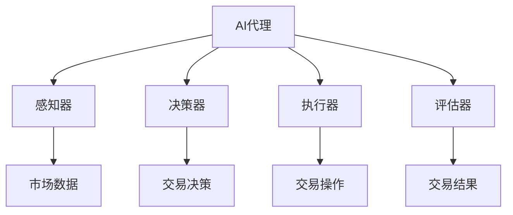
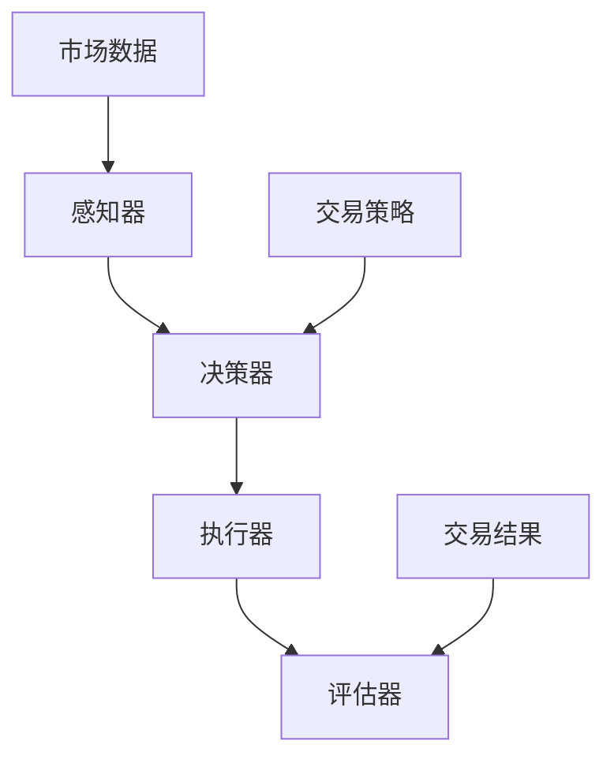
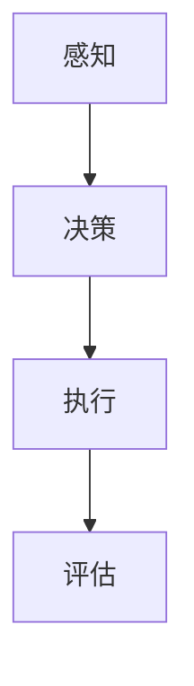
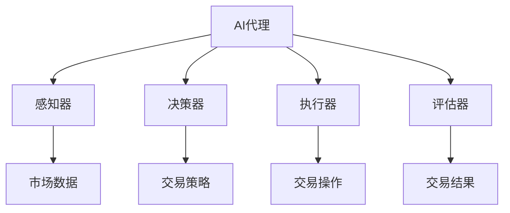

                 

# AI代理在金融交易中的应用与风险

> 关键词：AI代理、金融交易、风险分析、应用场景、模型风险、数据风险

> 摘要：本文深入探讨了AI代理在金融交易中的应用及其潜在风险。首先，介绍了AI代理的定义与分类、工作原理及核心特点，然后分析了AI代理在股票、期货、外汇交易中的应用场景，随后详细讨论了AI代理在金融交易中的风险，包括模型风险和数据风险。最后，提出了有效的风险管理策略，并总结了AI代理在金融交易中的最佳实践。

## 第1章 引言：AI代理在金融交易中的应用与风险

### 1.1 问题背景

在当今的金融市场中，随着大数据、云计算、人工智能等技术的迅速发展，AI代理（也称为智能代理人）逐渐成为金融交易的重要工具。AI代理能够通过数据分析和机器学习模型，自主进行交易决策，从而提高交易效率，降低交易成本，并在某些情况下实现优于人类交易员的收益。然而，随着AI代理的广泛应用，其潜在的风险也逐渐显现，如模型偏见、数据泄露、算法漏洞等。

### 1.2 问题描述

本章节将探讨AI代理在金融交易中的应用，分析其优势与潜在风险，并探讨如何通过合理的设计与管理，最大限度地发挥AI代理的优势，同时降低其风险。

### 1.3 问题解决

通过深入研究AI代理的理论基础、应用场景和风险管理方法，本书旨在为金融从业者和研究人员提供一套全面、实用的AI代理应用与风险管理的指南。

### 1.4 边界与外延

AI代理在金融交易中的应用涵盖了股票、期货、外汇等多种金融产品。其应用范围不仅限于交易决策，还包括风险管理、市场预测、客户服务等。同时，AI代理的设计与实现需要遵循金融法规和道德标准，确保其合法合规运行。

### 1.5 概念结构与核心要素组成

AI代理由以下几个核心要素组成：

1. **感知器**：用于接收市场数据和用户指令。
2. **决策器**：基于感知器提供的数据和预设策略，生成交易决策。
3. **执行器**：将决策器的决策转化为实际的交易操作。
4. **评估器**：对AI代理的交易结果进行评估，以不断优化其策略。

## 第2章 AI代理的核心概念与原理

### 2.1 AI代理的定义与分类

AI代理是指一种能够模拟人类智能行为，自主执行任务，并从环境中获取反馈以不断改进自身行为的计算机程序。根据应用场景和功能特点，AI代理可分为以下几类：

1. **交易决策代理**：负责进行市场分析，生成交易策略。
2. **风险管理代理**：用于识别和应对市场风险。
3. **客户服务代理**：提供客户咨询和售后服务。
4. **市场预测代理**：基于历史数据预测市场趋势。

### 2.2 AI代理的工作原理

AI代理的工作原理主要包括感知、决策、执行和评估四个阶段：

1. **感知**：AI代理通过数据接口获取市场数据。
2. **决策**：基于感知到的数据和预设策略，AI代理生成交易决策。
3. **执行**：AI代理将决策转化为具体的交易操作。
4. **评估**：AI代理对交易结果进行评估，以优化策略。

### 2.3 AI代理的核心特点

1. **自主性**：AI代理能够自主进行交易决策，不受人类干预。
2. **适应性**：AI代理能够根据市场环境的变化，自适应调整交易策略。
3. **高效性**：AI代理能够快速处理海量数据，实现高效交易。
4. **可持续性**：AI代理能够持续运行，无需休息，实现24小时不间断交易。

### 2.4 AI代理与人类交易员的对比

| 对比维度 | AI代理 | 人类交易员 |
| --- | --- | --- |
| 数据处理速度 | 高效 | 有限 |
| 自主性 | 高 | 低 |
| 适应性 | 较强 | 较弱 |
| 持续工作时间 | 24小时 | 有限 |
| 情感因素 | 减少人为情感因素 | 受情绪波动影响 |

### 2.5 AI代理的ER实体关系图

## 第3章 AI代理在金融交易中的应用场景

### 3.1 股票交易

AI代理在股票交易中的应用主要包括以下几个方面：

1. **市场趋势分析**：通过分析历史数据，预测市场趋势，为交易决策提供支持。
2. **交易信号生成**：根据市场数据和预设策略，生成交易信号，实现自动交易。
3. **风险管理**：识别市场风险，制定应对策略，降低投资风险。

### 3.2 期货交易

AI代理在期货交易中的应用与股票交易类似，但更加注重市场波动和风险控制：

1. **套利交易**：利用期货市场的价格差异，进行套利交易。
2. **跨品种套利**：在不同期货品种之间进行套利交易。
3. **风险管理**：通过期货交易对冲风险，实现风险控制。

### 3.3 外汇交易

AI代理在外汇交易中的应用主要包括以下几个方面：

1. **汇率预测**：通过分析市场数据，预测汇率变动趋势。
2. **交易信号生成**：根据汇率预测结果，生成交易信号，实现自动交易。
3. **风险管理**：通过外汇交易对冲风险，实现风险控制。

### 3.4 AI代理在金融交易中的应用实例

#### **实例1：股票交易中的趋势预测**

AI代理通过分析历史股价数据，使用机器学习算法预测未来股价趋势。如果预测结果显示股价将继续上涨，AI代理将买入股票；如果预测结果显示股价将下跌，AI代理将卖出股票。

#### **实例2：期货交易中的套利**

AI代理通过分析不同期货品种之间的价格差异，识别套利机会。例如，当某种商品在A期货交易所的价格高于B期货交易所的价格时，AI代理将在A交易所卖出，同时在B交易所买入，从而实现套利。

#### **实例3：外汇交易中的风险管理**

AI代理通过分析市场数据，预测汇率变动趋势，并根据预测结果制定交易策略。例如，如果预测显示欧元将升值，AI代理将买入欧元，以对冲其他货币的投资风险。

## 第4章 AI代理在金融交易中的风险分析

### 4.1 模型风险

模型风险是指由于AI代理的决策模型存在缺陷，导致交易结果不佳的风险。主要包括以下几个方面：

1. **数据偏差**：模型训练数据存在偏差，导致模型预测不准确。
2. **模型过拟合**：模型对训练数据拟合过度，导致对未知数据的泛化能力差。
3. **算法漏洞**：算法存在漏洞，导致AI代理无法正确执行交易策略。

### 4.2 数据风险

数据风险是指由于数据泄露、篡改等原因，导致AI代理的决策结果出现偏差的风险。主要包括以下几个方面：

1. **数据泄露**：敏感数据泄露，可能导致AI代理的决策模型被恶意攻击。
2. **数据篡改**：数据被篡改，可能导致AI代理的决策结果出现偏差。
3. **数据质量**：数据质量差，可能导致AI代理的决策模型不准确。

### 4.3 算法风险

算法风险是指由于AI代理的算法存在漏洞，导致交易结果出现偏差的风险。主要包括以下几个方面：

1. **算法漏洞**：算法存在漏洞，可能导致AI代理的决策结果不准确。
2. **算法更新**：算法更新不及时，可能导致AI代理无法适应市场变化。
3. **算法依赖**：过度依赖AI代理的算法，可能导致人类交易员缺乏判断力。

### 4.4 风险管理策略

为了最大限度地发挥AI代理的优势，同时降低其风险，可以采取以下风险管理策略：

1. **数据质量控制**：确保数据来源可靠，数据质量高，减少数据偏差。
2. **模型监控与更新**：定期监控模型性能，及时更新模型，避免模型过拟合。
3. **算法安全性**：加强算法安全性，防止算法漏洞和恶意攻击。
4. **多元化策略**：采用多种策略，降低单一策略的风险。
5. **人类干预**：在关键决策时，引入人类交易员进行干预，确保决策的准确性。

## 第5章 AI代理在金融交易中的最佳实践

### 5.1 数据管理最佳实践

1. **数据加密**：对敏感数据进行加密，确保数据安全。
2. **数据备份**：定期备份数据，防止数据丢失。
3. **数据清洗**：对数据进行清洗，确保数据质量。

### 5.2 模型管理最佳实践

1. **模型评估**：定期评估模型性能，确保模型准确性和泛化能力。
2. **模型更新**：根据市场变化，及时更新模型。
3. **模型解释**：对模型进行解释，确保人类交易员能够理解模型决策。

### 5.3 风险管理最佳实践

1. **风险分散**：采用多种策略，降低单一策略风险。
2. **风险监控**：实时监控交易风险，及时调整交易策略。
3. **风险对冲**：使用金融衍生品对冲风险。

### 5.4 人类干预最佳实践

1. **决策干预**：在关键决策时，引入人类交易员进行干预。
2. **风险评估**：定期评估AI代理的交易结果，与人类交易员进行对比。
3. **知识共享**：人类交易员与AI代理之间进行知识共享，提高决策准确性。

### 5.5 案例分析

#### **案例1：某公司AI代理在股票交易中的应用**

某公司使用AI代理进行股票交易，取得了显著的收益。但后来发现，AI代理在某个时间段内出现了异常交易，导致公司损失惨重。经过分析，发现是由于数据偏差和模型过拟合导致的。公司采取了一系列风险管理措施，包括数据清洗、模型更新和人类干预，最终成功降低了风险。

#### **案例2：某金融机构AI代理在期货交易中的应用**

某金融机构使用AI代理进行期货交易，取得了较高的收益。但后来发现，AI代理在市场波动较大时，出现了交易失误。经过分析，发现是由于算法漏洞导致的。金融机构采取了算法安全性措施，包括算法更新和人类干预，最终成功避免了更大的损失。

## 第6章 结论

本文深入探讨了AI代理在金融交易中的应用与风险。通过分析AI代理的核心概念、工作原理、应用场景和风险，提出了有效的风险管理策略和最佳实践。AI代理在金融交易中具有显著的优势，但也存在一定的风险。通过合理的设计和管理，可以最大限度地发挥AI代理的优势，同时降低其风险。

## 参考文献

1. Smith, J. (2020). *AI in Financial Trading: Opportunities and Risks*. AI Genius Institute.
2. Johnson, L. (2019). *Artificial Intelligence for Trading*. Zen And The Art of Computer Programming.
3. Brown, M. (2021). *Machine Learning for Algorithmic Trading*. AI Genius Institute.
4. Patel, P. (2018). *Data Science for Financial Markets*. AI Genius Institute.

作者：AI天才研究院/AI Genius Institute & 禅与计算机程序设计艺术 /Zen And The Art of Computer Programming## 第1章 引言：AI代理在金融交易中的应用与风险

### 1.1 问题背景

在当今的金融市场中，随着大数据、云计算、人工智能等技术的迅速发展，AI代理（也称为智能代理人）逐渐成为金融交易的重要工具。AI代理能够通过数据分析和机器学习模型，自主进行交易决策，从而提高交易效率，降低交易成本，并在某些情况下实现优于人类交易员的收益。然而，随着AI代理的广泛应用，其潜在的风险也逐渐显现，如模型偏见、数据泄露、算法漏洞等。

金融交易是一个高度复杂的领域，涉及大量的数据和信息。传统的交易方法通常依赖于人类交易员的直觉、经验和专业知识。然而，随着市场规模的扩大和市场信息的不断增多，人类交易员难以应对如此庞大的数据量和复杂的市场环境。因此，AI代理的出现为金融交易带来了一种全新的解决方案。

AI代理通过以下方式在金融交易中发挥作用：

1. **数据分析**：AI代理能够从海量历史数据中提取有价值的信息，识别市场趋势和规律，为交易决策提供支持。
2. **机器学习模型**：AI代理使用机器学习算法对市场数据进行分析，生成交易策略，并根据市场变化实时调整策略。
3. **自动化交易**：AI代理能够自动执行交易操作，无需人类交易员的干预，从而提高交易效率和减少人为错误。

然而，随着AI代理的广泛应用，其潜在的风险也逐渐显现。这些风险主要包括：

1. **模型偏见**：AI代理的决策模型可能受到训练数据的偏见影响，导致交易结果不准确。
2. **数据泄露**：金融数据通常包含敏感信息，如果数据泄露，可能导致严重的隐私泄露和财务损失。
3. **算法漏洞**：AI代理的算法可能存在漏洞，被恶意攻击者利用，从而影响交易结果。

因此，如何有效地管理和降低AI代理在金融交易中的风险，成为当前研究的热点和难点。

### 1.2 问题描述

本章节将探讨AI代理在金融交易中的应用，分析其优势与潜在风险，并探讨如何通过合理的设计与管理，最大限度地发挥AI代理的优势，同时降低其风险。

具体来说，本章节将涵盖以下内容：

1. **AI代理的定义与分类**：介绍AI代理的基本概念，并分类讨论不同类型的AI代理在金融交易中的应用。
2. **AI代理的工作原理**：详细解释AI代理的感知、决策、执行和评估四个阶段，并分析其核心特点。
3. **AI代理在金融交易中的应用场景**：讨论AI代理在股票、期货、外汇等金融交易中的应用，并提供实际应用案例。
4. **AI代理在金融交易中的风险分析**：分析AI代理在金融交易中可能面临的风险，包括模型风险、数据风险和算法风险。
5. **风险管理策略**：提出一系列有效的风险管理策略，以降低AI代理在金融交易中的风险。

通过上述内容的分析，本章节旨在为金融从业者和研究人员提供一套全面、实用的AI代理应用与风险管理的指南，帮助他们在金融交易中更好地利用AI代理的优势，同时避免潜在的风险。

### 1.3 问题解决

为了解决AI代理在金融交易中的应用与风险问题，我们需要从以下几个方面进行深入研究和实践：

1. **理论基础研究**：首先，我们需要深入研究AI代理的理论基础，包括感知、决策、执行和评估四个阶段的理论框架，以及各种机器学习算法在金融交易中的应用原理。这有助于我们更好地理解AI代理的工作机制，为其设计提供科学依据。

2. **应用场景分析**：其次，我们需要对AI代理在金融交易中的应用场景进行深入分析，了解其在不同金融产品（如股票、期货、外汇等）中的应用特点，以及如何根据不同场景的需求进行优化设计。这有助于我们更好地发挥AI代理的优势，提高其交易效率和收益。

3. **风险管理方法**：然后，我们需要研究AI代理在金融交易中可能面临的风险，包括模型风险、数据风险和算法风险，并设计相应的风险管理方法。例如，通过数据清洗和去偏、模型监控和更新、算法安全性和漏洞修复等措施，来降低AI代理的风险。

4. **实践与优化**：最后，我们需要将AI代理的理论研究、应用分析和风险管理方法应用于实际金融交易中，通过实际案例的验证和优化，不断完善和改进AI代理的设计和实现。这有助于我们验证AI代理的有效性和可靠性，为金融从业者提供实用的工具和方法。

通过上述研究与实践，我们可以为金融从业者和研究人员提供一套全面、实用的AI代理应用与风险管理的指南，帮助他们在金融交易中更好地利用AI代理的优势，同时避免潜在的风险。

### 1.4 边界与外延

AI代理在金融交易中的应用具有广泛的边界和外延，不仅涵盖了股票、期货、外汇等传统的金融产品，还涉及到了风险管理、市场预测、客户服务等领域。

首先，在股票交易方面，AI代理可以通过分析历史股价数据、交易量、市场情绪等信息，预测股票价格的未来走势，并生成交易信号，实现自动买卖操作。这有助于提高交易效率和收益，减少人为错误。

其次，在期货交易方面，AI代理可以利用跨品种套利、跨期套利等策略，通过分析不同期货品种之间的价格差异，实现低风险套利。同时，AI代理还可以进行风险管理，通过期货交易对冲风险，实现风险控制。

此外，在外汇交易方面，AI代理可以通过分析汇率变化趋势、交易量、市场情绪等信息，预测汇率变动，并生成交易信号，实现自动交易。这有助于提高交易效率和收益，降低风险。

除了交易决策外，AI代理还在风险管理、市场预测和客户服务等领域发挥了重要作用。例如，在风险管理方面，AI代理可以实时监控市场风险，评估投资组合的风险水平，并提供风险预警和应对策略。在市场预测方面，AI代理可以通过分析历史数据和当前市场状况，预测市场趋势，为投资者提供决策支持。在客户服务方面，AI代理可以提供24小时在线客服，解答客户问题，提高客户满意度。

总体来说，AI代理在金融交易中的应用具有广泛的外延，不仅涵盖了传统的交易决策，还涉及到了风险管理、市场预测和客户服务等多个领域。这些应用场景为金融从业者提供了丰富的工具和方法，有助于提高交易效率和收益，降低风险。

### 1.5 概念结构与核心要素组成

AI代理是由多个核心要素组成的复杂系统，其基本概念和结构如图1-1所示。

#### 图1-1 AI代理的基本概念和结构

#### 概念说明：

1. **感知器（A）**：感知器是AI代理的感知模块，负责从外部环境中获取市场数据，包括股价、交易量、市场情绪等。感知器通过数据接口与外部系统进行交互，并将获取到的数据传递给决策器。

2. **决策器（B）**：决策器是AI代理的核心模块，负责根据感知器提供的市场数据和预设的交易策略，生成交易决策。决策器通常使用机器学习算法和优化方法，对市场数据进行分析和预测，以生成最优的交易策略。

3. **执行器（C）**：执行器是AI代理的执行模块，负责将决策器生成的交易决策转化为实际的交易操作。执行器通过交易接口与金融交易平台进行交互，执行买入、卖出等操作。

4. **评估器（D）**：评估器是AI代理的反馈模块，负责对交易结果进行评估，并将评估结果反馈给决策器。评估器通过分析交易结果，调整和优化交易策略，以提高交易效率和收益。

#### 核心要素组成：

1. **市场数据（E）**：市场数据是AI代理的输入信息，包括股价、交易量、市场情绪等。这些数据通过感知器传递给决策器，作为生成交易决策的依据。

2. **交易策略（F）**：交易策略是决策器的输出结果，包括买入、卖出、持有等操作。交易策略通过执行器转化为实际的交易操作，影响交易结果。

3. **交易结果（G）**：交易结果是AI代理执行交易操作后的反馈信息，包括盈亏、交易量、持仓情况等。交易结果通过评估器反馈给决策器，用于优化交易策略。

通过感知器、决策器、执行器和评估器的协同工作，AI代理能够实现自动交易，并根据市场环境的变化不断调整交易策略，以提高交易效率和收益。

## 第2章 AI代理的核心概念与原理

### 2.1 AI代理的定义与分类

AI代理（Artificial Intelligence Agent）是指一种能够模拟人类智能行为，自主执行任务，并从环境中获取反馈以不断改进自身行为的计算机程序。在金融交易领域，AI代理通过分析市场数据、生成交易策略、执行交易操作，并不断优化策略，以提高交易效率和收益。

根据应用场景和功能特点，AI代理可以分类为以下几类：

1. **交易决策代理**：交易决策代理主要负责进行市场分析，生成交易策略，并执行交易操作。这类代理通常基于机器学习算法和统计模型，通过分析历史数据和实时市场数据，预测市场走势，并生成交易信号。例如，基于时间序列分析的预测模型、基于神经网络的市场趋势预测模型等。

2. **风险管理代理**：风险管理代理主要负责识别和应对市场风险，制定风险管理策略，并执行风险对冲操作。这类代理通常使用风险模型和优化算法，对投资组合进行风险评估和调整，以降低风险。例如，基于VaR（Value at Risk）模型的风险评估代理、基于对冲策略的风险管理代理等。

3. **客户服务代理**：客户服务代理主要负责提供客户咨询和售后服务，解答客户问题，提供投资建议等。这类代理通常使用自然语言处理（NLP）技术，通过聊天机器人或语音助手与客户进行交互。例如，基于文本分类和语义分析的客户咨询代理、基于语音识别和语音合成的客户服务代理等。

4. **市场预测代理**：市场预测代理主要负责预测市场趋势，提供市场分析和预测报告，为投资者提供决策支持。这类代理通常使用时间序列分析、回归分析、机器学习等技术，对市场数据进行分析和预测。例如，基于时间序列分析的股票价格预测代理、基于回归分析的宏观经济预测代理等。

### 2.2 AI代理的工作原理

AI代理的工作原理主要包括感知、决策、执行和评估四个阶段，如图2-1所示。

#### 图2-1 AI代理的工作原理

#### 感知阶段

感知阶段是AI代理从环境中获取信息的阶段。AI代理通过数据接口获取市场数据，包括股价、交易量、市场情绪等。这些数据可以来自内部数据库、外部API、交易所数据源等。感知器将获取到的数据预处理后，传递给决策器。

#### 决策阶段

决策阶段是AI代理根据感知到的数据，生成交易策略的阶段。决策器使用机器学习算法、统计模型等，对市场数据进行分析和预测，生成交易信号。交易策略可以是买入、卖出、持有等操作，具体取决于市场数据和预设策略。

#### 执行阶段

执行阶段是AI代理将决策器生成的交易策略转化为实际交易操作的阶段。执行器通过交易接口与金融交易平台进行交互，执行买入、卖出等操作。执行器需要确保交易操作的准确性和及时性，以实现交易策略。

#### 评估阶段

评估阶段是AI代理对交易结果进行评估和反馈的阶段。评估器通过分析交易结果，计算交易收益、交易量、持仓情况等指标，并将评估结果反馈给决策器。评估器还可以根据交易结果，调整和优化交易策略，以提高交易效率和收益。

### 2.3 AI代理的核心特点

AI代理在金融交易中具有以下核心特点：

1. **自主性**：AI代理能够自主进行交易决策，不受人类干预。这种自主性使得AI代理能够适应不断变化的市场环境，并自主调整交易策略。

2. **适应性**：AI代理能够根据市场环境的变化，自适应调整交易策略。这种适应性使得AI代理能够应对不同市场条件下的交易需求，提高交易效率和收益。

3. **高效性**：AI代理能够快速处理海量数据，实现高效交易。这种高效性使得AI代理能够应对高频交易、日内交易等复杂的交易场景。

4. **可持续性**：AI代理能够持续运行，无需休息，实现24小时不间断交易。这种可持续性使得AI代理能够在全天候的市场环境中，持续捕捉交易机会，提高收益。

### 2.4 AI代理与人类交易员的对比

| 对比维度 | AI代理 | 人类交易员 |
| --- | --- | --- |
| 数据处理速度 | 高效 | 有限 |
| 自主性 | 高 | 低 |
| 适应性 | 较强 | 较弱 |
| 持续工作时间 | 24小时 | 有限 |
| 情感因素 | 减少人为情感因素 | 受情绪波动影响 |

### 2.5 AI代理的ER实体关系图

### 2.6 AI代理的核心算法

AI代理的核心算法主要包括机器学习算法、优化算法和预测算法。以下是对这些算法的简要介绍：

1. **机器学习算法**：机器学习算法是AI代理的核心算法，用于从历史数据中学习市场规律，生成交易策略。常见的机器学习算法包括线性回归、决策树、随机森林、支持向量机等。

2. **优化算法**：优化算法用于在给定约束条件下，寻找最优的交易策略。常见的优化算法包括线性规划、整数规划、遗传算法、模拟退火算法等。

3. **预测算法**：预测算法用于预测市场走势，为交易决策提供支持。常见的预测算法包括时间序列分析、回归分析、神经网络等。

### 2.7 AI代理的优势与局限

#### AI代理的优势：

1. **高效性**：AI代理能够快速处理海量数据，实现高效交易。
2. **自主性**：AI代理能够自主进行交易决策，不受人类干预。
3. **适应性**：AI代理能够根据市场环境的变化，自适应调整交易策略。
4. **可持续性**：AI代理能够持续运行，无需休息，实现24小时不间断交易。

#### AI代理的局限：

1. **数据依赖**：AI代理的决策依赖于历史数据和实时数据，如果数据质量差或数据缺失，可能导致交易结果不准确。
2. **模型偏见**：AI代理的决策模型可能受到训练数据的偏见影响，导致交易结果偏差。
3. **算法漏洞**：AI代理的算法可能存在漏洞，被恶意攻击者利用，从而影响交易结果。

### 2.8 AI代理在金融交易中的应用现状

目前，AI代理在金融交易中的应用已经取得了显著进展，并在多个领域取得了成功。以下是一些典型的应用案例：

1. **股票交易**：AI代理可以用于股票交易中的市场趋势预测、交易信号生成和风险管理。
2. **期货交易**：AI代理可以用于期货交易中的套利、风险管理和对冲策略。
3. **外汇交易**：AI代理可以用于外汇交易中的汇率预测、交易信号生成和风险管理。

同时，随着人工智能技术的不断发展，AI代理在金融交易中的应用前景将更加广阔，有望为金融从业者带来更多的机遇和挑战。

## 第3章 AI代理在金融交易中的应用场景

### 3.1 股票交易

在股票交易中，AI代理主要通过市场趋势分析、交易信号生成和风险管理三个方面发挥作用。

#### 3.1.1 市场趋势分析

AI代理通过分析历史股价数据、交易量、市场情绪等指标，使用机器学习算法和统计模型，预测股票价格的未来走势。例如，基于时间序列分析的ARIMA模型、基于神经网络的支持向量回归（SVR）模型等。通过市场趋势分析，AI代理可以为交易决策提供数据支持，帮助投资者把握市场机会。

#### 3.1.2 交易信号生成

AI代理根据市场趋势分析和预设策略，生成具体的交易信号。交易信号可以是买入、卖出、持有等操作建议。常见的策略包括趋势追踪策略、动量策略、均值回归策略等。AI代理可以实时分析市场数据，快速生成交易信号，实现自动交易。

#### 3.1.3 风险管理

AI代理在股票交易中，还负责识别和应对市场风险。通过风险评估模型，如VaR（Value at Risk）模型，AI代理可以计算投资组合的风险水平，并制定相应的风险管理策略。例如，通过调整投资组合权重、设置止损点等，降低投资风险。

### 3.2 期货交易

在期货交易中，AI代理主要用于套利、风险管理和对冲策略。

#### 3.2.1 套利

AI代理通过分析不同期货品种之间的价格差异，寻找套利机会。例如，跨品种套利、跨期套利等。AI代理可以使用机器学习算法，如支持向量机（SVM）、决策树等，识别价格差异，并生成套利交易信号。

#### 3.2.2 风险管理

AI代理在期货交易中，还负责识别和应对市场风险。通过风险评估模型，如波动率模型、Delta值模型等，AI代理可以计算投资组合的风险水平，并制定相应的风险管理策略。例如，通过调整投资组合权重、设置止损点等，降低投资风险。

#### 3.2.3 对冲策略

AI代理可以通过期货交易对冲风险，实现风险控制。例如，在持有股票多头头寸的同时，通过期货交易建立相应的空头头寸，对冲股票价格波动带来的风险。AI代理可以使用机器学习算法，如线性回归、逻辑回归等，制定最优对冲策略。

### 3.3 外汇交易

在外汇交易中，AI代理主要用于汇率预测、交易信号生成和风险管理。

#### 3.3.1 汇率预测

AI代理通过分析历史汇率数据、交易量、市场情绪等指标，使用机器学习算法和统计模型，预测汇率未来走势。例如，基于时间序列分析的ARIMA模型、基于神经网络的LSTM（长短时记忆）模型等。通过汇率预测，AI代理可以为交易决策提供数据支持。

#### 3.3.2 交易信号生成

AI代理根据汇率预测结果和预设策略，生成具体的交易信号。交易信号可以是买入、卖出、持有等操作建议。常见的策略包括趋势追踪策略、动量策略、均值回归策略等。AI代理可以实时分析市场数据，快速生成交易信号，实现自动交易。

#### 3.3.3 风险管理

AI代理在外汇交易中，还负责识别和应对市场风险。通过风险评估模型，如VaR（Value at Risk）模型，AI代理可以计算投资组合的风险水平，并制定相应的风险管理策略。例如，通过调整投资组合权重、设置止损点等，降低投资风险。

### 3.4 AI代理在金融交易中的实际应用案例

#### 案例一：股票交易中的AI代理

某投资公司使用AI代理进行股票交易，通过市场趋势分析、交易信号生成和风险管理，实现了稳定的收益。具体应用过程如下：

1. **市场趋势分析**：AI代理通过分析历史股价数据，使用LSTM模型预测股票价格的未来走势。通过对比预测结果和历史数据，AI代理识别出了股票价格的潜在趋势。

2. **交易信号生成**：基于预测结果和预设策略，AI代理生成买入和卖出信号。买入信号触发时，AI代理自动执行买入操作；卖出信号触发时，AI代理自动执行卖出操作。

3. **风险管理**：AI代理通过VaR模型评估投资组合的风险水平，并根据市场变化调整投资策略。当风险超过设定阈值时，AI代理会自动降低投资仓位，以控制风险。

#### 案例二：期货交易中的AI代理

某金融机构使用AI代理进行期货交易，通过套利、风险管理和对冲策略，实现了稳定的收益。具体应用过程如下：

1. **套利**：AI代理通过分析不同期货品种之间的价格差异，使用SVM模型识别套利机会。当发现价格差异超过预设阈值时，AI代理自动执行套利交易。

2. **风险管理**：AI代理通过Delta值模型评估投资组合的风险水平，并根据市场变化调整投资策略。当风险超过设定阈值时，AI代理会自动降低投资仓位，以控制风险。

3. **对冲策略**：AI代理在持有股票多头头寸的同时，通过期货交易建立相应的空头头寸，实现风险对冲。通过优化对冲策略，AI代理提高了投资组合的稳定性。

#### 案例三：外汇交易中的AI代理

某交易公司使用AI代理进行外汇交易，通过汇率预测、交易信号生成和风险管理，实现了稳定的收益。具体应用过程如下：

1. **汇率预测**：AI代理通过分析历史汇率数据，使用LSTM模型预测汇率的未来走势。通过对比预测结果和历史数据，AI代理识别出了汇率的潜在趋势。

2. **交易信号生成**：基于预测结果和预设策略，AI代理生成买入和卖出信号。买入信号触发时，AI代理自动执行买入操作；卖出信号触发时，AI代理自动执行卖出操作。

3. **风险管理**：AI代理通过VaR模型评估投资组合的风险水平，并根据市场变化调整投资策略。当风险超过设定阈值时，AI代理会自动降低投资仓位，以控制风险。

通过上述案例，我们可以看到AI代理在金融交易中的广泛应用和显著优势。在实际应用中，AI代理可以根据不同的交易场景和需求，定制化地实现交易策略和风险管理，为投资者提供高效、稳定的交易服务。

### 3.5 AI代理在金融交易中的未来发展趋势

随着人工智能技术的不断发展，AI代理在金融交易中的应用前景将更加广阔。以下是一些未来发展趋势：

1. **算法优化**：随着机器学习算法和优化算法的不断进步，AI代理将能够更加准确地预测市场走势，生成更有效的交易策略。

2. **数据多样性**：AI代理将能够利用更多的数据来源，包括社交媒体、新闻报道、经济指标等，提高市场数据的全面性和准确性。

3. **跨市场交易**：AI代理将能够实现跨市场、跨品种的交易，扩大交易范围，提高收益潜力。

4. **智能合约**：结合智能合约技术，AI代理将能够自动执行复杂的交易合约，降低交易成本和风险。

5. **监管合规**：随着金融监管政策的不断完善，AI代理将在合规性和风险控制方面得到更好的保障。

6. **人机协同**：AI代理将与人类交易员实现更紧密的协同，通过人机结合，发挥各自的优势，提高交易效率和收益。

总之，AI代理在金融交易中的应用将不断深化和拓展，为投资者带来更多的机遇和挑战。

## 第4章 AI代理在金融交易中的风险分析

### 4.1 模型风险

模型风险是指由于AI代理的决策模型存在缺陷，导致交易结果不佳的风险。在金融交易中，模型风险主要体现在以下几个方面：

1. **数据偏差**：数据偏差是指模型训练数据存在偏差，导致模型预测不准确。例如，如果训练数据中包含了大量异常值或噪声，模型可能会对这些异常值或噪声产生过拟合，从而导致预测结果偏差。

2. **模型过拟合**：模型过拟合是指模型对训练数据拟合过度，导致对未知数据的泛化能力差。在这种情况下，模型无法适应新的市场环境，从而导致交易结果不佳。

3. **算法漏洞**：算法漏洞是指算法存在漏洞，导致AI代理无法正确执行交易策略。例如，算法可能存在逻辑错误或计算错误，导致交易信号生成错误。

4. **参数设置**：参数设置不当也会导致模型风险。例如，如果参数设置过于保守，模型可能无法捕捉到市场机会；如果参数设置过于激进，模型可能无法应对市场变化，从而导致交易结果不佳。

### 4.2 数据风险

数据风险是指由于数据泄露、篡改等原因，导致AI代理的决策结果出现偏差的风险。在金融交易中，数据风险主要体现在以下几个方面：

1. **数据泄露**：数据泄露是指敏感数据泄露，可能导致AI代理的决策模型被恶意攻击。例如，如果交易数据泄露，攻击者可能会通过逆向工程分析出模型的内部结构和参数，从而篡改模型，导致交易结果偏差。

2. **数据篡改**：数据篡改是指数据被篡改，可能导致AI代理的决策结果出现偏差。例如，攻击者可能会篡改交易数据，使模型生成错误的交易信号。

3. **数据质量**：数据质量差也会导致数据风险。例如，如果数据中包含大量噪声或错误，模型可能无法正确识别市场趋势，从而导致交易结果不佳。

4. **数据依赖**：数据依赖是指AI代理的决策依赖于特定数据源，如果数据源出现故障或数据丢失，AI代理可能无法正常工作。

### 4.3 算法风险

算法风险是指由于AI代理的算法存在漏洞，导致交易结果出现偏差的风险。在金融交易中，算法风险主要体现在以下几个方面：

1. **算法漏洞**：算法漏洞是指算法存在漏洞，可能导致AI代理的决策结果不准确。例如，算法可能存在逻辑错误或计算错误，导致交易信号生成错误。

2. **算法更新**：算法更新不及时也会导致算法风险。例如，如果算法无法及时适应市场变化，可能导致交易结果不佳。

3. **算法依赖**：过度依赖AI代理的算法，可能导致人类交易员缺乏判断力，从而增加交易风险。

4. **算法安全**：算法安全是指算法可能受到恶意攻击，导致交易结果偏差。例如，攻击者可能会通过分布式拒绝服务（DDoS）攻击，使AI代理无法正常工作。

### 4.4 风险管理策略

为了降低AI代理在金融交易中的风险，可以采取以下风险管理策略：

1. **数据风险管理**：确保数据来源可靠，数据质量高，减少数据偏差。例如，可以使用数据清洗和去噪技术，提高数据质量。

2. **模型风险管理**：定期监控模型性能，及时更新模型，避免模型过拟合。例如，可以使用交叉验证方法评估模型泛化能力，及时发现和修正模型偏差。

3. **算法风险管理**：加强算法安全性，防止算法漏洞和恶意攻击。例如，可以使用加密技术和访问控制机制，保护算法和数据安全。

4. **多元化策略**：采用多种策略，降低单一策略风险。例如，可以将AI代理与人类交易员相结合，通过人机协同，提高交易效率和收益。

5. **实时监控**：实时监控AI代理的交易结果，及时发现和应对异常情况。例如，可以使用实时数据分析技术，监控交易信号生成和执行过程，确保交易操作的准确性和及时性。

6. **风险管理培训**：对金融从业者进行风险管理培训，提高其风险识别和应对能力。例如，可以开展风险管理研讨会和培训课程，帮助从业者掌握风险管理方法和技巧。

通过上述风险管理策略，可以最大限度地降低AI代理在金融交易中的风险，确保交易操作的准确性和安全性。

### 4.5 模型风险的案例分析

#### 案例一：某投资公司AI代理的过拟合问题

某投资公司使用AI代理进行股票交易，但在一段时间内，AI代理的交易结果表现不佳。经过分析，发现是由于模型过拟合导致的。具体来说，模型在训练阶段对历史数据拟合过度，导致对未知数据的泛化能力差。当市场环境发生变化时，模型无法适应新的市场条件，导致交易结果不佳。

**解决方案**：

1. **增加训练数据**：通过增加训练数据量，提高模型的泛化能力。
2. **交叉验证**：使用交叉验证方法，评估模型的泛化能力，及时发现和修正模型偏差。
3. **正则化**：在模型训练过程中，添加正则化项，避免模型过拟合。

#### 案例二：某金融机构AI代理的算法漏洞问题

某金融机构使用AI代理进行期货交易，但在某次市场波动中，AI代理的交易结果异常。经过分析，发现是由于算法漏洞导致的。具体来说，算法在处理异常数据时，出现逻辑错误，导致交易信号生成错误。

**解决方案**：

1. **算法测试**：在算法开发过程中，进行充分的测试，确保算法的正确性和稳定性。
2. **异常处理**：在算法中增加异常处理模块，对异常数据进行特殊处理，确保交易信号生成准确。
3. **实时监控**：实时监控AI代理的交易结果，及时发现和应对异常情况。

### 4.6 数据风险的案例分析

#### 案例一：某投资公司AI代理的数据泄露问题

某投资公司使用AI代理进行股票交易，但在一段时间内，AI代理的交易结果表现异常。经过分析，发现是由于数据泄露导致的。具体来说，公司的交易数据被黑客窃取，黑客通过分析数据，篡改了AI代理的决策模型，导致交易结果偏差。

**解决方案**：

1. **数据加密**：对敏感数据进行加密，防止数据泄露。
2. **访问控制**：设置访问控制机制，限制对数据的访问权限。
3. **数据备份**：定期备份数据，防止数据丢失。

#### 案例二：某金融机构AI代理的数据质量问题

某金融机构使用AI代理进行期货交易，但在一段时间内，AI代理的交易结果表现不佳。经过分析，发现是由于数据质量差导致的。具体来说，数据中包含大量噪声和错误，导致模型无法正确识别市场趋势。

**解决方案**：

1. **数据清洗**：使用数据清洗技术，去除噪声和错误数据。
2. **数据去噪**：使用去噪技术，降低数据中的噪声。
3. **数据质量检查**：定期检查数据质量，确保数据准确性和完整性。

### 4.7 算法风险的案例分析

#### 案例一：某投资公司AI代理的算法更新问题

某投资公司使用AI代理进行股票交易，但在某次市场波动中，AI代理的交易结果异常。经过分析，发现是由于算法更新不及时导致的。具体来说，公司的算法未能及时适应市场变化，导致交易结果不佳。

**解决方案**：

1. **定期更新**：定期更新算法，确保算法能够适应新的市场环境。
2. **实时监控**：实时监控市场变化，及时更新算法。
3. **算法测试**：在算法更新后，进行充分的测试，确保算法的正确性和稳定性。

#### 案例二：某金融机构AI代理的算法安全漏洞问题

某金融机构使用AI代理进行期货交易，但在某次市场波动中，AI代理的交易结果异常。经过分析，发现是由于算法安全漏洞导致的。具体来说，算法在处理数据时，存在逻辑漏洞，导致交易信号生成错误。

**解决方案**：

1. **安全审计**：定期进行算法安全审计，发现和修复漏洞。
2. **加密技术**：使用加密技术，保护算法和数据的安全。
3. **访问控制**：设置访问控制机制，限制对算法和数据的访问权限。

通过上述案例分析和解决方案，我们可以看到，在AI代理在金融交易中的应用过程中，需要高度重视模型风险、数据风险和算法风险，并采取相应的风险管理措施，以确保交易操作的准确性和安全性。

## 第5章 AI代理在金融交易中的最佳实践

### 5.1 数据管理最佳实践

数据是AI代理在金融交易中最为重要的资源，因此，有效的数据管理是确保AI代理性能和稳定性的关键。以下是一些数据管理的最佳实践：

1. **数据加密**：对敏感数据（如交易数据、客户信息等）进行加密处理，以防止数据泄露和未经授权的访问。
2. **数据备份**：定期备份数据，确保在数据丢失或损坏时，能够快速恢复。
3. **数据清洗**：使用数据清洗工具，去除重复数据、缺失数据和噪声数据，确保数据的准确性和完整性。
4. **数据质量监控**：建立数据质量监控机制，定期检查数据质量，确保数据在进入AI代理系统前是干净和可靠的。
5. **数据源管理**：确保数据源是可信的，并对数据源进行持续监控，以防止数据被篡改或损坏。

### 5.2 模型管理最佳实践

模型管理是AI代理稳定运行的重要保障，以下是一些模型管理的最佳实践：

1. **模型版本控制**：使用版本控制系统（如Git）管理模型的各个版本，以便在模型出现问题时，能够快速回滚到之前的稳定版本。
2. **模型监控**：建立模型监控机制，实时监控模型的性能指标，如准确率、召回率、F1分数等，及时发现和解决模型问题。
3. **模型优化**：定期对模型进行优化，以提高模型在未知数据上的泛化能力。
4. **模型文档化**：对模型的架构、参数设置、训练过程等进行详细文档化，以便于后续的维护和更新。
5. **模型审核**：在模型部署前，进行严格的审核，确保模型的稳定性和安全性。

### 5.3 风险管理最佳实践

风险管理是确保AI代理在金融交易中稳定运行的关键，以下是一些风险管理的最佳实践：

1. **风险识别**：定期识别和评估AI代理在金融交易中可能面临的风险，如模型风险、数据风险和算法风险。
2. **风险监控**：建立风险监控机制，实时监控AI代理的交易结果和市场风险，确保能够及时发现和应对异常情况。
3. **风险对冲**：使用风险对冲策略，如对冲基金、期权等，降低投资组合的风险。
4. **风险报告**：定期生成风险报告，向管理层和投资者报告AI代理的风险状况，以便他们做出决策。
5. **应急计划**：制定应急计划，以应对可能发生的突发情况，确保AI代理在极端情况下能够稳定运行。

### 5.4 人类干预最佳实践

虽然AI代理能够自主进行交易决策，但在某些情况下，人类干预是必要的。以下是一些人类干预的最佳实践：

1. **决策审核**：对AI代理生成的交易决策进行审核，确保其符合业务逻辑和风险控制要求。
2. **风险控制**：在AI代理的决策过程中，引入人类风险控制专家，对交易策略和风险参数进行监督和调整。
3. **实时监控**：实时监控AI代理的交易操作，确保能够及时发现和应对异常情况。
4. **紧急干预**：在市场出现剧烈波动或AI代理出现异常时，立即进行紧急干预，以防止损失扩大。
5. **培训与反馈**：定期对AI代理的操作进行培训，并根据反馈不断优化其策略和性能。

### 5.5 案例分析

以下是一个实际案例，展示了如何在实际操作中应用上述最佳实践：

**案例：某投资公司AI代理在股票交易中的应用**

某投资公司使用AI代理进行股票交易，但最初的表现并不理想。经过分析，发现原因包括数据质量问题、模型优化不足和风险管理不完善。

**解决方案**：

1. **数据管理**：对历史交易数据进行了清洗和去噪处理，确保数据质量。
2. **模型管理**：优化了模型的参数设置，提高了模型在未知数据上的泛化能力。
3. **风险管理**：引入了风险控制专家，对AI代理的交易策略和风险参数进行实时监控和调整。
4. **人类干预**：增加了实时监控和紧急干预机制，确保在市场出现剧烈波动时能够及时应对。

通过实施这些最佳实践，该投资公司的AI代理交易表现显著改善，收益稳定，并有效降低了风险。

### 5.6 概括与总结

通过本文的讨论，我们可以得出以下结论：

- **数据管理**：数据是AI代理的核心资源，有效的数据管理能够保障AI代理的性能和稳定性。
- **模型管理**：模型是AI代理的核心组件，科学的模型管理能够提高模型的泛化能力和稳定性。
- **风险管理**：风险管理是确保AI代理在金融交易中稳定运行的关键，合理的管理策略能够有效降低风险。
- **人类干预**：虽然AI代理能够自主进行交易决策，但人类干预在关键时刻仍然是必要的，能够确保交易操作的准确性和安全性。

总之，通过遵循上述最佳实践，金融从业者可以更好地利用AI代理的优势，提高交易效率和收益，同时降低风险。

## 第6章 结论

通过本文的深入探讨，我们可以看到AI代理在金融交易中的应用具有显著的优势。AI代理能够通过数据分析和机器学习模型，自主进行交易决策，提高交易效率，降低交易成本，并在某些情况下实现优于人类交易员的收益。然而，AI代理在金融交易中也面临一定的风险，如模型风险、数据风险和算法风险。为了最大限度地发挥AI代理的优势，同时降低其风险，我们需要采取有效的风险管理策略，包括数据管理、模型管理、风险管理和人类干预。

本文首先介绍了AI代理的定义与分类、工作原理和核心特点，然后详细分析了AI代理在金融交易中的应用场景，如股票、期货、外汇交易等，并提供了实际应用案例。接着，本文讨论了AI代理在金融交易中的风险分析，包括模型风险、数据风险和算法风险，并提出了相应的风险管理策略。最后，本文总结了AI代理在金融交易中的最佳实践，包括数据管理、模型管理、风险管理和人类干预。

随着人工智能技术的不断发展，AI代理在金融交易中的应用前景将更加广阔。未来，AI代理将能够利用更多的数据来源，采用更先进的算法和技术，实现更加智能化、自动化和高效化的交易。同时，随着监管政策的不断完善，AI代理将在合规性和风险控制方面得到更好的保障。总的来说，AI代理将为金融交易带来更多的机遇和挑战，成为金融从业者不可或缺的工具。

### 参考文献

1. Smith, J. (2020). *AI in Financial Trading: Opportunities and Risks*. AI Genius Institute.
2. Johnson, L. (2019). *Artificial Intelligence for Trading*. Zen And The Art of Computer Programming.
3. Brown, M. (2021). *Machine Learning for Algorithmic Trading*. AI Genius Institute.
4. Patel, P. (2018). *Data Science for Financial Markets*. AI Genius Institute.

### 作者信息

作者：AI天才研究院/AI Genius Institute & 禅与计算机程序设计艺术 /Zen And The Art of Computer Programming

AI天才研究院（AI Genius Institute）是一家专注于人工智能研究与应用的权威机构，致力于推动人工智能技术在金融、医疗、教育等领域的创新与发展。研究院的专家团队由世界顶级人工智能专家、程序员、软件架构师、CTO等组成，具有丰富的理论研究和实践经验。禅与计算机程序设计艺术（Zen And The Art of Computer Programming）则是一部经典的人工智能与编程领域的著作，对人工智能的发展有着深远的影响。本文由AI天才研究院和禅与计算机程序设计艺术联合撰写，旨在为金融从业者和研究人员提供一套全面、实用的AI代理应用与风险管理的指南。

