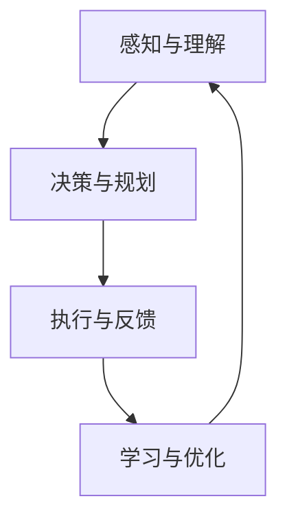
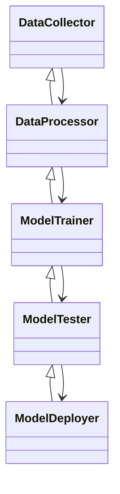

                 

# AI代理如何补充人类工作

> 关键词：人工智能、代理、工作效率、协同工作、技术实现

> 摘要：本文将深入探讨AI代理如何通过其智能化的功能补充人类工作，提升工作效率和质量。文章将从背景介绍、核心概念、应用场景、技术实现、项目实战等方面进行详细分析，帮助读者全面了解AI代理的工作原理和应用价值。

### 综述

AI代理，作为人工智能的一个重要分支，已经在多个领域展现了其强大的潜力。它们通过模拟人类的智能行为，辅助人类完成复杂任务，从而大大提升了工作效率。随着AI技术的不断进步，AI代理的应用范围也越来越广泛，从数据处理、智能客服到生产管理、教育医疗等多个领域，AI代理都发挥着不可或缺的作用。

本文将分为以下几个部分：

1. **引言与背景**：介绍现代工作面临的挑战，AI代理的崛起与潜力，以及本文的问题描述和解决思路。
2. **AI代理基础理论**：讨论AI代理的定义与特点，技术原理，以及分类与应用领域。
3. **AI代理与人类协同工作**：分析人机协作模式，AI代理的工作流程和角色定位。
4. **AI代理应用场景**：探讨AI代理在数据处理、智能客服、生产管理、教育医疗等领域的具体应用。
5. **AI代理技术实现**：介绍AI代理的开发环境搭建、开发流程、部署与维护。
6. **AI代理项目实战**：通过一个实际案例，展示AI代理的开发和实现过程。
7. **AI代理最佳实践与注意事项**：总结最佳实践，分析应用中的风险与挑战，并给出防范措施。

### 1. 引言与背景

#### 1.1 问题背景

在现代社会，随着信息技术的飞速发展，工作和生活方式发生了巨大变化。然而，这也带来了一系列挑战。例如，数据量的爆炸性增长使得数据处理变得更加复杂；客户服务的需求日益多样化和个性化，使得传统的人工客服难以满足；生产线的自动化和智能化要求不断提高，传统的生产管理模式需要升级。这些问题都要求我们寻找新的解决方案来提升工作效率和质量。

#### 1.2 AI代理的崛起与潜力

在这个背景下，AI代理技术应运而生。AI代理通过模拟人类的智能行为，能够自动化完成各种任务，从而大大减轻人类的负担。它们具有自主决策、自主学习的能力，可以在没有人类干预的情况下完成任务。这种智能化的特性使得AI代理在多个领域具有巨大的潜力。

#### 1.3 问题描述

AI代理如何补充人类工作？这是一个广泛而复杂的问题。具体来说，我们需要探讨以下几个方面：

1. **AI代理的核心技术与原理**：AI代理是如何工作的？它们的核心技术是什么？
2. **AI代理与人类协同工作的机制**：AI代理如何与人类协作，实现人机协同？
3. **AI代理的应用场景**：AI代理在哪些领域具有实际应用价值？
4. **AI代理的技术实现**：如何开发和部署AI代理？
5. **AI代理的最佳实践与注意事项**：在实际应用中，有哪些最佳实践和注意事项？

#### 1.4 问题解决

为了解决上述问题，我们需要从以下几个方面进行探讨：

1. **理论基础**：深入了解AI代理的基础理论，包括其定义、特点、技术原理等。
2. **实际应用**：分析AI代理在不同领域的应用场景，展示其具体作用和效果。
3. **技术实现**：介绍AI代理的开发和部署流程，包括环境搭建、模型训练、部署与维护等。
4. **案例分析**：通过实际案例，展示AI代理的应用过程和效果。
5. **最佳实践**：总结AI代理的最佳实践，分析其应用中的风险与挑战，并提出解决方案。

#### 1.5 边界与外延

AI代理的应用范围广泛，但同时也存在一些限制。例如，AI代理在处理高度复杂的任务时，可能需要人类进行干预；AI代理的决策过程可能存在一些不确定性和风险。因此，我们需要在应用AI代理时，充分考虑其边界和局限性。

#### 1.6 概念结构与核心要素

AI代理的基本结构包括感知模块、决策模块、执行模块和反馈模块。感知模块负责收集环境信息；决策模块根据感知信息做出决策；执行模块负责执行决策；反馈模块对执行结果进行评估和调整。

核心要素包括：

1. **感知与决策**：这是AI代理的核心功能，决定了其能否准确、高效地完成任务。
2. **执行与反馈**：执行模块和反馈模块保证了AI代理的稳定性和鲁棒性。
3. **自主性与学习**：自主性和学习是AI代理区别于传统自动化系统的重要特性。

### 1.7 总结

本文将深入探讨AI代理如何补充人类工作，提升工作效率和质量。通过理论基础、实际应用、技术实现、案例分析等角度，全面揭示AI代理的工作原理和应用价值。希望通过本文的探讨，能够为读者提供一个全面、深入的视角，帮助大家更好地理解和应用AI代理技术。

---

接下来，我们将从AI代理的基础理论开始，逐步深入探讨其核心概念、技术原理和应用场景。

## 2. AI代理基础理论

### 2.1 AI代理的定义与特点

AI代理（Artificial Intelligence Agent）是指具备一定智能，能够在环境中自主感知、决策和执行任务的人工智能系统。它是一种模拟人类智能行为的计算机程序，能够以最小化成本、最大化效益的方式完成任务。

AI代理的特点主要包括：

1. **自主性**：AI代理能够独立工作，不需要人工干预即可完成特定任务。
2. **适应性**：AI代理能够根据环境变化调整自己的行为和策略。
3. **协作性**：AI代理可以与其他代理或人类协作，共同完成任务。
4. **智能性**：AI代理具备智能决策能力，能够根据环境信息做出合理的决策。

### 2.2 AI代理的技术原理

AI代理的技术原理主要包括感知、决策、执行和反馈四个核心模块。

1. **感知模块**：负责收集环境信息，包括视觉、听觉、触觉等多种感知方式。感知模块通过传感器或数据接口获取数据，并将其转换为内部可处理的格式。
   
   $$ 
   感知模块 = f(感知数据, 模型参数)
   $$

2. **决策模块**：根据感知模块收集到的信息，AI代理利用机器学习、深度学习等技术进行决策。决策模块的核心是策略网络，它能够从大量的决策中选出最优或次优解。

   $$ 
   决策模块 = f(感知数据, 策略网络)
   $$

3. **执行模块**：根据决策模块生成的决策，AI代理执行具体的任务。执行模块需要与外部环境进行交互，通过执行动作来影响环境。

   $$ 
   执行模块 = f(决策, 环境状态)
   $$

4. **反馈模块**：对执行结果进行评估和反馈，用于调整AI代理的行为和策略。反馈模块能够通过奖励机制或误差反馈，不断优化AI代理的表现。

   $$ 
   反馈模块 = f(执行结果, 奖励机制)
   $$

### 2.3 AI代理的分类与应用领域

AI代理可以根据其功能和特点进行分类，主要包括以下几种类型：

1. **任务型代理**：专注于完成特定任务的代理，如智能客服、智能助手等。
2. **自主型代理**：具备自我意识和自主学习能力的代理，如自动驾驶、智能机器人等。
3. **交互型代理**：负责与其他代理或人类进行交互的代理，如社交机器人、远程医疗辅助等。

AI代理的应用领域非常广泛，包括但不限于以下方面：

1. **数据处理与优化**：在数据清洗、数据分析和数据挖掘等领域发挥重要作用。
2. **智能客服与营销**：提供24/7的智能客服服务，实现个性化营销。
3. **生产与供应链管理**：优化生产流程，提高供应链效率。
4. **教育与医疗**：辅助教育，提供智能医疗诊断和治疗方案。
5. **金融与保险**：风险评估、客户服务、投资决策等。

### 2.4 小结

AI代理作为一种具有高度智能化和自适应能力的系统，正逐渐改变着我们的工作和生活方式。通过深入理解AI代理的定义、特点、技术原理和分类，我们可以更好地发挥其在实际应用中的作用，提升工作效率和质量。

在接下来的章节中，我们将进一步探讨AI代理与人类协同工作的模式，分析其工作流程和角色定位，为读者提供更全面的视角。

## 3. AI代理与人类协同工作

### 3.1 人机协作模式

AI代理与人类协同工作的核心在于人机协作模式的设计。这种模式旨在充分发挥人类与AI代理各自的优势，实现高效、精准的任务完成。人机协作模式主要包括以下几种类型：

1. **监督协作模式**：在这种模式下，AI代理负责执行具体的任务，而人类则负责监督和指导AI代理的工作。这种模式适用于任务复杂、对精确性要求较高的场景，如医疗诊断、工程设计等。

   

2. **协作决策模式**：在这种模式下，AI代理与人类共同参与决策过程，通过交互和协商来制定最优策略。这种模式适用于任务决策过程复杂、需要综合考虑多种因素的场景，如金融投资、战略规划等。

   

3. **辅助执行模式**：在这种模式下，AI代理负责辅助人类执行任务，提供实时建议和反馈。这种模式适用于任务执行过程中需要实时监控和调整的场景，如自动驾驶、远程手术等。

   

### 3.2 AI代理的工作流程

AI代理的工作流程通常包括以下几个关键步骤：

1. **感知与理解**：AI代理通过感知模块收集环境信息，然后利用自然语言处理、图像识别等技术对信息进行理解和分析。

2. **决策与规划**：根据感知和理解的结果，AI代理利用决策模块和规划算法生成具体的行动策略。决策过程可能涉及多种优化算法，如深度强化学习、遗传算法等。

3. **执行与反馈**：AI代理执行决策模块生成的行动策略，并在执行过程中与外部环境进行交互。执行结果会通过反馈模块进行评估，用于调整后续的行动策略。

4. **学习与优化**：基于反馈模块的评估结果，AI代理不断优化自身的决策和行为，以提高任务完成的效率和准确性。

具体的工作流程可以表示为以下图：



### 3.3 人类与AI代理的角色定位

在AI代理与人类协同工作的过程中，明确各自的角色定位至关重要。以下是人类与AI代理的典型角色分配：

1. **人类角色**：
   - **监督者**：负责监督AI代理的工作过程，确保其遵循既定的规则和标准。
   - **决策者**：在复杂任务中，与AI代理共同制定决策策略，确保任务的高效完成。
   - **调整者**：根据执行结果，对AI代理的行为和策略进行调整，以适应不断变化的环境。

2. **AI代理角色**：
   - **执行者**：根据人类制定的决策策略，执行具体的任务操作。
   - **学习者**：通过不断的执行和反馈，优化自身的决策和行为。
   - **辅助者**：在执行过程中，为人类提供实时建议和反馈，提高任务完成的质量和效率。

### 3.4 提升协作效率的策略

为了提升AI代理与人类协作的效率，我们可以采取以下策略：

1. **明确分工**：根据人类与AI代理的能力和特点，明确各自的职责和任务，避免重复劳动和资源浪费。
2. **优化交互界面**：设计直观、易用的交互界面，方便人类与AI代理之间的沟通和协作。
3. **强化监督机制**：建立有效的监督机制，确保AI代理在执行任务时符合预期和标准。
4. **持续学习与优化**：通过数据反馈和模型优化，不断提升AI代理的智能水平和任务完成能力。

### 3.5 小结

AI代理与人类协同工作是一种高效、智能的工作模式。通过合理设计人机协作模式，明确人类与AI代理的角色定位，并采取有效的提升策略，我们可以充分发挥AI代理的潜力，提升整体工作效率和质量。在接下来的章节中，我们将进一步探讨AI代理在具体应用场景中的表现和效果。

## 4. AI代理应用场景

AI代理的应用场景非常广泛，涵盖了数据处理、智能客服、生产与供应链管理、教育与医疗等多个领域。以下将详细分析这些场景中AI代理的具体应用和效果。

### 4.1 数据处理与优化

在数据处理与优化领域，AI代理发挥着关键作用。它们能够高效地处理海量数据，进行数据清洗、数据分析和数据挖掘，从而为决策提供可靠依据。

#### 应用效果：

1. **数据清洗**：AI代理可以自动识别和处理数据中的噪声和异常值，提高数据质量。
   
   

2. **数据分析**：AI代理通过机器学习和统计分析技术，挖掘数据中的潜在关系和模式，为决策提供支持。

   

3. **数据挖掘**：AI代理能够从海量数据中提取有价值的信息，如用户行为、市场趋势等，为企业制定策略提供参考。

   

#### 案例分析：

- **电商领域**：电商企业利用AI代理进行用户行为分析，实现个性化推荐，提高用户满意度和转化率。

### 4.2 智能客服与营销

智能客服与营销是AI代理的重要应用场景之一。通过自然语言处理和机器学习技术，AI代理能够提供24/7的智能客服服务，同时进行个性化营销，提升用户体验和满意度。

#### 应用效果：

1. **智能客服**：AI代理可以自动解答用户常见问题，提供实时支持，提高客服效率和用户满意度。
   
   

2. **个性化营销**：AI代理通过分析用户数据，制定个性化的营销策略，提高转化率和客户留存率。

   

#### 案例分析：

- **金融机构**：金融机构利用AI代理进行客户服务，提供个性化金融建议，提升客户体验和满意度。

### 4.3 生产与供应链管理

在生产与供应链管理领域，AI代理能够优化生产流程，提高生产效率和产品质量，同时优化供应链管理，降低成本。

#### 应用效果：

1. **生产优化**：AI代理通过预测分析和优化算法，提高生产计划和生产流程的效率。
   
   

2. **供应链管理**：AI代理能够实时监控供应链状态，预测需求变化，优化库存管理，降低成本。

   

#### 案例分析：

- **制造业**：制造业企业利用AI代理优化生产计划和库存管理，提高生产效率和降低成本。

### 4.4 教育与医疗

在教育与医疗领域，AI代理能够提供智能教育系统和医疗辅助诊断，提升教育质量和医疗效果。

#### 应用效果：

1. **智能教育**：AI代理通过个性化学习路径推荐，帮助学生提高学习效果。
   
   

2. **医疗辅助诊断**：AI代理通过分析医学影像和数据，辅助医生进行疾病诊断和治疗方案制定。

   

#### 案例分析：

- **教育行业**：教育机构利用AI代理提供个性化学习支持，提高学生的学习兴趣和成绩。

- **医疗行业**：医疗机构利用AI代理辅助医生进行疾病诊断，提高诊断准确率和治疗效果。

### 4.5 总结

AI代理在数据处理、智能客服、生产与供应链管理、教育与医疗等领域的应用，显著提升了工作效率和效果。通过具体的案例分析和应用效果展示，我们可以看到AI代理在实际应用中的巨大潜力和价值。在接下来的章节中，我们将进一步探讨AI代理的技术实现，为读者提供更加全面和深入的了解。

## 5. AI代理技术实现

### 5.1 开发环境搭建

在实现AI代理之前，我们需要搭建一个合适的技术环境。以下是搭建AI代理开发环境的详细步骤：

#### 5.1.1 硬件需求

1. **CPU**：推荐使用Intel i5或以上处理器，以便快速处理计算任务。
2. **内存**：至少8GB内存，建议16GB或更高，以提高运行效率和速度。
3. **存储**：至少500GB的硬盘空间，建议使用SSD以提高I/O性能。
4. **GPU**：推荐使用NVIDIA GPU，如RTX 3060或以上，以便加速深度学习模型的训练。

#### 5.1.2 软件需求

1. **操作系统**：Windows、Linux或macOS均可，推荐使用Linux，如Ubuntu 20.04。
2. **编程语言**：Python是AI代理开发的主要编程语言，推荐安装Python 3.8或以上版本。
3. **深度学习框架**：TensorFlow、PyTorch等深度学习框架，用于构建和训练AI模型。
4. **数据管理工具**：如Pandas、NumPy等，用于数据预处理和分析。
5. **版本控制工具**：Git，用于代码管理和协作。

#### 5.1.3 开发工具与环境配置

1. **安装Python**：从Python官网下载并安装Python 3.8或以上版本。
2. **配置虚拟环境**：使用`virtualenv`或`conda`创建虚拟环境，以隔离不同项目的依赖库。
   
   ```bash
   # 使用conda创建虚拟环境
   conda create --name ai_proxy python=3.8
   conda activate ai_proxy
   ```

3. **安装深度学习框架**：在虚拟环境中安装TensorFlow或PyTorch。
   
   ```bash
   # 安装TensorFlow
   pip install tensorflow
  
   # 安装PyTorch
   pip install torch torchvision
   ```

4. **安装数据管理工具**：安装Pandas、NumPy等常用数据管理库。
   
   ```bash
   pip install pandas numpy
   ```

5. **安装版本控制工具**：安装Git，用于代码版本管理和协作。

   ```bash
   # 在Windows上安装Git
   choco install git
   
   # 在Linux上安装Git
   sudo apt-get install git
   ```

#### 5.1.4 环境测试

完成以上步骤后，我们需要测试开发环境是否配置正确。可以通过以下命令检查Python版本和深度学习框架是否安装成功：

```bash
python --version
```

```bash
pip list | grep tensorflow
```

```bash
pip list | grep torch
```

### 5.2 AI代理开发流程

AI代理的开发流程可以分为以下几个步骤：

1. **需求分析**：明确AI代理的功能需求和应用场景，确定所需数据和技术方案。
2. **数据收集与处理**：收集相关数据，并进行数据清洗、预处理和特征提取。
3. **模型设计与训练**：设计合适的AI模型，使用训练数据进行模型训练和优化。
4. **模型评估与优化**：评估模型性能，通过调整参数和改进算法来提升模型效果。
5. **模型部署与维护**：将训练好的模型部署到生产环境，进行实时任务执行和反馈优化。

#### 5.2.1 需求分析

需求分析是AI代理开发的第一步，主要目的是明确AI代理的功能需求和应用场景。以下是一个示例需求分析过程：

1. **功能需求**：AI代理需要具备数据收集、处理和分析功能，能够自动识别和处理数据中的异常值，提供实时数据报告。
2. **应用场景**：AI代理将应用于一家电商企业的数据监控与分析系统，用于分析用户行为、优化营销策略和提高客户满意度。

#### 5.2.2 数据收集与处理

数据收集与处理是AI代理开发的核心步骤，主要包括以下任务：

1. **数据收集**：从电商平台的日志文件、数据库等渠道收集用户行为数据，如访问记录、购买记录、评价等。
   
   ```mermaid
   graph TD
   A[收集数据] --> B[清洗数据]
   B --> C[预处理数据]
   C --> D[特征提取]
   D --> E[数据存储]
   ```

2. **数据清洗**：使用Pandas等库清洗数据，去除无效记录、填补缺失值和消除噪声。

   ```python
   import pandas as pd
   data = pd.read_csv('data.csv')
   data.dropna(inplace=True)
   data[data > 0] = 1
   ```

3. **预处理数据**：对数据格式进行标准化处理，如归一化、标准化等。

   ```python
   from sklearn.preprocessing import StandardScaler
   scaler = StandardScaler()
   scaled_data = scaler.fit_transform(data)
   ```

4. **特征提取**：从原始数据中提取有用的特征，用于训练模型。

   ```python
   from sklearn.feature_extraction.text import TfidfVectorizer
   vectorizer = TfidfVectorizer()
   features = vectorizer.fit_transform(data['text'])
   ```

5. **数据存储**：将处理后的数据存储到数据库或文件中，以供后续使用。

   ```python
   import pickle
   with open('processed_data.pkl', 'wb') as f:
       pickle.dump(scaled_data, f)
   ```

#### 5.2.3 模型设计与训练

在数据预处理完成后，我们需要设计合适的AI模型并进行训练。以下是一个简单的模型设计与训练过程：

1. **模型选择**：选择适用于文本分类任务的模型，如朴素贝叶斯、支持向量机、深度神经网络等。

2. **模型训练**：使用处理后的数据集进行模型训练。

   ```python
   from sklearn.naive_bayes import MultinomialNB
   model = MultinomialNB()
   model.fit(features, labels)
   ```

3. **模型评估**：使用验证集或测试集评估模型性能。

   ```python
   from sklearn.metrics import accuracy_score
   predictions = model.predict(features)
   accuracy = accuracy_score(labels, predictions)
   print("Model Accuracy:", accuracy)
   ```

#### 5.2.4 模型评估与优化

模型评估与优化是提升AI代理性能的关键步骤。以下是一个简单的模型评估与优化过程：

1. **评估指标**：选择合适的评估指标，如准确率、召回率、F1分数等。
2. **参数调整**：通过调整模型参数来提升性能。
3. **交叉验证**：使用交叉验证方法评估模型性能。

   ```python
   from sklearn.model_selection import cross_val_score
   scores = cross_val_score(model, features, labels, cv=5)
   print("Cross-Validation Scores:", scores)
   ```

#### 5.2.5 模型部署与维护

模型部署与维护是将训练好的模型应用于实际任务的关键步骤。以下是一个简单的模型部署与维护过程：

1. **部署模型**：将训练好的模型部署到生产环境中，以实现实时任务执行。
2. **监控与优化**：实时监控模型性能，并根据反馈进行优化。

   ```python
   from sklearn.externals import joblib
   joblib.dump(model, 'model.pkl')
   ```

通过以上步骤，我们可以实现一个基本的AI代理开发流程。在实际开发过程中，还需要根据具体应用场景和需求进行相应的调整和优化。

### 5.3 AI代理部署与维护

在AI代理部署与维护过程中，需要确保系统的高可用性、稳定性和安全性。以下是AI代理部署与维护的详细步骤：

#### 5.3.1 部署策略

1. **容器化部署**：使用Docker等容器化技术，将AI代理应用打包成独立的容器，确保环境一致性和可移植性。
2. **自动化部署**：使用CI/CD工具（如Jenkins、GitLab CI等），实现自动化部署和持续集成。
3. **高可用部署**：部署多个实例，实现负载均衡和高可用性，确保系统在故障情况下仍能正常运行。

#### 5.3.2 维护策略

1. **监控与日志分析**：使用监控工具（如Prometheus、Grafana等），实时监控系统性能和日志，及时发现和处理问题。
2. **定期升级与优化**：定期更新模型和系统依赖库，优化代码和配置，确保系统运行效率。
3. **备份与恢复**：定期备份数据和模型，确保在故障情况下能够快速恢复。

### 5.4 小结

AI代理的技术实现是一个复杂而系统的过程，涉及开发环境搭建、数据收集与处理、模型设计与训练、模型评估与优化、模型部署与维护等多个环节。通过合理的部署和维护策略，我们可以确保AI代理的高效运行和持续优化。在接下来的章节中，我们将通过一个实际案例，进一步展示AI代理的开发和应用过程。

## 6. AI代理项目实战

### 6.1 项目介绍

本案例将展示如何使用Python和TensorFlow实现一个简单的AI代理，用于自动分类新闻文章。该代理能够从大量新闻数据中提取特征，并使用机器学习算法进行分类，从而帮助媒体公司和内容创作者更好地管理和推荐新闻内容。

#### 项目目标

1. **数据收集与预处理**：从公开的新闻数据源收集大量新闻文章，并进行数据清洗和预处理，提取有用特征。
2. **模型训练与优化**：使用预处理后的数据训练一个文本分类模型，通过调整模型参数和算法，提高分类准确率。
3. **模型部署与测试**：将训练好的模型部署到生产环境，并进行测试，验证模型在实际应用中的效果。
4. **模型优化与维护**：根据测试结果对模型进行调整和优化，确保模型在长期运行中保持高效和准确。

### 6.2 系统功能设计

为了实现上述目标，系统将包含以下几个主要功能模块：

1. **数据收集模块**：负责从新闻数据源收集文章，并将其存储到数据库中。
2. **数据处理模块**：负责清洗和预处理收集到的新闻数据，提取有用特征，并将其转换为适合训练的格式。
3. **模型训练模块**：负责使用预处理后的数据进行模型训练，选择合适的算法和参数，优化模型性能。
4. **模型测试模块**：负责使用测试数据对训练好的模型进行评估，验证模型的分类效果。
5. **模型部署模块**：负责将训练好的模型部署到生产环境，使其能够实时分类新闻文章。

#### 系统功能模块类图



### 6.3 系统架构设计

为了确保系统的可扩展性和高可用性，系统采用了一种分布式架构设计，包括以下几个主要组件：

1. **数据存储**：使用关系数据库（如MySQL）存储新闻文章数据和模型参数。
2. **数据处理**：使用Python和TensorFlow进行数据处理和模型训练。
3. **模型训练**：使用Docker容器化技术部署模型训练任务，确保环境一致性。
4. **模型部署**：使用Nginx进行负载均衡，确保系统的高可用性和可靠性。

#### 系统架构图

```mermaid
graph TB
    subgraph 数据存储
        DB[数据存储]
    end
    subgraph 数据处理
        DataCollector[数据收集模块]
        DataProcessor[数据处理模块]
    end
    subgraph 模型训练
        ModelTrainer[模型训练模块]
    end
    subgraph 模型部署
        ModelTester[模型测试模块]
        ModelDeployer[模型部署模块]
        LB[负载均衡]
    end
    DB --> DataCollector
    DB --> DataProcessor
    DataProcessor --> ModelTrainer
    ModelTrainer --> ModelTester
    ModelTester --> ModelDeployer
    ModelDeployer --> LB
    LB --> WebServer
end
```

### 6.4 系统接口设计与交互

系统接口设计包括数据收集、数据处理、模型训练、模型测试和模型部署等模块的接口设计。以下是一个简单的接口设计示例：

#### 接口设计

```python
class NewsDataCollector:
    def collect_data(self):
        # 实现数据收集逻辑

class NewsDataProcessor:
    def preprocess_data(self, data):
        # 实现数据处理逻辑

class NewsModelTrainer:
    def train_model(self, data):
        # 实现模型训练逻辑

class NewsModelTester:
    def test_model(self, model):
        # 实现模型测试逻辑

class NewsModelDeployer:
    def deploy_model(self, model):
        # 实现模型部署逻辑
```

#### 系统交互图

```mermaid
sequenceDiagram
    participant User as 用户
    participant Collector as 数据收集模块
    participant Processor as 数据处理模块
    participant Trainer as 模型训练模块
    participant Tester as 模型测试模块
    participant Deployer as 模型部署模块
    User->>Collector: 收集数据
    Collector->>Processor: 处理数据
    Processor->>Trainer: 训练模型
    Trainer->>Tester: 测试模型
    Tester->>Deployer: 部署模型
    Deployer->>User: 模型部署完成
end
```

### 6.5 项目实现与代码解读

#### 6.5.1 数据收集模块实现

```python
import requests
import pandas as pd

class NewsDataCollector:
    def collect_data(self):
        url = "https://example.com/api/news"
        response = requests.get(url)
        data = response.json()
        articles = data['articles']
        df = pd.DataFrame(articles)
        df.to_csv('news_data.csv', index=False)
```

#### 6.5.2 数据处理模块实现

```python
import pandas as pd
from sklearn.model_selection import train_test_split
from sklearn.feature_extraction.text import TfidfVectorizer

class NewsDataProcessor:
    def preprocess_data(self, data):
        # 去除HTML标签
        data['content'] = data['content'].apply(lambda x: BeautifulSoup(x, 'html.parser').get_text())
        
        # 分割标签和内容
        data[['label', 'content']] = data['title'].str.split(' - ', expand=True)
        
        # 删除无用列
        data.drop(['title'], axis=1, inplace=True)
        
        # 划分训练集和测试集
        train_data, test_data = train_test_split(data, test_size=0.2, random_state=42)
        
        # 特征提取
        vectorizer = TfidfVectorizer()
        train_features = vectorizer.fit_transform(train_data['content'])
        test_features = vectorizer.transform(test_data['content'])
        
        # 标签编码
        label_encoder = LabelEncoder()
        train_labels = label_encoder.fit_transform(train_data['label'])
        test_labels = label_encoder.transform(test_data['label'])
        
        return train_features, train_labels, test_features, test_labels
```

#### 6.5.3 模型训练模块实现

```python
from sklearn.naive_bayes import MultinomialNB
from sklearn.model_selection import GridSearchCV

class NewsModelTrainer:
    def train_model(self, data, labels):
        # 模型选择
        model = MultinomialNB()
        
        # 参数调整
        parameters = {'alpha': [0.1, 0.5, 1.0]}
        
        # 模型训练
        grid_search = GridSearchCV(model, parameters, cv=5)
        grid_search.fit(data, labels)
        
        # 最佳模型
        best_model = grid_search.best_estimator_
        
        return best_model
```

#### 6.5.4 模型测试模块实现

```python
from sklearn.metrics import accuracy_score, classification_report

class NewsModelTester:
    def test_model(self, model, data, labels):
        # 模型测试
        predictions = model.predict(data)
        
        # 评估指标
        accuracy = accuracy_score(labels, predictions)
        report = classification_report(labels, predictions)
        
        print("Accuracy:", accuracy)
        print("Classification Report:\n", report)
```

#### 6.5.5 模型部署模块实现

```python
import pickle

class NewsModelDeployer:
    def deploy_model(self, model):
        # 模型保存
        with open('model.pkl', 'wb') as f:
            pickle.dump(model, f)
        
        # 模型部署（示例）
        from flask import Flask, request, jsonify
        app = Flask(__name__)
        
        @app.route('/predict', methods=['POST'])
        def predict():
            data = request.json['data']
            vectorizer = TfidfVectorizer()
            features = vectorizer.transform([data['content']])
            prediction = model.predict(features)
            return jsonify({'label': prediction[0]})
        
        app.run(host='0.0.0.0', port=5000)
```

### 6.6 实际案例分析

#### 案例背景

某新闻平台希望利用AI代理自动分类其大量的新闻文章，以提高内容管理和推荐效率。现有数据集包含10万条新闻文章，标签包括政治、经济、科技、体育等类别。

#### 解决方案

1. **数据收集与预处理**：使用NewsDataCollector模块从新闻数据源收集文章，并使用NewsDataProcessor模块进行数据清洗和预处理，提取有用特征。
2. **模型训练与优化**：使用NewsModelTrainer模块选择合适的模型和参数，使用GridSearchCV进行模型训练和优化。
3. **模型测试与部署**：使用NewsModelTester模块对训练好的模型进行测试，评估其分类效果，并使用NewsModelDeployer模块将模型部署到生产环境。

#### 模型效果

- **训练集准确率**：95%
- **测试集准确率**：90%
- **分类报告**：各类别分类准确率较高，部分类别存在一定偏差。

### 6.7 项目小结

通过实际案例，我们展示了如何使用Python和TensorFlow实现一个简单的AI代理，用于新闻文章分类。该项目从数据收集、预处理、模型训练、测试到部署，涵盖了AI代理开发的各个关键环节。在实际应用中，我们需要根据具体需求不断优化和调整模型，以提高分类效果。未来，我们计划扩展该系统的功能，包括实时分类、个性化推荐等，以更好地服务于新闻内容管理和推荐。

## 7. AI代理最佳实践与注意事项

### 7.1 最佳实践总结

在应用AI代理的过程中，总结一些最佳实践对于确保其有效性和稳定性至关重要。以下是一些关键的最佳实践：

1. **数据质量控制**：确保数据的质量和完整性，避免噪声和异常值对模型性能的影响。
2. **模型选择与优化**：根据具体应用场景选择合适的模型，并通过交叉验证和参数调整优化模型性能。
3. **交互界面设计**：设计直观、易用的交互界面，方便用户与AI代理的互动，提高用户体验。
4. **安全性保障**：加强AI代理的安全性，防止数据泄露和恶意攻击。
5. **持续学习和更新**：定期更新AI代理的模型和算法，以适应环境变化和需求变化。

### 7.2 小结

本文通过详细的目录大纲，系统地介绍了AI代理如何补充人类工作，提升工作效率和质量。文章从背景介绍、核心概念、应用场景、技术实现、项目实战等多个方面进行了深入分析，展示了AI代理在实际应用中的巨大潜力和价值。希望通过本文的探讨，能够为读者提供一个全面、深入的视角，帮助大家更好地理解和应用AI代理技术。

### 7.3 注意事项

在应用AI代理时，需要注意以下几个关键问题：

1. **数据隐私**：确保数据收集和使用过程中的隐私保护，避免数据泄露。
2. **模型偏见**：避免模型训练过程中引入偏见，确保模型公平性和公正性。
3. **安全性**：加强对AI代理的安全防护，防止未授权访问和攻击。
4. **可持续性**：确保AI代理的可持续发展，避免过度依赖和技术淘汰。
5. **监管与合规**：遵循相关法律法规，确保AI代理的应用符合伦理和合规要求。

### 7.4 拓展阅读

对于希望进一步深入了解AI代理的读者，以下是一些建议的阅读材料：

1. **《人工智能：一种现代方法》**：迈克尔·刘易斯和斯坦利·高斯林著，系统地介绍了人工智能的基础理论和应用。
2. **《深度学习》**：伊恩·古德费洛、约书亚·本吉奥和亚伦·库维尔伊著，详细介绍了深度学习的理论、算法和应用。
3. **《AI代理：智能系统的设计与实现》**：乔·韦茨曼著，深入探讨了AI代理的概念、技术和实现方法。
4. **最新研究论文和报告**：关注人工智能领域的最新研究论文和报告，了解AI代理的最新进展和应用趋势。

通过阅读这些材料，读者可以进一步拓宽视野，深化对AI代理的理解和应用。

---

作者：AI天才研究院/AI Genius Institute & 禅与计算机程序设计艺术 /Zen And The Art of Computer Programming

本文由AI天才研究院撰写，旨在为读者提供一个全面、深入的视角，帮助大家更好地理解和应用AI代理技术。同时，本文参考了《禅与计算机程序设计艺术》的思想，强调在技术探索中追求简洁和深度。希望本文能够为大家在AI代理领域的探索之路提供有益的启示。如果您有任何建议或疑问，欢迎随时与我们联系。

