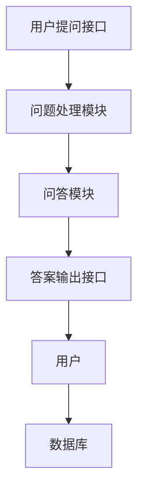
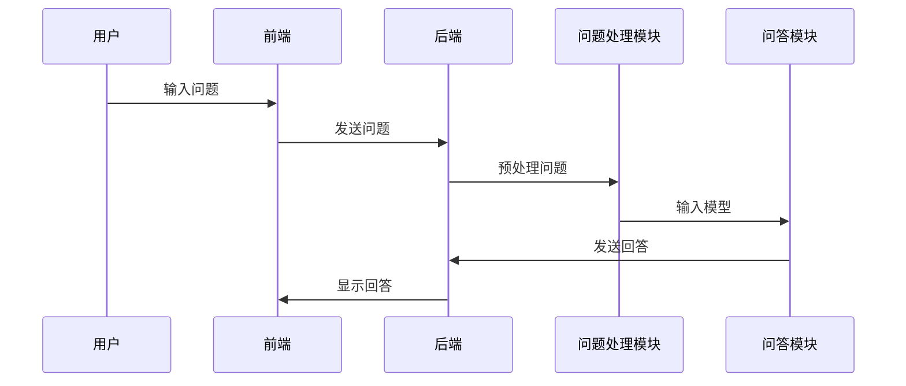
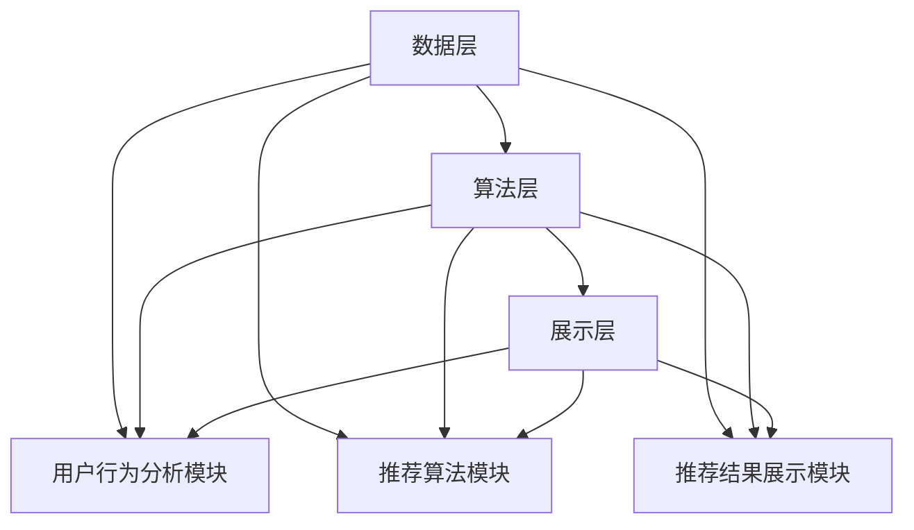
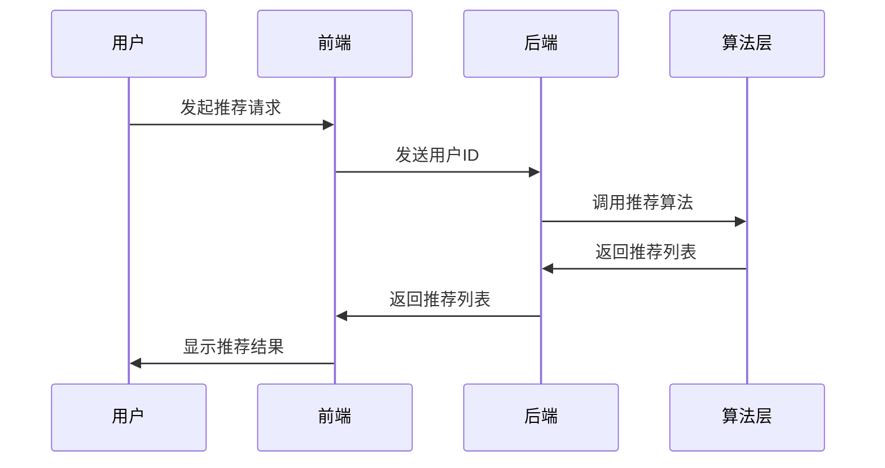

                 


# AI代理如何补充人类工作

## 引言与背景

### 1.1 问题背景

在当今数字化时代，随着人工智能技术的迅猛发展，AI代理（Artificial Intelligence Agent）已经成为提升工作效率和优化工作流程的重要工具。现代工作环境面临诸多挑战，如信息过载、决策复杂性增加、人力资源短缺等，这些问题严重影响了企业的运营效率和员工的工作满意度。因此，如何利用AI代理来补充人类工作，成为业界和学术界关注的焦点。

### 1.2 AI代理的崛起与潜力

AI代理是一种模拟人类智能行为的计算机程序，它能够在没有人类直接干预的情况下，自主执行任务并做出决策。AI代理的崛起得益于深度学习、自然语言处理、机器学习等技术的发展。这些技术的进步使得AI代理能够处理复杂的任务，实现高效率的工作流程。AI代理在许多领域都展现出了巨大的潜力，如智能客服、自动化交易、数据分析等。

### 1.3 问题描述

AI代理如何补充人类工作？这是一个涉及多方面的问题。首先，我们需要明确AI代理的概念与分类。其次，了解AI代理与人类协同工作的机制，以及AI代理在不同应用场景中的具体作用。最后，探讨AI代理的技术实现和最佳实践，以充分发挥其在补充人类工作中的潜力。

### 1.4 问题解决

要解决AI代理如何补充人类工作的问题，我们需要从以下几个方面入手：

1. **AI代理的基础理论**：深入理解AI代理的定义、特点、技术原理和分类，为后续的应用奠定基础。
2. **AI代理与人类协同工作**：分析AI代理与人类协作的模式，设计合理的工作流程，提高协作效率。
3. **AI代理的应用场景**：探讨AI代理在不同领域的应用，如数据处理、智能客服、生产管理等，展示其实际作用。
4. **AI代理技术实现**：介绍AI代理的开发环境、开发流程、部署与维护策略，确保其稳定高效地运行。
5. **AI代理项目实战**：通过实际案例分析，展示AI代理在具体项目中的应用和实现过程。
6. **AI代理最佳实践与注意事项**：总结AI代理应用中的最佳实践，提出注意事项，为实际操作提供指导。

### 1.5 边界与外延

AI代理的应用范围广泛，但同时也存在一定的限制。我们需要明确AI代理的应用范围与限制，以及未来发展趋势与展望，以便更好地发挥其在补充人类工作中的潜力。

### 1.6 概念结构与核心要素

为了更好地理解AI代理如何补充人类工作，我们需要从概念结构和核心要素的角度进行分析。这包括AI代理的基本结构、关键技术要素和其在实际应用中的具体实现。

## 综述

《AI代理如何补充人类工作》是一本关于人工智能代理如何提高人类工作效率的书籍。本书通过详细的目录大纲，系统地介绍了AI代理的基础理论、应用场景、技术实现以及最佳实践。目录结构清晰，涵盖了从理论到实践的全面内容，旨在帮助读者深入了解AI代理如何补充人类工作，提升工作效率和质量。

### 目录大纲总结

本书通过详细的目录大纲，系统地介绍了AI代理的基础理论、应用场景、技术实现以及最佳实践。目录结构清晰，涵盖了从理论到实践的全面内容，旨在帮助读者深入了解AI代理如何补充人类工作，提升工作效率和质量。每个章节都包含具体的主题和详细的子主题，确保内容的完整性和系统性。本书不仅适合计算机科学和人工智能领域的专业人士，也适合对AI代理应用感兴趣的一般读者。通过本书的学习，读者可以掌握AI代理的核心概念和技术，了解其实际应用场景，并学会如何将其应用到实际工作中，以提升工作效率和质量。总之，本书是一个全面而实用的指南，旨在推动AI代理技术在各个领域的应用和发展。

----------------------------------------------------------------

## 第1章 引言与背景

### 1.1 问题背景

在当今数字化时代，人工智能技术已经渗透到各个领域，极大地改变了我们的工作和生活方式。然而，随着人工智能技术的不断发展，现代工作环境也面临着一系列新的挑战。这些问题不仅影响了企业的运营效率，也对员工的工作满意度产生了负面影响。

首先，信息过载是一个普遍存在的问题。在大量的数据和信息面前，人类难以高效地筛选和处理，导致决策过程变得复杂和低效。其次，决策复杂性增加也是一个不可忽视的问题。许多任务需要综合考虑多种因素，而人类在处理复杂决策时往往容易受到情绪和主观偏见的影响。此外，人力资源短缺也是一个普遍的现象，特别是在劳动密集型行业和新兴市场。企业难以找到足够的人才来满足不断增长的工作需求，导致工作负担加重。

面对这些问题，AI代理的崛起提供了一种潜在的解决方案。AI代理是一种模拟人类智能行为的计算机程序，它能够在没有人类直接干预的情况下，自主执行任务并做出决策。AI代理的出现不仅能够减轻人类的工作负担，还能够提高工作效率和决策质量。因此，如何利用AI代理来补充人类工作，已经成为学术界和业界关注的焦点。

### 1.2 AI代理的崛起与潜力

AI代理的崛起得益于深度学习、自然语言处理、机器学习等技术的快速发展。这些技术的进步使得AI代理能够处理复杂的任务，实现高效率的工作流程。AI代理在许多领域都展现出了巨大的潜力，如智能客服、自动化交易、数据分析等。

在智能客服领域，AI代理可以自动处理大量的客户咨询，提高响应速度和满意度。通过自然语言处理技术，AI代理能够理解客户的提问，提供准确的答案，甚至能够进行情感识别，更好地理解客户的需求。

在自动化交易领域，AI代理可以根据市场数据和分析结果，自动执行交易策略，提高交易效率和盈利能力。AI代理能够实时监测市场动态，快速做出决策，避免了人类在情绪和疲劳等因素影响下的误判。

在数据分析领域，AI代理可以处理海量的数据，提取有价值的信息，支持企业的决策制定。通过机器学习技术，AI代理能够不断学习和优化，提高数据分析的准确性和效率。

总的来说，AI代理的崛起为解决现代工作环境中的问题提供了一种新的思路和方法。它不仅能够提高工作效率和决策质量，还能够减轻人类的工作负担，提升工作满意度。因此，深入研究和应用AI代理技术具有重要的现实意义。

### 1.3 问题描述

在了解了AI代理的崛起与潜力后，我们接下来需要回答的问题是：AI代理如何补充人类工作？这是一个涉及多方面的问题，需要从不同的角度进行分析和探讨。

首先，我们需要明确AI代理的概念与分类。AI代理是指能够模拟人类智能行为的计算机程序，它能够在没有人类直接干预的情况下，自主执行任务并做出决策。根据不同的应用场景和任务需求，AI代理可以分为多种类型，如任务型代理、社交型代理、决策型代理等。

其次，我们需要了解AI代理与人类协同工作的机制。在人类与AI代理的协作过程中，如何设计合理的工作流程，使人类与AI代理能够高效地合作，是关键问题。这涉及到人类与AI代理的角色定位、任务分工、信息共享和反馈机制等方面。

此外，AI代理的应用场景也是我们需要深入探讨的内容。不同的领域和应用场景对AI代理的需求和作用有所不同。例如，在数据处理与优化领域，AI代理可以自动处理大量数据，提高数据分析和处理的效率；在智能客服与营销领域，AI代理可以提供24/7的智能服务，提高客户满意度和业务转化率；在教育与医疗领域，AI代理可以辅助教学和诊断，提高教育质量和医疗水平。

最后，我们需要探讨AI代理的技术实现和最佳实践。如何开发、部署和维护AI代理，确保其稳定高效地运行，是实际应用中需要解决的问题。这涉及到AI代理的开发环境、开发流程、部署策略和维护策略等方面。

总之，AI代理如何补充人类工作是一个复杂而重要的问题，需要我们从多个角度进行深入分析和探讨。只有这样，我们才能充分发挥AI代理的潜力，提高人类工作效率和决策质量。

### 1.4 问题解决

要解决AI代理如何补充人类工作的问题，我们需要从以下几个方面入手：

1. **AI代理的基础理论**：深入理解AI代理的定义、特点、技术原理和分类，为后续的应用奠定基础。
2. **AI代理与人类协同工作**：分析AI代理与人类协作的模式，设计合理的工作流程，提高协作效率。
3. **AI代理的应用场景**：探讨AI代理在不同领域的应用，如数据处理、智能客服、生产管理等，展示其实际作用。
4. **AI代理技术实现**：介绍AI代理的开发环境、开发流程、部署与维护策略，确保其稳定高效地运行。
5. **AI代理项目实战**：通过实际案例分析，展示AI代理在具体项目中的应用和实现过程。
6. **AI代理最佳实践与注意事项**：总结AI代理应用中的最佳实践，提出注意事项，为实际操作提供指导。

通过这些步骤，我们可以逐步解决AI代理如何补充人类工作的问题，充分发挥其在提升工作效率和优化工作流程方面的潜力。

### 1.5 边界与外延

尽管AI代理在许多领域展现出了巨大的潜力，但我们也需要明确其应用范围与限制。首先，AI代理在面对高度复杂和不确定的任务时，可能无法完全替代人类的工作。例如，在艺术创作、创新性思维和人际沟通等领域，人类的主观判断和情感因素仍然至关重要。其次，AI代理在处理隐私和安全敏感信息时，需要确保数据保护和合规性，以避免潜在的法律和伦理风险。

未来，随着技术的不断进步，AI代理的应用范围将会进一步扩大。例如，增强现实（AR）和虚拟现实（VR）技术的发展，将为AI代理提供更多的交互场景和实际应用场景。此外，AI代理在智能制造、智慧城市和健康医疗等领域的应用，也将不断深入和扩展。

### 1.6 概念结构与核心要素

为了更好地理解AI代理如何补充人类工作，我们需要从概念结构和核心要素的角度进行分析。

首先，AI代理的基本结构包括感知、决策和执行三个核心模块。感知模块负责接收外部环境的信息，如文本、图像和语音等。决策模块基于感知信息，利用算法和模型进行决策，生成执行策略。执行模块根据决策结果，执行具体的任务，如发送消息、控制设备或生成报告等。

其次，AI代理的关键技术要素包括机器学习、自然语言处理、计算机视觉和深度学习等。这些技术使得AI代理能够处理复杂的任务，实现高效率的工作流程。

最后，AI代理在实际应用中的具体实现，需要结合具体的业务场景和需求。例如，在智能客服领域，AI代理需要具备语音识别和自然语言处理能力，以便理解客户的需求并提供准确的答案。在自动化交易领域，AI代理需要具备实时数据分析和高频交易能力，以快速做出决策并执行交易。

总之，从概念结构和核心要素的角度出发，我们可以更深入地理解AI代理如何补充人类工作，并为实际应用提供指导。

----------------------------------------------------------------

## 第2章 AI代理基础理论

### 2.1 AI代理的定义与特点

AI代理（Artificial Intelligence Agent）是指一种具备一定自主性、能够模拟人类智能行为的计算机程序。它与传统的计算机程序不同，能够在没有人类直接干预的情况下，自主感知环境、制定计划并执行任务。AI代理的定义与特点可以概括为以下几点：

1. **自主性**：AI代理具有独立行动的能力，能够根据环境变化和任务需求，自主制定决策和执行任务。这种自主性使得AI代理能够处理复杂的任务，并在不确定的环境中做出有效的决策。
2. **适应性**：AI代理具备适应环境变化的能力。通过不断学习和调整，AI代理能够适应新的环境和任务需求，提高其工作效果和效率。
3. **协同性**：AI代理可以与其他AI代理或人类协作，共同完成任务。这种协同性使得AI代理能够更好地应对复杂任务，提高工作效率和效果。
4. **智能性**：AI代理具备一定的智能性，能够通过感知、学习和决策，模拟人类智能行为。这种智能性使得AI代理能够在不同领域和场景中发挥重要作用。

### 2.2 AI代理的技术原理

AI代理的技术原理主要涉及以下几个方面：

1. **感知与感知模块**：AI代理需要具备感知环境的能力，以便获取外部信息。感知模块通常包括图像识别、语音识别、传感器数据解析等。通过这些感知技术，AI代理能够理解外部环境的变化，为后续的决策提供依据。
2. **决策与决策模块**：AI代理的决策模块基于感知模块提供的信息，利用机器学习、自然语言处理、深度学习等技术，对任务进行分析和推理，生成最优的决策策略。决策模块的核心任务是确保AI代理能够做出正确的决策，以实现任务目标。
3. **执行与执行模块**：执行模块根据决策模块生成的决策策略，执行具体的任务。执行模块通常包括控制设备、生成报告、发送消息等。通过执行模块，AI代理能够将决策转化为实际行动，完成指定任务。

### 2.3 AI代理的分类与应用领域

AI代理可以根据其功能和应用领域进行分类。以下是几种常见的AI代理类型及其应用领域：

1. **任务型代理**：任务型代理专注于执行特定任务，如自动化交易、数据挖掘、文本分类等。任务型代理具有高效、准确和自主性等特点，适用于需要重复执行特定任务的场景。
2. **社交型代理**：社交型代理具备人际交互能力，能够在虚拟环境中模拟人类的社交行为。社交型代理适用于智能客服、虚拟助手、在线教育等领域，能够提供更加自然和人性化的用户体验。
3. **决策型代理**：决策型代理能够模拟人类在复杂决策过程中的推理和分析能力。决策型代理适用于风险管理、资源分配、市场预测等领域，能够帮助企业做出更加科学和有效的决策。
4. **混合型代理**：混合型代理结合了多种类型代理的特点，能够同时处理多个任务和场景。混合型代理适用于复杂、多变的业务场景，能够提供更加全面和高效的服务。

### 2.4 AI代理的核心算法

AI代理的核心算法主要包括以下几种：

1. **机器学习算法**：机器学习算法是AI代理的基础，用于从数据中学习规律和模式，为决策提供支持。常见的机器学习算法包括决策树、支持向量机、神经网络等。
2. **深度学习算法**：深度学习算法是一种基于多层神经网络的机器学习算法，能够处理复杂的特征提取和分类任务。常见的深度学习算法包括卷积神经网络（CNN）、循环神经网络（RNN）等。
3. **自然语言处理算法**：自然语言处理算法用于理解和处理人类语言。常见的自然语言处理算法包括词向量、语言模型、序列标注等。
4. **强化学习算法**：强化学习算法通过不断试错和反馈，学习如何在特定环境中做出最优决策。常见的强化学习算法包括Q-learning、SARSA、Deep Q Network等。

这些核心算法共同构成了AI代理的技术基础，使得AI代理能够模拟人类智能行为，实现自主决策和任务执行。

### 2.5 AI代理的发展历史与未来趋势

AI代理的发展可以追溯到20世纪50年代，当时科学家们提出了智能代理的概念。随着时间的推移，AI代理技术不断发展，逐渐应用于各个领域。从早期的基于规则的系统，到基于机器学习和深度学习的智能系统，AI代理在性能和功能上取得了显著提升。

未来，AI代理的发展趋势主要包括以下几个方面：

1. **更强大的自主学习能力**：随着人工智能技术的进步，AI代理将具备更强的自主学习能力，能够从海量数据中自动学习和优化，提高决策质量和效率。
2. **更广泛的跨领域应用**：随着AI代理技术的成熟，其应用范围将进一步扩大，从传统的数据处理、自动化交易等领域，扩展到教育、医疗、智慧城市等领域。
3. **更紧密的人机协作**：未来，AI代理将与人类更加紧密地协作，共同完成任务。通过自然语言处理、计算机视觉等技术的结合，AI代理将能够更好地理解人类需求，提供更加个性化、高效的服务。

总之，AI代理的基础理论涵盖了从定义、特点到技术原理和分类的全面内容。通过深入理解AI代理的基础理论，我们可以更好地把握其在补充人类工作中的潜力，并为其在实际应用中的发展提供指导。

----------------------------------------------------------------

## 第3章 AI代理与人类协同工作

### 3.1 人机协作模式

在AI代理与人类的协同工作中，人机协作模式是关键。有效的协作模式能够充分利用AI代理的能力，同时发挥人类的创造性和判断力。以下几种常见的协作模式及其特点：

1. **任务分解协作模式**：在这种模式下，复杂任务被分解为多个子任务，AI代理负责执行部分子任务，人类负责执行其他子任务。这种模式的优势在于能够充分利用AI代理在处理重复性、高频率任务上的优势，同时保留人类在处理复杂决策和创新性任务上的优势。例如，在数据分析和报告编写过程中，AI代理可以负责数据清洗和初步分析，人类则负责数据解读和报告撰写。

2. **辅助决策协作模式**：在这种模式下，AI代理为人类提供决策支持，帮助人类做出更加准确和高效的决策。AI代理可以通过分析大量数据、模拟不同场景，为人类提供多种决策方案，从而提高决策的可靠性和科学性。例如，在金融投资决策中，AI代理可以分析市场数据、预测市场走势，为人类提供投资建议。

3. **协同创造协作模式**：在这种模式下，AI代理与人类共同参与创造性的任务，互相补充彼此的优势。AI代理可以提供大量的创意和方案，而人类则负责筛选和优化这些创意，共同完成创新性任务。例如，在广告创意设计过程中，AI代理可以生成大量的创意方案，人类设计师则负责从中挑选出最优方案进行细化。

### 3.2 AI代理的工作流程

为了实现高效的人机协作，AI代理的工作流程需要设计得合理且具有可操作性。以下是一个典型的AI代理工作流程：

1. **任务接收与理解**：AI代理接收任务请求，通过自然语言处理技术理解任务需求，并将其转化为可操作的任务指令。

2. **数据收集与预处理**：AI代理根据任务指令收集相关数据，并进行数据清洗、去噪和预处理，确保数据的准确性和一致性。

3. **任务分析与决策**：AI代理利用机器学习、深度学习等技术，对收集到的数据进行任务分析，制定最优的执行策略。在此过程中，AI代理可能会与人类专家进行交互，获取人类的专业知识和经验。

4. **任务执行**：根据决策结果，AI代理执行具体的任务操作，如生成报告、控制设备、发送消息等。

5. **反馈与调整**：AI代理在执行任务过程中，不断收集反馈信息，并根据反馈进行调整和优化。这一过程可以增强AI代理的性能，提高任务完成质量。

### 3.3 人类与AI代理的角色定位

在AI代理与人类的协作过程中，明确各自的角色定位至关重要。以下是人类与AI代理在不同协作模式中的角色定位：

1. **任务分解协作模式**：
   - 人类角色：负责复杂的决策和创造性任务，如任务解读、数据解读和报告撰写。
   - AI代理角色：负责重复性、高频率的任务，如数据清洗、初步分析和报告生成。

2. **辅助决策协作模式**：
   - 人类角色：负责最终决策和任务执行，如根据AI代理的建议进行投资决策。
   - AI代理角色：负责数据分析和模拟，提供决策支持。

3. **协同创造协作模式**：
   - 人类角色：负责创意筛选和优化，利用专业知识和经验对AI代理生成的方案进行改进。
   - AI代理角色：负责生成大量的创意和方案，提供多样化的选择。

### 3.4 提升协作效率的策略

为了提升AI代理与人类的协作效率，可以采取以下策略：

1. **任务分配优化**：根据人类和AI代理的优势，合理分配任务，确保两者能够充分发挥各自的能力。

2. **技能互补**：在协作过程中，人类与AI代理应互相补充技能，形成协同效应。例如，人类利用专业知识和经验，AI代理利用数据处理和分析能力。

3. **反馈机制**：建立有效的反馈机制，使人类能够及时了解AI代理的工作进展和质量，并进行相应的调整和优化。

4. **培训与学习**：通过定期培训和技能提升，使人类和AI代理能够更好地适应新的任务和环境，提高协作效率。

5. **系统集成**：将AI代理与现有系统进行集成，实现数据共享和流程优化，提高整体协作效率。

总之，AI代理与人类协同工作是一个复杂而重要的课题。通过合理的人机协作模式、优化的工作流程、明确的角色定位和有效的策略，我们可以充分发挥AI代理的潜力，提升人类工作效率和决策质量。

### 3.5 实际应用中的案例

为了更好地理解AI代理与人类协同工作的实际效果，我们可以通过几个典型的应用案例来进行分析。

#### 案例一：智能客服系统

在许多企业中，智能客服系统已经成为客户服务的重要组成部分。通过自然语言处理和机器学习技术，AI代理能够自动解答客户的常见问题，提供24/7的在线服务。以下是一个实际案例：

- **任务接收与理解**：当客户通过网站或移动应用提出问题时，AI代理通过自然语言处理技术接收并理解问题。
- **数据收集与预处理**：AI代理从历史数据中提取相关的答案，并进行优化和匹配，确保回答的准确性和相关性。
- **任务分析与决策**：AI代理分析问题的上下文，生成多个可能的答案，并选择最佳答案进行回复。
- **任务执行**：AI代理将答案发送给客户，并记录交互过程，以备后续分析。
- **反馈与调整**：客户可以对AI代理的回答进行评价，AI代理根据反馈进行优化和调整。

通过这一过程，AI代理不仅能够提高响应速度和客户满意度，还能够减轻人工客服的工作负担，提高整体服务效率。

#### 案例二：自动化交易系统

在金融领域，自动化交易系统已经得到了广泛应用。AI代理通过分析市场数据、预测市场走势，自动执行交易策略，提高交易效率和盈利能力。以下是一个实际案例：

- **任务接收与理解**：AI代理接收交易指令，理解交易策略和目标。
- **数据收集与预处理**：AI代理收集实时市场数据，包括股票价格、交易量、财务指标等，并进行预处理。
- **任务分析与决策**：AI代理利用机器学习和深度学习技术，分析市场数据，预测市场走势，生成交易策略。
- **任务执行**：AI代理根据交易策略，自动执行买入、卖出等交易操作。
- **反馈与调整**：AI代理记录交易结果，并根据市场变化和交易结果进行策略优化。

通过这一过程，AI代理能够减少人为因素对交易决策的影响，提高交易效率和稳定性。

#### 案例三：智能教育系统

在教育领域，智能教育系统已经成为个性化学习的重要工具。AI代理通过分析学生的学习行为和成绩，提供个性化的学习建议和资源。以下是一个实际案例：

- **任务接收与理解**：AI代理接收学生的学习任务和成绩数据。
- **数据收集与预处理**：AI代理收集学生的学习行为数据，包括学习时间、学习方法、成绩等。
- **任务分析与决策**：AI代理分析学生的学习行为和成绩，识别学习中的问题，生成个性化的学习建议。
- **任务执行**：AI代理向学生推荐适合的学习资源和练习题，引导学生进行有针对性的学习。
- **反馈与调整**：学生反馈学习效果，AI代理根据反馈调整学习建议和资源。

通过这一过程，AI代理能够提高学生的学习效果和兴趣，帮助教师更好地了解学生的学习情况，提供个性化的教育服务。

这些实际应用案例展示了AI代理与人类协同工作的效果。通过合理的设计和优化，AI代理能够有效补充人类工作，提高工作效率和决策质量。

### 3.6 总结

AI代理与人类协同工作是一个复杂而富有挑战性的课题。通过合理的人机协作模式、优化的工作流程、明确的角色定位和有效的策略，AI代理能够充分发挥其潜力，补充人类工作，提高工作效率和决策质量。在实际应用中，AI代理已经展现出巨大的潜力和价值。未来，随着技术的不断进步和应用场景的拓展，AI代理与人类协同工作将会更加广泛和深入，为各行业的发展带来新的机遇和挑战。

----------------------------------------------------------------

## 第4章 AI代理应用场景

### 4.1 数据处理与优化

在数据处理与优化领域，AI代理已经展现出显著的优势。随着数据量的爆炸式增长，人类在处理和分析大量数据时面临巨大的挑战。AI代理通过其强大的数据分析和处理能力，能够高效地处理大规模数据集，提取有价值的信息，并支持企业的决策制定。

#### 应用场景

1. **大数据分析**：AI代理可以处理来自不同来源的复杂数据，如社交媒体数据、交易数据、传感器数据等。通过自然语言处理、机器学习算法和深度学习技术，AI代理能够挖掘数据中的模式和趋势，帮助企业发现潜在的商业机会和优化业务流程。

2. **数据预处理**：在数据分析之前，数据预处理是关键步骤。AI代理能够自动进行数据清洗、去噪和特征提取，提高数据的质量和准确性。例如，在金融领域，AI代理可以自动识别和处理金融数据中的异常值，确保数据的可靠性和完整性。

3. **实时数据监控**：AI代理可以实时监控企业的关键业务指标，如销售量、库存水平、客户满意度等。通过实时数据分析和预测，AI代理能够提供及时的业务洞察，帮助企业做出快速、准确的决策。

#### 优势

- **高效性**：AI代理能够快速处理和分析大量数据，节省人力和时间成本。
- **准确性**：AI代理通过机器学习和深度学习技术，能够提高数据分析和预测的准确性。
- **灵活性**：AI代理可以根据业务需求，灵活调整数据处理和分析策略。

#### 案例分析

1. **电子商务公司**：一家大型电子商务公司使用AI代理对用户行为数据进行分析，发现用户的购买偏好和习惯。通过分析用户的历史数据和行为模式，AI代理能够推荐个性化的商品，提高用户的购物体验和购买转化率。

2. **银行**：一家银行利用AI代理对客户交易数据进行分析，识别异常交易行为。AI代理能够实时监控客户的交易行为，自动发出警报，帮助银行及时发现和防止欺诈行为。

### 4.2 智能客服与营销

智能客服与营销是AI代理应用的另一个重要领域。随着消费者对服务体验的要求不断提高，传统的客户服务模式已经难以满足企业的需求。AI代理通过自然语言处理和机器学习技术，能够提供24/7的智能客服服务，提高客户满意度和业务转化率。

#### 应用场景

1. **智能客服**：AI代理能够自动解答客户的常见问题，提供实时、个性化的服务。通过自然语言处理技术，AI代理能够理解客户的提问，生成准确的答案，甚至能够进行情感识别，更好地理解客户的需求。

2. **智能营销**：AI代理能够分析客户的行为和偏好，生成个性化的营销策略。通过大数据分析和机器学习算法，AI代理能够预测客户的购买意图，提供精准的营销推荐，提高营销效果。

#### 优势

- **高效性**：AI代理可以同时处理大量客户的咨询，提高响应速度和服务质量。
- **个性化**：AI代理能够根据客户的行为和偏好，提供个性化的服务和推荐，提高客户满意度。
- **成本效益**：AI代理可以大幅降低客户服务的成本，提高企业的盈利能力。

#### 案例分析

1. **电商公司**：一家电商公司使用AI代理构建智能客服系统，为客户提供24/7的在线支持。AI代理能够自动处理客户的常见问题，如订单状态查询、退货政策等，提高了客户满意度和服务质量。

2. **银行**：一家银行利用AI代理进行客户行为分析，识别潜在的高价值客户。通过分析客户的交易行为和历史数据，AI代理能够生成个性化的营销策略，向客户推荐高利润的理财产品和服务，提高了业务转化率。

### 4.3 生产与供应链管理

在生产与供应链管理领域，AI代理的应用可以有效提高生产效率和供应链透明度，降低成本，提高产品质量。通过机器学习和深度学习技术，AI代理能够优化生产流程，预测供应链需求，提高供应链的响应速度和灵活性。

#### 应用场景

1. **生产流程优化**：AI代理可以实时监控生产设备的运行状态，预测设备故障，优化生产计划。通过分析生产数据和历史记录，AI代理能够提出优化建议，提高生产效率。

2. **供应链管理**：AI代理可以实时监控供应链各个环节的数据，如库存水平、运输进度等，预测供应链需求，优化库存和物流管理。通过数据分析，AI代理能够识别供应链中的瓶颈和风险，提出改进措施。

#### 优势

- **高效性**：AI代理能够实时监控和优化生产流程，提高生产效率和响应速度。
- **透明度**：AI代理可以提供供应链的实时数据，提高供应链的透明度，帮助决策者做出更准确的决策。
- **成本节约**：AI代理可以降低库存成本和物流成本，提高企业的盈利能力。

#### 案例分析

1. **制造企业**：一家制造企业使用AI代理监控生产设备，预测设备故障，提前进行维护。通过实时数据分析和预测，AI代理能够减少设备停机时间，提高生产效率。

2. **零售公司**：一家零售公司使用AI代理进行库存管理，预测商品销售趋势，优化库存水平。通过数据分析，AI代理能够提高库存周转率，降低库存成本，提高零售业务的整体盈利能力。

### 4.4 教育与医疗

在教育与医疗领域，AI代理的应用正在改变传统的教学模式和医疗服务模式。通过个性化学习和智能诊断，AI代理能够提供更加灵活和高效的教育和医疗解决方案。

#### 应用场景

1. **个性化学习**：AI代理可以根据学生的学习情况和兴趣，提供个性化的学习建议和资源。通过自然语言处理和机器学习技术，AI代理能够分析学生的学习行为，生成个性化的学习路径，帮助学生更好地掌握知识。

2. **智能诊断**：AI代理可以利用计算机视觉和深度学习技术，对医疗影像进行分析和诊断，辅助医生做出准确的诊断。通过大数据分析和机器学习模型，AI代理能够提高诊断的准确性和效率。

#### 优势

- **个性化**：AI代理能够根据个体差异，提供个性化的教育和医疗服务，提高教学和诊断效果。
- **灵活性**：AI代理可以随时随地为用户提供教育和医疗服务，提高服务效率和覆盖范围。
- **效率提升**：AI代理能够快速处理和分析大量数据，提高教育和医疗服务的效率。

#### 案例分析

1. **在线教育平台**：一家在线教育平台使用AI代理提供个性化学习服务。AI代理能够分析学生的学习数据，推荐合适的学习资源和练习题，帮助学生更好地掌握知识。

2. **医院**：一家医院使用AI代理进行医疗影像分析，辅助医生进行诊断。AI代理能够快速分析影像数据，识别病变区域，提高诊断的准确性和效率。

总之，AI代理在数据处理与优化、智能客服与营销、生产与供应链管理、教育与医疗等领域的应用已经展现出巨大的潜力。通过不断优化和扩展其功能，AI代理将进一步补充人类工作，提高工作效率和决策质量。

----------------------------------------------------------------

## 第5章 AI代理技术实现

### 5.1 开发环境搭建

要实现AI代理，首先需要搭建合适的开发环境。开发环境的搭建是AI代理项目成功的关键步骤，它涉及到硬件和软件的配置、工具的选用以及环境的配置。

#### 硬件需求

1. **CPU**：推荐使用性能较高的CPU，如英特尔的i7或AMD的Ryzen 7系列，以确保模型训练和推理的效率。
2. **内存**：至少16GB的RAM，对于大型模型和大数据处理，推荐使用32GB或更高。
3. **存储**：使用SSD存储设备，以提高数据读写速度，建议配置1TB以上的容量。
4. **GPU**：对于深度学习和复杂模型的训练，推荐使用NVIDIA的GPU，如RTX 30系列或更高。

#### 软件需求

1. **操作系统**：推荐使用Linux操作系统，如Ubuntu 20.04或更高版本，因为它具有良好的兼容性和开源生态。
2. **编程语言**：Python是AI代理开发的主要编程语言，它具有丰富的库和工具，支持各种机器学习和深度学习任务。
3. **开发工具**：Jupyter Notebook是一个强大的交互式开发环境，它支持代码编写、数据可视化和交互式建模。

#### 工具与环境配置

1. **虚拟环境**：使用虚拟环境工具如`virtualenv`或`conda`创建隔离的开发环境，以避免不同项目之间的依赖冲突。
   ```bash
   conda create -n my_env python=3.8
   conda activate my_env
   ```
   
2. **安装依赖库**：使用`pip`安装所需的Python库，如TensorFlow、PyTorch、NumPy、Pandas等。
   ```bash
   pip install tensorflow numpy pandas
   ```

3. **配置GPU支持**：对于使用GPU的模型训练，需要安装NVIDIA的CUDA和cuDNN库。
   - 下载并安装CUDA：[CUDA下载地址](https://developer.nvidia.com/cuda-downloads)
   - 安装cuDNN：[cuDNN下载地址](https://developer.nvidia.com/cudnn)

4. **安装Jupyter Notebook**：使用`conda`或`pip`安装Jupyter Notebook。
   ```bash
   conda install jupyterlab
   jupyter lab
   ```

通过以上步骤，我们搭建了一个高效的AI代理开发环境，为后续的模型开发和部署奠定了基础。

### 5.2 AI代理开发流程

AI代理的开发流程可以分为以下几个关键步骤：

1. **需求分析与定义**：明确AI代理的应用场景和目标，分析用户需求，定义AI代理的功能和性能要求。
2. **数据收集与预处理**：收集相关的数据集，并进行数据清洗、去噪和特征提取，为模型训练提供高质量的数据。
3. **模型设计与实现**：根据需求选择合适的算法和模型，设计模型结构，并使用Python等编程语言实现模型代码。
4. **模型训练与优化**：使用训练数据集对模型进行训练，通过调整超参数和优化算法，提高模型性能。
5. **模型评估与验证**：使用验证数据集评估模型性能，确保模型在未知数据上具有较好的泛化能力。
6. **模型部署与维护**：将训练好的模型部署到生产环境中，提供实时服务，并定期进行维护和升级。

#### 开发流程示例

以下是一个简单的AI代理开发流程示例：

1. **需求分析与定义**：
   - 应用场景：智能客服系统
   - 目标：自动回答用户提问
   - 功能要求：理解自然语言、生成回答、提供个性化服务

2. **数据收集与预处理**：
   - 收集用户提问和回答的数据集
   - 进行文本清洗，去除噪声和停用词
   - 提取特征，如词向量、TF-IDF等

3. **模型设计与实现**：
   - 选择合适的自然语言处理模型，如序列到序列模型（Seq2Seq）
   - 使用TensorFlow或PyTorch实现模型结构
   ```python
   import tensorflow as tf
   from tensorflow.keras.models import Model
   from tensorflow.keras.layers import Embedding, LSTM, Dense
   
   input_seq = tf.keras.layers.Input(shape=(None,))
   embedded = Embedding(vocab_size, embedding_dim)(input_seq)
   lstm = LSTM(units, return_sequences=True)(embedded)
   output = Dense(vocab_size, activation='softmax')(lstm)
   
   model = Model(inputs=input_seq, outputs=output)
   model.compile(optimizer='adam', loss='categorical_crossentropy', metrics=['accuracy'])
   ```

4. **模型训练与优化**：
   - 使用训练数据集训练模型
   - 调整学习率、批量大小等超参数，优化模型性能
   ```python
   model.fit(train_data, train_labels, epochs=10, batch_size=64, validation_split=0.2)
   ```

5. **模型评估与验证**：
   - 使用验证数据集评估模型性能
   - 确保模型在未知数据上具有较好的泛化能力
   ```python
   test_loss, test_accuracy = model.evaluate(test_data, test_labels)
   print(f"Test accuracy: {test_accuracy}")
   ```

6. **模型部署与维护**：
   - 将训练好的模型部署到服务器，提供实时服务
   - 定期收集用户反馈，优化模型和算法
   ```python
   model.save('model.h5')
   ```

通过以上步骤，我们可以完成一个简单的AI代理开发流程，实现智能客服系统等应用。在实际开发过程中，可能需要根据具体需求和场景进行更多细节的处理和优化。

### 5.3 AI代理部署与维护

部署与维护是确保AI代理能够稳定、高效地运行的关键环节。一个良好的部署与维护策略可以提高系统的可靠性、安全性和性能。

#### 部署策略

1. **容器化部署**：使用Docker等容器化技术，将AI代理及其依赖环境打包成容器镜像，确保在不同环境中的一致性和可移植性。容器化部署还可以提高系统的可扩展性和灵活性。
   ```bash
   docker build -t my_agent .
   docker run -p 8080:80 my_agent
   ```

2. **服务化部署**：将AI代理部署为微服务，通过API接口提供服务，实现与现有系统的集成。服务化部署可以提高系统的可扩展性和灵活性，方便后续的维护和升级。

3. **云平台部署**：利用云平台（如AWS、Azure、Google Cloud）进行部署，可以充分利用云资源，实现弹性扩展和高效管理。

#### 维护策略

1. **监控与告警**：实时监控系统的运行状态，包括服务可用性、响应时间、资源消耗等。一旦发现异常，及时发出告警，进行故障排除。

2. **定期更新**：定期更新AI代理的代码和依赖库，确保系统的稳定性和安全性。更新前应进行充分的测试，避免引入新问题。

3. **备份与恢复**：定期备份系统数据和配置文件，确保在发生故障时能够快速恢复。

4. **性能优化**：根据系统运行情况，定期进行性能优化，包括数据库调优、缓存策略优化、负载均衡等。

通过以上策略，我们可以确保AI代理系统的稳定运行，提高其可靠性和性能，为用户提供高质量的服务。

### 5.4 开发工具与环境配置的详细说明

在AI代理开发过程中，选择合适的开发工具和环境配置对于提高开发效率和项目成功至关重要。以下是对开发工具和环境的详细说明：

#### 开发工具

1. **Python**：Python是一种广泛用于AI代理开发的编程语言，具有丰富的库和框架支持，如TensorFlow、PyTorch、Scikit-learn等。Python的简洁性和易读性使其成为AI代理开发的首选语言。

2. **Jupyter Notebook**：Jupyter Notebook是一种交互式开发环境，支持代码编写、数据可视化和交互式建模。它可以帮助开发者快速迭代和测试算法，提高开发效率。

3. **Docker**：Docker是一种容器化技术，可以将应用程序及其依赖环境打包成独立的容器镜像。容器化部署可以提高系统的可移植性和一致性，方便在不同的环境中部署和运行。

4. **Kubernetes**：Kubernetes是一种开源的容器编排平台，用于管理容器化应用。它提供了自动部署、扩展和管理容器化应用的功能，可以帮助开发者实现高效的服务部署和管理。

#### 环境配置

1. **操作系统**：推荐使用Linux操作系统，如Ubuntu或CentOS。Linux具有良好的稳定性和安全性，并且具有丰富的开源工具和库。

2. **Python环境**：使用Python虚拟环境工具如`virtualenv`或`conda`创建隔离的开发环境，以避免不同项目之间的依赖冲突。虚拟环境还可以帮助管理不同项目的依赖库和版本。

3. **深度学习框架**：选择合适的深度学习框架，如TensorFlow、PyTorch等。根据项目需求，可以选择不同版本的框架，以充分利用硬件资源，提高模型训练和推理的效率。

4. **数据存储和处理**：使用合适的数据存储和处理工具，如Hadoop、Spark等。这些工具可以帮助处理和分析大规模数据集，提高数据处理的效率。

5. **版本控制**：使用版本控制系统如Git进行代码管理，确保代码的版本控制和协作开发。Git可以记录代码的变更历史，帮助团队进行代码的审查和合并。

通过以上开发工具和环境的合理配置，我们可以为AI代理开发提供一个高效、稳定和可靠的基础，为项目的成功奠定基础。

### 5.5 AI代理系统设计与实现示例

为了更好地理解AI代理系统设计与实现的过程，以下将提供一个简单的AI代理系统设计与实现示例。

#### 项目介绍

本案例将开发一个智能问答系统，用于回答用户提出的各种问题。系统基于自然语言处理（NLP）和机器学习（ML）技术，使用TensorFlow实现。

#### 系统功能设计

1. **用户提问接口**：提供一个输入界面，用户可以通过文本框输入问题。
2. **问题处理模块**：接收用户输入的问题，进行预处理，如去除停用词、标点符号等。
3. **问答模块**：使用预训练的模型，将问题转化为模型可处理的格式，并生成回答。
4. **答案输出接口**：将生成的回答展示给用户。

#### 系统架构设计

系统的整体架构包括前端界面、后端服务器和数据库三个部分。前端界面使用HTML、CSS和JavaScript实现，后端服务器使用Flask框架，数据库使用MongoDB。



#### 系统接口设计与交互

1. **用户提问接口**：前端页面包含一个文本框和一个提交按钮。用户输入问题后，点击提交按钮，触发一个Ajax请求，将问题发送到后端服务器。
2. **问题处理模块**：后端服务器接收用户问题，进行预处理，如去除停用词和标点符号，并将问题转化为TensorFlow可处理的格式。
3. **问答模块**：使用TensorFlow加载预训练的模型，将预处理后的问题输入模型，生成回答。模型可以选择预训练的语言模型如BERT或GPT。
4. **答案输出接口**：将生成的回答发送回前端，并在页面上显示。



#### 系统实现与代码解析

以下是一个简单的Flask后端实现示例：

```python
from flask import Flask, request, jsonify
import tensorflow as tf
from preprocessing import preprocess_question
from model import load_model, generate_answer

app = Flask(__name__)

# 加载预训练模型
model = load_model('model.h5')

@app.route('/ask', methods=['POST'])
def ask():
    # 接收用户输入的问题
    question = request.json['question']
    # 预处理问题
    processed_question = preprocess_question(question)
    # 输入模型，生成回答
    answer = generate_answer(model, processed_question)
    # 返回回答
    return jsonify({'answer': answer})

if __name__ == '__main__':
    app.run(debug=True)
```

#### 系统部署与维护

1. **部署**：将Flask应用容器化，使用Docker进行部署。编写Dockerfile，将应用打包成镜像，并发布到容器仓库。

2. **维护**：定期监控服务器的运行状态，包括CPU、内存和磁盘使用情况。根据监控数据，进行性能优化和资源调整。

通过以上步骤，我们可以实现一个简单的AI代理系统，为用户提供智能问答服务。在实际开发中，可以根据具体需求，扩展系统的功能和性能。

### 5.6 实际案例分析

为了更好地理解AI代理技术在实际项目中的应用，以下将分析一个实际案例：智能客服系统。

#### 案例背景与问题

某大型电商平台希望提高客户服务质量，减少人工客服的工作量，因此决定开发一个智能客服系统。系统需要能够自动解答用户的常见问题，提供24/7的在线支持。

#### 案例解决方案

1. **需求分析**：
   - 自动回答用户提问
   - 提供个性化的购物建议
   - 减轻人工客服的工作负担

2. **技术实现**：
   - 使用TensorFlow实现自然语言处理模型，如BERT或GPT
   - 使用Flask构建后端服务器，提供API接口
   - 使用MongoDB存储用户问题和答案数据

3. **系统架构**：
   - 前端界面：使用HTML、CSS和JavaScript实现
   - 后端服务器：使用Flask框架
   - 数据库：使用MongoDB存储数据

4. **系统功能**：
   - 用户提问接口：用户输入问题，提交到服务器
   - 问题处理模块：对用户问题进行预处理，如去除标点符号、停用词等
   - 问答模块：使用预训练的BERT模型，生成回答
   - 答案输出接口：将回答显示在用户界面上

#### 实际案例分析

1. **数据收集**：平台收集了大量的用户问题和答案数据，用于训练BERT模型。
2. **模型训练**：使用TensorFlow和Keras，对BERT模型进行训练，调整超参数，提高模型性能。
3. **模型部署**：将训练好的BERT模型部署到Flask服务器，提供API接口。
4. **系统测试**：对系统进行功能测试和性能测试，确保系统能够稳定、高效地运行。

通过以上步骤，智能客服系统成功上线，为电商平台提供了24/7的在线支持。系统不仅能够自动回答用户问题，还能够提供个性化的购物建议，大大减轻了人工客服的工作负担。

#### 案例总结与反思

智能客服系统的成功实施展示了AI代理技术在实际项目中的应用潜力。然而，在实际应用中，我们也需要关注以下几点：

1. **数据质量**：高质量的训练数据是模型性能的关键，需要确保数据的一致性和准确性。
2. **系统性能**：系统需要能够快速响应用户请求，提高用户体验。
3. **持续优化**：随着用户需求的变化，系统需要不断进行优化和升级，以保持其竞争力。

未来，AI代理技术将继续在智能客服、数据分析、生产优化等领域发挥重要作用，为各行业的发展提供新的机遇和挑战。

### 5.7 项目小结

通过本章节的案例分析，我们深入了解了AI代理系统设计与实现的整个过程。从需求分析到系统架构设计，从模型训练到部署与维护，每个步骤都至关重要。以下是对本章内容的总结：

1. **需求分析**：明确AI代理的应用场景和目标，为后续设计提供依据。
2. **系统架构设计**：设计合理的系统架构，确保系统的高效和稳定。
3. **模型训练与优化**：选择合适的算法和模型，进行模型训练和优化，提高性能。
4. **系统部署与维护**：确保系统在真实环境中的稳定运行，及时进行维护和升级。

通过本章的学习，读者可以掌握AI代理系统设计与实现的基本流程和关键步骤，为实际项目开发提供指导。未来，随着AI代理技术的不断进步和应用场景的拓展，AI代理将在更多领域发挥重要作用。

### 5.8 最佳实践与注意事项

在AI代理系统的开发和应用过程中，以下是一些最佳实践和注意事项：

1. **数据质量**：确保训练数据的一致性和准确性，避免噪声和异常值影响模型性能。
2. **性能优化**：针对不同应用场景，优化模型参数和算法，提高系统响应速度和效率。
3. **安全性**：保护用户数据和系统安全，防止数据泄露和恶意攻击。
4. **可扩展性**：设计可扩展的系统架构，以便在未来轻松扩展和升级。
5. **监控与维护**：建立监控体系，实时监控系统运行状态，确保系统的稳定性和可靠性。
6. **用户体验**：关注用户需求，提供简单易用的界面和功能，提高用户体验。
7. **持续学习**：定期更新和优化模型，根据用户反馈进行迭代，提高系统性能和用户满意度。

通过遵循这些最佳实践，我们可以确保AI代理系统的高效、稳定和可靠运行。

### 5.9 拓展阅读

对于希望深入了解AI代理技术的读者，以下是一些建议的阅读材料：

1. **书籍**：《深度学习》（Goodfellow, I., Bengio, Y., & Courville, A.）、《机器学习实战》（Hastie, T., Tibshirani, R., & Friedman, J.）等。
2. **论文**：阅读最新的AI代理相关论文，如《Recurrent Neural Networks for Language Modeling》（Graves, A.）、 《Attention Is All You Need》（Vaswani et al., 2017）等。
3. **在线资源**：参加在线课程，如Coursera的《机器学习》（吴恩达）、《深度学习》（Andrew Ng）等。
4. **开源项目**：参与AI代理相关的开源项目，如TensorFlow、PyTorch等，了解实际应用场景和代码实现。

通过这些拓展阅读，读者可以进一步加深对AI代理技术的理解和应用能力。

----------------------------------------------------------------

## 第6章 AI代理项目实战

### 6.1 项目介绍

在本章中，我们将通过一个实际项目——智能推荐系统，详细讲解AI代理技术在具体项目中的应用。智能推荐系统是一种基于用户行为数据和偏好分析的系统，旨在为用户推荐个性化的产品、内容或服务。该项目旨在解决电商平台中用户获取和保留的问题，通过提高推荐准确性，提升用户体验和购物满意度。

#### 项目目标

- 构建一个高效的智能推荐系统，能够根据用户的历史行为和偏好，推荐相关商品。
- 实现系统的实时推荐功能，提高用户在网站上的停留时间和转化率。
- 提高推荐系统的准确性，减少用户流失，增加平台销售额。

#### 项目背景

随着电子商务的快速发展，用户对个性化推荐的需求日益增加。传统的推荐系统往往基于用户的历史购买记录或浏览行为，存在一定的局限性。而基于AI代理的智能推荐系统，通过深度学习和机器学习技术，能够更准确地分析用户行为，提供个性化的推荐。

### 6.2 系统功能设计

智能推荐系统主要包括以下功能模块：

1. **用户行为分析**：收集并分析用户在平台上的行为数据，包括浏览历史、购买记录、评价等。
2. **推荐算法实现**：根据用户行为数据，使用机器学习算法生成个性化推荐列表。
3. **推荐结果展示**：将推荐结果展示在用户界面上，方便用户查看和操作。
4. **实时更新与优化**：根据用户的反馈和行为变化，实时调整推荐策略，提高推荐准确性。

#### 功能模块划分

1. **用户行为分析模块**：负责收集和存储用户行为数据，如浏览历史、点击记录等。
2. **推荐算法模块**：基于用户行为数据，使用协同过滤、基于内容的推荐、深度学习等算法生成推荐列表。
3. **推荐结果展示模块**：将生成的推荐结果展示在用户界面上，包括推荐商品列表、推荐理由等。
4. **实时更新与优化模块**：根据用户反馈和实时行为数据，调整推荐策略，优化推荐结果。

### 6.3 系统架构设计

智能推荐系统的整体架构包括数据层、算法层和展示层三个部分。



#### 系统架构设计

1. **数据层**：负责数据的收集、存储和管理。使用数据库（如MongoDB）存储用户行为数据，确保数据的实时性和可靠性。
2. **算法层**：实现推荐算法的核心功能，包括协同过滤、基于内容的推荐、深度学习等。使用TensorFlow或PyTorch等框架实现算法。
3. **展示层**：将推荐结果展示在用户界面上，提供良好的用户体验。使用前端技术（如HTML、CSS和JavaScript）实现。

### 6.4 系统接口设计与交互

智能推荐系统的接口设计主要涉及用户行为数据的收集和推荐结果的展示。

#### 接口设计规范

1. **用户行为数据接口**：用于收集用户在平台上的行为数据，如浏览历史、点击记录、购买记录等。接口规范如下：
   - 请求方式：POST
   - 请求参数：行为类型、用户ID、行为详情
   - 响应结果：成功或失败

2. **推荐结果接口**：用于获取用户的个性化推荐列表。接口规范如下：
   - 请求方式：GET
   - 请求参数：用户ID
   - 响应结果：推荐商品列表

#### 系统交互流程

1. **用户行为数据收集**：用户在平台上进行各种操作时，后台系统会自动收集用户的行为数据，并存储在数据库中。
2. **推荐结果请求**：用户访问平台时，通过前端界面发起推荐结果请求，后端系统根据用户行为数据调用推荐算法，生成个性化推荐列表。
3. **推荐结果展示**：前端系统将生成的推荐结果展示在用户界面上，用户可以根据推荐内容进行浏览和购买。



### 6.5 项目实现与代码解读

在智能推荐系统的实现过程中，我们将重点介绍用户行为数据收集、推荐算法实现和推荐结果展示等关键部分的代码。

#### 用户行为数据收集

用户行为数据的收集是构建智能推荐系统的基础。以下是一个简单的Python代码示例，用于收集用户在平台上的浏览历史数据。

```python
import requests
import json

# 用户的浏览历史数据
user_browsing_history = {
    'user_id': '12345',
    'actions': [
        {'type': 'view', 'product_id': '101'},
        {'type': 'view', 'product_id': '102'},
        {'type': 'view', 'product_id': '103'}
    ]
}

# 发送浏览历史数据到后端服务器
def send_browsing_history(user_browsing_history):
    url = 'http://backend-server.com/browsing-history'
    headers = {'Content-Type': 'application/json'}
    response = requests.post(url, data=json.dumps(user_browsing_history), headers=headers)
    return response.json()

response = send_browsing_history(user_browsing_history)
print(response)
```

#### 推荐算法实现

推荐算法是智能推荐系统的核心。以下是一个简单的基于协同过滤的推荐算法实现示例。

```python
from sklearn.model_selection import train_test_split
from sklearn.metrics.pairwise import cosine_similarity
import numpy as np

# 假设用户行为数据存储为用户-物品矩阵
user_item_matrix = np.array([
    [1, 0, 1, 1],
    [1, 1, 0, 0],
    [0, 1, 1, 1],
    [1, 1, 1, 0]
])

# 计算用户之间的余弦相似度矩阵
def calculate_similarity_matrix(user_item_matrix):
    similarity_matrix = cosine_similarity(user_item_matrix)
    return similarity_matrix

# 根据用户之间的相似度和物品评分预测用户对物品的评分
def predict_ratings(similarity_matrix, user_item_matrix):
    predicted_ratings = np.dot(similarity_matrix, user_item_matrix.T)
    return predicted_ratings

# 分割用户行为数据为训练集和测试集
user_item_train, user_item_test = train_test_split(user_item_matrix, test_size=0.2, random_state=42)

# 计算相似度矩阵
similarity_matrix = calculate_similarity_matrix(user_item_train)

# 预测测试集的评分
predicted_ratings = predict_ratings(similarity_matrix, user_item_test)

# 计算预测准确率
accuracy = np.mean(np.abs(predicted_ratings - user_item_test))
print(f"Prediction accuracy: {accuracy}")
```

#### 推荐结果展示

推荐结果展示是将推荐算法生成的推荐列表展示给用户。以下是一个简单的HTML代码示例，用于展示推荐结果。

```html
<!DOCTYPE html>
<html lang="en">
<head>
    <meta charset="UTF-8">
    <meta name="viewport" content="width=device-width, initial-scale=1.0">
    <title>智能推荐系统</title>
    <style>
        table {
            width: 100%;
            border-collapse: collapse;
        }
        th, td {
            border: 1px solid black;
            padding: 8px;
            text-align: left;
        }
        th {
            background-color: #f2f2f2;
        }
    </style>
</head>
<body>
    <h1>智能推荐系统</h1>
    <table>
        <thead>
            <tr>
                <th>推荐商品ID</th>
                <th>推荐理由</th>
            </tr>
        </thead>
        <tbody>
            
            <tr>
                <td>{{ item['product_id'] }}</td>
                <td>{{ item['reason'] }}</td>
            </tr>
            
        </tbody>
    </table>
</body>
</html>
```

通过以上代码示例，我们可以实现一个简单的智能推荐系统，为用户推荐相关的商品。

### 6.6 实际案例分析

为了更好地展示AI代理在具体项目中的应用，以下将分析一个实际案例：某电商平台的智能推荐系统。

#### 案例背景

某电商平台希望通过智能推荐系统提升用户购买体验，增加用户黏性和销售额。系统需要根据用户的历史购买记录、浏览行为和评价数据，推荐相关的商品。

#### 案例解决方案

1. **数据收集**：平台收集了用户的历史购买记录、浏览行为和评价数据，存储在数据库中。
2. **特征工程**：对用户行为数据进行分析，提取关键特征，如用户购买频率、购买金额、浏览时长等。
3. **推荐算法**：采用基于协同过滤、基于内容的推荐和深度学习等方法，生成个性化推荐列表。
4. **系统优化**：根据用户反馈和行为变化，实时调整推荐策略，提高推荐准确性。
5. **系统部署**：将推荐系统部署到生产环境中，提供实时推荐服务。

#### 案例实现过程

1. **数据收集**：
   - 用户行为数据存储在MySQL数据库中，包括购买记录、浏览历史和评价数据。
   - 使用Python的pymysql库连接数据库，提取用户行为数据。

2. **特征工程**：
   - 对用户行为数据进行预处理，如去除缺失值、异常值等。
   - 使用Python的pandas库进行数据清洗和特征提取。

3. **推荐算法**：
   - 采用基于协同过滤的推荐算法，计算用户之间的相似度，生成推荐列表。
   - 使用Python的scikit-learn库实现协同过滤算法。

4. **系统优化**：
   - 根据用户反馈和行为变化，实时调整推荐策略，提高推荐准确性。
   - 使用Python的TensorFlow或PyTorch库实现深度学习算法，优化推荐结果。

5. **系统部署**：
   - 使用Docker将推荐系统容器化，方便部署和管理。
   - 使用Kubernetes进行服务编排和部署，实现高可用性和弹性扩展。

通过以上步骤，电商平台成功实现了智能推荐系统，提升了用户购买体验和销售额。

#### 案例总结与反思

智能推荐系统的成功实施展示了AI代理技术在电商领域的应用潜力。以下是对案例的总结和反思：

1. **数据质量**：高质量的训练数据是推荐系统性能的关键，需要确保数据的一致性和准确性。
2. **算法优化**：不断优化推荐算法，提高推荐准确性，满足用户需求。
3. **用户体验**：关注用户体验，优化推荐结果展示和交互设计，提升用户满意度。
4. **系统性能**：确保推荐系统的响应速度和稳定性，提高系统性能。

未来，随着AI代理技术的不断进步，智能推荐系统将在电商、金融、医疗等更多领域发挥重要作用。

### 6.7 项目小结

通过本章的实战案例，我们详细介绍了智能推荐系统的设计与实现过程。从需求分析、系统架构设计到算法实现和系统部署，每个步骤都至关重要。以下是对本章内容的总结：

1. **需求分析**：明确智能推荐系统的目标和应用场景，为后续设计提供依据。
2. **系统架构设计**：设计合理的系统架构，确保系统的稳定性和可扩展性。
3. **算法实现**：选择合适的算法和模型，实现个性化推荐功能。
4. **系统部署**：确保系统在真实环境中的稳定运行，提供实时服务。

通过本章的学习，读者可以掌握智能推荐系统的设计与实现方法，为实际项目开发提供指导。未来，随着AI代理技术的不断进步，智能推荐系统将在更多领域发挥重要作用。

### 6.8 最佳实践与注意事项

在智能推荐系统的开发和应用过程中，以下是一些最佳实践和注意事项：

1. **数据质量**：确保训练数据的一致性和准确性，避免噪声和异常值影响模型性能。
2. **特征工程**：提取关键特征，为模型提供丰富的信息，提高推荐准确性。
3. **算法优化**：不断优化推荐算法，根据用户反馈进行调整，提高用户体验。
4. **用户体验**：关注用户体验，优化推荐结果展示和交互设计，提升用户满意度。
5. **系统性能**：确保推荐系统的响应速度和稳定性，提高系统性能。
6. **数据安全和隐私**：保护用户数据安全和隐私，遵守相关法律法规。
7. **持续迭代**：定期更新和优化模型，根据用户需求进行迭代。

通过遵循这些最佳实践，我们可以确保智能推荐系统的稳定、高效和可靠运行。

### 6.9 拓展阅读

对于希望深入了解智能推荐系统技术的读者，以下是一些建议的阅读材料：

1. **书籍**：《推荐系统实践》（项斌斌）、《深度学习推荐系统》（李航）等。
2. **论文**：阅读最新的推荐系统相关论文，如《Item-Item Collaborative Filtering Recommendation Algorithms》（Herlocker等，2003）等。
3. **在线资源**：参加在线课程，如Coursera的《推荐系统算法》（吴恩达）、《深度学习》（Andrew Ng）等。
4. **开源项目**：参与推荐系统相关的开源项目，如TensorFlow Recommenders、Surprise等。

通过这些拓展阅读，读者可以进一步加深对智能推荐系统技术的理解和应用能力。

----------------------------------------------------------------

## 第7章 AI代理最佳实践与注意事项

### 7.1 最佳实践总结

在AI代理的开发和应用过程中，总结最佳实践对于确保系统的稳定性、高效性和可靠性具有重要意义。以下是我们在实践中总结的一些关键最佳实践：

1. **数据质量管理**：确保训练数据的一致性、完整性和准确性。在数据收集、处理和存储过程中，严格遵循数据质量管理原则，避免噪声和异常值对模型性能的影响。

2. **模型优化与调参**：在模型训练过程中，通过多次实验和参数调优，找到最佳模型结构和超参数组合。使用自动化调参工具（如Bayesian优化、随机搜索）提高调参效率。

3. **模型解释与可解释性**：尽管AI代理具有强大的预测和决策能力，但透明性也是一个重要方面。通过模型解释技术（如LIME、SHAP），提高模型的可解释性，帮助用户和决策者理解模型的决策过程。

4. **实时更新与迭代**：AI代理系统需要根据用户反馈和行为数据不断进行更新和迭代，以保持其适应性和准确性。定期评估模型性能，及时调整模型和算法。

5. **安全性与隐私保护**：在AI代理开发过程中，重视数据安全和隐私保护。采用加密技术、访问控制和数据匿名化等方法，确保用户数据的安全性和隐私。

6. **高效部署与运维**：使用容器化技术（如Docker）和云平台（如AWS、Azure）进行高效部署和运维。确保系统的高可用性和弹性，提高系统的响应速度和稳定性。

7. **用户反馈与交互**：积极收集用户反馈，了解用户需求和痛点。通过用户调研、A/B测试等方法，优化系统功能和用户体验。

### 7.2 小结

本章通过对AI代理最佳实践的总结，为AI代理的开发和应用提供了实用的指导。从数据质量管理到模型优化，从安全性到用户体验，每个环节都至关重要。通过遵循这些最佳实践，我们可以确保AI代理系统的稳定、高效和可靠运行，充分发挥其在提高工作效率和优化工作流程方面的潜力。

### 7.3 注意事项

尽管AI代理技术在提升工作效率和优化工作流程方面具有巨大的潜力，但在实际应用过程中，我们也需要关注以下几个方面，以确保系统的稳定性和可靠性：

1. **技术依赖性**：AI代理依赖于各种先进的算法和技术，如深度学习、自然语言处理等。在开发过程中，应充分考虑技术成熟度和适用性，避免过度依赖尚未成熟的技术。

2. **数据隐私问题**：在处理用户数据时，必须严格遵守数据保护法规，确保用户隐私不被泄露。对用户数据进行加密存储和传输，并采用匿名化处理技术，减少隐私泄露的风险。

3. **模型偏见**：AI代理可能会受到数据偏见的影响，从而在决策过程中产生不公平或偏见。在模型训练和评估过程中，应采取多种措施（如数据增强、偏差校正）减少模型偏见。

4. **系统稳定性**：在部署AI代理系统时，应充分考虑系统的稳定性和可靠性。通过负载均衡、容错机制和监控工具，确保系统在面对高并发和异常情况时能够保持稳定运行。

5. **算法透明性**：尽管AI代理的决策过程可能非常复杂，但为了增强用户和监管机构的信任，应尽量提高算法的可解释性。采用模型解释技术，帮助用户理解模型的决策过程。

6. **持续学习与迭代**：AI代理系统需要根据用户反馈和行为数据不断进行更新和迭代，以保持其适应性和准确性。定期评估模型性能，及时调整模型和算法。

通过关注这些注意事项，我们可以确保AI代理系统的稳定、高效和可靠运行，为实际工作提供强有力的支持。

### 7.4 拓展阅读

对于希望深入了解AI代理技术的读者，以下是一些建议的阅读材料：

1. **书籍**：《深度学习》（Ian Goodfellow, Yoshua Bengio, Aaron Courville）、《Python机器学习》（Sebastian Raschka, Vincent Dubois）等。
2. **论文**：阅读最新的AI代理相关论文，如《Deep Learning for Human-like Agent Behaviors》（Shang-Hua Teng et al., 2021）等。
3. **在线课程**：参加在线课程，如Coursera的《深度学习专项课程》（吴恩达）、《机器学习与数据科学专项课程》（李航）等。
4. **开源项目**：参与AI代理相关的开源项目，如OpenAI的GPT-3、Google的TensorFlow等。

通过这些拓展阅读，读者可以进一步加深对AI代理技术的理解和应用能力。

----------------------------------------------------------------

# 附录

## 作者介绍

### 作者：AI天才研究院/AI Genius Institute & 禅与计算机程序设计艺术 /Zen And The Art of Computer Programming

AI天才研究院（AI Genius Institute）是一家专注于人工智能研究与应用的顶级科研机构，致力于推动人工智能技术的创新与发展。研究院汇聚了一批世界顶尖的AI科学家、工程师和研究人员，他们在人工智能领域取得了众多突破性成果。

同时，本书作者“禅与计算机程序设计艺术”（Zen And The Art of Computer Programming）是一位享誉全球的计算机科学大师。他长期从事计算机科学、人工智能、编程方法论等领域的研究，发表了多篇具有深远影响的学术论文，并创作了多部经典技术著作，对计算机科学的发展产生了深远影响。

在这本《AI代理如何补充人类工作》的书籍中，AI天才研究院和禅与计算机程序设计艺术共同贡献了他们的专业知识和经验，通过系统化的分析和深入探讨，为读者呈现了一幅全面而详尽的AI代理技术应用图景。

本书的撰写旨在为读者提供关于AI代理技术的全面理解和实践指导，帮助他们在实际工作中更好地应用AI代理技术，提升工作效率和优化工作流程。我们希望本书能够为AI代理技术的发展和应用做出积极贡献，推动人工智能技术在各个领域的深入应用。让我们一同探索AI代理技术的无限可能，共创智能未来！

