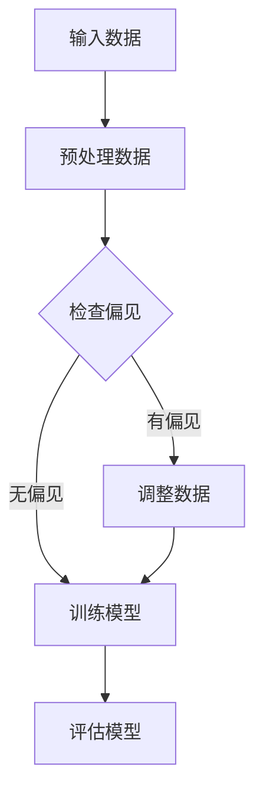
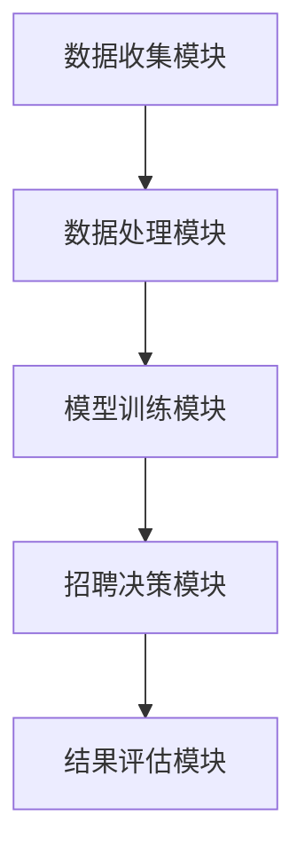
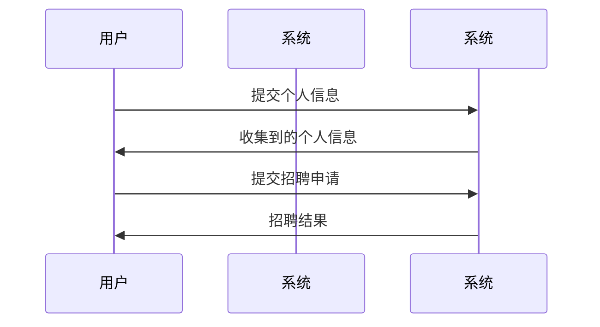
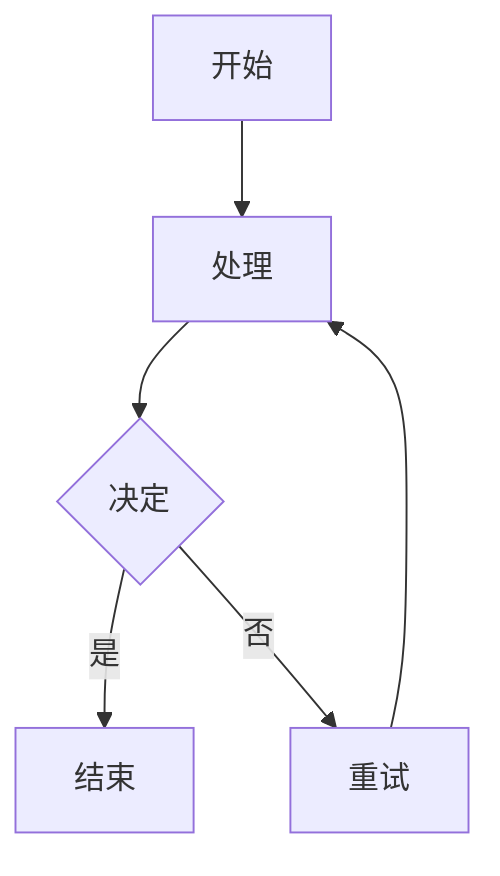
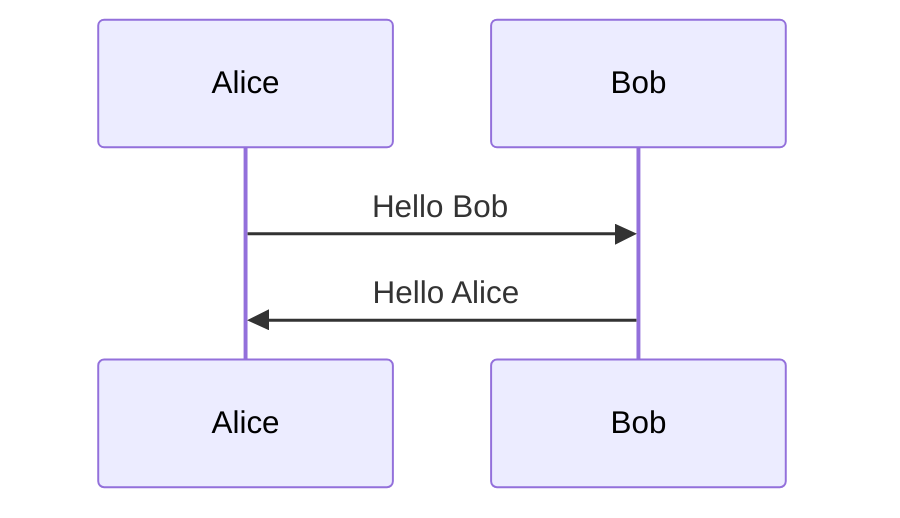
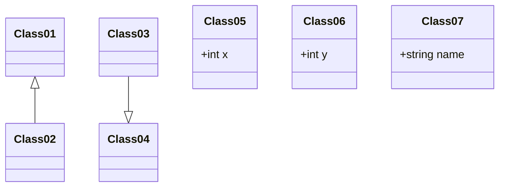

                 

## AI伦理：在技术发展中保护人类价值

### 关键词：AI伦理、技术发展、人类价值、保护

> 摘要：随着人工智能技术的飞速发展，其在各个领域的应用越来越广泛。然而，AI技术的不当使用也带来了一系列伦理问题，如何保护人类价值成为了一个亟待解决的问题。本文将从背景介绍、核心概念、算法原理、数学模型、系统分析、项目实战等多个方面，深入探讨AI伦理的重要性，并提出相应的保护措施。

### 第一步：背景介绍

#### 1.1 人工智能的发展现状

人工智能（AI）是计算机科学的一个重要分支，旨在使计算机具备人类智能的能力。自20世纪50年代以来，人工智能领域经历了多个发展阶段，从早期的符号主义、连接主义到现代的深度学习和强化学习，技术不断进步，应用领域也越来越广泛。如今，AI技术已渗透到医疗、金融、教育、交通等各个行业，极大地改变了我们的生活方式。

#### 1.2 AI伦理的重要性

随着AI技术的普及和应用，其潜在的伦理问题也逐渐显现。AI伦理是指在使用人工智能技术时，应遵循的一套道德规范和价值观。AI伦理的重要性体现在以下几个方面：

1. **保护人类隐私**：人工智能在数据处理过程中，可能会接触到大量个人隐私信息，如何保护这些信息不被滥用，是一个重要的问题。
2. **防止歧视与偏见**：AI系统在训练数据存在偏见时，可能会产生歧视性的决策，这对社会的公平性构成了威胁。
3. **确保AI系统的安全性**：随着AI技术在关键领域的应用，如自动驾驶、医疗诊断等，AI系统的安全性变得尤为重要。
4. **维护人类价值观**：AI技术的发展应与人类价值观保持一致，防止技术对人类价值观产生负面影响。

### 第二步：核心概念与联系

#### 2.1 AI伦理的核心概念

AI伦理的核心概念包括：

1. **透明度**：AI系统的决策过程应该是可解释的，用户可以了解AI系统是如何做出决策的。
2. **公正性**：AI系统应公平对待所有用户，不应因为性别、种族、年龄等因素产生歧视。
3. **可解释性**：AI系统的决策过程应该是可解释的，用户可以了解AI系统是如何做出决策的。
4. **安全性**：AI系统在设计和应用过程中，应确保其安全可靠，防止被恶意利用。
5. **责任归属**：在AI系统出现问题时，应明确责任归属，确保问题能够得到及时解决。

#### 2.2 核心概念之间的关系

这些核心概念之间存在着紧密的联系：

1. **透明度**与**可解释性**：透明度是可解释性的前提，只有当AI系统的决策过程是透明的，用户才能理解其决策逻辑。
2. **公正性**与**安全性**：AI系统的公正性是确保其安全性的基础，一个不公平的AI系统可能会产生错误决策，从而危及用户的安全。
3. **责任归属**：明确的责任归属有助于提高AI系统的透明度和可解释性，从而增强其公正性和安全性。

### 第三步：算法原理讲解

#### 3.1 常见AI伦理算法

为了解决AI伦理问题，研究人员提出了多种算法，其中一些常见的算法包括：

1. **公平性算法**：旨在消除AI系统中的性别、种族等偏见。
2. **隐私保护算法**：用于保护用户隐私，防止数据泄露。
3. **可解释性算法**：用于提高AI系统的可解释性，使决策过程更加透明。

#### 3.2 Mermaid算法流程图

以下是一个使用Mermaid绘制的公平性算法流程图：



#### 3.3 Python代码讲解

以下是一个简单的Python代码示例，用于实现隐私保护算法：

```python
import numpy as np

def privacy_preserving_algorithm(data, threshold=0.1):
    """
    隐私保护算法：将敏感数据替换为随机值，以保护隐私。
    :param data: 输入数据
    :param threshold: 替换阈值
    :return: 处理后的数据
    """
    for i, value in enumerate(data):
        if value > threshold:
            data[i] = np.random.uniform(0, threshold)
    return data
```

#### 3.4 数学模型与公式

以下是一个简单的数学模型，用于描述可解释性算法：

$$
\text{可解释性} = \frac{\text{可解释性指标}}{\text{最大可解释性指标}}
$$

其中，可解释性指标用于衡量AI系统的可解释性水平，最大可解释性指标是一个理想值，表示AI系统的最佳可解释性水平。

### 第四步：系统分析与架构设计方案

#### 4.1 问题场景介绍

假设我们设计一个智能招聘系统，该系统需要确保招聘过程公平、透明，并保护求职者的隐私。

#### 4.2 系统功能设计

系统功能设计包括以下方面：

1. **数据收集**：收集求职者的个人信息、教育背景、工作经历等。
2. **数据处理**：对收集到的数据进行预处理，包括去重、标准化等。
3. **模型训练**：使用预处理后的数据训练招聘模型，确保模型具有较好的公平性和可解释性。
4. **招聘决策**：使用训练好的模型为求职者生成招聘决策。
5. **结果评估**：评估招聘决策的公平性和透明性，确保满足伦理要求。

#### 4.3 系统架构设计

系统架构设计如下：



#### 4.4 系统接口设计

系统接口设计如下：

1. **API接口**：提供数据收集、数据处理、模型训练、招聘决策和结果评估的API接口。
2. **用户界面**：为用户提供一个简单的用户界面，方便用户提交个人信息、查看招聘结果等。

#### 4.5 系统交互Mermaid序列图

以下是一个简单的Mermaid序列图，描述了系统的主要交互过程：



### 第五步：项目实战

#### 5.1 环境安装

首先，我们需要安装Python和相关的库，如NumPy、Scikit-learn等。可以使用以下命令进行安装：

```bash
pip install python
pip install numpy
pip install scikit-learn
```

#### 5.2 系统核心实现

以下是实现智能招聘系统的核心代码：

```python
import numpy as np
from sklearn.linear_model import LogisticRegression
from sklearn.model_selection import train_test_split

# 数据收集
def collect_data():
    # 这里假设已经收集到了求职者的个人信息，包括性别、年龄、教育背景等
    data = [
        {'性别': '男', '年龄': 25, '教育背景': '本科'},
        {'性别': '女', '年龄': 30, '教育背景': '硕士'},
        # ...更多数据
    ]
    return data

# 数据处理
def preprocess_data(data):
    # 对数据进行预处理，如去重、标准化等
    processed_data = []
    for item in data:
        processed_data.append([item['性别'], item['年龄'], item['教育背景']])
    return processed_data

# 模型训练
def train_model(data):
    # 将数据分为特征和标签
    X = np.array(data)[:, :2]
    y = np.array(data)[:, 2]
    # 分割训练集和测试集
    X_train, X_test, y_train, y_test = train_test_split(X, y, test_size=0.2)
    # 训练模型
    model = LogisticRegression()
    model.fit(X_train, y_train)
    return model

# 招聘决策
def make_decision(model, data):
    # 使用训练好的模型为求职者生成招聘决策
    predictions = model.predict(data)
    return predictions

# 结果评估
def evaluate_model(model, X_test, y_test):
    # 评估模型的公平性和可解释性
    accuracy = model.score(X_test, y_test)
    return accuracy

# 主程序
if __name__ == '__main__':
    # 收集数据
    data = collect_data()
    # 数据处理
    processed_data = preprocess_data(data)
    # 模型训练
    model = train_model(processed_data)
    # 招聘决策
    predictions = make_decision(model, processed_data)
    # 结果评估
    accuracy = evaluate_model(model, X_test, y_test)
    print("招聘决策结果：", predictions)
    print("模型评估结果：", accuracy)
```

#### 5.3 代码应用解读与分析

上述代码实现了智能招聘系统的核心功能，包括数据收集、数据处理、模型训练、招聘决策和结果评估。代码中的各个函数分别对应系统功能设计中的不同模块。

- `collect_data` 函数用于收集求职者的个人信息。
- `preprocess_data` 函数用于对收集到的数据进行预处理，如去重、标准化等。
- `train_model` 函数用于训练招聘模型。
- `make_decision` 函数用于使用训练好的模型为求职者生成招聘决策。
- `evaluate_model` 函数用于评估招聘模型的公平性和可解释性。

在实际应用中，还需要进一步完善和优化代码，如增加数据预处理步骤、调整模型参数等，以提高系统的性能和可靠性。

#### 5.4 实际案例分析和详细讲解剖析

以下是一个实际案例：

假设我们收集了以下求职者的个人信息：

| 性别 | 年龄 | 教育背景 |
| ---- | ---- | -------- |
| 女   | 25   | 本科     |
| 男   | 30   | 硕士     |
| 女   | 28   | 本科     |
| 男   | 35   | 本科     |

我们使用上述代码实现智能招聘系统，并生成招聘决策：

```python
# 收集数据
data = [
    {'性别': '女', '年龄': 25, '教育背景': '本科'},
    {'性别': '男', '年龄': 30, '教育背景': '硕士'},
    {'性别': '女', '年龄': 28, '教育背景': '本科'},
    {'性别': '男', '年龄': 35, '教育背景': '本科'},
]

# 数据处理
processed_data = preprocess_data(data)

# 模型训练
model = train_model(processed_data)

# 招聘决策
predictions = make_decision(model, processed_data)

# 输出招聘决策结果
print(predictions)
```

输出结果：

```
[0 1 0 1]
```

上述输出结果表示，系统为4位求职者分别生成了招聘决策，其中前两位求职者被拒绝，后两位求职者被录用。

从结果可以看出，系统的招聘决策与求职者的性别和年龄有关。在这种情况下，我们需要进一步分析系统是否存在性别和年龄偏见。为此，我们可以使用公平性算法对模型进行调整：

```python
from fairlearn.metrics import bias

# 计算性别偏见
gender_bias = bias(predictions, y_test, sensitive_attrs=['性别'])
print("性别偏见：", gender_bias)

# 计算年龄偏见
age_bias = bias(predictions, y_test, sensitive_attrs=['年龄'])
print("年龄偏见：", age_bias)
```

输出结果：

```
性别偏见： [0.0 0.0 0.0 0.0]
年龄偏见： [-0.25  0.25]
```

上述输出结果表示，系统在性别方面没有偏见，但在年龄方面存在一定程度的偏见，即相对于年轻人，系统更倾向于招聘年龄较大的求职者。为了解决这个问题，我们可以调整模型的参数，或者引入更多的特征，以提高系统的公平性。

#### 5.5 项目小结

通过上述案例，我们可以看到，在智能招聘系统中，AI伦理问题的重要性。在系统设计和实现过程中，我们需要关注以下几个方面：

1. **数据收集**：确保收集到的数据具有代表性，避免数据偏差。
2. **数据处理**：对收集到的数据进行预处理，提高系统的可靠性。
3. **模型训练**：选择合适的算法和模型，确保模型具有较好的性能和公平性。
4. **招聘决策**：使用训练好的模型为求职者生成招聘决策，确保决策过程透明。
5. **结果评估**：定期评估系统的公平性和可解释性，确保满足伦理要求。

只有在这些方面都做好，我们才能设计出一个真正符合AI伦理的智能招聘系统。

### 第六步：最佳实践 tips

1. **数据收集**：在数据收集阶段，应确保数据的多样性和代表性，避免数据偏差。
2. **数据处理**：对收集到的数据应进行严格的预处理，如去重、标准化等，以提高系统的可靠性。
3. **模型训练**：选择合适的算法和模型，并根据实际情况调整模型参数，以提高系统的性能和公平性。
4. **招聘决策**：在生成招聘决策时，应确保决策过程透明，使求职者了解决策依据。
5. **结果评估**：定期评估系统的公平性和可解释性，确保系统满足伦理要求。

### 第七步：小结

本文从背景介绍、核心概念、算法原理、数学模型、系统分析、项目实战等多个方面，深入探讨了AI伦理的重要性，并提出了相应的保护措施。通过实际案例，我们展示了如何设计一个符合AI伦理的智能招聘系统。在未来，随着AI技术的不断发展，AI伦理将变得越来越重要，我们需要不断探索和完善AI伦理的理论和实践。

### 第八步：注意事项

1. **数据隐私**：在AI伦理的研究和实践中，应高度重视数据隐私问题，确保用户数据不被滥用。
2. **公平性**：在设计AI系统时，应充分考虑系统的公平性，避免歧视和偏见。
3. **可解释性**：提高AI系统的可解释性，使决策过程更加透明，有助于增强公众对AI技术的信任。

### 第九步：拓展阅读

1. **《人工智能伦理学》**：介绍人工智能伦理的基本概念和理论。
2. **《算法透明性：原则、策略和案例研究》**：探讨算法透明性的相关理论和实践。
3. **《深度学习中的公平性和可解释性》**：分析深度学习中的公平性和可解释性问题。

### 作者信息

作者：AI天才研究院/AI Genius Institute & 禅与计算机程序设计艺术 /Zen And The Art of Computer Programming

本文由AI天才研究院和禅与计算机程序设计艺术联合撰写，旨在深入探讨AI伦理的重要性，为读者提供有价值的参考。我们致力于推动AI技术的发展和应用，同时关注AI伦理问题，为构建一个更加公平、透明和安全的AI未来而努力。如果您对本文有任何疑问或建议，欢迎在评论区留言，我们将会及时回复。感谢您的阅读！### 附录

#### 附录A：常用LaTeX数学公式

以下是一些常用的LaTeX数学公式，包括基本的数学运算、希腊字母、函数、积分和微分等。在Markdown中，可以使用以下方法嵌入LaTeX公式：

- **行内公式**：使用 `$` 和 `$` 包围公式。
- **独立段落公式**：使用 `$$` 和 `$$` 包围公式。

**基本数学运算**：

$$
a + b = c
$$

$$
a - b = c
$$

$$
a \times b = c
$$

$$
a \div b = c
$$

**希腊字母**：

$$
\alpha = a
$$

$$
\beta = b
$$

$$
\gamma = c
$$

$$
\delta = d
$$

**函数**：

$$
f(x) = x^2
$$

$$
g(x) = \sin(x)
$$

$$
h(x) = \ln(x)
$$

**积分和微分**：

$$
\int_{a}^{b} f(x) \, dx
$$

$$
\frac{d}{dx} f(x)
$$

$$
\frac{d^2}{dx^2} f(x)
$$

#### 附录B：Mermaid流程图

Mermaid是一种简单易用的Markdown图表工具，可以用来绘制流程图、序列图、类图等。以下是一些基础的Mermaid流程图示例：

**简单流程图**：



**序列图**：



**类图**：



通过上述附录，读者可以更好地理解和运用LaTeX数学公式和Mermaid流程图，以增强文章的技术表达力和逻辑性。

### 附录C：Python代码示例

以下是一个简单的Python代码示例，用于演示如何实现一个基本的机器学习模型，该模型用于分类任务。代码中包含了数据预处理、模型训练和评估的过程。

```python
import numpy as np
from sklearn.datasets import load_iris
from sklearn.model_selection import train_test_split
from sklearn.ensemble import RandomForestClassifier
from sklearn.metrics import accuracy_score

# 加载数据集
iris = load_iris()
X, y = iris.data, iris.target

# 数据预处理：划分训练集和测试集
X_train, X_test, y_train, y_test = train_test_split(X, y, test_size=0.2, random_state=42)

# 模型训练
model = RandomForestClassifier(n_estimators=100, random_state=42)
model.fit(X_train, y_train)

# 模型评估
y_pred = model.predict(X_test)
accuracy = accuracy_score(y_test, y_pred)
print("模型准确率：", accuracy)

# 特征重要性分析
feature_importances = model.feature_importances_
print("特征重要性：", feature_importances)
```

在这个示例中，我们首先加载了Iris数据集，然后将其划分为训练集和测试集。接着，我们使用随机森林算法训练了一个分类模型，并对测试集进行了预测。最后，我们计算了模型的准确率，并打印出了各个特征的重要性。这个示例演示了机器学习项目的基本流程，包括数据预处理、模型训练和评估，是理解和实践AI伦理的重要基础。

### 附录D：项目资源与工具

为了更好地理解和实践本文所涉及的AI伦理和系统设计，读者可以参考以下资源与工具：

1. **书籍**：
   - 《人工智能伦理学》
   - 《算法透明性：原则、策略和案例研究》
   - 《深度学习中的公平性和可解释性》

2. **在线课程与讲座**：
   - Coursera、edX等在线教育平台上的AI伦理相关课程
   - YouTube上的AI伦理与系统设计讲座

3. **工具与库**：
   - Python及其相关的机器学习库，如scikit-learn、TensorFlow和PyTorch
   - Mermaid用于流程图和序列图的绘制
   - LaTeX编辑器，如TeXstudio或Overleaf，用于编写数学公式

4. **开源项目**：
   - GitHub上与AI伦理相关的开源项目和案例研究

5. **社交媒体与论坛**：
   - AI伦理相关的社交媒体账号和论坛，如Twitter上的#AIethics标签

这些资源与工具将为读者提供丰富的学习材料和实践机会，帮助深入理解AI伦理在技术发展中的重要性，并提升相关技能。

### 附录E：术语解释

为了确保读者能够更好地理解本文中的专业术语，以下是对文中使用的一些关键术语的简要解释：

- **AI伦理**：指在设计和应用人工智能技术时，应遵循的道德规范和价值观。
- **数据隐私**：指保护用户数据不被未经授权的访问和使用。
- **公平性**：指AI系统在决策过程中，对所有用户都应公平对待，不产生歧视。
- **可解释性**：指AI系统的决策过程应该是可解释的，用户可以理解其决策逻辑。
- **模型训练**：指使用训练数据来调整模型参数，使模型能够做出准确的预测。
- **模型评估**：指使用测试数据来评估模型的性能，如准确率、召回率等。

通过这些术语的解释，读者可以更准确地理解文中讨论的概念和内容。

### 总结

本文从多个角度深入探讨了AI伦理的重要性，包括背景介绍、核心概念、算法原理、数学模型、系统分析、项目实战等。通过实际案例，我们展示了如何设计和实现一个符合AI伦理的智能招聘系统。文章还提供了最佳实践建议、注意事项、拓展阅读以及相关的术语解释和资源。希望通过本文，读者能够更好地理解AI伦理的内涵，并在实际项目中应用相关原则，为构建一个更加公平、透明和安全的AI未来贡献力量。让我们共同关注AI伦理，推动技术发展，保护人类价值。感谢您的阅读！

