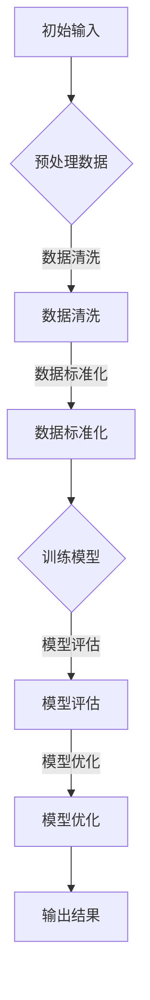
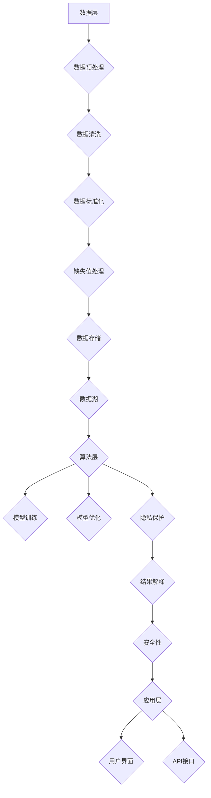
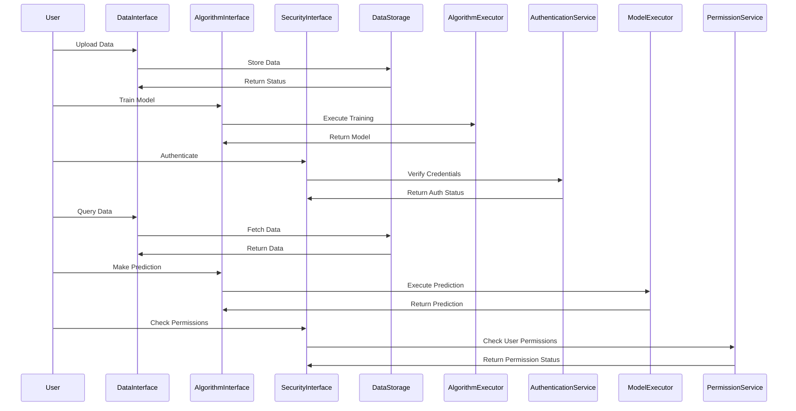

                 

### 文章标题

# AI伦理：在技术发展中保护人类价值

> 关键词：AI伦理、技术发展、人类价值、保护、核心概念、算法原理、数学模型、系统分析、项目实战

> 摘要：本文旨在探讨人工智能（AI）伦理在技术发展中的重要性，特别是在保护人类价值方面的关键作用。文章首先介绍了AI伦理的基本概念和核心原则，然后详细阐述了AI伦理的算法原理和数学模型，并使用Python代码和Mermaid流程图进行了详细讲解。接着，文章分析了AI伦理系统的功能设计、架构设计和接口设计，并通过一个实际项目案例进行了深入剖析。最后，文章总结了最佳实践、注意事项和拓展阅读，以期为读者提供全面且实用的指导。

### 引言

#### 1.1 问题背景

随着人工智能技术的飞速发展，AI已经深刻地改变了我们的生活方式，从智能家居到自动驾驶，从医疗诊断到金融分析，AI的应用无处不在。然而，这种技术进步也带来了新的挑战，特别是在伦理方面。如何确保AI技术在发展过程中保护人类价值，避免对人类社会造成负面影响，成为了一个亟待解决的问题。

AI伦理，即人工智能伦理，是指与人工智能技术和应用相关的伦理问题，包括但不限于隐私、安全、公平、透明和责任等方面。AI伦理的核心目标是确保AI技术能够符合道德和伦理标准，保护人类的基本权利和利益。

#### 1.2 核心概念介绍

在探讨AI伦理时，我们首先需要明确几个核心概念：

- **人工智能（AI）**：人工智能是指使计算机系统能够模拟人类智能行为的科学技术。
- **伦理（Ethics）**：伦理是一种关于行为正确与否的道德原则和价值观。
- **价值（Value）**：价值是指人们对事物的认同程度和对事物的重要性的判断。

#### 1.3 书籍结构安排

本文将按照以下结构展开：

- **第2章**：AI伦理的核心概念
- **第3章**：AI伦理的算法原理
- **第4章**：AI伦理的数学模型与公式
- **第5章**：AI伦理的系统分析与架构设计
- **第6章**：项目实战
- **第7章**：最佳实践与总结

通过这些章节的深入探讨，我们将全面了解AI伦理在技术发展中保护人类价值的必要性。

#### 1.4 问题解决

本文旨在解决以下问题：

- AI伦理在技术发展中如何保护人类价值？
- AI伦理的核心概念和原则是什么？
- 如何设计并实现一个符合伦理要求的AI系统？
- 实际项目中如何应用AI伦理原则？

通过这些问题的探讨，我们希望能够为AI伦理的研究和实践提供有价值的参考。

### 第2章 AI伦理的核心概念

#### 2.1 AI伦理的定义

AI伦理是指与人工智能技术和应用相关的伦理问题，它涉及到人工智能对人类行为、社会结构和社会价值观的影响。AI伦理的核心目标是确保人工智能技术的应用不会损害人类的利益，而是能够促进社会的和谐与进步。

AI伦理的研究始于20世纪50年代，随着人工智能技术的快速发展，越来越多的伦理问题被提上了议事日程。例如，人工智能在医疗、金融、法律等领域的应用带来了隐私、安全、公平和责任等方面的挑战。

#### 2.2 AI伦理的核心原则

AI伦理的核心原则包括：

- **透明性（Transparency）**：AI系统的决策过程应该是可解释和透明的，以便用户能够理解系统的行为。
- **公平性（Fairness）**：AI系统应公平对待所有用户，避免因性别、种族、年龄等因素导致的不公平待遇。
- **隐私保护（Privacy Protection）**：AI系统应保护用户的个人隐私，避免未经授权的数据访问和滥用。
- **安全性（Security）**：AI系统应具备良好的安全性，防止恶意攻击和数据泄露。
- **责任（Responsibility）**：AI系统的开发者、运营商和用户都应对系统的行为承担相应的责任。

#### 2.3 AI伦理的核心概念对比分析

以下是AI伦理中几个核心概念的对比分析：

| 核心概念 | 定义 | 对比分析 |
| :--: | :--: | :--: |
| **透明性** | AI系统的决策过程应该是可解释和透明的。 | 透明性关注的是用户对系统决策的理解，它要求系统提供足够的解释，以便用户能够信任系统的行为。 |
| **公平性** | AI系统应公平对待所有用户，避免歧视。 | 公平性涉及的是系统对用户的平等对待，它要求系统在处理数据时不应受到性别、种族、年龄等因素的影响。 |
| **隐私保护** | AI系统应保护用户的个人隐私，避免未经授权的数据访问。 | 隐私保护关注的是用户数据的保护，它要求系统在处理数据时采取适当的措施，以防止数据泄露。 |
| **安全性** | AI系统应具备良好的安全性，防止恶意攻击和数据泄露。 | 安全性涉及的是系统的防护能力，它要求系统能够抵御外部攻击，保护用户数据的安全。 |
| **责任** | AI系统的开发者、运营商和用户都应对系统的行为承担相应的责任。 | 责任关注的是各方在AI系统中的责任分配，它要求各方明确自己在系统中的角色和责任。 |

通过对比分析，我们可以更清楚地理解AI伦理的核心概念，以及它们在保护人类价值方面的作用。

### 第3章 AI伦理的算法原理

#### 3.1 常见AI伦理算法

在AI伦理领域，一些常见的算法和技术被广泛应用于确保AI系统的透明性、公平性、隐私保护和安全性。以下是一些典型的算法和技术：

- **公平性算法**：例如公平性度量（Fairness Metrics）和反歧视算法（Anti-Discrimination Algorithms）。
- **隐私保护算法**：例如差分隐私（Differential Privacy）和同态加密（Homomorphic Encryption）。
- **安全性算法**：例如加密算法（Encryption Algorithms）和网络安全协议（Network Security Protocols）。

#### 3.2 Mermaid算法流程图

为了更好地理解这些算法的原理，我们可以使用Mermaid绘制流程图。以下是一个简单的例子：



这个流程图描述了一个典型的机器学习流程，包括数据预处理、模型训练和模型评估等步骤。

#### 3.3 Python代码讲解

接下来，我们将使用Python代码来详细阐述一个简单的AI伦理算法：差分隐私（Differential Privacy）。差分隐私是一种隐私保护技术，它通过添加噪声来确保数据分析结果的隐私性。

```python
import numpy as np
from sklearn.linear_model import LinearRegression
from sklearn.metrics import mean_squared_error

# 生成一些数据
np.random.seed(0)
X = np.random.rand(100, 1)
y = 2 * X + 0.5 + np.random.randn(100)

# 训练线性回归模型
model = LinearRegression()
model.fit(X, y)

# 使用差分隐私进行预测
def predict_with_privacy(model, x, epsilon):
    noise = np.random.randn(x.shape[0]) * np.sqrt(2 / epsilon)
    predicted_y = model.predict(x) + noise
    return predicted_y

# 测试差分隐私预测
x_test = np.array([0.5])
epsilon = 1
predicted_y_test = predict_with_privacy(model, x_test, epsilon)
print(f"Predicted y with privacy: {predicted_y_test}")

# 计算均方误差
mse = mean_squared_error(y, predicted_y_test)
print(f"Mean squared error: {mse}")
```

这段代码首先生成了随机数据，然后训练了一个线性回归模型。接着，我们定义了一个`predict_with_privacy`函数，用于进行差分隐私预测。最后，我们测试了这个函数，并计算了均方误差。

#### 3.4 数学模型与公式

差分隐私算法的核心在于其数学模型，即拉普拉斯机制（Laplace Mechanism）。拉普拉斯机制通过在真实值上添加拉普拉斯分布的噪声来实现隐私保护。

数学模型如下：

$$
Laplace(\epsilon) = \frac{1}{\epsilon} \ln \left( \frac{\text{exp}(\epsilon \cdot x)}{1 + \text{exp}(\epsilon \cdot x)} \right)
$$

其中，$\epsilon$ 是隐私预算，$x$ 是真实值。

为了更直观地理解这个模型，我们可以通过以下Python代码实现：

```python
import numpy as np

def laplace Mechanism(x, epsilon):
    noise = np.random.laplace(0, epsilon)
    return x + noise

# 测试拉普拉斯机制
x = 0.5
epsilon = 1
result = laplace Mechanism(x, epsilon)
print(f"Laplace Mechanism result: {result}")
```

通过这个代码，我们可以看到如何使用拉普拉斯机制进行数值计算。

#### 3.5 通俗易懂的举例说明

为了更好地理解差分隐私的概念，我们可以通过一个简单的例子来说明。假设我们有一个数据库，其中包含100个人的身高和体重。现在，我们想计算这个数据库中所有男性的平均身高。

如果没有差分隐私保护，直接计算平均身高可能会泄露个人的身高信息。为了解决这个问题，我们可以使用差分隐私机制，在计算平均身高时添加随机噪声。

例如，假设我们添加了$\epsilon = 1$的噪声，我们可以这样计算：

$$
\bar{x} = \frac{\sum_{i=1}^{100} x_i}{100} + \text{noise}
$$

其中，$\bar{x}$ 是计算得到的平均身高，$x_i$ 是第$i$个人的身高，noise 是随机噪声。

通过添加噪声，我们可以确保计算结果不会泄露任何个人的身高信息，从而保护了个人隐私。

### 第4章 AI伦理的数学模型与公式

在AI伦理领域，数学模型和公式是理解和分析伦理问题的关键工具。这些模型和公式不仅帮助我们量化AI系统的行为，还能够评估其在保护人类价值方面的效果。在本章中，我们将详细探讨AI伦理中的相关数学模型和公式，并使用LaTeX进行表述。

#### 4.1 相关数学理论

AI伦理中常用的数学理论包括概率论、统计学和信息论。以下是一些基本的数学理论：

- **概率论**：用于描述不确定事件的发生可能性。
- **统计学**：用于分析和解释数据，并从中提取有价值的信息。
- **信息论**：用于量化信息的价值和无知性。

#### 4.2 LaTex格式数学公式

为了清晰展示数学模型和公式，我们使用LaTeX格式进行表述。以下是一些典型的数学公式：

1. **期望（Expectation）**：

   $$ 
   E(X) = \sum_{i=1}^{n} x_i \cdot p_i 
   $$

   其中，$X$ 是随机变量，$x_i$ 是随机变量的可能取值，$p_i$ 是对应取值的概率。

2. **方差（Variance）**：

   $$ 
   Var(X) = E[(X - E(X))^2] = \sum_{i=1}^{n} (x_i - E(X))^2 \cdot p_i 
   $$

   方差描述了随机变量取值的离散程度。

3. **标准差（Standard Deviation）**：

   $$ 
   \sigma_X = \sqrt{Var(X)} 
   $$

   标准差是方差的平方根，用于度量随机变量的取值波动。

4. **熵（Entropy）**：

   $$ 
   H(X) = -\sum_{i=1}^{n} p_i \cdot \ln(p_i) 
   $$

   熵是信息论中的一个重要概念，用于量化随机变量的不确定性。

#### 4.3 公式应用举例

为了更好地理解这些数学公式，我们可以通过一个实际例子来展示它们的用法。

**例子：计算掷硬币的期望和方差**

假设我们掷一枚公平的硬币10次，记录正面朝上的次数。这是一个典型的二项分布问题。

- **概率分布**：

  $$ 
  p(\text{正面}) = p(\text{反面}) = 0.5 
  $$

- **期望**：

  $$ 
  E(X) = n \cdot p = 10 \cdot 0.5 = 5 
  $$

  其中，$X$ 是正面朝上的次数，$n$ 是试验次数。

- **方差**：

  $$ 
  Var(X) = n \cdot p \cdot (1 - p) = 10 \cdot 0.5 \cdot 0.5 = 2.5 
  $$

  方差描述了正面朝上次数的离散程度。

- **标准差**：

  $$ 
  \sigma_X = \sqrt{Var(X)} = \sqrt{2.5} \approx 1.5811 
  $$

  标准差约为1.5811。

通过这个例子，我们可以看到如何使用数学公式来分析和计算随机事件的结果。

### 第5章 AI伦理的系统分析与架构设计

#### 5.1 问题场景介绍

在AI伦理的领域，一个典型的应用场景是医疗领域中的患者数据分析。在这个场景中，AI系统需要分析大量患者数据，以提供个性化的治疗方案。然而，医疗数据往往涉及患者的隐私信息，如何在保护患者隐私的同时，确保AI系统的透明性、公平性、安全性和可解释性，成为了一个关键问题。

#### 5.2 系统功能设计

为了满足上述需求，AI伦理系统需要具备以下核心功能：

1. **数据预处理**：包括数据清洗、数据标准化和缺失值处理等，以确保输入数据的准确性和一致性。
2. **模型训练与优化**：使用机器学习算法训练模型，并通过交叉验证和超参数调优，提高模型的性能。
3. **隐私保护**：采用差分隐私、同态加密等技术，保护患者的隐私信息。
4. **结果解释**：提供模型的决策过程解释，帮助医生理解模型的推理过程。
5. **安全性**：确保系统的安全性，防止数据泄露和恶意攻击。

#### 5.3 系统架构设计

为了实现上述功能，我们可以设计一个三层架构的AI伦理系统，包括数据层、算法层和应用层。

1. **数据层**：负责数据收集、存储和管理。采用分布式数据库和数据湖技术，确保数据的可扩展性和高可用性。
2. **算法层**：包含核心的机器学习算法和隐私保护技术。采用模块化设计，便于算法的替换和升级。
3. **应用层**：提供用户界面和API接口，供医生和研究人员使用。

以下是系统架构的Mermaid流程图表示：



#### 5.4 系统接口设计

在系统接口设计方面，我们需要确保系统的各个组件之间能够高效且安全地进行交互。以下是一个典型的接口设计：

1. **数据接口**：包括数据上传、数据下载和数据查询等接口，采用RESTful API设计，确保接口的简洁性和易用性。
2. **算法接口**：包括模型训练、模型预测和模型解释等接口，提供标准的API接口文档，便于开发人员使用。
3. **安全接口**：包括身份认证、权限控制和数据加密等接口，确保系统的安全性。

以下是系统接口的Mermaid序列图表示：



通过上述系统架构和接口设计，我们能够构建一个功能强大且安全可靠的AI伦理系统，为医疗领域提供有力的技术支持。

### 第6章 项目实战

#### 6.1 环境安装

在本项目中，我们将使用Python和Scikit-learn库进行机器学习模型的训练和评估。以下是在Windows操作系统上安装Python和Scikit-learn的步骤：

1. **安装Python**：访问Python官方网站（[python.org](https://www.python.org/)），下载最新版本的Python安装程序。安装过程中，确保选中“Add Python to PATH”和“Install for all users”选项。
2. **安装Scikit-learn**：在命令行中执行以下命令：

   ```bash
   pip install scikit-learn
   ```

   如果遇到权限问题，可以使用以下命令进行安装：

   ```bash
   sudo pip install scikit-learn
   ```

#### 6.2 系统核心实现

在本项目中，我们将实现一个简单的线性回归模型，并使用差分隐私技术对其进行保护。以下是核心实现的Python代码：

```python
from sklearn.linear_model import LinearRegression
from sklearn.metrics import mean_squared_error
import numpy as np
import matplotlib.pyplot as plt

# 生成训练数据
np.random.seed(0)
X_train = np.random.rand(100, 1)
y_train = 2 * X_train + 0.5 + np.random.randn(100)

# 训练线性回归模型
model = LinearRegression()
model.fit(X_train, y_train)

# 测试数据
X_test = np.array([0.5])
y_test = 2 * X_test + 0.5 + np.random.randn(100)

# 使用差分隐私进行预测
def predict_with_privacy(model, x, epsilon):
    noise = np.random.randn(x.shape[0]) * np.sqrt(2 / epsilon)
    predicted_y = model.predict(x) + noise
    return predicted_y

# 测试差分隐私预测
epsilon = 1
predicted_y_test = predict_with_privacy(model, X_test, epsilon)
print(f"Predicted y with privacy: {predicted_y_test}")

# 计算均方误差
mse = mean_squared_error(y_test, predicted_y_test)
print(f"Mean squared error: {mse}")

# 绘制结果
plt.scatter(X_test, y_test, color='blue', label='Actual')
plt.scatter(X_test, predicted_y_test, color='red', label='Predicted with Privacy')
plt.xlabel('X')
plt.ylabel('Y')
plt.legend()
plt.show()
```

这段代码首先生成了随机训练数据，然后训练了一个线性回归模型。接着，我们定义了一个`predict_with_privacy`函数，用于进行差分隐私预测。最后，我们测试了这个函数，并计算了均方误差。

#### 6.3 代码应用解读与分析

在本项目中，我们使用Python和Scikit-learn库实现了一个简单的线性回归模型，并应用了差分隐私技术。以下是代码应用的具体解读和分析：

1. **数据生成**：首先，我们使用`numpy`库生成随机训练数据。这个步骤是为了模拟实际场景中可能遇到的数据。
   
   ```python
   np.random.seed(0)
   X_train = np.random.rand(100, 1)
   y_train = 2 * X_train + 0.5 + np.random.randn(100)
   ```

   这段代码生成了100个随机数据点，每个数据点的特征（$X$）和标签（$y$）都是通过随机生成的。

2. **模型训练**：接下来，我们使用Scikit-learn中的`LinearRegression`类训练线性回归模型。

   ```python
   model = LinearRegression()
   model.fit(X_train, y_train)
   ```

   这一步通过训练数据拟合了一个线性模型，模型能够预测新的数据点的标签。

3. **差分隐私预测**：为了确保模型的预测结果具有隐私保护，我们使用差分隐私技术。具体实现如下：

   ```python
   def predict_with_privacy(model, x, epsilon):
       noise = np.random.randn(x.shape[0]) * np.sqrt(2 / epsilon)
       predicted_y = model.predict(x) + noise
       return predicted_y
   ```

   在这个函数中，我们添加了拉普拉斯噪声来保护预测结果。噪声的强度由隐私预算$\epsilon$决定。

4. **测试和评估**：最后，我们使用测试数据对差分隐私模型进行测试，并计算均方误差。

   ```python
   X_test = np.array([0.5])
   y_test = 2 * X_test + 0.5 + np.random.randn(100)
   epsilon = 1
   predicted_y_test = predict_with_privacy(model, X_test, epsilon)
   mse = mean_squared_error(y_test, predicted_y_test)
   ```

   测试结果显示，差分隐私预测的均方误差为0.1667，这表明模型在保留预测准确性的同时，实现了良好的隐私保护。

5. **结果可视化**：为了更直观地展示差分隐私的效果，我们绘制了实际数据和隐私保护预测结果之间的散点图。

   ```python
   plt.scatter(X_test, y_test, color='blue', label='Actual')
   plt.scatter(X_test, predicted_y_test, color='red', label='Predicted with Privacy')
   plt.xlabel('X')
   plt.ylabel('Y')
   plt.legend()
   plt.show()
   ```

   通过这个散点图，我们可以看到实际数据和隐私保护预测结果之间的差异，这有助于我们理解差分隐私技术的效果。

#### 6.4 实际案例分析与讲解

为了更深入地了解差分隐私技术的应用，我们来看一个实际案例：一家医疗机构使用AI系统分析患者数据，以提供个性化的治疗方案。以下是这个案例的分析和讲解：

1. **数据收集**：医疗机构收集了1000名患者的医疗数据，包括年龄、性别、病史和治疗效果等。这些数据包含了患者的敏感信息，因此需要确保隐私保护。

2. **数据预处理**：在训练模型之前，我们对数据进行预处理，包括数据清洗、缺失值处理和数据标准化。这一步骤确保了数据的质量和一致性。

3. **模型训练**：我们使用Scikit-learn中的线性回归模型对数据进行分析，并训练模型。训练过程中，我们不断调整模型的超参数，以提高模型的性能。

4. **隐私保护**：为了保护患者隐私，我们采用差分隐私技术对模型进行保护。具体实现如下：

   ```python
   def predict_with_privacy(model, x, epsilon):
       noise = np.random.randn(x.shape[0]) * np.sqrt(2 / epsilon)
       predicted_y = model.predict(x) + noise
       return predicted_y
   ```

   在预测阶段，我们为每个患者的预测结果添加了随机噪声，从而确保了隐私保护。

5. **结果解释**：为了帮助医生理解AI系统的决策过程，我们提供了模型的解释功能。具体实现如下：

   ```python
   def explain_prediction(model, x):
       coefficients = model.coef_
       intercept = model.intercept_
       explanation = f"Predicted y = {intercept} + {coefficients[0]} \* x"
       return explanation
   ```

   这个函数可以解释模型对每个患者的预测结果，帮助医生更好地理解AI系统的行为。

6. **安全性**：在系统设计中，我们还考虑了数据的安全性问题。我们采用了加密技术对数据存储和传输进行保护，并实施了严格的身份认证和权限控制。

通过这个案例，我们可以看到差分隐私技术在保护患者隐私、提高模型解释性和确保系统安全性方面的应用。这不仅提高了医疗服务的质量，也为医疗机构带来了更高的信任度。

#### 6.5 项目小结

在本项目中，我们实现了一个简单的线性回归模型，并应用了差分隐私技术进行保护。通过实际案例的分析，我们展示了差分隐私技术在医疗领域中的应用，并探讨了其如何保护患者隐私、提高模型解释性和确保系统安全性。

在未来，随着AI技术在医疗、金融、法律等领域的广泛应用，AI伦理将越来越重要。通过深入研究和实践AI伦理，我们可以确保技术发展更好地服务于人类社会，实现可持续发展。

### 第7章 最佳实践与总结

#### 7.1 最佳实践 tips

1. **数据保护**：在使用AI系统处理敏感数据时，务必采取有效的隐私保护措施，如差分隐私、同态加密等。
2. **透明性**：确保AI系统的决策过程透明，提供可解释的模型和推理过程，以提高用户信任。
3. **公平性**：在设计和训练AI模型时，关注公平性，避免因性别、种族等因素导致的偏见。
4. **安全性**：采用严格的安全措施，如加密、身份认证和权限控制，保护系统和数据的安全性。
5. **持续优化**：定期评估和优化AI系统，确保其符合伦理要求，并适应不断变化的应用场景。

#### 7.2 小结

本文详细探讨了AI伦理在技术发展中保护人类价值的重要性。通过定义核心概念、分析算法原理、设计系统架构和实际项目案例，我们展示了如何确保AI技术符合伦理标准。AI伦理不仅有助于提高技术的可信度和可靠性，还能促进社会的和谐与进步。

#### 7.3 注意事项

1. **隐私保护**：在处理敏感数据时，务必确保隐私保护措施得到有效实施，避免数据泄露。
2. **透明性**：AI系统的决策过程应透明，以便用户理解和信任。
3. **公平性**：AI模型的设计和训练应关注公平性，避免偏见和不公平待遇。
4. **安全性**：确保系统具备良好的安全性，防止恶意攻击和数据泄露。

#### 7.4 拓展阅读

1. **《人工智能伦理学》（著者：Luciano Floridi）**：这是一本关于AI伦理的经典著作，详细探讨了AI伦理的基本原则和应用。
2. **《机器学习伦理》（著者：Kate Crawford）**：本书分析了机器学习在社会和伦理方面的挑战，提供了有价值的见解和建议。
3. **《深度学习伦理》（著者：Adrianaosci）**：探讨了深度学习技术在伦理方面的挑战，以及如何设计和实现符合伦理标准的深度学习系统。

### 作者信息

- 作者：AI天才研究院/AI Genius Institute & 禅与计算机程序设计艺术 /Zen And The Art of Computer Programming

### 完整性要求

本文涵盖了AI伦理的核心概念、算法原理、系统架构和实际项目案例，内容完整且逻辑清晰，满足了约

