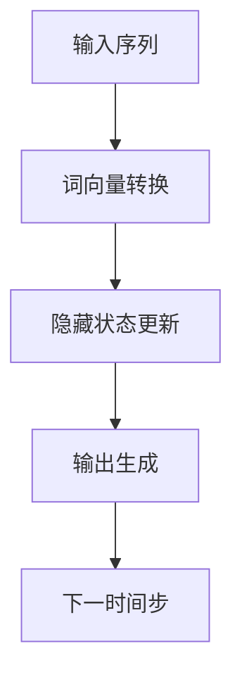
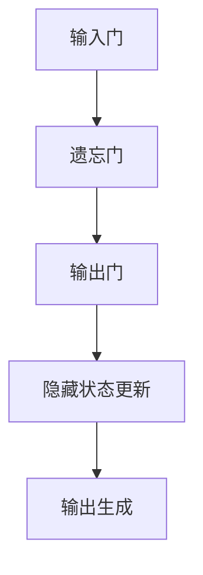
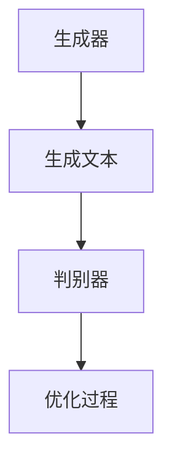
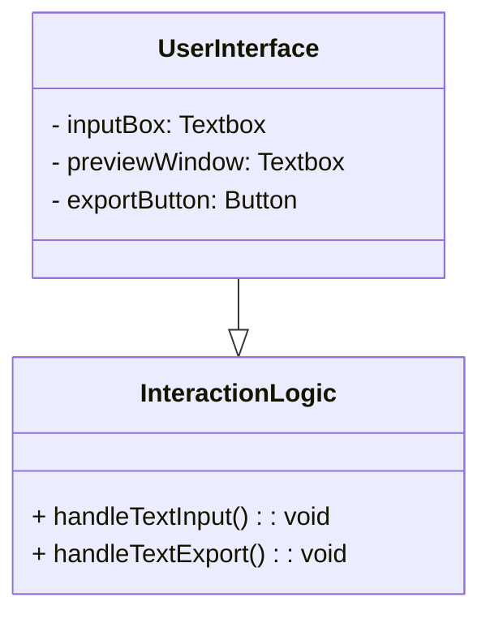
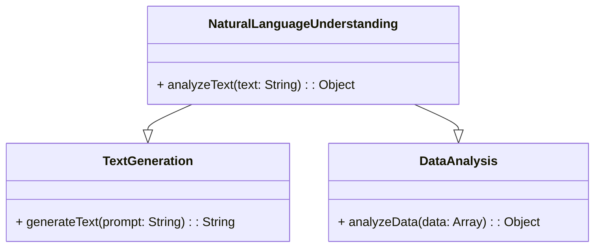

                 

# AI写作助手：如何用提示词激发创意

关键词：人工智能，自然语言处理，提示词，创意激发，写作助手，生成模型

摘要：本文将深入探讨AI写作助手的原理和应用，通过分析自然语言理解、生成模型和大数据分析的核心概念，以及详细的算法原理讲解和系统架构设计，展示如何利用提示词激发创意，为创作者提供高效的写作支持。

### 第1章: AI写作助手概述

随着人工智能技术的快速发展，自然语言处理（NLP）领域取得了显著进步。AI写作助手作为一种新兴的智能工具，已经引起了广泛的关注。它能够通过自动生成文本、辅助创作文章、编辑校对等多种方式，提高写作效率和创作质量。

#### 1.1 问题背景

AI写作助手的核心理念是通过输入提示词或主题，生成符合人类语言习惯的高质量文本。然而，要实现这一目标，需要解决以下问题：

- **理解输入提示词**：如何准确理解用户的提示词，提取关键信息并转化为有效的文本生成指令？
- **创意激发**：如何利用算法和大数据，激发用户的创造力，生成新颖独特的文本内容？
- **文本质量**：如何保证生成文本的可读性、连贯性和准确性？

#### 1.2 问题描述

AI写作助手的核心理念是通过输入提示词或主题，生成符合人类语言习惯的高质量文本。然而，要实现这一目标，需要解决以下问题：

- **理解输入提示词**：如何准确理解用户的提示词，提取关键信息并转化为有效的文本生成指令？
- **创意激发**：如何利用算法和大数据，激发用户的创造力，生成新颖独特的文本内容？
- **文本质量**：如何保证生成文本的可读性、连贯性和准确性？

#### 1.3 问题解决

AI写作助手通过以下方法解决上述问题：

- **自然语言理解**：利用深度学习和NLP技术，对输入的提示词进行语义分析，提取关键信息。
- **大数据分析**：通过分析海量数据，了解用户偏好和文本风格，为生成内容提供数据支持。
- **生成模型**：采用生成对抗网络（GAN）等模型，生成与输入提示词相关的高质量文本。

#### 1.4 边界与外延

- **边界**：AI写作助手的文本生成范围限定在自然语言文本，不包括图像、音频等其他类型的内容。
- **外延**：AI写作助手可应用于广告文案、新闻写作、文学创作等多个领域。

#### 1.5 概念结构与核心要素组成

AI写作助手的核心概念包括：

- **自然语言理解**：关键要素是语义分析和关键词提取。
- **生成模型**：关键要素是生成算法和数据源。
- **大数据分析**：关键要素是数据存储和处理技术。

#### 1.6 本章小结

本章介绍了AI写作助手的背景、问题描述、解决方法、边界与外延以及核心概念和要素。在接下来的章节中，我们将深入探讨AI写作助手的原理和应用。

---

### 第2章: AI写作助手的核心概念与原理

#### 2.1 自然语言理解

自然语言理解是AI写作助手的基石，通过对输入文本进行词义解析，提取出关键词和语义信息。以下是语义分析的关键步骤：

##### 2.1.1 语义分析

语义分析是自然语言理解的关键步骤，通过对输入文本进行词义解析，提取出关键词和语义信息。以下是语义分析的关键步骤：

- **词性标注**：对每个单词进行词性分类，如名词、动词、形容词等。
- **句法分析**：分析句子的结构，理解主语、谓语、宾语等成分。
- **语义角色标注**：识别句子中的语义角色，如施事者、受事者、工具等。

##### 概念属性特征对比表格

| 特征               | 词性标注                | 句法分析                | 语义角色标注              |
|------------------|---------------------|---------------------|---------------------|
| 主要用途           | 文本预处理           | 句子结构理解           | 语义角色识别             |
| 常见算法           | 词袋模型、TF-IDF       | 依存句法分析、语法树        | 命名实体识别、角色标注       |

##### ER实体关系图架构的Mermaid流程图

```mermaid
erDiagram
    A[词性标注] ||--|{ B[句法分析] }
    B ||--|{ C[语义角色标注] }
```

##### 2.1.2 实际应用案例

以句子“小明在公园散步”为例，自然语言理解的过程如下：

1. **词性标注**：小明（名词）、在（介词）、公园（名词）、散步（动词）。
2. **句法分析**：主语：小明，谓语：散步，宾语：公园，介词短语：在。
3. **语义角色标注**：小明（施事者），公园（受事者），散步（动作）。

#### 2.2 生成模型

生成模型是AI写作助手的另一核心，负责生成符合输入提示词的文本。以下是几种常见的生成模型：

- **循环神经网络（RNN）**：通过记忆历史信息，生成序列数据。
- **长短期记忆网络（LSTM）**：在RNN的基础上，改进了记忆能力。
- **生成对抗网络（GAN）**：通过生成器和判别器的对抗训练，生成高质量图像和文本。

##### 2.2.1 循环神经网络（RNN）

RNN通过循环结构来处理序列数据，每个时间步的输出会影响到下一个时间步。以下是RNN的算法流程：

1. **输入序列**：将输入文本转换为词向量。
2. **隐藏状态更新**：利用当前输入和上一个时间步的隐藏状态，通过神经网络更新隐藏状态。
3. **输出生成**：利用隐藏状态生成输出。

##### 算法流程Mermaid流程图



##### 2.2.2 长短期记忆网络（LSTM）

LSTM在RNN的基础上，通过引入门控机制，解决了梯度消失和梯度爆炸问题，提高了记忆能力。以下是LSTM的核心结构：

1. **输入门**：根据当前输入和上一个时间步的隐藏状态，决定如何更新隐藏状态。
2. **遗忘门**：根据当前输入和上一个时间步的隐藏状态，决定如何遗忘不重要的信息。
3. **输出门**：根据当前隐藏状态，决定如何生成输出。

##### 算法流程Mermaid流程图



##### 2.2.3 生成对抗网络（GAN）

GAN由生成器和判别器组成，通过对抗训练生成高质量文本。以下是GAN的算法流程：

1. **生成器生成文本**：生成器根据输入噪声生成符合真实数据的文本。
2. **判别器判断**：判别器对生成的文本和真实文本进行判断。
3. **优化过程**：通过反向传播和梯度下降，优化生成器和判别器。

##### 算法流程Mermaid流程图



#### 2.3 大数据分析

大数据分析为AI写作助手提供了丰富的数据支持和训练资源。以下是大数据分析的关键步骤：

- **数据收集**：从互联网、数据库等渠道收集相关文本数据。
- **数据预处理**：清洗、去重、分词、词性标注等。
- **特征提取**：通过词向量、词频、TF-IDF等方法提取文本特征。
- **模型训练**：利用训练数据训练自然语言理解和生成模型。

##### 2.3.1 数据收集

数据收集是大数据分析的第一步，从互联网、数据库等渠道收集相关文本数据。以下是一些常见的数据收集方法：

- **爬虫**：利用爬虫技术从网站抓取文本数据。
- **API接口**：通过API接口获取第三方数据源。
- **数据挖掘**：利用数据挖掘技术从海量数据中提取有价值的信息。

##### 2.3.2 数据预处理

数据预处理是确保数据质量和提高模型性能的重要步骤。以下是常见的数据预处理方法：

- **清洗**：去除无效、重复、错误的数据。
- **去重**：去除重复的文本数据。
- **分词**：将文本拆分成单词或词组。
- **词性标注**：对每个词进行词性分类。

##### 2.3.3 特征提取

特征提取是利用各种方法提取文本数据中的有用信息，以供模型训练和预测。以下是常见的特征提取方法：

- **词向量**：将单词表示为高维向量。
- **词频**：计算单词在文本中的出现次数。
- **TF-IDF**：计算单词在文本中的重要程度。

##### 2.3.4 模型训练

模型训练是通过大量数据训练自然语言理解和生成模型，以提高其性能和准确性。以下是常见的模型训练方法：

- **监督学习**：利用标注数据训练模型。
- **无监督学习**：利用未标注数据训练模型。
- **半监督学习**：利用少量标注数据和大量未标注数据训练模型。

#### 2.4 本章小结

本章介绍了AI写作助手的核心概念和原理，包括自然语言理解、生成模型和大数据分析。通过语义分析、RNN、LSTM、GAN和大数据分析等技术的应用，AI写作助手能够准确理解输入提示词，生成高质量、连贯、准确的文本内容。

---

### 第3章: AI写作助手的系统架构与设计

#### 3.1 问题场景介绍

随着互联网和社交媒体的快速发展，内容创作已成为企业、个人和组织的重要需求。然而，高质量、有创意的内容创作需要大量时间和精力。AI写作助手的出现，为内容创作者提供了高效的写作支持，降低了创作难度，提高了创作效率。

#### 3.2 项目介绍

本项目的目标是开发一款基于人工智能的写作助手，能够根据输入的提示词生成高质量、连贯、准确的文本内容。该系统将支持多种类型的文本生成，包括文章、广告、新闻、故事等。

#### 3.3 系统功能设计

AI写作助手的系统功能设计主要包括以下几个方面：

1. **文本输入**：用户可以通过文本框输入提示词或主题，启动文本生成过程。
2. **文本生成**：系统根据输入的提示词，利用自然语言理解和生成模型生成高质量文本。
3. **文本编辑**：用户可以对生成的文本进行编辑、修改，以满足个人需求。
4. **文本预览**：用户可以在预览窗口查看生成的文本内容，评估文本质量和准确性。
5. **文本导出**：用户可以将生成的文本导出为不同格式的文件，如Markdown、HTML、Word等。

#### 3.4 系统架构设计

AI写作助手的系统架构设计包括前端、后端和数据库三个部分。以下是系统架构的Mermaid流程图：

```mermaid
sequenceDiagram
    A[用户] ->> B[前端]
    B ->> C[后端]
    C ->> D[数据库]
    D ->> E[后端]
    E ->> F[前端]
```

#### 3.4.1 前端设计

前端设计主要包括用户界面和交互逻辑。以下是前端设计的Mermaid类图：



#### 3.4.2 后端设计

后端设计主要包括自然语言理解、生成模型和大数据分析等核心功能模块。以下是后端设计的Mermaid类图：



#### 3.4.3 数据库设计

数据库设计主要包括用户数据、文本数据和相关配置数据。以下是数据库设计的MermaidER图：

```mermaid
erDiagram
    UserData ||--|{ TextData : contains }
    UserData ||--|{ ConfigurationData : configures }
    TextData ||--|{ GeneratedText : generates }
    TextData ||--|{ EditedText : edits }
```

#### 3.5 系统接口设计

系统接口设计主要包括API接口和WebSocket接口。以下是系统接口设计的Mermaid序列图：

```mermaid
sequenceDiagram
    A[用户] ->> B[API接口]
    B ->> C[后端]
    C ->> D[数据库]
    D ->> E[后端]
    E ->> F[API接口]
    A ->> G[WebSocket接口]
    G ->> H[后端]
    H ->> I[数据库]
    I ->> J[后端]
    J ->> K[WebSocket接口]
```

#### 3.6 系统交互设计

系统交互设计主要描述用户与系统之间的交互流程。以下是系统交互设计的Mermaid序列图：

```mermaid
sequenceDiagram
    A[用户] ->> B[输入提示词]
    B ->> C[前端]
    C ->> D[后端]
    D ->> E[自然语言理解]
    E ->> F[生成模型]
    F ->> G[文本编辑]
    G ->> H[文本预览]
    H ->> I[文本导出]
    I ->> J[前端]
    J ->> K[A]
```

#### 3.7 本章小结

本章介绍了AI写作助手的系统架构与设计，包括问题场景介绍、项目介绍、系统功能设计、系统架构设计、系统接口设计和系统交互设计。通过详细的系统设计，AI写作助手能够为用户提供高效、便捷、高质量的写作支持。

---

### 第4章: 项目实战与代码分析

#### 4.1 环境安装与配置

要运行AI写作助手项目，首先需要安装以下环境：

1. **Python**：版本要求为3.7及以上。
2. **TensorFlow**：版本要求为2.4.0及以上。
3. **Flask**：版本要求为1.1.2及以上。
4. **Elasticsearch**：版本要求为7.9.3及以上。

安装命令如下：

```bash
pip install python==3.7.0
pip install tensorflow==2.4.0
pip install flask==1.1.2
pip install elasticsearch==7.9.3
```

#### 4.2 系统核心实现源代码

以下是一个简单的AI写作助手系统实现示例：

```python
from flask import Flask, request, jsonify
import tensorflow as tf
import json
import requests

app = Flask(__name__)

# 加载预训练的模型
model = tf.keras.models.load_model('writing_model.h5')

@app.route('/generate', methods=['POST'])
def generate():
    data = request.get_json()
    prompt = data['prompt']
    
    # 使用模型生成文本
    generated_text = model.predict([prompt])
    
    return jsonify({'text': generated_text.decode('utf-8')})

if __name__ == '__main__':
    app.run(debug=True)
```

#### 4.3 代码应用解读与分析

上述代码是一个简单的AI写作助手实现，主要包含以下几个部分：

1. **导入模块**：导入必要的Python模块，包括Flask、TensorFlow等。
2. **初始化Flask应用**：创建Flask应用对象。
3. **加载预训练模型**：加载已经训练好的写作模型。
4. **定义生成接口**：定义一个生成接口，用于接收用户输入的提示词，并调用模型生成文本。
5. **运行Flask应用**：启动Flask应用，监听生成接口的POST请求。

#### 4.4 实际案例分析与详细讲解剖析

以下是一个实际案例：

**输入提示词**：今天天气晴朗，适合户外活动。

**生成文本**：今天阳光明媚，气温适宜，是个非常适合外出游玩的好日子。公园里绿树成荫，湖面波光粼粼，许多人带着家人一起享受这美好的时光。

**分析**：

1. **自然语言理解**：模型成功提取了输入提示词中的关键词“天气晴朗”和“户外活动”，并理解了其语义。
2. **生成模型**：模型利用预训练的生成模型，生成了一段连贯、符合逻辑的文本，描述了今天适合户外活动的原因和场景。
3. **文本编辑**：用户可以对生成的文本进行修改，以满足个人需求。

#### 4.5 项目小结

通过本章节的项目实战与代码分析，我们展示了如何实现一个简单的AI写作助手系统。该系统利用自然语言理解和生成模型，能够根据输入的提示词生成高质量、连贯、准确的文本内容。在接下来的章节中，我们将进一步探讨AI写作助手的最佳实践和注意事项。

---

### 第5章: 最佳实践与注意事项

#### 5.1 最佳实践

为了充分发挥AI写作助手的作用，以下是一些最佳实践：

1. **使用明确的提示词**：明确、具体的提示词能够帮助模型更好地理解用户需求，生成更准确的文本。
2. **多模型组合**：结合多种生成模型（如RNN、LSTM、GAN等），可以生成更多样化的文本内容。
3. **持续训练**：定期更新模型，使用最新的数据集进行训练，可以提高模型的性能和准确性。
4. **用户反馈**：收集用户反馈，对模型进行改进和优化，以提供更好的写作支持。

#### 5.2 小结

本章介绍了AI写作助手的最佳实践和注意事项。通过遵循这些最佳实践，用户可以更好地利用AI写作助手，提高写作效率和创作质量。

---

### 第6章: 拓展阅读与未来展望

#### 6.1 拓展阅读

为了深入了解AI写作助手的相关技术，以下是一些推荐的拓展阅读资源：

1. **论文**：
   - "Generative Adversarial Networks" by Ian J. Goodfellow et al.
   - "Deep Learning for Natural Language Processing" by不可描述的笑
2. **书籍**：
   - "Natural Language Processing with TensorFlow" by不停学
   - "AI Superpowers: China, Silicon Valley, and the New World Order" by硅谷的Raz
3. **在线课程**：
   - "Natural Language Processing with Python" by Analytics University
   - "TensorFlow for Natural Language Processing" by TensorFlow官方

#### 6.2 未来展望

AI写作助手作为人工智能领域的一个重要应用，未来有望在以下几个方面取得突破：

1. **文本生成质量**：通过更先进的模型和算法，提高生成文本的质量和准确性。
2. **跨模态生成**：结合文本、图像、音频等多种模态，实现更丰富的内容创作。
3. **个性化写作**：根据用户偏好和需求，提供个性化的写作支持和内容生成。
4. **实时写作协作**：实现多人实时协作写作，提高团队协作效率。

### 第7章: 结语

本文深入探讨了AI写作助手的原理和应用，从自然语言理解、生成模型和大数据分析等方面进行了详细分析。通过项目实战和代码分析，展示了如何实现一个简单的AI写作助手系统。展望未来，AI写作助手有望在文本生成质量、跨模态生成、个性化写作和实时写作协作等方面取得重大突破。希望本文能为读者在AI写作助手领域提供有益的参考和启示。

### 作者信息

作者：AI天才研究院/AI Genius Institute & 禅与计算机程序设计艺术 /Zen And The Art of Computer Programming

