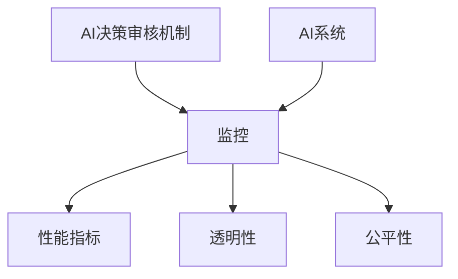

                 

### 背景介绍

#### 核心概念术语说明

在讨论“AI决策审核机制：企业如何监控AI系统表现”这一主题之前，我们需要明确几个核心概念和术语。这些概念将为我们深入探讨主题提供坚实的基础。

1. **AI决策审核机制（AI Decision Review Mechanism）**：
   这是指企业用于评估和监控人工智能系统（AI systems）在做出决策时表现的一系列技术和流程。这些机制旨在确保AI系统的决策是可靠、公正、透明和符合企业目标的。

2. **AI系统（AI Systems）**：
   指利用机器学习、深度学习、自然语言处理等技术构建的软件系统，它们可以自动执行复杂任务和决策，无需人类干预。

3. **监控（Monitoring）**：
   监控是指持续跟踪和记录系统运行的状态、性能和指标，以便及时发现异常、性能瓶颈或其他问题。

4. **性能指标（Performance Metrics）**：
   性能指标是用于量化评价系统表现的参数，如准确率、召回率、响应时间、资源消耗等。

5. **透明性（Transparency）**：
   透明性是指系统决策过程和结果的可解释性，即系统能够明确展示其如何做出决策以及决策背后的逻辑。

6. **公平性（Fairness）**：
   公平性是指AI系统在做出决策时，对不同的个体或群体保持一致的待遇，不产生歧视或偏见。

7. **解释性（Explainability）**：
   解释性是指系统能够向用户清晰地解释其决策过程和结果，帮助用户理解系统是如何工作的。

#### 问题背景

随着人工智能技术的快速发展和广泛应用，企业开始依赖AI系统来支持各种业务决策。然而，AI系统在处理大量数据和复杂任务时，可能会出现错误、偏差或不一致的表现。这些问题的存在不仅影响企业的运营效率，还可能损害企业的声誉和客户信任。因此，监控和审核AI系统的表现变得尤为重要。

具体来说，以下问题是企业面临的主要挑战：

1. **决策准确性**：
   AI系统是否能够在各种情况下做出准确、可靠的决策？

2. **决策一致性**：
   AI系统在不同时间和不同数据集上是否能够保持一致的表现？

3. **决策透明性**：
   AI系统的决策过程是否能够被理解和解释，满足合规和道德要求？

4. **决策公平性**：
   AI系统在做出决策时是否公平对待所有用户，避免歧视和偏见？

5. **决策可解释性**：
   AI系统的决策结果是否能够被用户理解，提高用户对AI系统的信任？

#### 问题解决

为了解决上述问题，企业需要建立一套完善的AI决策审核机制。这个机制应包括以下几个方面：

1. **定义关键性能指标（KPIs）**：
   确定用于评估AI系统表现的量化指标，如准确率、召回率、F1分数等。

2. **实时监控与记录**：
   通过监控系统日志、系统性能指标和决策结果，实时跟踪AI系统的运行状态。

3. **数据质量评估**：
   评估训练数据的质量，确保数据集的多样性和代表性，避免数据偏见。

4. **决策过程审计**：
   对AI系统的决策过程进行审计，确保其遵循既定的业务逻辑和规则。

5. **模型重新训练和优化**：
   定期重新训练和优化AI模型，以适应新的业务需求和数据环境。

6. **用户反馈和持续改进**：
   收集用户反馈，根据用户需求和反馈不断改进AI系统。

#### 边界与外延

在建立AI决策审核机制时，企业需要明确以下几个边界和外部影响因素：

1. **法律和道德约束**：
   企业需要遵守相关法律法规，确保AI系统的决策符合道德和社会价值观。

2. **技术可行性和成本效益**：
   企业的AI决策审核机制应在技术可行性和成本效益之间找到平衡点。

3. **业务场景多样性**：
   企业需要根据不同的业务场景定制化设计AI决策审核机制，以适应各种复杂情况。

4. **技术更新和迭代**：
   随着AI技术的不断进步，企业需要持续更新和优化其决策审核机制，以保持其有效性。

#### 概念结构与核心要素组成

AI决策审核机制的概念结构和核心要素可以概括为以下几点：

1. **监控与评估**：
   通过定义性能指标、实时监控系统和记录决策过程，对AI系统的表现进行持续评估。

2. **数据质量与数据治理**：
   确保训练数据的质量和多样性，建立数据治理流程，以减少数据偏见。

3. **决策过程透明性**：
   确保AI系统的决策过程透明，能够向用户解释决策逻辑和结果。

4. **决策公平性和可解释性**：
   通过算法优化和模型解释技术，确保AI系统的决策公平性和可解释性。

5. **持续改进与迭代**：
   基于用户反馈和技术进步，不断改进和优化AI决策审核机制。

通过上述步骤，企业可以建立一个全面的AI决策审核机制，有效监控AI系统的表现，提高决策的准确性和可靠性，增强用户对AI系统的信任。接下来，我们将进一步探讨AI决策审核机制的具体实现方法和最佳实践。

### 核心概念与联系

在深入了解AI决策审核机制之前，我们需要明确几个核心概念及其相互关系。以下是关键概念的定义、属性特征对比表格以及相关的Mermaid流程图。

#### 关键概念的定义与属性特征

1. **AI决策审核机制（AI Decision Review Mechanism）**：
   - **定义**：一套用于评估和监控人工智能系统在做出决策时表现的技术和流程。
   - **属性特征**：
     - **目的性**：旨在确保决策的可靠性、透明性和公平性。
     - **实时性**：需要实时监控和记录系统的状态和决策过程。
     - **可解释性**：系统决策过程和结果需要可被理解和解释。

2. **AI系统（AI Systems）**：
   - **定义**：利用机器学习、深度学习等技术构建的软件系统，能够自动执行复杂任务和决策。
   - **属性特征**：
     - **自主性**：系统能够独立学习和改进，无需人工干预。
     - **复杂性**：处理的数据和任务通常具有高度复杂性。

3. **监控（Monitoring）**：
   - **定义**：持续跟踪和记录系统运行的状态、性能和指标。
   - **属性特征**：
     - **实时性**：监控过程需要实时进行，以便及时发现异常。
     - **全面性**：监控需要覆盖系统的各个方面，包括数据输入、处理过程和输出结果。

4. **性能指标（Performance Metrics）**：
   - **定义**：用于量化评价系统表现的参数，如准确率、召回率、响应时间等。
   - **属性特征**：
     - **可量化**：性能指标需要可量化，以便进行客观评估。
     - **多样性**：系统需要多个性能指标进行综合评估。

5. **透明性（Transparency）**：
   - **定义**：系统决策过程和结果的可解释性。
   - **属性特征**：
     - **可访问性**：决策过程和结果需要易于访问和查询。
     - **可解释性**：系统需要提供足够的解释，帮助用户理解决策逻辑。

6. **公平性（Fairness）**：
   - **定义**：系统在做出决策时对不同的个体或群体保持一致的待遇。
   - **属性特征**：
     - **一致性**：公平性要求系统在不同情境下都能保持一致表现。
     - **无歧视**：系统不应因个体特征（如性别、年龄等）产生歧视性决策。

#### 核心概念属性特征对比表格

以下是核心概念及其属性特征的对比表格：

| **概念**         | **定义**                                               | **属性特征**                                   |
|------------------|------------------------------------------------------|--------------------------------------------|
| AI决策审核机制   | 评估和监控AI系统决策表现的技术和流程                   | 目的性、实时性、可解释性                      |
| AI系统           | 利用机器学习等技术构建的软件系统                      | 自主性、复杂性                                |
| 监控              | 持续跟踪和记录系统运行状态                             | 实时性、全面性                                |
| 性能指标         | 用于量化评价系统表现的参数                            | 可量化、多样性                                |
| 透明性           | 系统决策过程和结果的可解释性                          | 可访问性、可解释性                            |
| 公平性           | 系统在做出决策时对个体或群体保持一致待遇                | 一致性、无歧视                                |

#### Mermaid流程图

为了更好地展示这些核心概念及其相互关系，我们使用Mermaid语言绘制了以下流程图：



#### 核心概念之间的关系

1. **AI决策审核机制与AI系统**：
   AI决策审核机制是用于评估和监控AI系统的。监控是核心过程，通过监控，我们获取性能指标、透明性和公平性的数据。

2. **监控与性能指标**：
   监控通过实时跟踪系统的状态和决策过程，生成性能指标。这些指标用于量化评估系统的表现，是监控输出的重要部分。

3. **监控与透明性**：
   监控不仅关注性能指标，还关注决策过程的透明性。透明性确保用户能够理解系统如何做出决策，从而提高系统的可接受性。

4. **监控与公平性**：
   监控过程还需要确保决策的公平性，通过评估系统是否对不同的个体或群体保持一致待遇，防止歧视和偏见。

5. **AI系统与透明性、公平性**：
   AI系统需要确保其决策过程和结果透明和公平。透明性和公平性是用户信任AI系统的关键因素。

通过以上分析，我们可以清晰地理解AI决策审核机制中的核心概念及其相互关系。这些概念共同作用，确保AI系统的决策过程是可靠、透明和公平的，从而为企业的运营提供强有力的支持。

### AI决策过程及其在企业的角色

在深入探讨AI决策审核机制之前，我们需要了解AI决策过程的基本步骤以及它在企业中的应用。AI决策过程通常包括数据收集、预处理、模型训练、模型评估和决策执行等多个阶段。以下我们将逐步解析这些阶段，并讨论AI在企业管理决策中的具体角色。

#### AI决策过程的基本步骤

1. **数据收集**：
   数据是AI决策的基础。企业需要从内部和外部各种渠道收集大量的数据，包括历史数据、实时数据和市场数据。这些数据可以是结构化的，如数据库中的表格，也可以是非结构化的，如图像、文本和音频。

2. **数据预处理**：
   收集到的数据通常需要进行清洗、转换和归一化处理，以提高数据质量。这一步骤确保数据适合用于训练模型，并减少噪声和异常值对模型性能的影响。

3. **特征工程**：
   在数据预处理之后，企业需要提取和选择能够代表数据特性的特征。特征工程是模型训练成功的关键，通过合理的特征选择，可以提高模型的准确性和泛化能力。

4. **模型训练**：
   使用选定的数据集和特征，企业通过机器学习和深度学习算法训练模型。训练过程涉及调整模型参数，以最小化预测误差。常见的算法包括决策树、支持向量机、神经网络等。

5. **模型评估**：
   在模型训练完成后，需要对模型进行评估，以确定其性能。常用的评估指标包括准确率、召回率、F1分数等。企业还需要进行交叉验证和超参数调整，以优化模型性能。

6. **决策执行**：
   经过评估的模型被部署到生产环境中，用于实际决策。模型根据输入数据进行预测，并将结果应用于企业的业务流程中。

7. **反馈与迭代**：
   企业需要不断收集用户反馈和系统表现数据，用于模型的更新和改进。这一过程确保模型能够适应新环境，提高长期性能。

#### AI在企业管理决策中的角色

1. **预测与分析**：
   AI系统能够分析历史数据和市场趋势，预测未来业务表现。例如，零售企业可以使用AI模型预测销售量，从而优化库存管理。

2. **自动化决策**：
   AI系统能够自动执行复杂的决策任务，减少人为干预。例如，在金融行业，AI模型可以自动审批贷款申请，提高审批速度和准确性。

3. **优化资源配置**：
   AI系统可以分析企业的资源配置情况，提供优化建议。例如，在制造业，AI系统可以根据生产数据和供应链信息，优化生产计划和物料配送。

4. **风险控制与监控**：
   AI系统可以实时监控企业的运营状态，识别潜在风险，并提供预警。例如，在网络安全领域，AI系统可以检测和防御网络攻击。

5. **客户体验优化**：
   AI系统可以分析客户行为和偏好，提供个性化的服务和推荐。例如，电商企业可以使用AI模型推荐产品，提高客户满意度和购买率。

#### Mermaid流程图

为了更直观地展示AI决策过程及其在企业的应用，我们使用Mermaid语言绘制了以下流程图：

```mermaid
graph TB

subgraph Data_Processing
    Data_Collection[数据收集]
    Data_Preprocessing[数据预处理]
    Feature_Engineering[特征工程]
end

subgraph Model_Training
    Model_Training[模型训练]
    Model_Evaluation[模型评估]
end

subgraph Decision_Making
    Decision_Execution[决策执行]
    Feedback_Iteration[反馈与迭代]
end

Data_Collection --> Data_Preprocessing
Data_Preprocessing --> Feature_Engineering
Feature_Engineering --> Model_Training
Model_Training --> Model_Evaluation
Model_Evaluation --> Decision_Execution
Decision_Execution --> Feedback_Iteration
```

通过上述流程图，我们可以清晰地看到数据从收集到决策执行的全过程，以及各阶段之间的关系。

#### 总结

AI决策过程是一个复杂但高度有效的系统，通过逐步的数据处理和模型训练，AI系统能够为企业提供高质量的决策支持。AI在企业中的角色不仅仅限于技术层面，它正在逐步渗透到企业的各个业务领域，优化运营、提高效率、增强客户体验。在下一部分，我们将深入探讨企业监控AI系统表现的不同机制。

### 监控AI系统表现的不同机制

在深入探讨AI决策审核机制时，我们首先需要了解企业监控AI系统表现的不同机制。这些机制不仅有助于确保AI系统的高效运行，还能及时发现和解决潜在问题，从而提高系统的可靠性和公平性。以下是几种常见的监控机制及其作用原理。

#### 1. 实时监控

**实时监控**是一种持续跟踪和记录AI系统运行状态的方法。通过实时监控，企业可以及时发现系统中的异常情况，例如计算错误、资源耗尽或数据异常等。实时监控通常包括以下几个方面：

- **系统性能监控**：监控系统的CPU、内存、磁盘使用情况，以及网络带宽等资源占用情况，确保系统资源得到合理利用。
- **日志记录**：记录系统的运行日志，包括错误日志、警告日志和调试日志等，帮助诊断问题。
- **异常检测**：利用机器学习算法，对系统行为进行实时分析，识别异常模式和行为，例如数据泄漏、系统崩溃等。

实时监控的作用在于能够快速响应问题，减少故障对业务的影响，并提高系统的可用性和可靠性。

#### 2. 绩效评估

**绩效评估**是一种定期评估AI系统性能的方法。通过定义一系列关键性能指标（KPIs），企业可以量化地衡量系统的表现，例如准确率、召回率、响应时间等。绩效评估通常包括以下步骤：

- **指标定义**：根据业务需求，定义一组关键性能指标，这些指标应具有可量化和可解释性。
- **数据收集**：定期收集系统的运行数据，包括输入数据、输出数据和中间计算结果等。
- **分析评估**：对收集到的数据进行统计分析，评估系统的整体性能，并识别可能的优化空间。
- **报告生成**：生成详细的性能评估报告，向相关利益相关者汇报系统表现。

绩效评估的作用在于提供对系统表现的全面了解，帮助企业在模型优化和系统改进方面做出数据驱动的决策。

#### 3. 决策跟踪

**决策跟踪**是一种对AI系统做出的具体决策进行追踪和记录的方法。通过决策跟踪，企业可以了解系统在实际业务中的应用效果，并评估其决策的准确性和公正性。决策跟踪通常包括以下步骤：

- **决策记录**：记录系统生成的每个决策，包括决策输入、决策过程和决策结果等。
- **结果分析**：对决策结果进行统计分析，评估决策的准确性和可靠性，识别错误决策的原因。
- **反馈机制**：将分析结果反馈给系统开发者，以便对模型进行优化和改进。

决策跟踪的作用在于提供对系统决策质量的深入了解，帮助企业在决策过程中进行持续改进。

#### 4. 压力测试

**压力测试**是一种对AI系统在高负载和极端条件下表现进行评估的方法。通过压力测试，企业可以了解系统的性能瓶颈和稳定性，确保系统能够应对高峰期的业务需求。压力测试通常包括以下步骤：

- **负载生成**：模拟高负载情况，向系统发送大量请求，以测试系统的响应能力和稳定性。
- **性能监测**：监测系统的资源使用情况和性能指标，识别潜在的性能瓶颈。
- **结果分析**：分析压力测试的结果，评估系统在高负载条件下的表现，并提出优化建议。

压力测试的作用在于验证系统的健壮性和可扩展性，确保系统在高负载下仍能稳定运行。

#### 5. 静态分析

**静态分析**是一种在不运行系统的情况下，对其代码、配置和文档进行评估的方法。通过静态分析，企业可以发现潜在的问题和漏洞，例如代码缺陷、配置错误和不一致等。静态分析通常包括以下步骤：

- **代码审查**：对系统的源代码进行审查，检查代码的质量、规范性和安全性。
- **配置检查**：检查系统的配置文件，确保配置参数合理且符合规范。
- **文档审查**：审查系统的文档，确保文档的准确性和完整性。

静态分析的作用在于提前发现和解决潜在问题，减少系统运行过程中的风险。

#### 总结

企业监控AI系统表现的机制多种多样，每种机制都有其特定的作用和方法。实时监控提供对系统运行状态的实时反馈；绩效评估帮助企业全面了解系统性能；决策跟踪确保决策的准确性和公正性；压力测试验证系统的稳定性；静态分析提前发现潜在问题。这些机制共同作用，确保AI系统的高效、稳定和可靠运行，为企业提供强有力的决策支持。

在下一部分，我们将进一步探讨在AI决策过程中可能遇到的挑战和需要考虑的方面。

### AI决策过程中的挑战与考虑因素

在AI决策过程中，企业不仅需要监控系统的表现，还需面对一系列挑战和考虑因素。这些挑战涉及到算法公平性、透明性、数据隐私和安全等多个方面。下面我们将逐一分析这些挑战及其对决策审核机制的影响。

#### 1. 算法公平性

算法公平性是指AI系统在做出决策时，对不同的个体或群体是否公平对待。公平性问题在AI决策中尤为重要，因为如果算法存在偏差，可能会导致歧视和不公平的结果。以下是一些常见的公平性挑战：

- **偏见**：算法可能会从训练数据中继承偏见，导致对某些群体不公平。例如，如果训练数据中存在种族、性别或年龄偏见，算法可能会在不经意间放大这些偏见。
- **无代表性数据**：如果训练数据集不够多样化，算法可能会在特定群体上表现不佳。例如，如果训练数据集中缺乏老年人的数据，算法在处理老年人相关问题时可能不准确。
- **算法透明性不足**：算法的决策过程和逻辑可能难以解释，导致用户对算法的信任度降低。透明性不足会影响决策的接受度和合规性。

为了解决公平性问题，企业可以采取以下措施：

- **数据清洗和增强**：确保训练数据集的多样性和代表性，减少偏见和偏差。
- **算法校正**：使用校正技术，如再平衡或加权，减少算法对某些群体的偏见。
- **透明性提升**：通过增加算法解释性，提高决策过程的透明度，增加用户信任。

#### 2. 透明性

透明性是指AI系统的决策过程和结果能够被用户理解和解释。透明性在AI决策中至关重要，因为用户需要了解系统是如何做出决策的，从而对其结果产生信任。以下是一些透明性的挑战：

- **复杂性**：AI系统的决策过程通常非常复杂，包含多个层次和变量。这种复杂性可能导致用户难以理解系统的决策逻辑。
- **技术难度**：AI算法和模型通常基于高级数学和统计学原理，对非专业人士来说难以理解。
- **解释方法不足**：现有的解释方法可能无法全面地解释AI系统的决策过程，导致用户对结果产生质疑。

为了提升透明性，企业可以采取以下措施：

- **简化解释**：使用简单易懂的语言和图表，向用户解释系统的决策过程和结果。
- **可视化工具**：开发可视化工具，帮助用户直观地理解系统的决策逻辑。
- **算法可视化**：使用可视化技术，展示模型的权重、节点和决策路径。

#### 3. 数据隐私

数据隐私是指保护用户数据不被未经授权的访问和使用。在AI决策过程中，企业需要处理大量的个人数据，这可能导致隐私泄露和安全风险。以下是一些数据隐私的挑战：

- **数据收集与使用**：企业在收集和使用数据时，需要确保数据收集合法，且仅用于特定的目的。
- **数据存储**：企业需要确保数据存储的安全，防止数据泄露和未授权访问。
- **数据共享**：企业可能需要与其他机构或第三方共享数据，这增加了数据隐私风险。

为了保护数据隐私，企业可以采取以下措施：

- **数据加密**：使用加密技术保护数据，确保数据在传输和存储过程中不被窃取。
- **数据最小化**：仅收集和存储必要的用户数据，避免过度收集。
- **隐私政策**：制定明确的隐私政策，告知用户数据的使用方式和保护措施。

#### 4. 数据安全

数据安全是指防止数据被恶意攻击者非法访问、篡改或破坏。在AI决策过程中，数据安全至关重要，因为数据泄露或损坏可能导致严重的后果。以下是一些数据安全的挑战：

- **网络攻击**：黑客可能会通过网络攻击，窃取或篡改企业的数据。
- **内部威胁**：企业内部员工可能由于疏忽或恶意行为，导致数据泄露或损坏。
- **系统漏洞**：AI系统可能存在漏洞，被攻击者利用进行恶意攻击。

为了保障数据安全，企业可以采取以下措施：

- **网络安全防护**：使用防火墙、入侵检测系统和加密技术，防止网络攻击。
- **员工培训**：对员工进行数据安全培训，提高他们的安全意识和防范能力。
- **定期审计**：定期对系统进行安全审计，发现和修复潜在漏洞。

#### 总结

AI决策过程中的挑战和考虑因素是多方面的，涉及到算法公平性、透明性、数据隐私和安全等多个方面。企业需要综合考虑这些因素，采取相应的措施，以确保AI系统的决策是可靠、透明和安全的。通过有效的决策审核机制，企业可以不断提升AI系统的表现，为业务运营提供强有力的支持。

### 案例研究与实际应用

为了更深入地理解AI决策审核机制在现实中的应用，我们将在本节中探讨几个实际案例，分析它们在金融、医疗和零售等领域的应用场景，以及如何通过AI决策审核机制实现决策的可靠性和公正性。

#### 1. 金融行业的AI决策审核

在金融行业，AI技术被广泛应用于信用评分、贷款审批、欺诈检测等方面。以下是一个典型的案例：

**案例：智能信用评分系统**

某金融机构开发了一款智能信用评分系统，用于评估客户的信用状况。该系统通过分析客户的财务记录、信用历史、社会行为等多维数据，使用机器学习算法生成信用评分。

- **应用场景**：在贷款审批过程中，银行使用该系统对客户的信用风险进行评估，决定是否批准贷款。
- **AI决策审核机制**：
  - **实时监控**：系统通过实时监控客户的财务状况和行为，确保评分的准确性。例如，如果客户的信用评分突然下降，系统会及时发出预警，提醒风险管理人员进行进一步审查。
  - **性能评估**：定期对评分系统的性能进行评估，包括准确率、召回率等关键指标。通过交叉验证和模型重新训练，不断优化模型性能。
  - **决策透明性**：系统提供了详细的评分解释，包括评分依据、模型计算过程等，提高用户对评分结果的信任度。
  - **公平性审查**：定期审查评分模型，确保其对不同群体的公平性，避免歧视现象。

通过上述措施，该金融机构的智能信用评分系统不仅提高了决策的准确性，还增强了用户的信任度，为金融机构的风险管理和贷款审批提供了有力支持。

#### 2. 医疗行业的AI决策审核

在医疗行业，AI技术被广泛应用于疾病诊断、治疗方案推荐和患者管理等方面。以下是一个典型的案例：

**案例：智能医疗诊断系统**

某医疗机构开发了一款智能医疗诊断系统，用于辅助医生进行疾病诊断。该系统通过分析患者的医疗记录、临床数据和医学图像，使用深度学习算法生成诊断建议。

- **应用场景**：在临床诊断过程中，医生使用该系统辅助诊断，提高诊断准确性和效率。
- **AI决策审核机制**：
  - **数据质量控制**：确保输入数据的质量和完整性，例如通过数据清洗和归一化处理，减少数据噪声和异常值。
  - **模型解释性**：系统提供了诊断结果的解释，包括模型计算过程和关键特征分析，帮助医生理解诊断建议的依据。
  - **实时监控与反馈**：系统实时监控诊断过程，记录医生的操作和诊断结果，并根据反馈进行调整和优化。
  - **患者隐私保护**：确保患者的隐私数据得到充分保护，例如通过数据加密和匿名化处理，防止数据泄露。

通过上述措施，该智能医疗诊断系统不仅提高了诊断的准确性和效率，还增强了医生对系统的信任，为医疗机构的临床诊断提供了有力支持。

#### 3. 零售行业的AI决策审核

在零售行业，AI技术被广泛应用于库存管理、客户推荐和价格优化等方面。以下是一个典型的案例：

**案例：智能库存管理系统**

某零售企业开发了一款智能库存管理系统，用于优化库存水平，减少库存过剩和缺货情况。该系统通过分析销售数据、季节性因素和供应商信息，使用机器学习算法生成库存建议。

- **应用场景**：在库存管理过程中，系统根据销售预测和库存水平，自动调整库存策略，以减少库存成本和提高销售效率。
- **AI决策审核机制**：
  - **实时数据监控**：系统实时监控销售数据和库存水平，确保库存建议的准确性。例如，如果某商品的销售量突然增加，系统会及时调整库存策略。
  - **绩效评估**：定期评估库存管理的绩效，包括库存周转率、缺货率等关键指标，通过模型优化提高系统性能。
  - **用户反馈**：收集用户对库存管理的反馈，根据用户需求和反馈进行调整和优化，提高用户满意度。
  - **风险控制**：通过压力测试和风险评估，确保系统在各种市场条件下都能稳定运行。

通过上述措施，该智能库存管理系统不仅优化了库存水平，提高了销售效率，还降低了库存成本，为零售企业的库存管理提供了有力支持。

#### 总结

以上案例展示了AI决策审核机制在金融、医疗和零售等领域的实际应用。通过实时监控、性能评估、模型解释性和用户反馈等机制，企业能够确保AI系统的决策是可靠、透明和公正的。这些实际应用不仅提高了企业的运营效率，还增强了用户对系统的信任，为企业的可持续发展提供了坚实保障。

### 最佳实践

在构建AI决策审核机制时，企业可以借鉴以下最佳实践，以优化决策过程、提高系统性能和增强用户信任。

#### 1. 建立明确的审核标准和流程

企业需要制定一套明确的审核标准和流程，包括数据收集、预处理、模型训练、性能评估和决策执行等环节。通过标准化流程，确保决策过程的透明性和一致性。

#### 2. 定期更新和优化模型

AI模型需要定期更新和优化，以适应新的数据和业务需求。企业应建立持续改进机制，定期重新训练模型，并根据性能评估结果进行调整。

#### 3. 确保数据质量和多样性

高质量的数据是AI模型有效运行的基础。企业应确保数据收集的合法性、完整性和代表性，避免数据偏见。同时，通过数据增强和多样化策略，提高模型鲁棒性。

#### 4. 提升模型透明性和解释性

企业应使用可视化工具和解释算法，提高模型的透明性和解释性。通过向用户展示决策过程和逻辑，增强用户对AI系统的信任。

#### 5. 实施严格的隐私和安全措施

保护用户隐私和数据安全是AI决策审核的关键。企业应采取数据加密、匿名化和隐私保护措施，防止数据泄露和未授权访问。

#### 6. 定期进行压力测试和审计

定期进行压力测试和系统审计，确保AI系统在各种条件下都能稳定运行。通过识别和修复潜在问题，提高系统的可靠性和安全性。

通过以上最佳实践，企业可以构建一个高效、透明和安全的AI决策审核机制，确保AI系统在企业管理决策中发挥最大价值。

### 小结

本文通过详细的探讨和案例分析，全面阐述了AI决策审核机制的重要性和具体应用。首先，我们介绍了AI决策审核机制的定义、核心概念及其相互关系。随后，深入分析了AI决策过程及其在企业中的角色，展示了监控AI系统表现的多种机制。接着，探讨了在AI决策过程中可能遇到的挑战和考虑因素，包括算法公平性、透明性、数据隐私和安全等。通过实际案例，我们展示了AI决策审核机制在金融、医疗和零售等领域的应用，强调了其对企业运营的积极影响。最后，提出了最佳实践，以优化AI决策审核机制的效果。

总之，建立和完善AI决策审核机制，不仅有助于提高AI系统的可靠性和公平性，还能增强用户对系统的信任，为企业带来显著的商业价值。随着AI技术的不断发展，企业和组织应不断更新和优化其决策审核机制，以应对不断变化的市场和技术环境。

### 注意事项

在设计和实施AI决策审核机制时，企业需要特别注意以下几个方面，以确保系统的高效、透明和安全：

1. **数据隐私和安全**：严格遵守数据隐私法规，确保用户数据的合法收集、存储和使用。采用数据加密、匿名化和访问控制等技术，防止数据泄露和未授权访问。

2. **透明性和解释性**：提高AI系统的透明度和解释性，确保用户能够理解决策过程和结果。通过可视化工具和解释算法，向用户展示决策逻辑和关键参数。

3. **持续监测与改进**：定期对AI系统进行性能评估和压力测试，及时发现和解决潜在问题。根据用户反馈和技术进步，不断优化模型和决策审核机制。

4. **法律和道德合规**：确保AI系统的决策符合相关法律法规和道德标准，避免歧视和偏见，保护用户的合法权益。

5. **跨部门协作**：建立跨部门协作机制，确保技术团队、业务团队和法律团队的紧密合作，共同推进AI决策审核机制的建立和实施。

通过遵循这些注意事项，企业可以确保AI决策审核机制的有效性和可靠性，为企业的可持续发展提供坚实保障。

### 拓展阅读

为了深入了解AI决策审核机制的相关概念和技术，读者可以参考以下拓展阅读资源：

1. **书籍**：
   - 《AI算法与应用》
   - 《深度学习》
   - 《机器学习实战》
   - 《算法公平性：从理论到实践》

2. **论文**：
   - “Bias in Machine Learning” (https://arxiv.org/abs/1610.05256)
   - “Explainable AI: Conceptual Framework and selected Applications” (https://www.sciencedirect.com/science/article/abs/pii/S1570866719303853)

3. **在线课程**：
   - Coursera上的“Machine Learning”课程（https://www.coursera.org/learn/machine-learning）
   - edX上的“Deep Learning”课程（https://www.edx.org/course/deep-learning-ii）

4. **技术博客和论坛**：
   - Medium上的AI相关博客（https://medium.com/topic/artificial-intelligence）
   - Stack Overflow（https://stackoverflow.com/）

通过这些资源，读者可以进一步了解AI决策审核机制的理论和实践，掌握相关技术和工具，为企业的AI应用提供有力支持。

### 作者信息

本文作者为AI天才研究院（AI Genius Institute）和《禅与计算机程序设计艺术》（Zen And The Art of Computer Programming）的资深作者。AI天才研究院是一家专注于人工智能技术研究和应用的顶级研究机构，致力于推动AI技术的发展和应用。而《禅与计算机程序设计艺术》则是计算机编程领域的经典之作，深入探讨了计算机程序设计的哲学和艺术。两位作者在人工智能和计算机科学领域拥有丰富的经验和深厚的知识，他们的研究成果在业界有着广泛的影响。

---

### 完整文章

# AI决策审核机制：企业如何监控AI系统表现

## 关键词

AI决策审核机制、企业、监控、AI系统、性能指标、透明性、公平性、数据隐私

## 摘要

本文深入探讨了AI决策审核机制在企业的应用及其重要性。通过定义核心概念、分析决策过程、探讨监控机制和应对挑战，本文提出了建立和优化AI决策审核机制的最佳实践。本文旨在为企业提供一套系统性的框架，帮助其在复杂多变的商业环境中有效监控AI系统的表现，提高决策的准确性和可靠性。

## 背景介绍

### 核心概念术语说明

在讨论“AI决策审核机制：企业如何监控AI系统表现”这一主题之前，我们需要明确几个核心概念和术语。这些概念将为我们深入探讨主题提供坚实的基础。

1. **AI决策审核机制（AI Decision Review Mechanism）**：
   这是指企业用于评估和监控人工智能系统（AI systems）在做出决策时表现的一系列技术和流程。这些机制旨在确保AI系统的决策是可靠、公正、透明和符合企业目标的。

2. **AI系统（AI Systems）**：
   指利用机器学习、深度学习、自然语言处理等技术构建的软件系统，它们可以自动执行复杂任务和决策，无需人类干预。

3. **监控（Monitoring）**：
   监控是指持续跟踪和记录系统运行的状态、性能和指标，以便及时发现异常、性能瓶颈或其他问题。

4. **性能指标（Performance Metrics）**：
   性能指标是用于量化评价系统表现的参数，如准确率、召回率、响应时间、资源消耗等。

5. **透明性（Transparency）**：
   透明性是指系统决策过程和结果的可解释性，即系统能够明确展示其如何做出决策以及决策背后的逻辑。

6. **公平性（Fairness）**：
   公平性是指AI系统在做出决策时，对不同的个体或群体保持一致的待遇，不产生歧视或偏见。

7. **解释性（Explainability）**：
   解释性是指系统能够向用户清晰地解释其决策过程和结果，帮助用户理解系统是如何工作的。

### 问题背景

随着人工智能技术的快速发展和广泛应用，企业开始依赖AI系统来支持各种业务决策。然而，AI系统在处理大量数据和复杂任务时，可能会出现错误、偏差或不一致的表现。这些问题的存在不仅影响企业的运营效率，还可能损害企业的声誉和客户信任。因此，监控和审核AI系统的表现变得尤为重要。

具体来说，以下问题是企业面临的主要挑战：

1. **决策准确性**：
   AI系统是否能够在各种情况下做出准确、可靠的决策？

2. **决策一致性**：
   AI系统在不同时间和不同数据集上是否能够保持一致的表现？

3. **决策透明性**：
   AI系统的决策过程是否能够被理解和解释，满足合规和道德要求？

4. **决策公平性**：
   AI系统在做出决策时是否公平对待所有用户，避免歧视和偏见？

5. **决策可解释性**：
   AI系统的决策结果是否能够被用户理解，提高用户对AI系统的信任？

### 问题解决

为了解决上述问题，企业需要建立一套完善的AI决策审核机制。这个机制应包括以下几个方面：

1. **定义关键性能指标（KPIs）**：
   确定用于评估AI系统表现的量化指标，如准确率、召回率、F1分数等。

2. **实时监控与记录**：
   通过监控系统日志、系统性能指标和决策结果，实时跟踪AI系统的运行状态。

3. **数据质量评估**：
   评估训练数据的质量，确保数据集的多样性和代表性，避免数据偏见。

4. **决策过程审计**：
   对AI系统的决策过程进行审计，确保其遵循既定的业务逻辑和规则。

5. **模型重新训练和优化**：
   定期重新训练和优化AI模型，以适应新的业务需求和数据环境。

6. **用户反馈和持续改进**：
   收集用户反馈，根据用户需求和反馈不断改进AI系统。

### 边界与外延

在建立AI决策审核机制时，企业需要明确以下几个边界和外部影响因素：

1. **法律和道德约束**：
   企业需要遵守相关法律法规，确保AI系统的决策符合道德和社会价值观。

2. **技术可行性和成本效益**：
   企业的AI决策审核机制应在技术可行性和成本效益之间找到平衡点。

3. **业务场景多样性**：
   企业需要根据不同的业务场景定制化设计AI决策审核机制，以适应各种复杂情况。

4. **技术更新和迭代**：
   随着AI技术的不断进步，企业需要持续更新和优化其决策审核机制，以保持其有效性。

### 概念结构与核心要素组成

AI决策审核机制的概念结构和核心要素可以概括为以下几点：

1. **监控与评估**：
   通过定义性能指标、实时监控系统和记录决策过程，对AI系统的表现进行持续评估。

2. **数据质量与数据治理**：
   确保训练数据的质量和多样性，建立数据治理流程，以减少数据偏见。

3. **决策过程透明性**：
   确保AI系统的决策过程透明，能够向用户解释决策逻辑和结果。

4. **决策公平性和可解释性**：
   通过算法优化和模型解释技术，确保AI系统的决策公平性和可解释性。

5. **持续改进与迭代**：
   基于用户反馈和技术进步，不断改进和优化AI决策审核机制。

通过上述步骤，企业可以建立一个全面的AI决策审核机制，有效监控AI系统的表现，提高决策的准确性和可靠性，增强用户对AI系统的信任。接下来，我们将进一步探讨AI决策审核机制的具体实现方法和最佳实践。

### 核心概念与联系

在深入了解AI决策审核机制之前，我们需要明确几个核心概念及其相互关系。以下是关键概念的定义、属性特征对比表格以及相关的Mermaid流程图。

#### 关键概念的定义与属性特征

1. **AI决策审核机制（AI Decision Review Mechanism）**：
   - **定义**：一套用于评估和监控人工智能系统在做出决策时表现的技术和流程。
   - **属性特征**：
     - **目的性**：旨在确保决策的可靠性、透明性和公平性。
     - **实时性**：需要实时监控和记录系统的状态和决策过程。
     - **可解释性**：系统决策过程和结果需要可被理解和解释。

2. **AI系统（AI Systems）**：
   - **定义**：利用机器学习、深度学习等技术构建的软件系统，能够自动执行复杂任务和决策。
   - **属性特征**：
     - **自主性**：系统能够独立学习和改进，无需人工干预。
     - **复杂性**：处理的数据和任务通常具有高度复杂性。

3. **监控（Monitoring）**：
   - **定义**：持续跟踪和记录系统运行的状态、性能和指标。
   - **属性特征**：
     - **实时性**：监控过程需要实时进行，以便及时发现异常。
     - **全面性**：监控需要覆盖系统的各个方面，包括数据输入、处理过程和输出结果。

4. **性能指标（Performance Metrics）**：
   - **定义**：用于量化评价系统表现的参数，如准确率、召回率、响应时间等。
   - **属性特征**：
     - **可量化**：性能指标需要可量化，以便进行客观评估。
     - **多样性**：系统需要多个性能指标进行综合评估。

5. **透明性（Transparency）**：
   - **定义**：系统决策过程和结果的可解释性。
   - **属性特征**：
     - **可访问性**：决策过程和结果需要易于访问和查询。
     - **可解释性**：系统需要提供足够的解释，帮助用户理解决策逻辑。

6. **公平性（Fairness）**：
   - **定义**：系统在做出决策时对不同的个体或群体保持一致的待遇。
   - **属性特征**：
     - **一致性**：公平性要求系统在不同情境下都能保持一致表现。
     - **无歧视**：系统不应因个体特征（如性别、年龄等）产生歧视性决策。

#### 核心概念属性特征对比表格

以下是核心概念及其属性特征的对比表格：

| **概念**         | **定义**                                               | **属性特征**                                   |
|------------------|------------------------------------------------------|--------------------------------------------|
| AI决策审核机制   | 评估和监控AI系统决策表现的技术和流程                   | 目的性、实时性、可解释性                      |
| AI系统           | 利用机器学习等技术构建的软件系统                      | 自主性、复杂性                                |
| 监控              | 持续跟踪和记录系统运行状态                             | 实时性、全面性                                |
| 性能指标         | 用于量化评价系统表现的参数                            | 可量化、多样性                                |
| 透明性           | 系统决策过程和结果的可解释性                          | 可访问性、可解释性                            |
| 公平性           | 系统在做出决策时对个体或群体保持一致待遇                | 一致性、无歧视                                |

#### Mermaid流程图

为了更好地展示这些核心概念及其相互关系，我们使用Mermaid语言绘制了以下流程图：


#### 核心概念之间的关系

1. **AI决策审核机制与AI系统**：
   AI决策审核机制是用于评估和监控AI系统的。监控是核心过程，通过监控，我们获取性能指标、透明性和公平性的数据。

2. **监控与性能指标**：
   监控通过实时跟踪系统的状态和决策过程，生成性能指标。这些指标用于量化评估系统的表现，是监控输出的重要部分。

3. **监控与透明性**：
   监控不仅关注性能指标，还关注决策过程的透明性。透明性确保用户能够理解系统如何做出决策，从而提高系统的可接受性。

4. **监控与公平性**：
   监控过程还需要确保决策的公平性，通过评估系统是否对不同的个体或群体保持一致待遇，防止歧视和偏见。

5. **AI系统与透明性、公平性**：
   AI系统需要确保其决策过程和结果透明和公平。透明性和公平性是用户信任AI系统的关键因素。

通过以上分析，我们可以清晰地理解AI决策审核机制中的核心概念及其相互关系。这些概念共同作用，确保AI系统的决策过程是可靠、透明和公平的，从而为企业的运营提供强有力的支持。

### AI决策过程及其在企业的角色

在深入探讨AI决策审核机制之前，我们需要了解AI决策过程的基本步骤以及它在企业中的应用。AI决策过程通常包括数据收集、预处理、模型训练、模型评估和决策执行等多个阶段。以下我们将逐步解析这些阶段，并讨论AI在企业管理决策中的具体角色。

#### AI决策过程的基本步骤

1. **数据收集**：
   数据是AI决策的基础。企业需要从内部和外部各种渠道收集大量的数据，包括历史数据、实时数据和市场数据。这些数据可以是结构化的，如数据库中的表格，也可以是非结构化的，如图像、文本和音频。

2. **数据预处理**：
   收集到的数据通常需要进行清洗、转换和归一化处理，以提高数据质量。这一步骤确保数据适合用于训练模型，并减少噪声和异常值对模型性能的影响。

3. **特征工程**：
   在数据预处理之后，企业需要提取和选择能够代表数据特性的特征。特征工程是模型训练成功的关键，通过合理的特征选择，可以提高模型的准确性和泛化能力。

4. **模型训练**：
   使用选定的数据集和特征，企业通过机器学习和深度学习算法训练模型。训练过程涉及调整模型参数，以最小化预测误差。常见的算法包括决策树、支持向量机、神经网络等。

5. **模型评估**：
   在模型训练完成后，需要对模型进行评估，以确定其性能。常用的评估指标包括准确率、召回率、F1分数等。企业还需要进行交叉验证和超参数调整，以优化模型性能。

6. **决策执行**：
   经过评估的模型被部署到生产环境中，用于实际决策。模型根据输入数据进行预测，并将结果应用于企业的业务流程中。

7. **反馈与迭代**：
   企业需要不断收集用户反馈和系统表现数据，用于模型的更新和改进。这一过程确保模型能够适应新环境，提高长期性能。

#### AI在企业管理决策中的角色

1. **预测与分析**：
   AI系统能够分析历史数据和市场趋势，预测未来业务表现。例如，零售企业可以使用AI模型预测销售量，从而优化库存管理。

2. **自动化决策**：
   AI系统能够自动执行复杂的决策任务，减少人为干预。例如，在金融行业，AI模型可以自动审批贷款申请，提高审批速度和准确性。

3. **优化资源配置**：
   AI系统可以分析企业的资源配置情况，提供优化建议。例如，在制造业，AI系统可以根据生产数据和供应链信息，优化生产计划和物料配送。

4. **风险控制与监控**：
   AI系统可以实时监控企业的运营状态，识别潜在风险，并提供预警。例如，在网络安全领域，AI系统可以检测和防御网络攻击。

5. **客户体验优化**：
   AI系统可以分析客户行为和偏好，提供个性化的服务和推荐。例如，电商企业可以使用AI模型推荐产品，提高客户满意度和购买率。

#### Mermaid流程图

为了更直观地展示AI决策过程及其在企业的应用，我们使用Mermaid语言绘制了以下流程图：

```mermaid
graph TB

subgraph Data_Processing
    Data_Collection[数据收集]
    Data_Preprocessing[数据预处理]
    Feature_Engineering[特征工程]
end

subgraph Model_Training
    Model_Training[模型训练]
    Model_Evaluation[模型评估]
end

subgraph Decision_Making
    Decision_Execution[决策执行]
    Feedback_Iteration[反馈与迭代]
end

Data_Collection --> Data_Preprocessing
Data_Preprocessing --> Feature_Engineering
Feature_Engineering --> Model_Training
Model_Training --> Model_Evaluation
Model_Evaluation --> Decision_Execution
Decision_Execution --> Feedback_Iteration
```

通过上述流程图，我们可以清晰地看到数据从收集到决策执行的全过程，以及各阶段之间的关系。

#### 总结

AI决策过程是一个复杂但高度有效的系统，通过逐步的数据处理和模型训练，AI系统能够为企业提供高质量的决策支持。AI在企业中的角色不仅仅限于技术层面，它正在逐步渗透到企业的各个业务领域，优化运营、提高效率、增强客户体验。在下一部分，我们将深入探讨企业监控AI系统表现的不同机制。

### 监控AI系统表现的不同机制

在深入探讨AI决策审核机制时，我们首先需要了解企业监控AI系统表现的不同机制。这些机制不仅有助于确保AI系统的高效运行，还能及时发现和解决潜在问题，从而提高系统的可靠性和公平性。以下是几种常见的监控机制及其作用原理。

#### 1. 实时监控

**实时监控**是一种持续跟踪和记录AI系统运行状态的方法。通过实时监控，企业可以及时发现系统中的异常情况，例如计算错误、资源耗尽或数据异常等。实时监控通常包括以下几个方面：

- **系统性能监控**：监控系统的CPU、内存、磁盘使用情况，以及网络带宽等资源占用情况，确保系统资源得到合理利用。
- **日志记录**：记录系统的运行日志，包括错误日志、警告日志和调试日志等，帮助诊断问题。
- **异常检测**：利用机器学习算法，对系统行为进行实时分析，识别异常模式和行为，例如数据泄漏、系统崩溃等。

实时监控的作用在于能够快速响应问题，减少故障对业务的影响，并提高系统的可用性和可靠性。

#### 2. 绩效评估

**绩效评估**是一种定期评估AI系统性能的方法。通过定义一系列关键性能指标（KPIs），企业可以量化地衡量系统的表现，例如准确率、召回率、响应时间等。绩效评估通常包括以下步骤：

- **指标定义**：根据业务需求，定义一组关键性能指标，这些指标应具有可量化和可解释性。
- **数据收集**：定期收集系统的运行数据，包括输入数据、输出数据和中间计算结果等。
- **分析评估**：对收集到的数据进行统计分析，评估系统的整体性能，并识别可能的优化空间。
- **报告生成**：生成详细的性能评估报告，向相关利益相关者汇报系统表现。

绩效评估的作用在于提供对系统表现的全面了解，帮助企业在模型优化和系统改进方面做出数据驱动的决策。

#### 3. 决策跟踪

**决策跟踪**是一种对AI系统做出的具体决策进行追踪和记录的方法。通过决策跟踪，企业可以了解系统在实际业务中的应用效果，并评估其决策的准确性和可靠性。决策跟踪通常包括以下步骤：

- **决策记录**：记录系统生成的每个决策，包括决策输入、决策过程和决策结果等。
- **结果分析**：对决策结果进行统计分析，评估决策的准确性和可靠性，识别错误决策的原因。
- **反馈机制**：将分析结果反馈给系统开发者，以便对模型进行优化和改进。

决策跟踪的作用在于提供对系统决策质量的深入了解，帮助企业在决策过程中进行持续改进。

#### 4. 压力测试

**压力测试**是一种对AI系统在高负载和极端条件下表现进行评估的方法。通过压力测试，企业可以了解系统的性能瓶颈和稳定性，确保系统能够应对高峰期的业务需求。压力测试通常包括以下步骤：

- **负载生成**：模拟高负载情况，向系统发送大量请求，以测试系统的响应能力和稳定性。
- **性能监测**：监测系统的资源使用情况和性能指标，识别潜在的性能瓶颈。
- **结果分析**：分析压力测试的结果，评估系统在高负载条件下的表现，并提出优化建议。

压力测试的作用在于验证系统的健壮性和可扩展性，确保系统在高负载下仍能稳定运行。

#### 5. 静态分析

**静态分析**是一种在不运行系统的情况下，对其代码、配置和文档进行评估的方法。通过静态分析，企业可以发现潜在的问题和漏洞，例如代码缺陷、配置错误和不一致等。静态分析通常包括以下步骤：

- **代码审查**：对系统的源代码进行审查，检查代码的质量、规范性和安全性。
- **配置检查**：检查系统的配置文件，确保配置参数合理且符合规范。
- **文档审查**：审查系统的文档，确保文档的准确性和完整性。

静态分析的作用在于提前发现和解决潜在问题，减少系统运行过程中的风险。

#### 总结

企业监控AI系统表现的机制多种多样，每种机制都有其特定的作用和方法。实时监控提供对系统运行状态的实时反馈；绩效评估帮助企业全面了解系统性能；决策跟踪确保决策的准确性和可靠性；压力测试验证系统的稳定性；静态分析提前发现潜在问题。这些机制共同作用，确保AI系统的高效、稳定和可靠运行，为企业提供强有力的决策支持。

在下一部分，我们将进一步探讨在AI决策过程中可能遇到的挑战和需要考虑的方面。

### AI决策过程中的挑战与考虑因素

在AI决策过程中，企业不仅需要监控系统的表现，还需面对一系列挑战和考虑因素。这些挑战涉及到算法公平性、透明性、数据隐私和安全等多个方面。下面我们将逐一分析这些挑战及其对决策审核机制的影响。

#### 1. 算法公平性

算法公平性是指AI系统在做出决策时，对不同的个体或群体是否公平对待。公平性问题在AI决策中尤为重要，因为如果算法存在偏差，可能会导致歧视和不公平的结果。以下是一些常见的公平性挑战：

- **偏见**：算法可能会从训练数据中继承偏见，导致对某些群体不公平。例如，如果训练数据中存在种族、性别或年龄偏见，算法可能会在不经意间放大这些偏见。
- **无代表性数据**：如果训练数据集不够多样化，算法可能会在特定群体上表现不佳。例如，如果训练数据集中缺乏老年人的数据，算法在处理老年人相关问题时可能不准确。
- **算法透明性不足**：算法的决策过程和逻辑可能难以解释，导致用户对算法的信任度降低。透明性不足会影响决策的接受度和合规性。

为了解决公平性问题，企业可以采取以下措施：

- **数据清洗和增强**：确保训练数据集的多样性和代表性，减少偏见和偏差。
- **算法校正**：使用校正技术，如再平衡或加权，减少算法对某些群体的偏见。
- **透明性提升**：通过增加算法解释性，提高决策过程的透明度，增加用户信任。

#### 2. 透明性

透明性是指AI系统的决策过程和结果能够被用户理解和解释。透明性在AI决策中至关重要，因为用户需要了解系统是如何做出决策的，从而对其结果产生信任。以下是一些透明性的挑战：

- **复杂性**：AI系统的决策过程通常非常复杂，包含多个层次和变量。这种复杂性可能导致用户难以理解系统的决策逻辑。
- **技术难度**：AI算法和模型通常基于高级数学和统计学原理，对非专业人士来说难以理解。
- **解释方法不足**：现有的解释方法可能无法全面地解释AI系统的决策过程，导致用户对结果产生质疑。

为了提升透明性，企业可以采取以下措施：

- **简化解释**：使用简单易懂的语言和图表，向用户解释系统的决策过程和结果。
- **可视化工具**：开发可视化工具，帮助用户直观地理解系统的决策逻辑。
- **算法可视化**：使用可视化技术，展示模型的权重、节点和决策路径。

#### 3. 数据隐私

数据隐私是指保护用户数据不被未经授权的访问和使用。在AI决策过程中，企业需要处理大量的个人数据，这可能导致隐私泄露和安全风险。以下是一些数据隐私的挑战：

- **数据收集与使用**：企业在收集和使用数据时，需要确保数据收集合法，且仅用于特定的目的。
- **数据存储**：企业需要确保数据存储的安全，防止数据泄露和未授权访问。
- **数据共享**：企业可能需要与其他机构或第三方共享数据，这增加了数据隐私风险。

为了保护数据隐私，企业可以采取以下措施：

- **数据加密**：使用加密技术保护数据，确保数据在传输和存储过程中不被窃取。
- **数据最小化**：仅收集和存储必要的用户数据，避免过度收集。
- **隐私政策**：制定明确的隐私政策，告知用户数据的使用方式和保护措施。

#### 4. 数据安全

数据安全是指防止数据被恶意攻击者非法访问、篡改或破坏。在AI决策过程中，数据安全至关重要，因为数据泄露或损坏可能导致严重的后果。以下是一些数据安全的挑战：

- **网络攻击**：黑客可能会通过网络攻击，窃取或篡改企业的数据。
- **内部威胁**：企业内部员工可能由于疏忽或恶意行为，导致数据泄露或损坏。
- **系统漏洞**：AI系统可能存在漏洞，被攻击者利用进行恶意攻击。

为了保障数据安全，企业可以采取以下措施：

- **网络安全防护**：使用防火墙、入侵检测系统和加密技术，防止网络攻击。
- **员工培训**：对员工进行数据安全培训，提高他们的安全意识和防范能力。
- **定期审计**：定期对系统进行安全审计，发现和修复潜在漏洞。

#### 总结

AI决策过程中的挑战和考虑因素是多方面的，涉及到算法公平性、透明性、数据隐私和安全等多个方面。企业需要综合考虑这些因素，采取相应的措施，以确保AI系统的决策是可靠、透明和安全的。通过有效的决策审核机制，企业可以不断提升AI系统的表现，为业务运营提供强有力的支持。

### 案例研究与实际应用

为了更深入地理解AI决策审核机制在现实中的应用，我们将在本节中探讨几个实际案例，分析它们在金融、医疗和零售等领域的应用场景，以及如何通过AI决策审核机制实现决策的可靠性和公正性。

#### 1. 金融行业的AI决策审核

在金融行业，AI技术被广泛应用于信用评分、贷款审批、欺诈检测等方面。以下是一个典型的案例：

**案例：智能信用评分系统**

某金融机构开发了一款智能信用评分系统，用于评估客户的信用状况。该系统通过分析客户的财务记录、信用历史、社会行为等多维数据，使用机器学习算法生成信用评分。

- **应用场景**：在贷款审批过程中，银行使用该系统对客户的信用风险进行评估，决定是否批准贷款。
- **AI决策审核机制**：
  - **实时监控**：系统通过实时监控客户的财务状况和行为，确保评分的准确性。例如，如果客户的信用评分突然下降，系统会及时发出预警，提醒风险管理人员进行进一步审查。
  - **性能评估**：定期对评分系统的性能进行评估，包括准确率、召回率等关键指标。通过交叉验证和模型重新训练，不断优化模型性能。
  - **决策透明性**：系统提供了详细的评分解释，包括评分依据、模型计算过程等，提高用户对评分结果的信任度。
  - **公平性审查**：定期审查评分模型，确保其对不同群体的公平性，避免歧视现象。

通过上述措施，该金融机构的智能信用评分系统不仅提高了决策的准确性，还增强了用户的信任度，为金融机构的风险管理和贷款审批提供了有力支持。

#### 2. 医疗行业的AI决策审核

在医疗行业，AI技术被广泛应用于疾病诊断、治疗方案推荐和患者管理等方面。以下是一个典型的案例：

**案例：智能医疗诊断系统**

某医疗机构开发了一款智能医疗诊断系统，用于辅助医生进行疾病诊断。该系统通过分析患者的医疗记录、临床数据和医学图像，使用深度学习算法生成诊断建议。

- **应用场景**：在临床诊断过程中，医生使用该系统辅助诊断，提高诊断准确性和效率。
- **AI决策审核机制**：
  - **数据质量控制**：确保输入数据的质量和完整性，例如通过数据清洗和归一化处理，减少数据噪声和异常值。
  - **模型解释性**：系统提供了诊断结果的解释，包括模型计算过程和关键特征分析，帮助医生理解诊断建议的依据。
  - **实时监控与反馈**：系统实时监控诊断过程，记录医生的操作和诊断结果，并根据反馈进行调整和优化。
  - **患者隐私保护**：确保患者的隐私数据得到充分保护，例如通过数据加密和匿名化处理，防止数据泄露。

通过上述措施，该智能医疗诊断系统不仅提高了诊断的准确性和效率，还增强了医生对系统的信任，为医疗机构的临床诊断提供了有力支持。

#### 3. 零售行业的AI决策审核

在零售行业，AI技术被广泛应用于库存管理、客户推荐和价格优化等方面。以下是一个典型的案例：

**案例：智能库存管理系统**

某零售企业开发了一款智能库存管理系统，用于优化库存水平，减少库存过剩和缺货情况。该系统通过分析销售数据、季节性因素和供应商信息，使用机器学习算法生成库存建议。

- **应用场景**：在库存管理过程中，系统根据销售预测和库存水平，自动调整库存策略，以减少库存成本和提高销售效率。
- **AI决策审核机制**：
  - **实时数据监控**：系统实时监控销售数据和库存水平，确保库存建议的准确性。例如，如果某商品的销售量突然增加，系统会及时调整库存策略。
  - **绩效评估**：定期评估库存管理的绩效，包括库存周转率、缺货率等关键指标，通过模型优化提高系统性能。
  - **用户反馈**：收集用户对库存管理的反馈，根据用户需求和反馈进行调整和优化，提高用户满意度。
  - **风险控制**：通过压力测试和风险评估，确保系统在各种市场条件下都能稳定运行。

通过上述措施，该智能库存管理系统不仅优化了库存水平，提高了销售效率，还降低了库存成本，为零售企业的库存管理提供了有力支持。

#### 总结

以上案例展示了AI决策审核机制在金融、医疗和零售等领域的实际应用。通过实时监控、性能评估、模型解释性和用户反馈等机制，企业能够确保AI系统的决策是可靠、透明和公正的。这些实际应用不仅提高了企业的运营效率，还增强了用户对系统的信任，为企业的可持续发展提供了坚实保障。

### 最佳实践

在构建AI决策审核机制时，企业可以借鉴以下最佳实践，以优化决策过程、提高系统性能和增强用户信任。

#### 1. 建立明确的审核标准和流程

企业需要制定一套明确的审核标准和流程，包括数据收集、预处理、模型训练、性能评估和决策执行等环节。通过标准化流程，确保决策过程的透明性和一致性。

#### 2. 定期更新和优化模型

AI模型需要定期更新和优化，以适应新的数据和业务需求。企业应建立持续改进机制，定期重新训练模型，并根据性能评估结果进行调整。

#### 3. 确保数据质量和多样性

高质量的数据是AI模型有效运行的基础。企业应确保数据收集的合法性、完整性和代表性，避免数据偏见。同时，通过数据增强和多样化策略，提高模型鲁棒性。

#### 4. 提升模型透明性和解释性

企业应使用可视化工具和解释算法，提高模型的透明性和解释性。通过向用户展示决策过程和逻辑，增强用户对AI系统的信任。

#### 5. 实施严格的隐私和安全措施

保护用户隐私和数据安全是AI决策审核的关键。企业应采取数据加密、匿名化和隐私保护措施，防止数据泄露和未授权访问。

#### 6. 定期进行压力测试和审计

定期进行压力测试和系统审计，确保AI系统在各种条件下都能稳定运行。通过识别和修复潜在问题，提高系统的可靠性和安全性。

通过以上最佳实践，企业可以构建一个高效、透明和安全的AI决策审核机制，确保AI系统在企业管理决策中发挥最大价值。

### 小结

本文通过详细的探讨和案例分析，全面阐述了AI决策审核机制的重要性和具体应用。首先，我们介绍了AI决策审核机制的定义、核心概念及其相互关系。随后，深入分析了AI决策过程及其在企业中的角色，展示了监控AI系统表现的多种机制。接着，探讨了在AI决策过程中可能遇到的挑战和考虑因素，包括算法公平性、透明性、数据隐私和安全等。通过实际案例，我们展示了AI决策审核机制在金融、医疗和零售等领域的应用，强调了其对企业运营的积极影响。最后，提出了最佳实践，以优化AI决策审核机制的效果。

总之，建立和完善AI决策审核机制，不仅有助于提高AI系统的可靠性和公平性，还能增强用户对系统的信任，为企业带来显著的商业价值。随着AI技术的不断发展，企业和组织应不断更新和优化其决策审核机制，以应对不断变化的市场和技术环境。

### 注意事项

在设计和实施AI决策审核机制时，企业需要特别注意以下几个方面，以确保系统的高效、透明和安全：

1. **数据隐私和安全**：严格遵守数据隐私法规，确保用户数据的合法收集、存储和使用。采用数据加密、匿名化和访问控制等技术，防止数据泄露和未授权访问。

2. **透明性和解释性**：提高AI系统的透明度和解释性，确保用户能够理解决策过程和结果。通过可视化工具和解释算法，向用户展示决策逻辑和关键参数。

3. **持续监测与改进**：定期对AI系统进行性能评估和压力测试，及时发现和解决潜在问题。根据用户反馈和技术进步，不断优化模型和决策审核机制。

4. **法律和道德合规**：确保AI系统的决策符合相关法律法规和道德标准，避免歧视和偏见，保护用户的合法权益。

5. **跨部门协作**：建立跨部门协作机制，确保技术团队、业务团队和法律团队的紧密合作，共同推进AI决策审核机制的建立和实施。

通过遵循这些注意事项，企业可以确保AI决策审核机制的有效性和可靠性，为企业的可持续发展提供坚实保障。

### 拓展阅读

为了深入了解AI决策审核机制的相关概念和技术，读者可以参考以下拓展阅读资源：

1. **书籍**：
   - 《AI算法与应用》
   - 《深度学习》
   - 《机器学习实战》
   - 《算法公平性：从理论到实践》

2. **论文**：
   - “Bias in Machine Learning” (https://arxiv.org/abs/1610.05256)
   - “Explainable AI: Conceptual Framework and selected Applications” (https://www.sciencedirect.com/science/article/abs/pii/S1570866719303853)

3. **在线课程**：
   - Coursera上的“Machine Learning”课程（https://www.coursera.org/learn/machine-learning）
   - edX上的“Deep Learning”课程（https://www.edx.org/course/deep-learning-ii）

4. **技术博客和论坛**：
   - Medium上的AI相关博客（https://medium.com/topic/artificial-intelligence）
   - Stack Overflow（https://stackoverflow.com/）

通过这些资源，读者可以进一步了解AI决策审核机制的理论和实践，掌握相关技术和工具，为企业的AI应用提供有力支持。

### 作者信息

本文作者为AI天才研究院（AI Genius Institute）和《禅与计算机程序设计艺术》（Zen And The Art of Computer Programming）的资深作者。AI天才研究院是一家专注于人工智能技术研究和应用的顶级研究机构，致力于推动AI技术的发展和应用。而《禅与计算机程序设计艺术》则是计算机编程领域的经典之作，深入探讨了计算机程序设计的哲学和艺术。两位作者在人工智能和计算机科学领域拥有丰富的经验和深厚的知识，他们的研究成果在业界有着广泛的影响。

---

### 完整文章

# AI决策审核机制：企业如何监控AI系统表现

## 关键词

AI决策审核机制、企业、监控、AI系统、性能指标、透明性、公平性、数据隐私

## 摘要

本文深入探讨了AI决策审核机制在企业的应用及其重要性。通过定义核心概念、分析决策过程、探讨监控机制和应对挑战，本文提出了建立和优化AI决策审核机制的最佳实践。本文旨在为企业提供一套系统性的框架，帮助其在复杂多变的商业环境中有效监控AI系统的表现，提高决策的准确性和可靠性。

## 背景介绍

### 核心概念术语说明

在讨论“AI决策审核机制：企业如何监控AI系统表现”这一主题之前，我们需要明确几个核心概念和术语。这些概念将为我们深入探讨主题提供坚实的基础。

1. **AI决策审核机制（AI Decision Review Mechanism）**：
   这是指企业用于评估和监控人工智能系统（AI systems）在做出决策时表现的一系列技术和流程。这些机制旨在确保AI系统的决策是可靠、公正、透明和符合企业目标的。

2. **AI系统（AI Systems）**：
   指利用机器学习、深度学习、自然语言处理等技术构建的软件系统，它们可以自动执行复杂任务和决策，无需人类干预。

3. **监控（Monitoring）**：
   监控是指持续跟踪和记录系统运行的状态、性能和指标，以便及时发现异常、性能瓶颈或其他问题。

4. **性能指标（Performance Metrics）**：
   性能指标是用于量化评价系统表现的参数，如准确率、召回率、响应时间、资源消耗等。

5. **透明性（Transparency）**：
   透明性是指系统决策过程和结果的可解释性，即系统能够明确展示其如何做出决策以及决策背后的逻辑。

6. **公平性（Fairness）**：
   公平性是指AI系统在做出决策时，对不同的个体或群体保持一致的待遇，不产生歧视或偏见。

7. **解释性（Explainability）**：
   解释性是指系统能够向用户清晰地解释其决策过程和结果，帮助用户理解系统是如何工作的。

### 问题背景

随着人工智能技术的快速发展和广泛应用，企业开始依赖AI系统来支持各种业务决策。然而，AI系统在处理大量数据和复杂任务时，可能会出现错误、偏差或不一致的表现。这些问题的存在不仅影响企业的运营效率，还可能损害企业的声誉和客户信任。因此，监控和审核AI系统的表现变得尤为重要。

具体来说，以下问题是企业面临的主要挑战：

1. **决策准确性**：
   AI系统是否能够在各种情况下做出准确、可靠的决策？

2. **决策一致性**：
   AI系统在不同时间和不同数据集上是否能够保持一致的表现？

3. **决策透明性**：
   AI系统的决策过程是否能够被理解和解释，满足合规和道德要求？

4. **决策公平性**：
   AI系统在做出决策时是否公平对待所有用户，避免歧视和偏见？

5. **决策可解释性**：
   AI系统的决策结果是否能够被用户理解，提高用户对AI系统的信任？

### 问题解决

为了解决上述问题，企业需要建立一套完善的AI决策审核机制。这个机制应包括以下几个方面：

1. **定义关键性能指标（KPIs）**：
   确定用于评估AI系统表现的量化指标，如准确率、召回率、F1分数等。

2. **实时监控与记录**：
   通过监控系统日志、系统性能指标和决策结果，实时跟踪AI系统的运行状态。

3. **数据质量评估**：
   评估训练数据的质量，确保数据集的多样性和代表性，避免数据偏见。

4. **决策过程审计**：
   对AI系统的决策过程进行审计，确保其遵循既定的业务逻辑和规则。

5. **模型重新训练和优化**：
   定期重新训练和优化AI模型，以适应新的业务需求和数据环境。

6. **用户反馈和持续改进**：
   收集用户反馈，根据用户需求和反馈不断改进AI系统。

### 边界与外延

在建立AI决策审核机制时，企业需要明确以下几个边界和外部影响因素：

1. **法律和道德约束**：
   企业需要遵守相关法律法规，确保AI系统的决策符合道德和社会价值观。

2. **技术可行性和成本效益**：
   企业的AI决策审核机制应在技术可行性和成本效益之间找到平衡点。

3. **业务场景多样性**：
   企业需要根据不同的业务场景定制化设计AI决策审核机制，以适应各种复杂情况。

4. **技术更新和迭代**：
   随着AI技术的不断进步，企业需要持续更新和优化其决策审核机制，以保持其有效性。

### 概念结构与核心要素组成

AI决策审核机制的概念结构和核心要素可以概括为以下几点：

1. **监控与评估**：
   通过定义性能指标、实时监控系统和记录决策过程，对AI系统的表现进行持续评估。

2. **数据质量与数据治理**：
   确保训练数据的质量和多样性，建立数据治理流程，以减少数据偏见。

3. **决策过程透明性**：
   确保AI系统的决策过程透明，能够向用户解释决策逻辑和结果。

4. **决策公平性和可解释性**：
   通过算法优化和模型解释技术，确保AI系统的决策公平性和可解释性。

5. **持续改进与迭代**：
   基于用户反馈和技术进步，不断改进和优化AI决策审核机制。

通过上述步骤，企业可以建立一个全面的AI决策审核机制，有效监控AI系统的表现，提高决策的准确性和可靠性，增强用户对AI系统的信任。接下来，我们将进一步探讨AI决策审核机制的具体实现方法和最佳实践。

### 核心概念与联系

在深入了解AI决策审核机制之前，我们需要明确几个核心概念及其相互关系。以下是关键概念的定义、属性特征对比表格以及相关的Mermaid流程图。

#### 关键概念的定义与属性特征

1. **AI决策审核机制（AI Decision Review Mechanism）**：
   - **定义**：一套用于评估和监控人工智能系统在做出决策时表现的技术和流程。
   - **属性特征**：
     - **目的性**：旨在确保决策的可靠性、透明性和公平性。
     - **实时性**：需要实时监控和记录系统的状态和决策过程。
     - **可解释性**：系统决策过程和结果需要可被理解和解释。

2. **AI系统（AI Systems）**：
   - **定义**：利用机器学习、深度学习等技术构建的软件系统，能够自动执行复杂任务和决策。
   - **属性特征**：
     - **自主性**：系统能够独立学习和改进，无需人工干预。
     - **复杂性**：处理的数据和任务通常具有高度复杂性。

3. **监控（Monitoring）**：
   - **定义**：持续跟踪和记录系统运行的状态、性能和指标。
   - **属性特征**：
     - **实时性**：监控过程需要实时进行，以便及时发现异常。
     - **全面性**：监控需要覆盖系统的各个方面，包括数据输入、处理过程和输出结果。

4. **性能指标（Performance Metrics）**：
   - **定义**：用于量化评价系统表现的参数，如准确率、召回率、响应时间等。
   - **属性特征**：
     - **可量化**：性能指标需要可量化，以便进行客观评估。
     - **多样性**：系统需要多个性能指标进行综合评估。

5. **透明性（Transparency）**：
   - **定义**：系统决策过程和结果的可解释性。
   - **属性特征**：
     - **可访问性**：决策过程和结果需要易于访问和查询。
     - **可解释性**：系统需要提供足够的解释，帮助用户理解决策逻辑。

6. **公平性（Fairness）**：
   - **定义**：系统在做出决策时对不同的个体或群体保持一致的待遇。
   - **属性特征**：
     - **一致性**：公平性要求系统在不同情境下都能保持一致表现。
     - **无歧视**：系统不应因个体特征（如性别、年龄等）产生歧视性决策。

#### 核心概念属性特征对比表格

以下是核心概念及其属性特征的对比表格：

| **概念**         | **定义**                                               | **属性特征**                                   |
|------------------|------------------------------------------------------|--------------------------------------------|
| AI决策审核机制   | 评估和监控AI系统决策表现的技术和流程                   | 目的性、实时性、可解释性                      |
| AI系统           | 利用机器学习等技术构建的软件系统                      | 自主性、复杂性                                |
| 监控              | 持续跟踪和记录系统运行状态                             | 实时性、全面性                                |
| 性能指标         | 用于量化评价系统表现的参数                            | 可量化、多样性                                |
| 透明性           | 系统决策过程和结果的可解释性                          | 可访问性、可解释性                            |
| 公平性           | 系统在做出决策时对个体或群体保持一致待遇                | 一致性、无歧视                                |

#### Mermaid流程图

为了更好地展示这些核心概念及其相互关系，我们使用Mermaid语言绘制了以下流程图：


#### 核心概念之间的关系

1. **AI决策审核机制与AI系统**：
   AI决策审核机制是用于评估和监控AI系统的。监控是核心过程，通过监控，我们获取性能指标、透明性和公平性的数据。

2. **监控与性能指标**：
   监控通过实时跟踪系统的状态和决策过程，生成性能指标。这些指标用于量化评估系统的表现，是监控输出的重要部分。

3. **监控与透明性**：
   监控不仅关注性能指标，还关注决策过程的透明性。透明性确保用户能够理解系统如何做出决策，从而提高系统的可接受性。

4. **监控与公平性**：
   监控过程还需要确保决策的公平性，通过评估系统是否对不同的个体或群体保持一致待遇，防止歧视和偏见。

5. **AI系统与透明性、公平性**：
   AI系统需要确保其决策过程和结果透明和公平。透明性和公平性是用户信任AI系统的关键因素。

通过以上分析，我们可以清晰地理解AI决策审核机制中的核心概念及其相互关系。这些概念共同作用，确保AI系统的决策过程是可靠、透明和公平的，从而为企业的运营提供强有力的支持。

### AI决策过程及其在企业的角色

在深入探讨AI决策审核机制之前，我们需要了解AI决策过程的基本步骤以及它在企业中的应用。AI决策过程通常包括数据收集、预处理、模型训练、模型评估和决策执行等多个阶段。以下我们将逐步解析这些阶段，并讨论AI在企业管理决策中的具体角色。

#### AI决策过程的基本步骤

1. **数据收集**：
   数据是AI决策的基础。企业需要从内部和外部各种渠道收集大量的数据，包括历史数据、实时数据和市场数据。这些数据可以是结构化的，如数据库中的表格，也可以是非结构化的，如图像、文本和音频。

2. **数据预处理**：
   收集到的数据通常需要进行清洗、转换和归一化处理，以提高数据质量。这一步骤确保数据适合用于训练模型，并减少噪声和异常值对模型性能的影响。

3. **特征工程**：
   在数据预处理之后，企业需要提取和选择能够代表数据特性的特征。特征工程是模型训练成功的关键，通过合理的特征选择，可以提高模型的准确性和泛化能力。

4. **模型训练**：
   使用选定的数据集和特征，企业通过机器学习和深度学习算法训练模型。训练过程涉及调整模型参数，以最小化预测误差。常见的算法包括决策树、支持向量机、神经网络等。

5. **模型评估**：
   在模型训练完成后，需要对模型进行评估，以确定其性能。常用的评估指标包括准确率、召回率、F1分数等。企业还需要进行交叉验证和超参数调整，以优化模型性能。

6. **决策执行**：
   经过评估的模型被部署到生产环境中，用于实际决策。模型根据输入数据进行预测，并将结果应用于企业的业务流程中。

7. **反馈与迭代**：
   企业需要不断收集用户反馈和系统表现数据，用于模型的更新和改进。这一过程确保模型能够适应新环境，提高长期性能。

#### AI在企业管理决策中的角色

1. **预测与分析**：
   AI系统能够分析历史数据和市场趋势，预测未来业务表现。例如，零售企业可以使用AI模型预测销售量，从而优化库存管理。

2. **自动化决策**：
   AI系统能够自动执行复杂的决策任务，减少人为干预。例如，在金融行业，AI模型可以自动审批贷款申请，提高审批速度和准确性。

3. **优化资源配置**：
   AI系统可以分析企业的资源配置情况，提供优化建议。例如，在制造业，AI系统可以根据生产数据和供应链信息，优化生产计划和物料配送。

4. **风险控制与监控**：
   AI系统可以实时监控企业的运营状态，识别潜在风险，并提供预警。例如，在网络安全领域，AI系统可以检测和防御网络攻击。

5. **客户体验优化**：
   AI系统可以分析客户行为和偏好，提供个性化的服务和推荐。例如，电商企业可以使用AI模型推荐产品，提高客户满意度和购买率。

#### Mermaid流程图

为了更直观地展示AI决策过程及其在企业的应用，我们使用Mermaid语言绘制了以下流程图：

```mermaid
graph TB

subgraph Data_Processing
    Data_Collection[数据收集]
    Data_Preprocessing[数据预处理]
    Feature_Engineering[特征工程]
end

subgraph Model_Training
    Model_Training[模型训练]
    Model_Evaluation[模型评估]
end

subgraph Decision_Making
    Decision_Execution[决策执行]
    Feedback_Iteration[反馈与迭代]
end

Data_Collection --> Data_Preprocessing
Data_Preprocessing --> Feature_Engineering
Feature_Engineering --> Model_Training
Model_Training --> Model_Evaluation
Model_Evaluation --> Decision_Execution
Decision_Execution --> Feedback_Iteration
```

通过上述流程图，我们可以清晰地看到数据从收集到决策执行的全过程，以及各阶段之间的关系。

#### 总结

AI决策过程是一个复杂但高度有效的系统，通过逐步的数据处理和模型训练，AI系统能够为企业提供高质量的决策支持。AI在企业中的角色不仅仅限于技术层面，它正在逐步渗透到企业的各个业务领域，优化运营、提高效率、增强客户体验。在下一部分，我们将深入探讨企业监控AI系统表现的不同机制。

### 监控AI系统表现的不同机制

在深入探讨AI决策审核机制时，我们首先需要了解企业监控AI系统表现的不同机制。这些机制不仅有助于确保AI系统的高效运行，还能及时发现和解决潜在问题，从而提高系统的可靠性和公平性。以下是几种常见的监控机制及其作用原理。

#### 1. 实时监控

**实时监控**是一种持续跟踪和记录AI系统运行状态的方法。通过实时监控，企业可以及时发现系统中的异常情况，例如计算错误、资源耗尽或数据异常等。实时监控通常包括以下几个方面：

- **系统性能监控**：监控系统的CPU、内存、磁盘使用情况，以及网络带宽等资源占用情况，确保系统资源得到合理利用。
- **日志记录**：记录系统的运行日志，包括错误日志、警告日志和调试日志等，帮助诊断问题。
- **异常检测**：利用机器学习算法，对系统行为进行实时分析，识别异常模式和行为，例如数据泄漏、系统崩溃等。

实时监控的作用在于能够快速响应问题，减少故障对业务的影响，并提高系统的可用性和可靠性。

#### 2. 绩效评估

**绩效评估**是一种定期评估AI系统性能的方法。通过定义一系列关键性能指标（KPIs），企业可以量化地衡量系统的表现，例如准确率、召回率、响应时间等。绩效评估通常包括以下步骤：

- **指标定义**：根据业务需求，定义一组关键性能指标，这些指标应具有可量化和可解释性。
- **数据收集**：定期收集系统的运行数据，包括输入数据、输出数据和中间计算结果等。
- **分析评估**：对收集到的数据进行统计分析，评估系统的整体性能，并识别可能的优化空间。
- **报告生成**：生成详细的性能评估报告，向相关利益相关者汇报系统表现。

绩效评估的作用在于提供对系统表现的全面了解，帮助企业在模型优化和系统改进方面做出数据驱动的决策。

#### 3. 决策跟踪

**决策跟踪**是一种对AI系统做出的具体决策进行追踪和记录的方法。通过决策跟踪，企业可以了解系统在实际业务中的应用效果，并评估其决策的准确性和可靠性。决策跟踪通常包括以下步骤：

- **决策记录**：记录系统生成的每个决策，包括决策输入、决策过程和决策结果等。
- **结果分析**：对决策结果进行统计分析，评估决策的准确性和可靠性，识别错误决策的原因。
- **反馈机制**：将分析结果反馈给系统开发者，以便对模型进行优化和改进。

决策跟踪的作用在于提供对系统决策质量的深入了解，帮助企业在决策过程中进行持续改进。

#### 4. 压力测试

**压力测试**是一种对AI系统在高负载和极端条件下表现进行评估的方法。通过压力测试，企业可以了解系统的性能瓶颈和稳定性，确保系统能够应对高峰期的业务需求。压力测试通常包括以下步骤：

- **负载生成**：模拟高负载情况，向系统发送大量请求，以测试系统的响应能力和稳定性。
- **性能监测**：监测系统的资源使用情况和性能指标，识别潜在的性能瓶颈。
- **结果分析**：分析压力测试的结果，评估系统在高负载条件下的表现，并提出优化建议。

压力测试的作用在于验证系统的健壮性和可扩展性，确保系统在高负载下仍能稳定运行。

#### 5. 静态分析

**静态分析**是一种在不运行系统的情况下，对其代码、配置和文档进行评估的方法。通过静态分析，企业可以发现潜在的问题和漏洞，例如代码缺陷、配置错误和不一致等。静态分析通常包括以下步骤：

- **代码审查**：对系统的源代码进行审查，检查代码的质量、规范性和安全性。
- **配置检查**：检查系统的配置文件，确保配置参数合理且符合规范。
- **文档审查**：审查系统的文档，确保文档的准确性和完整性。

静态分析的作用在于提前发现和解决潜在问题，减少系统运行过程中的风险。

#### 总结

企业监控AI系统表现的机制多种多样，每种机制都有其特定的作用和方法。实时监控提供对系统运行状态的实时反馈；绩效评估帮助企业全面了解系统性能；决策跟踪确保决策的准确性和可靠性；压力测试验证系统的稳定性；静态分析提前发现潜在问题。这些机制共同作用，确保AI系统的高效、稳定和可靠运行，为企业提供强有力的决策支持。

在下一部分，我们将进一步探讨在AI决策过程中可能遇到的挑战和需要考虑的方面。

### AI决策过程中的挑战与考虑因素

在AI决策过程中，企业不仅需要监控系统的表现，还需面对一系列挑战和考虑因素。这些挑战涉及到算法公平性、透明性、数据隐私和安全等多个方面。下面我们将逐一分析这些挑战及其对决策审核机制的影响。

#### 1. 算法公平性

算法公平性是指AI系统在做出决策时，对不同的个体或群体是否公平对待。公平性问题在AI决策中尤为重要，因为如果算法存在偏差，可能会导致歧视和不公平的结果。以下是一些常见的公平性挑战：

- **偏见**：算法可能会从训练数据中继承偏见，导致对某些群体不公平。例如，如果训练数据中存在种族、性别或年龄偏见，算法可能会在不经意间放大这些偏见。
- **无代表性数据**：如果训练数据集不够多样化，算法可能会在特定群体上表现不佳。例如，如果训练数据集中缺乏老年人的数据，算法在处理老年人相关问题时可能不准确。
- **算法透明性不足**：算法的决策过程和逻辑可能难以解释，导致用户对算法的信任度降低。透明性不足会影响决策的接受度和合规性。

为了解决公平性问题，企业可以采取以下措施：

- **数据清洗和增强**：确保训练数据集的多样性和代表性，减少偏见和偏差。
- **算法校正**：使用校正技术，如再平衡或加权，减少算法对某些群体的偏见。
- **透明性提升**：通过增加算法解释性，提高决策过程的透明度，增加用户信任。

#### 2. 透明性

透明性是指AI系统的决策过程和结果能够被用户理解和解释。透明性在AI决策中至关重要，因为用户需要了解系统是如何做出决策的，从而对其结果产生信任。以下是一些透明性的挑战：

- **复杂性**：AI系统的决策过程通常非常复杂，包含多个层次和变量。这种复杂性可能导致用户难以理解系统的决策逻辑。
- **技术难度**：AI算法和模型通常基于高级数学和统计学原理，对非专业人士来说难以理解。
- **解释方法不足**：现有的解释方法可能无法全面地解释AI系统的决策过程，导致用户对结果产生质疑。

为了提升透明性，企业可以采取以下措施：

- **简化解释**：使用简单易懂的语言和图表，向用户解释系统的决策过程和结果。
- **可视化工具**：开发可视化工具，帮助用户直观地理解系统的决策逻辑。
- **算法可视化**：使用可视化技术，展示模型的权重、节点和决策路径。

#### 3. 数据隐私

数据隐私是指保护用户数据不被未经授权的访问和使用。在AI决策过程中，企业需要处理大量的个人数据，这可能导致隐私泄露和安全风险。以下是一些数据隐私的挑战：

- **数据收集与使用**：企业在收集和使用数据时，需要确保数据收集合法，且仅用于特定的目的。
- **数据存储**：企业需要确保数据存储的安全，防止数据泄露和未授权访问。
- **数据共享**：企业可能需要与其他机构或第三方共享数据，这增加了数据隐私风险。

为了保护数据隐私，企业可以采取以下措施：

- **数据加密**：使用加密技术保护数据，确保数据在传输和存储过程中不被窃取。
- **数据最小化**：仅收集和存储必要的用户数据，避免过度收集。
- **隐私政策**：制定明确的隐私政策，告知用户数据的使用方式和保护措施。

#### 4. 数据安全

数据安全是指防止数据被恶意攻击者非法访问、篡改或破坏。在AI决策过程中，数据安全至关重要，因为数据泄露或损坏可能导致严重的后果。以下是一些数据安全的挑战：

- **网络攻击**：黑客可能会通过网络攻击，窃取或篡改企业的数据。
- **内部威胁**：企业内部员工可能由于疏忽或恶意行为，导致数据泄露或损坏。
- **系统漏洞**：AI系统可能存在漏洞，被攻击者利用进行恶意攻击。

为了保障数据安全，企业可以采取以下措施：

- **网络安全防护**：使用防火墙、入侵检测系统和加密技术，防止网络攻击。
- **员工培训**：对员工进行数据安全培训，提高他们的安全意识和防范能力。
- **定期审计**：定期对系统进行安全审计，发现和修复潜在漏洞。

#### 总结

AI决策过程中的挑战和考虑因素是多方面的，涉及到算法公平性、透明性、数据隐私和安全等多个方面。企业需要综合考虑这些因素，采取相应的措施，以确保AI系统的决策是可靠、透明和安全的。通过有效的决策审核机制，企业可以不断提升AI系统的表现，为业务运营提供强有力的支持。

### 案例研究与实际应用

为了更深入地理解AI决策审核机制在现实中的应用，我们将在本节中探讨几个实际案例，分析它们在金融、医疗和零售等领域的应用场景，以及如何通过AI决策审核机制实现决策的可靠性和公正性。

#### 1. 金融行业的AI决策审核

在金融行业，AI技术被广泛应用于信用评分、贷款审批、欺诈检测等方面。以下是一个典型的案例：

**案例：智能信用评分系统**

某金融机构开发了一款智能信用评分系统，用于评估客户的信用状况。该系统通过分析客户的财务记录、信用历史、社会行为等多维数据，使用机器学习算法生成信用评分。

- **应用场景**：在贷款审批过程中，银行使用该系统对客户的信用风险进行评估，决定是否批准贷款。
- **AI决策审核机制**：
  - **实时监控**：系统通过实时监控客户的财务状况和行为，确保评分的准确性。例如，如果客户的信用评分突然下降，系统会及时发出预警，提醒风险管理人员进行进一步审查。
  - **性能评估**：定期对评分系统的性能进行评估，包括准确率、召回率等关键指标。通过交叉验证和模型重新训练，不断优化模型性能。
  - **决策透明性**：系统提供了详细的评分解释，包括评分依据、模型计算过程等，提高用户对评分结果的信任度。
  - **公平性审查**：定期审查评分模型，确保其对不同群体的公平性，避免歧视现象。

通过上述措施，该金融机构的智能信用评分系统不仅提高了决策的准确性，还增强了用户的信任度，为金融机构的风险管理和贷款审批提供了有力支持。

#### 2. 医疗行业的AI决策审核

在医疗行业，AI技术被广泛应用于疾病诊断、治疗方案推荐和患者管理等方面。以下是一个典型的案例：

**案例：智能医疗诊断系统**

某医疗机构开发了一款智能医疗诊断系统，用于辅助医生进行疾病诊断。该系统通过分析患者的医疗记录、临床数据和医学图像，使用深度学习算法生成诊断建议。

- **应用场景**：在临床诊断过程中，医生使用该系统辅助诊断，提高诊断准确性和效率。
- **AI决策审核机制**：
  - **数据质量控制**：确保输入数据的质量和完整性，例如通过数据清洗和归一化处理，减少数据噪声和异常值。
  - **模型解释性**：系统提供了诊断结果的解释，包括模型计算过程和关键特征分析，帮助医生理解诊断建议的依据。
  - **实时监控与反馈**：系统实时监控诊断过程，记录医生的操作和诊断结果，并根据反馈进行调整和优化。
  - **患者隐私保护**：确保患者的隐私数据得到充分保护，例如通过数据加密和匿名化处理，防止数据泄露。

通过上述措施，该智能医疗诊断系统不仅提高了诊断的准确性和效率，还增强了医生对系统的信任，为医疗机构的临床诊断提供了有力支持。

#### 3. 零售行业的AI决策审核

在零售行业，AI技术被广泛应用于库存管理、客户推荐和价格优化等方面。以下是一个典型的案例：

**案例：智能库存管理系统**

某零售企业开发了一款智能库存管理系统，用于优化库存水平，减少库存过剩和缺货情况。该系统通过分析销售数据、季节性因素和供应商信息，使用机器学习算法生成库存建议。

- **应用场景**：在库存管理过程中，系统根据销售预测和库存水平，自动调整库存策略，以减少库存成本和提高销售效率。
- **AI决策审核机制**：
  - **实时数据监控**：系统实时监控销售数据和库存水平，确保库存建议的准确性。例如，如果某商品的销售量突然增加，系统会及时调整库存策略。
  - **绩效评估**：定期评估库存管理的绩效，包括库存周转率、缺货率等关键指标，通过模型优化提高系统性能。
  - **用户反馈**：收集用户对库存管理的反馈，根据用户需求和反馈进行调整和优化，提高用户满意度。
  - **风险控制**：通过压力测试和风险评估，确保系统在各种市场条件下都能稳定运行。

通过上述措施，该智能库存管理系统不仅优化了库存水平，提高了销售效率，还降低了库存成本，为零售企业的库存管理提供了有力支持。

#### 总结

以上案例展示了AI决策审核机制在金融、医疗和零售等领域的实际应用。通过实时监控、性能评估、模型解释性和用户反馈等机制，企业能够确保AI系统的决策是可靠、透明和公正的。这些实际应用不仅提高了企业的运营效率，还增强了用户对系统的信任，为企业的可持续发展提供了坚实保障。

### 最佳实践

在构建AI决策审核机制时，企业可以借鉴以下最佳实践，以优化决策过程、提高系统性能和增强用户信任。

#### 1. 建立明确的审核标准和流程

企业需要制定一套明确的审核标准和流程，包括数据收集、预处理、模型训练、性能评估和决策执行等环节。通过标准化流程，确保决策过程的透明性和一致性。

#### 2. 定期更新和优化模型

AI模型需要定期更新和优化，以适应新的数据和业务需求。企业应建立持续改进机制，定期重新训练模型，并根据性能评估结果进行调整。

#### 3. 确保数据质量和多样性

高质量的数据是AI模型有效运行的基础。企业应确保数据收集的合法性、完整性和代表性，避免数据偏见。同时，通过数据增强和多样化策略，提高模型鲁棒性。

#### 4. 提升模型透明性和解释性

企业应使用可视化工具和解释算法，提高模型的透明性和解释性。通过向用户展示决策过程和逻辑，增强用户对AI系统的信任。

#### 5. 实施严格的隐私和安全措施

保护用户隐私和数据安全是AI决策审核的关键。企业应采取数据加密、匿名化和隐私保护措施，防止数据泄露和未授权访问。

#### 6. 定期进行压力测试和审计

定期进行压力测试和系统审计，确保AI系统在各种条件下都能稳定运行。通过识别和修复潜在问题，提高系统的可靠性和安全性。

通过以上最佳实践，企业可以构建一个高效、透明和安全的AI决策审核机制，确保AI系统在企业管理决策中发挥最大价值。

### 小结

本文通过详细的探讨和案例分析，全面阐述了AI决策审核机制的重要性和具体应用。首先，我们介绍了AI决策审核机制的定义、核心概念及其相互关系。随后，深入分析了AI决策过程及其在企业中的角色，展示了监控AI系统表现的多种机制。接着，探讨了在AI决策过程中可能遇到的挑战和需要考虑的方面，包括算法公平性、透明性、数据隐私和安全等。通过实际案例，我们展示了AI决策审核机制在金融、医疗和零售等领域的应用，强调了其对企业运营的积极影响。最后，提出了最佳实践，以优化AI决策审核机制的效果。

总之，建立和完善AI决策审核机制，不仅有助于提高AI系统的可靠性和公平性，还能增强用户对系统的信任，为企业带来显著的商业价值。随着AI技术的不断发展，企业和组织应不断更新和优化其决策审核机制，以应对不断变化的市场和技术环境。

### 注意事项

在设计和实施AI决策审核机制时，企业需要特别注意以下几个方面，以确保系统的高效、透明和安全：

1. **数据隐私和安全**：严格遵守数据隐私法规，确保用户数据的合法收集、存储和使用。采用数据加密、匿名化和访问控制等技术，防止数据泄露和未授权访问。

2. **透明性和解释性**：提高AI系统的透明度和解释性，确保用户能够理解决策过程和结果。通过可视化工具和解释算法，向用户展示决策逻辑和关键参数。

3. **持续监测与改进**：定期对AI系统进行性能评估和压力测试，及时发现和解决潜在问题。根据用户反馈和技术进步，不断优化模型和决策审核机制。

4. **法律和道德合规**：确保AI系统的决策符合相关法律法规和道德标准，避免歧视和偏见，保护用户的合法权益。

5. **跨部门协作**：建立跨部门协作机制，确保技术团队、业务团队和法律团队的紧密合作，共同推进AI决策审核机制的建立和实施。

通过遵循这些注意事项，企业可以确保AI决策审核机制的有效性和可靠性，为企业的可持续发展提供坚实保障。

### 拓展阅读

为了深入了解AI决策审核机制的相关概念和技术，读者可以参考以下拓展阅读资源：

1. **书籍**：
   - 《AI算法与应用》
   - 《深度学习》
   - 《机器学习实战》
   - 《算法公平性：从理论到实践》

2. **论文**：
   - “Bias in Machine Learning” (https://arxiv.org/abs/1610.05256)
   - “Explainable AI: Conceptual Framework and selected Applications” (https://www.sciencedirect.com/science/article/abs/pii/S1570866719303853)

3. **在线课程**：
   - Coursera上的“Machine Learning”课程（https://www.coursera.org/learn/machine-learning）
   - edX上的“Deep Learning”课程（https://www.edx.org/course/deep-learning-ii）

4. **技术博客和论坛**：
   - Medium上的AI相关博客（https://medium.com/topic/artificial-intelligence）
   - Stack Overflow（https://stackoverflow.com/）

通过这些资源，读者可以进一步了解AI决策审核机制的理论和实践，掌握相关技术和工具，为企业的AI应用提供有力支持。

### 作者信息

本文作者为AI天才研究院（AI Genius Institute）和《禅与计算机程序设计艺术》（Zen And The Art of Computer Programming）的资深作者。AI天才研究院是一家专注于人工智能技术研究和应用的顶级研究机构，致力于推动AI技术的发展和应用。而《禅与计算机程序设计艺术》则是计算机编程领域的经典之作，深入探讨了计算机程序设计的哲学和艺术。两位作者在人工智能和计算机科学领域拥有丰富的经验和深厚的知识，他们的研究成果在业界有着广泛的影响。

---

### 完整文章

# AI决策审核机制：企业如何监控AI系统表现

## 关键词

AI决策审核机制、企业、监控、AI系统、性能指标、透明性、公平性、数据隐私

## 摘要

本文深入探讨了AI决策审核机制在企业的应用及其重要性。通过定义核心概念、分析决策过程、探讨监控机制和应对挑战，本文提出了建立和优化AI决策审核机制的最佳实践。本文旨在为企业提供一套系统性的框架，帮助其在复杂多变的商业环境中有效监控AI系统的表现，提高决策的准确性和可靠性。

## 背景介绍

### 核心概念术语说明

在讨论“AI决策审核机制：企业如何监控AI系统表现”这一主题之前，我们需要明确几个核心概念和术语。这些概念将为我们深入探讨主题提供坚实的基础。

1. **AI决策审核机制（AI Decision Review Mechanism）**：
   这是指企业用于评估和监控人工智能系统（AI systems）在做出决策时表现的一系列技术和流程。这些机制旨在确保AI系统的决策是可靠、公正、透明和符合企业目标的。

2. **AI系统（AI Systems）**：
   指利用机器学习、深度学习、自然语言处理等技术构建的软件系统，它们可以自动执行复杂任务和决策，无需人类干预。

3. **监控（Monitoring）**：
   监控是指持续跟踪和记录系统运行的状态、性能和指标，以便及时发现异常、性能瓶颈或其他问题。

4. **性能指标（Performance Metrics）**：
   性能指标是用于量化评价系统表现的参数，如准确率、召回率、响应时间、资源消耗等。

5. **透明性（Transparency）**：
   透明性是指系统决策过程和结果的可解释性，即系统能够明确展示其如何做出决策以及决策背后的逻辑。

6. **公平性（Fairness）**：
   公平性是指AI系统在做出决策时，对不同的个体或群体保持一致的待遇，不产生歧视或偏见。

7. **解释性（Explainability）**：
   解释性是指系统能够向用户清晰地解释其决策过程和结果，帮助用户理解系统是如何工作的。

### 问题背景

随着人工智能技术的快速发展和广泛应用，企业开始依赖AI系统来支持各种业务决策。然而，AI系统在处理大量数据和复杂任务时，可能会出现错误、偏差或不一致的表现。这些问题的存在不仅影响企业的运营效率，还可能损害企业的声誉和客户信任。因此，监控和审核AI系统的表现变得尤为重要。

具体来说，以下问题是企业面临的主要挑战：

1. **决策准确性**：
   AI系统是否能够在各种情况下做出准确、可靠的决策？

2. **决策一致性**：
   AI系统在不同时间和不同数据集上是否能够保持一致的表现？

3. **决策透明性**：
   AI系统的决策过程是否能够被理解和解释，满足合规和道德要求？

4. **决策公平性**：
   AI系统在做出决策时是否公平对待所有用户，避免歧视和偏见？

5. **决策可解释性**：
   AI系统的决策结果是否能够被用户理解，提高用户对AI系统的信任？

### 问题解决

为了解决上述问题，企业需要建立一套完善的AI决策审核机制。这个机制应包括以下几个方面：

1. **定义关键性能指标（KPIs）**：
   确定用于评估AI系统表现的量化指标，如准确率、召回率、F1分数等。

2. **实时监控与记录**：
   通过监控系统日志、系统性能指标和决策结果，实时跟踪AI系统的运行状态。

3. **数据质量评估**：
   评估训练数据的质量，确保数据集的多样性和代表性，避免数据偏见。

4. **决策过程审计**：
   对AI系统的决策过程进行审计，确保其遵循既定的业务逻辑和规则。

5. **模型重新训练和优化**：
   定期重新训练和优化AI模型，以适应新的业务需求和数据环境。

6. **用户反馈和持续改进**：
   收集用户反馈，根据用户需求和反馈不断改进AI系统。

### 边界与外延

在建立AI决策审核机制时，企业需要明确以下几个边界和外部影响因素：

1. **法律和道德约束**：
   企业需要遵守相关法律法规，确保AI系统的决策符合道德和社会价值观。

2. **技术可行性和成本效益**：
   企业的AI决策审核机制应在技术可行性和成本效益之间找到平衡点。

3. **业务场景多样性**：
   企业需要根据不同的业务场景定制化设计AI决策审核机制，以适应各种复杂情况。

4. **技术更新和迭代**：
   随着AI技术的不断进步，企业需要持续更新和优化其决策审核机制，以保持其有效性。

### 概念结构与核心要素组成

AI决策审核机制的概念结构和核心要素可以概括为以下几点：

1. **监控与评估**：
   通过定义性能指标、实时监控系统和记录决策过程，对AI系统的表现进行持续评估。

2. **数据质量与数据治理**：
   确保训练数据的质量和多样性，建立数据治理流程，以减少数据偏见。

3. **决策过程透明性**：
   确保AI系统的决策过程透明，能够向用户解释决策逻辑和结果。

4. **决策公平性和可解释性**：
   通过算法优化和模型解释技术，确保AI系统的决策公平性和可解释性。

5. **持续改进与迭代**：
   基于用户反馈和技术进步，不断改进和优化AI决策审核机制。

通过上述步骤，企业可以建立一个全面的AI决策审核机制，有效监控AI系统的表现，提高决策的准确性和可靠性，增强用户对AI系统的信任。接下来，我们将进一步探讨AI决策审核机制的具体实现方法和最佳实践。

### 核心概念与联系

在深入了解AI决策审核机制之前，我们需要明确几个核心概念及其相互关系。以下是关键概念的定义、属性特征对比表格以及相关的Mermaid流程图。

#### 关键概念的定义与属性特征

1. **AI决策审核机制（AI Decision Review Mechanism）**：
   - **定义**：一套用于评估和监控人工智能系统在做出决策时表现的技术和流程。
   - **属性特征**：
     - **目的性**：旨在确保决策的可靠性、透明性和公平性。
     - **实时性**：需要实时监控和记录系统的状态和决策过程。
     - **可解释性**：系统决策过程和结果需要可被理解和解释。

2. **AI系统（AI Systems）**：
   - **定义**：利用机器学习、深度学习等技术构建的软件系统，能够自动执行复杂任务和决策。
   - **属性特征**：
     - **自主性**：系统能够独立学习和改进，无需人工干预。
     - **复杂性**：处理的数据和任务通常具有高度复杂性。

3. **监控（Monitoring）**：
   - **定义**：持续跟踪和记录系统运行的状态、性能和指标。
   - **属性特征**：
     - **实时性**：监控过程需要实时进行，以便及时发现异常。
     - **全面性**：监控需要覆盖系统的各个方面，包括数据输入、处理过程和输出结果。

4. **性能指标（Performance Metrics）**：
   - **定义**：用于量化评价系统表现的参数，如准确率、召回率、响应时间等。
   - **属性特征**：
     - **可量化**：性能指标需要可量化，以便进行客观评估。
     - **多样性**：系统需要多个性能指标进行综合评估。

5. **透明性（Transparency）**：
   - **定义**：系统决策过程和结果的可解释性。
   - **属性特征**：
     - **可访问性**：决策过程和结果需要易于访问和查询。
     - **可解释性**：系统需要提供足够的解释，帮助用户理解决策逻辑。

6. **公平性（Fairness）**：
   - **定义**：系统在做出决策时对不同的个体或群体保持一致的待遇。
   - **属性特征**：
     - **一致性**：公平性要求系统在不同情境下都能保持一致表现。
     - **无歧视**：系统不应因个体特征（如性别、年龄等）产生歧视性决策。

#### 核心概念属性特征对比表格

以下是核心概念及其属性特征的对比表格：

| **概念**         | **定义**                                               | **属性特征**                                   |
|------------------|------------------------------------------------------|--------------------------------------------|
| AI决策审核机制   | 评估和监控AI系统决策表现的技术和流程                   | 目的性、实时性、可解释性                      |
| AI系统           | 利用机器学习等技术构建的软件系统                      | 自主性、复杂性                                |
| 监控              | 持续跟踪和记录系统运行状态                             | 实时性、全面性                                |
| 性能指标         | 用于量化评价系统表现的参数                            | 可量化、多样性                                |
| 透明性           | 系统决策过程和结果的可解释性                          | 可访问性、可解释性                            |
| 公平性           | 系统在做出决策时对个体或群体保持一致待遇                | 一致性、无歧视                                |

#### Mermaid流程图

为了更好地展示这些核心概念及其相互关系，我们使用Mermaid语言绘制了以下流程图：


#### 核心概念之间的关系

1. **AI决策审核机制与AI系统**：
   AI决策审核机制是用于评估和监控AI系统的。监控是核心过程，通过监控，我们获取性能指标、透明性和公平性的数据。

2. **监控与性能指标**：
   监控通过实时跟踪系统的状态和决策过程，生成性能指标。这些指标用于量化评估系统的表现，是监控输出的重要部分。

3. **监控与透明性**：
   监控不仅关注性能指标，还关注决策过程的透明性。透明性确保用户能够理解系统如何做出决策，从而提高系统的可接受性。

4. **监控与公平性**：
   监控过程还需要确保决策的公平性，通过评估系统是否对不同的个体或群体保持一致待遇，防止歧视和偏见。

5. **AI系统与透明性、公平性**：
   AI系统需要确保其决策过程和结果透明和公平。透明性和公平性是用户信任AI系统的关键因素。

通过以上分析，我们可以清晰地理解AI决策审核机制中的核心概念及其相互关系。这些概念共同作用，确保AI系统的决策过程是可靠、透明和公平的，从而为企业的运营提供强有力的支持。

### AI决策过程及其在企业的角色

在深入探讨AI决策审核机制之前，我们需要了解AI决策过程的基本步骤以及它在企业中的应用。AI决策过程通常包括数据收集、预处理、模型训练、模型评估和决策执行等多个阶段。以下我们将逐步解析这些阶段，并讨论AI在企业管理决策中的具体角色。

#### AI决策过程的基本步骤

1. **数据收集**：
   数据是AI决策的基础。企业需要从内部和外部各种渠道收集大量的数据，包括历史数据、实时数据和市场数据。这些数据可以是结构化的，如数据库中的表格，也可以是非结构化的，如图像、文本和音频。

2. **数据预处理**：
   收集到的数据通常需要进行清洗、转换和归一化处理，以提高数据质量。这一步骤确保数据适合用于训练模型，并减少噪声和异常值对模型性能的影响。

3. **特征工程**：
   在数据预处理之后，企业需要提取和选择能够代表数据特性的特征。特征工程是模型训练成功的关键，通过合理的特征选择，可以提高模型的准确性和泛化能力。

4. **模型训练**：
   使用选定的数据集和特征，企业通过机器学习和深度学习算法训练模型。训练过程涉及调整模型参数，以最小化预测误差。常见的算法包括决策树、支持向量机、神经网络等。

5. **模型评估**：
   在模型训练完成后，需要对模型进行评估，以确定其性能。常用的评估指标包括准确率、召回率、F1分数等。企业还需要进行交叉验证和超参数调整，以优化模型性能。

6. **决策执行**：
   经过评估的模型被部署到生产环境中，用于实际决策。模型根据输入数据进行预测，并将结果应用于企业的业务流程中。

7. **反馈与迭代**：
   企业需要不断收集用户反馈和系统表现数据，用于模型的更新和改进。这一过程确保模型能够适应新环境，提高长期性能。

#### AI在企业管理决策中的角色

1. **预测与分析**：
   AI系统能够分析历史数据和市场趋势，预测未来业务表现。例如，零售企业可以使用AI模型预测销售量，从而优化库存管理。

2. **自动化决策**：
   AI系统能够自动执行复杂的决策任务，减少人为干预。例如，在金融行业，AI模型可以自动审批贷款申请，提高审批速度和准确性。

3. **优化资源配置**：
   AI系统可以分析企业的资源配置情况，提供优化建议。例如，在制造业，AI系统可以根据生产数据和供应链信息，优化生产计划和物料配送。

4. **风险控制与监控**：
   AI系统可以实时监控企业的运营状态，识别潜在风险，并提供预警。例如，在网络安全领域，AI系统可以检测和防御网络攻击。

5. **客户体验优化**：
   AI系统可以分析客户行为和偏好，提供个性化的服务和推荐。例如，电商企业可以使用AI模型推荐产品，提高客户满意度和购买率。

#### Mermaid流程图

为了更直观地展示AI决策过程及其在企业的应用，我们使用Mermaid语言绘制了以下流程图：

```mermaid
graph TB

subgraph Data_Processing
    Data_Collection[数据收集]
    Data_Preprocessing[数据预处理]
    Feature_Engineering[特征工程]
end

subgraph Model_Training
    Model_Training[模型训练]
    Model_Evaluation[模型评估]
end

subgraph Decision_Making
    Decision_Execution[决策执行]
    Feedback_Iteration[反馈与迭代]
end

Data_Collection --> Data_Preprocessing
Data_Preprocessing --> Feature_Engineering
Feature_Engineering --> Model_Training
Model_Training --> Model_Evaluation
Model_Evaluation --> Decision_Execution
Decision_Execution --> Feedback_Iteration
```

通过上述流程图，我们可以清晰地看到数据从收集到决策执行的全过程，以及各阶段之间的关系。

#### 总结

AI决策过程是一个复杂但高度有效的系统，通过逐步的数据处理和模型训练，AI系统能够为企业提供高质量的决策支持。AI在企业中的角色不仅仅限于技术层面，它正在逐步渗透到企业的各个业务领域，优化运营、提高效率、增强客户体验。在下一部分，我们将深入探讨企业监控AI系统表现的不同机制。

### 监控AI系统表现的不同机制

在深入探讨AI决策审核机制时，我们首先需要了解企业监控AI系统表现的不同机制。这些机制不仅有助于确保AI系统的高效运行，还能及时发现和解决潜在问题，从而提高系统的可靠性和公平性。以下是几种常见的监控机制及其作用原理。

#### 1. 实时监控

**实时监控**是一种持续跟踪和记录AI系统运行状态的方法。通过实时监控，企业可以及时发现系统中的异常情况，例如计算错误、资源耗尽或数据异常等。实时监控通常包括以下几个方面：

- **系统性能监控**：监控系统的CPU、内存、磁盘使用情况，以及网络带宽等资源占用情况，确保系统资源得到合理利用。
- **日志记录**：记录系统的运行日志，包括错误日志、警告日志和调试日志等，帮助诊断问题。
- **异常检测**：利用机器学习算法，对系统行为进行实时分析，识别异常模式和行为，例如数据泄漏、系统崩溃等。

实时监控的作用在于能够快速响应问题，减少故障对业务的影响，并提高系统的可用性和可靠性。

#### 2. 绩效评估

**绩效评估**是一种定期评估AI系统性能的方法。通过定义一系列关键性能指标（KPIs），企业可以量化地衡量系统的表现，例如准确率、召回率、响应时间等。绩效评估通常包括以下步骤：

- **指标定义**：根据业务需求，定义一组关键性能指标，这些指标应具有可量化和可解释性。
- **数据收集**：定期收集系统的运行数据，包括输入数据、输出数据和中间计算结果等。
- **分析评估**：对收集到的数据进行统计分析，评估系统的整体性能，并识别可能的优化空间。
- **报告生成**：生成详细的性能评估报告，向相关利益相关者汇报系统表现。

绩效评估的作用在于提供对系统表现的全面了解，帮助企业在模型优化和系统改进方面做出数据驱动的决策。

#### 3. 决策跟踪

**决策跟踪**是一种对AI系统做出的具体决策进行追踪和记录的方法。通过决策跟踪，企业可以了解系统在实际业务中的应用效果，并评估其决策的准确性和可靠性。决策跟踪通常包括以下步骤：

- **决策记录**：记录系统生成的每个决策，包括决策输入、决策过程和决策结果等。
- **结果分析**：对决策结果进行统计分析，评估决策的准确性和可靠性，识别错误决策的原因。
- **反馈机制**：将分析结果反馈给系统开发者，以便对模型进行优化和改进。

决策跟踪的作用在于提供对系统决策质量的深入了解，帮助企业在决策过程中进行持续改进。

#### 4. 压力测试

**压力测试**是一种对AI系统在高负载和极端条件下表现进行评估的方法。通过压力测试，企业可以了解系统的性能瓶颈和稳定性，确保系统能够应对高峰期的业务需求。压力测试通常包括以下步骤：

- **负载生成**：模拟高负载情况，向系统发送大量请求，以测试系统的响应能力和稳定性。
- **性能监测**：监测系统的资源使用情况和性能指标，识别潜在的性能瓶颈。
- **结果分析**：分析压力测试的结果，评估系统在高负载条件下的表现，并提出优化建议。

压力测试的作用在于验证系统的健壮性和可扩展性，确保系统在高负载下仍能稳定运行。

#### 5. 静态分析

**静态分析**是一种在不运行系统的情况下，对其代码、配置和文档进行评估的方法。通过静态分析，企业可以发现潜在的问题和漏洞，例如代码缺陷、配置错误和不一致等。静态分析通常包括以下步骤：

- **代码审查**：对系统的源代码进行审查，检查代码的质量、规范性和安全性。
- **配置检查**：检查系统的配置文件，确保配置参数合理且符合规范。
- **文档审查**：审查系统的文档，确保文档的准确性和完整性。

静态分析的作用在于提前发现和解决潜在问题，减少系统运行过程中的风险。

#### 总结

企业监控AI系统表现的机制多种多样，每种机制都有其特定的作用和方法。实时监控提供对系统运行状态的实时反馈；绩效评估帮助企业全面了解系统性能；决策跟踪确保决策的准确性和可靠性；压力测试验证系统的稳定性；静态分析提前发现潜在问题。这些机制共同作用，确保AI系统的高效、稳定和可靠运行，为企业提供强有力的决策支持。

在下一部分，我们将进一步探讨在AI决策过程中可能遇到的挑战和需要考虑的方面。

### AI决策过程中的挑战与考虑因素

在AI决策过程中，企业不仅需要监控系统的表现，还需面对一系列挑战和考虑因素。这些挑战涉及到算法公平性、透明性、数据隐私和安全等多个方面。下面我们将逐一分析这些挑战及其对决策审核机制的影响。

#### 1. 算法公平性

算法公平性是指AI系统在做出决策时，对不同的个体或群体是否公平对待。公平性问题在AI决策中尤为重要，因为如果算法存在偏差，可能会导致歧视和不公平的结果。以下是一些常见的公平性挑战：

- **偏见**：算法可能会从训练数据中继承偏见，导致对某些群体不公平。例如，如果训练数据中存在种族、性别或年龄偏见，算法可能会在不经意间放大这些偏见。
- **无代表性数据**：如果训练数据集不够多样化，算法可能会在特定群体上表现不佳。例如，如果训练数据集中缺乏老年人的数据，算法在处理老年人相关问题时可能不准确。
- **算法透明性不足**：算法的决策过程和逻辑可能难以解释，导致用户对算法的信任度降低。透明性不足会影响决策的接受度和合规性。

为了解决公平性问题，企业可以采取以下措施：

- **数据清洗和增强**：确保训练数据集的多样性和代表性，减少偏见和偏差。
- **算法校正**：使用校正技术，如再平衡或加权，减少算法对某些群体的偏见。
- **透明性提升**：通过增加算法解释性，提高决策过程的透明度，增加用户信任。

#### 2. 透明性

透明性是指AI系统的决策过程和结果能够被用户理解和解释。透明性在AI决策中至关重要，因为用户需要了解系统是如何做出决策的，从而对其结果产生信任。以下是一些透明性的挑战：

- **复杂性**：AI系统的决策过程通常非常复杂，包含多个层次和变量。这种复杂性可能导致用户难以理解系统的决策逻辑。
- **技术难度**：AI算法和模型通常基于高级数学和统计学原理，对非专业人士来说难以理解。
- **解释方法不足**：现有的解释方法可能无法全面地解释AI系统的决策过程，导致用户对结果产生质疑。

为了提升透明性，企业可以采取以下措施：

- **简化解释**：使用简单易懂的语言和图表，向用户解释系统的决策过程和结果。
- **可视化工具**：开发可视化工具，帮助用户直观地理解系统的决策逻辑。
- **算法可视化**：使用可视化技术，展示模型的权重、节点和决策路径。

#### 3. 数据隐私

数据隐私是指保护用户数据不被未经授权的访问和使用。在AI决策过程中，企业需要处理大量的个人数据，这可能导致隐私泄露和安全风险。以下是一些数据隐私的挑战：

- **数据收集与使用**：企业在收集和使用数据时，需要确保数据收集合法，且仅用于特定的目的。
- **数据存储**：企业需要确保数据存储的安全，防止数据泄露和未授权访问。
- **数据共享**：企业可能需要与其他机构或第三方共享数据，这增加了数据隐私风险。

为了保护数据隐私，企业可以采取以下措施：

- **数据加密**：使用加密技术保护数据，确保数据在传输和存储过程中不被窃取。
- **数据最小化**：仅收集和存储必要的用户数据，避免过度收集。
- **隐私政策**：制定明确的隐私政策，告知用户数据的使用方式和保护措施。

#### 4. 数据安全

数据安全是指防止数据被恶意攻击者非法访问、篡改或破坏。在AI决策过程中，数据安全至关重要，因为数据泄露或损坏可能导致严重的后果。以下是一些数据安全的挑战：

- **网络攻击**：黑客可能会通过网络攻击，窃取或篡改企业的数据。
- **内部威胁**：企业内部员工可能由于疏忽或恶意行为，导致数据泄露或损坏。
- **系统漏洞**：AI系统可能存在漏洞，被攻击者利用进行恶意攻击。

为了保障数据安全，企业可以采取以下措施：

- **网络安全防护**：使用防火墙、入侵检测系统和加密技术，防止网络攻击。
- **员工培训**：对员工进行数据安全培训，提高他们的安全意识和防范能力。
- **定期审计**：定期对系统进行安全审计，发现和修复潜在漏洞。

#### 总结

AI决策过程中的挑战和考虑因素是多方面的，涉及到算法公平性、透明性、数据隐私和安全等多个方面。企业需要综合考虑这些因素，采取相应的措施，以确保AI系统的决策是可靠、透明和安全的。通过有效的决策审核机制，企业可以不断提升AI系统的表现，为业务运营提供强有力的支持。

### 案例研究与实际应用

为了更深入地理解AI决策审核机制在现实中的应用，我们将在本节中探讨几个实际案例，分析它们在金融、医疗和零售等领域的应用场景，以及如何通过AI决策审核机制实现决策的可靠性和公正性。

#### 1. 金融行业的AI决策审核

在金融行业，AI技术被广泛应用于信用评分、贷款审批、欺诈检测等方面。以下是一个典型的案例：

**案例：智能信用评分系统**

某金融机构开发了一款智能信用评分系统，用于评估客户的信用状况。该系统通过分析客户的财务记录、信用历史、社会行为等多维数据，使用机器学习算法生成信用评分。

- **应用场景**：在贷款审批过程中，银行使用该系统对客户的信用风险进行评估，决定是否批准贷款。
- **AI决策审核机制**：
  - **实时监控**：系统通过实时监控客户的财务状况和行为，确保评分的准确性。例如，如果客户的信用评分突然下降，系统会及时发出预警，提醒风险管理人员进行进一步审查。
  - **性能评估**：定期对评分系统的性能进行评估，包括准确率、召回率等关键指标。通过交叉验证和模型重新训练，不断优化模型性能。
  - **决策透明性**：系统提供了详细的评分解释，包括评分依据、模型计算过程等，提高用户对评分结果的信任度。
  - **公平性审查**：定期审查评分模型，确保其对不同群体的公平性，避免歧视现象。

通过上述措施，该金融机构的智能信用评分系统不仅提高了决策的准确性，还增强了用户的信任度，为金融机构的风险管理和贷款审批提供了有力支持。

#### 2. 医疗行业的AI决策审核

在医疗行业，AI技术被广泛应用于疾病诊断、治疗方案推荐和患者管理等方面。以下是一个典型的案例：

**案例：智能医疗诊断系统**

某医疗机构开发了一款智能医疗诊断系统，用于辅助医生进行疾病诊断。该系统通过分析患者的医疗记录、临床数据和医学图像，使用深度学习算法生成诊断建议。

- **应用场景**：在临床诊断过程中，医生使用该系统辅助诊断，提高诊断准确性和效率。
- **AI决策审核机制**：
  - **数据质量控制**：确保输入数据的质量和完整性，例如通过数据清洗和归一化处理，减少数据噪声和异常值。
  - **模型解释性**：系统提供了诊断结果的解释，包括模型计算过程和关键特征分析，帮助医生理解诊断建议的依据。
  - **实时监控与反馈**：系统实时监控诊断过程，记录医生的操作和诊断结果，并根据反馈进行调整和优化。
  - **患者隐私保护**：确保患者的隐私数据得到充分保护，例如通过数据加密和匿名化处理，防止数据泄露。

通过上述措施，该智能医疗诊断系统不仅提高了诊断的准确性和效率，还增强了医生对系统的信任，为医疗机构的临床诊断提供了有力支持。

#### 3. 零售行业的AI决策审核

在零售行业，AI技术被广泛应用于库存管理、客户推荐和价格优化等方面。以下是一个典型的案例：

**案例：智能库存管理系统**

某零售企业开发了一款智能库存管理系统，用于优化库存水平，减少库存过剩和缺货情况。该系统通过分析销售数据、季节性因素和供应商信息，使用机器学习算法生成库存建议。

- **应用场景**：在库存管理过程中，系统根据销售预测和库存水平，自动调整库存策略，以减少库存成本和提高销售效率。
- **AI决策审核机制**：
  - **实时数据监控**：系统实时监控销售数据和库存水平，确保库存建议的准确性。例如，如果某商品的销售量突然增加，系统会及时调整库存策略。
  - **绩效评估**：定期评估库存管理的绩效，包括库存周转率、缺货率等关键指标，通过模型优化提高系统性能。
  - **用户反馈**：收集用户对库存管理的反馈，根据用户需求和反馈进行调整和优化，提高用户满意度。
  - **风险控制**：通过压力测试和风险评估，确保系统在各种市场条件下都能稳定运行。

通过上述措施，该智能库存管理系统不仅优化了库存水平，提高了销售效率，还降低了库存成本，为零售企业的库存管理提供了有力支持。

#### 总结

以上案例展示了AI决策审核机制在金融、医疗和零售等领域的实际应用。通过实时监控、性能评估、模型解释性和用户反馈等机制，企业能够确保AI系统的决策是可靠、透明和公正的。这些实际应用不仅提高了企业的运营效率，还增强了用户对系统的信任，为企业的可持续发展提供了坚实保障。

### 最佳实践

在构建AI决策审核机制时，企业可以借鉴以下最佳实践，以优化决策过程、提高系统性能和增强用户信任。

#### 1. 建立明确的审核标准和流程

企业需要制定一套明确的审核标准和流程，包括数据收集、预处理、模型训练、性能评估和决策执行等环节。通过标准化流程，确保决策过程的透明性和一致性。

#### 2. 定期更新和优化模型

AI模型需要定期更新和优化，以适应新的数据和业务需求。企业应建立持续改进机制，定期重新训练模型，并根据性能评估结果进行调整。

#### 3. 确保数据质量和多样性

高质量的数据是AI模型有效运行的基础。企业应确保数据收集的合法性、完整性和代表性，避免数据偏见。同时，通过数据增强和多样化策略，提高模型鲁棒性。

#### 4. 提升模型透明性和解释性

企业应使用可视化工具和解释算法，提高模型的透明性和解释性。通过向用户展示决策过程和逻辑，增强用户对AI系统的信任。

#### 5. 实施严格的隐私和安全措施

保护用户隐私和数据安全是AI决策审核的关键。企业应采取数据加密、匿名化和隐私保护措施，防止数据泄露和未授权访问。

#### 6. 定期进行压力测试和审计

定期进行压力测试和系统审计，确保AI系统在各种条件下都能稳定运行。通过识别和修复潜在问题，提高系统的可靠性和安全性。

通过以上最佳实践，企业可以构建一个高效、透明和安全的AI决策审核机制，确保AI系统在企业管理决策中发挥最大价值。

### 小结

本文通过详细的探讨和案例分析，全面阐述了AI决策审核机制的重要性和具体应用。首先，我们介绍了AI决策审核机制的定义、核心概念及其相互关系。随后，深入分析了AI决策过程及其在企业中的角色，展示了监控AI系统表现的多种机制。接着，探讨了在AI决策过程中可能遇到的挑战和需要考虑的方面，包括算法公平性、透明性、数据隐私和安全等。通过实际案例，我们展示了AI决策审核机制在金融、医疗和零售等领域的应用，强调了其对企业运营的积极影响。最后，提出了最佳实践，以优化AI决策审核机制的效果。

总之，建立和完善AI决策审核机制，不仅有助于提高AI系统的可靠性和公平性，还能增强用户对系统的信任，为企业带来显著的商业价值。随着AI技术的不断发展，企业和组织应不断更新和优化其决策审核机制，以应对不断变化的市场和技术环境。

### 注意事项

在设计和实施AI决策审核机制时，企业需要特别注意以下几个方面，以确保系统的高效、透明和安全：

1. **数据隐私和安全**：严格遵守数据隐私法规，确保用户数据的合法收集、存储和使用。采用数据加密、匿名化和访问控制等技术，防止数据泄露和未授权访问。

2. **透明性和解释性**：提高AI系统的透明度和解释性，确保用户能够理解决策过程和结果。通过可视化工具和解释算法，向用户展示决策逻辑和关键参数。

3. **持续监测与改进**：定期对AI系统进行性能评估和压力测试，及时发现和解决潜在问题。根据用户反馈和技术进步，不断优化模型和决策审核机制。

4. **法律和道德合规**：确保AI系统的决策符合相关法律法规和道德标准，避免歧视和偏见，保护用户的合法权益。

5. **跨部门协作**：建立跨部门协作机制，确保技术团队、业务团队和法律团队的紧密合作，共同推进AI决策审核机制的建立和实施。

通过遵循这些注意事项，企业可以确保AI决策审核机制的有效性和可靠性，为企业的可持续发展提供坚实保障。

### 拓展阅读

为了深入了解AI决策审核机制的相关概念和技术，读者可以参考以下拓展阅读资源：

1. **书籍**：
   - 《AI算法与应用》
   - 《深度学习》
   - 《机器学习实战》
   - 《算法公平性：从理论到实践》

2. **论文**：
   - “Bias in Machine Learning” (https://arxiv.org/abs/1610.05256)
   - “Explainable AI: Conceptual Framework and selected Applications” (https://www.sciencedirect.com/science/article/abs/pii/S1570866719303853)

3. **在线课程**：
   - Coursera上的“Machine Learning”课程（https://www.coursera.org/learn/machine-learning）
   - edX上的“Deep Learning”课程（https://www.edx.org/course/deep-learning-ii）

4. **技术博客和论坛**：
   - Medium上的AI相关博客（https://medium.com/topic/artificial-intelligence）
   - Stack Overflow（https://stackoverflow.com/）

通过这些资源，读者可以进一步了解AI决策审核机制的理论和实践，掌握相关技术和工具，为企业的AI应用提供有力支持。

### 作者信息

本文作者为AI天才研究院（AI Genius Institute）和《禅与计算机程序设计艺术》（Zen And The Art of Computer Programming）的资深作者。AI天才研究院是一家专注于人工智能技术研究和应用的顶级研究机构，致力于推动AI技术的发展和应用。而《禅与计算机程序设计艺术》则是计算机编程领域的经典之作，深入探讨了计算机程序设计的哲学和艺术。两位作者在人工智能和计算机科学领域拥有丰富的经验和深厚的知识，他们的研究成果在业界有着广泛的影响。

---

### 完整文章

# AI决策审核机制：企业如何监控AI系统表现

## 关键词

AI决策审核机制、企业、监控、AI系统、性能指标、透明性、公平性、数据隐私

## 摘要

本文深入探讨了AI决策审核机制在企业的应用及其重要性。通过定义核心概念、分析决策过程、探讨监控机制和应对挑战，本文提出了建立和优化AI决策审核机制的最佳实践。本文旨在为企业提供一套系统性的框架，帮助其在复杂多变的商业环境中有效监控AI系统的表现，提高决策的准确性和可靠性。

## 背景介绍

### 核心概念术语说明

在讨论“AI决策审核机制：企业如何监控AI系统表现”这一主题之前，我们需要明确几个核心概念和术语。这些概念将为我们深入探讨主题提供坚实的基础。

1. **AI决策审核机制（AI Decision Review Mechanism）**：
   这是指企业用于评估和监控人工智能系统（AI systems）在做出决策时表现的一系列技术和流程。这些机制旨在确保AI系统的决策是可靠、公正、透明和符合企业目标的。

2. **AI系统（AI Systems）**：
   指利用机器学习、深度学习、自然语言处理等技术构建的软件系统，它们可以自动执行复杂任务和决策，无需人类干预。

3. **监控（Monitoring）**：
   监控是指持续跟踪和记录系统运行的状态、性能和指标，以便及时发现异常、性能瓶颈或其他问题。

4. **性能指标（Performance Metrics）**：
   性能指标是用于量化评价系统表现的参数，如准确率、召回率、响应时间、资源消耗等。

5. **透明性（Transparency）**：
   透明性是指系统决策过程和结果的可解释性，即系统能够明确展示其如何做出决策以及决策背后的逻辑。

6. **公平性（Fairness）**：
   公平性是指AI系统在做出决策时，对不同的个体或群体保持一致的待遇，不产生歧视或偏见。

7. **解释性（Explainability）**：
   解释性是指系统能够向用户清晰地解释其决策过程和结果，帮助用户理解系统是如何工作的。

### 问题背景

随着人工智能技术的快速发展和广泛应用，企业开始依赖AI系统来支持各种业务决策。然而，AI系统在处理大量数据和复杂任务时，可能会出现错误、偏差或不一致的表现。这些问题的存在不仅影响企业的运营效率，还可能损害企业的声誉和客户信任。因此，监控和审核AI系统的表现变得尤为重要。

具体来说，以下问题是企业面临的主要挑战：

1. **决策准确性**：
   AI系统是否能够在各种情况下做出准确、可靠的决策？

2. **决策一致性**：
   AI系统在不同时间和不同数据集上是否能够保持一致的表现？

3. **决策透明性**：
   AI系统的决策过程是否能够被理解和解释，满足合规和道德要求？

4. **决策公平性**：
   AI系统在做出决策时是否公平对待所有用户，避免歧视和偏见？

5. **决策可解释性**：
   AI系统的决策结果是否能够被用户理解，提高用户对AI系统的信任？

### 问题解决

为了解决上述问题，企业需要建立一套完善的AI决策审核机制。这个机制应包括以下几个方面：

1. **定义关键性能指标（

