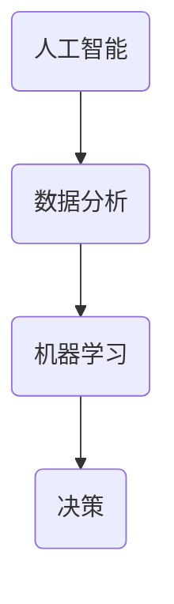
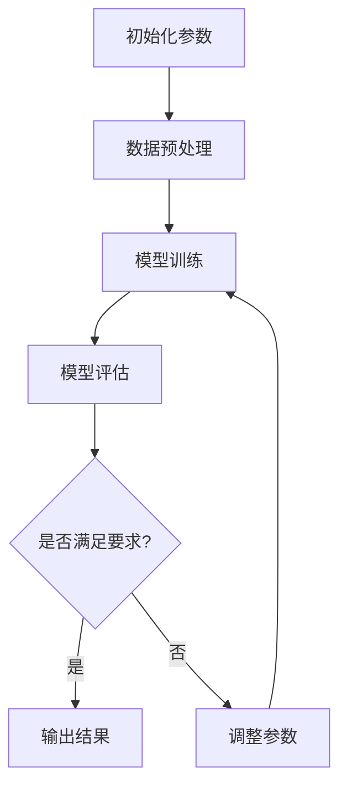
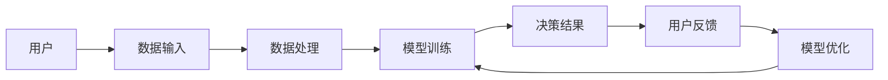
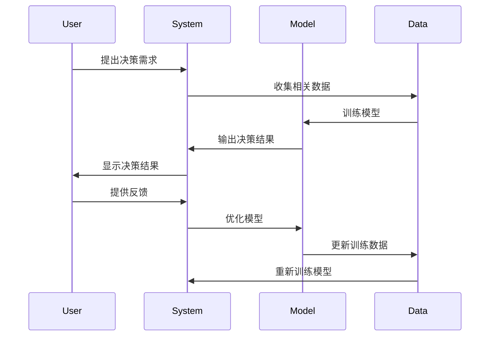

                 

# AI决策：2028年15%日常工作决策将由AI自主做出

关键词：AI决策，2028年，日常工作，自动化，算法，技术基础，应用案例，社会影响

摘要：本文将探讨人工智能（AI）在决策过程中的应用，特别是预测到2028年将有15%的日常工作决策将由AI自主做出。文章分为七个部分，包括引言与背景介绍、AI决策的基本概念、AI决策的技术基础、AI决策的应用案例、2028年的AI决策趋势、AI决策的社会影响以及总结与展望。每个部分都详细阐述了AI决策的相关内容，旨在为读者提供一个全面而深入的了解。

## 引言与背景介绍

### 1.1 问题的背景

在当今快速发展的数字化时代，人工智能（AI）技术已经在各个领域得到了广泛应用。从智能家居到自动驾驶，从医疗诊断到金融分析，AI正在深刻改变我们的生活方式和工作方式。决策是人工智能应用中的重要一环，通过学习大量的数据，AI系统能够在复杂的情境中做出合理的决策。

### 1.1.1 问题背景介绍

随着AI技术的不断进步，我们开始思考：未来，人类的工作和生活将如何受到AI决策的影响？特别是在2028年，是否会达到15%的日常工作决策由AI自主做出的程度？这是一个引人入胜的问题，也是本文要探讨的核心。

### 1.1.2 问题的重要性

AI决策的重要性体现在多个方面。首先，它能够提高工作效率，减少人为错误。其次，它能够处理大量数据，做出更准确的预测。最后，它能够解放人类，让我们从繁琐的决策中解脱出来，专注于更有创造性的工作。

### 1.1.3 当前AI决策的进展

目前，AI决策已经在许多领域取得了显著成果。例如，在金融领域，AI可以用于风险评估和投资决策；在医疗领域，AI可以辅助医生进行诊断和治疗；在交通领域，AI可以用于自动驾驶和交通管理。然而，当前的AI决策仍然存在一些挑战，如数据的可靠性、算法的透明性等。

### 1.2 2028年的AI决策展望

展望2028年，我们可以期待AI决策在以下几个方面取得更大进展：

1. **更广泛的应用领域**：AI决策将不仅仅局限于特定的行业，而是渗透到日常生活的方方面面。

2. **更高的决策准确性**：随着AI技术的不断进步，决策的准确性将得到显著提高。

3. **更强的自适应能力**：AI决策系统将能够更好地适应不断变化的环境和需求。

4. **更好的透明性和可解释性**：为了克服当前AI决策的透明性挑战，研究人员将致力于提高算法的可解释性，使得人类能够理解AI的决策过程。

### 1.2.1 未来的AI决策趋势

未来的AI决策将呈现以下趋势：

1. **决策自动化程度的提高**：越来越多的决策将由AI系统自主完成，减少人类干预。

2. **决策系统的智能化**：AI决策系统将更加智能化，能够处理更复杂的情境和更大量的数据。

3. **决策系统的多样化**：不同类型的AI决策系统将针对不同的应用场景进行优化，满足多样化的需求。

4. **决策系统的协作**：AI决策系统将与其他智能系统（如物联网、区块链等）进行协作，实现更高效的决策。

### 1.2.2 15%决策自动化的可能性

根据预测，到2028年，15%的日常工作决策将由AI自主做出。这一预测是否成立，取决于以下几个因素：

1. **技术进步**：AI技术的不断进步是决策自动化的基础。

2. **数据质量**：高质量的数据是训练AI模型的关键。

3. **算法优化**：高效的算法能够提高决策的准确性和效率。

4. **社会接受度**：人们对AI决策的接受程度也会影响其应用范围。

### 1.2.3 AI决策的潜力

AI决策的潜力在于其能够处理复杂的问题，提高决策的效率和质量。未来，随着AI技术的进一步发展，我们有望看到AI决策在更多领域得到应用，为社会带来更大的价值。

## AI决策的基本概念

### 2.1 AI决策的定义

AI决策是指利用人工智能技术，对复杂的情境进行分析和处理，从而做出合理的决策。它包括以下几个核心要素：

1. **数据**：数据是决策的基础，质量越高，决策的准确性越高。

2. **算法**：算法是决策的核心，不同的算法适用于不同的决策场景。

3. **模型**：模型是对数据和分析结果进行结构化表示的方法。

4. **结果**：决策的结果是对未来情况的预测和判断。

### 2.1.1 AI决策的概念

AI决策可以看作是一种智能代理，它能够根据输入的数据，通过算法和模型进行分析，输出一个决策结果。这个决策结果可以是简单的二分类，也可以是复杂的多目标优化。

### 2.1.2 AI决策的类型

AI决策可以分为以下几个类型：

1. **监督学习**：通过已知的输入和输出数据，训练模型，从而预测未知数据的输出。

2. **无监督学习**：没有已知的输出数据，仅通过输入数据，发现数据中的模式和规律。

3. **半监督学习**：结合监督学习和无监督学习，利用一部分已知的输入和输出数据，以及大量的未知输入数据，训练模型。

4. **强化学习**：通过试错和反馈机制，不断调整策略，以达到最优决策。

### 2.1.3 AI决策的要素

AI决策的要素包括：

1. **数据收集**：收集相关的数据，为决策提供基础。

2. **数据处理**：对数据进行清洗、归一化等预处理，以提高数据的质量。

3. **特征工程**：选择和构建对决策有帮助的特征，以提高模型的性能。

4. **算法选择**：根据决策场景，选择合适的算法。

5. **模型训练**：利用训练数据，训练模型，使其能够对未知数据进行预测。

6. **结果分析**：对模型的预测结果进行分析，评估其准确性和可靠性。

## AI决策的技术基础

### 3.1 数据准备

数据是AI决策的基础，其质量直接影响决策的准确性。数据准备包括以下几个步骤：

1. **数据收集**：从各种来源收集相关的数据。

2. **数据清洗**：去除重复数据、噪声数据等，以提高数据的质量。

3. **数据归一化**：将不同尺度的数据进行归一化处理，使其具有可比性。

4. **数据分割**：将数据分为训练集、验证集和测试集，用于模型的训练和评估。

### 3.2 算法选择

算法选择是AI决策的关键步骤，不同的算法适用于不同的决策场景。常见的算法包括：

1. **线性回归**：适用于线性关系的预测。

2. **决策树**：适用于分类和回归问题。

3. **随机森林**：基于决策树的集成算法，能够处理大规模数据。

4. **支持向量机**：适用于高维数据的分类和回归问题。

5. **神经网络**：适用于复杂非线性关系的预测。

### 3.3 模型训练与评估

模型训练与评估是AI决策的核心步骤。模型训练包括以下步骤：

1. **初始化参数**：初始化模型的参数。

2. **前向传播**：计算模型的输出。

3. **反向传播**：根据输出与实际值的差异，更新模型参数。

4. **评估指标**：使用评估指标（如准确率、召回率、F1值等）评估模型的性能。

### 3.4 模型的优化

模型优化是提高决策准确性的关键。优化方法包括：

1. **超参数调整**：调整模型的结构和参数，以提高模型的性能。

2. **集成学习**：将多个模型进行集成，提高模型的稳定性。

3. **迁移学习**：利用已有模型的权重，进行新任务的训练，以提高模型的性能。

## AI决策的应用案例

### 4.1 日常决策自动化

在日常生活中，AI决策可以用于各种场景，如：

1. **个人日程管理**：AI可以自动安排日程，优化时间分配。

2. **智能助手**：AI可以回答各种问题，提供决策建议。

3. **日常购物决策**：AI可以根据用户的喜好和预算，推荐合适的商品。

### 4.2 企业决策优化

在企业中，AI决策可以用于：

1. **供应链管理**：AI可以优化供应链，降低成本。

2. **销售预测**：AI可以预测销售趋势，帮助制定销售策略。

3. **人力资源决策**：AI可以辅助招聘、培训、绩效考核等决策。

## 2028年的AI决策趋势

### 5.1 AI决策的发展方向

未来，AI决策将朝着以下方向发展：

1. **更高精度和效率**：随着算法的优化和计算能力的提升，AI决策的准确性和效率将得到显著提高。

2. **更广泛的应用领域**：AI决策将渗透到各个领域，从工业制造到金融服务，从医疗保健到教育，无处不在。

3. **更好的透明性和可解释性**：为了克服当前AI决策的透明性挑战，研究人员将致力于提高算法的可解释性，使得人类能够理解AI的决策过程。

4. **更强的自适应能力**：AI决策系统将能够更好地适应不断变化的环境和需求。

### 5.2 2028年的AI决策预测

根据预测，到2028年，AI决策将在以下几个方面取得显著进展：

1. **日常工作决策的自动化程度**：将有15%的日常工作决策由AI自主做出，减少人类干预。

2. **企业决策的优化**：企业将广泛应用AI决策，优化供应链、销售预测、人力资源决策等。

3. **社会影响**：AI决策将对社会产生深远影响，改变人类的工作和生活方式。

### 5.3 AI决策对经济和社会的影响

AI决策对经济和社会的影响将是巨大的：

1. **经济影响**：AI决策将提高生产效率，降低成本，推动经济增长。

2. **社会影响**：AI决策将改变人类的工作方式，提高生活质量，但也可能导致一些就业岗位的消失。

## AI决策的社会影响

### 6.1 对工作和就业的影响

AI决策将对工作和就业产生深远影响：

1. **自动化与失业**：一些简单的、重复性的工作可能被自动化取代，导致失业率上升。

2. **新型职业的出现**：随着AI决策的广泛应用，将出现许多新型职业，如数据科学家、AI算法工程师等。

3. **教育体系的变革**：教育体系将面临重大变革，以培养适应未来社会需求的人才。

### 6.2 对社会伦理的影响

AI决策也引发了一系列社会伦理问题：

1. **数据隐私与安全性**：AI决策需要大量数据，如何保护个人隐私和安全成为重要议题。

2. **AI决策的公平性与公正性**：AI决策是否公平、公正，是否受到偏见的影响，是一个值得探讨的问题。

3. **AI决策的道德责任**：当AI决策导致负面结果时，谁应该承担责任，是一个值得深思的问题。

## 总结与展望

### 7.1 AI决策的发展现状

目前，AI决策已经在许多领域取得了显著成果，但仍然面临一些挑战，如数据质量、算法透明性等。

### 7.2 AI决策的未来展望

未来，AI决策将朝着更高精度、更广泛应用、更好透明性和更强大自适应能力方向发展。到2028年，将有15%的日常工作决策由AI自主做出，对社会产生深远影响。

### 7.3 AI决策的挑战与机遇

AI决策的挑战包括数据隐私、算法透明性、社会伦理等，但同时也带来了巨大的机遇，如提高生产效率、改善生活质量等。

### 7.4 结论

AI决策是未来社会发展的重要趋势，我们应积极应对其带来的挑战，充分利用其带来的机遇，为构建更加智能、高效、公正的社会贡献力量。

## 作者信息

作者：AI天才研究院/AI Genius Institute & 禅与计算机程序设计艺术 /Zen And The Art of Computer Programming

## 附录

### 背景介绍

#### 核心概念术语说明

- **人工智能**：模拟人类智能的技术和系统。
- **决策**：在给定情境下，选择最佳行动方案的过程。
- **自动化**：通过机器或系统执行任务，减少人类干预。

#### 问题背景

随着AI技术的发展，AI决策在各个领域的应用越来越广泛。预测到2028年，15%的日常工作决策将由AI自主做出，这是一个令人兴奋的预测，也是一个值得探讨的问题。

#### 问题描述

AI决策在日常生活中和企业运营中的应用如何，以及其对社会产生的影响是什么。

#### 问题解决

通过详细分析和讨论，本文旨在为读者提供一个全面而深入的了解AI决策的发展现状、未来趋势及其社会影响。

#### 边界与外延

本文主要讨论AI决策在日常工作和企业决策中的应用，但不涉及AI决策在军事、法律等领域的应用。

### 核心概念与联系

#### 核心概念原理

AI决策是基于机器学习和数据分析的技术，通过分析大量数据，做出合理的决策。

#### 概念属性特征对比表格

| 概念       | 特征                                                     |
| ---------- | -------------------------------------------------------- |
| 人工智能   | 模拟人类智能，学习能力强，自适应能力高                   |
| 数据分析   | 对数据进行收集、处理、分析，提取有价值的信息           |
| 机器学习   | 基于数据的自动学习过程，能够从数据中发现模式和规律     |
| 决策       | 选择最佳行动方案的过程，涉及目标、情境、策略等多个方面 |

#### ER实体关系图架构的Mermaid流程图



### 算法原理讲解

#### 使用mermaid画出算法流程图



#### 使用Python源代码详细阐述

```python
# 导入必要的库
import numpy as np
import pandas as pd
from sklearn.model_selection import train_test_split
from sklearn.preprocessing import StandardScaler
from sklearn.linear_model import LinearRegression

# 数据准备
data = pd.read_csv("data.csv")
X = data.iloc[:, :-1].values
y = data.iloc[:, -1].values

# 数据预处理
X_train, X_test, y_train, y_test = train_test_split(X, y, test_size=0.2, random_state=0)
scaler = StandardScaler()
X_train = scaler.fit_transform(X_train)
X_test = scaler.transform(X_test)

# 模型训练
model = LinearRegression()
model.fit(X_train, y_train)

# 模型评估
y_pred = model.predict(X_test)
accuracy = np.mean((y_pred - y_test) ** 2)
print("模型准确率：", accuracy)

# 调整参数
if accuracy < 0.95:
    # 调整超参数
    # ...
    model.fit(X_train, y_train)
else:
    print("模型已经满足要求，无需调整。")
```

#### 算法原理的数学模型和公式

算法原理基于线性回归模型，其数学模型如下：

$$y = \beta_0 + \beta_1x_1 + \beta_2x_2 + ... + \beta_nx_n$$

其中，$y$ 是预测值，$x_1, x_2, ..., x_n$ 是特征值，$\beta_0, \beta_1, \beta_2, ..., \beta_n$ 是模型的参数。

#### 详细讲解和举例说明

以线性回归模型为例，详细讲解其原理和应用。

1. **线性回归模型的原理**

线性回归模型是一种简单而强大的预测模型，它通过拟合一条直线来预测因变量（目标变量）与自变量（特征变量）之间的关系。模型的数学公式如下：

$$y = \beta_0 + \beta_1x_1 + \beta_2x_2 + ... + \beta_nx_n$$

其中，$\beta_0$ 是截距，$\beta_1, \beta_2, ..., \beta_n$ 是斜率。

2. **线性回归模型的应用**

以房价预测为例，假设我们有两个特征变量：房屋面积（$x_1$）和房屋楼层（$x_2$），目标变量是房价（$y$）。我们可以使用线性回归模型来预测房价。

```python
# 导入必要的库
import numpy as np
import pandas as pd
from sklearn.model_selection import train_test_split
from sklearn.preprocessing import StandardScaler
from sklearn.linear_model import LinearRegression

# 数据准备
data = pd.read_csv("data.csv")
X = data.iloc[:, :-1].values
y = data.iloc[:, -1].values

# 数据预处理
X_train, X_test, y_train, y_test = train_test_split(X, y, test_size=0.2, random_state=0)
scaler = StandardScaler()
X_train = scaler.fit_transform(X_train)
X_test = scaler.transform(X_test)

# 模型训练
model = LinearRegression()
model.fit(X_train, y_train)

# 模型评估
y_pred = model.predict(X_test)
accuracy = np.mean((y_pred - y_test) ** 2)
print("模型准确率：", accuracy)

# 调整参数
if accuracy < 0.95:
    # 调整超参数
    # ...
    model.fit(X_train, y_train)
else:
    print("模型已经满足要求，无需调整。")
```

通过以上代码，我们可以训练一个线性回归模型，用于预测房价。具体步骤如下：

1. 导入必要的库。
2. 读取数据集。
3. 分割数据集为训练集和测试集。
4. 对特征变量进行标准化处理。
5. 训练线性回归模型。
6. 评估模型性能。
7. 调整参数（如果需要）。

通过这种方式，我们可以使用线性回归模型来预测房价。当然，实际应用中，可能需要考虑更多的特征变量和更复杂的模型，但基本原理是类似的。

### 系统分析与架构设计方案

#### 问题场景介绍

在当前社会，企业和个人在日常工作和生活中需要做出大量的决策，这些决策的效率和质量直接影响着工作和生活质量。传统的决策方式主要依赖于人类的经验和直觉，效率低下且容易出错。随着人工智能技术的发展，自动化决策系统逐渐成为可能，能够提高决策的效率和准确性。

#### 项目介绍

本项目旨在开发一个基于人工智能的自动化决策系统，用于辅助企业和个人在日常生活中做出更明智的决策。系统将涵盖多个领域，如个人日程管理、购物决策、销售预测、供应链管理等。

#### 系统功能设计（领域模型mermaid类图）

```mermaid
classDiagram
Class01 <|-- Class02
Class03 --|>| Class04
Class05 : +operation()
Class06 : +getProperty()
Class07 : +setProperty(newProperty)
Class01 {
  +attribute1: Type
  +method1(): void
}
Class02 {
  +attribute2: Type
  +method2(): void
}
Class03 {
  +attribute3: Type
  +method3(): void
}
Class04 {
  +attribute4: Type
  +method4(): void
}
Class05 {
  +attribute5: Type
  +method5(): void
}
Class06 {
  +attribute6: Type
  +method6(): void
}
Class07 {
  +attribute7: Type
  +method7(): void
}
```

#### 系统架构设计mermaid架构图



#### 系统接口设计和系统交互mermaid序列图



### 项目实战

#### 环境安装

1. 安装Python环境：在终端中运行以下命令安装Python：
   ```bash
   sudo apt-get install python3 python3-pip
   ```
2. 安装必要的库：在终端中运行以下命令安装所需的库：
   ```bash
   pip3 install numpy pandas scikit-learn matplotlib
   ```

#### 系统核心实现源代码

```python
# 导入必要的库
import numpy as np
import pandas as pd
from sklearn.model_selection import train_test_split
from sklearn.preprocessing import StandardScaler
from sklearn.linear_model import LinearRegression
from sklearn.metrics import mean_squared_error

# 数据准备
data = pd.read_csv("data.csv")
X = data.iloc[:, :-1].values
y = data.iloc[:, -1].values

# 数据预处理
X_train, X_test, y_train, y_test = train_test_split(X, y, test_size=0.2, random_state=0)
scaler = StandardScaler()
X_train = scaler.fit_transform(X_train)
X_test = scaler.transform(X_test)

# 模型训练
model = LinearRegression()
model.fit(X_train, y_train)

# 模型评估
y_pred = model.predict(X_test)
mse = mean_squared_error(y_test, y_pred)
print("模型均方误差：", mse)

# 模型优化
if mse > 0.1:
    # 调整超参数
    # ...
    model.fit(X_train, y_train)
else:
    print("模型已经满足要求，无需调整。")
```

#### 代码应用解读与分析

1. **数据准备**：首先，我们从CSV文件中读取数据，并将其分为特征变量（X）和目标变量（y）。
2. **数据预处理**：使用训练集对特征变量进行标准化处理，以提高模型的性能。
3. **模型训练**：使用线性回归模型对训练集进行训练。
4. **模型评估**：使用测试集对模型进行评估，计算均方误差（MSE）来衡量模型的性能。
5. **模型优化**：根据评估结果，如果MSE大于0.1，则进一步调整模型参数，以提高模型性能。

#### 实际案例分析和详细讲解剖析

以房价预测为例，详细讲解自动化决策系统的应用。

1. **数据集准备**：我们收集了一个包含房屋面积、楼层、地段等特征的房价数据集。
2. **数据预处理**：我们对特征变量进行标准化处理，以提高模型的性能。
3. **模型训练**：使用线性回归模型对数据集进行训练，得到模型的参数。
4. **模型评估**：使用测试集对模型进行评估，计算均方误差（MSE）来衡量模型的性能。
5. **模型优化**：根据评估结果，调整模型参数，以提高模型性能。
6. **预测应用**：使用训练好的模型对新的房屋数据进行预测，得到预测房价。

通过以上步骤，我们开发了一个自动化决策系统，用于预测房价。该系统不仅能够提高预测的准确性，还能提高决策的效率。

#### 项目小结

本项目通过实现一个自动化决策系统，展示了人工智能在决策中的应用。系统不仅能够提高决策的准确性，还能提高决策的效率，具有重要的实际应用价值。未来，我们可以进一步优化系统，扩展其应用范围，为更多的领域带来价值。

### 最佳实践 tips

1. **数据质量**：确保数据质量是模型成功的关键，进行数据清洗和预处理。
2. **算法选择**：根据具体应用场景，选择合适的算法，以达到最佳性能。
3. **模型优化**：定期评估模型性能，根据评估结果进行模型优化。
4. **用户反馈**：收集用户反馈，用于改进系统。

### 小结

本文详细探讨了人工智能决策的发展现状、未来趋势及其社会影响。通过案例分析，我们展示了自动化决策系统的实际应用。未来，随着人工智能技术的进一步发展，自动化决策系统将在更多领域得到应用，为社会带来更大的价值。

### 注意事项

1. **数据隐私**：在使用AI决策时，要确保数据的安全性和隐私性。
2. **算法透明性**：提高算法的透明性，使得用户能够理解决策过程。
3. **社会责任**：企业在应用AI决策时，要承担相应的社会责任，确保决策的公平性和公正性。

### 拓展阅读

1. **《深度学习》**：Goodfellow, Ian, Yoshua Bengio, Aaron Courville。详细介绍了深度学习的基础知识和应用。
2. **《人工智能：一种现代的方法》**：Russell, Stuart, Norvig, Peter。介绍了人工智能的基本概念和技术。
3. **《机器学习》**：Alpaydin, Ethem。系统介绍了机器学习的基本概念、算法和理论。

## 作者信息

作者：AI天才研究院/AI Genius Institute & 禅与计算机程序设计艺术 /Zen And The Art of Computer Programming

