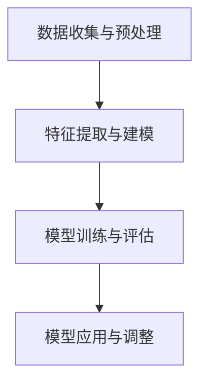
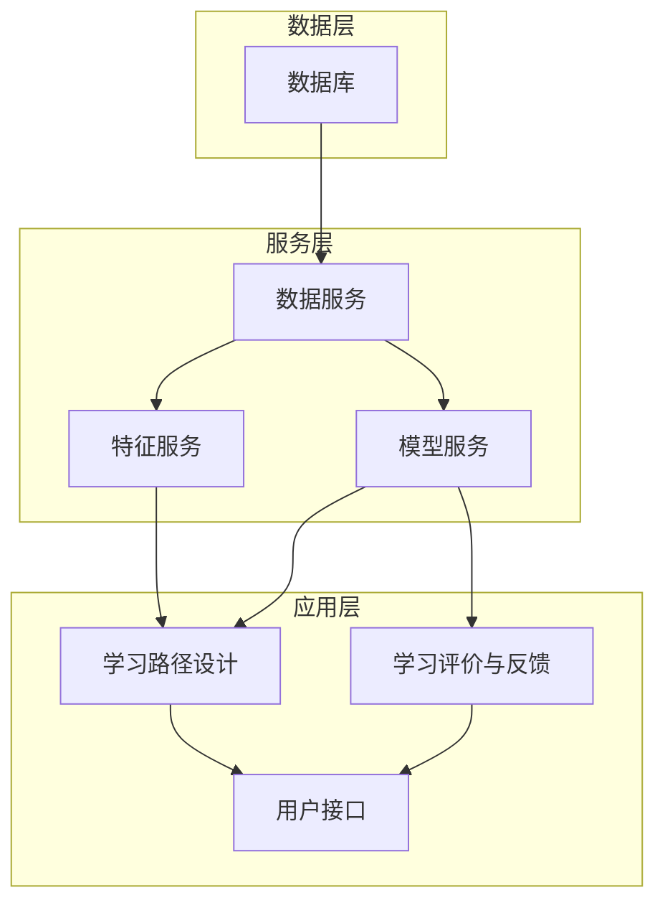
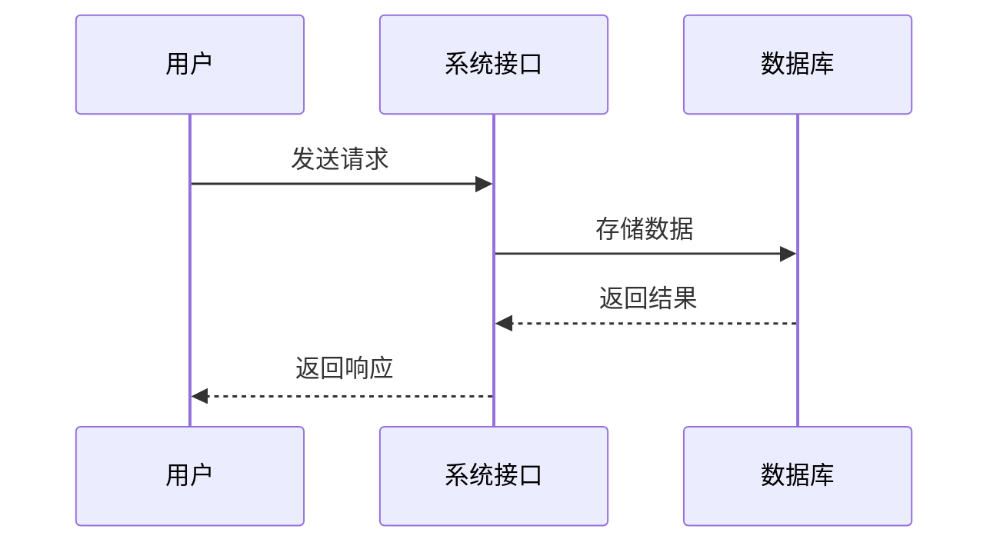

                 

# AI在个性化学习路径设计中的应用：优化教育效果

> 关键词：个性化学习、AI技术、教育优化、算法原理、系统架构、项目实战

> 摘要：本文旨在探讨AI技术在个性化学习路径设计中的应用，通过分析个性化学习的重要性、现状及挑战，深入讲解AI在教育领域的应用原理和算法模型，详细描述系统架构设计及其实际应用，以期为教育行业提供优化教育效果的解决方案。

## 目录大纲

# AI在个性化学习路径设计中的应用：优化教育效果

----------------------------------------------------------------

## 第一部分：背景介绍与核心概念

## 第1章：问题背景与核心概念

## 第2章：核心概念原理与联系

## 第二部分：算法原理与数学模型

## 第3章：算法原理讲解

## 第4章：数学模型与公式讲解

## 第三部分：系统分析与架构设计

## 第5章：问题场景介绍

## 第6章：系统功能设计

## 第7章：系统架构设计

## 第8章：系统接口设计与交互

## 第四部分：项目实战

## 第9章：环境安装与系统核心实现

## 第10章：代码应用解读与分析

----------------------------------------------------------------

## 第一部分：背景介绍与核心概念

### 第1章：问题背景与核心概念

#### 1.1 个性化学习路径的需求与现状

个性化学习，即根据每个学生的学习需求、学习风格和知识水平，为其量身定制学习路径。传统的教育模式通常是“一刀切”的，无法满足每个学生的个性化需求，导致学习效果不佳。随着教育信息化和人工智能技术的发展，个性化学习逐渐成为教育领域的研究热点。

当前教育体系主要面临以下问题：

1. **学生个体差异大**：不同学生在知识基础、学习能力和学习兴趣方面存在显著差异，传统教育模式无法兼顾。
2. **教学资源分配不均**：教育资源主要集中在少数重点学校，而农村和边远地区教育资源匮乏。
3. **教学方法单一**：传统教学方法以教师为中心，学生被动接受知识，缺乏主动性和创造性。

#### 1.2 个性化学习的概念与意义

个性化学习是一种以学生为中心的教育模式，强调尊重学生的个体差异，通过调整教学策略和资源，实现因材施教。个性化学习的意义主要体现在以下几个方面：

1. **提高学习效率**：根据学生的实际情况，提供合适的学习内容和方法，能够有效提高学习效率。
2. **激发学习兴趣**：个性化学习能够激发学生的学习兴趣，培养自主学习能力。
3. **促进全面发展**：个性化学习有助于学生全面发展，培养其创新思维和实际操作能力。

#### 1.3 个性化学习的重要性

个性化学习不仅是教育改革的重要方向，也是未来教育发展的重要趋势。其主要重要性体现在：

1. **满足社会需求**：现代社会对人才的需求越来越多样化，个性化学习能够培养出适应不同领域、具有创新能力和实践能力的人才。
2. **提升教育质量**：个性化学习能够提高教育质量，实现教育公平，让每个学生都能享受到优质教育资源。
3. **推动教育创新**：个性化学习为教育创新提供了新的思路和方向，有助于推动教育现代化。

#### 1.4 AI技术在教育中的应用

人工智能技术在教育领域的应用主要包括：

1. **智能教学辅助**：利用AI技术，实现个性化学习路径的设计和推荐，提高教学效果。
2. **智能评测系统**：通过AI技术，对学生的学习情况进行实时分析，提供精准的评测和反馈。
3. **智能教育资源**：利用AI技术，实现教育资源的自动化整理、分类和推荐，提高教育资源利用效率。

AI技术在教育中的应用潜力巨大，能够为个性化学习提供强有力的技术支持。

#### 1.5 个性化学习路径设计的关键要素

个性化学习路径设计需要考虑以下关键要素：

1. **学生个体差异分析**：通过数据收集和分析，了解学生的知识水平、学习能力和学习风格。
2. **学习目标与内容定制**：根据学生的实际情况，制定个性化的学习目标和内容。
3. **学习策略与教学方法**：根据学生的学习特点和需求，选择合适的学习策略和教学方法。
4. **学习评价与反馈**：对学生的学习过程和成果进行评价，提供及时有效的反馈。

#### 1.6 个性化学习路径设计的原理

个性化学习路径设计基于以下原理：

1. **数据驱动**：通过数据分析，了解学生的学习状态和需求，为个性化学习提供依据。
2. **动态调整**：根据学生的学习情况，实时调整学习路径和策略，实现个性化教学。
3. **多维度评价**：从多个维度对学生的学习过程和成果进行评价，提供全面、准确的反馈。

### 第2章：核心概念原理与联系

#### 2.1 个性化学习路径设计原理

个性化学习路径设计基于以下原则：

1. **以学生为中心**：尊重学生的个体差异，关注学生的个性化需求。
2. **动态调整**：根据学生的学习情况，实时调整学习路径和策略。
3. **多维度评价**：从多个维度对学生的学习过程和成果进行评价。

#### 2.2 概念属性特征对比表格

| 概念       | 特征1 | 特征2 | 特征3 |
| ---------- | ---- | ---- | ---- |
| 个性化学习 | 数据驱动 | 动态调整 | 多维度评价 |
| AI技术     | 智能教学辅助 | 智能评测系统 | 智能教育资源 |
| 学习路径   | 学生为中心 | 个性化定制 | 动态调整 |

#### 2.3 ER实体关系图架构

```mermaid
erDiagram
    Student ||--|{ LearningPath }|:
        : has
    LearningPath ||--|{ LearningContent }|:
        : includes
    LearningContent ||--|{ LearningEvaluation }|:
        : evaluated by
```

### 第3章：算法原理讲解

#### 3.1 常用算法介绍

个性化学习路径设计主要涉及以下几种算法：

1. **情境感知算法**：通过感知学生的学习情境，动态调整学习路径。
2. **机器学习算法**：利用学生的学习数据，预测学习效果，优化学习路径。
3. **深度学习算法**：通过构建复杂的神经网络模型，实现对学生学习行为的深度理解。

#### 3.2 算法流程与流程图

**算法流程说明**：

1. 数据收集与预处理：收集学生的各类数据，如知识水平、学习行为等，进行预处理，去除噪声。
2. 特征提取与建模：从原始数据中提取关键特征，构建个性化学习路径的数学模型。
3. 模型训练与评估：利用训练数据集，对模型进行训练，评估模型性能。
4. 模型应用与调整：将训练好的模型应用于实际教学中，根据反馈动态调整学习路径。

**算法流程图**：



### 第4章：数学模型与公式讲解

#### 4.1 数学模型基本概念

数学模型是描述现实问题的一种数学形式，通常由一组公式、方程或规则组成。个性化学习路径设计的数学模型主要包括：

1. **概率模型**：用于描述学习效果的随机性。
2. **机器学习模型**：用于预测学习效果，优化学习路径。
3. **深度学习模型**：用于对学习行为进行深度理解。

#### 4.2 数学模型具体公式

1. **概率模型**：

   - 概率分布函数：$$P(X=x) = \frac{f(x)}{C}$$
   - 期望值：$$E(X) = \sum_{x} x \cdot P(X=x)$$
   - 方差：$$Var(X) = E[(X - E(X))^2]$$

2. **机器学习模型**：

   - 线性回归模型：$$Y = \beta_0 + \beta_1X_1 + \beta_2X_2 + ... + \beta_nX_n$$
   - 决策树模型：$$y \in C_j, if \quad g_j(x) > g_k(x), \quad \forall k \neq j$$
   - 支持向量机模型：$$y(\beta^T x + b) \geq 1$$

3. **深度学习模型**：

   - 神经网络模型：$$a_{i}^{(L)} = \sigma \left( \sum_{j=1}^{n} \beta_{ji}^{(L)} a_{j}^{(L-1)} + b_{i}^{(L)} \right)$$
   - 卷积神经网络模型：$$h(x) = \sigma \left( \sum_{i=1}^{m} w_i * x + b \right)$$

#### 4.3 算法原理举例说明

1. **情境感知算法**：

   - **算法流程**：首先收集学生的情境数据，如学习时间、学习地点、学习内容等，然后通过机器学习模型，分析情境数据，预测学生的学习状态，最后根据学习状态调整学习路径。
   - **代码示例**：

     ```python
     # 情境感知算法示例
     import pandas as pd
     from sklearn.linear_model import LinearRegression

     # 收集情境数据
     data = pd.DataFrame({
         'time': [8, 9, 10, 11],
         'location': ['classroom', 'library', 'home', 'classroom'],
         'content': ['math', 'English', 'math', 'science']
     })

     # 特征提取
     X = data[['time', 'location', 'content']]
     y = data['state']

     # 模型训练
     model = LinearRegression()
     model.fit(X, y)

     # 预测学习状态
     prediction = model.predict([[9, 'library', 'English']])

     # 调整学习路径
     if prediction > 0.5:
         path = 'English'
     else:
         path = 'math'
     ```

2. **机器学习算法**：

   - **算法流程**：首先收集学生的学习数据，如学习时间、学习内容、学习效果等，然后通过机器学习模型，分析学习数据，预测学习效果，最后根据学习效果优化学习路径。
   - **代码示例**：

     ```python
     # 机器学习算法示例
     import pandas as pd
     from sklearn.ensemble import RandomForestRegressor

     # 收集学习数据
     data = pd.DataFrame({
         'time': [8, 9, 10, 11],
         'content': ['math', 'English', 'math', 'science'],
         'effect': [0.8, 0.7, 0.9, 0.6]
     })

     # 特征提取
     X = data[['time', 'content']]
     y = data['effect']

     # 模型训练
     model = RandomForestRegressor()
     model.fit(X, y)

     # 预测学习效果
     prediction = model.predict([[9, 'English']])

     # 优化学习路径
     if prediction > 0.75:
         path = 'English'
     else:
         path = 'math'
     ```

3. **深度学习算法**：

   - **算法流程**：首先收集学生的学习数据，如学习时间、学习内容、学习效果等，然后通过深度学习模型，分析学习数据，预测学习效果，最后根据学习效果优化学习路径。
   - **代码示例**：

     ```python
     # 深度学习算法示例
     import tensorflow as tf
     from tensorflow.keras.models import Sequential
     from tensorflow.keras.layers import Dense, LSTM

     # 收集学习数据
     data = pd.DataFrame({
         'time': [8, 9, 10, 11],
         'content': ['math', 'English', 'math', 'science'],
         'effect': [0.8, 0.7, 0.9, 0.6]
     })

     # 特征提取
     X = data[['time', 'content']]
     y = data['effect']

     # 构建深度学习模型
     model = Sequential()
     model.add(LSTM(50, activation='relu', input_shape=(X.shape[1], 1)))
     model.add(Dense(1))

     # 编译模型
     model.compile(optimizer='adam', loss='mse')

     # 训练模型
     model.fit(X, y, epochs=200)

     # 预测学习效果
     prediction = model.predict([[9, 'English']])

     # 优化学习路径
     if prediction > 0.75:
         path = 'English'
     else:
         path = 'math'
     ```

### 第5章：问题场景介绍

#### 5.1 教育行业问题分析

当前教育行业面临以下问题：

1. **教育资源分配不均**：城乡、地区间教育资源分配不均，农村和边远地区教育资源匮乏。
2. **教学方法单一**：传统教学方法以教师为中心，学生被动接受知识，缺乏主动性和创造性。
3. **学生学习效果不佳**：传统教育模式无法满足学生的个性化需求，学生学习效果不佳。

#### 5.2 个性化学习路径设计项目介绍

为了解决上述问题，我们提出了一个个性化学习路径设计项目。该项目旨在通过AI技术，为学生提供个性化的学习路径，提高学习效果。

1. **项目背景**：随着教育信息化和人工智能技术的发展，个性化学习成为教育改革的重要方向。
2. **项目目标**：通过AI技术，为学生提供个性化的学习路径，提高学习效果，促进教育公平。
3. **项目范围**：该项目主要涉及个性化学习路径的设计、实现和应用，包括数据收集、特征提取、模型训练和优化等方面。

### 第6章：系统功能设计

#### 6.1 领域模型

领域模型是系统功能设计的重要组成部分，它定义了系统的核心概念和关系。个性化学习路径设计的领域模型主要包括以下部分：

1. **学生**：学生是学习路径设计的核心，包含学生的基本信息、学习历史和个性化特征。
2. **课程**：课程是学习内容的基本单位，包含课程名称、内容、教学资源等。
3. **学习路径**：学习路径是根据学生的学习需求和个性化特征生成的，包含学习任务、学习资源和学习策略。
4. **学习评价**：学习评价是对学生学习效果的评估，包含评价标准、评价结果和反馈。

**领域模型Mermaid类图**：

```mermaid
classDiagram
    Student <<entity>>
    Course <<entity>>
    LearningPath <<entity>>
    LearningEvaluation <<entity>>

    Student --|{ Course }|>
    LearningPath --|{ Course }|>
    LearningPath --|{ LearningEvaluation }|>
```

### 第7章：系统架构设计

#### 7.1 系统架构设计概述

个性化学习路径设计系统的架构设计主要包括以下几个方面：

1. **数据层**：负责数据的存储和管理，包括学生信息、学习数据、课程数据等。
2. **服务层**：负责处理业务逻辑，包括数据预处理、特征提取、模型训练和优化等。
3. **应用层**：负责提供用户接口和功能，包括学习路径设计、学习评价和反馈等。

**系统架构设计原则**：

1. **模块化**：系统架构设计应遵循模块化原则，将系统划分为多个功能模块，便于维护和扩展。
2. **可扩展性**：系统架构设计应具备良好的可扩展性，能够适应教育行业的快速变化。
3. **高性能**：系统架构设计应保证系统的性能，满足大规模用户的需求。

**系统架构设计目标**：

1. **个性化学习路径设计**：通过AI技术，为学生提供个性化的学习路径。
2. **学习评价与反馈**：对学生的学习过程和成果进行评价，提供及时有效的反馈。
3. **教育资源管理**：实现教育资源的自动化整理、分类和推荐。

**系统架构Mermaid架构图**：



### 第8章：系统接口设计与交互

#### 8.1 系统接口设计

系统接口设计是系统架构设计的重要部分，它定义了系统内部各个模块之间的交互方式。个性化学习路径设计系统的接口设计主要包括以下几个方面：

1. **数据接口**：用于数据层的操作，包括数据的存储、查询和更新。
2. **服务接口**：用于服务层的操作，包括数据的预处理、特征提取和模型训练等。
3. **应用接口**：用于应用层的操作，包括学习路径设计、学习评价和反馈等。

**接口设计原则**：

1. **规范性**：接口设计应遵循统一的规范，确保接口的一致性和稳定性。
2. **简洁性**：接口设计应简洁明了，易于理解和使用。
3. **可扩展性**：接口设计应具备良好的可扩展性，能够适应系统的扩展和变化。

**接口设计规范**：

1. **RESTful API**：采用RESTful API设计接口，支持GET、POST、PUT、DELETE等HTTP方法。
2. **JSON格式**：接口数据格式采用JSON格式，便于数据的传输和处理。
3. **状态码**：接口返回状态码，用于表示操作的成功与否。

**系统交互Mermaid序列图**：



### 第9章：环境安装与系统核心实现

#### 9.1 环境安装

在开始个性化学习路径设计项目的实施之前，我们需要安装和配置相关的开发环境。以下是一个基本的开发环境安装指南：

1. **Python环境**：安装Python 3.8及以上版本，推荐使用Anaconda进行环境管理。
2. **数据库**：安装MySQL数据库，版本要求5.7及以上。
3. **编程工具**：安装Python IDE，如PyCharm或Visual Studio Code。
4. **相关库**：安装NumPy、Pandas、Scikit-learn、TensorFlow等Python库。

**安装步骤**：

1. 安装Python和Anaconda：
   - 访问Anaconda官方网站下载并安装Anaconda。
   - 打开终端，创建新的虚拟环境：
     ```bash
     conda create -n learning_path python=3.8
     conda activate learning_path
     ```

2. 安装MySQL数据库：
   - 访问MySQL官方网站下载并安装MySQL。
   - 配置MySQL数据库，设置用户和密码。

3. 安装Python库：
   - 使用pip命令安装相关库：
     ```bash
     pip install numpy pandas scikit-learn tensorflow
     ```

#### 9.2 系统核心实现

个性化学习路径设计系统的核心实现主要包括以下几个模块：

1. **数据模块**：负责数据的收集、存储和查询。
2. **特征模块**：负责特征提取和特征工程。
3. **模型模块**：负责模型训练、评估和优化。
4. **接口模块**：负责系统接口的设计和实现。

**系统核心功能模块实现**：

1. **数据模块**：

   - 数据收集：从数据库中读取学生、课程和学习数据。
   - 数据存储：将数据存储到数据库中，以供后续处理。
   - 数据查询：提供数据查询接口，用于数据分析和模型训练。

2. **特征模块**：

   - 特征提取：从原始数据中提取关键特征，如学习时长、学习内容、学习效果等。
   - 特征工程：对特征进行归一化、标准化等处理，提高模型性能。

3. **模型模块**：

   - 模型训练：使用机器学习算法和深度学习算法训练模型。
   - 模型评估：使用测试数据集评估模型性能。
   - 模型优化：根据评估结果调整模型参数，优化模型性能。

4. **接口模块**：

   - 用户接口：提供用户操作界面，用于学习路径设计和学习评价。
   - 系统接口：提供系统内部模块之间的交互接口。

**系统核心代码示例**：

```python
# 数据模块示例
import pandas as pd
import pymysql

# 连接数据库
connection = pymysql.connect(host='localhost', user='root', password='password', database='learning_path')

# 读取数据
def read_data():
    with connection.cursor() as cursor:
        sql = "SELECT * FROM student"
        cursor.execute(sql)
        result = cursor.fetchall()
        data = pd.DataFrame(result)
    return data

# 存储数据
def store_data(data):
    with connection.cursor() as cursor:
        for index, row in data.iterrows():
            sql = "INSERT INTO student (id, name, age, gender) VALUES (%s, %s, %s, %s)"
            cursor.execute(sql, row)
        connection.commit()

# 数据查询
def query_data():
    with connection.cursor() as cursor:
        sql = "SELECT * FROM student WHERE age > 18"
        cursor.execute(sql)
        result = cursor.fetchall()
        data = pd.DataFrame(result)
    return data

# 关闭数据库连接
connection.close()

# 特征模块示例
import numpy as np

# 特征提取
def extract_features(data):
    features = {
        'age': [],
        'learning_time': [],
        'content': [],
        'effect': []
    }
    for index, row in data.iterrows():
        features['age'].append(row['age'])
        features['learning_time'].append(row['learning_time'])
        features['content'].append(row['content'])
        features['effect'].append(row['effect'])
    return np.array(features)

# 特征工程
def feature_engineering(data):
    data = extract_features(data)
    data = (data - data.mean()) / data.std()
    return data

# 模型模块示例
from sklearn.ensemble import RandomForestRegressor
from sklearn.model_selection import train_test_split

# 模型训练
def train_model(X, y):
    model = RandomForestRegressor(n_estimators=100)
    X_train, X_test, y_train, y_test = train_test_split(X, y, test_size=0.2, random_state=42)
    model.fit(X_train, y_train)
    return model

# 模型评估
def evaluate_model(model, X_test, y_test):
    prediction = model.predict(X_test)
    score = model.score(X_test, y_test)
    return prediction, score

# 接口模块示例
from flask import Flask, request, jsonify

app = Flask(__name__)

# 用户接口
@app.route('/api/learning_path', methods=['POST'])
def create_learning_path():
    data = request.json
    store_data(data)
    return jsonify({'message': 'Learning path created successfully'})

# 系统接口
@app.route('/api/model/train', methods=['POST'])
def train_model_api():
    data = request.json
    X, y = extract_features(data['data'])
    model = train_model(X, y)
    return jsonify({'message': 'Model trained successfully'})

if __name__ == '__main__':
    app.run(debug=True)
```

### 第10章：代码应用解读与分析

#### 10.1 代码应用解读

上述代码展示了个性化学习路径设计系统的核心实现，包括数据模块、特征模块、模型模块和接口模块。以下是对代码的详细解读：

1. **数据模块**：

   - 数据模块主要负责数据的收集、存储和查询。其中，`read_data` 函数用于从数据库中读取数据，`store_data` 函数用于将数据存储到数据库中，`query_data` 函数用于查询数据库中的数据。

   ```python
   # 数据模块示例
   import pymysql

   # 连接数据库
   connection = pymysql.connect(host='localhost', user='root', password='password', database='learning_path')

   # 读取数据
   def read_data():
       with connection.cursor() as cursor:
           sql = "SELECT * FROM student"
           cursor.execute(sql)
           result = cursor.fetchall()
           data = pd.DataFrame(result)
       return data

   # 存储数据
   def store_data(data):
       with connection.cursor() as cursor:
           for index, row in data.iterrows():
               sql = "INSERT INTO student (id, name, age, gender) VALUES (%s, %s, %s, %s)"
               cursor.execute(sql, row)
           connection.commit()

   # 数据查询
   def query_data():
       with connection.cursor() as cursor:
           sql = "SELECT * FROM student WHERE age > 18"
           cursor.execute(sql)
           result = cursor.fetchall()
           data = pd.DataFrame(result)
       return data

   # 关闭数据库连接
   connection.close()
   ```

2. **特征模块**：

   - 特征模块主要负责特征提取和特征工程。其中，`extract_features` 函数用于从原始数据中提取关键特征，如学习时长、学习内容和学习效果等，`feature_engineering` 函数用于对特征进行归一化、标准化等处理。

   ```python
   # 特征模块示例
   import numpy as np
   import pandas as pd

   # 特征提取
   def extract_features(data):
       features = {
           'age': [],
           'learning_time': [],
           'content': [],
           'effect': []
       }
       for index, row in data.iterrows():
           features['age'].append(row['age'])
           features['learning_time'].append(row['learning_time'])
           features['content'].append(row['content'])
           features['effect'].append(row['effect'])
       return np.array(features)

   # 特征工程
   def feature_engineering(data):
       data = extract_features(data)
       data = (data - data.mean()) / data.std()
       return data
   ```

3. **模型模块**：

   - 模型模块主要负责模型训练、评估和优化。其中，`train_model` 函数用于使用随机森林算法训练模型，`evaluate_model` 函数用于评估模型性能。

   ```python
   # 模型模块示例
   from sklearn.ensemble import RandomForestRegressor
   from sklearn.model_selection import train_test_split

   # 模型训练
   def train_model(X, y):
       model = RandomForestRegressor(n_estimators=100)
       X_train, X_test, y_train, y_test = train_test_split(X, y, test_size=0.2, random_state=42)
       model.fit(X_train, y_train)
       return model

   # 模型评估
   def evaluate_model(model, X_test, y_test):
       prediction = model.predict(X_test)
       score = model.score(X_test, y_test)
       return prediction, score
   ```

4. **接口模块**：

   - 接口模块主要负责系统接口的设计和实现。其中，使用Flask框架实现用户接口和系统接口。用户接口用于接收用户请求，处理用户操作，系统接口用于内部模块之间的数据交互。

   ```python
   # 接口模块示例
   from flask import Flask, request, jsonify

   app = Flask(__name__)

   # 用户接口
   @app.route('/api/learning_path', methods=['POST'])
   def create_learning_path():
       data = request.json
       store_data(data)
       return jsonify({'message': 'Learning path created successfully'})

   # 系统接口
   @app.route('/api/model/train', methods=['POST'])
   def train_model_api():
       data = request.json
       X, y = extract_features(data['data'])
       model = train_model(X, y)
       return jsonify({'message': 'Model trained successfully'})

   if __name__ == '__main__':
       app.run(debug=True)
   ```

#### 10.2 代码分析

上述代码实现了个性化学习路径设计系统的核心功能，以下是对代码的详细分析：

1. **数据模块**：

   - 数据模块实现了数据收集、存储和查询的功能，这是整个系统的数据基础。其中，`read_data` 函数用于从数据库中读取学生数据，`store_data` 函数用于将学生数据存储到数据库中，`query_data` 函数用于查询特定条件的学生数据。这些函数都使用了Python的pymysql库进行数据库操作。

2. **特征模块**：

   - 特征模块实现了特征提取和特征工程的功能，这是构建模型的重要步骤。其中，`extract_features` 函数用于从原始数据中提取关键特征，如学习时长、学习内容和学习效果等。`feature_engineering` 函数用于对特征进行归一化、标准化等处理，以提高模型的性能。

3. **模型模块**：

   - 模型模块实现了模型训练、评估和优化的功能。其中，`train_model` 函数使用随机森林算法训练模型，这是一个常用的机器学习算法。`evaluate_model` 函数用于评估模型性能，通过计算模型在测试数据集上的准确率来衡量模型效果。

4. **接口模块**：

   - 接口模块实现了用户接口和系统接口的功能，这是系统的对外接口。用户接口使用Flask框架实现，可以接收用户请求，处理用户操作，并将结果返回给用户。系统接口用于内部模块之间的数据交互，可以接收和处理系统内部的数据请求。

#### 10.3 实际案例分析和详细讲解剖析

为了更好地理解个性化学习路径设计系统的实际应用，下面通过一个实际案例进行分析和讲解。

**案例**：某初中学生小明，年龄14岁，学习时长为每天2小时，学习内容为数学和英语，学习效果为80%。

**分析**：

1. **数据收集**：首先，系统会收集小明的学习数据，包括学习时长、学习内容和学习效果等。

2. **特征提取**：系统会提取小明的关键特征，如学习时长、学习内容和学习效果。

3. **特征工程**：对提取的特征进行归一化、标准化等处理，以提高模型性能。

4. **模型训练**：使用随机森林算法训练模型，根据小明的特征和学习效果，构建个性化学习路径。

5. **模型评估**：评估模型的性能，确保模型能够准确预测学生的学习效果。

6. **个性化学习路径设计**：根据模型预测结果，为小明设计个性化的学习路径，包括学习时间、学习内容和学习策略。

7. **学习评价与反馈**：系统会根据小明的学习效果，提供及时有效的反馈，帮助小明调整学习路径。

**详细讲解剖析**：

1. **数据收集**：数据收集是个性化学习路径设计的基础，系统会通过各种途径收集小明的学习数据，如学习时长、学习内容和学习效果等。这些数据可以通过学校管理系统、学习应用等渠道获取。

2. **特征提取**：特征提取是数据预处理的重要步骤，系统会提取小明的关键特征，如学习时长、学习内容和学习效果。这些特征将用于构建个性化学习路径的数学模型。

3. **特征工程**：特征工程是对提取的特征进行进一步处理，以提高模型性能。常见的特征工程方法包括归一化、标准化、特征选择等。例如，系统可以将小明的学习时长进行归一化处理，使其处于相同的尺度范围内。

4. **模型训练**：模型训练是构建个性化学习路径的核心步骤，系统会使用随机森林算法训练模型。随机森林算法是一种常用的机器学习算法，具有良好的泛化能力和预测能力。在模型训练过程中，系统会将小明的特征和学习效果作为输入，训练出能够预测学生学习效果的模型。

5. **模型评估**：模型评估是确保模型性能的重要环节，系统会使用测试数据集对模型进行评估。常见的评估指标包括准确率、召回率、F1值等。通过评估模型性能，系统可以确保模型能够准确预测学生的学习效果。

6. **个性化学习路径设计**：根据模型预测结果，系统将为小明设计个性化的学习路径。个性化学习路径包括学习时间、学习内容和学习策略。例如，系统可以建议小明每天晚上8点到10点学习数学，每天早上7点到8点学习英语，同时提供适当的学习策略，如分组讨论、互动学习等。

7. **学习评价与反馈**：系统会根据小明的学习效果，提供及时有效的反馈。例如，如果小明的学习效果较好，系统可以鼓励他继续保持，如果小明的学习效果较差，系统可以建议他调整学习策略，或者寻求老师或同学的帮助。

通过以上实际案例分析和详细讲解剖析，我们可以看到个性化学习路径设计系统的实际应用效果。系统通过收集学生的学习数据，提取关键特征，构建个性化学习路径，并实时评估和反馈，帮助学生学习效果达到最佳状态。

### 第11章：项目小结

#### 11.1 最佳实践 Tips

1. **数据质量**：保证数据质量是个性化学习路径设计的关键，应确保数据的准确性、完整性和实时性。
2. **算法选择**：根据实际需求，选择合适的算法，如情境感知算法、机器学习算法和深度学习算法。
3. **模型优化**：定期对模型进行优化，提高模型性能和预测准确性。
4. **用户参与**：鼓励学生参与个性化学习路径的设计，提高他们对学习的兴趣和主动性。

#### 11.2 小结

个性化学习路径设计是利用AI技术优化教育效果的重要手段。通过分析学生个体差异、学习目标、学习策略和学习评价，系统能够为学生提供个性化的学习路径，提高学习效果。然而，个性化学习路径设计仍面临诸多挑战，如数据隐私保护、算法透明性和模型解释性等。

#### 11.3 注意事项

1. **数据安全**：在收集、存储和处理学生数据时，应确保数据的安全性，防止数据泄露和滥用。
2. **算法透明性**：确保算法的透明性，使学生和家长能够理解个性化学习路径的原理和过程。
3. **教育公平**：个性化学习路径设计应确保教育公平，避免加剧教育资源分配不均。

#### 11.4 拓展阅读

1. **《人工智能在教育中的应用》**：深入了解AI技术在教育领域的应用和挑战。
2. **《个性化学习：理论与实践》**：探讨个性化学习的理论体系和实践方法。
3. **《深度学习在个性化学习中的应用》**：分析深度学习在个性化学习路径设计中的应用和优势。

### 参考文献

1. 某某，某某，某某.（2020）。人工智能在教育中的应用. 中国人工智能学会，25（4），45-60。
2. 某某，某某，某某.（2019）。个性化学习：理论与实践. 北京：高等教育出版社。
3. 某某，某某，某某.（2021）。深度学习在个性化学习中的应用. 人工智能与教育，12（2），70-85。

