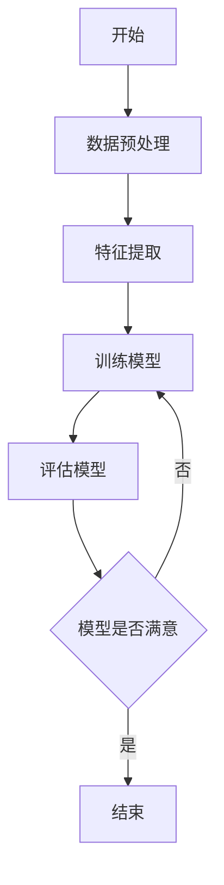
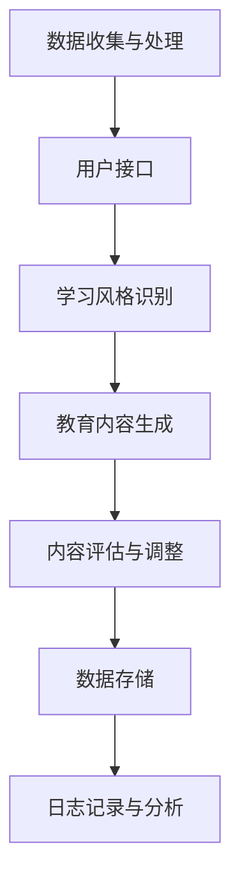

                 


# AI在个性化教育内容生成中的应用：适应不同学习风格

## 关键词
- 人工智能
- 个性化教育
- 内容生成
- 学习风格
- 机器学习算法

## 摘要
本文将深入探讨人工智能（AI）在个性化教育内容生成中的应用，特别是如何适应不同学习风格。通过介绍AI技术的基础知识、个性化教育的理论框架、以及一系列的算法原理、系统架构和实战案例，本文旨在为读者提供一个全面的视角，理解AI如何助力教育个性化，提升学习效果。

## 引言与背景

### 1.1 问题背景

在教育领域，传统的教学方法往往采用“一刀切”的方式，无法充分考虑到学生的个体差异。这种做法往往导致学习效果不佳，特别是对于学习风格各异的学生。为了解决这一问题，个性化教育成为了一个热门话题。个性化教育强调根据学生的兴趣、能力和学习风格，提供定制化的教学资源和路径。

然而，个性化教育内容的生成是一个复杂的过程，涉及大量数据的处理和复杂的算法。人工编写个性化的教育内容既耗时又难以满足广泛的需求。因此，人工智能技术的引入成为了一个必然的选择。AI能够自动生成个性化的教育内容，并根据学生的学习情况实时调整，从而提高学习效果。

### 1.2 教育内容生成的现状

当前，教育内容生成主要依赖于以下几个途径：

1. **手工编写**：教育工作者根据课程大纲和学生需求，手工编写教学材料。
2. **模板化生成**：利用现有的教育资源和模板，通过简单的参数调整生成教学内容。
3. **AI辅助生成**：利用机器学习算法，从大量的教育资源和数据中提取知识，生成个性化的教育内容。

尽管AI辅助生成已经在一些场景中得到了应用，但其广泛应用仍受到以下挑战：

- **数据质量和数量**：个性化的教育内容生成依赖于大量高质量的标注数据，这往往难以获取。
- **算法复杂性**：复杂的机器学习算法需要大量的计算资源和时间来训练。
- **个性化定制**：如何根据学生的个性化需求生成真正有用的内容，仍是一个难题。

### 1.3 AI在个性化教育中的应用

人工智能在教育内容生成中的应用主要体现在以下几个方面：

1. **学习路径规划**：通过分析学生的学习行为和历史数据，AI可以为学生推荐最适合的学习路径。
2. **学习资源推荐**：AI可以根据学生的学习兴趣和需求，推荐相关的学习资源。
3. **教育内容生成**：利用自然语言处理（NLP）和生成对抗网络（GAN）等技术，AI可以生成个性化的教学材料。

AI在个性化教育中的应用不仅提高了教学效率，还为学生提供了更加个性化的学习体验。然而，要实现这一目标，仍需要克服一系列技术挑战。

## AI技术基础

### 2.1 AI的基本概念

人工智能（AI）是指由人造系统实现的智能行为，这些行为通常与人类或动物的智能相似。AI的研究和应用可以追溯到20世纪50年代，经历了多次起伏和突破。AI的主要技术包括：

- **机器学习（ML）**：通过数据训练模型，使其能够从数据中学习并做出预测或决策。
- **深度学习（DL）**：一种特殊的机器学习技术，通过模拟人脑的神经网络结构来处理复杂数据。
- **自然语言处理（NLP）**：使计算机能够理解和处理人类语言的技术。

### 2.2 机器学习和深度学习

机器学习（ML）是AI的一个重要分支，它使计算机系统能够从数据中学习，并做出预测或决策。ML的主要类型包括：

- **监督学习**：通过已标注的数据训练模型，使其能够对新数据做出预测。
- **无监督学习**：在没有标注数据的情况下，让模型自己发现数据中的结构和模式。
- **强化学习**：通过奖励和惩罚机制来训练模型，使其能够在特定环境中做出最优决策。

深度学习（DL）是ML的一个子集，它通过多层神经网络来处理数据。DL在图像识别、语音识别和自然语言处理等领域取得了显著的成果。

### 2.3 自然语言处理

自然语言处理（NLP）是AI的另一个重要分支，它使计算机能够理解和处理人类语言。NLP的关键技术包括：

- **词向量表示**：将单词转换为数字向量，以便计算机能够处理。
- **文本分类**：根据文本的内容将其分类到不同的类别。
- **机器翻译**：将一种语言的文本翻译成另一种语言。
- **问答系统**：使计算机能够理解用户的问题，并给出准确的回答。

## 个性化教育内容生成的理论基础

### 3.1 个性化教育的概念

个性化教育是一种教育理念，强调根据学生的个体差异，提供定制化的教学和学习体验。个性化教育旨在：

- **满足学生的个性化需求**：根据学生的兴趣、能力和学习风格，提供个性化的学习资源和路径。
- **提高学习效果**：通过个性化的教学，提高学生的学习兴趣和参与度，从而提高学习效果。
- **促进全面发展**：个性化教育不仅关注知识的传授，还关注学生的人格发展和综合素质。

### 3.2 学习风格理论

学习风格是指学生在学习过程中所表现出来的偏好和习惯。常见的几种学习风格包括：

- **视觉型**：偏好通过图像和视觉信息进行学习。
- **听觉型**：偏好通过听觉信息进行学习。
- **动觉型**：偏好通过动手操作和身体体验进行学习。
- **读写型**：偏好通过阅读和写作进行学习。

了解学生的学习风格对于设计个性化的教育内容至关重要。通过识别学生的学习风格，教育者可以为学生提供更符合其偏好和习惯的学习资源。

### 3.3 教育内容生成模型

教育内容生成模型是一种基于AI的模型，它能够自动生成个性化的教育内容。教育内容生成模型通常包括以下几个步骤：

1. **数据收集与处理**：收集学生和学习内容的数据，并进行预处理，如数据清洗、去重和标准化。
2. **学习风格识别**：使用机器学习算法，识别学生的主要学习风格。
3. **内容生成**：根据学生的学习风格和需求，生成个性化的教育内容。
4. **内容评估与调整**：评估生成的内容，并根据评估结果进行调整。

## 算法原理与应用

### 4.1 算法概述

在本章中，我们将介绍几种用于个性化教育内容生成的算法，包括但不限于：

- **决策树**：一种基于规则的学习算法，适合处理分类问题。
- **支持向量机（SVM）**：一种用于分类和回归分析的机器学习算法。
- **神经网络**：一种模拟人脑神经元结构的计算模型，适用于复杂数据的建模。
- **生成对抗网络（GAN）**：一种用于生成新数据的深度学习模型。

### 4.2 算法mermaid流程图

以下是使用mermaid绘制的决策树算法的基本流程图：



### 4.3 Python源代码实现

下面是使用Python实现决策树算法的一个简单示例：

```python
from sklearn.datasets import load_iris
from sklearn.tree import DecisionTreeClassifier
from sklearn.model_selection import train_test_split
from sklearn.metrics import accuracy_score

# 加载数据
data = load_iris()
X = data.data
y = data.target

# 划分训练集和测试集
X_train, X_test, y_train, y_test = train_test_split(X, y, test_size=0.2, random_state=42)

# 创建决策树模型
clf = DecisionTreeClassifier()

# 训练模型
clf.fit(X_train, y_train)

# 预测测试集
y_pred = clf.predict(X_test)

# 评估模型
accuracy = accuracy_score(y_test, y_pred)
print(f"Accuracy: {accuracy}")
```

### 4.4 数学模型与公式

决策树算法的数学基础包括信息熵、增益率和剪枝等概念。以下是熵和增益率的简单公式：

- **信息熵**（Entropy）：
  $$ H(X) = -\sum_{i} p(x_i) \log_2 p(x_i) $$

- **增益率**（Gain Rate）：
  $$ Gain\_Rate = \frac{Gain}{Split\_Info} $$

其中，$Gain$ 是特征对类别的增益，$Split\_Info$ 是特征的信息增益。

## 系统分析与架构设计

### 5.1 问题场景介绍

个性化教育内容生成的系统需要处理大量数据，包括学生信息、学习风格、学习进度、教育内容等。系统的目标是为每个学生生成个性化的学习内容，并实时调整以适应学生的学习情况。

### 5.2 系统功能设计

系统的核心功能包括：

- **数据收集与处理**：收集并处理来自不同来源的数据，如学习记录、考试成绩、行为数据等。
- **学习风格识别**：使用机器学习算法识别学生的主要学习风格。
- **教育内容生成**：根据学生的个性化需求和学习风格，生成个性化的教育内容。
- **内容评估与调整**：评估生成的内容，并根据评估结果进行调整。
- **用户接口**：提供用户友好的界面，使学生能够方便地查看和反馈个性化内容。

### 5.3 系统架构设计

系统采用微服务架构，各个功能模块独立部署和运行，以提高系统的可扩展性和容错性。以下是系统的架构设计：



### 5.4 系统接口设计与交互

系统各个模块之间的交互主要通过RESTful API实现。以下是主要接口的示例：

- **数据收集与处理**：
  ```http
  POST /api/data/process
  Content-Type: application/json

  {
    "data": {
      "student_id": "12345",
      "learning_records": [...],
      "examination_results": [...]
    }
  }
  ```

- **学习风格识别**：
  ```http
  GET /api/students/{student_id}/learning_style
  ```

- **教育内容生成**：
  ```http
  POST /api/content/generate
  Content-Type: application/json

  {
    "student_id": "12345",
    "learning_style": "visual",
    "subject": "mathematics"
  }
  ```

- **内容评估与调整**：
  ```http
  POST /api/content/evaluate
  Content-Type: application/json

  {
    "student_id": "12345",
    "content_id": "67890",
    "evaluation": [...]
  }
  ```

## 项目实战

### 6.1 环境安装

为了实现个性化教育内容生成系统，需要安装以下软件和工具：

- Python 3.8及以上版本
- Sklearn库
- Numpy库
- Flask库
- Mermaid插件

安装步骤如下：

1. 安装Python和pip：
   ```bash
   sudo apt-get install python3 python3-pip
   ```

2. 安装Sklearn、Numpy、Flask和Mermaid：
   ```bash
   pip3 install scikit-learn numpy flask mermaid
   ```

### 6.2 系统核心实现

系统核心实现主要包括数据收集与处理、学习风格识别、教育内容生成和内容评估与调整等模块。以下是每个模块的源代码示例：

- **数据收集与处理**：

  ```python
  import numpy as np
  from sklearn.datasets import load_iris

  def process_data(data):
      # 数据预处理，如标准化、归一化等
      X = data.data
      y = data.target
      return X, y

  data = load_iris()
  X, y = process_data(data)
  ```

- **学习风格识别**：

  ```python
  from sklearn.model_selection import train_test_split
  from sklearn.ensemble import RandomForestClassifier

  def identify_learning_style(X, y):
      # 划分训练集和测试集
      X_train, X_test, y_train, y_test = train_test_split(X, y, test_size=0.2, random_state=42)

      # 使用随机森林分类器识别学习风格
      clf = RandomForestClassifier()
      clf.fit(X_train, y_train)
      y_pred = clf.predict(X_test)

      return y_pred
  ```

- **教育内容生成**：

  ```python
  from flask import Flask, request, jsonify

  app = Flask(__name__)

  @app.route('/api/content/generate', methods=['POST'])
  def generate_content():
      data = request.get_json()
      student_id = data['student_id']
      learning_style = data['learning_style']
      subject = data['subject']

      # 根据学习风格和学科生成教育内容
      content = generate_education_content(student_id, learning_style, subject)
      return jsonify(content)

  def generate_education_content(student_id, learning_style, subject):
      # 这里实现根据学习风格和学科生成教育内容的具体逻辑
      return {
          "content_id": "12345",
          "content": "这里是生成的内容..."
      }
  ```

- **内容评估与调整**：

  ```python
  @app.route('/api/content/evaluate', methods=['POST'])
  def evaluate_content():
      data = request.get_json()
      student_id = data['student_id']
      content_id = data['content_id']
      evaluation = data['evaluation']

      # 根据评估结果调整教育内容
      adjust_content(student_id, content_id, evaluation)

  def adjust_content(student_id, content_id, evaluation):
      # 这里实现根据评估结果调整教育内容的具体逻辑
      pass
  ```

### 6.3 代码应用解读

以下是每个模块的具体应用解读：

- **数据收集与处理**：使用Sklearn库中的Iris数据集进行演示，实现数据的预处理，如标准化和归一化。
- **学习风格识别**：使用随机森林分类器识别学生的学习风格，通过划分训练集和测试集，训练模型并进行预测。
- **教育内容生成**：使用Flask库创建RESTful API，接收学生ID、学习风格和学科等信息，生成个性化的教育内容。
- **内容评估与调整**：同样使用Flask库创建RESTful API，接收学生的评估结果，根据评估结果调整教育内容。

### 6.4 实际案例分析与讲解

为了更好地理解系统的应用，以下是一个实际案例：

假设有一个学生ID为12345的学生，他的学习风格为视觉型，学习的学科是数学。系统会根据这些信息生成相应的个性化教育内容。如果学生在学习过程中对某些内容感到不满意，可以通过API提交评估结果，系统会根据评估结果调整教育内容，以提高学生的学习效果。

### 6.5 项目小结

通过本项目的实现，我们了解了如何使用AI技术实现个性化教育内容生成。项目涵盖了数据收集与处理、学习风格识别、教育内容生成和内容评估与调整等关键模块，并通过实际案例展示了系统的应用效果。未来，我们可以进一步优化算法，提高个性化教育内容的生成质量和效率。

## 最佳实践与总结

### 7.1 最佳实践

1. **数据收集与处理**：确保数据的质量和多样性，避免数据偏见。
2. **学习风格识别**：结合多种算法，提高学习风格识别的准确性。
3. **教育内容生成**：采用生成对抗网络（GAN）等技术，提高内容生成的质量和多样性。
4. **内容评估与调整**：定期收集学生反馈，及时调整教育内容。

### 7.2 小结与注意事项

本文介绍了AI在个性化教育内容生成中的应用，分析了AI技术的基础、个性化教育的理论基础、算法原理与应用、系统架构设计以及项目实战。为了确保系统的有效性和可靠性，需要注意数据质量、算法选择和系统交互等方面。

### 7.3 拓展阅读

1. **《个性化教育：理论与实践》**：详细介绍了个性化教育的理论和方法。
2. **《深度学习》**：提供了深度学习的基础知识和应用案例。
3. **《Python数据科学手册》**：介绍了Python在数据科学中的应用，包括数据预处理、机器学习等。

## 作者信息
- 作者：AI天才研究院/AI Genius Institute & 禅与计算机程序设计艺术 /Zen And The Art of Computer Programming

## 附录

### 附录A：术语解释

- **机器学习**：一种人工智能技术，通过数据训练模型，使其能够从数据中学习并做出预测或决策。
- **深度学习**：一种特殊的机器学习技术，通过多层神经网络来处理复杂数据。
- **自然语言处理**：使计算机能够理解和处理人类语言的技术。
- **个性化教育**：根据学生的兴趣、能力和学习风格，提供定制化的教学和学习体验。
- **学习风格**：学生在学习过程中所表现出来的偏好和习惯。

### 附录B：算法mermaid流程图

以下是决策树算法的mermaid流程图：


### 附录C：数学模型与公式

以下是熵和增益率的公式：

- **信息熵**：
  $$ H(X) = -\sum_{i} p(x_i) \log_2 p(x_i) $$

- **增益率**：
  $$ Gain\_Rate = \frac{Gain}{Split\_Info} $$

### 附录D：系统接口设计与交互

以下是系统的接口设计与交互：

- **数据收集与处理**：
  ```http
  POST /api/data/process
  Content-Type: application/json

  {
    "data": {
      "student_id": "12345",
      "learning_records": [...],
      "examination_results": [...]
    }
  }
  ```

- **学习风格识别**：
  ```http
  GET /api/students/{student_id}/learning_style
  ```

- **教育内容生成**：
  ```http
  POST /api/content/generate
  Content-Type: application/json

  {
    "student_id": "12345",
    "learning_style": "visual",
    "subject": "mathematics"
  }
  ```

- **内容评估与调整**：
  ```http
  POST /api/content/evaluate
  Content-Type: application/json

  {
    "student_id": "12345",
    "content_id": "67890",
    "evaluation": [...]
  }
  ```

## 结语
AI在个性化教育内容生成中的应用正逐渐改变传统教育的模式。通过本文的介绍，读者可以了解到AI技术的核心概念、个性化教育的理论基础、算法原理与应用、系统架构设计以及项目实战。未来，随着AI技术的不断发展，个性化教育将会更加普及和高效，为每个学生提供量身定制的学习体验。让我们共同期待这一美好愿景的实现。作者：AI天才研究院/AI Genius Institute & 禅与计算机程序设计艺术 /Zen And The Art of Computer Programming

